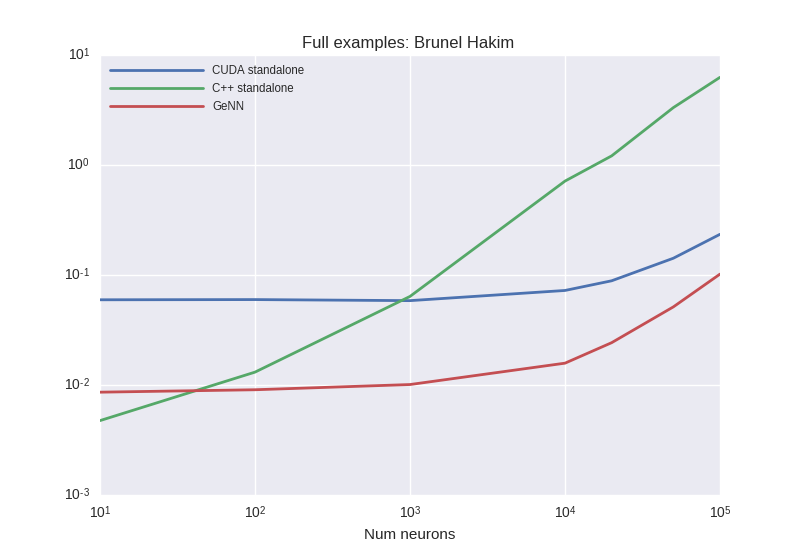
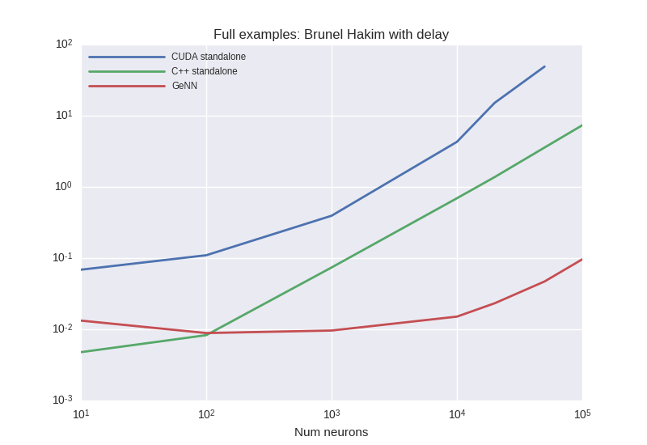
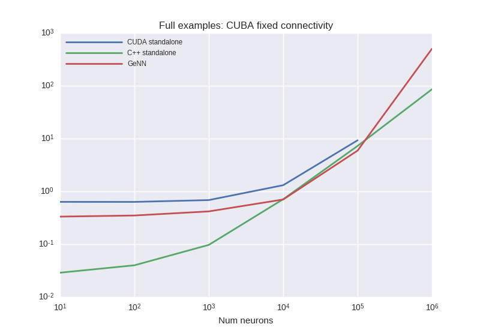
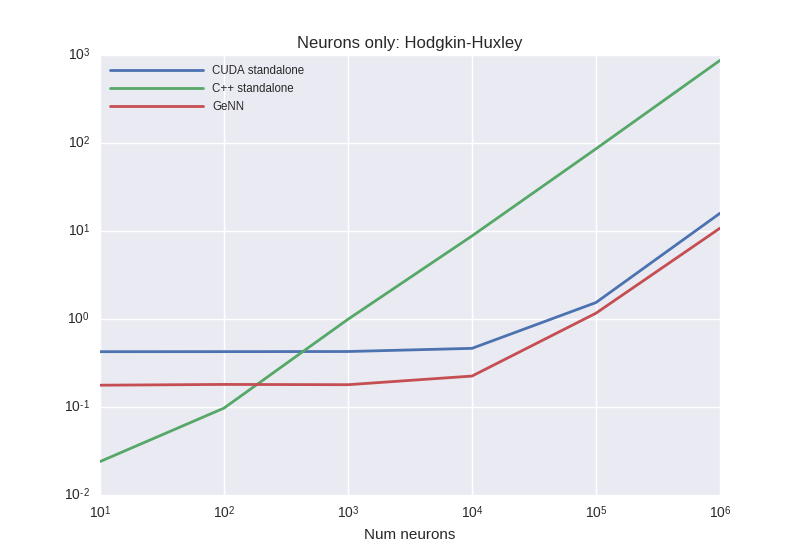
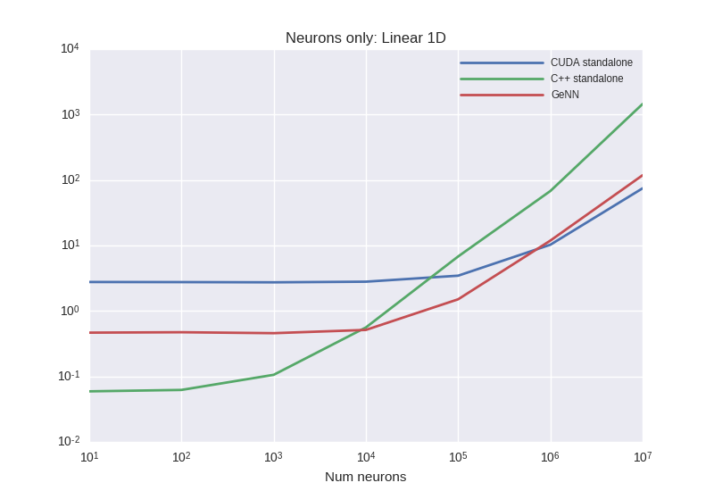
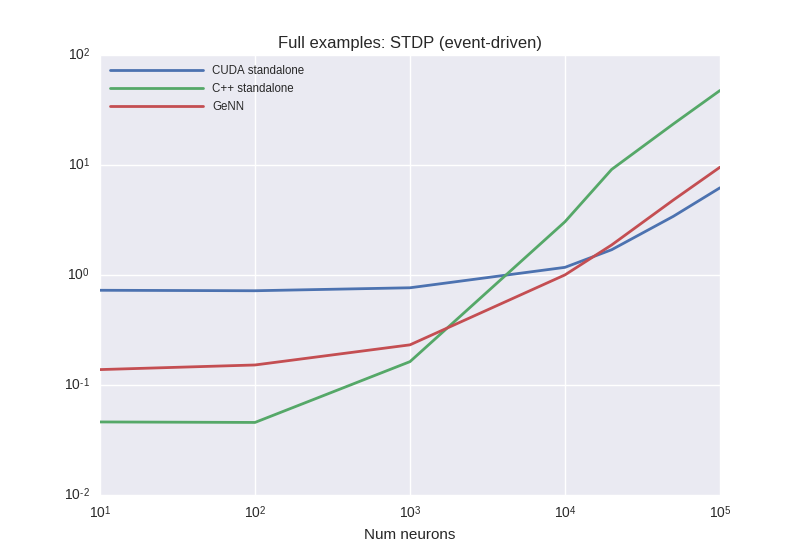
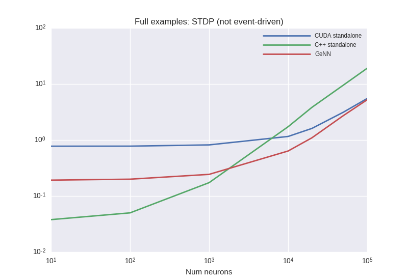

# Benchmark results from 27.02.2017
## Description:
Results of `no_or_const_delay_mode` implementation

## Results

### BrunelHakimModel

***

### BrunelHakimModelWithDelay

***

### CUBAFixedConnectivity

***

### HHNeuronsOnly

***

### LinearNeuronsOnly

***

### STDPEventDriven

***

### STDPNotEventDriven

***

### VerySparseMediumRateSynapsesOnly

***
