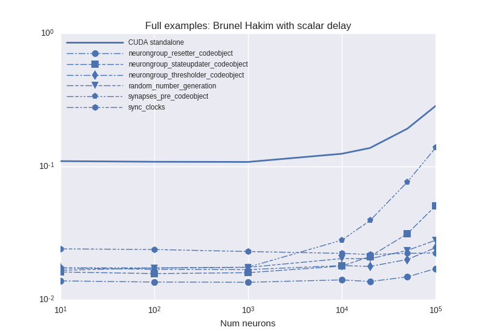

# Benchmark results from 15.03.2017
## Description:
These speed plots use clock synchronization and create random numbers at each clock cycle and use profiling (see `sync_clocks` and `random_number_generation` for the effect of those).


## Last git log:
```
commit 83b1db64fe6a347ea45286dadfec223bbeb55501
Author: Denis Alevi <mail@denisalevi.de>
Date:   Tue Mar 14 20:48:42 2017 +0100

    Set synaptic propagation modes only if variables are modified

    Before we just checked for occurences of `_postsynaptic_idx`,
    `_presynaptic_idx` and `_idx`. But just reading them doesn't lead to
    race conditions.

```
There is also a `git diff` saved in the current directory.

## Results

### BrunelHakimModelHeterogeneousDelay


<details><summary>Examplary `nvprof` results for **CUDAStandaloneConfiguration**</summary><p>
Profile summary for `N = 1000`:

```
==13859== NVPROF is profiling process 13859, command: ./main
==13859== Profiling application: ./main
==13859== Profiling result:
Time(%)      Time     Calls       Avg       Min       Max  Name
 65.15%  288.09ms      1000  288.08us  1.6320us  3.0285ms  _run_synapses_pre_push_spikes_push_kernel(unsigned int, unsigned int, unsigned int, int*)
 17.90%  79.146ms     78038  1.0140us     928ns  1.2800ms  [CUDA memcpy HtoD]
  7.53%  33.303ms      1000  33.303us  2.3360us  82.016us  kernel_synapses_pre_codeobject(unsigned int, unsigned int, unsigned int, int*, unsigned int, double*, int, int*, int, double*, int*, int, double*, int*)
  2.48%  10.951ms       115  95.227us  2.1440us  2.3838ms  [CUDA memcpy DtoH]
  1.87%  8.2834ms         1  8.2834ms  8.2834ms  8.2834ms  generate_seed_pseudo(__int64, __int64, __int64, curandOrdering, curandStateXORWOW*, unsigned int*)
  1.03%  4.5567ms      1000  4.5560us  4.2880us  6.3680us  kernel_neurongroup_stateupdater_codeobject(unsigned int, unsigned int, double*, double*, double*, double*, bool*)
  1.00%  4.4027ms      1000  4.4020us  4.0640us  5.6320us  void gen_sequenced<curandStateXORWOW, float2, normal_args_st, __operator_&__(float2 curand_normal_scaled2<curandStateXORWOW>(curandStateXORWOW*, normal_args_st))>(curandStateXORWOW*, float2*, unsigned long, unsigned long, normal_args_st)
  0.72%  3.1857ms      1000  3.1850us  3.0720us  3.5520us  [CUDA memset]
  0.72%  3.1777ms         1  3.1777ms  3.1777ms  3.1777ms  _run_synapses_pre_initialise_queue_kernel(unsigned int, unsigned int, unsigned int, double, unsigned int, unsigned int, bool)
  0.59%  2.6289ms      1000  2.6280us  2.4000us  2.8160us  _run_synapses_pre_push_spikes_advance_kernel(void)
  0.41%  1.8115ms      1000  1.8110us  1.6320us  2.3360us  kernel_neurongroup_thresholder_codeobject(unsigned int, unsigned int, int*, double*, double*, double*, bool*)
  0.35%  1.5397ms      1000  1.5390us  1.4400us  1.7600us  kernel_neurongroup_resetter_codeobject(unsigned int, unsigned int, double*, int*)
  0.16%  695.20us       101  6.8830us  6.2400us  50.272us  void gen_sequenced<curandStateXORWOW, float, int, __operator_&__(float curand_uniform_noargs<curandStateXORWOW>(curandStateXORWOW*, int))>(curandStateXORWOW*, float*, unsigned long, unsigned long, int)
  0.05%  230.02us         1  230.02us  230.02us  230.02us  synapses_pre_destroy(void)
  0.01%  62.208us         2  31.104us  30.976us  31.232us  void thrust::system::cuda::detail::bulk_::detail::launch_by_value<unsigned int=0, thrust::system::cuda::detail::bulk_::detail::cuda_task<thrust::system::cuda::detail::bulk_::parallel_group<thrust::system::cuda::detail::bulk_::concurrent_group<thrust::system::cuda::detail::bulk_::agent<unsigned long=1>, unsigned long=0>, unsigned long=0>, thrust::system::cuda::detail::bulk_::detail::closure<thrust::system::cuda::detail::for_each_n_detail::for_each_kernel, thrust::tuple<thrust::system::cuda::detail::bulk_::detail::cursor<unsigned int=0>, thrust::device_ptr<double>, thrust::detail::wrapped_function<thrust::detail::device_generate_functor<thrust::detail::fill_functor<double>>, void>, unsigned int, thrust::null_type, thrust::null_type, thrust::null_type, thrust::null_type, thrust::null_type, thrust::null_type>>>>(unsigned long=1)
  0.01%  54.016us         1  54.016us  54.016us  54.016us  kernel_synapses_group_variable_set_conditional_codeobject(unsigned int, unsigned int, float*, int*, double*, int)
  0.01%  30.592us         2  15.296us  15.136us  15.456us  void thrust::system::cuda::detail::bulk_::detail::launch_by_value<unsigned int=0, thrust::system::cuda::detail::bulk_::detail::cuda_task<thrust::system::cuda::detail::bulk_::parallel_group<thrust::system::cuda::detail::bulk_::concurrent_group<thrust::system::cuda::detail::bulk_::agent<unsigned long=1>, unsigned long=0>, unsigned long=0>, thrust::system::cuda::detail::bulk_::detail::closure<thrust::system::cuda::detail::for_each_n_detail::for_each_kernel, thrust::tuple<thrust::system::cuda::detail::bulk_::detail::cursor<unsigned int=0>, thrust::device_ptr<int>, thrust::detail::wrapped_function<thrust::detail::device_generate_functor<thrust::detail::fill_functor<int>>, void>, unsigned int, thrust::null_type, thrust::null_type, thrust::null_type, thrust::null_type, thrust::null_type, thrust::null_type>>>>(unsigned long=1)
  0.00%  21.120us         1  21.120us  21.120us  21.120us  synapses_pre_init(unsigned int, unsigned int, double*, int*, int*, double, int, int)

==13859== API calls:
Time(%)      Time     Calls       Avg       Min       Max  Name
 39.32%  902.38ms     75028  12.027us  7.0670us  2.1209ms  cudaMalloc
 27.79%  637.78ms     78134  8.1620us  6.6000us  23.325ms  cudaMemcpy
 15.73%  360.93ms      7001  51.554us  3.4060us  3.0340ms  cudaDeviceSynchronize
 11.10%  254.71ms         1  254.71ms  254.71ms  254.71ms  cudaDeviceSetLimit
  3.38%  77.485ms      7110  10.898us  8.9630us  549.81us  cudaLaunch
  0.98%  22.563ms        18  1.2535ms  8.4160us  13.174ms  cudaFree
  0.56%  12.895ms        27  477.59us     177ns  2.5477ms  cudaMemcpyAsync
  0.48%  11.112ms      1000  11.112us  10.530us  22.597us  cudaMemset
  0.36%  8.2178ms     41536     197ns     148ns  315.35us  cudaSetupArgument
  0.13%  3.0100ms      8205     366ns     160ns  302.39us  cudaGetLastError
  0.10%  2.3503ms      7110     330ns     206ns  2.5800us  cudaConfigureCall
  0.03%  669.82us         3  223.27us  217.23us  234.53us  cudaGetDeviceProperties
  0.02%  450.25us       166  2.7120us     121ns  97.841us  cuDeviceGetAttribute
  0.01%  302.41us         8  37.800us  10.867us  48.275us  cudaMemcpyToSymbol
  0.00%  63.650us         2  31.825us  31.516us  32.134us  cuDeviceTotalMem
  0.00%  61.519us        21  2.9290us  2.0330us  7.3860us  cudaFuncGetAttributes
  0.00%  60.069us         2  30.034us  29.988us  30.081us  cuDeviceGetName
  0.00%  11.046us        13     849ns     310ns  3.6480us  cudaGetDevice
  0.00%  9.8160us         4  2.4540us  1.6030us  4.5240us  cudaEventCreateWithFlags
  0.00%  6.3240us         1  6.3240us  6.3240us  6.3240us  cudaThreadSynchronize
  0.00%  5.3480us        11     486ns     289ns  1.8510us  cudaDeviceGetAttribute
  0.00%  5.0900us         4  1.2720us     994ns  1.8400us  cudaEventRecord
  0.00%  4.9900us         4  1.2470us  1.0180us  1.5240us  cudaEventDestroy
  0.00%  1.9450us         3     648ns     264ns  1.0440us  cuDeviceGetCount
  0.00%     847ns         1     847ns     847ns     847ns  cuInit
  0.00%     793ns         3     264ns     254ns     271ns  cuDeviceGet
  0.00%     408ns         1     408ns     408ns     408ns  cuDriverGetVersion

```

</p></details>


***

### BrunelHakimModelScalarDelay


<details><summary>Examplary `nvprof` results for **CUDAStandaloneConfiguration**</summary><p>
Profile summary for `N = 1000`:

```
==31228== NVPROF is profiling process 31228, command: ./main
==31228== Profiling application: ./main
==31228== Profiling result:
Time(%)      Time     Calls       Avg       Min       Max  Name
 35.24%  20.252ms     18031  1.1230us     928ns  1.2715ms  [CUDA memcpy HtoD]
 14.36%  8.2498ms         1  8.2498ms  8.2498ms  8.2498ms  generate_seed_pseudo(__int64, __int64, __int64, curandOrdering, curandStateXORWOW*, unsigned int*)
 10.86%  6.2430ms       114  54.763us  2.1760us  2.4066ms  [CUDA memcpy DtoH]
  8.15%  4.6829ms      1000  4.6820us  3.0080us  31.040us  kernel_synapses_pre_codeobject(unsigned int, unsigned int, unsigned int, int*, unsigned int, double*, int, int*, int, double*, int*, int, double*, int*)
  7.87%  4.5221ms      1000  4.5220us  4.1600us  5.6960us  void gen_sequenced<curandStateXORWOW, float2, normal_args_st, __operator_&__(float2 curand_normal_scaled2<curandStateXORWOW>(curandStateXORWOW*, normal_args_st))>(curandStateXORWOW*, float2*, unsigned long, unsigned long, normal_args_st)
  7.64%  4.3914ms      1000  4.3910us  4.2880us  6.4000us  kernel_neurongroup_stateupdater_codeobject(unsigned int, unsigned int, double*, double*, double*, double*, bool*)
  5.72%  3.2878ms      1000  3.2870us  3.2320us  3.5200us  [CUDA memset]
  3.21%  1.8470ms      1000  1.8460us  1.7280us  2.4320us  kernel_neurongroup_thresholder_codeobject(unsigned int, unsigned int, int*, double*, double*, double*, bool*)
  3.08%  1.7673ms         1  1.7673ms  1.7673ms  1.7673ms  _run_synapses_pre_initialise_queue_kernel(unsigned int, unsigned int, unsigned int, double, unsigned int, unsigned int, bool)
  2.50%  1.4392ms      1000  1.4390us  1.3440us  1.7280us  kernel_neurongroup_resetter_codeobject(unsigned int, unsigned int, double*, int*)
  1.12%  644.45us       100  6.4440us  6.2720us  6.7840us  void gen_sequenced<curandStateXORWOW, float, int, __operator_&__(float curand_uniform_noargs<curandStateXORWOW>(curandStateXORWOW*, int))>(curandStateXORWOW*, float*, unsigned long, unsigned long, int)
  0.10%  56.800us         1  56.800us  56.800us  56.800us  synapses_pre_destroy(void)
  0.06%  33.313us         2  16.656us  2.2720us  31.041us  void thrust::system::cuda::detail::bulk_::detail::launch_by_value<unsigned int=0, thrust::system::cuda::detail::bulk_::detail::cuda_task<thrust::system::cuda::detail::bulk_::parallel_group<thrust::system::cuda::detail::bulk_::concurrent_group<thrust::system::cuda::detail::bulk_::agent<unsigned long=1>, unsigned long=0>, unsigned long=0>, thrust::system::cuda::detail::bulk_::detail::closure<thrust::system::cuda::detail::for_each_n_detail::for_each_kernel, thrust::tuple<thrust::system::cuda::detail::bulk_::detail::cursor<unsigned int=0>, thrust::device_ptr<double>, thrust::detail::wrapped_function<thrust::detail::device_generate_functor<thrust::detail::fill_functor<double>>, void>, unsigned int, thrust::null_type, thrust::null_type, thrust::null_type, thrust::null_type, thrust::null_type, thrust::null_type>>>>(unsigned long=1)
  0.05%  30.304us         2  15.152us  14.944us  15.360us  void thrust::system::cuda::detail::bulk_::detail::launch_by_value<unsigned int=0, thrust::system::cuda::detail::bulk_::detail::cuda_task<thrust::system::cuda::detail::bulk_::parallel_group<thrust::system::cuda::detail::bulk_::concurrent_group<thrust::system::cuda::detail::bulk_::agent<unsigned long=1>, unsigned long=0>, unsigned long=0>, thrust::system::cuda::detail::bulk_::detail::closure<thrust::system::cuda::detail::for_each_n_detail::for_each_kernel, thrust::tuple<thrust::system::cuda::detail::bulk_::detail::cursor<unsigned int=0>, thrust::device_ptr<int>, thrust::detail::wrapped_function<thrust::detail::device_generate_functor<thrust::detail::fill_functor<int>>, void>, unsigned int, thrust::null_type, thrust::null_type, thrust::null_type, thrust::null_type, thrust::null_type, thrust::null_type>>>>(unsigned long=1)
  0.04%  21.184us         1  21.184us  21.184us  21.184us  synapses_pre_init(unsigned int, unsigned int, double*, int*, int*, double, int, int)

==31228== API calls:
Time(%)      Time     Calls       Avg       Min       Max  Name
 40.56%  300.59ms         1  300.59ms  300.59ms  300.59ms  cudaDeviceSetLimit
 21.17%  156.86ms     15042  10.428us  8.3780us  320.23us  cudaMalloc
 17.72%  131.30ms     18130  7.2420us  6.2160us  859.99us  cudaMemcpy
  7.64%  56.620ms      5108  11.084us  9.0970us  585.88us  cudaLaunch
  5.67%  42.043ms      7001  6.0050us  1.6770us  35.356us  cudaDeviceSynchronize
  2.99%  22.179ms        18  1.2322ms  7.6370us  13.109ms  cudaFree
  1.47%  10.897ms      1000  10.897us  10.346us  25.176us  cudaMemset
  1.08%  7.9778ms        28  284.92us     167ns  2.5918ms  cudaMemcpyAsync
  0.93%  6.9226ms     37525     184ns     144ns  307.30us  cudaSetupArgument
  0.30%  2.2033ms      6202     355ns     155ns  301.53us  cudaGetLastError
  0.25%  1.8515ms      5108     362ns     263ns  11.047us  cudaConfigureCall
  0.10%  765.01us         3  255.00us  217.54us  312.93us  cudaGetDeviceProperties
  0.07%  538.73us       166  3.2450us     121ns  132.81us  cuDeviceGetAttribute
  0.01%  83.327us         3  27.775us  9.4660us  48.176us  cudaMemcpyToSymbol
  0.01%  73.773us         2  36.886us  31.553us  42.220us  cuDeviceTotalMem
  0.01%  70.126us         2  35.063us  29.428us  40.698us  cuDeviceGetName
  0.01%  54.455us        20  2.7220us  1.9860us  6.2360us  cudaFuncGetAttributes
  0.00%  10.611us        13     816ns     288ns  3.5850us  cudaGetDevice
  0.00%  9.9390us         4  2.4840us  1.7340us  4.1370us  cudaEventCreateWithFlags
  0.00%  6.2510us         1  6.2510us  6.2510us  6.2510us  cudaThreadSynchronize
  0.00%  5.3810us         4  1.3450us  1.0170us  1.9050us  cudaEventRecord
  0.00%  4.8240us         4  1.2060us     976ns  1.4920us  cudaEventDestroy
  0.00%  4.5180us        11     410ns     279ns  1.2340us  cudaDeviceGetAttribute
  0.00%  2.3830us         3     794ns     200ns  1.2620us  cuDeviceGetCount
  0.00%  1.1980us         3     399ns     223ns     576ns  cuDeviceGet
  0.00%     659ns         1     659ns     659ns     659ns  cuInit
  0.00%     372ns         1     372ns     372ns     372ns  cuDriverGetVersion

```

</p></details>
