# Benchmark results from 05.04.2017
## Description:


## Last git log:
```
commit 49e59d6b8fe0d84a3a1650e30e80e7caa023d987
Author: Denis Alevi <mail@denisalevi.de>
Date:   Wed Mar 29 20:14:08 2017 +0200

    Revert to using cudaMemset to reset eventspace counter
    
    `__threadfence()` does not work in this

```
There is also a `git diff` saved in the current directory.

## Results

### AdaptationOscillation


<details><summary>Examplary `nvprof` results for **CUDAStandaloneConfiguration**</summary><p>
Profile summary for `N = 1000`:

```
==27090== NVPROF is profiling process 27090, command: ./main
==27090== Profiling application: ./main
==27090== Profiling result:
Time(%)      Time     Calls       Avg       Min       Max  Name
 54.38%  151.00ms     10000  15.100us  2.8800us  70.592us  kernel_synapses_pre_codeobject(unsigned int, unsigned int, unsigned int, int*, unsigned int, double*, int, double*, int, int*, int, int*, double, double*, int*, int, bool*)
 18.09%  50.227ms     10000  5.0220us  4.7040us  6.8800us  kernel_neurongroup_stateupdater_codeobject(unsigned int, unsigned int, double*, double, double*, double*, double*, bool*, float*)
 11.30%  31.386ms     10000  3.1380us  3.0400us  4.2560us  [CUDA memset]
  8.01%  22.246ms     10000  2.2240us  1.8560us  2.7520us  kernel_neurongroup_thresholder_codeobject(unsigned int, unsigned int, int*, double, double*, double*, bool*)
  7.90%  21.951ms     10000  2.1950us  1.5360us  3.0400us  kernel_neurongroup_resetter_codeobject(unsigned int, unsigned int, int*, double*, double*, bool*)
  0.32%  881.25us         1  881.25us  881.25us  881.25us  void gen_sequenced<curandStateXORWOW, float2, normal_args_st, __operator_&__(float2 curand_normal_scaled2<curandStateXORWOW>(curandStateXORWOW*, normal_args_st))>(curandStateXORWOW*, float2*, unsigned long, unsigned long, normal_args_st)

==27090== API calls:
Time(%)      Time     Calls       Avg       Min       Max  Name
 65.77%  370.03ms     40001  9.2500us  8.1820us  8.8454ms  cudaLaunch
 16.57%  93.193ms     10000  9.3190us  8.6380us  24.859us  cudaMemset
 13.98%  78.650ms    390005     201ns     149ns  319.77us  cudaSetupArgument
  1.93%  10.868ms     40001     271ns     200ns  313.28us  cudaConfigureCall
  1.70%  9.5546ms     40002     238ns     207ns  5.1700us  cudaGetLastError
  0.03%  174.94us         1  174.94us  174.94us  174.94us  cudaMalloc
  0.01%  50.180us         1  50.180us  50.180us  50.180us  cudaMemGetInfo
  0.00%  23.192us        38     610ns     476ns  1.5970us  cudaOccupancyMaxActiveBlocksPerMultiprocessorWithFlags
  0.00%  19.120us         7  2.7310us  2.0000us  5.0070us  cudaFuncGetAttributes
  0.00%  17.862us         1  17.862us  17.862us  17.862us  cudaDeviceSynchronize
  0.00%  5.0460us        12     420ns     293ns  1.1020us  cudaDeviceGetAttribute
  0.00%  3.2580us         3  1.0860us     659ns  1.8660us  cudaGetDevice

```

</p></details>


<details><summary>Examplary `nvprof` results for **GeNNConfigurationOptimized**</summary><p>
Profile summary for `N = 1000`:

```
==27315== NVPROF is profiling process 27315, command: ./main test 1.0 1
==27315== Profiling application: ./main test 1.0 1
==27315== Profiling result:
Time(%)      Time     Calls       Avg       Min       Max  Name
 53.41%  151.83ms     10000  15.183us  1.9200us  1.1186ms  calcSynapses
 46.17%  131.26ms     10000  13.126us  10.560us  20.288us  calcNeurons
  0.32%  903.46us        48  18.822us     960ns  129.47us  [CUDA memcpy HtoD]
  0.10%  283.36us        14  20.240us  1.9840us  122.88us  [CUDA memcpy DtoH]

==27315== API calls:
Time(%)      Time     Calls       Avg       Min       Max  Name
 48.83%  298.28ms        13  22.945ms  9.2060us  295.80ms  cudaHostAlloc
 46.42%  283.54ms     20000  14.176us  7.6710us  1.1119ms  cudaLaunch
  2.61%  15.926ms        64  248.85us     409ns  13.875ms  cudaMemcpy
  1.10%  6.6997ms     20000     334ns     268ns  303.73us  cudaConfigureCall
  0.84%  5.1253ms     20000     256ns     228ns  5.1490us  cudaSetupArgument
  0.14%  867.56us        13  66.735us  7.8370us  174.67us  cudaMalloc
  0.04%  257.35us        83  3.1000us     186ns  109.74us  cuDeviceGetAttribute
  0.01%  39.793us         1  39.793us  39.793us  39.793us  cuDeviceGetName
  0.01%  36.797us         1  36.797us  36.797us  36.797us  cuDeviceTotalMem
  0.00%  16.271us         1  16.271us  16.271us  16.271us  cudaSetDevice
  0.00%  15.322us        13  1.1780us     539ns  3.3530us  cudaGetSymbolAddress
  0.00%  2.6060us         2  1.3030us     777ns  1.8290us  cuDeviceGetCount
  0.00%  1.8590us         1  1.8590us  1.8590us  1.8590us  cudaGetDeviceCount
  0.00%     975ns         2     487ns     397ns     578ns  cuDeviceGet

```

</p></details>


***

### BrunelHakimModelHeterogeneousDelay
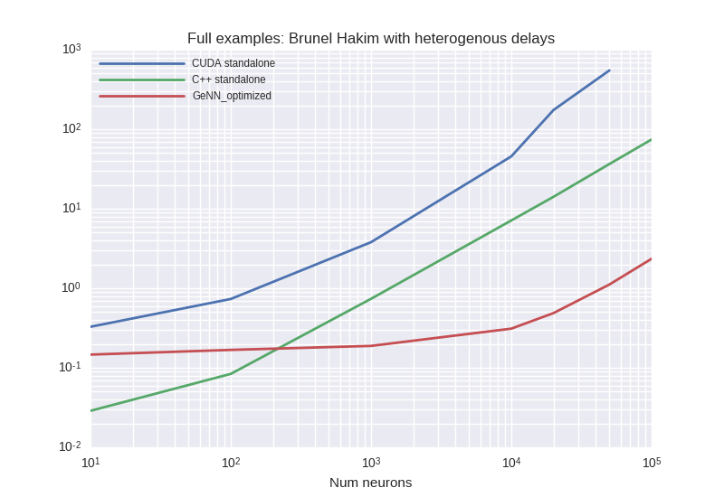
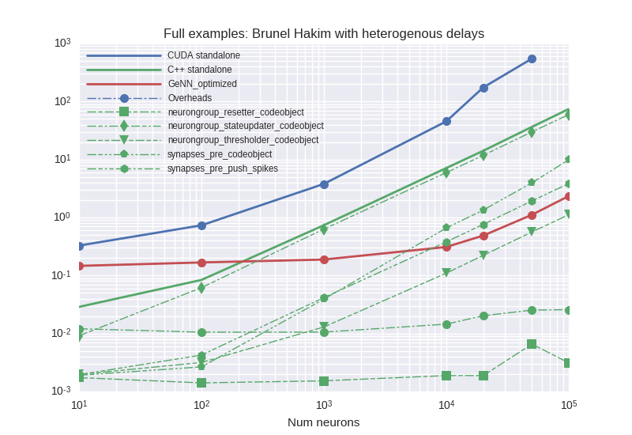


<details><summary>Examplary `nvprof` results for **CUDAStandaloneConfiguration**</summary><p>
Profile summary for `N = 1000`:

```
==13252== NVPROF is profiling process 13252, command: ./main
==13252== Profiling application: ./main
==13252== Profiling result:
Time(%)      Time     Calls       Avg       Min       Max  Name
 86.34%  3.21777s     10000  321.78us  1.5360us  4.9107ms  _run_synapses_pre_push_spikes_push_kernel(unsigned int, unsigned int, unsigned int, int*)
  9.78%  364.56ms     10000  36.455us  2.2080us  84.928us  kernel_synapses_pre_codeobject(unsigned int, unsigned int, unsigned int, int*, unsigned int, double*, int, int*, int, double, int*, int, double*, int*)
  1.24%  46.150ms     10000  4.6140us  4.4480us  6.7520us  kernel_neurongroup_stateupdater_codeobject(unsigned int, unsigned int, double, double*, double*, double*, bool*, float*)
  0.86%  32.053ms     10000  3.2050us  2.9120us  4.2240us  [CUDA memset]
  0.70%  25.923ms     10000  2.5920us  2.3680us  3.6160us  _run_synapses_pre_push_spikes_advance_kernel(void)
  0.58%  21.708ms     10000  2.1700us  1.8880us  2.7200us  kernel_neurongroup_thresholder_codeobject(unsigned int, unsigned int, int*, double, double*, double*, bool*)
  0.48%  17.725ms     10000  1.7720us  1.6960us  2.0480us  kernel_neurongroup_resetter_codeobject(unsigned int, unsigned int, double*, int*)
  0.02%  880.45us         1  880.45us  880.45us  880.45us  void gen_sequenced<curandStateXORWOW, float2, normal_args_st, __operator_&__(float2 curand_normal_scaled2<curandStateXORWOW>(curandStateXORWOW*, normal_args_st))>(curandStateXORWOW*, float2*, unsigned long, unsigned long, normal_args_st)

==13252== API calls:
Time(%)      Time     Calls       Avg       Min       Max  Name
 93.08%  3.54282s     60001  59.045us  7.8910us  6.6818ms  cudaLaunch
  2.78%  105.95ms     10000  10.595us  8.3520us  305.06us  cudaMemset
  1.61%  61.198ms         1  61.198ms  61.198ms  61.198ms  cudaDeviceSynchronize
  1.60%  60.805ms    370005     164ns     130ns  296.03us  cudaSetupArgument
  0.49%  18.710ms     60002     311ns     237ns  312.79us  cudaGetLastError
  0.43%  16.481ms     60001     274ns     181ns  299.24us  cudaConfigureCall
  0.00%  182.53us         1  182.53us  182.53us  182.53us  cudaMalloc
  0.00%  71.394us         1  71.394us  71.394us  71.394us  cudaMemGetInfo
  0.00%  20.387us        38     536ns     474ns  1.4760us  cudaOccupancyMaxActiveBlocksPerMultiprocessorWithFlags
  0.00%  18.951us         7  2.7070us  1.9760us  5.3870us  cudaFuncGetAttributes
  0.00%  4.9460us        12     412ns     263ns  1.1520us  cudaDeviceGetAttribute
  0.00%  2.8500us         3     950ns     608ns  1.6040us  cudaGetDevice

```

</p></details>


<details><summary>Examplary `nvprof` results for **GeNNConfigurationOptimized**</summary><p>
Profile summary for `N = 1000`:

```
==13488== NVPROF is profiling process 13488, command: ./main test 1.0 1
==13488== Profiling application: ./main test 1.0 1
==13488== Profiling result:
Time(%)      Time     Calls       Avg       Min       Max  Name
 74.47%  118.07ms     10000  11.806us  10.016us  17.664us  calcNeurons
 18.42%  29.207ms     10000  2.9200us  1.9200us  17.664us  calcSynapses
  5.59%  8.8552ms        40  221.38us     960ns  2.5145ms  [CUDA memcpy HtoD]
  1.52%  2.4178ms        10  241.78us  1.9520us  2.3869ms  [CUDA memcpy DtoH]

==13488== API calls:
Time(%)      Time     Calls       Avg       Min       Max  Name
 58.76%  270.99ms        11  24.635ms  17.531us  265.27ms  cudaHostAlloc
 36.00%  166.02ms     20000  8.3000us  7.6090us  315.35us  cudaLaunch
  2.62%  12.069ms        53  227.72us     334ns  2.5281ms  cudaMemcpy
  1.36%  6.2887ms     20000     314ns     240ns  302.98us  cudaConfigureCall
  1.00%  4.6085ms     20000     230ns     217ns  2.8530us  cudaSetupArgument
  0.19%  860.67us        11  78.243us  12.662us  173.88us  cudaMalloc
  0.05%  234.84us        83  2.8290us     158ns  100.64us  cuDeviceGetAttribute
  0.01%  32.245us         1  32.245us  32.245us  32.245us  cuDeviceTotalMem
  0.01%  27.894us         1  27.894us  27.894us  27.894us  cuDeviceGetName
  0.00%  14.621us        11  1.3290us     791ns  3.3800us  cudaGetSymbolAddress
  0.00%  12.561us         1  12.561us  12.561us  12.561us  cudaSetDevice
  0.00%  1.4740us         2     737ns     495ns     979ns  cuDeviceGetCount
  0.00%  1.4370us         1  1.4370us  1.4370us  1.4370us  cudaGetDeviceCount
  0.00%     524ns         2     262ns     227ns     297ns  cuDeviceGet

```

</p></details>


***

### BrunelHakimModelScalarDelay
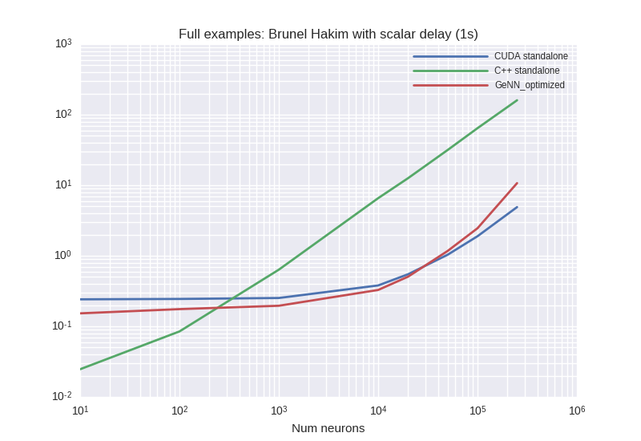


<details><summary>Examplary `nvprof` results for **CUDAStandaloneConfiguration**</summary><p>
Profile summary for `N = 1000`:

```
==2491== NVPROF is profiling process 2491, command: ./main
==2491== Profiling application: ./main
==2491== Profiling result:
Time(%)      Time     Calls       Avg       Min       Max  Name
 28.57%  48.196ms     10000  4.8190us  4.5440us  6.7840us  kernel_neurongroup_stateupdater_codeobject(unsigned int, unsigned int, double, double*, double*, double*, bool*, float*)
 27.77%  46.841ms     10000  4.6840us  2.8800us  31.584us  kernel_synapses_pre_codeobject(unsigned int, unsigned int, unsigned int, int*, unsigned int, double*, int, int*, int, double, int*, int, double*, int*)
 19.44%  32.782ms     10000  3.2780us  3.2320us  3.7760us  [CUDA memset]
 12.58%  21.215ms     10000  2.1210us  1.9840us  2.5600us  kernel_neurongroup_thresholder_codeobject(unsigned int, unsigned int, int*, double, double*, double*, bool*)
 11.12%  18.762ms     10000  1.8760us  1.7920us  2.1120us  kernel_neurongroup_resetter_codeobject(unsigned int, unsigned int, double*, int*)
  0.52%  880.90us         1  880.90us  880.90us  880.90us  void gen_sequenced<curandStateXORWOW, float2, normal_args_st, __operator_&__(float2 curand_normal_scaled2<curandStateXORWOW>(curandStateXORWOW*, normal_args_st))>(curandStateXORWOW*, float2*, unsigned long, unsigned long, normal_args_st)

==2491== API calls:
Time(%)      Time     Calls       Avg       Min       Max  Name
 67.81%  358.71ms     40001  8.9670us  7.9890us  10.112ms  cudaLaunch
 16.69%  88.268ms     10000  8.8260us  8.3570us  34.808us  cudaMemset
 11.38%  60.182ms    330005     182ns     150ns  304.26us  cudaSetupArgument
  2.12%  11.226ms     40001     280ns     197ns  305.80us  cudaConfigureCall
  1.95%  10.335ms     40002     258ns     217ns  14.869us  cudaGetLastError
  0.03%  178.47us         1  178.47us  178.47us  178.47us  cudaMalloc
  0.01%  51.372us         1  51.372us  51.372us  51.372us  cudaMemGetInfo
  0.00%  21.822us        38     574ns     469ns  3.0220us  cudaOccupancyMaxActiveBlocksPerMultiprocessorWithFlags
  0.00%  19.460us         7  2.7800us  2.0130us  5.1840us  cudaFuncGetAttributes
  0.00%  17.572us         1  17.572us  17.572us  17.572us  cudaDeviceSynchronize
  0.00%  5.0120us        12     417ns     283ns  1.0740us  cudaDeviceGetAttribute
  0.00%  2.8560us         3     952ns     570ns  1.6710us  cudaGetDevice

```

</p></details>


<details><summary>Examplary `nvprof` results for **GeNNConfigurationOptimized**</summary><p>
Profile summary for `N = 1000`:

```
==2741== NVPROF is profiling process 2741, command: ./main test 1.0 1
==2741== Profiling application: ./main test 1.0 1
==2741== Profiling result:
Time(%)      Time     Calls       Avg       Min       Max  Name
 71.49%  120.00ms     10000  11.999us  10.016us  18.144us  calcNeurons
 21.75%  36.501ms     10000  3.6500us  2.4960us  29.185us  calcSynapses
  5.33%  8.9404ms        41  218.06us     960ns  2.5144ms  [CUDA memcpy HtoD]
  1.43%  2.4037ms        10  240.37us  2.0480us  2.3725ms  [CUDA memcpy DtoH]

==2741== API calls:
Time(%)      Time     Calls       Avg       Min       Max  Name
 59.17%  284.47ms        11  25.861ms  13.934us  278.41ms  cudaHostAlloc
 35.49%  170.60ms     20000  8.5300us  7.5850us  307.94us  cudaLaunch
  2.68%  12.860ms        53  242.63us     394ns  2.5288ms  cudaMemcpy
  1.36%  6.5596ms     20000     327ns     257ns  308.28us  cudaConfigureCall
  1.04%  5.0131ms     20000     250ns     228ns  9.1940us  cudaSetupArgument
  0.19%  898.78us        11  81.706us  9.2360us  153.32us  cudaMalloc
  0.05%  226.47us        83  2.7280us     137ns  97.777us  cuDeviceGetAttribute
  0.01%  31.138us         1  31.138us  31.138us  31.138us  cuDeviceTotalMem
  0.01%  27.215us         1  27.215us  27.215us  27.215us  cuDeviceGetName
  0.00%  12.953us        11  1.1770us     575ns  2.8170us  cudaGetSymbolAddress
  0.00%  12.076us         1  12.076us  12.076us  12.076us  cudaMemcpyToSymbol
  0.00%  10.837us         1  10.837us  10.837us  10.837us  cudaSetDevice
  0.00%  1.5250us         1  1.5250us  1.5250us  1.5250us  cudaGetDeviceCount
  0.00%  1.4930us         2     746ns     490ns  1.0030us  cuDeviceGetCount
  0.00%     498ns         2     249ns     224ns     274ns  cuDeviceGet

```

</p></details>


***

### BrunelHakimModelScalarDelayNoMultiPrePost
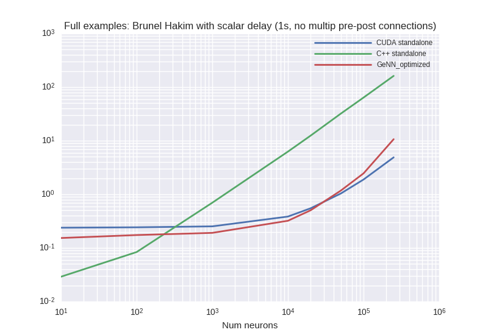

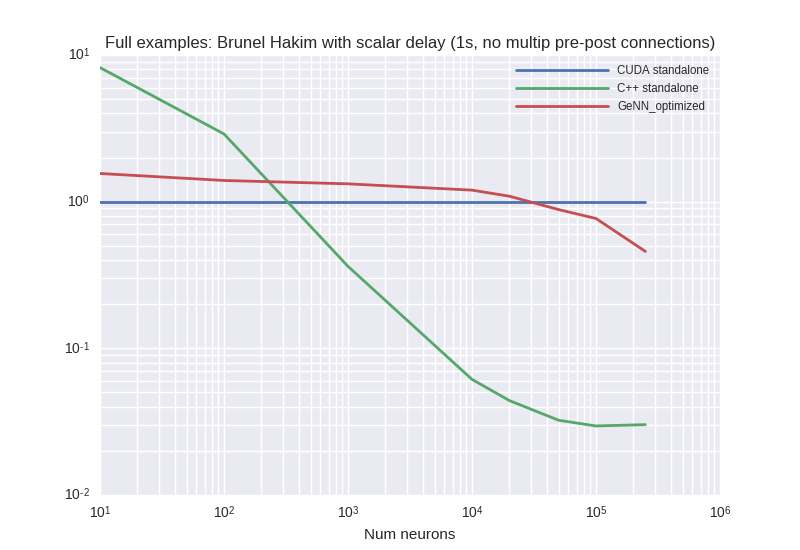

<details><summary>Examplary `nvprof` results for **CUDAStandaloneConfiguration**</summary><p>
Profile summary for `N = 1000`:

```
==23945== NVPROF is profiling process 23945, command: ./main
==23945== Profiling application: ./main
==23945== Profiling result:
Time(%)      Time     Calls       Avg       Min       Max  Name
 28.82%  47.429ms     10000  4.7420us  2.8800us  34.464us  kernel_synapses_pre_codeobject(unsigned int, unsigned int, unsigned int, int*, unsigned int, double*, int, int*, int, double, int*, int, double*, int*)
 28.42%  46.768ms     10000  4.6760us  4.4480us  6.8800us  kernel_neurongroup_stateupdater_codeobject(unsigned int, unsigned int, double, double*, double*, double*, bool*, float*)
 18.77%  30.887ms     10000  3.0880us  3.0400us  3.6160us  [CUDA memset]
 13.20%  21.722ms     10000  2.1720us  2.0160us  2.5920us  kernel_neurongroup_thresholder_codeobject(unsigned int, unsigned int, int*, double, double*, double*, bool*)
 10.25%  16.871ms     10000  1.6870us  1.5680us  1.9840us  kernel_neurongroup_resetter_codeobject(unsigned int, unsigned int, double*, int*)
  0.54%  881.31us         1  881.31us  881.31us  881.31us  void gen_sequenced<curandStateXORWOW, float2, normal_args_st, __operator_&__(float2 curand_normal_scaled2<curandStateXORWOW>(curandStateXORWOW*, normal_args_st))>(curandStateXORWOW*, float2*, unsigned long, unsigned long, normal_args_st)

==23945== API calls:
Time(%)      Time     Calls       Avg       Min       Max  Name
 68.47%  378.42ms     40001  9.4600us  8.3920us  11.185ms  cudaLaunch
 16.96%  93.726ms     10000  9.3720us  8.8820us  22.956us  cudaMemset
 10.76%  59.491ms    330005     180ns     148ns  309.86us  cudaSetupArgument
  1.90%  10.527ms     40001     263ns     182ns  298.24us  cudaConfigureCall
  1.84%  10.177ms     40002     254ns     225ns  10.282us  cudaGetLastError
  0.03%  178.62us         1  178.62us  178.62us  178.62us  cudaMalloc
  0.01%  52.598us         1  52.598us  52.598us  52.598us  cudaMemGetInfo
  0.00%  25.078us        38     659ns     560ns  2.7750us  cudaOccupancyMaxActiveBlocksPerMultiprocessorWithFlags
  0.00%  19.936us         7  2.8480us  2.0920us  5.4650us  cudaFuncGetAttributes
  0.00%  17.187us         1  17.187us  17.187us  17.187us  cudaDeviceSynchronize
  0.00%  5.0920us        12     424ns     278ns  1.0780us  cudaDeviceGetAttribute
  0.00%  3.1170us         3  1.0390us     523ns  1.9660us  cudaGetDevice

```

</p></details>


<details><summary>Examplary `nvprof` results for **GeNNConfigurationOptimized**</summary><p>
Profile summary for `N = 1000`:

```
==24196== NVPROF is profiling process 24196, command: ./main test 1.0 1
==24196== Profiling application: ./main test 1.0 1
==24196== Profiling result:
Time(%)      Time     Calls       Avg       Min       Max  Name
 71.41%  120.56ms     10000  12.055us  10.048us  17.952us  calcNeurons
 21.88%  36.941ms     10000  3.6940us  2.5280us  26.912us  calcSynapses
  5.29%  8.9319ms        41  217.85us     992ns  2.5123ms  [CUDA memcpy HtoD]
  1.42%  2.3983ms        10  239.83us  2.0160us  2.3673ms  [CUDA memcpy DtoH]

==24196== API calls:
Time(%)      Time     Calls       Avg       Min       Max  Name
 58.26%  272.15ms        11  24.741ms  19.067us  265.67ms  cudaHostAlloc
 36.33%  169.74ms     20000  8.4860us  7.6190us  310.62us  cudaLaunch
  2.72%  12.686ms        53  239.35us     323ns  2.5267ms  cudaMemcpy
  1.36%  6.3732ms     20000     318ns     242ns  300.70us  cudaConfigureCall
  1.03%  4.8351ms     20000     241ns     210ns  10.299us  cudaSetupArgument
  0.22%  1.0265ms        11  93.320us  12.594us  179.95us  cudaMalloc
  0.05%  240.26us        83  2.8940us     152ns  104.47us  cuDeviceGetAttribute
  0.01%  32.415us         1  32.415us  32.415us  32.415us  cuDeviceTotalMem
  0.01%  28.407us         1  28.407us  28.407us  28.407us  cuDeviceGetName
  0.00%  14.808us        11  1.3460us     741ns  3.2100us  cudaGetSymbolAddress
  0.00%  14.772us         1  14.772us  14.772us  14.772us  cudaMemcpyToSymbol
  0.00%  12.168us         1  12.168us  12.168us  12.168us  cudaSetDevice
  0.00%  1.4860us         1  1.4860us  1.4860us  1.4860us  cudaGetDeviceCount
  0.00%  1.4580us         2     729ns     473ns     985ns  cuDeviceGetCount
  0.00%     537ns         2     268ns     226ns     311ns  cuDeviceGet

```

</p></details>


***

### COBAHH

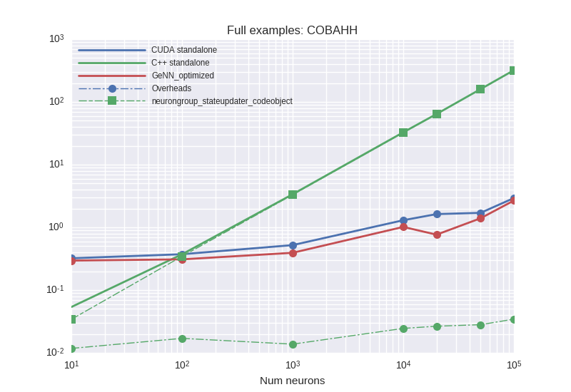


<details><summary>Examplary `nvprof` results for **CUDAStandaloneConfiguration**</summary><p>
Profile summary for `N = 1000`:

```
==11907== NVPROF is profiling process 11907, command: ./main
==11907== Profiling application: ./main
==11907== Profiling result:
Time(%)      Time     Calls       Avg       Min       Max  Name
 39.16%  186.02ms     10000  18.602us  17.856us  21.568us  kernel_neurongroup_stateupdater_codeobject(unsigned int, unsigned int, double*, double*, double*, bool*, double*, double*, double*, double*, double, double*)
 29.93%  142.18ms     10000  14.218us  3.2320us  35.680us  kernel_synapses_pre_codeobject(unsigned int, unsigned int, unsigned int, int*, unsigned int, double*, int, int*, int, double*, double, int*, int, int*)
 19.08%  90.630ms     10000  9.0620us  3.1680us  24.448us  kernel_synapses_1_pre_codeobject(unsigned int, unsigned int, unsigned int, int*, unsigned int, double*, int, int*, int, double, int*, int, int*, double*)
  6.67%  31.670ms     10000  3.1660us  3.0400us  4.1920us  [CUDA memset]
  5.15%  24.481ms     10000  2.4480us  2.0480us  2.7840us  kernel_neurongroup_thresholder_codeobject(unsigned int, unsigned int, int*, double, double*, double*, bool*)

==11907== API calls:
Time(%)      Time     Calls       Avg       Min       Max  Name
 66.01%  376.74ms     40000  9.4180us  8.4480us  6.9662ms  cudaLaunch
 15.97%  91.133ms     10000  9.1130us  8.5190us  28.283us  cudaMemset
 13.95%  79.611ms    470000     169ns     149ns  316.22us  cudaSetupArgument
  2.29%  13.092ms     40000     327ns     202ns  311.93us  cudaConfigureCall
  1.76%  10.072ms     40000     251ns     230ns  5.0760us  cudaGetLastError
  0.01%  50.252us         1  50.252us  50.252us  50.252us  cudaMemGetInfo
  0.00%  22.121us         1  22.121us  22.121us  22.121us  cudaDeviceSynchronize
  0.00%  16.912us         6  2.8180us  2.0980us  4.5270us  cudaFuncGetAttributes
  0.00%  13.875us        21     660ns     520ns  1.5110us  cudaOccupancyMaxActiveBlocksPerMultiprocessorWithFlags
  0.00%  3.9730us         8     496ns     302ns  1.1490us  cudaDeviceGetAttribute
  0.00%  2.3840us         2  1.1920us     836ns  1.5480us  cudaGetDevice

```

</p></details>


<details><summary>Examplary `nvprof` results for **GeNNConfigurationOptimized**</summary><p>
Profile summary for `N = 1000`:

```
==12169== NVPROF is profiling process 12169, command: ./main test 1.0 1
==12169== Profiling application: ./main test 1.0 1
==12169== Profiling result:
Time(%)      Time     Calls       Avg       Min       Max  Name
 64.38%  254.25ms     10000  25.425us  23.777us  28.416us  calcNeurons
 35.52%  140.25ms     10000  14.025us  2.4320us  41.696us  calcSynapses
  0.07%  285.47us        68  4.1980us     960ns  42.944us  [CUDA memcpy HtoD]
  0.03%  108.42us        18  6.0230us  1.9840us  40.736us  [CUDA memcpy DtoH]

==12169== API calls:
Time(%)      Time     Calls       Avg       Min       Max  Name
 52.49%  378.74ms     20000  18.937us  7.6840us  358.81us  cudaLaunch
 42.10%  303.75ms        19  15.987ms  8.2320us  301.68ms  cudaHostAlloc
  3.34%  24.097ms        88  273.83us     330ns  22.690ms  cudaMemcpy
  1.06%  7.6642ms     20000     383ns     262ns  335.28us  cudaConfigureCall
  0.86%  6.2250ms     20000     311ns     242ns  336.35us  cudaSetupArgument
  0.10%  707.36us        19  37.229us  6.2200us  126.23us  cudaMalloc
  0.03%  241.14us        83  2.9050us     137ns  109.48us  cuDeviceGetAttribute
  0.00%  31.485us         1  31.485us  31.485us  31.485us  cuDeviceTotalMem
  0.00%  30.190us         1  30.190us  30.190us  30.190us  cuDeviceGetName
  0.00%  12.302us        19     647ns     344ns  2.1110us  cudaGetSymbolAddress
  0.00%  11.562us         1  11.562us  11.562us  11.562us  cudaSetDevice
  0.00%  1.5290us         2     764ns     561ns     968ns  cuDeviceGetCount
  0.00%  1.4620us         1  1.4620us  1.4620us  1.4620us  cudaGetDeviceCount
  0.00%     480ns         2     240ns     218ns     262ns  cuDeviceGet

```

</p></details>


***

### COBAHHFixedConnectivity
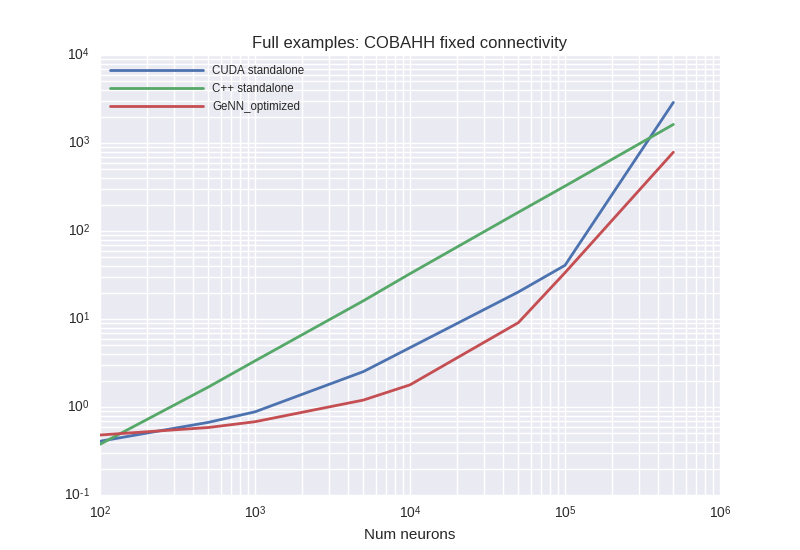
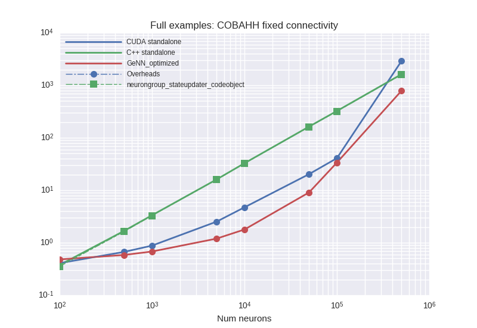
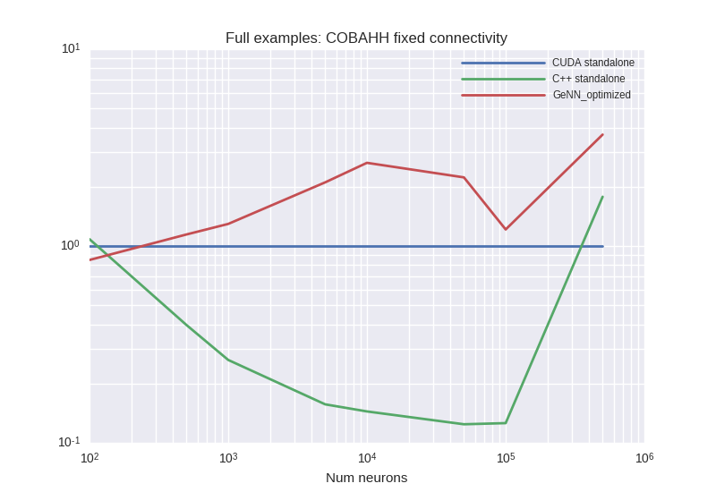

<details><summary>Examplary `nvprof` results for **CUDAStandaloneConfiguration**</summary><p>
Profile summary for `N = 1000`:

```
==17632== NVPROF is profiling process 17632, command: ./main
==17632== Profiling application: ./main
==17632== Profiling result:
Time(%)      Time     Calls       Avg       Min       Max  Name
 44.90%  349.33ms     10000  34.933us  1.6640us  111.13ms  kernel_spikemonitor_codeobject(unsigned int, int*, double, int*, int*, int*, int, int*, double*, int, int*, int*)
 23.60%  183.61ms     10000  18.361us  17.824us  21.856us  kernel_neurongroup_stateupdater_codeobject(unsigned int, unsigned int, double*, double*, double*, bool*, double*, double*, double*, double*, double, double*)
 14.85%  115.52ms     10000  11.551us  3.0720us  36.353us  kernel_synapses_pre_codeobject(unsigned int, unsigned int, unsigned int, int*, unsigned int, double*, int, int*, int, double*, double, int*, int, int*)
  9.49%  73.847ms     10000  7.3840us  3.0720us  24.064us  kernel_synapses_1_pre_codeobject(unsigned int, unsigned int, unsigned int, int*, unsigned int, double*, int, int*, int, double, int*, int, int*, double*)
  4.03%  31.352ms     10000  3.1350us  3.0400us  4.2880us  [CUDA memset]
  3.12%  24.285ms     10000  2.4280us  2.0480us  2.7840us  kernel_neurongroup_thresholder_codeobject(unsigned int, unsigned int, int*, double, double*, double*, bool*)
  0.01%  68.000us         1  68.000us  68.000us  68.000us  _run_spikemonitor_codeobject_init(void)

==17632== API calls:
Time(%)      Time     Calls       Avg       Min       Max  Name
 73.31%  632.36ms     50001  12.646us  8.2740us  95.930ms  cudaLaunch
 12.10%  104.36ms    590000     176ns     149ns  346.69us  cudaSetupArgument
 11.27%  97.201ms     10000  9.7200us  8.6440us  1.1383ms  cudaMemset
  1.55%  13.390ms     50001     267ns     192ns  331.43us  cudaConfigureCall
  1.55%  13.349ms     50001     266ns     220ns  330.51us  cudaGetLastError
  0.21%  1.8328ms         1  1.8328ms  1.8328ms  1.8328ms  cudaDeviceSynchronize
  0.01%  51.143us         1  51.143us  51.143us  51.143us  cudaMemGetInfo
  0.00%  18.972us         7  2.7100us  2.0070us  4.6510us  cudaFuncGetAttributes
  0.00%  14.003us        22     636ns     470ns  1.4930us  cudaOccupancyMaxActiveBlocksPerMultiprocessorWithFlags
  0.00%  4.3080us         8     538ns     317ns  1.2590us  cudaDeviceGetAttribute
  0.00%  2.2780us         2  1.1390us     764ns  1.5140us  cudaGetDevice

```

</p></details>


<details><summary>Examplary `nvprof` results for **GeNNConfigurationOptimized**</summary><p>
Profile summary for `N = 1000`:

```
==17891== NVPROF is profiling process 17891, command: ./main test 1.0 1
==17891== Profiling application: ./main test 1.0 1
==17891== Profiling result:
Time(%)      Time     Calls       Avg       Min       Max  Name
 66.58%  251.53ms     10000  25.153us  23.840us  28.000us  calcNeurons
 23.34%  88.193ms     10000  8.8190us  2.4320us  41.472us  calcSynapses
  9.86%  37.269ms     18461  2.0180us  1.9520us  153.18us  [CUDA memcpy DtoH]
  0.22%  820.87us        68  12.071us     960ns  164.23us  [CUDA memcpy HtoD]

==17891== API calls:
Time(%)      Time     Calls       Avg       Min       Max  Name
 52.66%  509.16ms     20088  25.346us     320ns  371.03us  cudaMemcpy
 26.73%  258.42ms        19  13.601ms  8.8970us  255.30ms  cudaHostAlloc
 19.10%  184.67ms     20000  9.2330us  7.8160us  348.55us  cudaLaunch
  0.81%  7.7916ms     20000     389ns     275ns  331.45us  cudaConfigureCall
  0.56%  5.4451ms     20000     272ns     241ns  4.6710us  cudaSetupArgument
  0.10%  1.0098ms        19  53.145us  6.4240us  173.26us  cudaMalloc
  0.02%  226.52us        83  2.7290us     143ns  97.659us  cuDeviceGetAttribute
  0.00%  31.331us         1  31.331us  31.331us  31.331us  cuDeviceTotalMem
  0.00%  30.487us         1  30.487us  30.487us  30.487us  cuDeviceGetName
  0.00%  18.126us        19     954ns     368ns  3.5740us  cudaGetSymbolAddress
  0.00%  11.311us         1  11.311us  11.311us  11.311us  cudaSetDevice
  0.00%  1.7800us         2     890ns     658ns  1.1220us  cuDeviceGetCount
  0.00%  1.4830us         1  1.4830us  1.4830us  1.4830us  cudaGetDeviceCount
  0.00%     640ns         2     320ns     242ns     398ns  cuDeviceGet

```

</p></details>


***

### CUBA


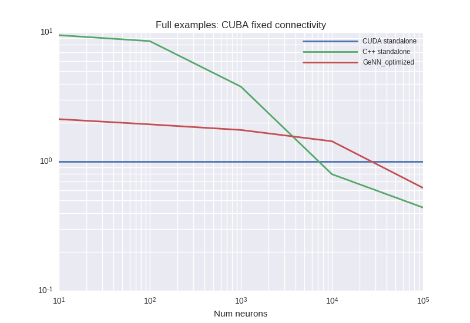

<details><summary>Examplary `nvprof` results for **CUDAStandaloneConfiguration**</summary><p>
Profile summary for `N = 1000`:

```
==31291== NVPROF is profiling process 31291, command: ./main
==31291== Profiling application: ./main
==31291== Profiling result:
Time(%)      Time     Calls       Avg       Min       Max  Name
 31.18%  76.419ms     10000  7.6410us  7.3920us  8.7360us  kernel_neurongroup_stateupdater_codeobject(unsigned int, unsigned int, double*, double*, double, double*, double*, double*, bool*)
 19.96%  48.924ms     10000  4.8920us  3.4560us  20.384us  kernel_synapses_pre_codeobject(unsigned int, unsigned int, unsigned int, int*, unsigned int, double*, int, int*, int, double*, double, int*, int, int*, bool*)
 18.13%  44.432ms     10000  4.4430us  3.2960us  17.952us  kernel_synapses_1_pre_codeobject(unsigned int, unsigned int, unsigned int, int*, unsigned int, double*, int, int*, int, double, int*, int, int*, double*, bool*)
 13.38%  32.789ms     10000  3.2780us  3.2320us  3.7760us  [CUDA memset]
  9.59%  23.496ms     10000  2.3490us  2.0480us  2.7520us  kernel_neurongroup_thresholder_codeobject(unsigned int, unsigned int, int*, double, double*, double*, bool*)
  7.76%  19.020ms     10000  1.9010us  1.6640us  2.0800us  kernel_neurongroup_resetter_codeobject(unsigned int, unsigned int, double*, int*, bool*)

==31291== API calls:
Time(%)      Time     Calls       Avg       Min       Max  Name
 68.69%  471.10ms     50000  9.4220us  8.2170us  19.231ms  cudaLaunch
 13.91%  95.387ms     10000  9.5380us  8.7960us  312.26us  cudaMemset
 13.50%  92.578ms    510000     181ns     148ns  324.51us  cudaSetupArgument
  2.05%  14.040ms     50000     280ns     237ns  5.2940us  cudaConfigureCall
  1.83%  12.581ms     50000     251ns     217ns  12.226us  cudaGetLastError
  0.01%  51.575us         1  51.575us  51.575us  51.575us  cudaMemGetInfo
  0.00%  21.460us        39     550ns     461ns  1.4270us  cudaOccupancyMaxActiveBlocksPerMultiprocessorWithFlags
  0.00%  21.129us         8  2.6410us  1.9560us  4.4310us  cudaFuncGetAttributes
  0.00%  16.670us         1  16.670us  16.670us  16.670us  cudaDeviceSynchronize
  0.00%  5.5840us        12     465ns     285ns  1.2870us  cudaDeviceGetAttribute
  0.00%  3.3860us         3  1.1280us     653ns  1.8010us  cudaGetDevice

```

</p></details>


<details><summary>Examplary `nvprof` results for **GeNNConfigurationOptimized**</summary><p>
Profile summary for `N = 1000`:

```
==31529== NVPROF is profiling process 31529, command: ./main test 1.0 1
==31529== Profiling application: ./main test 1.0 1
==31529== Profiling result:
Time(%)      Time     Calls       Avg       Min       Max  Name
 74.56%  131.02ms     10000  13.101us  11.808us  14.624us  calcNeurons
 24.85%  43.662ms     10000  4.3660us  2.1760us  25.760us  calcSynapses
  0.45%  796.80us        56  14.228us     960ns  163.59us  [CUDA memcpy HtoD]
  0.13%  234.31us        13  18.023us  1.9520us  155.27us  [CUDA memcpy DtoH]

==31529== API calls:
Time(%)      Time     Calls       Avg       Min       Max  Name
 57.53%  276.80ms        16  17.300ms  8.5100us  274.32ms  cudaHostAlloc
 38.37%  184.60ms     20000  9.2300us  7.6370us  342.36us  cudaLaunch
  1.48%  7.1407ms        73  97.817us     343ns  5.2594ms  cudaMemcpy
  1.31%  6.3266ms     20000     316ns     249ns  315.38us  cudaConfigureCall
  1.06%  5.1071ms     20000     255ns     220ns  4.6570us  cudaSetupArgument
  0.17%  819.17us        16  51.198us  6.2400us  136.59us  cudaMalloc
  0.05%  241.67us        83  2.9110us     138ns  103.86us  cuDeviceGetAttribute
  0.01%  32.371us         1  32.371us  32.371us  32.371us  cuDeviceTotalMem
  0.01%  28.436us         1  28.436us  28.436us  28.436us  cuDeviceGetName
  0.00%  12.399us        16     774ns     424ns  2.0180us  cudaGetSymbolAddress
  0.00%  12.047us         1  12.047us  12.047us  12.047us  cudaSetDevice
  0.00%  1.6800us         1  1.6800us  1.6800us  1.6800us  cudaGetDeviceCount
  0.00%  1.4560us         2     728ns     455ns  1.0010us  cuDeviceGetCount
  0.00%     575ns         2     287ns     235ns     340ns  cuDeviceGet

```

</p></details>


***

### CUBAFixedConnectivity
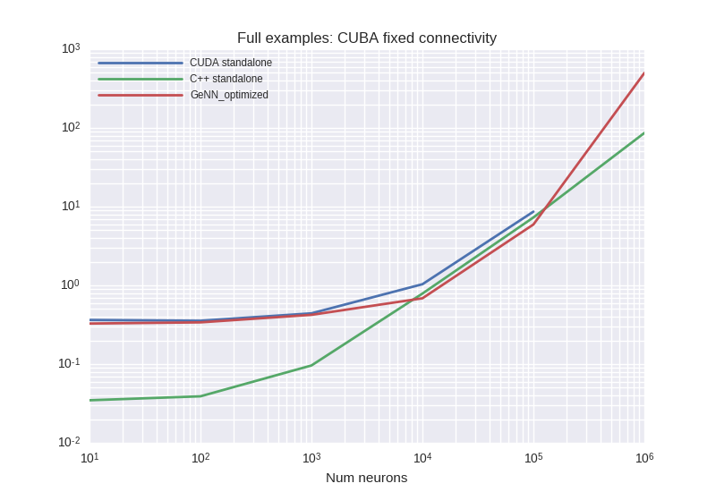


<details><summary>Examplary `nvprof` results for **CUDAStandaloneConfiguration**</summary><p>
Profile summary for `N = 1000`:

```
==28333== NVPROF is profiling process 28333, command: ./main
==28333== Profiling application: ./main
==28333== Profiling result:
Time(%)      Time     Calls       Avg       Min       Max  Name
 23.53%  75.188ms     10000  7.5180us  7.1360us  8.8960us  kernel_neurongroup_stateupdater_codeobject(unsigned int, unsigned int, double*, double*, double, double*, double*, double*, bool*)
 20.88%  66.723ms     10000  6.6720us  1.6960us  14.967ms  kernel_spikemonitor_codeobject(unsigned int, int*, double, int*, int*, int*, int, int*, double*, int, int*, int*)
 17.07%  54.561ms     10000  5.4560us  3.2960us  21.920us  kernel_synapses_pre_codeobject(unsigned int, unsigned int, unsigned int, int*, unsigned int, double*, int, int*, int, double*, double, int*, int, int*, bool*)
 15.31%  48.929ms     10000  4.8920us  3.2960us  18.784us  kernel_synapses_1_pre_codeobject(unsigned int, unsigned int, unsigned int, int*, unsigned int, double*, int, int*, int, double, int*, int, int*, double*, bool*)
 10.24%  32.716ms     10000  3.2710us  3.1360us  4.1920us  [CUDA memset]
  7.36%  23.508ms     10000  2.3500us  2.0160us  2.7200us  kernel_neurongroup_thresholder_codeobject(unsigned int, unsigned int, int*, double, double*, double*, bool*)
  5.59%  17.866ms     10000  1.7860us  1.5360us  2.0800us  kernel_neurongroup_resetter_codeobject(unsigned int, unsigned int, double*, int*, bool*)
  0.02%  67.328us         1  67.328us  67.328us  67.328us  _run_spikemonitor_codeobject_init(void)

==28333== API calls:
Time(%)      Time     Calls       Avg       Min       Max  Name
 70.32%  550.58ms     60001  9.1760us  8.3390us  6.9445ms  cudaLaunch
 14.00%  109.65ms    630000     174ns     148ns  343.93us  cudaSetupArgument
 11.69%  91.573ms     10000  9.1570us  8.5300us  165.12us  cudaMemset
  1.99%  15.611ms     60001     260ns     222ns  327.19us  cudaConfigureCall
  1.98%  15.472ms     60001     257ns     208ns  1.1493ms  cudaGetLastError
  0.01%  51.353us         1  51.353us  51.353us  51.353us  cudaMemGetInfo
  0.00%  24.711us        40     617ns     509ns  1.7610us  cudaOccupancyMaxActiveBlocksPerMultiprocessorWithFlags
  0.00%  23.494us         9  2.6100us  2.0080us  4.3370us  cudaFuncGetAttributes
  0.00%  17.566us         1  17.566us  17.566us  17.566us  cudaDeviceSynchronize
  0.00%  5.4430us        12     453ns     281ns  1.1050us  cudaDeviceGetAttribute
  0.00%  3.0770us         3  1.0250us     646ns  1.6320us  cudaGetDevice

```

</p></details>


<details><summary>Examplary `nvprof` results for **GeNNConfigurationOptimized**</summary><p>
Profile summary for `N = 1000`:

```
==28592== NVPROF is profiling process 28592, command: ./main test 1.0 1
==28592== Profiling application: ./main test 1.0 1
==28592== Profiling result:
Time(%)      Time     Calls       Avg       Min       Max  Name
 63.11%  133.95ms     10000  13.394us  12.384us  14.432us  calcNeurons
 22.74%  48.266ms     10000  4.8260us  2.7200us  24.896us  calcSynapses
 13.78%  29.240ms     14081  2.0760us  2.0160us  154.95us  [CUDA memcpy DtoH]
  0.37%  793.60us        56  14.171us     960ns  163.11us  [CUDA memcpy HtoD]

==28592== API calls:
Time(%)      Time     Calls       Avg       Min       Max  Name
 38.67%  315.20ms     20073  15.702us     324ns  773.07us  cudaMemcpy
 37.36%  304.57ms        16  19.036ms  8.7600us  301.99ms  cudaHostAlloc
 22.40%  182.59ms     20000  9.1290us  7.6730us  821.14us  cudaLaunch
  0.78%  6.3728ms     20000     318ns     250ns  5.2440us  cudaConfigureCall
  0.66%  5.3441ms     20000     267ns     226ns  332.81us  cudaSetupArgument
  0.10%  800.29us        16  50.018us  6.1360us  126.53us  cudaMalloc
  0.03%  230.87us        83  2.7810us     153ns  99.066us  cuDeviceGetAttribute
  0.00%  32.084us         1  32.084us  32.084us  32.084us  cuDeviceTotalMem
  0.00%  30.780us         1  30.780us  30.780us  30.780us  cuDeviceGetName
  0.00%  12.549us        16     784ns     421ns  2.2350us  cudaGetSymbolAddress
  0.00%  11.671us         1  11.671us  11.671us  11.671us  cudaSetDevice
  0.00%  1.8440us         1  1.8440us  1.8440us  1.8440us  cudaGetDeviceCount
  0.00%  1.7500us         2     875ns     690ns  1.0600us  cuDeviceGetCount
  0.00%     626ns         2     313ns     253ns     373ns  cuDeviceGet

```

</p></details>


***

### DenseMediumRateSynapsesOnly
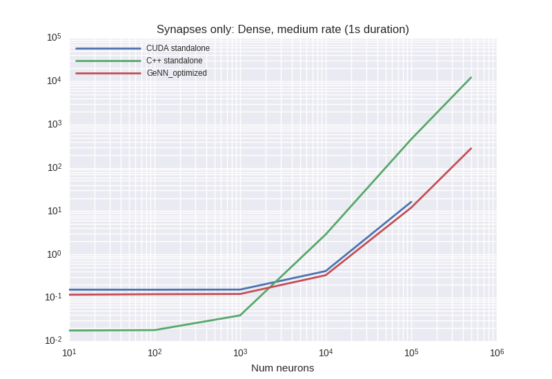
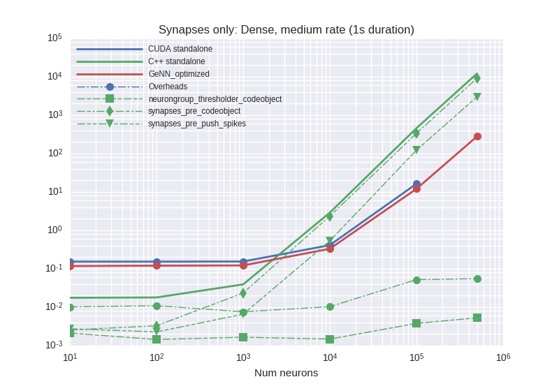


<details><summary>Examplary `nvprof` results for **CUDAStandaloneConfiguration**</summary><p>
Profile summary for `N = 1000`:

```
==30551== NVPROF is profiling process 30551, command: ./main
==30551== Profiling application: ./main
==30551== Profiling result:
Time(%)      Time     Calls       Avg       Min       Max  Name
 56.01%  59.694ms     10000  5.9690us  5.6000us  6.4960us  kernel_synapses_pre_codeobject(unsigned int, unsigned int, unsigned int, int*, unsigned int, double*, int, int*, int, double, double*, int*, int, int*)
 28.93%  30.830ms     10000  3.0820us  3.0400us  3.5200us  [CUDA memset]
 15.06%  16.055ms     10000  1.6050us  1.5040us  2.4000us  kernel_neurongroup_thresholder_codeobject(unsigned int, unsigned int, int*)

==30551== API calls:
Time(%)      Time     Calls       Avg       Min       Max  Name
 59.17%  191.07ms     20000  9.5530us  8.3220us  11.129ms  cudaLaunch
 27.89%  90.062ms     10000  9.0060us  8.4390us  27.616us  cudaMemset
  9.32%  30.084ms    170000     176ns     153ns  306.97us  cudaSetupArgument
  1.82%  5.8925ms     20000     294ns     213ns  303.17us  cudaConfigureCall
  1.77%  5.7023ms     20000     285ns     216ns  302.98us  cudaGetLastError
  0.01%  46.403us         1  46.403us  46.403us  46.403us  cudaMemGetInfo
  0.01%  18.635us         1  18.635us  18.635us  18.635us  cudaDeviceSynchronize
  0.00%  8.8700us         3  2.9560us  2.1570us  3.7290us  cudaFuncGetAttributes
  0.00%  6.7130us         3  2.2370us     629ns  3.5200us  cudaOccupancyMaxActiveBlocksPerMultiprocessorWithFlags
  0.00%  1.7730us         4     443ns     369ns     586ns  cudaDeviceGetAttribute
  0.00%     848ns         1     848ns     848ns     848ns  cudaGetDevice

```

</p></details>


<details><summary>Examplary `nvprof` results for **GeNNConfigurationOptimized**</summary><p>
Profile summary for `N = 1000`:

```
==30762== NVPROF is profiling process 30762, command: ./main test 1.0 1
==30762== Profiling application: ./main test 1.0 1
==30762== Profiling result:
Time(%)      Time     Calls       Avg       Min       Max  Name
 64.08%  52.562ms     10000  5.2560us  3.4240us  5.9200us  calcSynapses
 35.80%  29.364ms     10000  2.9360us  2.8800us  3.8080us  calcNeurons
  0.07%  57.888us        44  1.3150us     960ns  2.2400us  [CUDA memcpy HtoD]
  0.05%  38.240us        14  2.7310us  2.0160us  4.7360us  [CUDA memcpy DtoH]

==30762== API calls:
Time(%)      Time     Calls       Avg       Min       Max  Name
 61.72%  283.35ms        12  23.613ms  14.143us  281.71ms  cudaHostAlloc
 35.34%  162.27ms     20000  8.1130us  7.4880us  334.11us  cudaLaunch
  1.34%  6.1571ms     20000     307ns     256ns  322.44us  cudaConfigureCall
  1.16%  5.3454ms     20000     267ns     224ns  332.57us  cudaSetupArgument
  0.23%  1.0363ms        61  16.988us     318ns  37.131us  cudaMemcpy
  0.14%  644.11us        12  53.676us  11.831us  178.21us  cudaMalloc
  0.05%  226.72us        83  2.7310us     138ns  97.611us  cuDeviceGetAttribute
  0.01%  31.315us         1  31.315us  31.315us  31.315us  cuDeviceTotalMem
  0.01%  26.553us         1  26.553us  26.553us  26.553us  cuDeviceGetName
  0.00%  13.976us        12  1.1640us     709ns  3.1230us  cudaGetSymbolAddress
  0.00%  11.238us         1  11.238us  11.238us  11.238us  cudaSetDevice
  0.00%  1.4430us         2     721ns     438ns  1.0050us  cuDeviceGetCount
  0.00%  1.4380us         1  1.4380us  1.4380us  1.4380us  cudaGetDeviceCount
  0.00%     582ns         2     291ns     214ns     368ns  cuDeviceGet

```

</p></details>


***

### HHNeuronsOnly

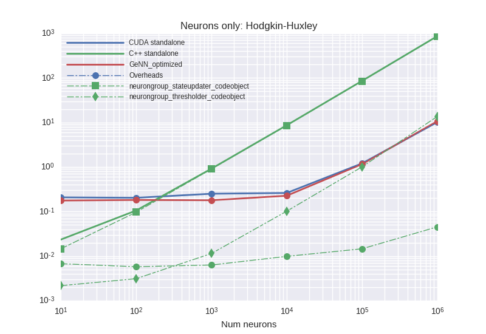


<details><summary>Examplary `nvprof` results for **CUDAStandaloneConfiguration**</summary><p>
Profile summary for `N = 1000`:

```
==25014== NVPROF is profiling process 25014, command: ./main
==25014== Profiling application: ./main
==25014== Profiling result:
Time(%)      Time     Calls       Avg       Min       Max  Name
 76.60%  171.78ms     10000  17.177us  14.880us  18.080us  kernel_neurongroup_stateupdater_codeobject(unsigned int, unsigned int, double*, double*, bool*, double*, double*, double*, double*)
 13.61%  30.516ms     10000  3.0510us  2.8160us  3.5840us  [CUDA memset]
  9.79%  21.945ms     10000  2.1940us  1.8240us  2.9120us  kernel_neurongroup_thresholder_codeobject(unsigned int, unsigned int, int*, double, double*, double*, bool*)

==25014== API calls:
Time(%)      Time     Calls       Avg       Min       Max  Name
 58.23%  179.09ms     20000  8.9540us  8.0160us  5.8117ms  cudaLaunch
 28.13%  86.520ms     10000  8.6520us  8.0220us  324.89us  cudaMemset
 10.05%  30.914ms    160000     193ns     150ns  347.54us  cudaSetupArgument
  1.94%  5.9702ms     20000     298ns     223ns  315.53us  cudaConfigureCall
  1.61%  4.9531ms     20000     247ns     210ns  327.22us  cudaGetLastError
  0.02%  46.728us         1  46.728us  46.728us  46.728us  cudaMemGetInfo
  0.01%  17.432us        35     498ns     471ns     917ns  cudaOccupancyMaxActiveBlocksPerMultiprocessorWithFlags
  0.00%  10.745us         1  10.745us  10.745us  10.745us  cudaDeviceSynchronize
  0.00%  10.378us         4  2.5940us  2.0060us  3.1740us  cudaFuncGetAttributes
  0.00%  3.1700us         8     396ns     284ns     677ns  cudaDeviceGetAttribute
  0.00%  1.6580us         2     829ns     801ns     857ns  cudaGetDevice

```

</p></details>


<details><summary>Examplary `nvprof` results for **GeNNConfigurationOptimized**</summary><p>
Profile summary for `N = 1000`:

```
==25225== NVPROF is profiling process 25225, command: ./main test 1.0 1
==25225== Profiling application: ./main test 1.0 1
==25225== Profiling result:
Time(%)      Time     Calls       Avg       Min       Max  Name
 99.94%  177.51ms     10000  17.750us  14.944us  26.400us  calcNeurons
  0.04%  62.626us        40  1.5650us     960ns  2.1760us  [CUDA memcpy HtoD]
  0.02%  38.560us        11  3.5050us  2.0160us  4.6720us  [CUDA memcpy DtoH]

==25225== API calls:
Time(%)      Time     Calls       Avg       Min       Max  Name
 55.84%  235.54ms        10  23.554ms  16.992us  233.93ms  cudaHostAlloc
 37.45%  157.95ms     10000  15.795us  7.9250us  353.53us  cudaLaunch
  4.97%  20.977ms        53  395.80us     389ns  20.008ms  cudaMemcpy
  0.81%  3.4097ms     10000     340ns     278ns  5.0220us  cudaConfigureCall
  0.70%  2.9582ms     10000     295ns     232ns  339.82us  cudaSetupArgument
  0.15%  630.64us        10  63.063us  12.457us  174.83us  cudaMalloc
  0.05%  227.15us        83  2.7360us     140ns  98.109us  cuDeviceGetAttribute
  0.01%  31.635us         1  31.635us  31.635us  31.635us  cuDeviceTotalMem
  0.01%  31.273us         1  31.273us  31.273us  31.273us  cuDeviceGetName
  0.00%  12.870us        10  1.2870us     741ns  3.5550us  cudaGetSymbolAddress
  0.00%  10.918us         1  10.918us  10.918us  10.918us  cudaSetDevice
  0.00%  1.9240us         2     962ns     718ns  1.2060us  cuDeviceGetCount
  0.00%  1.4330us         1  1.4330us  1.4330us  1.4330us  cudaGetDeviceCount
  0.00%     657ns         2     328ns     303ns     354ns  cuDeviceGet

```

</p></details>


***

### LinearNeuronsOnly

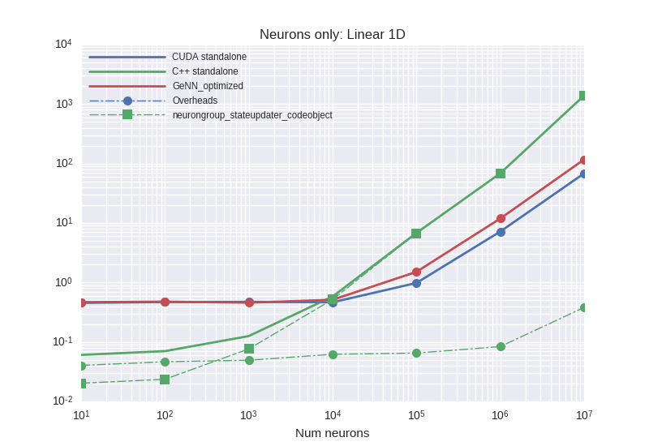
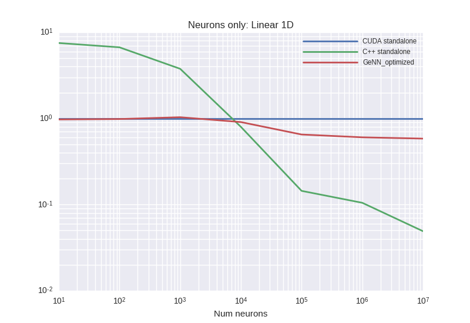

<details><summary>Examplary `nvprof` results for **CUDAStandaloneConfiguration**</summary><p>
Profile summary for `N = 1000`:

```
==19640== NVPROF is profiling process 19640, command: ./main
==19640== Profiling application: ./main
==19640== Profiling result:
Time(%)      Time     Calls       Avg       Min       Max  Name
100.00%  247.35ms    100000  2.4730us  2.3360us  3.6800us  kernel_neurongroup_stateupdater_codeobject(unsigned int, unsigned int, double*, double*)

==19640== API calls:
Time(%)      Time     Calls       Avg       Min       Max  Name
 87.43%  837.87ms    100000  8.3780us  7.7260us  7.8274ms  cudaLaunch
  7.01%  67.186ms    400000     167ns     147ns  10.910us  cudaSetupArgument
  2.81%  26.904ms    100000     269ns     241ns  10.142us  cudaConfigureCall
  2.74%  26.287ms    100000     262ns     235ns  11.074us  cudaGetLastError
  0.01%  70.067us         1  70.067us  70.067us  70.067us  cudaMemGetInfo
  0.00%  14.560us         2  7.2800us  4.1830us  10.377us  cudaFuncGetAttributes
  0.00%  9.6320us         1  9.6320us  9.6320us  9.6320us  cudaDeviceSynchronize
  0.00%  5.2800us         2  2.6400us  1.1150us  4.1650us  cudaOccupancyMaxActiveBlocksPerMultiprocessorWithFlags
  0.00%  3.9840us         1  3.9840us  3.9840us  3.9840us  cudaGetDevice
  0.00%  3.7360us         4     934ns     668ns  1.5690us  cudaDeviceGetAttribute

```

</p></details>


<details><summary>Examplary `nvprof` results for **GeNNConfigurationOptimized**</summary><p>
Profile summary for `N = 1000`:

```
==19869== NVPROF is profiling process 19869, command: ./main test 10.0 1
==19869== Profiling application: ./main test 10.0 1
==19869== Profiling result:
Time(%)      Time     Calls       Avg       Min       Max  Name
 99.99%  264.71ms    100000  2.6470us  2.5920us  3.1680us  calcNeurons
  0.01%  22.656us        16  1.4160us     960ns  2.0800us  [CUDA memcpy HtoD]
  0.01%  14.624us         5  2.9240us  2.0480us  4.6720us  [CUDA memcpy DtoH]

==19869== API calls:
Time(%)      Time     Calls       Avg       Min       Max  Name
 73.18%  822.50ms    100000  8.2250us  7.6370us  361.19us  cudaLaunch
 21.57%  242.48ms         4  60.620ms  23.163us  240.97ms  cudaHostAlloc
  2.95%  33.155ms    100000     331ns     251ns  369.91us  cudaConfigureCall
  2.18%  24.551ms    100000     245ns     222ns  14.790us  cudaSetupArgument
  0.05%  525.28us         4  131.32us  12.450us  178.02us  cudaMalloc
  0.04%  460.82us        23  20.035us     384ns  39.476us  cudaMemcpy
  0.02%  226.65us        83  2.7300us     142ns  97.695us  cuDeviceGetAttribute
  0.00%  31.478us         1  31.478us  31.478us  31.478us  cuDeviceTotalMem
  0.00%  30.578us         1  30.578us  30.578us  30.578us  cuDeviceGetName
  0.00%  10.794us         1  10.794us  10.794us  10.794us  cudaSetDevice
  0.00%  7.9740us         4  1.9930us     876ns  3.7070us  cudaGetSymbolAddress
  0.00%  1.5520us         2     776ns     553ns     999ns  cuDeviceGetCount
  0.00%  1.4290us         1  1.4290us  1.4290us  1.4290us  cudaGetDeviceCount
  0.00%     545ns         2     272ns     256ns     289ns  cuDeviceGet

```

</p></details>


***

### STDP

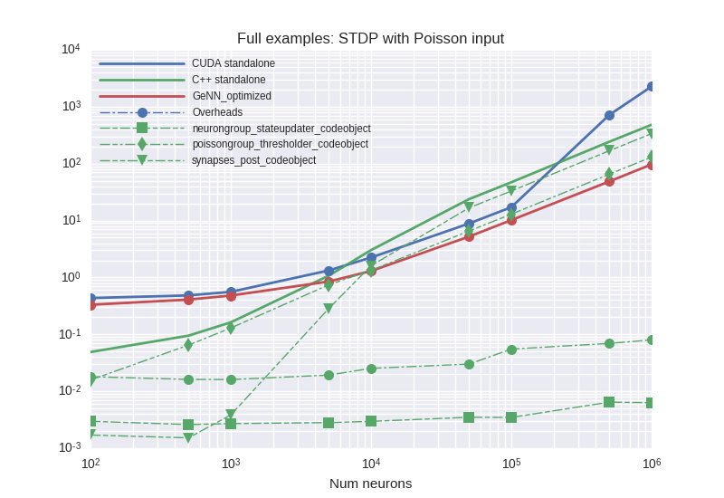
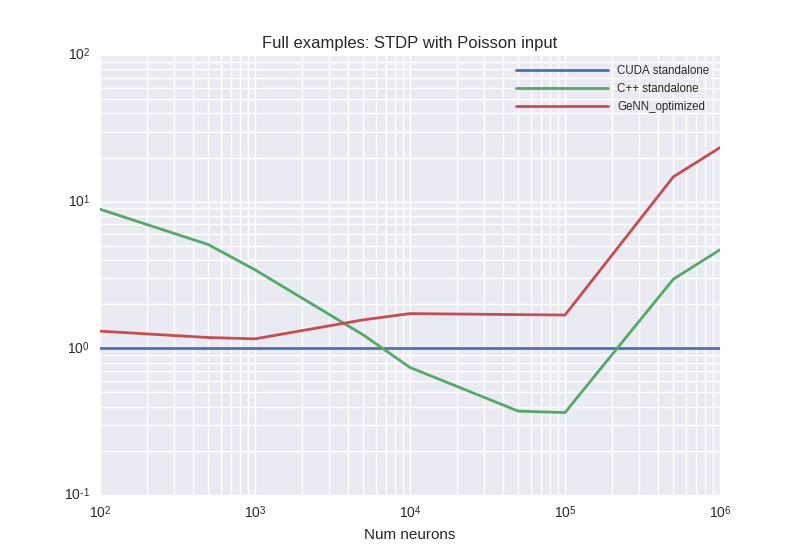

<details><summary>Examplary `nvprof` results for **CUDAStandaloneConfiguration**</summary><p>
Profile summary for `N = 1000`:

```
==30259== NVPROF is profiling process 30259, command: ./main
==30259== Profiling application: ./main
==30259== Profiling result:
Time(%)      Time     Calls       Avg       Min       Max  Name
 29.51%  119.04ms     10000  11.903us  1.4720us  28.312ms  kernel_spikemonitor_codeobject(unsigned int, int*, double, int*, int*, int*, int, int*, double*, int, int*, int*)
 19.38%  78.154ms     10000  7.8150us  3.0400us  25.729us  kernel_synapses_pre_codeobject(unsigned int, unsigned int, unsigned int, int*, unsigned int, double*, int, double*, int, double*, int, int*, double*, double, double*, int, int*, int, int*, int)
 15.01%  60.555ms     20000  3.0270us  2.8480us  4.2880us  [CUDA memset]
 13.45%  54.257ms     10000  5.4250us  4.9280us  8.0000us  kernel_neurongroup_stateupdater_codeobject(unsigned int, unsigned int, double*, double*, double*)
  8.78%  35.407ms     10000  3.5400us  3.2000us  7.1360us  kernel_synapses_post_codeobject(unsigned int, unsigned int, unsigned int, int*, unsigned int, double*, int, double*, int, double*, int, double, double*, int, int*, int*, int)
  6.25%  25.200ms     10000  2.5190us  2.1760us  2.8800us  kernel_poissongroup_thresholder_codeobject(unsigned int, unsigned int, int*, double*, double*, float*)
  3.84%  15.476ms     10000  1.5470us  1.4080us  2.4960us  kernel_neurongroup_thresholder_codeobject(unsigned int, unsigned int, int*, double*)
  3.64%  14.677ms     10000  1.4670us  1.3440us  1.9520us  kernel_neurongroup_resetter_codeobject(unsigned int, unsigned int, double*, int*)
  0.13%  535.30us         1  535.30us  535.30us  535.30us  void gen_sequenced<curandStateXORWOW, float, int, __operator_&__(float curand_uniform_noargs<curandStateXORWOW>(curandStateXORWOW*, int))>(curandStateXORWOW*, float*, unsigned long, unsigned long, int)
  0.02%  69.760us         1  69.760us  69.760us  69.760us  _run_spikemonitor_codeobject_init(void)

==30259== API calls:
Time(%)      Time     Calls       Avg       Min       Max  Name
 66.59%  656.39ms     70002  9.3760us  8.0560us  14.291ms  cudaLaunch
 18.06%  178.04ms     20000  8.9010us  7.9370us  1.1364ms  cudaMemset
 11.56%  113.99ms    680005     167ns     152ns  60.368us  cudaSetupArgument
  2.00%  19.667ms     70003     280ns     237ns  57.739us  cudaGetLastError
  1.77%  17.418ms     70002     248ns     194ns  139.14us  cudaConfigureCall
  0.01%  139.28us         1  139.28us  139.28us  139.28us  cudaMalloc
  0.00%  48.635us         1  48.635us  48.635us  48.635us  cudaMemGetInfo
  0.00%  27.603us        11  2.5090us  1.9830us  4.1880us  cudaFuncGetAttributes
  0.00%  23.673us        42     563ns     472ns  1.2600us  cudaOccupancyMaxActiveBlocksPerMultiprocessorWithFlags
  0.00%  18.501us         1  18.501us  18.501us  18.501us  cudaDeviceSynchronize
  0.00%  6.2050us        16     387ns     285ns     719ns  cudaDeviceGetAttribute
  0.00%  3.4000us         4     850ns     590ns  1.2110us  cudaGetDevice

```

</p></details>


<details><summary>Examplary `nvprof` results for **GeNNConfigurationOptimized**</summary><p>
Profile summary for `N = 1000`:

```
==30505== NVPROF is profiling process 30505, command: ./main test 1.0 1
==30505== Profiling application: ./main test 1.0 1
==30505== Profiling result:
Time(%)      Time     Calls       Avg       Min       Max  Name
 50.58%  115.54ms     10000  11.553us  1.7280us  50.209us  calcSynapses
 21.49%  49.104ms     10000  4.9100us  4.0640us  6.1440us  calcNeurons
 16.03%  36.625ms     17853  2.0510us  2.0160us  4.7360us  [CUDA memcpy DtoH]
 11.86%  27.088ms     10000  2.7080us  2.5920us  11.392us  learnSynapsesPost
  0.04%  93.633us        70  1.3370us     960ns  2.1440us  [CUDA memcpy HtoD]

==30505== API calls:
Time(%)      Time     Calls       Avg       Min       Max  Name
 35.14%  309.15ms     20095  15.384us     188ns  352.42us  cudaMemcpy
 32.84%  288.94ms        20  14.447ms  7.6290us  287.79ms  cudaHostAlloc
 29.91%  263.12ms     30000  8.7700us  7.6720us  331.70us  cudaLaunch
  1.17%  10.291ms     30000     343ns     248ns  319.74us  cudaConfigureCall
  0.84%  7.4251ms     30000     247ns     223ns  10.549us  cudaSetupArgument
  0.06%  487.96us        20  24.398us  6.1080us  126.07us  cudaMalloc
  0.03%  225.93us        83  2.7220us     138ns  97.475us  cuDeviceGetAttribute
  0.00%  31.137us         1  31.137us  31.137us  31.137us  cuDeviceTotalMem
  0.00%  27.695us         1  27.695us  27.695us  27.695us  cuDeviceGetName
  0.00%  11.547us        20     577ns     375ns  2.1780us  cudaGetSymbolAddress
  0.00%  11.033us         1  11.033us  11.033us  11.033us  cudaSetDevice
  0.00%  1.4410us         2     720ns     488ns     953ns  cuDeviceGetCount
  0.00%  1.3060us         1  1.3060us  1.3060us  1.3060us  cudaGetDeviceCount
  0.00%     575ns         2     287ns     226ns     349ns  cuDeviceGet

```

</p></details>


***

### STDPEventDriven
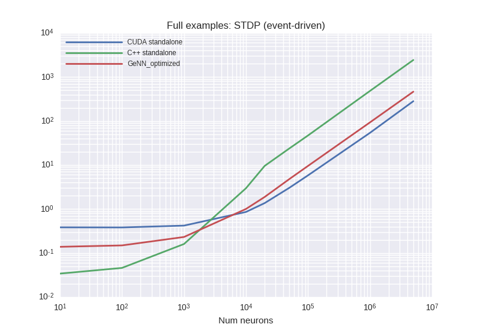
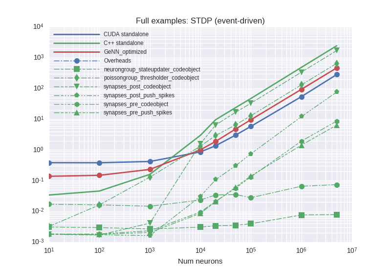
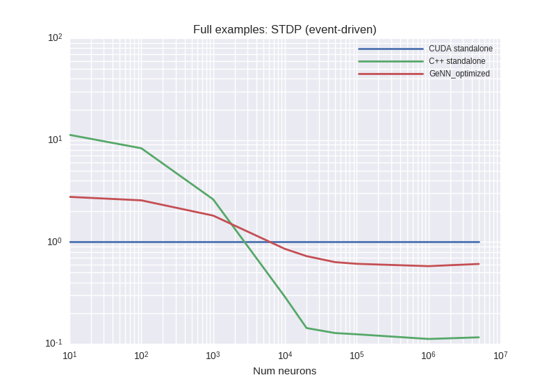

<details><summary>Examplary `nvprof` results for **CUDAStandaloneConfiguration**</summary><p>
Profile summary for `N = 1000`:

```
==13883== NVPROF is profiling process 13883, command: ./main
==13883== Profiling application: ./main
==13883== Profiling result:
Time(%)      Time     Calls       Avg       Min       Max  Name
 29.16%  88.869ms     10000  8.8860us  3.4880us  32.064us  kernel_synapses_pre_codeobject(unsigned int, unsigned int, unsigned int, int*, unsigned int, double*, int, double*, int, double*, int, int*, double*, double, double*, int, int*, int, int*, int)
 20.89%  63.662ms     20000  3.1830us  3.0400us  3.6800us  [CUDA memset]
 17.94%  54.662ms     10000  5.4660us  5.1840us  7.5200us  kernel_neurongroup_stateupdater_codeobject(unsigned int, unsigned int, double*, double*, double*)
 12.41%  37.829ms     10000  3.7820us  3.6480us  7.2000us  kernel_synapses_post_codeobject(unsigned int, unsigned int, unsigned int, int*, unsigned int, double*, int, double*, int, double*, int, double, double*, int, int*, int*, int)
  7.99%  24.357ms     10000  2.4350us  2.1760us  2.8800us  kernel_poissongroup_thresholder_codeobject(unsigned int, unsigned int, int*, double*, double*, float*)
  5.78%  17.601ms     10000  1.7600us  1.5360us  2.4960us  kernel_neurongroup_thresholder_codeobject(unsigned int, unsigned int, int*, double*)
  5.65%  17.232ms     10000  1.7230us  1.6640us  1.9840us  kernel_neurongroup_resetter_codeobject(unsigned int, unsigned int, double*, int*)
  0.17%  532.84us         1  532.84us  532.84us  532.84us  void gen_sequenced<curandStateXORWOW, float, int, __operator_&__(float curand_uniform_noargs<curandStateXORWOW>(curandStateXORWOW*, int))>(curandStateXORWOW*, float*, unsigned long, unsigned long, int)

==13883== API calls:
Time(%)      Time     Calls       Avg       Min       Max  Name
 62.59%  547.05ms     60001  9.1170us  8.1770us  7.2312ms  cudaLaunch
 20.36%  177.95ms     20000  8.8970us  8.1030us  336.69us  cudaMemset
 13.38%  116.92ms    560005     208ns     150ns  330.03us  cudaSetupArgument
  1.91%  16.702ms     60001     278ns     208ns  316.80us  cudaConfigureCall
  1.74%  15.203ms     60002     253ns     222ns  313.88us  cudaGetLastError
  0.02%  138.47us         1  138.47us  138.47us  138.47us  cudaMalloc
  0.01%  47.825us         1  47.825us  47.825us  47.825us  cudaMemGetInfo
  0.00%  24.670us        10  2.4670us  1.9950us  3.8850us  cudaFuncGetAttributes
  0.00%  22.588us        41     550ns     471ns  1.2300us  cudaOccupancyMaxActiveBlocksPerMultiprocessorWithFlags
  0.00%  17.416us         1  17.416us  17.416us  17.416us  cudaDeviceSynchronize
  0.00%  5.6370us        16     352ns     276ns     664ns  cudaDeviceGetAttribute
  0.00%  3.1450us         4     786ns     601ns  1.1830us  cudaGetDevice

```

</p></details>


<details><summary>Examplary `nvprof` results for **GeNNConfigurationOptimized**</summary><p>
Profile summary for `N = 1000`:

```
==14124== NVPROF is profiling process 14124, command: ./main test 1.0 1
==14124== Profiling application: ./main test 1.0 1
==14124== Profiling result:
Time(%)      Time     Calls       Avg       Min       Max  Name
 62.29%  109.79ms     10000  10.979us  1.4400us  50.176us  calcSynapses
 23.83%  42.003ms     10000  4.2000us  3.3280us  6.2080us  calcNeurons
 13.80%  24.321ms     10000  2.4320us  2.0800us  10.848us  learnSynapsesPost
  0.05%  93.824us        70  1.3400us     960ns  2.1760us  [CUDA memcpy HtoD]
  0.03%  53.856us        19  2.8340us  1.9520us  4.6400us  [CUDA memcpy DtoH]

==14124== API calls:
Time(%)      Time     Calls       Avg       Min       Max  Name
 54.33%  315.51ms        20  15.776ms  7.4360us  314.37ms  cudaHostAlloc
 42.46%  246.58ms     30000  8.2190us  7.6810us  352.29us  cudaLaunch
  1.62%  9.4165ms     30000     313ns     235ns  338.10us  cudaConfigureCall
  1.25%  7.2565ms     30000     241ns     219ns  10.061us  cudaSetupArgument
  0.20%  1.1638ms        95  12.250us     188ns  29.618us  cudaMemcpy
  0.08%  485.57us        20  24.278us  6.1510us  122.08us  cudaMalloc
  0.04%  225.75us        83  2.7190us     136ns  97.167us  cuDeviceGetAttribute
  0.01%  31.148us         1  31.148us  31.148us  31.148us  cuDeviceTotalMem
  0.00%  27.209us         1  27.209us  27.209us  27.209us  cuDeviceGetName
  0.00%  25.053us        20  1.2520us     370ns  14.749us  cudaGetSymbolAddress
  0.00%  11.323us         1  11.323us  11.323us  11.323us  cudaSetDevice
  0.00%  1.4040us         1  1.4040us  1.4040us  1.4040us  cudaGetDeviceCount
  0.00%  1.3580us         2     679ns     456ns     902ns  cuDeviceGetCount
  0.00%     492ns         2     246ns     220ns     272ns  cuDeviceGet

```

</p></details>


***

### STDPMultiPost


<details><summary>Examplary `nvprof` results for **CUDAStandaloneConfiguration**</summary><p>
Profile summary for `N = 1000`:

```
==13752== NVPROF is profiling process 13752, command: ./main
==13752== Profiling application: ./main
==13752== Profiling result:
Time(%)      Time     Calls       Avg       Min       Max  Name
 26.01%  63.681ms     20000  3.1840us  3.0400us  3.8080us  [CUDA memset]
 21.90%  53.615ms     10000  5.3610us  5.1840us  7.2640us  kernel_neurongroup_stateupdater_codeobject(unsigned int, unsigned int, double*, double*, double*)
 16.08%  39.373ms     10000  3.9370us  3.5840us  10.720us  kernel_synapses_pre_codeobject(unsigned int, unsigned int, unsigned int, int*, unsigned int, double*, int, double*, int, double*, int, int*, double*, double, double*, int, int*, int, int*, int)
 14.74%  36.097ms     10000  3.6090us  3.4880us  105.60us  kernel_synapses_post_codeobject(unsigned int, unsigned int, unsigned int, int*, unsigned int, double*, int, double*, int, double*, int, double, double*, int, int*, int*, int)
  8.31%  20.344ms     10000  2.0340us  1.8560us  2.4320us  kernel_poissongroup_thresholder_codeobject(unsigned int, unsigned int, int*, double*, double*, float*)
  6.61%  16.187ms     10000  1.6180us  1.5040us  2.8160us  kernel_neurongroup_thresholder_codeobject(unsigned int, unsigned int, int*, double*)
  6.34%  15.535ms     10000  1.5530us  1.4720us  1.9840us  kernel_neurongroup_resetter_codeobject(unsigned int, unsigned int, double*, int*)
  0.01%  22.881us         1  22.881us  22.881us  22.881us  void gen_sequenced<curandStateXORWOW, float, int, __operator_&__(float curand_uniform_noargs<curandStateXORWOW>(curandStateXORWOW*, int))>(curandStateXORWOW*, float*, unsigned long, unsigned long, int)

==13752== API calls:
Time(%)      Time     Calls       Avg       Min       Max  Name
 64.39%  566.77ms     60001  9.4450us  8.5300us  7.6226ms  cudaLaunch
 20.37%  179.35ms     20000  8.9670us  8.0990us  320.51us  cudaMemset
 11.68%  102.80ms    560005     183ns     154ns  320.82us  cudaSetupArgument
  1.91%  16.807ms     60001     280ns     234ns  314.83us  cudaConfigureCall
  1.62%  14.260ms     60002     237ns     197ns  325.01us  cudaGetLastError
  0.01%  125.15us         1  125.15us  125.15us  125.15us  cudaMalloc
  0.01%  50.027us         1  50.027us  50.027us  50.027us  cudaMemGetInfo
  0.00%  25.943us        10  2.5940us  1.9990us  4.6510us  cudaFuncGetAttributes
  0.00%  23.402us        41     570ns     490ns  1.2400us  cudaOccupancyMaxActiveBlocksPerMultiprocessorWithFlags
  0.00%  17.044us         1  17.044us  17.044us  17.044us  cudaDeviceSynchronize
  0.00%  6.0160us        16     376ns     279ns  1.0150us  cudaDeviceGetAttribute
  0.00%  3.0950us         4     773ns     532ns  1.3840us  cudaGetDevice

```

</p></details>


<details><summary>Examplary `nvprof` results for **GeNNConfigurationOptimized**</summary><p>
Profile summary for `N = 1000`:

```
==13992== NVPROF is profiling process 13992, command: ./main test 1.0 1
==13992== Profiling application: ./main test 1.0 1
==13992== Profiling result:
Time(%)      Time     Calls       Avg       Min       Max  Name
 47.47%  40.621ms     10000  4.0620us  3.9680us  12.064us  calcNeurons
 29.19%  24.977ms     10000  2.4970us  2.4000us  360.29us  learnSynapsesPost
 23.19%  19.844ms     10000  1.9840us  1.5680us  15.904us  calcSynapses
  0.10%  83.488us        70  1.1920us     960ns  2.0480us  [CUDA memcpy HtoD]
  0.05%  45.344us        17  2.6670us  2.0480us  4.7040us  [CUDA memcpy DtoH]

==13992== API calls:
Time(%)      Time     Calls       Avg       Min       Max  Name
 49.24%  255.49ms        20  12.774ms  7.1470us  254.39ms  cudaHostAlloc
 47.05%  244.13ms     30000  8.1370us  7.4970us  325.41us  cudaLaunch
  1.88%  9.7505ms     30000     325ns     240ns  313.30us  cudaConfigureCall
  1.44%  7.4897ms     30000     249ns     228ns  4.6460us  cudaSetupArgument
  0.23%  1.1712ms        95  12.328us     191ns  29.827us  cudaMemcpy
  0.10%  498.07us        20  24.903us  6.1390us  124.17us  cudaMalloc
  0.04%  225.66us        83  2.7180us     135ns  97.278us  cuDeviceGetAttribute
  0.01%  31.145us         1  31.145us  31.145us  31.145us  cuDeviceTotalMem
  0.01%  27.598us         1  27.598us  27.598us  27.598us  cuDeviceGetName
  0.00%  11.370us        20     568ns     348ns  2.0700us  cudaGetSymbolAddress
  0.00%  11.183us         1  11.183us  11.183us  11.183us  cudaSetDevice
  0.00%  1.4160us         2     708ns     453ns     963ns  cuDeviceGetCount
  0.00%  1.3950us         1  1.3950us  1.3950us  1.3950us  cudaGetDeviceCount
  0.00%     533ns         2     266ns     241ns     292ns  cuDeviceGet

```

</p></details>


***

### STDPMultiPostNeuronalTraces


<details><summary>Examplary `nvprof` results for **CUDAStandaloneConfiguration**</summary><p>
Profile summary for `N = 1000`:

```
==31645== NVPROF is profiling process 31645, command: ./main
==31645== Profiling application: ./main
==31645== Profiling result:
Time(%)      Time     Calls       Avg       Min       Max  Name
 23.09%  63.632ms     20000  3.1810us  3.0400us  3.8080us  [CUDA memset]
 21.51%  59.284ms     10000  5.9280us  5.6320us  7.6160us  kernel_neurongroup_1_stateupdater_codeobject(unsigned int, unsigned int, double*, double*, double*, double*)
 13.19%  36.348ms     10000  3.6340us  3.4240us  12.288us  kernel_synapses_pre_codeobject(unsigned int, unsigned int, unsigned int, int*, unsigned int, double*, int, int*, double*, double, double*, int, int*, int, int*, int, double*)
 12.65%  34.859ms     10000  3.4850us  3.3920us  94.048us  kernel_synapses_post_codeobject(unsigned int, unsigned int, unsigned int, int*, unsigned int, double*, int, int*, double, double*, int, double*, int*, int, int)
  9.89%  27.258ms     10000  2.7250us  2.5280us  2.9760us  kernel_neurongroup_stateupdater_codeobject(unsigned int, unsigned int, double*, double*)
  6.72%  18.518ms     10000  1.8510us  1.7600us  2.8160us  kernel_neurongroup_1_thresholder_codeobject(unsigned int, unsigned int, int*, double*)
  6.69%  18.444ms     10000  1.8440us  1.6000us  2.4320us  kernel_neurongroup_thresholder_codeobject(unsigned int, unsigned int, int*, double*, double*, float*)
  6.26%  17.266ms     10000  1.7260us  1.6640us  2.4000us  kernel_neurongroup_1_resetter_codeobject(unsigned int, unsigned int, double*, int*, double*)
  0.01%  22.689us         1  22.689us  22.689us  22.689us  void gen_sequenced<curandStateXORWOW, float, int, __operator_&__(float curand_uniform_noargs<curandStateXORWOW>(curandStateXORWOW*, int))>(curandStateXORWOW*, float*, unsigned long, unsigned long, int)

==31645== API calls:
Time(%)      Time     Calls       Avg       Min       Max  Name
 66.34%  631.89ms     70001  9.0260us  7.8240us  7.5683ms  cudaLaunch
 18.61%  177.26ms     20000  8.8630us  8.0310us  327.63us  cudaMemset
 11.06%  105.29ms    570005     184ns     147ns  324.54us  cudaSetupArgument
  1.98%  18.868ms     70002     269ns     211ns  316.30us  cudaGetLastError
  1.98%  18.848ms     70001     269ns     196ns  10.259us  cudaConfigureCall
  0.01%  123.44us         1  123.44us  123.44us  123.44us  cudaMalloc
  0.01%  48.253us         1  48.253us  48.253us  48.253us  cudaMemGetInfo
  0.00%  38.693us        74     522ns     468ns  1.2040us  cudaOccupancyMaxActiveBlocksPerMultiprocessorWithFlags
  0.00%  30.351us        12  2.5290us  2.0130us  4.4000us  cudaFuncGetAttributes
  0.00%  17.703us         1  17.703us  17.703us  17.703us  cudaDeviceSynchronize
  0.00%  8.0120us        20     400ns     315ns     771ns  cudaDeviceGetAttribute
  0.00%  3.7350us         5     747ns     588ns  1.2880us  cudaGetDevice

```

</p></details>


<details><summary>Examplary `nvprof` results for **GeNNConfigurationOptimized**</summary><p>
Profile summary for `N = 1000`:

```
==31875== NVPROF is profiling process 31875, command: ./main test 1.0 1
==31875== Profiling application: ./main test 1.0 1
==31875== Profiling result:
Time(%)      Time     Calls       Avg       Min       Max  Name
 51.59%  44.978ms     10000  4.4970us  4.4160us  13.216us  calcNeurons
 28.08%  24.482ms     10000  2.4480us  2.4000us  108.48us  learnSynapsesPost
 20.19%  17.604ms     10000  1.7600us  1.5680us  8.0320us  calcSynapses
  0.09%  77.888us        70  1.1120us     960ns  2.0160us  [CUDA memcpy HtoD]
  0.05%  40.704us        17  2.3940us  2.0480us  4.6720us  [CUDA memcpy DtoH]

==31875== API calls:
Time(%)      Time     Calls       Avg       Min       Max  Name
 49.08%  242.98ms     30000  8.0990us  7.4830us  330.16us  cudaLaunch
 46.99%  232.62ms        20  11.631ms  13.742us  230.95ms  cudaHostAlloc
  1.93%  9.5539ms     30000     318ns     249ns  316.27us  cudaConfigureCall
  1.50%  7.4449ms     30000     248ns     228ns  9.5620us  cudaSetupArgument
  0.29%  1.4169ms        93  15.235us     341ns  34.925us  cudaMemcpy
  0.15%  732.26us        20  36.613us  11.241us  173.89us  cudaMalloc
  0.05%  225.85us        83  2.7210us     144ns  97.097us  cuDeviceGetAttribute
  0.01%  31.104us         1  31.104us  31.104us  31.104us  cuDeviceTotalMem
  0.01%  27.342us         1  27.342us  27.342us  27.342us  cuDeviceGetName
  0.00%  19.527us        20     976ns     638ns  3.5660us  cudaGetSymbolAddress
  0.00%  11.180us         1  11.180us  11.180us  11.180us  cudaSetDevice
  0.00%  1.5790us         2     789ns     579ns  1.0000us  cuDeviceGetCount
  0.00%  1.4070us         1  1.4070us  1.4070us  1.4070us  cudaGetDeviceCount
  0.00%     534ns         2     267ns     238ns     296ns  cuDeviceGet

```

</p></details>


***

### STDPNeuronalTraces
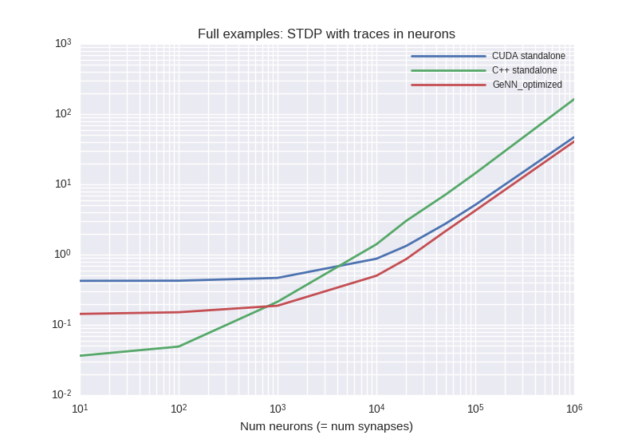

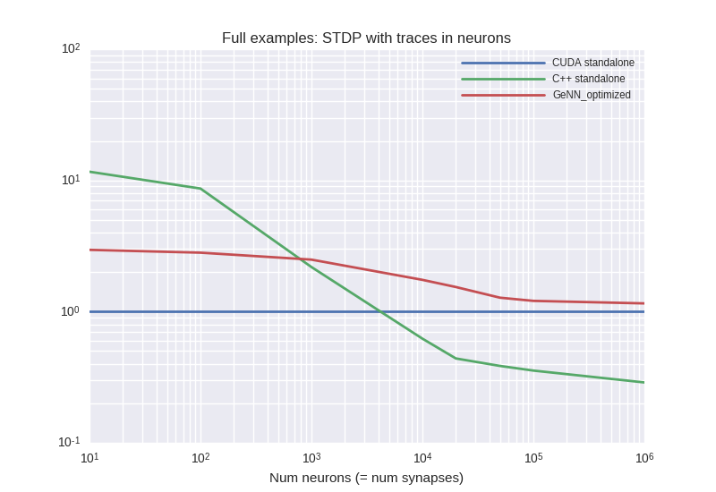

<details><summary>Examplary `nvprof` results for **CUDAStandaloneConfiguration**</summary><p>
Profile summary for `N = 1000`:

```
==22958== NVPROF is profiling process 22958, command: ./main
==22958== Profiling application: ./main
==22958== Profiling result:
Time(%)      Time     Calls       Avg       Min       Max  Name
 23.34%  76.426ms     10000  7.6420us  3.2960us  26.944us  kernel_synapses_pre_codeobject(unsigned int, unsigned int, unsigned int, int*, unsigned int, double*, int, int*, double*, double, double*, int, int*, int, int*, int, double*)
 19.43%  63.625ms     20000  3.1810us  3.0400us  3.7120us  [CUDA memset]
 18.23%  59.686ms     10000  5.9680us  5.6320us  8.0960us  kernel_neurongroup_1_stateupdater_codeobject(unsigned int, unsigned int, double*, double*, double*, double*)
 11.04%  36.142ms     10000  3.6140us  3.3920us  7.0730us  kernel_synapses_post_codeobject(unsigned int, unsigned int, unsigned int, int*, unsigned int, double*, int, int*, double, double*, int, double*, int*, int, int)
  9.09%  29.761ms     10000  2.9760us  2.8800us  3.5840us  kernel_neurongroup_stateupdater_codeobject(unsigned int, unsigned int, double*, double*)
  7.99%  26.155ms     10000  2.6150us  2.2080us  2.8800us  kernel_neurongroup_thresholder_codeobject(unsigned int, unsigned int, int*, double*, double*, float*)
  5.47%  17.908ms     10000  1.7900us  1.7280us  2.4640us  kernel_neurongroup_1_thresholder_codeobject(unsigned int, unsigned int, int*, double*)
  5.26%  17.212ms     10000  1.7210us  1.6640us  2.3680us  kernel_neurongroup_1_resetter_codeobject(unsigned int, unsigned int, double*, int*, double*)
  0.16%  534.91us         1  534.91us  534.91us  534.91us  void gen_sequenced<curandStateXORWOW, float, int, __operator_&__(float curand_uniform_noargs<curandStateXORWOW>(curandStateXORWOW*, int))>(curandStateXORWOW*, float*, unsigned long, unsigned long, int)

==22958== API calls:
Time(%)      Time     Calls       Avg       Min       Max  Name
 66.19%  628.57ms     70001  8.9790us  7.8060us  7.0815ms  cudaLaunch
 18.98%  180.22ms     20000  9.0110us  8.1910us  325.17us  cudaMemset
 10.84%  102.92ms    570005     180ns     148ns  322.77us  cudaSetupArgument
  2.05%  19.421ms     70002     277ns     224ns  322.72us  cudaGetLastError
  1.92%  18.237ms     70001     260ns     204ns  7.6100us  cudaConfigureCall
  0.01%  139.26us         1  139.26us  139.26us  139.26us  cudaMalloc
  0.01%  47.740us         1  47.740us  47.740us  47.740us  cudaMemGetInfo
  0.00%  38.641us        74     522ns     463ns  1.3230us  cudaOccupancyMaxActiveBlocksPerMultiprocessorWithFlags
  0.00%  31.070us        12  2.5890us  2.0180us  4.6520us  cudaFuncGetAttributes
  0.00%  17.325us         1  17.325us  17.325us  17.325us  cudaDeviceSynchronize
  0.00%  7.2280us        20     361ns     279ns     764ns  cudaDeviceGetAttribute
  0.00%  3.4300us         5     686ns     519ns  1.2200us  cudaGetDevice

```

</p></details>


<details><summary>Examplary `nvprof` results for **GeNNConfigurationOptimized**</summary><p>
Profile summary for `N = 1000`:

```
==23186== NVPROF is profiling process 23186, command: ./main test 1.0 1
==23186== Profiling application: ./main test 1.0 1
==23186== Profiling result:
Time(%)      Time     Calls       Avg       Min       Max  Name
 45.72%  59.376ms     10000  5.9370us  1.4400us  22.209us  calcSynapses
 36.59%  47.519ms     10000  4.7510us  3.7440us  7.2000us  calcNeurons
 17.59%  22.844ms     10000  2.2840us  2.0800us  5.8240us  learnSynapsesPost
  0.07%  90.016us        70  1.2850us     928ns  2.0480us  [CUDA memcpy HtoD]
  0.04%  51.168us        19  2.6930us  1.9520us  4.6080us  [CUDA memcpy DtoH]

==23186== API calls:
Time(%)      Time     Calls       Avg       Min       Max  Name
 48.78%  251.54ms        20  12.577ms  7.1400us  250.44ms  cudaHostAlloc
 47.58%  245.35ms     30000  8.1780us  7.6280us  342.38us  cudaLaunch
  1.85%  9.5606ms     30000     318ns     255ns  320.84us  cudaConfigureCall
  1.41%  7.2598ms     30000     241ns     222ns  5.1580us  cudaSetupArgument
  0.22%  1.1470ms        93  12.333us     278ns  32.150us  cudaMemcpy
  0.10%  513.51us        20  25.675us  6.0810us  139.05us  cudaMalloc
  0.04%  228.09us        83  2.7480us     140ns  98.263us  cuDeviceGetAttribute
  0.01%  31.411us         1  31.411us  31.411us  31.411us  cuDeviceTotalMem
  0.01%  27.452us         1  27.452us  27.452us  27.452us  cuDeviceGetName
  0.00%  12.004us         1  12.004us  12.004us  12.004us  cudaSetDevice
  0.00%  11.525us        20     576ns     352ns  2.0890us  cudaGetSymbolAddress
  0.00%  1.6280us         2     814ns     489ns  1.1390us  cuDeviceGetCount
  0.00%  1.5650us         1  1.5650us  1.5650us  1.5650us  cudaGetDeviceCount
  0.00%     594ns         2     297ns     230ns     364ns  cuDeviceGet

```

</p></details>


***

### STDPNotEventDriven

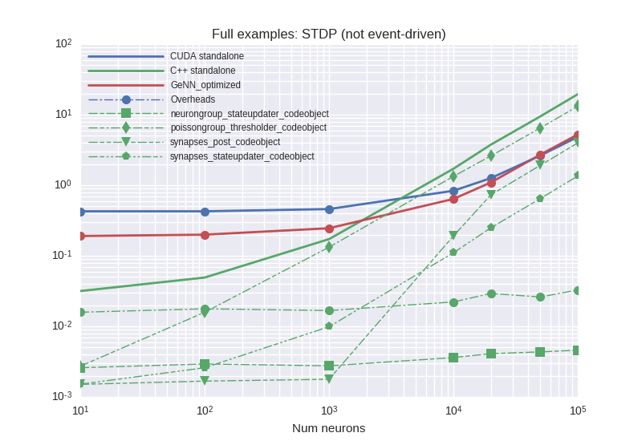


<details><summary>Examplary `nvprof` results for **CUDAStandaloneConfiguration**</summary><p>
Profile summary for `N = 1000`:

```
==5309== NVPROF is profiling process 5309, command: ./main
==5309== Profiling application: ./main
==5309== Profiling result:
Time(%)      Time     Calls       Avg       Min       Max  Name
 23.35%  73.232ms     10000  7.3230us  3.4560us  24.544us  kernel_synapses_pre_codeobject(unsigned int, unsigned int, unsigned int, int*, unsigned int, double*, int, double*, int, double*, int, int*, int, double*, double, double*, int, int*, int, int*)
 20.25%  63.528ms     20000  3.1760us  3.0400us  3.7440us  [CUDA memset]
 17.18%  53.899ms     10000  5.3890us  5.0240us  7.6480us  kernel_neurongroup_stateupdater_codeobject(unsigned int, unsigned int, double*, double*, double*)
 11.40%  35.764ms     10000  3.5760us  3.3920us  6.2720us  kernel_synapses_post_codeobject(unsigned int, unsigned int, unsigned int, int*, unsigned int, double*, int, double*, int, double*, int, int*, int, double, double*, int, int*)
  9.18%  28.794ms     10000  2.8790us  2.7840us  3.3600us  kernel_synapses_stateupdater_codeobject(unsigned int, unsigned int, double*, int, double*, int, double*, int*)
  7.72%  24.206ms     10000  2.4200us  2.2080us  2.8480us  kernel_poissongroup_thresholder_codeobject(unsigned int, unsigned int, int*, double*, double*, float*)
  5.48%  17.200ms     10000  1.7190us  1.6640us  1.9840us  kernel_neurongroup_resetter_codeobject(unsigned int, unsigned int, double*, int*)
  5.26%  16.509ms     10000  1.6500us  1.5360us  2.4960us  kernel_neurongroup_thresholder_codeobject(unsigned int, unsigned int, int*, double*)
  0.17%  534.31us         1  534.31us  534.31us  534.31us  void gen_sequenced<curandStateXORWOW, float, int, __operator_&__(float curand_uniform_noargs<curandStateXORWOW>(curandStateXORWOW*, int))>(curandStateXORWOW*, float*, unsigned long, unsigned long, int)

==5309== API calls:
Time(%)      Time     Calls       Avg       Min       Max  Name
 65.37%  632.10ms     70001  9.0290us  7.8220us  7.1147ms  cudaLaunch
 18.21%  176.05ms     20000  8.8020us  7.9140us  65.993us  cudaMemset
 11.98%  115.80ms    640005     180ns     150ns  325.82us  cudaSetupArgument
  2.23%  21.584ms     70002     308ns     218ns  325.68us  cudaGetLastError
  2.19%  21.175ms     70001     302ns     199ns  314.30us  cudaConfigureCall
  0.01%  138.56us         1  138.56us  138.56us  138.56us  cudaMalloc
  0.00%  48.141us         1  48.141us  48.141us  48.141us  cudaMemGetInfo
  0.00%  40.939us        74     553ns     496ns  1.2830us  cudaOccupancyMaxActiveBlocksPerMultiprocessorWithFlags
  0.00%  30.402us        12  2.5330us  2.0360us  4.5650us  cudaFuncGetAttributes
  0.00%  17.493us         1  17.493us  17.493us  17.493us  cudaDeviceSynchronize
  0.00%  6.8790us        20     343ns     280ns     612ns  cudaDeviceGetAttribute
  0.00%  3.7860us         5     757ns     587ns  1.2530us  cudaGetDevice

```

</p></details>


<details><summary>Examplary `nvprof` results for **GeNNConfigurationOptimized**</summary><p>
Profile summary for `N = 1000`:

```
==5547== NVPROF is profiling process 5547, command: ./main test 1.0 1
==5547== Profiling application: ./main test 1.0 1
==5547== Profiling result:
Time(%)      Time     Calls       Avg       Min       Max  Name
 38.01%  64.497ms     10000  6.4490us  1.4720us  25.121us  calcSynapses
 24.89%  42.225ms     10000  4.2220us  3.3600us  6.1120us  calcNeurons
 22.75%  38.605ms     10000  3.8600us  3.2320us  5.5680us  calcSynapseDynamics
 14.26%  24.189ms     10000  2.4180us  2.1120us  6.5920us  learnSynapsesPost
  0.06%  96.512us        72  1.3400us     928ns  2.0800us  [CUDA memcpy HtoD]
  0.03%  54.080us        19  2.8460us  1.9840us  4.6720us  [CUDA memcpy DtoH]

==5547== API calls:
Time(%)      Time     Calls       Avg       Min       Max  Name
 53.26%  318.06ms     40000  7.9510us  7.3870us  323.19us  cudaLaunch
 42.53%  254.01ms        21  12.096ms  7.5310us  252.89ms  cudaHostAlloc
  2.21%  13.204ms     40000     330ns     252ns  332.54us  cudaConfigureCall
  1.66%  9.9116ms     40000     247ns     233ns  5.2730us  cudaSetupArgument
  0.20%  1.1942ms        97  12.311us     197ns  30.710us  cudaMemcpy
  0.08%  498.29us        21  23.728us  6.1100us  122.22us  cudaMalloc
  0.04%  227.33us        83  2.7380us     149ns  97.591us  cuDeviceGetAttribute
  0.01%  31.273us         1  31.273us  31.273us  31.273us  cuDeviceTotalMem
  0.00%  27.431us         1  27.431us  27.431us  27.431us  cuDeviceGetName
  0.00%  11.816us         1  11.816us  11.816us  11.816us  cudaSetDevice
  0.00%  11.690us        21     556ns     357ns  2.1550us  cudaGetSymbolAddress
  0.00%  1.4320us         2     716ns     525ns     907ns  cuDeviceGetCount
  0.00%  1.3390us         1  1.3390us  1.3390us  1.3390us  cudaGetDeviceCount
  0.00%     577ns         2     288ns     252ns     325ns  cuDeviceGet

```

</p></details>


***

### SparseHighRateSynapsesOnly

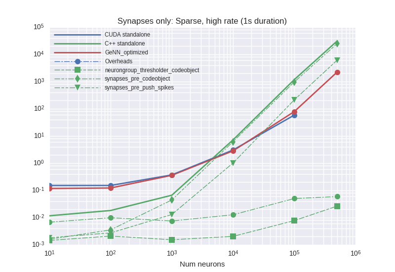
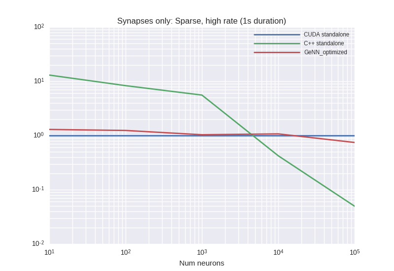

<details><summary>Examplary `nvprof` results for **CUDAStandaloneConfiguration**</summary><p>
Profile summary for `N = 1000`:

```
==29929== NVPROF is profiling process 29929, command: ./main
==29929== Profiling application: ./main
==29929== Profiling result:
Time(%)      Time     Calls       Avg       Min       Max  Name
 86.04%  284.29ms     10000  28.429us  27.328us  32.544us  kernel_synapses_pre_codeobject(unsigned int, unsigned int, unsigned int, int*, unsigned int, double*, int, int*, int, double, double*, int*, int, int*)
  8.93%  29.521ms     10000  2.9520us  2.8800us  4.4480us  [CUDA memset]
  5.03%  16.619ms     10000  1.6610us  1.5360us  2.4000us  kernel_neurongroup_thresholder_codeobject(unsigned int, unsigned int, int*)

==29929== API calls:
Time(%)      Time     Calls       Avg       Min       Max  Name
 58.38%  206.98ms     20000  10.348us  8.5120us  8.2431ms  cudaLaunch
 28.06%  99.491ms     10000  9.9490us  8.5150us  27.390us  cudaMemset
  8.91%  31.590ms    170000     185ns     150ns  313.25us  cudaSetupArgument
  1.79%  6.3337ms     20000     316ns     206ns  303.30us  cudaConfigureCall
  1.73%  6.1183ms     20000     305ns     199ns  315.94us  cudaGetLastError
  1.12%  3.9780ms         1  3.9780ms  3.9780ms  3.9780ms  cudaDeviceSynchronize
  0.01%  46.286us         1  46.286us  46.286us  46.286us  cudaMemGetInfo
  0.00%  8.3370us         3  2.7790us  2.1280us  3.2430us  cudaFuncGetAttributes
  0.00%  5.4670us         3  1.8220us     649ns  2.4930us  cudaOccupancyMaxActiveBlocksPerMultiprocessorWithFlags
  0.00%  1.5130us         4     378ns     295ns     546ns  cudaDeviceGetAttribute
  0.00%     820ns         1     820ns     820ns     820ns  cudaGetDevice

```

</p></details>


<details><summary>Examplary `nvprof` results for **GeNNConfigurationOptimized**</summary><p>
Profile summary for `N = 1000`:

```
==30148== NVPROF is profiling process 30148, command: ./main test 1.0 1
==30148== Profiling application: ./main test 1.0 1
==30148== Profiling result:
Time(%)      Time     Calls       Avg       Min       Max  Name
 88.25%  301.73ms     10000  30.173us  3.3920us  32.704us  calcSynapses
 11.72%  40.058ms     10000  4.0050us  3.8080us  4.8640us  calcNeurons
  0.02%  61.280us        44  1.3920us     960ns  3.2000us  [CUDA memcpy HtoD]
  0.01%  39.392us        14  2.8130us  1.9840us  6.8480us  [CUDA memcpy DtoH]

==30148== API calls:
Time(%)      Time     Calls       Avg       Min       Max  Name
 54.90%  442.78ms        12  36.898ms  14.006us  441.12ms  cudaHostAlloc
 40.88%  329.68ms     20000  16.483us  7.7050us  338.70us  cudaLaunch
  2.49%  20.082ms        61  329.22us     400ns  18.995ms  cudaMemcpy
  0.94%  7.5995ms     20000     379ns     255ns  310.22us  cudaConfigureCall
  0.67%  5.4120ms     20000     270ns     222ns  314.38us  cudaSetupArgument
  0.08%  639.34us        12  53.278us  11.895us  172.21us  cudaMalloc
  0.03%  235.92us        83  2.8420us     155ns  101.36us  cuDeviceGetAttribute
  0.00%  32.471us         1  32.471us  32.471us  32.471us  cuDeviceTotalMem
  0.00%  30.953us         1  30.953us  30.953us  30.953us  cuDeviceGetName
  0.00%  14.056us        12  1.1710us     746ns  3.5320us  cudaGetSymbolAddress
  0.00%  12.473us         1  12.473us  12.473us  12.473us  cudaSetDevice
  0.00%  1.5390us         1  1.5390us  1.5390us  1.5390us  cudaGetDeviceCount
  0.00%  1.4990us         2     749ns     424ns  1.0750us  cuDeviceGetCount
  0.00%     514ns         2     257ns     199ns     315ns  cuDeviceGet

```

</p></details>


***

### SparseLowRateSynapsesOnly
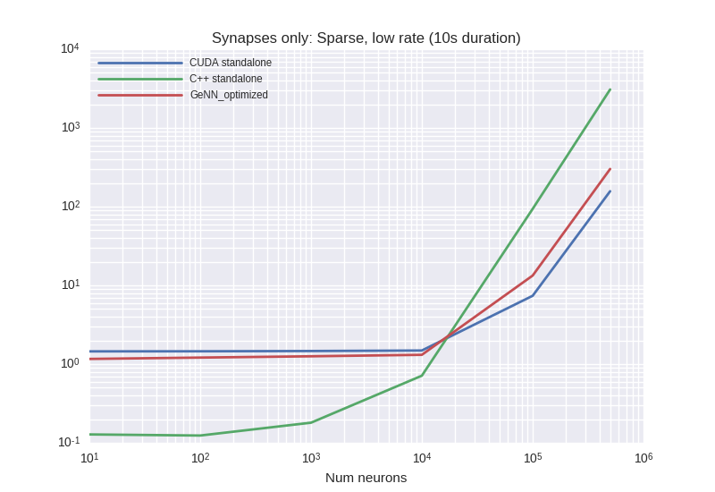

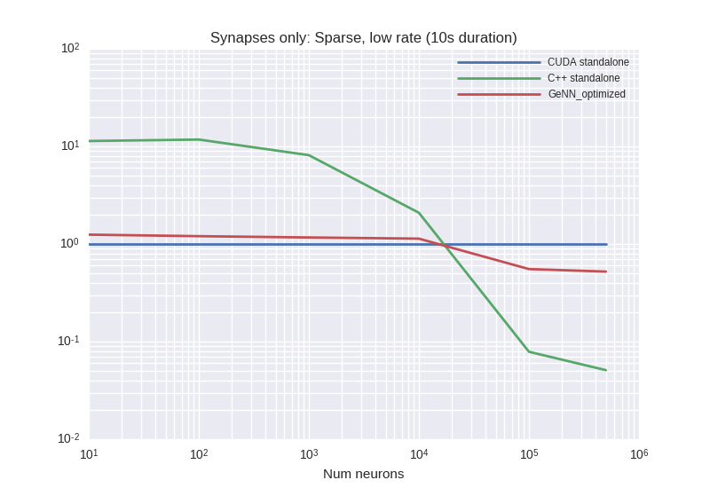

<details><summary>Examplary `nvprof` results for **CUDAStandaloneConfiguration**</summary><p>
Profile summary for `N = 1000`:

```
==8193== NVPROF is profiling process 8193, command: ./main
==8193== Profiling application: ./main
==8193== Profiling result:
Time(%)      Time     Calls       Avg       Min       Max  Name
 55.84%  593.43ms    100000  5.9340us  5.4400us  6.9120us  kernel_synapses_pre_codeobject(unsigned int, unsigned int, unsigned int, int*, unsigned int, double*, int, int*, int, double, double*, int*, int, int*)
 28.97%  307.88ms    100000  3.0780us  3.0400us  3.6800us  [CUDA memset]
 15.19%  161.38ms    100000  1.6130us  1.5040us  2.5920us  kernel_neurongroup_thresholder_codeobject(unsigned int, unsigned int, int*)

==8193== API calls:
Time(%)      Time     Calls       Avg       Min       Max  Name
 55.92%  1.79370s    200000  8.9680us  7.6320us  7.2529ms  cudaLaunch
 29.82%  956.72ms    100000  9.5670us  8.2580us  21.256ms  cudaMemset
 10.51%  337.16ms   1700000     198ns     139ns  340.09us  cudaSetupArgument
  1.91%  61.333ms    200000     306ns     217ns  368.29us  cudaGetLastError
  1.83%  58.844ms    200000     294ns     168ns  332.73us  cudaConfigureCall
  0.00%  45.848us         1  45.848us  45.848us  45.848us  cudaMemGetInfo
  0.00%  12.992us         1  12.992us  12.992us  12.992us  cudaDeviceSynchronize
  0.00%  8.6600us         3  2.8860us  2.0910us  3.5820us  cudaFuncGetAttributes
  0.00%  5.3760us         3  1.7920us     594ns  2.4470us  cudaOccupancyMaxActiveBlocksPerMultiprocessorWithFlags
  0.00%  1.5830us         4     395ns     305ns     591ns  cudaDeviceGetAttribute
  0.00%     829ns         1     829ns     829ns     829ns  cudaGetDevice

```

</p></details>


<details><summary>Examplary `nvprof` results for **GeNNConfigurationOptimized**</summary><p>
Profile summary for `N = 1000`:

```
==8451== NVPROF is profiling process 8451, command: ./main test 10.0 1
==8451== Profiling application: ./main test 10.0 1
==8451== Profiling result:
Time(%)      Time     Calls       Avg       Min       Max  Name
 66.88%  550.62ms    100000  5.5060us  3.4560us  6.4000us  calcSynapses
 33.11%  272.64ms    100000  2.7260us  2.6560us  3.7760us  calcNeurons
  0.01%  53.984us        44  1.2260us     960ns  2.0800us  [CUDA memcpy HtoD]
  0.00%  35.072us        14  2.5050us  1.9520us  4.7040us  [CUDA memcpy DtoH]

==8451== API calls:
Time(%)      Time     Calls       Avg       Min       Max  Name
 81.32%  1.60600s    200000  8.0290us  7.4920us  354.55us  cudaLaunch
 12.69%  250.71ms        12  20.893ms  15.503us  249.06ms  cudaHostAlloc
  3.37%  66.566ms    200000     332ns     257ns  334.65us  cudaConfigureCall
  2.52%  49.683ms    200000     248ns     225ns  334.65us  cudaSetupArgument
  0.05%  1.0155ms        61  16.647us     343ns  35.922us  cudaMemcpy
  0.03%  641.50us        12  53.458us  12.040us  174.09us  cudaMalloc
  0.01%  225.49us        83  2.7160us     135ns  97.180us  cuDeviceGetAttribute
  0.00%  31.170us         1  31.170us  31.170us  31.170us  cuDeviceTotalMem
  0.00%  26.897us         1  26.897us  26.897us  26.897us  cuDeviceGetName
  0.00%  13.730us        12  1.1440us     698ns  3.1800us  cudaGetSymbolAddress
  0.00%  11.132us         1  11.132us  11.132us  11.132us  cudaSetDevice
  0.00%  1.3520us         2     676ns     376ns     976ns  cuDeviceGetCount
  0.00%  1.3320us         1  1.3320us  1.3320us  1.3320us  cudaGetDeviceCount
  0.00%     542ns         2     271ns     213ns     329ns  cuDeviceGet

```

</p></details>


***

### SparseMediumRateSynapsesOnly

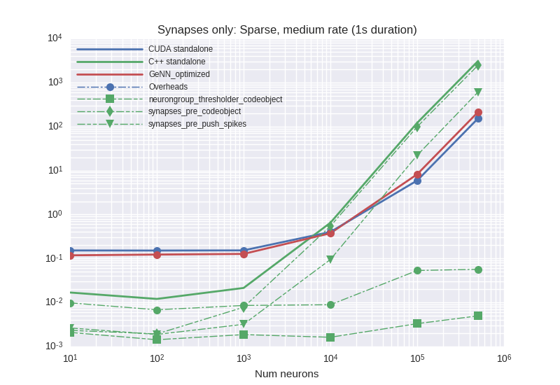


<details><summary>Examplary `nvprof` results for **CUDAStandaloneConfiguration**</summary><p>
Profile summary for `N = 1000`:

```
==16276== NVPROF is profiling process 16276, command: ./main
==16276== Profiling application: ./main
==16276== Profiling result:
Time(%)      Time     Calls       Avg       Min       Max  Name
 55.93%  59.598ms     10000  5.9590us  5.6000us  6.8480us  kernel_synapses_pre_codeobject(unsigned int, unsigned int, unsigned int, int*, unsigned int, double*, int, int*, int, double, double*, int*, int, int*)
 28.96%  30.864ms     10000  3.0860us  3.0400us  3.5840us  [CUDA memset]
 15.11%  16.106ms     10000  1.6100us  1.5040us  2.4000us  kernel_neurongroup_thresholder_codeobject(unsigned int, unsigned int, int*)

==16276== API calls:
Time(%)      Time     Calls       Avg       Min       Max  Name
 57.38%  194.03ms     20000  9.7010us  8.5280us  7.3801ms  cudaLaunch
 27.54%  93.116ms     10000  9.3110us  8.6920us  28.380us  cudaMemset
 10.82%  36.579ms    170000     215ns     184ns  349.92us  cudaSetupArgument
  2.15%  7.2682ms     20000     363ns     248ns  327.47us  cudaConfigureCall
  2.09%  7.0721ms     20000     353ns     266ns  337.12us  cudaGetLastError
  0.01%  46.564us         1  46.564us  46.564us  46.564us  cudaMemGetInfo
  0.01%  18.278us         1  18.278us  18.278us  18.278us  cudaDeviceSynchronize
  0.00%  8.5460us         3  2.8480us  2.1440us  3.4910us  cudaFuncGetAttributes
  0.00%  5.2380us         3  1.7460us     617ns  2.4330us  cudaOccupancyMaxActiveBlocksPerMultiprocessorWithFlags
  0.00%  1.7410us         4     435ns     339ns     632ns  cudaDeviceGetAttribute
  0.00%     956ns         1     956ns     956ns     956ns  cudaGetDevice

```

</p></details>


<details><summary>Examplary `nvprof` results for **GeNNConfigurationOptimized**</summary><p>
Profile summary for `N = 1000`:

```
==16495== NVPROF is profiling process 16495, command: ./main test 1.0 1
==16495== Profiling application: ./main test 1.0 1
==16495== Profiling result:
Time(%)      Time     Calls       Avg       Min       Max  Name
 67.04%  60.321ms     10000  6.0320us  3.4560us  6.5280us  calcSynapses
 32.86%  29.567ms     10000  2.9560us  2.9120us  3.7440us  calcNeurons
  0.06%  54.017us        44  1.2270us     960ns  2.0480us  [CUDA memcpy HtoD]
  0.04%  36.032us        14  2.5730us  2.0480us  4.7360us  [CUDA memcpy DtoH]

==16495== API calls:
Time(%)      Time     Calls       Avg       Min       Max  Name
 62.23%  290.68ms        12  24.223ms  7.8400us  289.60ms  cudaHostAlloc
 35.13%  164.11ms     20000  8.2050us  7.5690us  348.13us  cudaLaunch
  1.32%  6.1557ms     20000     307ns     255ns  328.87us  cudaConfigureCall
  1.01%  4.7095ms     20000     235ns     202ns  341.44us  cudaSetupArgument
  0.16%  750.68us        61  12.306us     358ns  28.177us  cudaMemcpy
  0.09%  419.68us        12  34.973us  6.2030us  120.19us  cudaMalloc
  0.05%  227.14us        83  2.7360us     145ns  97.726us  cuDeviceGetAttribute
  0.01%  31.327us         1  31.327us  31.327us  31.327us  cuDeviceTotalMem
  0.01%  26.548us         1  26.548us  26.548us  26.548us  cuDeviceGetName
  0.00%  11.315us         1  11.315us  11.315us  11.315us  cudaSetDevice
  0.00%  7.9470us        12     662ns     405ns  1.9600us  cudaGetSymbolAddress
  0.00%  1.5460us         2     773ns     495ns  1.0510us  cuDeviceGetCount
  0.00%  1.4000us         1  1.4000us  1.4000us  1.4000us  cudaGetDeviceCount
  0.00%     578ns         2     289ns     223ns     355ns  cuDeviceGet

```

</p></details>


***

### VerySparseMediumRateSynapsesOnly
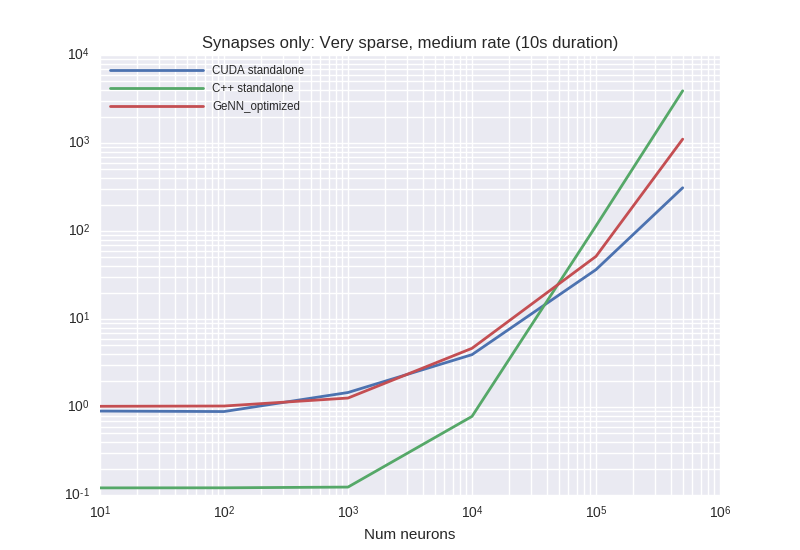
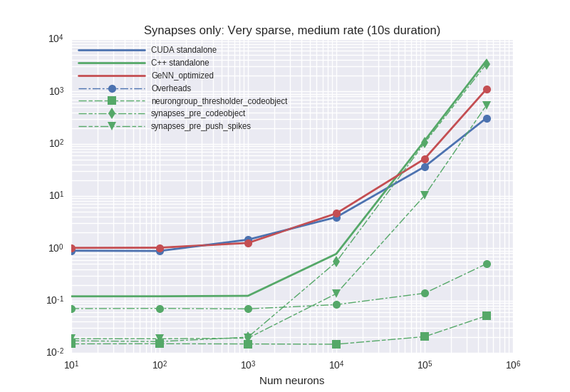


<details><summary>Examplary `nvprof` results for **CUDAStandaloneConfiguration**</summary><p>
Profile summary for `N = 1000`:

```
==6005== NVPROF is profiling process 6005, command: ./main
==6005== Profiling application: ./main
==6005== Profiling result:
Time(%)      Time     Calls       Avg       Min       Max  Name
 55.29%  580.67ms    100000  5.8060us  5.2160us  6.6240us  kernel_synapses_pre_codeobject(unsigned int, unsigned int, unsigned int, int*, unsigned int, double*, int, int*, int, double, double*, int*, int, int*)
 29.34%  308.08ms    100000  3.0800us  3.0400us  3.7120us  [CUDA memset]
 15.37%  161.45ms    100000  1.6140us  1.5040us  2.5920us  kernel_neurongroup_thresholder_codeobject(unsigned int, unsigned int, int*)

==6005== API calls:
Time(%)      Time     Calls       Avg       Min       Max  Name
 56.44%  1.83924s    200000  9.1960us  7.9810us  7.4326ms  cudaLaunch
 29.07%  947.22ms    100000  9.4720us  8.1380us  21.897ms  cudaMemset
 10.90%  355.11ms   1700000     208ns     171ns  355.90us  cudaSetupArgument
  1.82%  59.307ms    200000     296ns     177ns  333.92us  cudaConfigureCall
  1.77%  57.629ms    200000     288ns     202ns  337.07us  cudaGetLastError
  0.00%  46.411us         1  46.411us  46.411us  46.411us  cudaMemGetInfo
  0.00%  13.163us         1  13.163us  13.163us  13.163us  cudaDeviceSynchronize
  0.00%  8.2890us         3  2.7630us  2.0680us  3.3230us  cudaFuncGetAttributes
  0.00%  5.4810us         3  1.8270us     565ns  2.5590us  cudaOccupancyMaxActiveBlocksPerMultiprocessorWithFlags
  0.00%  1.5840us         4     396ns     318ns     545ns  cudaDeviceGetAttribute
  0.00%     924ns         1     924ns     924ns     924ns  cudaGetDevice

```

</p></details>


<details><summary>Examplary `nvprof` results for **GeNNConfigurationOptimized**</summary><p>
Profile summary for `N = 1000`:

```
==6274== NVPROF is profiling process 6274, command: ./main test 10.0 1
==6274== Profiling application: ./main test 10.0 1
==6274== Profiling result:
Time(%)      Time     Calls       Avg       Min       Max  Name
 69.30%  617.28ms    100000  6.1720us  3.3600us  7.5200us  calcSynapses
 30.70%  273.43ms    100000  2.7340us  2.6560us  3.7440us  calcNeurons
  0.01%  53.472us        44  1.2150us     960ns  2.0480us  [CUDA memcpy HtoD]
  0.00%  34.560us        14  2.4680us  1.9520us  4.6080us  [CUDA memcpy DtoH]

==6274== API calls:
Time(%)      Time     Calls       Avg       Min       Max  Name
 82.48%  1.61117s    200000  8.0550us  7.0380us  353.83us  cudaLaunch
 11.62%  226.99ms        12  18.916ms  7.8850us  225.88ms  cudaHostAlloc
  3.30%  64.540ms    200000     322ns     238ns  338.74us  cudaConfigureCall
  2.52%  49.132ms    200000     245ns     211ns  344.36us  cudaSetupArgument
  0.04%  744.26us        61  12.200us     293ns  32.120us  cudaMemcpy
  0.02%  421.09us        12  35.090us  6.1780us  119.69us  cudaMalloc
  0.01%  226.88us        83  2.7330us     137ns  97.756us  cuDeviceGetAttribute
  0.00%  31.259us         1  31.259us  31.259us  31.259us  cuDeviceTotalMem
  0.00%  28.119us         1  28.119us  28.119us  28.119us  cuDeviceGetName
  0.00%  11.457us         1  11.457us  11.457us  11.457us  cudaSetDevice
  0.00%  8.0410us        12     670ns     397ns  1.9590us  cudaGetSymbolAddress
  0.00%  1.6770us         2     838ns     479ns  1.1980us  cuDeviceGetCount
  0.00%  1.4060us         1  1.4060us  1.4060us  1.4060us  cudaGetDeviceCount
  0.00%     507ns         2     253ns     231ns     276ns  cuDeviceGet

```

</p></details>


***

### Vogels


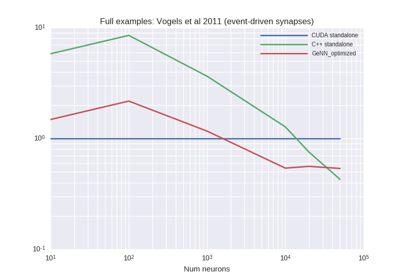

<details><summary>Examplary `nvprof` results for **CUDAStandaloneConfiguration**</summary><p>
Profile summary for `N = 1000`:

```
==12243== NVPROF is profiling process 12243, command: ./main
==12243== Profiling application: ./main
==12243== Profiling result:
Time(%)      Time     Calls       Avg       Min       Max  Name
 27.91%  192.82ms     10000  19.281us  3.1360us  2.1170ms  kernel_synapses_pre_codeobject(unsigned int, unsigned int, unsigned int, int*, unsigned int, double*, int, double*, int*, int, int*, double, int*, int)
 25.45%  175.79ms     10000  17.578us  3.3280us  1.7610ms  kernel_synapses_2_post_codeobject(unsigned int, unsigned int, unsigned int, int*, unsigned int, double*, int, double*, int, double*, int, int*, int, double, double*, int, int*)
 15.82%  109.25ms     10000  10.925us  3.3600us  1.1837ms  kernel_synapses_2_pre_codeobject(unsigned int, unsigned int, unsigned int, int*, unsigned int, double*, int, double*, int, double*, int, int*, int, int*, int, double, double*, int, double*, int*)
 14.27%  98.554ms     10000  9.8550us  3.1680us  1.0373ms  kernel_synapses_1_pre_codeobject(unsigned int, unsigned int, unsigned int, int*, unsigned int, double*, int, int*, int, int*, double*, double, int*, int)
  5.95%  41.110ms     10000  4.1110us  3.7760us  5.3120us  kernel_neurongroup_stateupdater_codeobject(unsigned int, unsigned int, double*, double*, double, double*, double*, double*, bool*)
  4.53%  31.297ms     10000  3.1290us  2.9440us  4.3200us  [CUDA memset]
  3.54%  24.435ms     10000  2.4430us  2.0160us  6.0160us  kernel_neurongroup_thresholder_codeobject(unsigned int, unsigned int, int*, double, double*, double*, bool*)
  2.53%  17.499ms     10000  1.7490us  1.5360us  2.8160us  kernel_neurongroup_resetter_codeobject(unsigned int, unsigned int, double*, int*, bool*)

==12243== API calls:
Time(%)      Time     Calls       Avg       Min       Max  Name
 69.99%  645.08ms     70000  9.2150us  8.1890us  7.3493ms  cudaLaunch
 16.20%  149.30ms    860000     173ns     144ns  1.1943ms  cudaSetupArgument
 10.32%  95.084ms     10000  9.5080us  8.7600us  327.83us  cudaMemset
  1.76%  16.177ms     70000     231ns     200ns  10.120us  cudaGetLastError
  1.72%  15.875ms     70000     226ns     181ns  5.3450us  cudaConfigureCall
  0.01%  51.450us         1  51.450us  51.450us  51.450us  cudaMemGetInfo
  0.00%  25.843us        10  2.5840us  2.0060us  4.6820us  cudaFuncGetAttributes
  0.00%  25.773us        41     628ns     481ns  2.9340us  cudaOccupancyMaxActiveBlocksPerMultiprocessorWithFlags
  0.00%  17.259us         1  17.259us  17.259us  17.259us  cudaDeviceSynchronize
  0.00%  5.8620us        12     488ns     313ns  1.3830us  cudaDeviceGetAttribute
  0.00%  3.0770us         3  1.0250us     630ns  1.5860us  cudaGetDevice

```

</p></details>


<details><summary>Examplary `nvprof` results for **GeNNConfigurationOptimized**</summary><p>
Profile summary for `N = 1000`:

```
==12518== NVPROF is profiling process 12518, command: ./main test 1.0 1
==12518== Profiling application: ./main test 1.0 1
==12518== Profiling result:
Time(%)      Time     Calls       Avg       Min       Max  Name
 59.61%  415.51ms     10000  41.550us  2.0480us  6.0015ms  learnSynapsesPost
 29.39%  204.87ms     10000  20.486us  1.5680us  2.4941ms  calcSynapses
 10.93%  76.180ms     10000  7.6170us  6.6240us  14.560us  calcNeurons
  0.06%  385.28us        86  4.4800us     960ns  42.752us  [CUDA memcpy HtoD]
  0.02%  130.11us        20  6.5050us  1.9840us  40.641us  [CUDA memcpy DtoH]

==12518== API calls:
Time(%)      Time     Calls       Avg       Min       Max  Name
 66.01%  690.75ms     30000  23.025us  7.6920us  649.80us  cudaLaunch
 29.49%  308.57ms        26  11.868ms  7.6940us  306.48ms  cudaHostAlloc
  2.65%  27.715ms       112  247.46us     184ns  25.977ms  cudaMemcpy
  0.97%  10.186ms     30000     339ns     250ns  318.13us  cudaConfigureCall
  0.77%  8.0652ms     30000     268ns     222ns  319.03us  cudaSetupArgument
  0.07%  763.51us        26  29.365us  6.1460us  121.30us  cudaMalloc
  0.02%  226.59us        83  2.7300us     136ns  97.714us  cuDeviceGetAttribute
  0.00%  31.319us         1  31.319us  31.319us  31.319us  cuDeviceTotalMem
  0.00%  28.107us         1  28.107us  28.107us  28.107us  cuDeviceGetName
  0.00%  15.639us        26     601ns     388ns  2.0380us  cudaGetSymbolAddress
  0.00%  11.574us         1  11.574us  11.574us  11.574us  cudaSetDevice
  0.00%  1.7010us         2     850ns     538ns  1.1630us  cuDeviceGetCount
  0.00%  1.5690us         1  1.5690us  1.5690us  1.5690us  cudaGetDeviceCount
  0.00%     540ns         2     270ns     227ns     313ns  cuDeviceGet

```

</p></details>


***

### VogelsWithSynapticDynamic
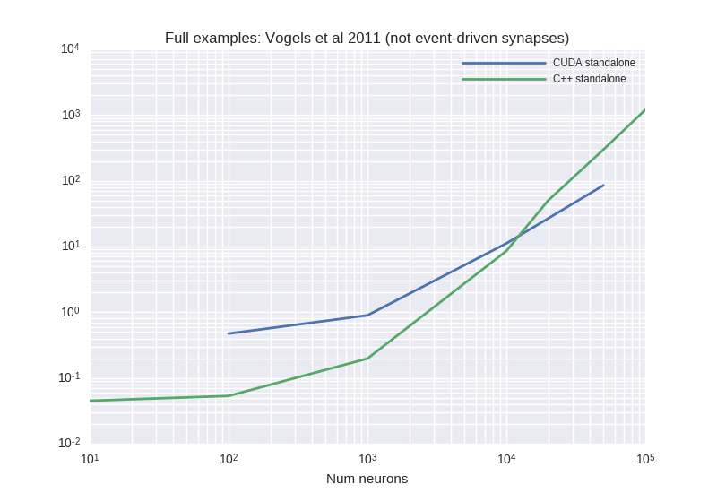
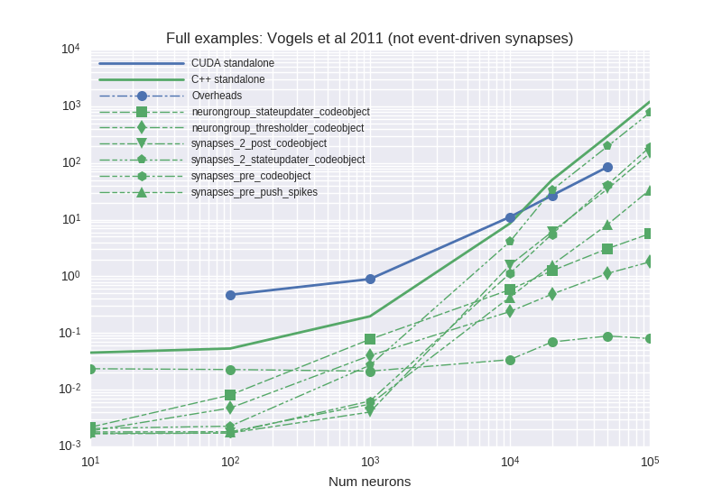


<details><summary>Examplary `nvprof` results for **CUDAStandaloneConfiguration**</summary><p>
Profile summary for `N = 1000`:

```
==6312== NVPROF is profiling process 6312, command: ./main
==6312== Profiling application: ./main
==6312== Profiling result:
Time(%)      Time     Calls       Avg       Min       Max  Name
 27.18%  194.20ms     10000  19.419us  3.1680us  2.1194ms  kernel_synapses_pre_codeobject(unsigned int, unsigned int, unsigned int, int*, unsigned int, double*, int, double*, int*, int, int*, double, int*, int)
 22.86%  163.34ms     10000  16.333us  3.1040us  1.6753ms  kernel_synapses_2_post_codeobject(unsigned int, unsigned int, unsigned int, int*, unsigned int, double*, int, int*, int, double, double*, int, double*, int, int*, double*, int)
 14.99%  107.12ms     10000  10.711us  3.2960us  1.1295ms  kernel_synapses_2_pre_codeobject(unsigned int, unsigned int, unsigned int, int*, unsigned int, double*, int, int*, int, int*, double, double*, int, double*, double*, int, int*, int, double*, int)
 14.22%  101.59ms     10000  10.158us  3.2960us  1.0383ms  kernel_synapses_1_pre_codeobject(unsigned int, unsigned int, unsigned int, int*, unsigned int, double*, int, int*, int, int*, double*, double, int*, int)
  5.84%  41.697ms     10000  4.1690us  3.8720us  5.5360us  kernel_neurongroup_stateupdater_codeobject(unsigned int, unsigned int, double*, double*, double, double*, double*, double*, bool*)
  4.71%  33.655ms     10000  3.3650us  3.2320us  4.1280us  kernel_synapses_2_stateupdater_codeobject(unsigned int, unsigned int, int*, double*, int, double*, int, double*)
  4.37%  31.213ms     10000  3.1210us  3.0400us  4.1920us  [CUDA memset]
  3.37%  24.073ms     10000  2.4070us  2.0160us  5.7920us  kernel_neurongroup_thresholder_codeobject(unsigned int, unsigned int, int*, double, double*, double*, bool*)
  2.45%  17.497ms     10000  1.7490us  1.5360us  2.7840us  kernel_neurongroup_resetter_codeobject(unsigned int, unsigned int, double*, int*, bool*)

==6312== API calls:
Time(%)      Time     Calls       Avg       Min       Max  Name
 70.49%  724.20ms     80000  9.0520us  7.8180us  7.3109ms  cudaLaunch
 16.18%  166.25ms    940000     176ns     148ns  532.24us  cudaSetupArgument
  9.28%  95.356ms     10000  9.5350us  8.8100us  1.1346ms  cudaMemset
  2.07%  21.258ms     80000     265ns     188ns  322.95us  cudaConfigureCall
  1.97%  20.198ms     80000     252ns     221ns  60.788us  cudaGetLastError
  0.00%  51.002us         1  51.002us  51.002us  51.002us  cudaMemGetInfo
  0.00%  42.841us         1  42.841us  42.841us  42.841us  cudaDeviceSynchronize
  0.00%  41.487us        74     560ns     469ns  2.5840us  cudaOccupancyMaxActiveBlocksPerMultiprocessorWithFlags
  0.00%  31.858us        12  2.6540us  1.9920us  4.7290us  cudaFuncGetAttributes
  0.00%  6.5530us        16     409ns     280ns  1.1330us  cudaDeviceGetAttribute
  0.00%  3.9370us         4     984ns     604ns  1.7060us  cudaGetDevice

```

</p></details>


