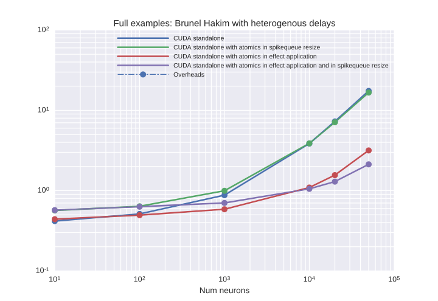
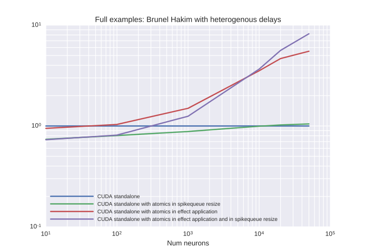

# Benchmark results from 28.11.2017
## Description:


## Last git log:
```
commit 8987de24ed9f4a3b1a276496407fca1087f04004
Author: Denis Alevi <mail@denisalevi.de>
Date:   Mon Nov 20 14:31:09 2017 +0100

    Fix critical section to include the actual pushing

```
There is also a `git diff` saved in the current directory.

## Results

### BrunelHakimModelHeterogeneousDelay




<details><summary>Examplary `nvprof` results for **CUDAStandaloneConfigurationBrunelHeterogAndPushAtomicResize**</summary><p>
Profile summary for `N = 1000`:

```
==11697== NVPROF is profiling process 11697, command: ./main
==11697== Profiling application: ./main
==11697== Profiling result:
            Type  Time(%)      Time     Calls       Avg       Min       Max  Name
 GPU activities:   35.88%  122.08ms      2517  48.504us  14.144us  1.1319ms  _run_synapses_pre_push_spikes_push_kernel(unsigned int, unsigned int, unsigned int, int*)
                   18.92%  64.378ms     10000  6.4370us  3.5520us  8.5120us  kernel_synapses_pre_codeobject(unsigned int, unsigned int, unsigned int, int*, unsigned int, double*, int, int*, int, double, int*, int, double*, int*)
                   13.37%  45.473ms     10000  4.5470us  4.2560us  5.4400us  kernel_neurongroup_stateupdater_codeobject(unsigned int, unsigned int, double, double*, double*, double*, bool*, float*)
                    8.57%  29.165ms     10000  2.9160us  2.7200us  4.3200us  _run_synapses_pre_push_spikes_advance_kernel(void)
                    6.76%  22.989ms     10000  2.2980us  2.0480us  2.8160us  kernel_neurongroup_thresholder_codeobject(unsigned int, unsigned int, int*, double, double*, double*, bool*)
                    6.05%  20.569ms     10000  2.0560us  2.0160us  4.1290us  [CUDA memcpy DtoH]
                    5.33%  18.127ms     10000  1.8120us  1.6320us  3.0080us  kernel_neurongroup_resetter_codeobject(unsigned int, unsigned int, double*, int*)
                    4.91%  16.719ms     10000  1.6710us  1.3440us  2.6240us  _GLOBAL__N__69_tmpxft_00002bf1_00000000_6_neurongroup_thresholder_codeobject_cpp1_ii_97ebdcc0::_reset_neurongroup_thresholder_codeobject(int*)
                    0.22%  732.58us         1  732.58us  732.58us  732.58us  void gen_sequenced<curandStateXORWOW, float2, normal_args_st, __operator_&__(float2 curand_normal_scaled2<curandStateXORWOW>(curandStateXORWOW*, normal_args_st))>(curandStateXORWOW*, float2*, unsigned long, unsigned long, normal_args_st)
      API calls:   63.87%  668.18ms     62518  10.687us  8.5490us  9.4480ms  cudaLaunch
                   27.88%  291.67ms     10000  29.166us  18.638us  1.1319ms  cudaMemcpy
                    5.59%  58.512ms    350073     167ns     127ns  325.26us  cudaSetupArgument
                    1.38%  14.484ms     62518     231ns     156ns  327.91us  cudaConfigureCall
                    1.23%  12.835ms     52519     244ns     175ns  326.82us  cudaGetLastError
                    0.03%  305.95us         1  305.95us  305.95us  305.95us  cudaMalloc
                    0.02%  159.37us         1  159.37us  159.37us  159.37us  cudaMemGetInfo
                    0.00%  31.728us        39     813ns     618ns  3.2440us  cudaOccupancyMaxActiveBlocksPerMultiprocessorWithFlags
                    0.00%  31.555us         8  3.9440us  2.9150us  7.0990us  cudaFuncGetAttributes
                    0.00%  7.5860us         1  7.5860us  7.5860us  7.5860us  cudaDeviceSynchronize
                    0.00%  6.3490us        12     529ns     354ns  1.3930us  cudaDeviceGetAttribute
                    0.00%  4.5310us         3  1.5100us  1.0030us  2.4860us  cudaGetDevice

```

</p></details>


<details><summary>Examplary `nvprof` results for **CUDAStandaloneConfigurationPushAtomicResize**</summary><p>
Profile summary for `N = 1000`:

```
==10355== NVPROF is profiling process 10355, command: ./main
==10355== Profiling application: ./main
==10355== Profiling result:
            Type  Time(%)      Time     Calls       Avg       Min       Max  Name
 GPU activities:   57.51%  359.36ms     10000  35.935us  2.0800us  84.257us  kernel_synapses_pre_codeobject(unsigned int, unsigned int, unsigned int, int*, unsigned int, double*, int, int*, int, double, int*, int, double*, int*)
                   19.13%  119.52ms      2474  48.310us  13.376us  1.5396ms  _run_synapses_pre_push_spikes_push_kernel(unsigned int, unsigned int, unsigned int, int*)
                    6.91%  43.163ms     10000  4.3160us  4.0640us  6.1440us  kernel_neurongroup_stateupdater_codeobject(unsigned int, unsigned int, double, double*, double*, double*, bool*, float*)
                    4.20%  26.272ms     10000  2.6270us  2.5600us  4.0960us  _run_synapses_pre_push_spikes_advance_kernel(void)
                    3.48%  21.766ms     10000  2.1760us  1.9200us  2.8480us  kernel_neurongroup_thresholder_codeobject(unsigned int, unsigned int, int*, double, double*, double*, bool*)
                    3.22%  20.128ms     10000  2.0120us  1.9520us  4.3200us  [CUDA memcpy DtoH]
                    2.80%  17.511ms     10000  1.7510us  1.5360us  3.0080us  kernel_neurongroup_resetter_codeobject(unsigned int, unsigned int, double*, int*)
                    2.62%  16.370ms     10000  1.6370us  1.5360us  2.7200us  _GLOBAL__N__69_tmpxft_000026b5_00000000_6_neurongroup_thresholder_codeobject_cpp1_ii_97ebdcc0::_reset_neurongroup_thresholder_codeobject(int*)
                    0.12%  733.19us         1  733.19us  733.19us  733.19us  void gen_sequenced<curandStateXORWOW, float2, normal_args_st, __operator_&__(float2 curand_normal_scaled2<curandStateXORWOW>(curandStateXORWOW*, normal_args_st))>(curandStateXORWOW*, float2*, unsigned long, unsigned long, normal_args_st)
      API calls:   58.61%  668.77ms     62475  10.704us  8.6680us  8.8399ms  cudaLaunch
                   33.75%  385.14ms     10000  38.513us  18.463us  1.5525ms  cudaMemcpy
                    5.06%  57.722ms    349901     164ns     123ns  329.86us  cudaSetupArgument
                    1.38%  15.780ms     62475     252ns     172ns  322.70us  cudaConfigureCall
                    1.15%  13.126ms     52476     250ns     203ns  308.93us  cudaGetLastError
                    0.02%  253.22us         1  253.22us  253.22us  253.22us  cudaMalloc
                    0.01%  144.31us         1  144.31us  144.31us  144.31us  cudaMemGetInfo
                    0.00%  29.459us         8  3.6820us  2.8650us  6.3900us  cudaFuncGetAttributes
                    0.00%  28.673us        39     735ns     615ns  2.0410us  cudaOccupancyMaxActiveBlocksPerMultiprocessorWithFlags
                    0.00%  11.375us         1  11.375us  11.375us  11.375us  cudaDeviceSynchronize
                    0.00%  6.4040us        12     533ns     341ns  1.4790us  cudaDeviceGetAttribute
                    0.00%  3.9250us         3  1.3080us     891ns  2.0500us  cudaGetDevice

```

</p></details>


<details><summary>Examplary `nvprof` results for **CUDAStandaloneConfigurationTestBrunelHeteroAtomics**</summary><p>
Profile summary for `N = 1000`:

```
==11034== NVPROF is profiling process 11034, command: ./main
==11034== Profiling application: ./main
==11034== Profiling result:
            Type  Time(%)      Time     Calls       Avg       Min       Max  Name
 GPU activities:   45.01%  151.33ms     10000  15.133us  1.6960us  1.0793ms  _run_synapses_pre_push_spikes_push_kernel(unsigned int, unsigned int, unsigned int, int*)
                   18.06%  60.710ms     10000  6.0710us  3.4240us  8.0000us  kernel_synapses_pre_codeobject(unsigned int, unsigned int, unsigned int, int*, unsigned int, double*, int, int*, int, double, int*, int, double*, int*)
                   12.22%  41.097ms     10000  4.1090us  3.9040us  5.3760us  kernel_neurongroup_stateupdater_codeobject(unsigned int, unsigned int, double, double*, double*, double*, bool*, float*)
                    8.12%  27.312ms     10000  2.7310us  2.6560us  4.4800us  _run_synapses_pre_push_spikes_advance_kernel(void)
                    6.93%  23.311ms     10000  2.3310us  2.1440us  3.7440us  kernel_neurongroup_thresholder_codeobject(unsigned int, unsigned int, int*, double, double*, double*, bool*)
                    5.17%  17.383ms     10000  1.7380us  1.5680us  3.7120us  kernel_neurongroup_resetter_codeobject(unsigned int, unsigned int, double*, int*)
                    4.27%  14.359ms     10000  1.4350us  1.3120us  3.7440us  _GLOBAL__N__69_tmpxft_0000295b_00000000_6_neurongroup_thresholder_codeobject_cpp1_ii_97ebdcc0::_reset_neurongroup_thresholder_codeobject(int*)
                    0.22%  732.61us         1  732.61us  732.61us  732.61us  void gen_sequenced<curandStateXORWOW, float2, normal_args_st, __operator_&__(float2 curand_normal_scaled2<curandStateXORWOW>(curandStateXORWOW*, normal_args_st))>(curandStateXORWOW*, float2*, unsigned long, unsigned long, normal_args_st)
      API calls:   88.41%  688.82ms     70001  9.8400us  8.6450us  8.6670ms  cudaLaunch
                    7.80%  60.794ms    380005     159ns     122ns  319.71us  cudaSetupArgument
                    1.88%  14.685ms     70001     209ns     166ns  314.53us  cudaConfigureCall
                    1.84%  14.372ms     60002     239ns     197ns  307.61us  cudaGetLastError
                    0.03%  259.35us         1  259.35us  259.35us  259.35us  cudaMalloc
                    0.02%  147.03us         1  147.03us  147.03us  147.03us  cudaMemGetInfo
                    0.00%  29.491us        39     756ns     620ns  1.8670us  cudaOccupancyMaxActiveBlocksPerMultiprocessorWithFlags
                    0.00%  28.449us         8  3.5560us  2.7550us  5.7160us  cudaFuncGetAttributes
                    0.00%  13.847us         1  13.847us  13.847us  13.847us  cudaDeviceSynchronize
                    0.00%  6.0720us        12     506ns     338ns  1.3940us  cudaDeviceGetAttribute
                    0.00%  3.5940us         3  1.1980us     850ns  1.8350us  cudaGetDevice

```

</p></details>


<details><summary>Examplary `nvprof` results for **CUDAStandaloneConfiguration**</summary><p>
Profile summary for `N = 1000`:

```
==9683== NVPROF is profiling process 9683, command: ./main
==9683== Profiling application: ./main
==9683== Profiling result:
            Type  Time(%)      Time     Calls       Avg       Min       Max  Name
 GPU activities:   57.63%  349.62ms     10000  34.962us  1.8880us  75.808us  kernel_synapses_pre_codeobject(unsigned int, unsigned int, unsigned int, int*, unsigned int, double*, int, int*, int, double, int*, int, double*, int*)
                   22.08%  133.93ms     10000  13.392us  1.6960us  947.33us  _run_synapses_pre_push_spikes_push_kernel(unsigned int, unsigned int, unsigned int, int*)
                    6.72%  40.747ms     10000  4.0740us  3.8720us  5.4080us  kernel_neurongroup_stateupdater_codeobject(unsigned int, unsigned int, double, double*, double*, double*, bool*, float*)
                    4.24%  25.697ms     10000  2.5690us  2.4640us  4.1920us  _run_synapses_pre_push_spikes_advance_kernel(void)
                    3.74%  22.682ms     10000  2.2680us  2.0160us  4.0320us  kernel_neurongroup_thresholder_codeobject(unsigned int, unsigned int, int*, double, double*, double*, bool*)
                    3.10%  18.782ms     10000  1.8780us  1.7280us  3.9040us  kernel_neurongroup_resetter_codeobject(unsigned int, unsigned int, double*, int*)
                    2.39%  14.485ms     10000  1.4480us  1.2800us  3.9040us  _GLOBAL__N__69_tmpxft_00002413_00000000_6_neurongroup_thresholder_codeobject_cpp1_ii_97ebdcc0::_reset_neurongroup_thresholder_codeobject(int*)
                    0.12%  732.29us         1  732.29us  732.29us  732.29us  void gen_sequenced<curandStateXORWOW, float2, normal_args_st, __operator_&__(float2 curand_normal_scaled2<curandStateXORWOW>(curandStateXORWOW*, normal_args_st))>(curandStateXORWOW*, float2*, unsigned long, unsigned long, normal_args_st)
      API calls:   88.80%  701.01ms     70001  10.014us  8.3580us  9.2616ms  cudaLaunch
                    7.49%  59.115ms    380005     155ns     121ns  308.33us  cudaSetupArgument
                    1.87%  14.751ms     70001     210ns     163ns  298.58us  cudaConfigureCall
                    1.77%  13.941ms     60002     232ns     183ns  295.21us  cudaGetLastError
                    0.04%  282.56us         1  282.56us  282.56us  282.56us  cudaMalloc
                    0.02%  148.30us         1  148.30us  148.30us  148.30us  cudaMemGetInfo
                    0.01%  81.989us         1  81.989us  81.989us  81.989us  cudaDeviceSynchronize
                    0.00%  30.446us         8  3.8050us  2.9540us  6.3180us  cudaFuncGetAttributes
                    0.00%  27.544us        39     706ns     585ns  1.9970us  cudaOccupancyMaxActiveBlocksPerMultiprocessorWithFlags
                    0.00%  6.1470us        12     512ns     337ns  1.2730us  cudaDeviceGetAttribute
                    0.00%  4.1110us         3  1.3700us     857ns  2.3570us  cudaGetDevice

```

</p></details>


