# Benchmark results from 27.08.2018
## Description:
Full speed test run.

Note: there were `cudaVector` allocation errors in `CUBAFixedConnectivity`,
`STDP` and probably also `COBAHHFixedConnectivity` (but here the log file seems
incomplete). All these use monitors, most likely causing the error while
resizing.


## Last git log:
```
commit 8b4feef60aafa31abdea4e8e9f26e7f01c3efd9a
Author: Denis Alevi <mail@denisalevi.de>
Date:   Sat Aug 25 15:34:30 2018 +0200

    Print args passed to run_speed_test.py

```
There is also a `git diff` saved in the current directory.

## Results

### AdaptationOscillation
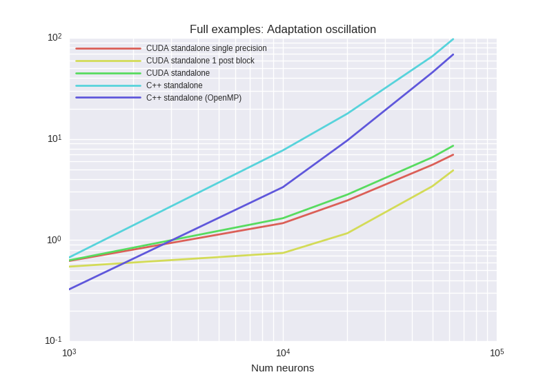


<details><summary>Examplary `nvprof` results for **CUDA-standalone-1-post-block**</summary><p>
Profile summary for `N = 1000`:

```
==8416== NVPROF is profiling process 8416, command: ./main
==8416== Profiling application: ./main
==8416== Profiling result:
            Type  Time(%)      Time     Calls       Avg       Min       Max  Name
 GPU activities:   32.12%  69.084ms      9466  7.2980us  2.0170us  11.360us  kernel_synapses_pre_codeobject(int, int, int, int, int, int*, int, double*, int, int*, int, int*, int, double*, int*, char*)
                   25.96%  55.832ms     10000  5.5830us  5.3120us  6.6880us  kernel_neurongroup_stateupdater_codeobject(int, int, double*, double, double*, double*, double*, char*, double*)
                   12.28%  26.414ms     10000  2.6410us  2.1440us  3.1040us  kernel_neurongroup_thresholder_codeobject(int, int, int*, double, double*, double*, char*)
                   11.33%  24.363ms     10000  2.4360us  1.6640us  3.2320us  kernel_neurongroup_resetter_codeobject(int, int, int*, double*, double*, char*)
                    9.55%  20.547ms      9981  2.0580us  2.0160us  2.5600us  [CUDA memcpy DtoH]
                    7.82%  16.815ms     10000  1.6810us  1.5680us  3.2000us  _GLOBAL__N__69_tmpxft_00001f3c_00000000_6_neurongroup_thresholder_codeobject_cpp1_ii_0e9058a7::_reset_neurongroup_thresholder_codeobject(int*)
                    0.95%  2.0481ms         2  1.0240ms  1.0199ms  1.0282ms  void gen_sequenced<curandStateXORWOW, double2, normal_args_double_st, __operator_&__(double2 curand_normal_scaled2_double<curandStateXORWOW>(curandStateXORWOW*, normal_args_double_st))>(curandStateXORWOW*, double2*, unsigned long, unsigned long, normal_args_double_st)
      API calls:   66.51%  618.22ms     49468  12.497us  10.195us  8.4895ms  cudaLaunch
                   23.06%  214.36ms      9981  21.476us  18.945us  1.0232ms  cudaMemcpy
                    7.31%  67.916ms    381466     178ns     133ns  354.45us  cudaSetupArgument
                    1.64%  15.217ms     49468     307ns     217ns  323.87us  cudaConfigureCall
                    1.44%  13.339ms     50004     266ns     207ns  351.50us  cudaGetLastError
                    0.02%  209.01us         1  209.01us  209.01us  209.01us  cudaMalloc
                    0.01%  130.51us         1  130.51us  130.51us  130.51us  cudaMemGetInfo
                    0.00%  26.052us         7  3.7210us  3.0460us  5.4790us  cudaFuncGetAttributes
                    0.00%  24.833us        38     653ns     578ns  1.5710us  cudaOccupancyMaxActiveBlocksPerMultiprocessorWithFlags
                    0.00%  8.2040us         1  8.2040us  8.2040us  8.2040us  cudaDeviceSynchronize
                    0.00%  5.2760us        12     439ns     330ns     843ns  cudaDeviceGetAttribute
                    0.00%  3.0070us         3  1.0020us     771ns  1.4320us  cudaGetDevice

```

</p></details>


<details><summary>Examplary `nvprof` results for **CUDA-standalone-single-precision**</summary><p>
Profile summary for `N = 1000`:

```
==7865== NVPROF is profiling process 7865, command: ./main
==7865== Profiling application: ./main
==7865== Profiling result:
            Type  Time(%)      Time     Calls       Avg       Min       Max  Name
 GPU activities:   49.72%  142.33ms      9403  15.136us  2.7520us  66.432us  kernel_synapses_pre_codeobject(int, int, int, int, int, int*, int, float*, int, int*, int, int*, int, float*, int*, char*)
                   19.15%  54.816ms     10000  5.4810us  5.2800us  6.5600us  kernel_neurongroup_stateupdater_codeobject(int, int, double*, double, float*, float*, double*, char*, float*)
                    9.05%  25.903ms     10000  2.5900us  1.7920us  3.3280us  kernel_neurongroup_resetter_codeobject(int, int, int*, float*, float*, char*)
                    8.85%  25.322ms     10000  2.5320us  2.0490us  3.0720us  kernel_neurongroup_thresholder_codeobject(int, int, int*, double, float*, double*, char*)
                    7.16%  20.505ms      9981  2.0540us  2.0160us  2.5600us  [CUDA memcpy DtoH]
                    5.81%  16.624ms     10000  1.6620us  1.5360us  2.1760us  _GLOBAL__N__69_tmpxft_00001cfa_00000000_6_neurongroup_thresholder_codeobject_cpp1_ii_7f32e276::_reset_neurongroup_thresholder_codeobject(int*)
                    0.26%  737.48us         1  737.48us  737.48us  737.48us  void gen_sequenced<curandStateXORWOW, float2, normal_args_st, __operator_&__(float2 curand_normal_scaled2<curandStateXORWOW>(curandStateXORWOW*, normal_args_st))>(curandStateXORWOW*, float2*, unsigned long, unsigned long, normal_args_st)
      API calls:   65.21%  565.96ms     49404  11.455us  9.5180us  10.238ms  cudaLaunch
                   24.23%  210.31ms      9981  21.071us  18.547us  1.0298ms  cudaMemcpy
                    7.53%  65.351ms    380453     171ns     134ns  324.20us  cudaSetupArgument
                    1.56%  13.574ms     50002     271ns     209ns  326.64us  cudaGetLastError
                    1.42%  12.357ms     49404     250ns     175ns  294.83us  cudaConfigureCall
                    0.02%  192.23us         1  192.23us  192.23us  192.23us  cudaMalloc
                    0.02%  130.35us         1  130.35us  130.35us  130.35us  cudaMemGetInfo
                    0.00%  28.076us        38     738ns     631ns  1.6120us  cudaOccupancyMaxActiveBlocksPerMultiprocessorWithFlags
                    0.00%  25.646us         7  3.6630us  2.9440us  5.7420us  cudaFuncGetAttributes
                    0.00%  9.1270us         1  9.1270us  9.1270us  9.1270us  cudaDeviceSynchronize
                    0.00%  5.3170us        12     443ns     329ns     850ns  cudaDeviceGetAttribute
                    0.00%  2.9300us         3     976ns     715ns  1.3960us  cudaGetDevice

```

</p></details>


<details><summary>Examplary `nvprof` results for **CUDAStandaloneConfiguration**</summary><p>
Profile summary for `N = 1000`:

```
==8963== NVPROF is profiling process 8963, command: ./main
==8963== Profiling application: ./main
==8963== Profiling result:
            Type  Time(%)      Time     Calls       Avg       Min       Max  Name
 GPU activities:   51.77%  154.28ms      9513  16.218us  2.9440us  78.976us  kernel_synapses_pre_codeobject(int, int, int, int, int, int*, int, double*, int, int*, int, int*, int, double*, int*, char*)
                   19.00%  56.636ms     10000  5.6630us  5.4400us  6.6240us  kernel_neurongroup_stateupdater_codeobject(int, int, double*, double, double*, double*, double*, char*, double*)
                    8.90%  26.522ms     10000  2.6520us  2.0800us  3.0080us  kernel_neurongroup_thresholder_codeobject(int, int, int*, double, double*, double*, char*)
                    7.24%  21.576ms     10000  2.1570us  1.6000us  3.0080us  kernel_neurongroup_resetter_codeobject(int, int, int*, double*, double*, char*)
                    6.88%  20.500ms      9981  2.0530us  2.0160us  2.5920us  [CUDA memcpy DtoH]
                    5.52%  16.456ms     10000  1.6450us  1.3440us  2.4320us  _GLOBAL__N__69_tmpxft_00002164_00000000_6_neurongroup_thresholder_codeobject_cpp1_ii_0e9058a7::_reset_neurongroup_thresholder_codeobject(int*)
                    0.69%  2.0475ms         2  1.0238ms  1.0202ms  1.0273ms  void gen_sequenced<curandStateXORWOW, double2, normal_args_double_st, __operator_&__(double2 curand_normal_scaled2_double<curandStateXORWOW>(curandStateXORWOW*, normal_args_double_st))>(curandStateXORWOW*, double2*, unsigned long, unsigned long, normal_args_double_st)
      API calls:   64.82%  555.88ms     49515  11.226us  9.4440us  8.3433ms  cudaLaunch
                   24.33%  208.67ms      9981  20.906us  18.517us  1.0313ms  cudaMemcpy
                    7.64%  65.509ms    382218     171ns     129ns  344.50us  cudaSetupArgument
                    1.64%  14.075ms     49515     284ns     207ns  316.12us  cudaConfigureCall
                    1.52%  13.063ms     50004     261ns     213ns  320.81us  cudaGetLastError
                    0.02%  208.05us         1  208.05us  208.05us  208.05us  cudaMalloc
                    0.02%  132.20us         1  132.20us  132.20us  132.20us  cudaMemGetInfo
                    0.00%  25.994us         7  3.7130us  2.7850us  6.1370us  cudaFuncGetAttributes
                    0.00%  25.673us        38     675ns     577ns  1.7960us  cudaOccupancyMaxActiveBlocksPerMultiprocessorWithFlags
                    0.00%  12.065us         1  12.065us  12.065us  12.065us  cudaDeviceSynchronize
                    0.00%  5.8010us        12     483ns     331ns  1.3210us  cudaDeviceGetAttribute
                    0.00%  3.7870us         3  1.2620us     770ns  2.2090us  cudaGetDevice

```

</p></details>


***

### BrunelHakimModelHeterogeneousDelay
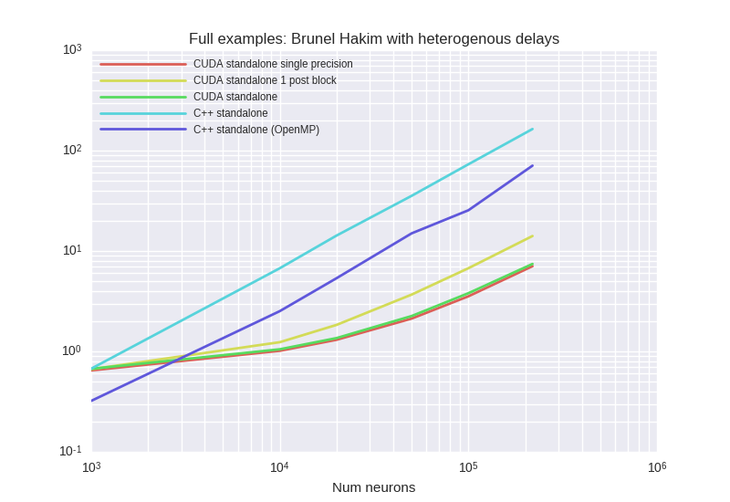


<details><summary>Examplary `nvprof` results for **CUDA-standalone-1-post-block**</summary><p>
Profile summary for `N = 1000`:

```
==5796== NVPROF is profiling process 5796, command: ./main
==5796== Profiling application: ./main
==5796== Profiling result:
            Type  Time(%)      Time     Calls       Avg       Min       Max  Name
 GPU activities:   33.46%  93.810ms     10000  9.3810us  2.5280us  16.352us  kernel_synapses_pre_codeobject(int, int, int, int, int, int*, int, double*, int*, int, int*, int, int*)
                   17.36%  48.687ms     10000  4.8680us  4.5440us  5.8880us  kernel_neurongroup_stateupdater_codeobject(int, int, double, double*, double*, double*, char*, double*)
                   10.18%  28.551ms      2542  11.231us  8.9600us  263.39us  _run_synapses_pre_push_spikes_push_kernel(int, int, int, int*)
                    9.71%  27.224ms     10000  2.7220us  2.6560us  3.7440us  _run_synapses_pre_push_spikes_advance_kernel(void)
                    8.09%  22.690ms     10000  2.2680us  2.0800us  2.7840us  kernel_neurongroup_thresholder_codeobject(int, int, int*, double, double*, double*, char*)
                    7.34%  20.593ms     10000  2.0590us  2.0160us  2.5600us  [CUDA memcpy DtoH]
                    6.99%  19.612ms     10000  1.9610us  1.7920us  2.2400us  kernel_neurongroup_resetter_codeobject(int, int, double*, int*)
                    6.12%  17.165ms     10000  1.7160us  1.5680us  1.9840us  _GLOBAL__N__69_tmpxft_00001518_00000000_6_neurongroup_thresholder_codeobject_cpp1_ii_0e9058a7::_reset_neurongroup_thresholder_codeobject(int*)
                    0.73%  2.0489ms         2  1.0245ms  1.0197ms  1.0292ms  void gen_sequenced<curandStateXORWOW, double2, normal_args_double_st, __operator_&__(double2 curand_normal_scaled2_double<curandStateXORWOW>(curandStateXORWOW*, normal_args_double_st))>(curandStateXORWOW*, double2*, unsigned long, unsigned long, normal_args_double_st)
      API calls:   69.50%  669.12ms     62544  10.698us  8.5700us  8.2420ms  cudaLaunch
                   21.44%  206.40ms     10000  20.639us  17.779us  1.0276ms  cudaMemcpy
                    5.88%  56.607ms    340178     166ns     123ns  416.18us  cudaSetupArgument
                    1.60%  15.439ms     62544     246ns     169ns  348.19us  cudaConfigureCall
                    1.54%  14.792ms     62546     236ns     170ns  344.56us  cudaGetLastError
                    0.02%  233.36us         1  233.36us  233.36us  233.36us  cudaMalloc
                    0.01%  132.60us         1  132.60us  132.60us  132.60us  cudaMemGetInfo
                    0.00%  29.369us         8  3.6710us  2.9420us  5.6410us  cudaFuncGetAttributes
                    0.00%  28.347us        39     726ns     619ns  1.7860us  cudaOccupancyMaxActiveBlocksPerMultiprocessorWithFlags
                    0.00%  12.196us         1  12.196us  12.196us  12.196us  cudaDeviceSynchronize
                    0.00%  6.2950us        12     524ns     346ns  1.5030us  cudaDeviceGetAttribute
                    0.00%  3.6290us         3  1.2090us     752ns  1.9910us  cudaGetDevice

```

</p></details>


<details><summary>Examplary `nvprof` results for **CUDA-standalone-single-precision**</summary><p>
Profile summary for `N = 1000`:

```
==5213== NVPROF is profiling process 5213, command: ./main
==5213== Profiling application: ./main
==5213== Profiling result:
            Type  Time(%)      Time     Calls       Avg       Min       Max  Name
 GPU activities:   21.49%  56.174ms     10000  5.6170us  3.2960us  6.4650us  kernel_synapses_pre_codeobject(int, int, int, int, int, int*, int, float*, int*, int, int*, int, int*)
                   19.98%  52.237ms     10000  5.2230us  4.7360us  6.6240us  kernel_neurongroup_stateupdater_codeobject(int, int, double, float*, double*, double*, char*, float*)
                   16.67%  43.576ms      2502  17.416us  8.9280us  982.05us  _run_synapses_pre_push_spikes_push_kernel(int, int, int, int*)
                   10.66%  27.863ms     10000  2.7860us  2.7200us  3.7120us  _run_synapses_pre_push_spikes_advance_kernel(void)
                    9.15%  23.919ms     10000  2.3910us  2.0160us  2.8160us  kernel_neurongroup_thresholder_codeobject(int, int, int*, double, float*, double*, char*)
                    7.87%  20.581ms     10000  2.0580us  2.0160us  2.5600us  [CUDA memcpy DtoH]
                    7.48%  19.563ms     10000  1.9560us  1.6000us  3.1680us  kernel_neurongroup_resetter_codeobject(int, int, float*, int*)
                    6.42%  16.773ms     10000  1.6770us  1.4720us  2.4640us  _GLOBAL__N__69_tmpxft_0000129a_00000000_6_neurongroup_thresholder_codeobject_cpp1_ii_7f32e276::_reset_neurongroup_thresholder_codeobject(int*)
                    0.28%  738.76us         1  738.76us  738.76us  738.76us  void gen_sequenced<curandStateXORWOW, float2, normal_args_st, __operator_&__(float2 curand_normal_scaled2<curandStateXORWOW>(curandStateXORWOW*, normal_args_st))>(curandStateXORWOW*, float2*, unsigned long, unsigned long, normal_args_st)
      API calls:   68.14%  658.06ms     62503  10.528us  8.9850us  14.283ms  cudaLaunch
                   22.35%  215.82ms     10000  21.582us  18.032us  968.84us  cudaMemcpy
                    6.08%  58.741ms    340013     172ns     128ns  344.01us  cudaSetupArgument
                    1.70%  16.449ms     62504     263ns     220ns  333.31us  cudaGetLastError
                    1.67%  16.175ms     62503     258ns     184ns  344.63us  cudaConfigureCall
                    0.02%  207.91us         1  207.91us  207.91us  207.91us  cudaMalloc
                    0.01%  126.98us         1  126.98us  126.98us  126.98us  cudaMemGetInfo
                    0.01%  56.493us        39  1.4480us  1.2300us  3.1380us  cudaOccupancyMaxActiveBlocksPerMultiprocessorWithFlags
                    0.01%  55.529us         8  6.9410us  5.6730us  10.317us  cudaFuncGetAttributes
                    0.00%  11.456us        12     954ns     703ns  2.0960us  cudaDeviceGetAttribute
                    0.00%  7.9610us         1  7.9610us  7.9610us  7.9610us  cudaDeviceSynchronize
                    0.00%  6.2180us         3  2.0720us  1.4990us  3.2150us  cudaGetDevice

```

</p></details>


<details><summary>Examplary `nvprof` results for **CUDAStandaloneConfiguration**</summary><p>
Profile summary for `N = 1000`:

```
==6374== NVPROF is profiling process 6374, command: ./main
==6374== Profiling application: ./main
==6374== Profiling result:
            Type  Time(%)      Time     Calls       Avg       Min       Max  Name
 GPU activities:   24.38%  67.342ms     10000  6.7340us  3.2320us  8.3840us  kernel_synapses_pre_codeobject(int, int, int, int, int, int*, int, double*, int*, int, int*, int, int*)
                   18.67%  51.580ms     10000  5.1580us  4.7040us  5.8880us  kernel_neurongroup_stateupdater_codeobject(int, int, double, double*, double*, double*, char*, double*)
                   16.33%  45.118ms      2513  17.953us  8.9600us  897.28us  _run_synapses_pre_push_spikes_push_kernel(int, int, int, int*)
                   10.64%  29.393ms     10000  2.9390us  2.7200us  3.7770us  _run_synapses_pre_push_spikes_advance_kernel(void)
                    8.71%  24.047ms     10000  2.4040us  2.0480us  2.8490us  kernel_neurongroup_thresholder_codeobject(int, int, int*, double, double*, double*, char*)
                    7.42%  20.488ms     10000  2.0480us  2.0160us  4.0640us  [CUDA memcpy DtoH]
                    7.05%  19.487ms     10000  1.9480us  1.6000us  2.8480us  kernel_neurongroup_resetter_codeobject(int, int, double*, int*)
                    6.06%  16.733ms     10000  1.6730us  1.5680us  2.3040us  _GLOBAL__N__69_tmpxft_0000174b_00000000_6_neurongroup_thresholder_codeobject_cpp1_ii_0e9058a7::_reset_neurongroup_thresholder_codeobject(int*)
                    0.74%  2.0499ms         2  1.0249ms  1.0210ms  1.0289ms  void gen_sequenced<curandStateXORWOW, double2, normal_args_double_st, __operator_&__(double2 curand_normal_scaled2_double<curandStateXORWOW>(curandStateXORWOW*, normal_args_double_st))>(curandStateXORWOW*, double2*, unsigned long, unsigned long, normal_args_double_st)
      API calls:   66.62%  599.69ms     62515  9.5920us  8.2150us  8.3559ms  cudaLaunch
                   23.94%  215.52ms     10000  21.552us  17.821us  1.0315ms  cudaMemcpy
                    6.21%  55.927ms    340062     164ns     121ns  308.54us  cudaSetupArgument
                    1.61%  14.467ms     62517     231ns     189ns  299.77us  cudaGetLastError
                    1.57%  14.160ms     62515     226ns     163ns  306.76us  cudaConfigureCall
                    0.03%  247.77us         1  247.77us  247.77us  247.77us  cudaMalloc
                    0.01%  134.10us         1  134.10us  134.10us  134.10us  cudaMemGetInfo
                    0.00%  29.526us         8  3.6900us  2.7010us  7.8130us  cudaFuncGetAttributes
                    0.00%  26.422us        39     677ns     571ns  1.8340us  cudaOccupancyMaxActiveBlocksPerMultiprocessorWithFlags
                    0.00%  11.007us         1  11.007us  11.007us  11.007us  cudaDeviceSynchronize
                    0.00%  6.2140us        12     517ns     325ns  1.5720us  cudaDeviceGetAttribute
                    0.00%  4.1240us         3  1.3740us     703ns  2.6090us  cudaGetDevice

```

</p></details>


***

### BrunelHakimModelScalarDelay

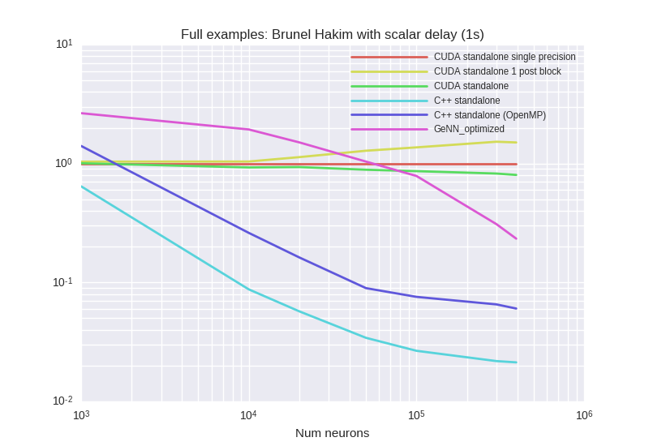

<details><summary>Examplary `nvprof` results for **CUDA-standalone-1-post-block**</summary><p>
Profile summary for `N = 1000`:

```
==26856== NVPROF is profiling process 26856, command: ./main
==26856== Profiling application: ./main
==26856== Profiling result:
            Type  Time(%)      Time     Calls       Avg       Min       Max  Name
 GPU activities:   35.34%  48.393ms     10000  4.8390us  4.4800us  5.9520us  kernel_neurongroup_stateupdater_codeobject(int, int, double, double*, double*, double*, char*, double*)
                   16.24%  22.240ms     10000  2.2240us  2.0160us  2.7840us  kernel_neurongroup_thresholder_codeobject(int, int, int*, double, double*, double*, char*)
                   14.93%  20.435ms      9981  2.0470us  2.0160us  2.6560us  [CUDA memcpy DtoH]
                   12.65%  17.319ms     10000  1.7310us  1.6000us  2.0480us  kernel_neurongroup_resetter_codeobject(int, int, double*, int*)
                   10.97%  15.014ms     10000  1.5010us  1.3440us  1.7920us  _GLOBAL__N__69_tmpxft_000067a3_00000000_6_neurongroup_thresholder_codeobject_cpp1_ii_0e9058a7::_reset_neurongroup_thresholder_codeobject(int*)
                    8.38%  11.469ms      1829  6.2700us  2.0160us  11.329us  kernel_synapses_pre_codeobject(int, int, int, int, int, int*, int, double*, int*, int, int*, int, int*)
                    1.50%  2.0480ms         2  1.0240ms  1.0201ms  1.0279ms  void gen_sequenced<curandStateXORWOW, double2, normal_args_double_st, __operator_&__(double2 curand_normal_scaled2_double<curandStateXORWOW>(curandStateXORWOW*, normal_args_double_st))>(curandStateXORWOW*, double2*, unsigned long, unsigned long, normal_args_double_st)
      API calls:   63.79%  469.65ms     41831  11.227us  9.3810us  8.0059ms  cudaLaunch
                   27.77%  204.49ms      9981  20.487us  18.322us  1.0240ms  cudaMemcpy
                    5.12%  37.674ms    223787     168ns     132ns  326.83us  cudaSetupArgument
                    1.85%  13.586ms     50004     271ns     218ns  337.90us  cudaGetLastError
                    1.42%  10.421ms     41831     249ns     193ns  14.095us  cudaConfigureCall
                    0.03%  216.41us         1  216.41us  216.41us  216.41us  cudaMalloc
                    0.02%  135.40us         1  135.40us  135.40us  135.40us  cudaMemGetInfo
                    0.00%  29.011us        38     763ns     561ns  6.1720us  cudaOccupancyMaxActiveBlocksPerMultiprocessorWithFlags
                    0.00%  26.099us         7  3.7280us  2.8850us  5.2400us  cudaFuncGetAttributes
                    0.00%  7.5820us         1  7.5820us  7.5820us  7.5820us  cudaDeviceSynchronize
                    0.00%  6.0250us        12     502ns     348ns  1.2850us  cudaDeviceGetAttribute
                    0.00%  3.6700us         3  1.2230us     745ns  2.1150us  cudaGetDevice

```

</p></details>


<details><summary>Examplary `nvprof` results for **CUDA-standalone-single-precision**</summary><p>
Profile summary for `N = 1000`:

```
==26423== NVPROF is profiling process 26423, command: ./main
==26423== Profiling application: ./main
==26423== Profiling result:
            Type  Time(%)      Time     Calls       Avg       Min       Max  Name
 GPU activities:   36.21%  54.195ms     10000  5.4190us  5.0560us  6.4960us  kernel_neurongroup_stateupdater_codeobject(int, int, double, float*, double*, double*, char*, float*)
                   14.75%  22.075ms     10000  2.2070us  2.0480us  2.6240us  kernel_neurongroup_thresholder_codeobject(int, int, int*, double, float*, double*, char*)
                   13.69%  20.487ms      9981  2.0520us  2.0160us  2.6240us  [CUDA memcpy DtoH]
                   12.86%  19.247ms     10000  1.9240us  1.7920us  2.1440us  kernel_neurongroup_resetter_codeobject(int, int, float*, int*)
                   11.08%  16.583ms     10000  1.6580us  1.5360us  1.7920us  _GLOBAL__N__69_tmpxft_000065df_00000000_6_neurongroup_thresholder_codeobject_cpp1_ii_7f32e276::_reset_neurongroup_thresholder_codeobject(int*)
                   10.91%  16.321ms      1834  8.8990us  2.7520us  32.864us  kernel_synapses_pre_codeobject(int, int, int, int, int, int*, int, float*, int*, int, int*, int, int*)
                    0.49%  738.98us         1  738.98us  738.98us  738.98us  void gen_sequenced<curandStateXORWOW, float2, normal_args_st, __operator_&__(float2 curand_normal_scaled2<curandStateXORWOW>(curandStateXORWOW*, normal_args_st))>(curandStateXORWOW*, float2*, unsigned long, unsigned long, normal_args_st)
      API calls:   63.45%  465.64ms     41835  11.130us  9.3280us  11.374ms  cudaLaunch
                   27.63%  202.77ms      9981  20.315us  18.354us  324.92us  cudaMemcpy
                    5.66%  41.522ms    223847     185ns     148ns  319.93us  cudaSetupArgument
                    1.84%  13.522ms     50002     270ns     231ns  302.01us  cudaGetLastError
                    1.35%  9.9183ms     41835     237ns     186ns  305.01us  cudaConfigureCall
                    0.03%  199.76us         1  199.76us  199.76us  199.76us  cudaMalloc
                    0.02%  130.80us         1  130.80us  130.80us  130.80us  cudaMemGetInfo
                    0.01%  59.396us        38  1.5630us  1.3070us  7.8100us  cudaOccupancyMaxActiveBlocksPerMultiprocessorWithFlags
                    0.01%  49.789us         7  7.1120us  5.9590us  10.115us  cudaFuncGetAttributes
                    0.00%  10.903us        12     908ns     676ns  2.0800us  cudaDeviceGetAttribute
                    0.00%  7.3250us         1  7.3250us  7.3250us  7.3250us  cudaDeviceSynchronize
                    0.00%  6.4480us         3  2.1490us  1.6090us  3.2130us  cudaGetDevice

```

</p></details>


<details><summary>Examplary `nvprof` results for **CUDAStandaloneConfiguration**</summary><p>
Profile summary for `N = 1000`:

```
==27290== NVPROF is profiling process 27290, command: ./main
==27290== Profiling application: ./main
==27290== Profiling result:
            Type  Time(%)      Time     Calls       Avg       Min       Max  Name
 GPU activities:   33.41%  48.275ms     10000  4.8270us  4.4480us  6.5280us  kernel_neurongroup_stateupdater_codeobject(int, int, double, double*, double*, double*, char*, double*)
                   16.04%  23.169ms     10000  2.3160us  2.0480us  2.7520us  kernel_neurongroup_thresholder_codeobject(int, int, int*, double, double*, double*, char*)
                   14.14%  20.423ms      9981  2.0460us  2.0160us  2.6560us  [CUDA memcpy DtoH]
                   12.74%  18.404ms      1865  9.8680us  2.9440us  34.593us  kernel_synapses_pre_codeobject(int, int, int, int, int, int*, int, double*, int*, int, int*, int, int*)
                   12.09%  17.469ms     10000  1.7460us  1.6000us  2.0160us  kernel_neurongroup_resetter_codeobject(int, int, double*, int*)
                   10.17%  14.691ms     10000  1.4690us  1.3440us  1.8240us  _GLOBAL__N__69_tmpxft_00006958_00000000_6_neurongroup_thresholder_codeobject_cpp1_ii_0e9058a7::_reset_neurongroup_thresholder_codeobject(int*)
                    1.42%  2.0481ms         2  1.0241ms  1.0197ms  1.0285ms  void gen_sequenced<curandStateXORWOW, double2, normal_args_double_st, __operator_&__(double2 curand_normal_scaled2_double<curandStateXORWOW>(curandStateXORWOW*, normal_args_double_st))>(curandStateXORWOW*, double2*, unsigned long, unsigned long, normal_args_double_st)
      API calls:   63.58%  454.62ms     41867  10.858us  9.2770us  7.9898ms  cudaLaunch
                   28.28%  202.22ms      9981  20.260us  18.179us  1.0256ms  cudaMemcpy
                    4.91%  35.111ms    224255     156ns     129ns  316.64us  cudaSetupArgument
                    1.83%  13.109ms     50004     262ns     202ns  309.14us  cudaGetLastError
                    1.34%  9.5760ms     41867     228ns     166ns  307.54us  cudaConfigureCall
                    0.03%  211.76us         1  211.76us  211.76us  211.76us  cudaMalloc
                    0.02%  131.35us         1  131.35us  131.35us  131.35us  cudaMemGetInfo
                    0.00%  29.467us        38     775ns     568ns  6.6470us  cudaOccupancyMaxActiveBlocksPerMultiprocessorWithFlags
                    0.00%  26.547us         7  3.7920us  2.9710us  5.9130us  cudaFuncGetAttributes
                    0.00%  7.2120us         1  7.2120us  7.2120us  7.2120us  cudaDeviceSynchronize
                    0.00%  5.9630us        12     496ns     343ns  1.3360us  cudaDeviceGetAttribute
                    0.00%  3.5030us         3  1.1670us     737ns  1.9960us  cudaGetDevice

```

</p></details>


<details><summary>Examplary `nvprof` results for **GeNNConfigurationOptimized**</summary><p>
Profile summary for `N = 1000`:

```
==27610== NVPROF is profiling process 27610, command: ./main test 1.0 1
==27610== Profiling application: ./main test 1.0 1
==27610== Profiling result:
            Type  Time(%)      Time     Calls       Avg       Min       Max  Name
 GPU activities:   61.89%  78.090ms     10000  7.8090us  6.8480us  10.368us  calcNeurons
                   29.11%  36.730ms     10000  3.6730us  2.5280us  29.441us  calcSynapses
                    7.09%  8.9410ms        41  218.07us     960ns  2.5144ms  [CUDA memcpy HtoD]
                    1.91%  2.4047ms        10  240.47us  2.0480us  2.3733ms  [CUDA memcpy DtoH]
      API calls:   63.32%  389.74ms        11  35.431ms  19.606us  383.04ms  cudaHostAlloc
                   32.34%  199.04ms     20000  9.9510us  9.4060us  315.63us  cudaLaunch
                    2.00%  12.336ms        53  232.75us     576ns  2.5305ms  cudaMemcpy
                    1.16%  7.1427ms     20000     357ns     303ns  295.04us  cudaConfigureCall
                    0.86%  5.2774ms     20000     263ns     202ns  295.99us  cudaSetupArgument
                    0.22%  1.3585ms        11  123.50us  13.580us  232.99us  cudaMalloc
                    0.06%  399.95us        94  4.2540us     165ns  154.72us  cuDeviceGetAttribute
                    0.02%  117.77us         1  117.77us  117.77us  117.77us  cuDeviceTotalMem
                    0.01%  36.567us         1  36.567us  36.567us  36.567us  cuDeviceGetName
                    0.00%  24.072us        11  2.1880us  1.1140us  5.7600us  cudaGetSymbolAddress
                    0.00%  20.120us         1  20.120us  20.120us  20.120us  cudaMemcpyToSymbol
                    0.00%  11.538us         1  11.538us  11.538us  11.538us  cudaSetDevice
                    0.00%  3.0410us         3  1.0130us     230ns  2.2210us  cuDeviceGetCount
                    0.00%  1.5680us         1  1.5680us  1.5680us  1.5680us  cudaGetDeviceCount
                    0.00%  1.1770us         2     588ns     257ns     920ns  cuDeviceGet

```

</p></details>


***

### COBAHHConstantConnectionProbability


<details><summary>Examplary `nvprof` results for **CUDA-standalone-1-post-block**</summary><p>
Profile summary for `N = 1000`:

```
==22829== NVPROF is profiling process 22829, command: ./main
==22829== Profiling application: ./main
==22829== Profiling result:
            Type  Time(%)      Time     Calls       Avg       Min       Max  Name
 GPU activities:   44.40%  148.24ms     10000  14.823us  14.624us  15.680us  kernel_neurongroup_stateupdater_codeobject(int, int, double*, double*, double*, char*, double*, double*, double*, double*, double, double*)
                   16.90%  56.431ms      9590  5.8840us  2.8800us  7.5840us  kernel_synapses_pre_codeobject(int, int, int, int, int, int*, int, double*, int*, int, int*, int, int*)
                   13.23%  44.176ms      9590  4.6060us  2.9120us  8.0960us  kernel_synapses_1_pre_codeobject(int, int, int, int, int, int*, int, int*, int, int*, int, double*, int*)
                   12.27%  40.959ms     20000  2.0470us  2.0160us  2.5280us  [CUDA memcpy DtoH]
                    8.20%  27.389ms     10000  2.7380us  2.2720us  2.8480us  kernel_neurongroup_thresholder_codeobject(int, int, int*, double, double*, double*, char*)
                    5.01%  16.713ms     10000  1.6710us  1.6000us  2.0480us  _GLOBAL__N__69_tmpxft_000056fa_00000000_6_neurongroup_thresholder_codeobject_cpp1_ii_0e9058a7::_reset_neurongroup_thresholder_codeobject(int*)
      API calls:   55.29%  734.09ms     49180  14.926us  9.5350us  9.3212ms  cudaLaunch
                   35.07%  465.66ms     20000  23.283us  15.516us  456.49us  cudaMemcpy
                    7.17%  95.164ms    449340     211ns     138ns  424.12us  cudaSetupArgument
                    1.27%  16.804ms     49180     341ns     192ns  315.33us  cudaConfigureCall
                    1.19%  15.831ms     50000     316ns     199ns  31.743us  cudaGetLastError
                    0.01%  130.45us         1  130.45us  130.45us  130.45us  cudaMemGetInfo
                    0.00%  22.663us         6  3.7770us  2.9620us  5.0700us  cudaFuncGetAttributes
                    0.00%  16.324us        21     777ns     602ns  1.8850us  cudaOccupancyMaxActiveBlocksPerMultiprocessorWithFlags
                    0.00%  7.7590us         1  7.7590us  7.7590us  7.7590us  cudaDeviceSynchronize
                    0.00%  3.6600us         8     457ns     320ns     770ns  cudaDeviceGetAttribute
                    0.00%  2.2670us         2  1.1330us     983ns  1.2840us  cudaGetDevice

```

</p></details>


<details><summary>Examplary `nvprof` results for **CUDA-standalone-single-precision**</summary><p>
Profile summary for `N = 1000`:

```
==21989== NVPROF is profiling process 21989, command: ./main
==21989== Profiling application: ./main
==21989== Profiling result:
            Type  Time(%)      Time     Calls       Avg       Min       Max  Name
 GPU activities:   34.97%  202.52ms      9805  20.654us  5.8240us  64.000us  kernel_synapses_1_pre_codeobject(int, int, int, int, int, int*, int, int*, int, int*, int, float*, int*)
                   25.86%  149.74ms     10000  14.973us  14.656us  16.192us  kernel_neurongroup_stateupdater_codeobject(int, int, float*, float*, double*, char*, double*, float*, float*, float*, double, float*)
                   24.43%  141.45ms      9805  14.426us  3.8080us  39.808us  kernel_synapses_pre_codeobject(int, int, int, int, int, int*, int, float*, int*, int, int*, int, int*)
                    7.10%  41.116ms     20000  2.0550us  2.0160us  2.6560us  [CUDA memcpy DtoH]
                    4.75%  27.481ms     10000  2.7480us  2.2720us  2.8480us  kernel_neurongroup_thresholder_codeobject(int, int, int*, double, float*, double*, char*)
                    2.89%  16.734ms     10000  1.6730us  1.6320us  2.1760us  _GLOBAL__N__69_tmpxft_0000539d_00000000_6_neurongroup_thresholder_codeobject_cpp1_ii_7f32e276::_reset_neurongroup_thresholder_codeobject(int*)
      API calls:   45.80%  591.76ms     49610  11.928us  9.1820us  13.520ms  cudaLaunch
                   45.30%  585.36ms     20000  29.267us  15.377us  391.20us  cudaMemcpy
                    6.67%  86.157ms    454930     189ns     130ns  340.51us  cudaSetupArgument
                    1.11%  14.349ms     50000     286ns     217ns  341.64us  cudaGetLastError
                    1.10%  14.206ms     49610     286ns     185ns  317.43us  cudaConfigureCall
                    0.01%  133.53us         1  133.53us  133.53us  133.53us  cudaMemGetInfo
                    0.00%  34.991us         6  5.8310us  3.0880us  8.9140us  cudaFuncGetAttributes
                    0.00%  22.343us        25     893ns     585ns  3.1730us  cudaOccupancyMaxActiveBlocksPerMultiprocessorWithFlags
                    0.00%  15.232us         1  15.232us  15.232us  15.232us  cudaDeviceSynchronize
                    0.00%  5.4550us         8     681ns     410ns  1.3510us  cudaDeviceGetAttribute
                    0.00%  3.5980us         2  1.7990us  1.0490us  2.5490us  cudaGetDevice

```

</p></details>


<details><summary>Examplary `nvprof` results for **CUDAStandaloneConfiguration**</summary><p>
Profile summary for `N = 1000`:

```
==23666== NVPROF is profiling process 23666, command: ./main
==23666== Profiling application: ./main
==23666== Profiling result:
            Type  Time(%)      Time     Calls       Avg       Min       Max  Name
 GPU activities:   35.83%  216.51ms      9857  21.965us  5.8240us  65.952us  kernel_synapses_1_pre_codeobject(int, int, int, int, int, int*, int, int*, int, int*, int, double*, int*)
                   25.43%  153.71ms      9857  15.594us  3.8400us  40.897us  kernel_synapses_pre_codeobject(int, int, int, int, int, int*, int, double*, int*, int, int*, int, int*)
                   24.55%  148.38ms     10000  14.838us  14.624us  15.776us  kernel_neurongroup_stateupdater_codeobject(int, int, double*, double*, double*, char*, double*, double*, double*, double*, double, double*)
                    6.79%  41.006ms     20000  2.0500us  1.9840us  2.6560us  [CUDA memcpy DtoH]
                    4.64%  28.055ms     10000  2.8050us  2.3360us  2.9120us  kernel_neurongroup_thresholder_codeobject(int, int, int*, double, double*, double*, char*)
                    2.76%  16.689ms     10000  1.6680us  1.6000us  2.0480us  _GLOBAL__N__69_tmpxft_00005a41_00000000_6_neurongroup_thresholder_codeobject_cpp1_ii_0e9058a7::_reset_neurongroup_thresholder_codeobject(int*)
      API calls:   46.60%  606.75ms     20000  30.337us  15.425us  388.80us  cudaMemcpy
                   45.40%  591.25ms     49714  11.893us  9.2710us  9.1074ms  cudaLaunch
                    5.78%  75.288ms    456282     165ns     130ns  361.27us  cudaSetupArgument
                    1.13%  14.779ms     49714     297ns     173ns  419.99us  cudaConfigureCall
                    1.07%  13.922ms     50000     278ns     202ns  338.99us  cudaGetLastError
                    0.01%  131.84us         1  131.84us  131.84us  131.84us  cudaMemGetInfo
                    0.00%  22.803us         6  3.8000us  2.9710us  5.0000us  cudaFuncGetAttributes
                    0.00%  15.404us        21     733ns     561ns  1.7890us  cudaOccupancyMaxActiveBlocksPerMultiprocessorWithFlags
                    0.00%  8.4330us         1  8.4330us  8.4330us  8.4330us  cudaDeviceSynchronize
                    0.00%  3.7170us         8     464ns     318ns     820ns  cudaDeviceGetAttribute
                    0.00%  2.4040us         2  1.2020us  1.1560us  1.2480us  cudaGetDevice

```

</p></details>


<details><summary>Examplary `nvprof` results for **GeNNConfigurationOptimized**</summary><p>
Profile summary for `N = 1000`:

```
==24340== NVPROF is profiling process 24340, command: ./main test 1.0 1
==24340== Profiling application: ./main test 1.0 1
==24340== Profiling result:
            Type  Time(%)      Time     Calls       Avg       Min       Max  Name
 GPU activities:   51.57%  197.29ms     10000  19.729us  2.6240us  53.600us  calcSynapses
                   48.33%  184.89ms     10000  18.489us  16.704us  20.416us  calcNeurons
                    0.08%  286.95us        68  4.2190us     928ns  43.264us  [CUDA memcpy HtoD]
                    0.03%  108.19us        18  6.0100us  1.9520us  41.088us  [CUDA memcpy DtoH]
      API calls:   64.33%  762.33ms        19  40.123ms  11.594us  759.33ms  cudaHostAlloc
                   32.29%  382.67ms     20000  19.133us  9.3230us  383.29us  cudaLaunch
                    2.03%  24.100ms        88  273.86us  1.1720us  22.337ms  cudaMemcpy
                    0.73%  8.6407ms     20000     432ns     288ns  365.85us  cudaConfigureCall
                    0.46%  5.4980ms     20000     274ns     195ns  356.04us  cudaSetupArgument
                    0.10%  1.1974ms        19  63.022us  8.2320us  237.88us  cudaMalloc
                    0.03%  399.65us        94  4.2510us     153ns  156.02us  cuDeviceGetAttribute
                    0.01%  120.11us         1  120.11us  120.11us  120.11us  cuDeviceTotalMem
                    0.01%  62.655us         1  62.655us  62.655us  62.655us  cuDeviceGetName
                    0.00%  27.133us        19  1.4280us     561ns  5.7320us  cudaGetSymbolAddress
                    0.00%  9.8120us         1  9.8120us  9.8120us  9.8120us  cudaSetDevice
                    0.00%  4.1540us         3  1.3840us     213ns  2.3380us  cuDeviceGetCount
                    0.00%  1.6170us         1  1.6170us  1.6170us  1.6170us  cudaGetDeviceCount
                    0.00%  1.4100us         2     705ns     574ns     836ns  cuDeviceGet

```

</p></details>


***

### COBAHHFixedConnectivity (with Monitor)


<details><summary>Examplary `nvprof` results for **CUDA-standalone-1-post-block**</summary><p>
Profile summary for `N = 1000`:

```
==28119== NVPROF is profiling process 28119, command: ./main
==28119== Profiling application: ./main
==28119== Profiling result:
            Type  Time(%)      Time     Calls       Avg       Min       Max  Name
 GPU activities:   50.00%  340.07ms     10000  34.006us  1.4720us  104.55ms  kernel_spikemonitor_codeobject(int, int*, double, int*, int*, int*, int, int*, double*, int, int*, int*)
                   21.73%  147.80ms     10000  14.780us  13.600us  18.560us  kernel_neurongroup_stateupdater_codeobject(int, int, double*, double*, double*, char*, double*, double*, double*, double*, double, double*)
                    9.26%  63.002ms      9584  6.5730us  2.6240us  8.8640us  kernel_synapses_pre_codeobject(int, int, int, int, int, int*, int, double*, int*, int, int*, int, int*)
                    6.50%  44.238ms      9584  4.6150us  2.7200us  7.7120us  kernel_synapses_1_pre_codeobject(int, int, int, int, int, int*, int, int*, int, int*, int, double*, int*)
                    6.00%  40.797ms     20000  2.0390us  1.9200us  2.5600us  [CUDA memcpy DtoH]
                    4.06%  27.620ms     10000  2.7620us  2.1120us  2.9120us  kernel_neurongroup_thresholder_codeobject(int, int, int*, double, double*, double*, char*)
                    2.44%  16.600ms     10000  1.6600us  1.5040us  2.0480us  _GLOBAL__N__69_tmpxft_00006b12_00000000_6_neurongroup_thresholder_codeobject_cpp1_ii_0e9058a7::_reset_neurongroup_thresholder_codeobject(int*)
                    0.01%  57.984us         1  57.984us  57.984us  57.984us  _run_spikemonitor_codeobject_init(void)
      API calls:   46.04%  713.11ms     59169  12.052us  9.6960us  8.4473ms  cudaLaunch
                   45.90%  710.95ms     20000  35.547us  15.085us  104.58ms  cudaMemcpy
                    6.00%  92.951ms    569184     163ns     133ns  345.32us  cudaSetupArgument
                    1.04%  16.114ms     60001     268ns     203ns  305.61us  cudaGetLastError
                    1.02%  15.733ms     59169     265ns     169ns  427.72us  cudaConfigureCall
                    0.01%  131.87us         1  131.87us  131.87us  131.87us  cudaMemGetInfo
                    0.00%  25.271us         7  3.6100us  2.8960us  4.6760us  cudaFuncGetAttributes
                    0.00%  17.502us        22     795ns     590ns  1.7560us  cudaOccupancyMaxActiveBlocksPerMultiprocessorWithFlags
                    0.00%  6.2030us         1  6.2030us  6.2030us  6.2030us  cudaDeviceSynchronize
                    0.00%  3.5640us         8     445ns     323ns     767ns  cudaDeviceGetAttribute
                    0.00%  2.2280us         2  1.1140us  1.0730us  1.1550us  cudaGetDevice

```

</p></details>


<details><summary>Examplary `nvprof` results for **CUDA-standalone-single-precision**</summary><p>
Profile summary for `N = 1000`:

```
==27070== NVPROF is profiling process 27070, command: ./main
==27070== Profiling application: ./main
==27070== Profiling result:
            Type  Time(%)      Time     Calls       Avg       Min       Max  Name
 GPU activities:   42.34%  327.52ms     10000  32.751us  1.6320us  98.629ms  kernel_spikemonitor_codeobject(int, int*, double, int*, int*, int*, int, int*, double*, int, int*, int*)
                   18.85%  145.79ms     10000  14.579us  13.536us  15.872us  kernel_neurongroup_stateupdater_codeobject(int, int, float*, float*, double*, char*, double*, float*, float*, float*, double, float*)
                   14.84%  114.82ms      9521  12.060us  3.4880us  35.936us  kernel_synapses_pre_codeobject(int, int, int, int, int, int*, int, float*, int*, int, int*, int, int*)
                   13.16%  101.81ms      9521  10.692us  3.5200us  33.248us  kernel_synapses_1_pre_codeobject(int, int, int, int, int, int*, int, int*, int, int*, int, float*, int*)
                    5.24%  40.541ms     20000  2.0270us  1.9520us  2.5600us  [CUDA memcpy DtoH]
                    3.45%  26.717ms     10000  2.6710us  2.1120us  2.9120us  kernel_neurongroup_thresholder_codeobject(int, int, int*, double, float*, double*, char*)
                    2.11%  16.292ms     10000  1.6290us  1.5040us  1.8240us  _GLOBAL__N__69_tmpxft_000066b3_00000000_6_neurongroup_thresholder_codeobject_cpp1_ii_7f32e276::_reset_neurongroup_thresholder_codeobject(int*)
                    0.01%  67.329us         1  67.329us  67.329us  67.329us  _run_spikemonitor_codeobject_init(void)
      API calls:   47.77%  747.43ms     20000  37.371us  15.194us  98.652ms  cudaMemcpy
                   44.45%  695.47ms     59043  11.779us  9.5820us  14.813ms  cudaLaunch
                    5.82%  91.049ms    567546     160ns     137ns  333.66us  cudaSetupArgument
                    1.03%  16.071ms     59043     272ns     182ns  317.39us  cudaConfigureCall
                    0.93%  14.525ms     60001     242ns     181ns  373.79us  cudaGetLastError
                    0.01%  136.43us         1  136.43us  136.43us  136.43us  cudaMemGetInfo
                    0.00%  26.008us         7  3.7150us  3.0080us  5.0740us  cudaFuncGetAttributes
                    0.00%  21.346us        26     821ns     587ns  2.0500us  cudaOccupancyMaxActiveBlocksPerMultiprocessorWithFlags
                    0.00%  16.837us         1  16.837us  16.837us  16.837us  cudaDeviceSynchronize
                    0.00%  4.0700us         8     508ns     354ns     991ns  cudaDeviceGetAttribute
                    0.00%  2.5740us         2  1.2870us  1.1280us  1.4460us  cudaGetDevice

```

</p></details>


<details><summary>Examplary `nvprof` results for **CUDAStandaloneConfiguration**</summary><p>
Profile summary for `N = 1000`:

```
==29130== NVPROF is profiling process 29130, command: ./main
==29130== Profiling application: ./main
==29130== Profiling result:
            Type  Time(%)      Time     Calls       Avg       Min       Max  Name
 GPU activities:   33.31%  222.13ms     10000  22.213us  1.6320us  53.059ms  kernel_spikemonitor_codeobject(int, int*, double, int*, int*, int*, int, int*, double*, int, int*, int*)
                   21.68%  144.55ms     10000  14.455us  13.696us  15.872us  kernel_neurongroup_stateupdater_codeobject(int, int, double*, double*, double*, char*, double*, double*, double*, double*, double, double*)
                   17.88%  119.22ms      9424  12.650us  3.5520us  39.840us  kernel_synapses_pre_codeobject(int, int, int, int, int, int*, int, double*, int*, int, int*, int, int*)
                   14.64%  97.649ms      9424  10.361us  3.5520us  37.696us  kernel_synapses_1_pre_codeobject(int, int, int, int, int, int*, int, int*, int, int*, int, double*, int*)
                    6.07%  40.508ms     20000  2.0250us  1.9520us  2.5600us  [CUDA memcpy DtoH]
                    3.97%  26.491ms     10000  2.6490us  2.1120us  2.9440us  kernel_neurongroup_thresholder_codeobject(int, int, int*, double, double*, double*, char*)
                    2.44%  16.259ms     10000  1.6250us  1.5040us  2.0480us  _GLOBAL__N__69_tmpxft_00006f18_00000000_6_neurongroup_thresholder_codeobject_cpp1_ii_0e9058a7::_reset_neurongroup_thresholder_codeobject(int*)
                    0.01%  68.833us         1  68.833us  68.833us  68.833us  _run_spikemonitor_codeobject_init(void)
      API calls:   48.36%  721.85ms     58849  12.266us  9.4610us  8.3382ms  cudaLaunch
                   42.96%  641.32ms     20000  32.065us  15.329us  53.078ms  cudaMemcpy
                    6.48%  96.792ms    565024     171ns     129ns  356.51us  cudaSetupArgument
                    1.14%  16.953ms     60001     282ns     207ns  335.00us  cudaGetLastError
                    1.05%  15.671ms     58849     266ns     175ns  333.29us  cudaConfigureCall
                    0.01%  131.10us         1  131.10us  131.10us  131.10us  cudaMemGetInfo
                    0.00%  25.881us         7  3.6970us  3.0910us  4.7920us  cudaFuncGetAttributes
                    0.00%  20.209us         1  20.209us  20.209us  20.209us  cudaDeviceSynchronize
                    0.00%  18.322us        22     832ns     612ns  1.9670us  cudaOccupancyMaxActiveBlocksPerMultiprocessorWithFlags
                    0.00%  3.7780us         8     472ns     340ns     834ns  cudaDeviceGetAttribute
                    0.00%  2.4290us         2  1.2140us  1.1940us  1.2350us  cudaGetDevice

```

</p></details>


<details><summary>Examplary `nvprof` results for **GeNNConfigurationOptimized**</summary><p>
Profile summary for `N = 1000`:

```
==29945== NVPROF is profiling process 29945, command: ./main test 1.0 1
==29945== Profiling application: ./main test 1.0 1
==29945== Profiling result:
            Type  Time(%)      Time     Calls       Avg       Min       Max  Name
 GPU activities:   49.67%  191.66ms     10000  19.165us  17.952us  20.544us  calcNeurons
                   39.52%  152.47ms     10000  15.247us  2.8480us  47.265us  calcSynapses
                   10.60%  40.904ms     19787  2.0670us  2.0160us  155.78us  [CUDA memcpy DtoH]
                    0.21%  820.42us        68  12.065us     960ns  163.91us  [CUDA memcpy HtoD]
      API calls:   48.76%  579.69ms     20088  28.857us     602ns  373.34us  cudaMemcpy
                   29.86%  354.96ms        19  18.682ms  10.800us  352.03ms  cudaHostAlloc
                   20.12%  239.16ms     20000  11.957us  9.7610us  340.50us  cudaLaunch
                    0.69%  8.2527ms     20000     412ns     308ns  324.97us  cudaConfigureCall
                    0.42%  5.0406ms     20000     252ns     184ns  10.840us  cudaSetupArgument
                    0.10%  1.1457ms        19  60.301us  7.7190us  235.09us  cudaMalloc
                    0.03%  400.68us        94  4.2620us     162ns  155.81us  cuDeviceGetAttribute
                    0.01%  113.44us         1  113.44us  113.44us  113.44us  cuDeviceTotalMem
                    0.00%  37.412us         1  37.412us  37.412us  37.412us  cuDeviceGetName
                    0.00%  23.841us        19  1.2540us     633ns  6.0710us  cudaGetSymbolAddress
                    0.00%  9.4420us         1  9.4420us  9.4420us  9.4420us  cudaSetDevice
                    0.00%  3.2990us         3  1.0990us     241ns  2.2920us  cuDeviceGetCount
                    0.00%  1.7880us         1  1.7880us  1.7880us  1.7880us  cudaGetDeviceCount
                    0.00%  1.1620us         2     581ns     271ns     891ns  cuDeviceGet

```

</p></details>


***

### COBAHHFixedConnectivityNoMonitor
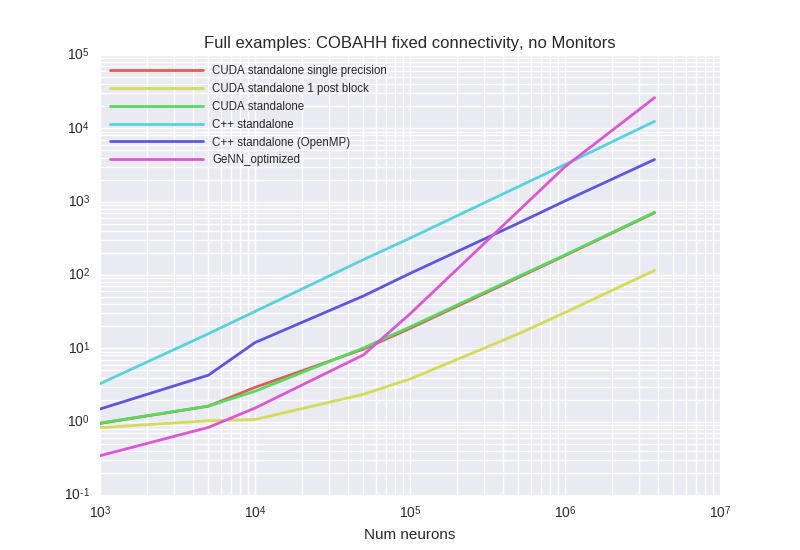
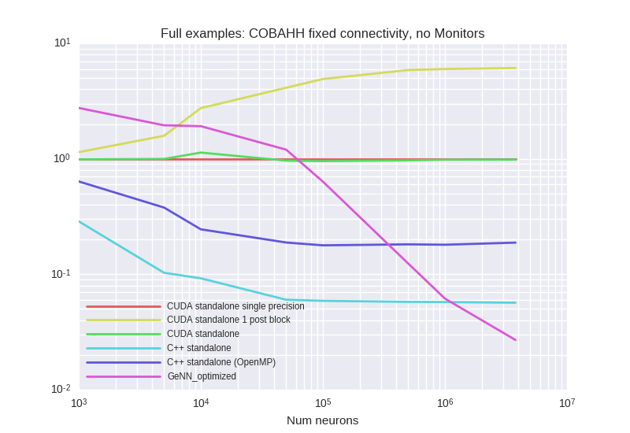

<details><summary>Examplary `nvprof` results for **CUDA-standalone-1-post-block**</summary><p>
Profile summary for `N = 1000`:

```
==13079== NVPROF is profiling process 13079, command: ./main
==13079== Profiling application: ./main
==13079== Profiling result:
            Type  Time(%)      Time     Calls       Avg       Min       Max  Name
 GPU activities:   43.62%  148.69ms     10000  14.868us  14.592us  15.520us  kernel_neurongroup_stateupdater_codeobject(int, int, double*, double*, double*, char*, double*, double*, double*, double*, double, double*)
                   18.20%  62.047ms      9496  6.5330us  2.8800us  9.0880us  kernel_synapses_pre_codeobject(int, int, int, int, int, int*, int, double*, int*, int, int*, int, int*)
                   13.31%  45.378ms      9496  4.7780us  2.9120us  9.7600us  kernel_synapses_1_pre_codeobject(int, int, int, int, int, int*, int, int*, int, int*, int, double*, int*)
                   12.02%  40.959ms     20000  2.0470us  2.0160us  2.8160us  [CUDA memcpy DtoH]
                    7.96%  27.119ms     10000  2.7110us  2.2720us  2.8480us  kernel_neurongroup_thresholder_codeobject(int, int, int*, double, double*, double*, char*)
                    4.89%  16.665ms     10000  1.6660us  1.6320us  2.0800us  _GLOBAL__N__69_tmpxft_00003148_00000000_6_neurongroup_thresholder_codeobject_cpp1_ii_0e9058a7::_reset_neurongroup_thresholder_codeobject(int*)
      API calls:   52.78%  579.62ms     48992  11.830us  9.4790us  8.3509ms  cudaLaunch
                   38.08%  418.24ms     20000  20.911us  15.313us  92.058us  cudaMemcpy
                    6.55%  71.963ms    446896     161ns     128ns  401.92us  cudaSetupArgument
                    1.36%  14.899ms     48992     304ns     181ns  318.66us  cudaConfigureCall
                    1.21%  13.298ms     50000     265ns     203ns  336.57us  cudaGetLastError
                    0.01%  145.21us         1  145.21us  145.21us  145.21us  cudaMemGetInfo
                    0.00%  23.164us         6  3.8600us  2.9650us  5.3010us  cudaFuncGetAttributes
                    0.00%  16.704us        21     795ns     611ns  2.0340us  cudaOccupancyMaxActiveBlocksPerMultiprocessorWithFlags
                    0.00%  8.2350us         1  8.2350us  8.2350us  8.2350us  cudaDeviceSynchronize
                    0.00%  4.0730us         8     509ns     335ns     848ns  cudaDeviceGetAttribute
                    0.00%  2.9050us         2  1.4520us  1.3580us  1.5470us  cudaGetDevice

```

</p></details>


<details><summary>Examplary `nvprof` results for **CUDA-standalone-single-precision**</summary><p>
Profile summary for `N = 1000`:

```
==12483== NVPROF is profiling process 12483, command: ./main
==12483== Profiling application: ./main
==12483== Profiling result:
            Type  Time(%)      Time     Calls       Avg       Min       Max  Name
 GPU activities:   30.85%  148.78ms     10000  14.877us  14.561us  15.712us  kernel_neurongroup_stateupdater_codeobject(int, int, float*, float*, double*, char*, double*, float*, float*, float*, double, float*)
                   29.75%  143.46ms      9334  15.369us  5.7920us  56.608us  kernel_synapses_1_pre_codeobject(int, int, int, int, int, int*, int, int*, int, int*, int, float*, int*)
                   21.69%  104.61ms      9334  11.207us  3.8080us  36.160us  kernel_synapses_pre_codeobject(int, int, int, int, int, int*, int, float*, int*, int, int*, int, int*)
                    8.50%  40.991ms     20000  2.0490us  2.0160us  2.6880us  [CUDA memcpy DtoH]
                    5.75%  27.709ms     10000  2.7700us  2.3040us  2.8800us  kernel_neurongroup_thresholder_codeobject(int, int, int*, double, float*, double*, char*)
                    3.47%  16.720ms     10000  1.6720us  1.6320us  1.9840us  _GLOBAL__N__69_tmpxft_00002ed4_00000000_6_neurongroup_thresholder_codeobject_cpp1_ii_7f32e276::_reset_neurongroup_thresholder_codeobject(int*)
      API calls:   48.45%  577.48ms     48668  11.865us  9.3560us  11.531ms  cudaLaunch
                   43.16%  514.48ms     20000  25.724us  15.320us  990.02us  cudaMemcpy
                    6.05%  72.132ms    442684     162ns     135ns  329.41us  cudaSetupArgument
                    1.21%  14.480ms     48668     297ns     166ns  327.86us  cudaConfigureCall
                    1.10%  13.159ms     50000     263ns     193ns  335.79us  cudaGetLastError
                    0.01%  132.53us         1  132.53us  132.53us  132.53us  cudaMemGetInfo
                    0.00%  22.933us         6  3.8220us  3.0170us  5.2270us  cudaFuncGetAttributes
                    0.00%  19.536us         1  19.536us  19.536us  19.536us  cudaDeviceSynchronize
                    0.00%  19.368us        25     774ns     600ns  2.0590us  cudaOccupancyMaxActiveBlocksPerMultiprocessorWithFlags
                    0.00%  4.0020us         8     500ns     346ns     862ns  cudaDeviceGetAttribute
                    0.00%  2.5630us         2  1.2810us  1.0850us  1.4780us  cudaGetDevice

```

</p></details>


<details><summary>Examplary `nvprof` results for **CUDAStandaloneConfiguration**</summary><p>
Profile summary for `N = 1000`:

```
==13695== NVPROF is profiling process 13695, command: ./main
==13695== Profiling application: ./main
==13695== Profiling result:
            Type  Time(%)      Time     Calls       Avg       Min       Max  Name
 GPU activities:   32.36%  149.21ms     10000  14.921us  14.656us  15.968us  kernel_neurongroup_stateupdater_codeobject(int, int, double*, double*, double*, char*, double*, double*, double*, double*, double, double*)
                   27.69%  127.69ms      8937  14.287us  5.8240us  65.408us  kernel_synapses_1_pre_codeobject(int, int, int, int, int, int*, int, int*, int, int*, int, double*, int*)
                   21.48%  99.057ms      8937  11.083us  3.8080us  42.433us  kernel_synapses_pre_codeobject(int, int, int, int, int, int*, int, double*, int*, int, int*, int, int*)
                    8.86%  40.848ms     20000  2.0420us  2.0160us  2.5920us  [CUDA memcpy DtoH]
                    5.97%  27.536ms     10000  2.7530us  2.3360us  2.9120us  kernel_neurongroup_thresholder_codeobject(int, int, int*, double, double*, double*, char*)
                    3.63%  16.730ms     10000  1.6730us  1.6000us  2.1120us  _GLOBAL__N__69_tmpxft_000033a7_00000000_6_neurongroup_thresholder_codeobject_cpp1_ii_0e9058a7::_reset_neurongroup_thresholder_codeobject(int*)
      API calls:   48.57%  575.91ms     47874  12.029us  9.5250us  8.3298ms  cudaLaunch
                   42.71%  506.49ms     20000  25.324us  15.361us  370.81us  cudaMemcpy
                    6.47%  76.719ms    432362     177ns     139ns  343.77us  cudaSetupArgument
                    1.14%  13.459ms     50000     269ns     194ns  330.13us  cudaGetLastError
                    1.10%  13.028ms     47874     272ns     192ns  14.607us  cudaConfigureCall
                    0.01%  131.63us         1  131.63us  131.63us  131.63us  cudaMemGetInfo
                    0.00%  26.868us         1  26.868us  26.868us  26.868us  cudaDeviceSynchronize
                    0.00%  22.267us         6  3.7110us  2.9820us  4.8970us  cudaFuncGetAttributes
                    0.00%  17.580us        21     837ns     638ns  1.9830us  cudaOccupancyMaxActiveBlocksPerMultiprocessorWithFlags
                    0.00%  3.7380us         8     467ns     336ns     888ns  cudaDeviceGetAttribute
                    0.00%  2.3520us         2  1.1760us  1.1070us  1.2450us  cudaGetDevice

```

</p></details>


<details><summary>Examplary `nvprof` results for **GeNNConfigurationOptimized**</summary><p>
Profile summary for `N = 1000`:

```
==14078== NVPROF is profiling process 14078, command: ./main test 1.0 1
==14078== Profiling application: ./main test 1.0 1
==14078== Profiling result:
            Type  Time(%)      Time     Calls       Avg       Min       Max  Name
 GPU activities:   57.18%  181.78ms     10000  18.177us  16.608us  20.640us  calcNeurons
                   42.48%  135.06ms     10000  13.505us  2.6240us  44.512us  calcSynapses
                    0.26%  818.63us        68  12.038us     960ns  163.17us  [CUDA memcpy HtoD]
                    0.08%  251.14us        18  13.952us  1.9520us  154.85us  [CUDA memcpy DtoH]
      API calls:   49.72%  355.25ms        19  18.698ms  9.8970us  352.41ms  cudaHostAlloc
                   45.07%  322.04ms     20000  16.102us  9.3420us  323.22us  cudaLaunch
                    3.11%  22.247ms        88  252.81us     590ns  19.969ms  cudaMemcpy
                    1.13%  8.0951ms     20000     404ns     302ns  322.02us  cudaConfigureCall
                    0.73%  5.2112ms     20000     260ns     192ns  310.52us  cudaSetupArgument
                    0.15%  1.0631ms        19  55.950us  7.2600us  162.06us  cudaMalloc
                    0.06%  396.91us        94  4.2220us     158ns  154.33us  cuDeviceGetAttribute
                    0.02%  111.86us         1  111.86us  111.86us  111.86us  cuDeviceTotalMem
                    0.01%  36.677us         1  36.677us  36.677us  36.677us  cuDeviceGetName
                    0.00%  20.522us        19  1.0800us     517ns  3.7310us  cudaGetSymbolAddress
                    0.00%  9.1910us         1  9.1910us  9.1910us  9.1910us  cudaSetDevice
                    0.00%  3.0190us         3  1.0060us     226ns  2.2870us  cuDeviceGetCount
                    0.00%  1.7670us         1  1.7670us  1.7670us  1.7670us  cudaGetDeviceCount
                    0.00%  1.0850us         2     542ns     232ns     853ns  cuDeviceGet

```

</p></details>


***

### CUBAFixedConnectivity (with Monitor)
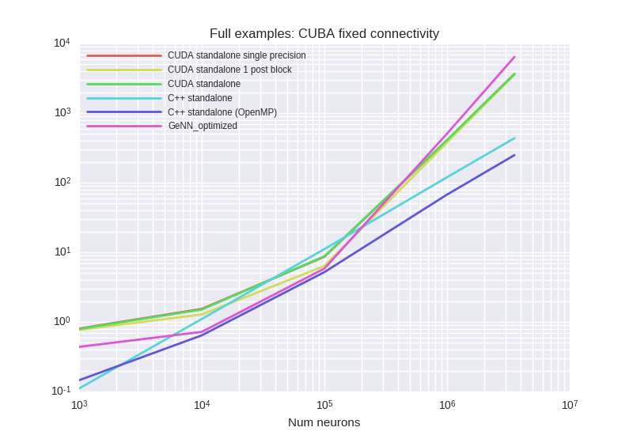


<details><summary>Examplary `nvprof` results for **CUDA-standalone-1-post-block**</summary><p>
Profile summary for `N = 1000`:

```
==9397== NVPROF is profiling process 9397, command: ./main
==9397== Profiling application: ./main
==9397== Profiling result:
            Type  Time(%)      Time     Calls       Avg       Min       Max  Name
 GPU activities:   23.74%  62.603ms     10000  6.2600us  1.6000us  13.273ms  kernel_spikemonitor_codeobject(int, int*, double, int*, int*, int*, int, int*, double*, int, int*, int*)
                   21.40%  56.427ms     10000  5.6420us  5.3440us  6.8800us  kernel_neurongroup_stateupdater_codeobject(int, int, double*, double*, double, double*, double*, double*, char*)
                   15.65%  41.272ms     20000  2.0630us  2.0160us  2.6560us  [CUDA memcpy DtoH]
                    9.91%  26.132ms      4267  6.1240us  3.3920us  8.0000us  kernel_synapses_pre_codeobject(int, int, int, int, int, int*, int, int*, int, double*, int*, int, int*, char*)
                    9.07%  23.922ms     10000  2.3920us  2.0480us  2.8490us  kernel_neurongroup_thresholder_codeobject(int, int, int*, double, double*, double*, char*)
                    7.39%  19.496ms     10000  1.9490us  1.8240us  2.1120us  kernel_neurongroup_resetter_codeobject(int, int, double*, int*, char*)
                    6.88%  18.147ms      4267  4.2520us  3.3920us  7.6800us  kernel_synapses_1_pre_codeobject(int, int, int, int, int, int*, int, int*, int, int*, int, int*, double*, char*)
                    5.91%  15.594ms     10000  1.5590us  1.4080us  2.0800us  _GLOBAL__N__69_tmpxft_000022bf_00000000_6_neurongroup_thresholder_codeobject_cpp1_ii_0e9058a7::_reset_neurongroup_thresholder_codeobject(int*)
                    0.02%  58.304us         1  58.304us  58.304us  58.304us  _run_spikemonitor_codeobject_init(void)
      API calls:   54.86%  673.35ms     58535  11.503us  9.4760us  8.4632ms  cudaLaunch
                   35.33%  433.68ms     20000  21.683us  15.474us  13.300ms  cudaMemcpy
                    7.08%  86.852ms    459476     189ns     132ns  360.89us  cudaSetupArgument
                    1.48%  18.142ms     70001     259ns     200ns  335.81us  cudaGetLastError
                    1.23%  15.095ms     58535     257ns     171ns  328.37us  cudaConfigureCall
                    0.01%  131.39us         1  131.39us  131.39us  131.39us  cudaMemGetInfo
                    0.00%  38.324us         9  4.2580us  2.9850us  7.1550us  cudaFuncGetAttributes
                    0.00%  34.263us        40     856ns     659ns  3.0560us  cudaOccupancyMaxActiveBlocksPerMultiprocessorWithFlags
                    0.00%  7.4160us         1  7.4160us  7.4160us  7.4160us  cudaDeviceSynchronize
                    0.00%  6.9930us        12     582ns     318ns  1.2370us  cudaDeviceGetAttribute
                    0.00%  3.9250us         3  1.3080us  1.2160us  1.4140us  cudaGetDevice

```

</p></details>


<details><summary>Examplary `nvprof` results for **CUDA-standalone-single-precision**</summary><p>
Profile summary for `N = 1000`:

```
==8718== NVPROF is profiling process 8718, command: ./main
==8718== Profiling application: ./main
==8718== Profiling result:
            Type  Time(%)      Time     Calls       Avg       Min       Max  Name
 GPU activities:   22.85%  63.400ms     10000  6.3390us  1.7600us  13.238ms  kernel_spikemonitor_codeobject(int, int*, double, int*, int*, int*, int, int*, double*, int, int*, int*)
                   21.31%  59.131ms     10000  5.9130us  5.6640us  7.7770us  kernel_neurongroup_stateupdater_codeobject(int, int, double*, float*, double, float*, double*, float*, char*)
                   14.82%  41.120ms     20000  2.0550us  2.0160us  2.6560us  [CUDA memcpy DtoH]
                   11.08%  30.753ms      4154  7.4030us  5.1520us  24.320us  kernel_synapses_pre_codeobject(int, int, int, int, int, int*, int, int*, int, float*, int*, int, int*, char*)
                    8.59%  23.840ms     10000  2.3840us  1.9840us  3.2960us  kernel_neurongroup_thresholder_codeobject(int, int, int*, double, float*, double*, char*)
                    8.51%  23.622ms      4154  5.6860us  4.3200us  18.016us  kernel_synapses_1_pre_codeobject(int, int, int, int, int, int*, int, int*, int, int*, int, int*, float*, char*)
                    7.22%  20.035ms     10000  2.0030us  1.8880us  2.3360us  kernel_neurongroup_resetter_codeobject(int, int, float*, int*, char*)
                    5.59%  15.515ms     10000  1.5510us  1.4400us  1.7920us  _GLOBAL__N__69_tmpxft_00001fc5_00000000_6_neurongroup_thresholder_codeobject_cpp1_ii_7f32e276::_reset_neurongroup_thresholder_codeobject(int*)
                    0.02%  66.336us         1  66.336us  66.336us  66.336us  _run_spikemonitor_codeobject_init(void)
      API calls:   55.13%  665.20ms     58309  11.408us  9.5350us  13.592ms  cudaLaunch
                   35.35%  426.52ms     20000  21.326us  15.394us  13.253ms  cudaMemcpy
                    6.75%  81.430ms    456312     178ns     140ns  331.71us  cudaSetupArgument
                    1.53%  18.467ms     70001     263ns     207ns  327.68us  cudaGetLastError
                    1.23%  14.881ms     58309     255ns     181ns  328.57us  cudaConfigureCall
                    0.01%  132.35us         1  132.35us  132.35us  132.35us  cudaMemGetInfo
                    0.00%  32.276us         9  3.5860us  2.8370us  5.0210us  cudaFuncGetAttributes
                    0.00%  28.025us        40     700ns     568ns  1.7560us  cudaOccupancyMaxActiveBlocksPerMultiprocessorWithFlags
                    0.00%  7.2940us         1  7.2940us  7.2940us  7.2940us  cudaDeviceSynchronize
                    0.00%  5.6560us        12     471ns     327ns     948ns  cudaDeviceGetAttribute
                    0.00%  3.3090us         3  1.1030us     879ns  1.4470us  cudaGetDevice

```

</p></details>


<details><summary>Examplary `nvprof` results for **CUDAStandaloneConfiguration**</summary><p>
Profile summary for `N = 1000`:

```
==10076== NVPROF is profiling process 10076, command: ./main
==10076== Profiling application: ./main
==10076== Profiling result:
            Type  Time(%)      Time     Calls       Avg       Min       Max  Name
 GPU activities:   22.61%  62.109ms     10000  6.2100us  1.6000us  13.332ms  kernel_spikemonitor_codeobject(int, int*, double, int*, int*, int*, int, int*, double*, int, int*, int*)
                   21.45%  58.930ms     10000  5.8930us  5.6960us  6.6880us  kernel_neurongroup_stateupdater_codeobject(int, int, double*, double*, double, double*, double*, double*, char*)
                   14.99%  41.162ms     20000  2.0580us  2.0160us  2.6880us  [CUDA memcpy DtoH]
                   10.59%  29.081ms      4173  6.9680us  4.3200us  21.664us  kernel_synapses_pre_codeobject(int, int, int, int, int, int*, int, int*, int, double*, int*, int, int*, char*)
                    8.90%  24.457ms      4173  5.8600us  4.2880us  18.880us  kernel_synapses_1_pre_codeobject(int, int, int, int, int, int*, int, int*, int, int*, int, int*, double*, char*)
                    8.64%  23.723ms     10000  2.3720us  2.0160us  2.8480us  kernel_neurongroup_thresholder_codeobject(int, int, int*, double, double*, double*, char*)
                    7.13%  19.584ms     10000  1.9580us  1.7920us  2.1440us  kernel_neurongroup_resetter_codeobject(int, int, double*, int*, char*)
                    5.67%  15.568ms     10000  1.5560us  1.4080us  2.0480us  _GLOBAL__N__69_tmpxft_0000255a_00000000_6_neurongroup_thresholder_codeobject_cpp1_ii_0e9058a7::_reset_neurongroup_thresholder_codeobject(int*)
                    0.03%  69.344us         1  69.344us  69.344us  69.344us  _run_spikemonitor_codeobject_init(void)
      API calls:   54.79%  651.24ms     58347  11.161us  9.4420us  8.3386ms  cudaLaunch
                   36.05%  428.51ms     20000  21.425us  15.736us  13.347ms  cudaMemcpy
                    6.43%  76.396ms    456844     167ns     130ns  335.45us  cudaSetupArgument
                    1.43%  16.960ms     70001     242ns     185ns  312.16us  cudaGetLastError
                    1.29%  15.325ms     58347     262ns     192ns  316.66us  cudaConfigureCall
                    0.01%  132.24us         1  132.24us  132.24us  132.24us  cudaMemGetInfo
                    0.00%  33.773us         9  3.7520us  3.0040us  5.1420us  cudaFuncGetAttributes
                    0.00%  29.697us        40     742ns     589ns  1.9640us  cudaOccupancyMaxActiveBlocksPerMultiprocessorWithFlags
                    0.00%  7.4040us         1  7.4040us  7.4040us  7.4040us  cudaDeviceSynchronize
                    0.00%  6.1350us        12     511ns     338ns  1.4350us  cudaDeviceGetAttribute
                    0.00%  3.9220us         3  1.3070us     894ns  1.5630us  cudaGetDevice

```

</p></details>


<details><summary>Examplary `nvprof` results for **GeNNConfigurationOptimized**</summary><p>
Profile summary for `N = 1000`:

```
==10572== NVPROF is profiling process 10572, command: ./main test 1.0 1
==10572== Profiling application: ./main test 1.0 1
==10572== Profiling result:
            Type  Time(%)      Time     Calls       Avg       Min       Max  Name
 GPU activities:   59.33%  113.92ms     10000  11.392us  10.560us  12.768us  calcNeurons
                   24.83%  47.687ms     10000  4.7680us  2.2080us  26.112us  calcSynapses
                   15.42%  29.616ms     14385  2.0580us  2.0160us  156.39us  [CUDA memcpy DtoH]
                    0.42%  804.58us        56  14.367us     960ns  164.61us  [CUDA memcpy HtoD]
      API calls:   38.17%  371.94ms     20073  18.529us     567ns  369.15us  cudaMemcpy
                   37.14%  361.90ms        16  22.619ms  13.809us  358.03ms  cudaHostAlloc
                   23.09%  225.03ms     20000  11.251us  9.5800us  368.47us  cudaLaunch
                    0.82%  7.9678ms     20000     398ns     311ns  337.97us  cudaConfigureCall
                    0.55%  5.3943ms     20000     269ns     179ns  331.91us  cudaSetupArgument
                    0.13%  1.3060ms        16  81.623us  8.7160us  234.51us  cudaMalloc
                    0.06%  550.63us        94  5.8570us     317ns  210.92us  cuDeviceGetAttribute
                    0.02%  207.77us         1  207.77us  207.77us  207.77us  cuDeviceTotalMem
                    0.01%  62.659us         1  62.659us  62.659us  62.659us  cuDeviceGetName
                    0.00%  26.264us        16  1.6410us     676ns  5.9640us  cudaGetSymbolAddress
                    0.00%  15.743us         1  15.743us  15.743us  15.743us  cudaSetDevice
                    0.00%  5.8390us         3  1.9460us     409ns  3.8310us  cuDeviceGetCount
                    0.00%  2.6000us         1  2.6000us  2.6000us  2.6000us  cudaGetDeviceCount
                    0.00%  1.8810us         2     940ns     554ns  1.3270us  cuDeviceGet

```

</p></details>


***

### CUBAFixedConnectivityNoMonitor


<details><summary>Examplary `nvprof` results for **CUDA-standalone-1-post-block**</summary><p>
Profile summary for `N = 1000`:

```
==6967== NVPROF is profiling process 6967, command: ./main
==6967== Profiling application: ./main
==6967== Profiling result:
            Type  Time(%)      Time     Calls       Avg       Min       Max  Name
 GPU activities:   28.47%  57.592ms     10000  5.7590us  5.5360us  6.5920us  kernel_neurongroup_stateupdater_codeobject(int, int, double*, double*, double, double*, double*, double*, char*)
                   20.33%  41.119ms     20000  2.0550us  2.0160us  2.6880us  [CUDA memcpy DtoH]
                   13.28%  26.867ms      4381  6.1320us  3.4240us  8.1280us  kernel_synapses_pre_codeobject(int, int, int, int, int, int*, int, int*, int, double*, int*, int, int*, char*)
                   11.92%  24.115ms     10000  2.4110us  2.0480us  2.8480us  kernel_neurongroup_thresholder_codeobject(int, int, int*, double, double*, double*, char*)
                    9.15%  18.514ms     10000  1.8510us  1.6640us  2.1120us  kernel_neurongroup_resetter_codeobject(int, int, double*, int*, char*)
                    9.13%  18.477ms      4381  4.2170us  3.3600us  7.5200us  kernel_synapses_1_pre_codeobject(int, int, int, int, int, int*, int, int*, int, int*, int, int*, double*, char*)
                    7.72%  15.619ms     10000  1.5610us  1.4400us  2.2080us  _GLOBAL__N__69_tmpxft_00001939_00000000_6_neurongroup_thresholder_codeobject_cpp1_ii_0e9058a7::_reset_neurongroup_thresholder_codeobject(int*)
      API calls:   54.20%  575.02ms     48762  11.792us  9.3140us  8.1495ms  cudaLaunch
                   37.33%  396.03ms     20000  19.801us  15.212us  353.63us  cudaMemcpy
                    5.79%  61.416ms    342668     179ns     136ns  355.69us  cudaSetupArgument
                    1.46%  15.529ms     60000     258ns     185ns  330.45us  cudaGetLastError
                    1.21%  12.786ms     48762     262ns     168ns  336.32us  cudaConfigureCall
                    0.01%  131.40us         1  131.40us  131.40us  131.40us  cudaMemGetInfo
                    0.00%  34.382us         8  4.2970us  2.8610us  6.8350us  cudaFuncGetAttributes
                    0.00%  31.401us        39     805ns     590ns  2.8320us  cudaOccupancyMaxActiveBlocksPerMultiprocessorWithFlags
                    0.00%  7.4700us         1  7.4700us  7.4700us  7.4700us  cudaDeviceSynchronize
                    0.00%  6.8030us        12     566ns     334ns  1.0700us  cudaDeviceGetAttribute
                    0.00%  3.7070us         3  1.2350us  1.1360us  1.2960us  cudaGetDevice

```

</p></details>


<details><summary>Examplary `nvprof` results for **CUDA-standalone-single-precision**</summary><p>
Profile summary for `N = 1000`:

```
==6186== NVPROF is profiling process 6186, command: ./main
==6186== Profiling application: ./main
==6186== Profiling result:
            Type  Time(%)      Time     Calls       Avg       Min       Max  Name
 GPU activities:   28.07%  59.714ms     10000  5.9710us  5.7280us  7.1040us  kernel_neurongroup_stateupdater_codeobject(int, int, double*, float*, double, float*, double*, float*, char*)
                   19.25%  40.939ms     20000  2.0460us  2.0160us  2.5280us  [CUDA memcpy DtoH]
                   13.12%  27.911ms      4306  6.4810us  4.3840us  24.992us  kernel_synapses_pre_codeobject(int, int, int, int, int, int*, int, int*, int, float*, int*, int, int*, char*)
                   11.69%  24.858ms      4306  5.7720us  4.3200us  20.608us  kernel_synapses_1_pre_codeobject(int, int, int, int, int, int*, int, int*, int, int*, int, int*, float*, char*)
                   11.18%  23.783ms     10000  2.3780us  2.0160us  3.2320us  kernel_neurongroup_thresholder_codeobject(int, int, int*, double, float*, double*, char*)
                    9.34%  19.874ms     10000  1.9870us  1.8240us  2.1760us  kernel_neurongroup_resetter_codeobject(int, int, float*, int*, char*)
                    7.35%  15.627ms     10000  1.5620us  1.4400us  1.7920us  _GLOBAL__N__69_tmpxft_000015f5_00000000_6_neurongroup_thresholder_codeobject_cpp1_ii_7f32e276::_reset_neurongroup_thresholder_codeobject(int*)
      API calls:   54.02%  561.72ms     48612  11.555us  9.4550us  10.182ms  cudaLaunch
                   37.52%  390.13ms     20000  19.506us  15.354us  363.63us  cudaMemcpy
                    5.80%  60.357ms    340568     177ns     131ns  337.98us  cudaSetupArgument
                    1.38%  14.326ms     60000     238ns     184ns  302.85us  cudaGetLastError
                    1.27%  13.175ms     48612     271ns     178ns  285.45us  cudaConfigureCall
                    0.01%  133.90us         1  133.90us  133.90us  133.90us  cudaMemGetInfo
                    0.00%  30.371us        39     778ns     634ns  1.8480us  cudaOccupancyMaxActiveBlocksPerMultiprocessorWithFlags
                    0.00%  30.012us         8  3.7510us  2.9850us  5.5110us  cudaFuncGetAttributes
                    0.00%  7.3540us         1  7.3540us  7.3540us  7.3540us  cudaDeviceSynchronize
                    0.00%  6.3660us        12     530ns     336ns  1.3850us  cudaDeviceGetAttribute
                    0.00%  3.7780us         3  1.2590us     921ns  1.4680us  cudaGetDevice

```

</p></details>


<details><summary>Examplary `nvprof` results for **CUDAStandaloneConfiguration**</summary><p>
Profile summary for `N = 1000`:

```
==7751== NVPROF is profiling process 7751, command: ./main
==7751== Profiling application: ./main
==7751== Profiling result:
            Type  Time(%)      Time     Calls       Avg       Min       Max  Name
 GPU activities:   26.71%  56.090ms     10000  5.6090us  5.4080us  6.5600us  kernel_neurongroup_stateupdater_codeobject(int, int, double*, double*, double, double*, double*, double*, char*)
                   19.58%  41.123ms     20000  2.0560us  2.0160us  2.5600us  [CUDA memcpy DtoH]
                   14.20%  29.814ms      4257  7.0030us  4.3200us  22.496us  kernel_synapses_pre_codeobject(int, int, int, int, int, int*, int, int*, int, double*, int*, int, int*, char*)
                   11.95%  25.090ms      4257  5.8930us  4.3200us  17.632us  kernel_synapses_1_pre_codeobject(int, int, int, int, int, int*, int, int*, int, int*, int, int*, double*, char*)
                   11.32%  23.763ms     10000  2.3760us  2.0160us  2.8170us  kernel_neurongroup_thresholder_codeobject(int, int, int*, double, double*, double*, char*)
                    8.79%  18.455ms     10000  1.8450us  1.6000us  2.1120us  kernel_neurongroup_resetter_codeobject(int, int, double*, int*, char*)
                    7.46%  15.672ms     10000  1.5670us  1.4400us  2.1120us  _GLOBAL__N__69_tmpxft_00001c4a_00000000_6_neurongroup_thresholder_codeobject_cpp1_ii_0e9058a7::_reset_neurongroup_thresholder_codeobject(int*)
      API calls:   53.85%  557.76ms     48514  11.496us  9.2790us  8.1075ms  cudaLaunch
                   37.83%  391.83ms     20000  19.591us  15.197us  46.772us  cudaMemcpy
                    5.63%  58.305ms    339196     171ns     132ns  337.08us  cudaSetupArgument
                    1.53%  15.827ms     60000     263ns     180ns  334.57us  cudaGetLastError
                    1.14%  11.773ms     48514     242ns     163ns  327.94us  cudaConfigureCall
                    0.01%  150.56us         1  150.56us  150.56us  150.56us  cudaMemGetInfo
                    0.00%  29.212us        39     749ns     615ns  1.8020us  cudaOccupancyMaxActiveBlocksPerMultiprocessorWithFlags
                    0.00%  28.283us         8  3.5350us  2.9040us  4.6610us  cudaFuncGetAttributes
                    0.00%  7.2410us         1  7.2410us  7.2410us  7.2410us  cudaDeviceSynchronize
                    0.00%  6.0530us        12     504ns     325ns  1.3360us  cudaDeviceGetAttribute
                    0.00%  3.6870us         3  1.2290us     804ns  1.6850us  cudaGetDevice

```

</p></details>


<details><summary>Examplary `nvprof` results for **GeNNConfigurationOptimized**</summary><p>
Profile summary for `N = 1000`:

```
==8405== NVPROF is profiling process 8405, command: ./main test 1.0 1
==8405== Profiling application: ./main test 1.0 1
==8405== Profiling result:
            Type  Time(%)      Time     Calls       Avg       Min       Max  Name
 GPU activities:   71.12%  108.89ms     10000  10.889us  9.8240us  13.248us  calcNeurons
                   28.20%  43.180ms     10000  4.3180us  2.0480us  20.320us  calcSynapses
                    0.52%  801.32us        56  14.309us     960ns  164.10us  [CUDA memcpy HtoD]
                    0.15%  235.33us        13  18.102us  1.9520us  155.81us  [CUDA memcpy DtoH]
      API calls:   76.13%  696.48ms        16  43.530ms  9.5190us  693.61ms  cudaHostAlloc
                   22.13%  202.49ms     20000  10.124us  9.3050us  354.81us  cudaLaunch
                    0.78%  7.1784ms     20000     358ns     297ns  325.03us  cudaConfigureCall
                    0.55%  5.0628ms     20000     253ns     191ns  354.62us  cudaSetupArgument
                    0.22%  2.0281ms        73  27.782us     565ns  178.51us  cudaMemcpy
                    0.11%  1.0264ms        16  64.153us  7.0920us  160.60us  cudaMalloc
                    0.04%  399.52us        94  4.2500us     157ns  155.85us  cuDeviceGetAttribute
                    0.01%  112.57us         1  112.57us  112.57us  112.57us  cuDeviceTotalMem
                    0.00%  36.487us         1  36.487us  36.487us  36.487us  cuDeviceGetName
                    0.00%  18.184us        16  1.1360us     548ns  3.5270us  cudaGetSymbolAddress
                    0.00%  9.5790us         1  9.5790us  9.5790us  9.5790us  cudaSetDevice
                    0.00%  3.1630us         3  1.0540us     212ns  2.3710us  cuDeviceGetCount
                    0.00%  1.6720us         1  1.6720us  1.6720us  1.6720us  cudaGetDeviceCount
                    0.00%  1.1180us         2     559ns     244ns     874ns  cuDeviceGet

```

</p></details>


***

### DenseMediumRateSynapsesOnly
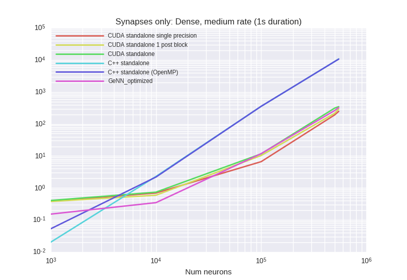


<details><summary>Examplary `nvprof` results for **CUDA-standalone-1-post-block**</summary><p>
Profile summary for `N = 1000`:

```
==19427== NVPROF is profiling process 19427, command: ./main
==19427== Profiling application: ./main
==19427== Profiling result:
            Type  Time(%)      Time     Calls       Avg       Min       Max  Name
 GPU activities:   49.70%  51.333ms     10000  5.1330us  4.8960us  6.1760us  kernel_synapses_pre_codeobject(int, int, int, int, int, int*, int, int*, int, int*, int, double*, int*)
                   19.82%  20.467ms     10000  2.0460us  2.0160us  2.6560us  [CUDA memcpy DtoH]
                   16.78%  17.328ms     10000  1.7320us  1.6000us  2.0480us  kernel_neurongroup_thresholder_codeobject(int, int, int*)
                   13.70%  14.149ms     10000  1.4140us  1.2800us  1.8880us  _GLOBAL__N__69_tmpxft_00004ac4_00000000_6_neurongroup_thresholder_codeobject_cpp1_ii_e0a5624b::_reset_neurongroup_thresholder_codeobject(int*)
      API calls:   59.02%  352.00ms     30000  11.733us  9.6370us  9.1550ms  cudaLaunch
                   33.42%  199.33ms     10000  19.933us  18.108us  37.000us  cudaMemcpy
                    4.98%  29.728ms    170000     174ns     134ns  319.96us  cudaSetupArgument
                    1.32%  7.8941ms     30000     263ns     216ns  5.6320us  cudaGetLastError
                    1.22%  7.2782ms     30000     242ns     161ns  13.728us  cudaConfigureCall
                    0.02%  132.12us         1  132.12us  132.12us  132.12us  cudaMemGetInfo
                    0.00%  11.344us         3  3.7810us  3.0170us  4.5060us  cudaFuncGetAttributes
                    0.00%  8.6340us         1  8.6340us  8.6340us  8.6340us  cudaDeviceSynchronize
                    0.00%  6.8660us         3  2.2880us     698ns  4.4390us  cudaOccupancyMaxActiveBlocksPerMultiprocessorWithFlags
                    0.00%  2.1490us         4     537ns     412ns     868ns  cudaDeviceGetAttribute
                    0.00%  1.0910us         1  1.0910us  1.0910us  1.0910us  cudaGetDevice

```

</p></details>


<details><summary>Examplary `nvprof` results for **CUDA-standalone-single-precision**</summary><p>
Profile summary for `N = 1000`:

```
==19057== NVPROF is profiling process 19057, command: ./main
==19057== Profiling application: ./main
==19057== Profiling result:
            Type  Time(%)      Time     Calls       Avg       Min       Max  Name
 GPU activities:   58.37%  73.040ms     10000  7.3030us  6.9440us  8.0000us  kernel_synapses_pre_codeobject(int, int, int, int, int, int*, int, int*, int, int*, int, float*, int*)
                   16.39%  20.516ms     10000  2.0510us  2.0160us  2.6880us  [CUDA memcpy DtoH]
                   13.85%  17.333ms     10000  1.7330us  1.6000us  2.0480us  kernel_neurongroup_thresholder_codeobject(int, int, int*)
                   11.39%  14.253ms     10000  1.4250us  1.2800us  2.0800us  _GLOBAL__N__69_tmpxft_0000492c_00000000_6_neurongroup_thresholder_codeobject_cpp1_ii_e0a5624b::_reset_neurongroup_thresholder_codeobject(int*)
      API calls:   59.29%  360.00ms     30000  11.999us  9.8890us  12.192ms  cudaLaunch
                   33.05%  200.69ms     10000  20.069us  18.188us  38.447us  cudaMemcpy
                    4.93%  29.921ms    170000     176ns     130ns  328.58us  cudaSetupArgument
                    1.37%  8.3117ms     30000     277ns     163ns  3.2860us  cudaConfigureCall
                    1.33%  8.0575ms     30000     268ns     213ns  14.017us  cudaGetLastError
                    0.02%  144.60us         1  144.60us  144.60us  144.60us  cudaMemGetInfo
                    0.00%  11.811us         3  3.9370us  3.1510us  4.7530us  cudaFuncGetAttributes
                    0.00%  9.6590us         1  9.6590us  9.6590us  9.6590us  cudaDeviceSynchronize
                    0.00%  7.6420us         3  2.5470us     746ns  4.9720us  cudaOccupancyMaxActiveBlocksPerMultiprocessorWithFlags
                    0.00%  2.1530us         4     538ns     388ns     883ns  cudaDeviceGetAttribute
                    0.00%  1.2410us         1  1.2410us  1.2410us  1.2410us  cudaGetDevice

```

</p></details>


<details><summary>Examplary `nvprof` results for **CUDAStandaloneConfiguration**</summary><p>
Profile summary for `N = 1000`:

```
==19809== NVPROF is profiling process 19809, command: ./main
==19809== Profiling application: ./main
==19809== Profiling result:
            Type  Time(%)      Time     Calls       Avg       Min       Max  Name
 GPU activities:   60.50%  79.891ms     10000  7.9890us  7.5200us  8.3520us  kernel_synapses_pre_codeobject(int, int, int, int, int, int*, int, int*, int, int*, int, double*, int*)
                   15.56%  20.546ms     10000  2.0540us  2.0160us  2.5920us  [CUDA memcpy DtoH]
                   13.14%  17.346ms     10000  1.7340us  1.6320us  2.2400us  kernel_neurongroup_thresholder_codeobject(int, int, int*)
                   10.80%  14.259ms     10000  1.4250us  1.2800us  1.8880us  _GLOBAL__N__69_tmpxft_00004c3f_00000000_6_neurongroup_thresholder_codeobject_cpp1_ii_e0a5624b::_reset_neurongroup_thresholder_codeobject(int*)
      API calls:   58.83%  345.87ms     30000  11.529us  9.6520us  8.8731ms  cudaLaunch
                   33.57%  197.34ms     10000  19.734us  18.022us  35.584us  cudaMemcpy
                    4.86%  28.580ms    170000     168ns     133ns  322.73us  cudaSetupArgument
                    1.39%  8.1806ms     30000     272ns     238ns  10.495us  cudaGetLastError
                    1.32%  7.7575ms     30000     258ns     192ns  10.616us  cudaConfigureCall
                    0.02%  131.60us         1  131.60us  131.60us  131.60us  cudaMemGetInfo
                    0.00%  11.445us         3  3.8150us  3.0530us  4.6830us  cudaFuncGetAttributes
                    0.00%  10.600us         1  10.600us  10.600us  10.600us  cudaDeviceSynchronize
                    0.00%  6.7150us         3  2.2380us     674ns  4.3130us  cudaOccupancyMaxActiveBlocksPerMultiprocessorWithFlags
                    0.00%  2.1270us         4     531ns     428ns     831ns  cudaDeviceGetAttribute
                    0.00%  1.0200us         1  1.0200us  1.0200us  1.0200us  cudaGetDevice

```

</p></details>


<details><summary>Examplary `nvprof` results for **GeNNConfigurationOptimized**</summary><p>
Profile summary for `N = 1000`:

```
==20110== NVPROF is profiling process 20110, command: ./main test 1.0 1
==20110== Profiling application: ./main test 1.0 1
==20110== Profiling result:
            Type  Time(%)      Time     Calls       Avg       Min       Max  Name
 GPU activities:   63.57%  53.256ms     10000  5.3250us  3.7440us  6.0160us  calcSynapses
                   36.32%  30.424ms     10000  3.0420us  3.0080us  3.4560us  calcNeurons
                    0.07%  57.632us        44  1.3090us     960ns  2.0800us  [CUDA memcpy HtoD]
                    0.05%  38.113us        14  2.7220us  2.0160us  4.7360us  [CUDA memcpy DtoH]
      API calls:   67.15%  442.26ms        12  36.855ms  17.393us  440.44ms  cudaHostAlloc
                   30.64%  201.77ms     20000  10.088us  9.2860us  349.93us  cudaLaunch
                    1.07%  7.0544ms     20000     352ns     287ns  333.64us  cudaConfigureCall
                    0.74%  4.8716ms     20000     243ns     186ns  520.28us  cudaSetupArgument
                    0.19%  1.2524ms        61  20.531us     544ns  38.611us  cudaMemcpy
                    0.12%  810.46us        12  67.537us  12.583us  230.16us  cudaMalloc
                    0.06%  397.10us        94  4.2240us     152ns  154.55us  cuDeviceGetAttribute
                    0.02%  113.17us         1  113.17us  113.17us  113.17us  cuDeviceTotalMem
                    0.01%  36.293us         1  36.293us  36.293us  36.293us  cuDeviceGetName
                    0.00%  21.271us        12  1.7720us     978ns  5.6720us  cudaGetSymbolAddress
                    0.00%  9.3780us         1  9.3780us  9.3780us  9.3780us  cudaSetDevice
                    0.00%  3.1960us         3  1.0650us     216ns  2.4030us  cuDeviceGetCount
                    0.00%  1.7410us         1  1.7410us  1.7410us  1.7410us  cudaGetDeviceCount
                    0.00%  1.0570us         2     528ns     255ns     802ns  cuDeviceGet

```

</p></details>


***

### DenseMediumRateSynapsesOnlyHeterogeneousDelays
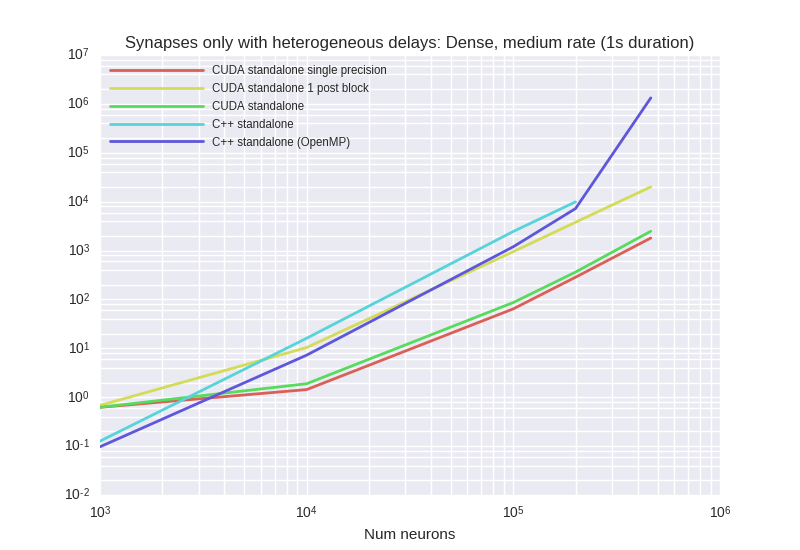


<details><summary>Examplary `nvprof` results for **CUDA-standalone-1-post-block**</summary><p>
Profile summary for `N = 1000`:

```
==27508== NVPROF is profiling process 27508, command: ./main
==27508== Profiling application: ./main
==27508== Profiling result:
            Type  Time(%)      Time     Calls       Avg       Min       Max  Name
 GPU activities:   45.99%  149.10ms     10000  14.910us  6.5920us  15.936us  kernel_synapses_pre_codeobject(int, int, int, int, int, int*, int, int*, int, int*, int, double*, int*)
                   29.06%  94.222ms     10000  9.4220us  8.5440us  240.13us  _run_synapses_pre_push_spikes_push_kernel(int, int, int, int*)
                    8.77%  28.436ms     10000  2.8430us  2.8160us  3.2640us  _run_synapses_pre_push_spikes_advance_kernel(void)
                    6.35%  20.578ms     10000  2.0570us  2.0160us  2.5920us  [CUDA memcpy DtoH]
                    5.40%  17.498ms     10000  1.7490us  1.6640us  2.0160us  kernel_neurongroup_thresholder_codeobject(int, int, int*)
                    4.42%  14.343ms     10000  1.4340us  1.3760us  2.1760us  _GLOBAL__N__69_tmpxft_00006a42_00000000_6_neurongroup_thresholder_codeobject_cpp1_ii_e0a5624b::_reset_neurongroup_thresholder_codeobject(int*)
      API calls:   66.95%  552.77ms     50000  11.055us  9.6110us  9.2716ms  cudaLaunch
                   25.42%  209.91ms     10000  20.991us  18.671us  239.32us  cudaMemcpy
                    4.62%  38.176ms    210000     181ns     135ns  312.61us  cudaSetupArgument
                    1.50%  12.383ms     50000     247ns     208ns     713ns  cudaGetLastError
                    1.49%  12.269ms     50000     245ns     176ns  12.078us  cudaConfigureCall
                    0.02%  132.68us         1  132.68us  132.68us  132.68us  cudaMemGetInfo
                    0.00%  19.213us         1  19.213us  19.213us  19.213us  cudaDeviceSynchronize
                    0.00%  15.086us         4  3.7710us  3.1200us  4.5440us  cudaFuncGetAttributes
                    0.00%  5.7200us         4  1.4300us     694ns  1.8650us  cudaOccupancyMaxActiveBlocksPerMultiprocessorWithFlags
                    0.00%  2.0790us         4     519ns     385ns     830ns  cudaDeviceGetAttribute
                    0.00%  1.0800us         1  1.0800us  1.0800us  1.0800us  cudaGetDevice

```

</p></details>


<details><summary>Examplary `nvprof` results for **CUDA-standalone-single-precision**</summary><p>
Profile summary for `N = 1000`:

```
==27090== NVPROF is profiling process 27090, command: ./main
==27090== Profiling application: ./main
==27090== Profiling result:
            Type  Time(%)      Time     Calls       Avg       Min       Max  Name
 GPU activities:   47.25%  121.25ms     10000  12.125us  8.9920us  834.47us  _run_synapses_pre_push_spikes_push_kernel(int, int, int, int*)
                   21.18%  54.348ms     10000  5.4340us  5.3120us  6.9120us  kernel_synapses_pre_codeobject(int, int, int, int, int, int*, int, int*, int, int*, int, float*, int*)
                   11.26%  28.899ms     10000  2.8890us  2.7200us  2.9440us  _run_synapses_pre_push_spikes_advance_kernel(void)
                    8.00%  20.521ms     10000  2.0520us  2.0160us  2.6240us  [CUDA memcpy DtoH]
                    6.75%  17.311ms     10000  1.7310us  1.6320us  2.2400us  kernel_neurongroup_thresholder_codeobject(int, int, int*)
                    5.57%  14.286ms     10000  1.4280us  1.3440us  1.9520us  _GLOBAL__N__69_tmpxft_0000687b_00000000_6_neurongroup_thresholder_codeobject_cpp1_ii_e0a5624b::_reset_neurongroup_thresholder_codeobject(int*)
      API calls:   65.22%  547.18ms     50000  10.943us  9.4440us  12.884ms  cudaLaunch
                   27.85%  233.67ms     10000  23.367us  18.593us  835.73us  cudaMemcpy
                    4.03%  33.820ms    210000     161ns     134ns  311.42us  cudaSetupArgument
                    1.45%  12.197ms     50000     243ns     207ns  13.039us  cudaGetLastError
                    1.42%  11.913ms     50000     238ns     175ns  21.714us  cudaConfigureCall
                    0.02%  130.75us         1  130.75us  130.75us  130.75us  cudaMemGetInfo
                    0.00%  14.592us         4  3.6480us  2.9170us  4.5810us  cudaFuncGetAttributes
                    0.00%  9.8480us         1  9.8480us  9.8480us  9.8480us  cudaDeviceSynchronize
                    0.00%  5.3670us         4  1.3410us     659ns  1.7490us  cudaOccupancyMaxActiveBlocksPerMultiprocessorWithFlags
                    0.00%  1.8250us         4     456ns     333ns     742ns  cudaDeviceGetAttribute
                    0.00%     984ns         1     984ns     984ns     984ns  cudaGetDevice

```

</p></details>


<details><summary>Examplary `nvprof` results for **CUDAStandaloneConfiguration**</summary><p>
Profile summary for `N = 1000`:

```
==27906== NVPROF is profiling process 27906, command: ./main
==27906== Profiling application: ./main
==27906== Profiling result:
            Type  Time(%)      Time     Calls       Avg       Min       Max  Name
 GPU activities:   45.76%  122.04ms     10000  12.204us  8.8000us  861.03us  _run_synapses_pre_push_spikes_push_kernel(int, int, int, int*)
                   23.44%  62.518ms     10000  6.2510us  5.9200us  7.5840us  kernel_synapses_pre_codeobject(int, int, int, int, int, int*, int, int*, int, int*, int, double*, int*)
                   10.39%  27.718ms     10000  2.7710us  2.6880us  3.2000us  _run_synapses_pre_push_spikes_advance_kernel(void)
                    7.72%  20.601ms     10000  2.0600us  2.0160us  2.5600us  [CUDA memcpy DtoH]
                    6.58%  17.543ms     10000  1.7540us  1.6640us  2.0480us  kernel_neurongroup_thresholder_codeobject(int, int, int*)
                    6.11%  16.295ms     10000  1.6290us  1.3760us  1.9520us  _GLOBAL__N__69_tmpxft_00006bd4_00000000_6_neurongroup_thresholder_codeobject_cpp1_ii_e0a5624b::_reset_neurongroup_thresholder_codeobject(int*)
      API calls:   64.69%  543.40ms     50000  10.867us  9.4370us  9.2286ms  cudaLaunch
                   28.10%  236.02ms     10000  23.602us  18.456us  856.45us  cudaMemcpy
                    4.18%  35.125ms    210000     167ns     135ns  326.88us  cudaSetupArgument
                    1.57%  13.159ms     50000     263ns     220ns  15.076us  cudaGetLastError
                    1.45%  12.180ms     50000     243ns     172ns  14.941us  cudaConfigureCall
                    0.02%  131.27us         1  131.27us  131.27us  131.27us  cudaMemGetInfo
                    0.00%  14.648us         4  3.6620us  2.9940us  4.6940us  cudaFuncGetAttributes
                    0.00%  10.442us         1  10.442us  10.442us  10.442us  cudaDeviceSynchronize
                    0.00%  5.6390us         4  1.4090us     712ns  1.8460us  cudaOccupancyMaxActiveBlocksPerMultiprocessorWithFlags
                    0.00%  1.9090us         4     477ns     360ns     786ns  cudaDeviceGetAttribute
                    0.00%  1.0340us         1  1.0340us  1.0340us  1.0340us  cudaGetDevice

```

</p></details>


***

### HHNeuronsOnly

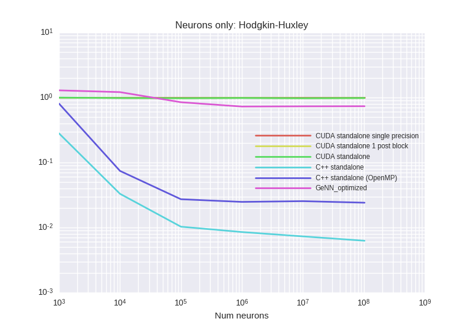

<details><summary>Examplary `nvprof` results for **CUDA-standalone-1-post-block**</summary><p>
Profile summary for `N = 1000`:

```
==2985== NVPROF is profiling process 2985, command: ./main
==2985== Profiling application: ./main
==2985== Profiling result:
            Type  Time(%)      Time     Calls       Avg       Min       Max  Name
 GPU activities:   74.78%  114.44ms     10000  11.443us  9.2480us  12.064us  kernel_neurongroup_stateupdater_codeobject(int, int, double*, double*, char*, double*, double*, double*, double*)
                   15.25%  23.337ms     10000  2.3330us  2.2400us  2.8800us  kernel_neurongroup_thresholder_codeobject(int, int, int*, double, double*, double*, char*)
                    9.97%  15.254ms     10000  1.5250us  1.4400us  1.9520us  _GLOBAL__N__69_tmpxft_00000ab9_00000000_6_neurongroup_thresholder_codeobject_cpp1_ii_0e9058a7::_reset_neurongroup_thresholder_codeobject(int*)
      API calls:   87.14%  303.48ms     30000  10.115us  8.9850us  9.4624ms  cudaLaunch
                    8.99%  31.326ms    170000     184ns     143ns  305.20us  cudaSetupArgument
                    2.01%  6.9933ms     30000     233ns     207ns  10.873us  cudaGetLastError
                    1.78%  6.2038ms     30000     206ns     169ns     855ns  cudaConfigureCall
                    0.05%  179.55us         1  179.55us  179.55us  179.55us  cudaMemGetInfo
                    0.01%  46.252us        35  1.3210us     635ns  2.2240us  cudaOccupancyMaxActiveBlocksPerMultiprocessorWithFlags
                    0.01%  23.191us         4  5.7970us  2.9740us  7.9320us  cudaFuncGetAttributes
                    0.01%  19.964us         1  19.964us  19.964us  19.964us  cudaDeviceSynchronize
                    0.00%  5.4320us         8     679ns     417ns  1.1560us  cudaDeviceGetAttribute
                    0.00%  4.0310us         2  2.0150us  1.6780us  2.3530us  cudaGetDevice

```

</p></details>


<details><summary>Examplary `nvprof` results for **CUDA-standalone-single-precision**</summary><p>
Profile summary for `N = 1000`:

```
==2629== NVPROF is profiling process 2629, command: ./main
==2629== Profiling application: ./main
==2629== Profiling result:
            Type  Time(%)      Time     Calls       Avg       Min       Max  Name
 GPU activities:   74.83%  114.11ms     10000  11.411us  8.6400us  11.648us  kernel_neurongroup_stateupdater_codeobject(int, int, float*, float*, char*, float*, float*, float*, double*)
                   15.43%  23.528ms     10000  2.3520us  2.0480us  2.9440us  kernel_neurongroup_thresholder_codeobject(int, int, int*, double, float*, double*, char*)
                    9.74%  14.848ms     10000  1.4840us  1.4400us  1.7920us  _GLOBAL__N__69_tmpxft_0000093b_00000000_6_neurongroup_thresholder_codeobject_cpp1_ii_7f32e276::_reset_neurongroup_thresholder_codeobject(int*)
      API calls:   87.64%  325.10ms     30000  10.836us  9.1800us  8.1944ms  cudaLaunch
                    8.44%  31.307ms    170000     184ns     134ns  336.99us  cudaSetupArgument
                    2.02%  7.4997ms     30000     249ns     214ns  21.909us  cudaGetLastError
                    1.85%  6.8560ms     30000     228ns     182ns  13.673us  cudaConfigureCall
                    0.04%  132.74us         1  132.74us  132.74us  132.74us  cudaMemGetInfo
                    0.01%  22.238us        35     635ns     592ns  1.2490us  cudaOccupancyMaxActiveBlocksPerMultiprocessorWithFlags
                    0.01%  19.647us         1  19.647us  19.647us  19.647us  cudaDeviceSynchronize
                    0.00%  15.466us         4  3.8660us  2.8000us  5.4100us  cudaFuncGetAttributes
                    0.00%  3.6830us         8     460ns     326ns     908ns  cudaDeviceGetAttribute
                    0.00%  2.6180us         2  1.3090us  1.0840us  1.5340us  cudaGetDevice

```

</p></details>


<details><summary>Examplary `nvprof` results for **CUDAStandaloneConfiguration**</summary><p>
Profile summary for `N = 1000`:

```
==3339== NVPROF is profiling process 3339, command: ./main
==3339== Profiling application: ./main
==3339== Profiling result:
            Type  Time(%)      Time     Calls       Avg       Min       Max  Name
 GPU activities:   75.33%  116.85ms     10000  11.685us  9.2160us  12.128us  kernel_neurongroup_stateupdater_codeobject(int, int, double*, double*, char*, double*, double*, double*, double*)
                   15.13%  23.468ms     10000  2.3460us  2.0800us  2.8800us  kernel_neurongroup_thresholder_codeobject(int, int, int*, double, double*, double*, char*)
                    9.54%  14.802ms     10000  1.4800us  1.4080us  1.8240us  _GLOBAL__N__69_tmpxft_00000c19_00000000_6_neurongroup_thresholder_codeobject_cpp1_ii_0e9058a7::_reset_neurongroup_thresholder_codeobject(int*)
      API calls:   87.76%  303.83ms     30000  10.127us  8.9470us  8.2638ms  cudaLaunch
                    8.63%  29.875ms    170000     175ns     142ns  325.88us  cudaSetupArgument
                    1.83%  6.3322ms     30000     211ns     175ns     570ns  cudaGetLastError
                    1.72%  5.9649ms     30000     198ns     155ns  4.7680us  cudaConfigureCall
                    0.04%  133.05us         1  133.05us  133.05us  133.05us  cudaMemGetInfo
                    0.01%  21.366us        35     610ns     556ns  1.2480us  cudaOccupancyMaxActiveBlocksPerMultiprocessorWithFlags
                    0.01%  19.453us         1  19.453us  19.453us  19.453us  cudaDeviceSynchronize
                    0.00%  16.739us         4  4.1840us  3.0630us  6.0190us  cudaFuncGetAttributes
                    0.00%  3.9380us         8     492ns     346ns  1.0140us  cudaDeviceGetAttribute
                    0.00%  2.9010us         2  1.4500us  1.0480us  1.8530us  cudaGetDevice

```

</p></details>


<details><summary>Examplary `nvprof` results for **GeNNConfigurationOptimized**</summary><p>
Profile summary for `N = 1000`:

```
==3690== NVPROF is profiling process 3690, command: ./main test 1.0 1
==3690== Profiling application: ./main test 1.0 1
==3690== Profiling result:
            Type  Time(%)      Time     Calls       Avg       Min       Max  Name
 GPU activities:   99.94%  168.63ms     10000  16.862us  11.616us  19.744us  calcNeurons
                    0.04%  62.976us        40  1.5740us     960ns  2.1760us  [CUDA memcpy HtoD]
                    0.02%  38.336us        11  3.4850us  1.9520us  4.8320us  [CUDA memcpy DtoH]
      API calls:   67.50%  384.99ms        10  38.499ms  18.905us  383.22ms  cudaHostAlloc
                   27.37%  156.09ms     10000  15.609us  9.6160us  350.66us  cudaLaunch
                    3.60%  20.543ms        53  387.61us     585ns  19.430ms  cudaMemcpy
                    0.75%  4.2576ms     10000     425ns     337ns  4.6740us  cudaConfigureCall
                    0.54%  3.0580ms     10000     305ns     226ns  332.21us  cudaSetupArgument
                    0.14%  800.90us        10  80.090us  13.812us  235.07us  cudaMalloc
                    0.07%  397.59us        94  4.2290us     153ns  155.01us  cuDeviceGetAttribute
                    0.02%  112.50us         1  112.50us  112.50us  112.50us  cuDeviceTotalMem
                    0.01%  36.397us         1  36.397us  36.397us  36.397us  cuDeviceGetName
                    0.00%  18.755us        10  1.8750us  1.0250us  5.9050us  cudaGetSymbolAddress
                    0.00%  13.482us         1  13.482us  13.482us  13.482us  cudaSetDevice
                    0.00%  3.1770us         3  1.0590us     200ns  2.4270us  cuDeviceGetCount
                    0.00%  1.6160us         1  1.6160us  1.6160us  1.6160us  cudaGetDeviceCount
                    0.00%  1.0550us         2     527ns     210ns     845ns  cuDeviceGet

```

</p></details>


***

### LinearNeuronsOnly
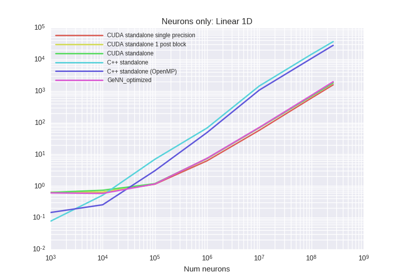


<details><summary>Examplary `nvprof` results for **CUDA-standalone-1-post-block**</summary><p>
Profile summary for `N = 1000`:

```
==27897== NVPROF is profiling process 27897, command: ./main
==27897== Profiling application: ./main
==27897== Profiling result:
            Type  Time(%)      Time     Calls       Avg       Min       Max  Name
 GPU activities:  100.00%  253.70ms    100000  2.5370us  2.4000us  4.2240us  kernel_neurongroup_stateupdater_codeobject(int, int, double*, double*)
      API calls:   89.46%  1.17032s    100000  11.703us  9.7330us  8.3352ms  cudaLaunch
                    6.09%  79.641ms    400000     199ns     132ns  402.07us  cudaSetupArgument
                    2.27%  29.755ms    100000     297ns     212ns  359.90us  cudaGetLastError
                    2.17%  28.355ms    100000     283ns     223ns  16.395us  cudaConfigureCall
                    0.01%  134.12us         1  134.12us  134.12us  134.12us  cudaMemGetInfo
                    0.00%  19.265us         1  19.265us  19.265us  19.265us  cudaDeviceSynchronize
                    0.00%  11.969us         2  5.9840us  3.1180us  8.8510us  cudaFuncGetAttributes
                    0.00%  5.0930us         2  2.5460us     760ns  4.3330us  cudaOccupancyMaxActiveBlocksPerMultiprocessorWithFlags
                    0.00%  3.2440us         4     811ns     429ns  1.8970us  cudaDeviceGetAttribute
                    0.00%  1.8250us         1  1.8250us  1.8250us  1.8250us  cudaGetDevice

```

</p></details>


<details><summary>Examplary `nvprof` results for **CUDA-standalone-single-precision**</summary><p>
Profile summary for `N = 1000`:

```
==27550== NVPROF is profiling process 27550, command: ./main
==27550== Profiling application: ./main
==27550== Profiling result:
            Type  Time(%)      Time     Calls       Avg       Min       Max  Name
 GPU activities:  100.00%  242.20ms    100000  2.4210us  2.2720us  4.0320us  kernel_neurongroup_stateupdater_codeobject(int, int, float*, double*)
      API calls:   89.08%  1.05584s    100000  10.558us  9.7340us  11.726ms  cudaLaunch
                    6.35%  75.314ms    400000     188ns     138ns  340.36us  cudaSetupArgument
                    2.34%  27.694ms    100000     276ns     204ns  327.27us  cudaGetLastError
                    2.22%  26.302ms    100000     263ns     214ns  13.182us  cudaConfigureCall
                    0.01%  132.22us         1  132.22us  132.22us  132.22us  cudaMemGetInfo
                    0.00%  19.468us         1  19.468us  19.468us  19.468us  cudaDeviceSynchronize
                    0.00%  11.939us         2  5.9690us  3.1950us  8.7440us  cudaFuncGetAttributes
                    0.00%  5.0250us         2  2.5120us     809ns  4.2160us  cudaOccupancyMaxActiveBlocksPerMultiprocessorWithFlags
                    0.00%  3.2870us         4     821ns     410ns  1.8630us  cudaDeviceGetAttribute
                    0.00%  1.6460us         1  1.6460us  1.6460us  1.6460us  cudaGetDevice

```

</p></details>


<details><summary>Examplary `nvprof` results for **CUDAStandaloneConfiguration**</summary><p>
Profile summary for `N = 1000`:

```
==28260== NVPROF is profiling process 28260, command: ./main
==28260== Profiling application: ./main
==28260== Profiling result:
            Type  Time(%)      Time     Calls       Avg       Min       Max  Name
 GPU activities:  100.00%  254.32ms    100000  2.5430us  2.4000us  4.0320us  kernel_neurongroup_stateupdater_codeobject(int, int, double*, double*)
      API calls:   89.05%  1.05486s    100000  10.548us  9.5980us  8.3482ms  cudaLaunch
                    6.20%  73.433ms    400000     183ns     137ns  341.06us  cudaSetupArgument
                    2.40%  28.401ms    100000     284ns     207ns  355.02us  cudaGetLastError
                    2.34%  27.728ms    100000     277ns     218ns  13.110us  cudaConfigureCall
                    0.01%  133.79us         1  133.79us  133.79us  133.79us  cudaMemGetInfo
                    0.00%  19.231us         1  19.231us  19.231us  19.231us  cudaDeviceSynchronize
                    0.00%  11.642us         2  5.8210us  3.0780us  8.5640us  cudaFuncGetAttributes
                    0.00%  5.0350us         2  2.5170us     738ns  4.2970us  cudaOccupancyMaxActiveBlocksPerMultiprocessorWithFlags
                    0.00%  2.9950us         4     748ns     372ns  1.7430us  cudaDeviceGetAttribute
                    0.00%  1.6210us         1  1.6210us  1.6210us  1.6210us  cudaGetDevice

```

</p></details>


<details><summary>Examplary `nvprof` results for **GeNNConfigurationOptimized**</summary><p>
Profile summary for `N = 1000`:

```
==28639== NVPROF is profiling process 28639, command: ./main test 10.0 1
==28639== Profiling application: ./main test 10.0 1
==28639== Profiling result:
            Type  Time(%)      Time     Calls       Avg       Min       Max  Name
 GPU activities:   99.98%  228.25ms    100000  2.2820us  2.2400us  2.9120us  calcNeurons
                    0.01%  23.073us        16  1.4420us     992ns  2.0800us  [CUDA memcpy HtoD]
                    0.01%  14.816us         5  2.9630us  2.0480us  4.7040us  [CUDA memcpy DtoH]
      API calls:   70.27%  1.00638s    100000  10.063us  9.5780us  350.65us  cudaLaunch
                   25.50%  365.20ms         4  91.300ms  16.456us  363.61ms  cudaHostAlloc
                    2.53%  36.172ms    100000     361ns     302ns  338.63us  cudaConfigureCall
                    1.59%  22.781ms    100000     227ns     183ns  338.98us  cudaSetupArgument
                    0.04%  620.76us         4  155.19us  14.801us  221.20us  cudaMalloc
                    0.03%  419.33us        23  18.231us     592ns  40.901us  cudaMemcpy
                    0.03%  400.99us        94  4.2650us     155ns  156.21us  cuDeviceGetAttribute
                    0.01%  114.19us         1  114.19us  114.19us  114.19us  cuDeviceTotalMem
                    0.00%  36.745us         1  36.745us  36.745us  36.745us  cuDeviceGetName
                    0.00%  11.892us         1  11.892us  11.892us  11.892us  cudaSetDevice
                    0.00%  10.643us         4  2.6600us  1.0440us  5.8240us  cudaGetSymbolAddress
                    0.00%  3.2890us         3  1.0960us     232ns  2.3960us  cuDeviceGetCount
                    0.00%  1.6580us         1  1.6580us  1.6580us  1.6580us  cudaGetDeviceCount
                    0.00%  1.0910us         2     545ns     262ns     829ns  cuDeviceGet

```

</p></details>


***

### STDP (with Monitor)


<details><summary>Examplary `nvprof` results for **CUDA-standalone-1-post-block**</summary><p>
Profile summary for `N = 1000`:

```
==32608== NVPROF is profiling process 32608, command: ./main
==32608== Profiling application: ./main
==32608== Profiling result:
            Type  Time(%)      Time     Calls       Avg       Min       Max  Name
 GPU activities:   34.29%  119.37ms     10000  11.936us  1.7600us  26.568ms  kernel_spikemonitor_codeobject(int, int*, double, int*, int*, int*, int, int*, double*, int, int*, int*)
                   12.38%  43.093ms     10000  4.3090us  3.8080us  5.8560us  kernel_neurongroup_stateupdater_codeobject(int, int, double*, double*, double*)
                   12.26%  42.686ms      7725  5.5250us  5.1840us  6.9760us  kernel_synapses_pre_codeobject(int, int, int, int, int, int*, int, double*, int, double*, int, double*, int, int*, double*, double, double*, int, int*, int, int*, int)
                    8.00%  27.854ms     10000  2.7850us  2.4960us  6.6240us  kernel_synapses_post_codeobject(int, int, int, int, int, int*, int, double*, int, double*, int, double*, int, double, double*, int, int*, int*, int)
                    7.56%  26.325ms     10000  2.6320us  2.1120us  3.0720us  kernel_poissongroup_thresholder_codeobject(int, int, int*, double*, double*, double*)
                    5.88%  20.473ms     10000  2.0470us  2.0160us  2.5610us  [CUDA memcpy DtoH]
                    5.18%  18.044ms     10000  1.8040us  1.5040us  2.1760us  kernel_neurongroup_resetter_codeobject(int, int, double*, int*)
                    5.13%  17.867ms     10000  1.7860us  1.5360us  2.5280us  kernel_neurongroup_thresholder_codeobject(int, int, int*, double*)
                    4.68%  16.284ms     10000  1.6280us  1.5360us  1.8880us  _GLOBAL__N__69_tmpxft_00007cc4_00000000_6_neurongroup_thresholder_codeobject_cpp1_ii_018c9cf5::_reset_neurongroup_thresholder_codeobject(int*)
                    4.36%  15.192ms     10000  1.5190us  1.3760us  1.9840us  _GLOBAL__N__70_tmpxft_00007ccb_00000000_6_poissongroup_thresholder_codeobject_cpp1_ii_83740b5b::_reset_poissongroup_thresholder_codeobject(int*)
                    0.25%  855.52us         2  427.76us  422.40us  433.12us  void gen_sequenced<curandStateXORWOW, double, int, __operator_&__(double curand_uniform_double_noargs<curandStateXORWOW>(curandStateXORWOW*, int))>(curandStateXORWOW*, double*, unsigned long, unsigned long, int)
                    0.02%  60.064us         1  60.064us  60.064us  60.064us  _run_spikemonitor_codeobject_init(void)
      API calls:   67.52%  965.94ms     87728  11.010us  9.0010us  10.477ms  cudaLaunch
                   20.30%  290.39ms     10000  29.038us  18.879us  26.586ms  cudaMemcpy
                    8.99%  128.63ms    689960     186ns     130ns  407.06us  cudaSetupArgument
                    1.66%  23.812ms     90005     264ns     214ns  353.52us  cudaGetLastError
                    1.49%  21.350ms     87728     243ns     174ns  361.74us  cudaConfigureCall
                    0.02%  256.52us         1  256.52us  256.52us  256.52us  cudaMalloc
                    0.01%  150.94us         1  150.94us  150.94us  150.94us  cudaMemGetInfo
                    0.00%  39.873us        11  3.6240us  2.8610us  6.3580us  cudaFuncGetAttributes
                    0.00%  30.551us        42     727ns     597ns  1.8890us  cudaOccupancyMaxActiveBlocksPerMultiprocessorWithFlags
                    0.00%  7.6190us        16     476ns     344ns  1.2380us  cudaDeviceGetAttribute
                    0.00%  7.5570us         1  7.5570us  7.5570us  7.5570us  cudaDeviceSynchronize
                    0.00%  4.6720us         4  1.1680us     771ns  2.2170us  cudaGetDevice

```

</p></details>


<details><summary>Examplary `nvprof` results for **CUDA-standalone-single-precision**</summary><p>
Profile summary for `N = 1000`:

```
==31624== NVPROF is profiling process 31624, command: ./main
==31624== Profiling application: ./main
==31624== Profiling result:
            Type  Time(%)      Time     Calls       Avg       Min       Max  Name
 GPU activities:   31.01%  117.38ms     10000  11.738us  1.6000us  26.416ms  kernel_spikemonitor_codeobject(int, int*, double, int*, int*, int*, int, int*, double*, int, int*, int*)
                   17.19%  65.056ms      7798  8.3420us  5.3760us  26.016us  kernel_synapses_pre_codeobject(int, int, int, int, int, int*, int, float*, int, double*, int, float*, int, int*, float*, double, float*, int, int*, int, int*, int)
                   11.40%  43.156ms     10000  4.3150us  3.8400us  6.4320us  kernel_neurongroup_stateupdater_codeobject(int, int, float*, float*, double*)
                    9.83%  37.200ms     10000  3.7190us  3.6160us  7.0080us  kernel_synapses_post_codeobject(int, int, int, int, int, int*, int, float*, int, double*, int, float*, int, double, float*, int, int*, int*, int)
                    6.22%  23.554ms     10000  2.3550us  1.7920us  2.7200us  kernel_poissongroup_thresholder_codeobject(int, int, int*, float*, double*, float*)
                    5.44%  20.584ms     10000  2.0580us  2.0160us  2.5280us  [CUDA memcpy DtoH]
                    5.32%  20.149ms     10000  2.0140us  1.9200us  2.7530us  kernel_neurongroup_thresholder_codeobject(int, int, int*, float*)
                    4.83%  18.288ms     10000  1.8280us  1.7280us  2.2080us  kernel_neurongroup_resetter_codeobject(int, int, float*, int*)
                    4.49%  17.013ms     10000  1.7010us  1.6000us  1.9520us  _GLOBAL__N__70_tmpxft_00007903_00000000_6_poissongroup_thresholder_codeobject_cpp1_ii_7c241289::_reset_poissongroup_thresholder_codeobject(int*)
                    4.16%  15.740ms     10000  1.5730us  1.2800us  1.7280us  _GLOBAL__N__69_tmpxft_000078fe_00000000_6_neurongroup_thresholder_codeobject_cpp1_ii_ef82fdd9::_reset_neurongroup_thresholder_codeobject(int*)
                    0.09%  330.95us         1  330.95us  330.95us  330.95us  void gen_sequenced<curandStateXORWOW, float, int, __operator_&__(float curand_uniform_noargs<curandStateXORWOW>(curandStateXORWOW*, int))>(curandStateXORWOW*, float*, unsigned long, unsigned long, int)
                    0.02%  71.968us         1  71.968us  71.968us  71.968us  _run_spikemonitor_codeobject_init(void)
      API calls:   67.03%  949.78ms     87800  10.817us  9.0320us  9.5223ms  cudaLaunch
                   20.34%  288.25ms     10000  28.825us  18.800us  26.435ms  cudaMemcpy
                    9.39%  133.03ms    691561     192ns     129ns  359.91us  cudaSetupArgument
                    1.69%  23.885ms     90003     265ns     200ns  342.97us  cudaGetLastError
                    1.52%  21.592ms     87800     245ns     172ns  357.40us  cudaConfigureCall
                    0.02%  227.59us         1  227.59us  227.59us  227.59us  cudaMalloc
                    0.01%  154.44us         1  154.44us  154.44us  154.44us  cudaMemGetInfo
                    0.00%  43.327us        11  3.9380us  3.0540us  7.8600us  cudaFuncGetAttributes
                    0.00%  33.183us        42     790ns     658ns  1.8570us  cudaOccupancyMaxActiveBlocksPerMultiprocessorWithFlags
                    0.00%  7.8920us         1  7.8920us  7.8920us  7.8920us  cudaDeviceSynchronize
                    0.00%  7.4010us        16     462ns     335ns  1.3020us  cudaDeviceGetAttribute
                    0.00%  5.0140us         4  1.2530us     754ns  2.6330us  cudaGetDevice

```

</p></details>


<details><summary>Examplary `nvprof` results for **CUDAStandaloneConfiguration**</summary><p>
Profile summary for `N = 1000`:

```
==1244== NVPROF is profiling process 1244, command: ./main
==1244== Profiling application: ./main
==1244== Profiling result:
            Type  Time(%)      Time     Calls       Avg       Min       Max  Name
 GPU activities:   31.21%  119.30ms     10000  11.929us  1.6000us  26.588ms  kernel_spikemonitor_codeobject(int, int*, double, int*, int*, int*, int, int*, double*, int, int*, int*)
                   17.53%  67.029ms      7814  8.5780us  5.6640us  23.584us  kernel_synapses_pre_codeobject(int, int, int, int, int, int*, int, double*, int, double*, int, double*, int, int*, double*, double, double*, int, int*, int, int*, int)
                   11.41%  43.636ms     10000  4.3630us  3.9040us  6.2400us  kernel_neurongroup_stateupdater_codeobject(int, int, double*, double*, double*)
                    9.73%  37.183ms     10000  3.7180us  3.6160us  6.3680us  kernel_synapses_post_codeobject(int, int, int, int, int, int*, int, double*, int, double*, int, double*, int, double, double*, int, int*, int*, int)
                    6.84%  26.167ms     10000  2.6160us  2.1440us  2.9760us  kernel_poissongroup_thresholder_codeobject(int, int, int*, double*, double*, double*)
                    5.36%  20.502ms     10000  2.0500us  2.0160us  2.5600us  [CUDA memcpy DtoH]
                    4.84%  18.492ms     10000  1.8490us  1.6960us  2.6560us  kernel_neurongroup_thresholder_codeobject(int, int, int*, double*)
                    4.72%  18.041ms     10000  1.8040us  1.7280us  2.0160us  kernel_neurongroup_resetter_codeobject(int, int, double*, int*)
                    4.24%  16.223ms     10000  1.6220us  1.5040us  1.7600us  _GLOBAL__N__69_tmpxft_00000206_00000000_6_neurongroup_thresholder_codeobject_cpp1_ii_018c9cf5::_reset_neurongroup_thresholder_codeobject(int*)
                    3.87%  14.788ms     10000  1.4780us  1.4080us  1.8240us  _GLOBAL__N__70_tmpxft_00000209_00000000_6_poissongroup_thresholder_codeobject_cpp1_ii_83740b5b::_reset_poissongroup_thresholder_codeobject(int*)
                    0.22%  850.69us         2  425.35us  419.75us  430.95us  void gen_sequenced<curandStateXORWOW, double, int, __operator_&__(double curand_uniform_double_noargs<curandStateXORWOW>(curandStateXORWOW*, int))>(curandStateXORWOW*, double*, unsigned long, unsigned long, int)
                    0.02%  69.984us         1  69.984us  69.984us  69.984us  _run_spikemonitor_codeobject_init(void)
      API calls:   67.58%  940.69ms     87817  10.711us  8.9430us  9.3600ms  cudaLaunch
                   20.70%  288.13ms     10000  28.813us  18.415us  26.610ms  cudaMemcpy
                    8.42%  117.20ms    691918     169ns     135ns  374.99us  cudaSetupArgument
                    1.76%  24.494ms     90005     272ns     216ns  342.15us  cudaGetLastError
                    1.52%  21.110ms     87817     240ns     163ns  367.92us  cudaConfigureCall
                    0.01%  207.23us         1  207.23us  207.23us  207.23us  cudaMalloc
                    0.01%  131.70us         1  131.70us  131.70us  131.70us  cudaMemGetInfo
                    0.00%  40.762us        11  3.7050us  2.8380us  5.8350us  cudaFuncGetAttributes
                    0.00%  30.380us        42     723ns     578ns  2.8660us  cudaOccupancyMaxActiveBlocksPerMultiprocessorWithFlags
                    0.00%  7.3390us         1  7.3390us  7.3390us  7.3390us  cudaDeviceSynchronize
                    0.00%  6.9750us        16     435ns     317ns     908ns  cudaDeviceGetAttribute
                    0.00%  3.8060us         4     951ns     721ns  1.4420us  cudaGetDevice

```

</p></details>


<details><summary>Examplary `nvprof` results for **GeNNConfigurationOptimized**</summary><p>
Profile summary for `N = 1000`:

```
==2134== NVPROF is profiling process 2134, command: ./main test 1.0 1
==2134== Profiling application: ./main test 1.0 1
==2134== Profiling result:
            Type  Time(%)      Time     Calls       Avg       Min       Max  Name
 GPU activities:   43.21%  79.246ms     10000  7.9240us  2.0800us  30.592us  calcSynapses
                   22.32%  40.936ms     10000  4.0930us  3.1360us  6.3040us  calcNeurons
                   19.74%  36.192ms     17706  2.0440us  2.0160us  4.7360us  [CUDA memcpy DtoH]
                   14.68%  26.917ms     10000  2.6910us  2.5280us  9.7920us  learnSynapsesPost
                    0.05%  94.529us        70  1.3500us     960ns  2.0800us  [CUDA memcpy HtoD]
      API calls:   33.36%  328.40ms     30000  10.946us  9.2910us  356.47us  cudaLaunch
                   32.32%  318.16ms        20  15.908ms  17.568us  316.11ms  cudaHostAlloc
                   32.21%  317.07ms     20095  15.778us     534ns  366.98us  cudaMemcpy
                    1.11%  10.900ms     30000     363ns     274ns  384.58us  cudaConfigureCall
                    0.83%  8.2190ms     30000     273ns     179ns  362.54us  cudaSetupArgument
                    0.10%  943.99us        20  47.199us  13.675us  225.82us  cudaMalloc
                    0.04%  399.99us        94  4.2550us     153ns  155.62us  cuDeviceGetAttribute
                    0.01%  123.44us         1  123.44us  123.44us  123.44us  cuDeviceTotalMem
                    0.01%  57.595us         1  57.595us  57.595us  57.595us  cuDeviceGetName
                    0.00%  32.195us        20  1.6090us  1.0930us  5.9820us  cudaGetSymbolAddress
                    0.00%  11.306us         1  11.306us  11.306us  11.306us  cudaSetDevice
                    0.00%  4.2440us         3  1.4140us     236ns  2.6060us  cuDeviceGetCount
                    0.00%  1.6790us         1  1.6790us  1.6790us  1.6790us  cudaGetDeviceCount
                    0.00%  1.3150us         2     657ns     506ns     809ns  cuDeviceGet

```

</p></details>


***

### STDPEventDriven


<details><summary>Examplary `nvprof` results for **CUDA-standalone-1-post-block**</summary><p>
Profile summary for `N = 1000`:

```
==13366== NVPROF is profiling process 13366, command: ./main
==13366== Profiling application: ./main
==13366== Profiling result:
            Type  Time(%)      Time     Calls       Avg       Min       Max  Name
 GPU activities:   18.95%  43.277ms      7718  5.6070us  5.2160us  7.4240us  kernel_synapses_pre_codeobject(int, int, int, int, int, int*, int, double*, int, double*, int, double*, int, int*, double*, double, double*, int, int*, int, int*, int)
                   18.71%  42.728ms     10000  4.2720us  3.8400us  6.1120us  kernel_neurongroup_stateupdater_codeobject(int, int, double*, double*, double*)
                   12.10%  27.632ms     10000  2.7630us  2.4960us  7.5520us  kernel_synapses_post_codeobject(int, int, int, int, int, int*, int, double*, int, double*, int, double*, int, double, double*, int, int*, int*, int)
                   11.44%  26.116ms     10000  2.6110us  2.0800us  2.9120us  kernel_poissongroup_thresholder_codeobject(int, int, int*, double*, double*, double*)
                    8.98%  20.500ms     10000  2.0490us  2.0160us  2.5600us  [CUDA memcpy DtoH]
                    7.71%  17.595ms     10000  1.7590us  1.5040us  2.0480us  kernel_neurongroup_resetter_codeobject(int, int, double*, int*)
                    7.50%  17.115ms     10000  1.7110us  1.6320us  1.9520us  _GLOBAL__N__70_tmpxft_00003278_00000000_6_poissongroup_thresholder_codeobject_cpp1_ii_83740b5b::_reset_poissongroup_thresholder_codeobject(int*)
                    7.13%  16.272ms     10000  1.6270us  1.5360us  2.5280us  kernel_neurongroup_thresholder_codeobject(int, int, int*, double*)
                    7.12%  16.259ms     10000  1.6250us  1.5360us  2.1760us  _GLOBAL__N__69_tmpxft_00003275_00000000_6_neurongroup_thresholder_codeobject_cpp1_ii_018c9cf5::_reset_neurongroup_thresholder_codeobject(int*)
                    0.37%  850.92us         2  425.46us  419.65us  431.27us  void gen_sequenced<curandStateXORWOW, double, int, __operator_&__(double curand_uniform_double_noargs<curandStateXORWOW>(curandStateXORWOW*, int))>(curandStateXORWOW*, double*, unsigned long, unsigned long, int)
      API calls:   70.93%  855.47ms     77720  11.007us  9.0780us  9.6672ms  cudaLaunch
                   17.58%  212.00ms     10000  21.200us  18.638us  410.83us  cudaMemcpy
                    8.08%  97.393ms    569806     170ns     129ns  386.10us  cudaSetupArgument
                    1.74%  21.023ms     80004     262ns     213ns  369.23us  cudaGetLastError
                    1.63%  19.717ms     77720     253ns     182ns  341.29us  cudaConfigureCall
                    0.02%  223.48us         1  223.48us  223.48us  223.48us  cudaMalloc
                    0.01%  131.71us         1  131.71us  131.71us  131.71us  cudaMemGetInfo
                    0.00%  36.055us        10  3.6050us  2.9370us  5.3380us  cudaFuncGetAttributes
                    0.00%  28.348us        41     691ns     581ns  1.9240us  cudaOccupancyMaxActiveBlocksPerMultiprocessorWithFlags
                    0.00%  7.7100us         1  7.7100us  7.7100us  7.7100us  cudaDeviceSynchronize
                    0.00%  7.2250us        16     451ns     352ns     822ns  cudaDeviceGetAttribute
                    0.00%  3.8100us         4     952ns     767ns  1.4090us  cudaGetDevice

```

</p></details>


<details><summary>Examplary `nvprof` results for **CUDA-standalone-single-precision**</summary><p>
Profile summary for `N = 1000`:

```
==12780== NVPROF is profiling process 12780, command: ./main
==12780== Profiling application: ./main
==12780== Profiling result:
            Type  Time(%)      Time     Calls       Avg       Min       Max  Name
 GPU activities:   23.95%  64.416ms      7794  8.2640us  5.4080us  23.424us  kernel_synapses_pre_codeobject(int, int, int, int, int, int*, int, float*, int, double*, int, float*, int, int*, float*, double, float*, int, int*, int, int*, int)
                   17.15%  46.134ms     10000  4.6130us  4.4800us  7.4240us  kernel_synapses_post_codeobject(int, int, int, int, int, int*, int, float*, int, double*, int, float*, int, double, float*, int, int*, int*, int)
                   16.32%  43.903ms     10000  4.3900us  3.9040us  6.6240us  kernel_neurongroup_stateupdater_codeobject(int, int, float*, float*, double*)
                    8.28%  22.282ms     10000  2.2280us  1.8880us  2.7200us  kernel_poissongroup_thresholder_codeobject(int, int, int*, float*, double*, float*)
                    7.71%  20.733ms     10000  2.0730us  1.9520us  2.9760us  kernel_neurongroup_thresholder_codeobject(int, int, int*, float*)
                    7.63%  20.527ms     10000  2.0520us  2.0160us  2.5280us  [CUDA memcpy DtoH]
                    6.70%  18.011ms     10000  1.8010us  1.6640us  2.1120us  kernel_neurongroup_resetter_codeobject(int, int, float*, int*)
                    6.25%  16.807ms     10000  1.6800us  1.6000us  2.2400us  _GLOBAL__N__70_tmpxft_00003028_00000000_6_poissongroup_thresholder_codeobject_cpp1_ii_7c241289::_reset_poissongroup_thresholder_codeobject(int*)
                    5.89%  15.850ms     10000  1.5850us  1.3120us  1.6960us  _GLOBAL__N__69_tmpxft_00003026_00000000_6_neurongroup_thresholder_codeobject_cpp1_ii_ef82fdd9::_reset_neurongroup_thresholder_codeobject(int*)
                    0.12%  329.63us         1  329.63us  329.63us  329.63us  void gen_sequenced<curandStateXORWOW, float, int, __operator_&__(float curand_uniform_noargs<curandStateXORWOW>(curandStateXORWOW*, int))>(curandStateXORWOW*, float*, unsigned long, unsigned long, int)
      API calls:   70.89%  844.84ms     77795  10.859us  8.9610us  9.4878ms  cudaLaunch
                   17.62%  210.03ms     10000  21.003us  18.511us  417.66us  cudaMemcpy
                    8.23%  98.074ms    571473     171ns     132ns  601.13us  cudaSetupArgument
                    1.69%  20.130ms     77795     258ns     180ns  371.55us  cudaConfigureCall
                    1.53%  18.289ms     80002     228ns     180ns  339.87us  cudaGetLastError
                    0.02%  196.25us         1  196.25us  196.25us  196.25us  cudaMalloc
                    0.01%  132.09us         1  132.09us  132.09us  132.09us  cudaMemGetInfo
                    0.00%  37.032us        10  3.7030us  3.0220us  5.8410us  cudaFuncGetAttributes
                    0.00%  28.124us        41     685ns     575ns  1.5580us  cudaOccupancyMaxActiveBlocksPerMultiprocessorWithFlags
                    0.00%  7.7240us         1  7.7240us  7.7240us  7.7240us  cudaDeviceSynchronize
                    0.00%  7.0390us        16     439ns     339ns     875ns  cudaDeviceGetAttribute
                    0.00%  4.1410us         4  1.0350us     732ns  1.6720us  cudaGetDevice

```

</p></details>


<details><summary>Examplary `nvprof` results for **CUDAStandaloneConfiguration**</summary><p>
Profile summary for `N = 1000`:

```
==13964== NVPROF is profiling process 13964, command: ./main
==13964== Profiling application: ./main
==13964== Profiling result:
            Type  Time(%)      Time     Calls       Avg       Min       Max  Name
 GPU activities:   24.77%  67.664ms      7801  8.6730us  5.6010us  24.768us  kernel_synapses_pre_codeobject(int, int, int, int, int, int*, int, double*, int, double*, int, double*, int, int*, double*, double, double*, int, int*, int, int*, int)
                   16.81%  45.907ms     10000  4.5900us  4.5120us  6.9760us  kernel_synapses_post_codeobject(int, int, int, int, int, int*, int, double*, int, double*, int, double*, int, double, double*, int, int*, int*, int)
                   15.64%  42.721ms     10000  4.2720us  3.8400us  6.2080us  kernel_neurongroup_stateupdater_codeobject(int, int, double*, double*, double*)
                    9.58%  26.159ms     10000  2.6150us  2.0800us  3.0080us  kernel_poissongroup_thresholder_codeobject(int, int, int*, double*, double*, double*)
                    7.50%  20.496ms     10000  2.0490us  2.0160us  2.6240us  [CUDA memcpy DtoH]
                    6.71%  18.338ms     10000  1.8330us  1.7600us  2.5600us  kernel_neurongroup_thresholder_codeobject(int, int, int*, double*)
                    6.63%  18.100ms     10000  1.8090us  1.6960us  2.0800us  kernel_neurongroup_resetter_codeobject(int, int, double*, int*)
                    6.09%  16.638ms     10000  1.6630us  1.5360us  1.9520us  _GLOBAL__N__69_tmpxft_000034dd_00000000_6_neurongroup_thresholder_codeobject_cpp1_ii_018c9cf5::_reset_neurongroup_thresholder_codeobject(int*)
                    5.96%  16.282ms     10000  1.6280us  1.4080us  1.8880us  _GLOBAL__N__70_tmpxft_000034df_00000000_6_poissongroup_thresholder_codeobject_cpp1_ii_83740b5b::_reset_poissongroup_thresholder_codeobject(int*)
                    0.31%  852.96us         2  426.48us  420.23us  432.74us  void gen_sequenced<curandStateXORWOW, double, int, __operator_&__(double curand_uniform_double_noargs<curandStateXORWOW>(curandStateXORWOW*, int))>(curandStateXORWOW*, double*, unsigned long, unsigned long, int)
      API calls:   70.82%  849.43ms     77803  10.917us  8.9500us  9.2759ms  cudaLaunch
                   17.61%  211.25ms     10000  21.124us  18.539us  412.66us  cudaMemcpy
                    8.02%  96.177ms    571632     168ns     129ns  367.03us  cudaSetupArgument
                    1.78%  21.297ms     80004     266ns     197ns  366.49us  cudaGetLastError
                    1.74%  20.853ms     77803     268ns     190ns  538.58us  cudaConfigureCall
                    0.02%  206.69us         1  206.69us  206.69us  206.69us  cudaMalloc
                    0.01%  131.83us         1  131.83us  131.83us  131.83us  cudaMemGetInfo
                    0.00%  48.126us        10  4.8120us  2.8880us  15.962us  cudaFuncGetAttributes
                    0.00%  28.801us        41     702ns     565ns  1.8060us  cudaOccupancyMaxActiveBlocksPerMultiprocessorWithFlags
                    0.00%  7.2270us         1  7.2270us  7.2270us  7.2270us  cudaDeviceSynchronize
                    0.00%  6.8920us        16     430ns     343ns     819ns  cudaDeviceGetAttribute
                    0.00%  3.9730us         4     993ns     742ns  1.5350us  cudaGetDevice

```

</p></details>


<details><summary>Examplary `nvprof` results for **GeNNConfigurationOptimized**</summary><p>
Profile summary for `N = 1000`:

```
==14307== NVPROF is profiling process 14307, command: ./main test 1.0 1
==14307== Profiling application: ./main test 1.0 1
==14307== Profiling result:
            Type  Time(%)      Time     Calls       Avg       Min       Max  Name
 GPU activities:   54.90%  81.898ms     10000  8.1890us  2.0800us  30.944us  calcSynapses
                   27.23%  40.615ms     10000  4.0610us  3.1040us  6.5920us  calcNeurons
                   17.77%  26.510ms     10000  2.6510us  2.4960us  9.8240us  learnSynapsesPost
                    0.06%  95.105us        70  1.3580us     960ns  2.2080us  [CUDA memcpy HtoD]
                    0.04%  55.296us        19  2.9100us  2.0160us  4.7360us  [CUDA memcpy DtoH]
      API calls:   51.88%  342.82ms        20  17.141ms  17.608us  340.81ms  cudaHostAlloc
                   44.91%  296.76ms     30000  9.8920us  9.1390us  355.75us  cudaLaunch
                    1.57%  10.375ms     30000     345ns     269ns  332.03us  cudaConfigureCall
                    1.12%  7.3868ms     30000     246ns     197ns  334.11us  cudaSetupArgument
                    0.28%  1.8775ms        95  19.763us     546ns  40.095us  cudaMemcpy
                    0.15%  958.60us        20  47.930us  13.470us  234.16us  cudaMalloc
                    0.06%  398.08us        94  4.2340us     157ns  154.78us  cuDeviceGetAttribute
                    0.02%  113.86us         1  113.86us  113.86us  113.86us  cuDeviceTotalMem
                    0.01%  36.053us         1  36.053us  36.053us  36.053us  cuDeviceGetName
                    0.00%  31.035us        20  1.5510us  1.0330us  6.0390us  cudaGetSymbolAddress
                    0.00%  11.236us         1  11.236us  11.236us  11.236us  cudaSetDevice
                    0.00%  3.0690us         3  1.0230us     192ns  2.3110us  cuDeviceGetCount
                    0.00%  1.5500us         1  1.5500us  1.5500us  1.5500us  cudaGetDeviceCount
                    0.00%  1.1770us         2     588ns     234ns     943ns  cuDeviceGet

```

</p></details>


***

### STDPNotEventDriven
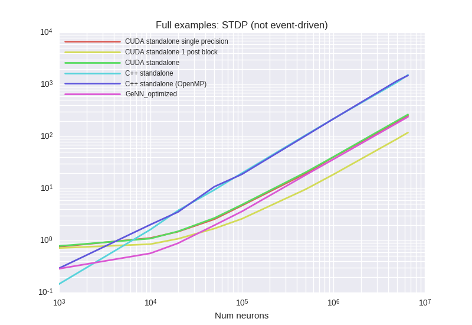
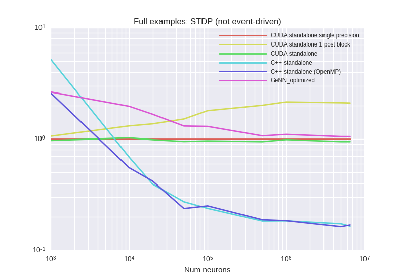

<details><summary>Examplary `nvprof` results for **CUDA-standalone-1-post-block**</summary><p>
Profile summary for `N = 1000`:

```
==7601== NVPROF is profiling process 7601, command: ./main
==7601== Profiling application: ./main
==7601== Profiling result:
            Type  Time(%)      Time     Calls       Avg       Min       Max  Name
 GPU activities:   17.40%  44.141ms     10000  4.4140us  3.9360us  6.2720us  kernel_neurongroup_stateupdater_codeobject(int, int, double*, double*, double*)
                   15.43%  39.127ms      7702  5.0800us  4.7360us  6.8800us  kernel_synapses_pre_codeobject(int, int, int, int, int, int*, int, double*, int, double*, int, int*, double*, double*, int, int*, int, int*, int)
                   11.03%  27.984ms     10000  2.7980us  2.6880us  6.6560us  kernel_synapses_post_codeobject(int, int, int, int, int, int*, int, double*, int, double*, int, int*, double*, int, int*, int)
                   10.44%  26.476ms     10000  2.6470us  2.1760us  3.0720us  kernel_poissongroup_thresholder_codeobject(int, int, int*, double*, double*, double*)
                   10.32%  26.172ms     10000  2.6170us  2.4000us  3.0720us  kernel_synapses_stateupdater_codeobject(int, int, double*, int, double*, int, double*, int*)
                    8.10%  20.555ms     10000  2.0550us  2.0160us  2.6880us  [CUDA memcpy DtoH]
                    7.11%  18.023ms     10000  1.8020us  1.5680us  2.0480us  kernel_neurongroup_resetter_codeobject(int, int, double*, int*)
                    7.02%  17.799ms     10000  1.7790us  1.5360us  2.5600us  kernel_neurongroup_thresholder_codeobject(int, int, int*, double*)
                    6.59%  16.712ms     10000  1.6710us  1.5360us  1.7600us  _GLOBAL__N__70_tmpxft_00001beb_00000000_6_poissongroup_thresholder_codeobject_cpp1_ii_83740b5b::_reset_poissongroup_thresholder_codeobject(int*)
                    6.22%  15.789ms     10000  1.5780us  1.3440us  1.7280us  _GLOBAL__N__69_tmpxft_00001be6_00000000_6_neurongroup_thresholder_codeobject_cpp1_ii_018c9cf5::_reset_neurongroup_thresholder_codeobject(int*)
                    0.34%  853.48us         2  426.74us  420.87us  432.61us  void gen_sequenced<curandStateXORWOW, double, int, __operator_&__(double curand_uniform_double_noargs<curandStateXORWOW>(curandStateXORWOW*, int))>(curandStateXORWOW*, double*, unsigned long, unsigned long, int)
      API calls:   72.56%  951.47ms     87704  10.848us  9.0290us  9.5907ms  cudaLaunch
                   16.46%  215.86ms     10000  21.586us  19.049us  389.20us  cudaMemcpy
                    7.64%  100.16ms    596348     167ns     133ns  372.93us  cudaSetupArgument
                    1.66%  21.774ms     90004     241ns     193ns  340.61us  cudaGetLastError
                    1.64%  21.510ms     87704     245ns     190ns  356.00us  cudaConfigureCall
                    0.02%  223.81us         1  223.81us  223.81us  223.81us  cudaMalloc
                    0.01%  131.62us         1  131.62us  131.62us  131.62us  cudaMemGetInfo
                    0.00%  51.791us        74     699ns     593ns  1.9350us  cudaOccupancyMaxActiveBlocksPerMultiprocessorWithFlags
                    0.00%  43.722us        12  3.6430us  2.9750us  5.5900us  cudaFuncGetAttributes
                    0.00%  8.9400us        20     447ns     352ns     974ns  cudaDeviceGetAttribute
                    0.00%  7.2130us         1  7.2130us  7.2130us  7.2130us  cudaDeviceSynchronize
                    0.00%  4.8830us         5     976ns     733ns  1.6050us  cudaGetDevice

```

</p></details>


<details><summary>Examplary `nvprof` results for **CUDA-standalone-single-precision**</summary><p>
Profile summary for `N = 1000`:

```
==7002== NVPROF is profiling process 7002, command: ./main
==7002== Profiling application: ./main
==7002== Profiling result:
            Type  Time(%)      Time     Calls       Avg       Min       Max  Name
 GPU activities:   21.37%  60.001ms      7774  7.7180us  4.7040us  21.216us  kernel_synapses_pre_codeobject(int, int, int, int, int, int*, int, float*, int, float*, int, int*, float*, float*, int, int*, int, int*, int)
                   15.35%  43.091ms     10000  4.3090us  3.9040us  6.0480us  kernel_neurongroup_stateupdater_codeobject(int, int, float*, float*, double*)
                   13.23%  37.156ms     10000  3.7150us  3.6160us  6.1440us  kernel_synapses_post_codeobject(int, int, int, int, int, int*, int, float*, int, float*, int, int*, float*, int, int*, int)
                    9.01%  25.290ms     10000  2.5280us  2.4320us  2.8800us  kernel_synapses_stateupdater_codeobject(int, int, float*, int, float*, int, double*, int*)
                    8.37%  23.492ms     10000  2.3490us  1.8880us  2.6560us  kernel_poissongroup_thresholder_codeobject(int, int, int*, float*, double*, float*)
                    7.35%  20.635ms     10000  2.0630us  2.0160us  2.7200us  [CUDA memcpy DtoH]
                    7.21%  20.237ms     10000  2.0230us  1.9520us  2.7520us  kernel_neurongroup_thresholder_codeobject(int, int, int*, float*)
                    6.43%  18.053ms     10000  1.8050us  1.7280us  2.0800us  kernel_neurongroup_resetter_codeobject(int, int, float*, int*)
                    5.95%  16.713ms     10000  1.6710us  1.6000us  1.7600us  _GLOBAL__N__70_tmpxft_00001995_00000000_6_poissongroup_thresholder_codeobject_cpp1_ii_7c241289::_reset_poissongroup_thresholder_codeobject(int*)
                    5.61%  15.749ms     10000  1.5740us  1.3440us  1.6960us  _GLOBAL__N__69_tmpxft_00001990_00000000_6_neurongroup_thresholder_codeobject_cpp1_ii_ef82fdd9::_reset_neurongroup_thresholder_codeobject(int*)
                    0.12%  329.38us         1  329.38us  329.38us  329.38us  void gen_sequenced<curandStateXORWOW, float, int, __operator_&__(float curand_uniform_noargs<curandStateXORWOW>(curandStateXORWOW*, int))>(curandStateXORWOW*, float*, unsigned long, unsigned long, int)
      API calls:   72.65%  959.82ms     87775  10.934us  9.1980us  9.5300ms  cudaLaunch
                   16.12%  213.02ms     10000  21.302us  18.697us  412.47us  cudaMemcpy
                    7.76%  102.55ms    597711     171ns     134ns  387.22us  cudaSetupArgument
                    1.73%  22.862ms     90002     254ns     192ns  380.84us  cudaGetLastError
                    1.70%  22.475ms     87775     256ns     182ns  386.66us  cudaConfigureCall
                    0.02%  200.36us         1  200.36us  200.36us  200.36us  cudaMalloc
                    0.01%  129.96us         1  129.96us  129.96us  129.96us  cudaMemGetInfo
                    0.00%  52.887us        74     714ns     607ns  1.5980us  cudaOccupancyMaxActiveBlocksPerMultiprocessorWithFlags
                    0.00%  43.109us        12  3.5920us  2.9280us  5.2450us  cudaFuncGetAttributes
                    0.00%  8.2960us        20     414ns     325ns     901ns  cudaDeviceGetAttribute
                    0.00%  7.8050us         1  7.8050us  7.8050us  7.8050us  cudaDeviceSynchronize
                    0.00%  4.4400us         5     888ns     721ns  1.3300us  cudaGetDevice

```

</p></details>


<details><summary>Examplary `nvprof` results for **CUDAStandaloneConfiguration**</summary><p>
Profile summary for `N = 1000`:

```
==8184== NVPROF is profiling process 8184, command: ./main
==8184== Profiling application: ./main
==8184== Profiling result:
            Type  Time(%)      Time     Calls       Avg       Min       Max  Name
 GPU activities:   21.90%  62.086ms      7792  7.9670us  5.2800us  22.560us  kernel_synapses_pre_codeobject(int, int, int, int, int, int*, int, double*, int, double*, int, int*, double*, double*, int, int*, int, int*, int)
                   15.11%  42.848ms     10000  4.2840us  3.8080us  6.1440us  kernel_neurongroup_stateupdater_codeobject(int, int, double*, double*, double*)
                   13.26%  37.585ms     10000  3.7580us  3.6800us  6.0480us  kernel_synapses_post_codeobject(int, int, int, int, int, int*, int, double*, int, double*, int, int*, double*, int, int*, int)
                    9.50%  26.932ms     10000  2.6930us  2.4640us  3.2640us  kernel_synapses_stateupdater_codeobject(int, int, double*, int, double*, int, double*, int*)
                    9.22%  26.151ms     10000  2.6150us  2.1120us  3.0400us  kernel_poissongroup_thresholder_codeobject(int, int, int*, double*, double*, double*)
                    7.23%  20.510ms     10000  2.0500us  2.0160us  2.6240us  [CUDA memcpy DtoH]
                    6.37%  18.064ms     10000  1.8060us  1.5680us  2.0480us  kernel_neurongroup_resetter_codeobject(int, int, double*, int*)
                    6.19%  17.542ms     10000  1.7540us  1.5360us  2.5920us  kernel_neurongroup_thresholder_codeobject(int, int, int*, double*)
                    5.71%  16.177ms     10000  1.6170us  1.5360us  1.7280us  _GLOBAL__N__69_tmpxft_00001e3f_00000000_6_neurongroup_thresholder_codeobject_cpp1_ii_018c9cf5::_reset_neurongroup_thresholder_codeobject(int*)
                    5.21%  14.768ms     10000  1.4760us  1.4080us  1.7600us  _GLOBAL__N__70_tmpxft_00001e41_00000000_6_poissongroup_thresholder_codeobject_cpp1_ii_83740b5b::_reset_poissongroup_thresholder_codeobject(int*)
                    0.30%  852.42us         2  426.21us  420.00us  432.42us  void gen_sequenced<curandStateXORWOW, double, int, __operator_&__(double curand_uniform_double_noargs<curandStateXORWOW>(curandStateXORWOW*, int))>(curandStateXORWOW*, double*, unsigned long, unsigned long, int)
      API calls:   72.44%  936.95ms     87794  10.672us  8.8690us  9.3133ms  cudaLaunch
                   16.26%  210.26ms     10000  21.025us  18.392us  398.70us  cudaMemcpy
                    7.98%  103.17ms    598058     172ns     129ns  388.01us  cudaSetupArgument
                    1.72%  22.276ms     90004     247ns     199ns  334.28us  cudaGetLastError
                    1.56%  20.205ms     87794     230ns     178ns  308.06us  cudaConfigureCall
                    0.02%  214.24us         1  214.24us  214.24us  214.24us  cudaMalloc
                    0.01%  143.45us         1  143.45us  143.45us  143.45us  cudaMemGetInfo
                    0.00%  51.808us        74     700ns     613ns  1.5860us  cudaOccupancyMaxActiveBlocksPerMultiprocessorWithFlags
                    0.00%  42.173us        12  3.5140us  2.9630us  5.2700us  cudaFuncGetAttributes
                    0.00%  8.4150us        20     420ns     334ns     777ns  cudaDeviceGetAttribute
                    0.00%  7.4920us         1  7.4920us  7.4920us  7.4920us  cudaDeviceSynchronize
                    0.00%  4.7500us         5     950ns     716ns  1.5530us  cudaGetDevice

```

</p></details>


<details><summary>Examplary `nvprof` results for **GeNNConfigurationOptimized**</summary><p>
Profile summary for `N = 1000`:

```
==8563== NVPROF is profiling process 8563, command: ./main test 1.0 1
==8563== Profiling application: ./main test 1.0 1
==8563== Profiling result:
            Type  Time(%)      Time     Calls       Avg       Min       Max  Name
 GPU activities:   36.52%  57.406ms     10000  5.7400us  1.8560us  16.288us  calcSynapses
                   25.51%  40.106ms     10000  4.0100us  3.1040us  5.9520us  calcNeurons
                   21.88%  34.392ms     10000  3.4390us  3.0720us  5.6640us  calcSynapseDynamics
                   15.99%  25.132ms     10000  2.5130us  2.3680us  6.8800us  learnSynapsesPost
                    0.06%  96.896us        72  1.3450us     960ns  2.1120us  [CUDA memcpy HtoD]
                    0.04%  55.456us        19  2.9180us  2.0160us  4.8320us  [CUDA memcpy DtoH]
      API calls:   50.57%  392.15ms     40000  9.8030us  9.1090us  359.96us  cudaLaunch
                   46.12%  357.67ms        21  17.032ms  9.7210us  356.30ms  cudaHostAlloc
                    1.68%  13.005ms     40000     325ns     254ns  334.32us  cudaConfigureCall
                    1.22%  9.4633ms     40000     236ns     186ns  338.67us  cudaSetupArgument
                    0.24%  1.8922ms        97  19.507us     518ns  37.767us  cudaMemcpy
                    0.09%  715.42us        21  34.067us  6.7420us  157.57us  cudaMalloc
                    0.05%  399.31us        94  4.2470us     158ns  155.23us  cuDeviceGetAttribute
                    0.01%  114.10us         1  114.10us  114.10us  114.10us  cuDeviceTotalMem
                    0.00%  36.478us         1  36.478us  36.478us  36.478us  cuDeviceGetName
                    0.00%  24.263us        21  1.1550us     581ns  3.3380us  cudaGetSymbolAddress
                    0.00%  9.4890us         1  9.4890us  9.4890us  9.4890us  cudaSetDevice
                    0.00%  3.3460us         3  1.1150us     232ns  2.4030us  cuDeviceGetCount
                    0.00%  1.5290us         1  1.5290us  1.5290us  1.5290us  cudaGetDeviceCount
                    0.00%     996ns         2     498ns     232ns     764ns  cuDeviceGet

```

</p></details>


***

### SparseHighRateSynapsesOnly

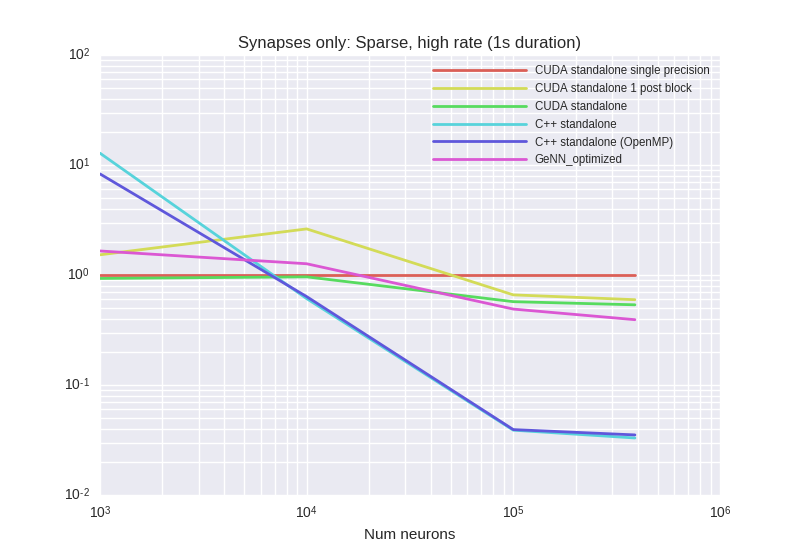

<details><summary>Examplary `nvprof` results for **CUDA-standalone-1-post-block**</summary><p>
Profile summary for `N = 1000`:

```
==8050== NVPROF is profiling process 8050, command: ./main
==8050== Profiling application: ./main
==8050== Profiling result:
            Type  Time(%)      Time     Calls       Avg       Min       Max  Name
 GPU activities:   65.49%  98.850ms     10000  9.8840us  9.3760us  10.752us  kernel_synapses_pre_codeobject(int, int, int, int, int, int*, int, int*, int, int*, int, double*, int*)
                   13.60%  20.529ms     10000  2.0520us  2.0160us  2.5600us  [CUDA memcpy DtoH]
                   11.48%  17.329ms     10000  1.7320us  1.6320us  2.0480us  kernel_neurongroup_thresholder_codeobject(int, int, int*)
                    9.42%  14.223ms     10000  1.4220us  1.2800us  1.8880us  _GLOBAL__N__69_tmpxft_00001e58_00000000_6_neurongroup_thresholder_codeobject_cpp1_ii_e0a5624b::_reset_neurongroup_thresholder_codeobject(int*)
      API calls:   58.37%  342.22ms     30000  11.407us  9.6400us  8.8931ms  cudaLaunch
                   33.85%  198.46ms     10000  19.845us  17.986us  40.473us  cudaMemcpy
                    5.06%  29.694ms    170000     174ns     129ns  318.48us  cudaSetupArgument
                    1.42%  8.3011ms     30000     276ns     190ns  5.7500us  cudaConfigureCall
                    1.27%  7.4342ms     30000     247ns     198ns  14.162us  cudaGetLastError
                    0.02%  129.98us         1  129.98us  129.98us  129.98us  cudaMemGetInfo
                    0.00%  12.776us         1  12.776us  12.776us  12.776us  cudaDeviceSynchronize
                    0.00%  11.018us         3  3.6720us  2.9280us  4.4010us  cudaFuncGetAttributes
                    0.00%  6.1510us         3  2.0500us     695ns  3.5970us  cudaOccupancyMaxActiveBlocksPerMultiprocessorWithFlags
                    0.00%  2.0670us         4     516ns     395ns     803ns  cudaDeviceGetAttribute
                    0.00%  1.0730us         1  1.0730us  1.0730us  1.0730us  cudaGetDevice

```

</p></details>


<details><summary>Examplary `nvprof` results for **CUDA-standalone-single-precision**</summary><p>
Profile summary for `N = 1000`:

```
==7675== NVPROF is profiling process 7675, command: ./main
==7675== Profiling application: ./main
==7675== Profiling result:
            Type  Time(%)      Time     Calls       Avg       Min       Max  Name
 GPU activities:   89.82%  440.38ms     10000  44.038us  42.272us  47.616us  kernel_synapses_pre_codeobject(int, int, int, int, int, int*, int, int*, int, int*, int, float*, int*)
                    4.08%  20.021ms     10000  2.0020us  1.9520us  2.6560us  [CUDA memcpy DtoH]
                    3.34%  16.399ms     10000  1.6390us  1.5040us  2.2400us  kernel_neurongroup_thresholder_codeobject(int, int, int*)
                    2.75%  13.492ms     10000  1.3490us  1.1840us  2.1440us  _GLOBAL__N__69_tmpxft_00001caf_00000000_6_neurongroup_thresholder_codeobject_cpp1_ii_e0a5624b::_reset_neurongroup_thresholder_codeobject(int*)
      API calls:   51.34%  426.36ms     10000  42.636us  20.182us  66.118us  cudaMemcpy
                   42.85%  355.84ms     30000  11.861us  9.8180us  10.720ms  cudaLaunch
                    3.66%  30.399ms    170000     178ns     128ns  325.85us  cudaSetupArgument
                    1.11%  9.1900ms     30000     306ns     203ns  11.586us  cudaConfigureCall
                    1.03%  8.5295ms     30000     284ns     232ns  15.775us  cudaGetLastError
                    0.02%  131.54us         1  131.54us  131.54us  131.54us  cudaMemGetInfo
                    0.01%  45.772us         1  45.772us  45.772us  45.772us  cudaDeviceSynchronize
                    0.00%  11.584us         3  3.8610us  3.1630us  4.4850us  cudaFuncGetAttributes
                    0.00%  6.2370us         3  2.0790us     748ns  3.6410us  cudaOccupancyMaxActiveBlocksPerMultiprocessorWithFlags
                    0.00%  2.1120us         4     528ns     366ns     861ns  cudaDeviceGetAttribute
                    0.00%  1.0840us         1  1.0840us  1.0840us  1.0840us  cudaGetDevice

```

</p></details>


<details><summary>Examplary `nvprof` results for **CUDAStandaloneConfiguration**</summary><p>
Profile summary for `N = 1000`:

```
==8451== NVPROF is profiling process 8451, command: ./main
==8451== Profiling application: ./main
==8451== Profiling result:
            Type  Time(%)      Time     Calls       Avg       Min       Max  Name
 GPU activities:   90.22%  455.84ms     10000  45.583us  43.648us  50.081us  kernel_synapses_pre_codeobject(int, int, int, int, int, int*, int, int*, int, int*, int, double*, int*)
                    3.93%  19.866ms     10000  1.9860us  1.9200us  2.5280us  [CUDA memcpy DtoH]
                    3.21%  16.233ms     10000  1.6230us  1.4720us  2.0480us  kernel_neurongroup_thresholder_codeobject(int, int, int*)
                    2.64%  13.336ms     10000  1.3330us  1.1840us  2.0480us  _GLOBAL__N__69_tmpxft_00001fca_00000000_6_neurongroup_thresholder_codeobject_cpp1_ii_e0a5624b::_reset_neurongroup_thresholder_codeobject(int*)
      API calls:   52.39%  442.80ms     10000  44.279us  20.464us  66.856us  cudaMemcpy
                   42.01%  355.06ms     30000  11.835us  9.5650us  8.7974ms  cudaLaunch
                    3.65%  30.861ms    170000     181ns     134ns  348.68us  cudaSetupArgument
                    1.04%  8.7672ms     30000     292ns     208ns  13.683us  cudaConfigureCall
                    0.89%  7.5009ms     30000     250ns     197ns  21.036us  cudaGetLastError
                    0.02%  144.65us         1  144.65us  144.65us  144.65us  cudaMemGetInfo
                    0.01%  48.662us         1  48.662us  48.662us  48.662us  cudaDeviceSynchronize
                    0.00%  11.429us         3  3.8090us  2.9930us  4.7290us  cudaFuncGetAttributes
                    0.00%  6.2540us         3  2.0840us     765ns  3.6450us  cudaOccupancyMaxActiveBlocksPerMultiprocessorWithFlags
                    0.00%  2.0640us         4     516ns     388ns     835ns  cudaDeviceGetAttribute
                    0.00%  1.1920us         1  1.1920us  1.1920us  1.1920us  cudaGetDevice

```

</p></details>


<details><summary>Examplary `nvprof` results for **GeNNConfigurationOptimized**</summary><p>
Profile summary for `N = 1000`:

```
==8773== NVPROF is profiling process 8773, command: ./main test 1.0 1
==8773== Profiling application: ./main test 1.0 1
==8773== Profiling result:
            Type  Time(%)      Time     Calls       Avg       Min       Max  Name
 GPU activities:   90.93%  298.47ms     10000  29.846us  3.9680us  33.504us  calcSynapses
                    9.04%  29.666ms     10000  2.9660us  2.8160us  4.6400us  calcNeurons
                    0.02%  61.697us        44  1.4020us     960ns  3.1680us  [CUDA memcpy HtoD]
                    0.01%  39.392us        14  2.8130us  1.9520us  6.7200us  [CUDA memcpy DtoH]
      API calls:   57.96%  507.55ms        12  42.296ms  18.495us  505.72ms  cudaHostAlloc
                   37.98%  332.63ms     20000  16.631us  9.4950us  340.48us  cudaLaunch
                    2.40%  20.991ms        61  344.12us     590ns  19.750ms  cudaMemcpy
                    0.89%  7.7856ms     20000     389ns     290ns  320.27us  cudaConfigureCall
                    0.61%  5.3410ms     20000     267ns     204ns  323.43us  cudaSetupArgument
                    0.10%  835.68us        12  69.639us  13.641us  233.85us  cudaMalloc
                    0.05%  400.49us        94  4.2600us     160ns  154.65us  cuDeviceGetAttribute
                    0.01%  124.58us         1  124.58us  124.58us  124.58us  cuDeviceTotalMem
                    0.01%  57.286us         1  57.286us  57.286us  57.286us  cuDeviceGetName
                    0.00%  21.244us        12  1.7700us  1.0260us  5.7820us  cudaGetSymbolAddress
                    0.00%  9.5620us         1  9.5620us  9.5620us  9.5620us  cudaSetDevice
                    0.00%  3.7810us         3  1.2600us     213ns  2.3160us  cuDeviceGetCount
                    0.00%  1.6170us         1  1.6170us  1.6170us  1.6170us  cudaGetDeviceCount
                    0.00%  1.3080us         2     654ns     486ns     822ns  cuDeviceGet

```

</p></details>


***

### SparseLowRateSynapsesOnly
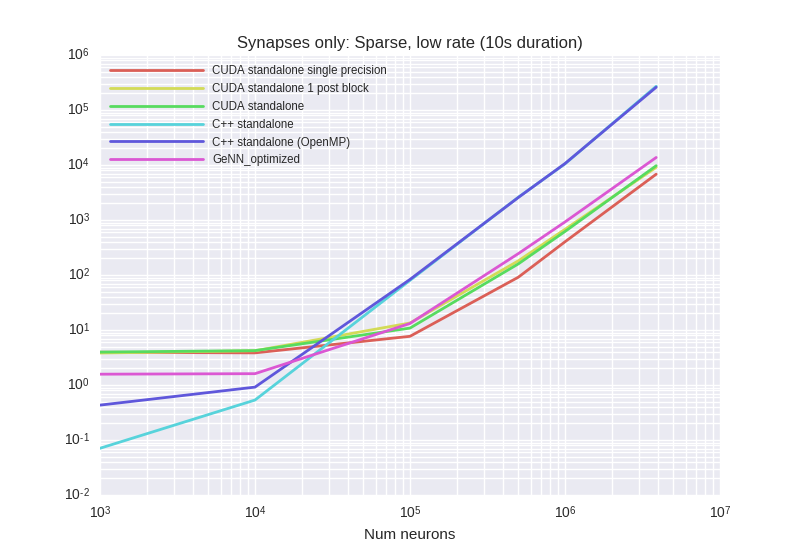


<details><summary>Examplary `nvprof` results for **CUDA-standalone-1-post-block**</summary><p>
Profile summary for `N = 1000`:

```
==967== NVPROF is profiling process 967, command: ./main
==967== Profiling application: ./main
==967== Profiling result:
            Type  Time(%)      Time     Calls       Avg       Min       Max  Name
 GPU activities:   51.08%  546.69ms    100000  5.4660us  5.2160us  7.5200us  kernel_synapses_pre_codeobject(int, int, int, int, int, int*, int, int*, int, int*, int, double*, int*)
                   19.19%  205.38ms    100000  2.0530us  2.0160us  4.3520us  [CUDA memcpy DtoH]
                   16.30%  174.46ms    100000  1.7440us  1.6320us  2.4320us  kernel_neurongroup_thresholder_codeobject(int, int, int*)
                   13.43%  143.69ms    100000  1.4360us  1.3120us  2.4640us  _GLOBAL__N__69_tmpxft_0000028f_00000000_6_neurongroup_thresholder_codeobject_cpp1_ii_e0a5624b::_reset_neurongroup_thresholder_codeobject(int*)
      API calls:   57.70%  3.40295s    300000  11.343us  9.0400us  8.9048ms  cudaLaunch
                   34.46%  2.03224s    100000  20.322us  17.258us  22.417ms  cudaMemcpy
                    5.16%  304.43ms   1700000     179ns     120ns  442.25us  cudaSetupArgument
                    1.43%  84.238ms    300000     280ns     169ns  18.133us  cudaConfigureCall
                    1.25%  73.920ms    300000     246ns     179ns  64.925us  cudaGetLastError
                    0.00%  134.17us         1  134.17us  134.17us  134.17us  cudaMemGetInfo
                    0.00%  11.108us         3  3.7020us  2.9310us  4.5010us  cudaFuncGetAttributes
                    0.00%  8.0270us         1  8.0270us  8.0270us  8.0270us  cudaDeviceSynchronize
                    0.00%  5.5560us         3  1.8520us     723ns  3.0780us  cudaOccupancyMaxActiveBlocksPerMultiprocessorWithFlags
                    0.00%  2.0950us         4     523ns     392ns     896ns  cudaDeviceGetAttribute
                    0.00%  1.1610us         1  1.1610us  1.1610us  1.1610us  cudaGetDevice

```

</p></details>


<details><summary>Examplary `nvprof` results for **CUDA-standalone-single-precision**</summary><p>
Profile summary for `N = 1000`:

```
==381== NVPROF is profiling process 381, command: ./main
==381== Profiling application: ./main
==381== Profiling result:
            Type  Time(%)      Time     Calls       Avg       Min       Max  Name
 GPU activities:   58.11%  721.94ms    100000  7.2190us  6.4640us  7.7760us  kernel_synapses_pre_codeobject(int, int, int, int, int, int*, int, int*, int, int*, int, float*, int*)
                   16.50%  204.99ms    100000  2.0490us  1.9850us  4.3520us  [CUDA memcpy DtoH]
                   14.00%  173.93ms    100000  1.7390us  1.6000us  2.4960us  kernel_neurongroup_thresholder_codeobject(int, int, int*)
                   11.39%  141.47ms    100000  1.4140us  1.2800us  1.9200us  _GLOBAL__N__69_tmpxft_00007edd_00000000_6_neurongroup_thresholder_codeobject_cpp1_ii_e0a5624b::_reset_neurongroup_thresholder_codeobject(int*)
      API calls:   58.12%  3.40058s    300000  11.335us  9.2430us  15.597ms  cudaLaunch
                   33.98%  1.98805s    100000  19.880us  17.170us  23.110ms  cudaMemcpy
                    5.21%  304.53ms   1700000     179ns     128ns  346.69us  cudaSetupArgument
                    1.39%  81.580ms    300000     271ns     179ns  15.419us  cudaConfigureCall
                    1.30%  75.853ms    300000     252ns     196ns  15.690us  cudaGetLastError
                    0.00%  130.58us         1  130.58us  130.58us  130.58us  cudaMemGetInfo
                    0.00%  11.547us         3  3.8490us  3.0920us  4.5160us  cudaFuncGetAttributes
                    0.00%  10.113us         1  10.113us  10.113us  10.113us  cudaDeviceSynchronize
                    0.00%  5.7000us         3  1.9000us     691ns  3.0930us  cudaOccupancyMaxActiveBlocksPerMultiprocessorWithFlags
                    0.00%  2.0800us         4     520ns     383ns     887ns  cudaDeviceGetAttribute
                    0.00%  1.0760us         1  1.0760us  1.0760us  1.0760us  cudaGetDevice

```

</p></details>


<details><summary>Examplary `nvprof` results for **CUDAStandaloneConfiguration**</summary><p>
Profile summary for `N = 1000`:

```
==1548== NVPROF is profiling process 1548, command: ./main
==1548== Profiling application: ./main
==1548== Profiling result:
            Type  Time(%)      Time     Calls       Avg       Min       Max  Name
 GPU activities:   60.39%  795.54ms    100000  7.9550us  7.1360us  8.6720us  kernel_synapses_pre_codeobject(int, int, int, int, int, int*, int, int*, int, int*, int, double*, int*)
                   15.57%  205.08ms    100000  2.0500us  2.0160us  4.3520us  [CUDA memcpy DtoH]
                   13.26%  174.76ms    100000  1.7470us  1.6320us  2.4320us  kernel_neurongroup_thresholder_codeobject(int, int, int*)
                   10.78%  142.05ms    100000  1.4200us  1.2800us  2.3360us  _GLOBAL__N__69_tmpxft_000004d7_00000000_6_neurongroup_thresholder_codeobject_cpp1_ii_e0a5624b::_reset_neurongroup_thresholder_codeobject(int*)
      API calls:   57.59%  3.31552s    300000  11.051us  9.0100us  9.0973ms  cudaLaunch
                   34.51%  1.98667s    100000  19.866us  17.066us  22.495ms  cudaMemcpy
                    5.22%  300.28ms   1700000     176ns     123ns  355.78us  cudaSetupArgument
                    1.37%  78.804ms    300000     262ns     202ns  25.686us  cudaGetLastError
                    1.32%  75.841ms    300000     252ns     160ns  27.073us  cudaConfigureCall
                    0.00%  132.53us         1  132.53us  132.53us  132.53us  cudaMemGetInfo
                    0.00%  11.408us         3  3.8020us  3.0370us  4.6000us  cudaFuncGetAttributes
                    0.00%  9.9080us         1  9.9080us  9.9080us  9.9080us  cudaDeviceSynchronize
                    0.00%  5.6990us         3  1.8990us     782ns  3.2020us  cudaOccupancyMaxActiveBlocksPerMultiprocessorWithFlags
                    0.00%  1.9620us         4     490ns     340ns     861ns  cudaDeviceGetAttribute
                    0.00%  1.1060us         1  1.1060us  1.1060us  1.1060us  cudaGetDevice

```

</p></details>


<details><summary>Examplary `nvprof` results for **GeNNConfigurationOptimized**</summary><p>
Profile summary for `N = 1000`:

```
==2073== NVPROF is profiling process 2073, command: ./main test 10.0 1
==2073== Profiling application: ./main test 10.0 1
==2073== Profiling result:
            Type  Time(%)      Time     Calls       Avg       Min       Max  Name
 GPU activities:   66.42%  601.50ms    100000  6.0150us  3.7440us  6.4640us  calcSynapses
                   33.57%  303.97ms    100000  3.0390us  2.9760us  3.5200us  calcNeurons
                    0.01%  54.464us        44  1.2370us     960ns  2.0480us  [CUDA memcpy HtoD]
                    0.00%  35.969us        14  2.5690us  2.0160us  4.7040us  [CUDA memcpy DtoH]
      API calls:   79.01%  1.93833s    200000  9.6910us  8.5060us  371.68us  cudaLaunch
                   16.15%  396.14ms        12  33.012ms  9.6890us  394.96ms  cudaHostAlloc
                    2.82%  69.118ms    200000     345ns     256ns  351.37us  cudaConfigureCall
                    1.94%  47.695ms    200000     238ns     171ns  360.78us  cudaSetupArgument
                    0.04%  870.97us        61  14.278us     544ns  37.757us  cudaMemcpy
                    0.02%  542.81us        12  45.234us  6.8860us  158.76us  cudaMalloc
                    0.02%  395.92us        94  4.2110us     156ns  154.40us  cuDeviceGetAttribute
                    0.00%  112.67us         1  112.67us  112.67us  112.67us  cuDeviceTotalMem
                    0.00%  36.992us         1  36.992us  36.992us  36.992us  cuDeviceGetName
                    0.00%  12.478us        12  1.0390us     606ns  3.3390us  cudaGetSymbolAddress
                    0.00%  9.3880us         1  9.3880us  9.3880us  9.3880us  cudaSetDevice
                    0.00%  3.0320us         3  1.0100us     204ns  2.2940us  cuDeviceGetCount
                    0.00%  1.5970us         1  1.5970us  1.5970us  1.5970us  cudaGetDeviceCount
                    0.00%  1.1560us         2     578ns     262ns     894ns  cuDeviceGet

```

</p></details>


***

### SparseLowRateSynapsesOnlyHeterogeneousDelays
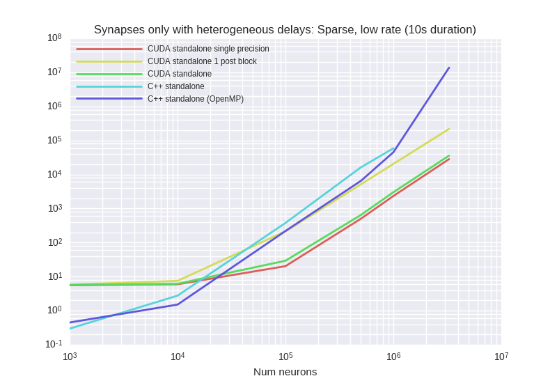
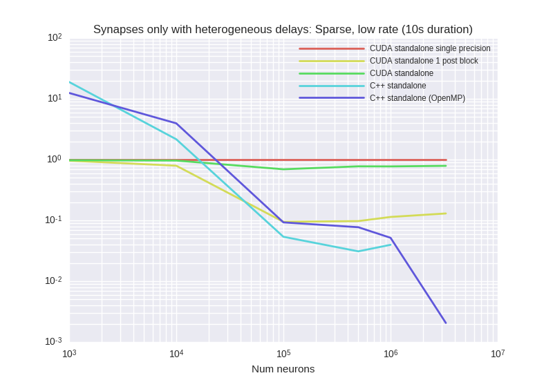

<details><summary>Examplary `nvprof` results for **CUDA-standalone-1-post-block**</summary><p>
Profile summary for `N = 1000`:

```
==19155== NVPROF is profiling process 19155, command: ./main
==19155== Profiling application: ./main
==19155== Profiling result:
            Type  Time(%)      Time     Calls       Avg       Min       Max  Name
 GPU activities:   38.14%  885.77ms    100000  8.8570us  8.4800us  234.72us  _run_synapses_pre_push_spikes_push_kernel(int, int, int, int*)
                   27.67%  642.57ms    100000  6.4250us  5.5680us  9.6000us  kernel_synapses_pre_codeobject(int, int, int, int, int, int*, int, int*, int, int*, int, double*, int*)
                   11.63%  270.19ms    100000  2.7010us  2.6560us  3.5200us  _run_synapses_pre_push_spikes_advance_kernel(void)
                    8.87%  205.91ms    100000  2.0590us  2.0160us  4.3200us  [CUDA memcpy DtoH]
                    7.49%  174.02ms    100000  1.7400us  1.6320us  2.4320us  kernel_neurongroup_thresholder_codeobject(int, int, int*)
                    6.19%  143.84ms    100000  1.4380us  1.3760us  2.1440us  _GLOBAL__N__69_tmpxft_00004944_00000000_6_neurongroup_thresholder_codeobject_cpp1_ii_e0a5624b::_reset_neurongroup_thresholder_codeobject(int*)
      API calls:   66.97%  5.38198s    500000  10.763us  8.9270us  9.3356ms  cudaLaunch
                   25.73%  2.06808s    100000  20.680us  17.836us  23.073ms  cudaMemcpy
                    4.34%  348.50ms   2100000     165ns     120ns  334.79us  cudaSetupArgument
                    1.50%  120.25ms    500000     240ns     163ns  14.390us  cudaConfigureCall
                    1.47%  118.00ms    500000     235ns     161ns  14.665us  cudaGetLastError
                    0.00%  145.39us         1  145.39us  145.39us  145.39us  cudaMemGetInfo
                    0.00%  14.874us         4  3.7180us  2.9050us  4.6380us  cudaFuncGetAttributes
                    0.00%  10.681us         1  10.681us  10.681us  10.681us  cudaDeviceSynchronize
                    0.00%  5.6750us         4  1.4180us     736ns  1.9900us  cudaOccupancyMaxActiveBlocksPerMultiprocessorWithFlags
                    0.00%  1.8280us         4     457ns     353ns     737ns  cudaDeviceGetAttribute
                    0.00%  1.2200us         1  1.2200us  1.2200us  1.2200us  cudaGetDevice

```

</p></details>


<details><summary>Examplary `nvprof` results for **CUDA-standalone-single-precision**</summary><p>
Profile summary for `N = 1000`:

```
==18255== NVPROF is profiling process 18255, command: ./main
==18255== Profiling application: ./main
==18255== Profiling result:
            Type  Time(%)      Time     Calls       Avg       Min       Max  Name
 GPU activities:   36.49%  769.17ms    100000  7.6910us  7.4560us  421.79us  _run_synapses_pre_push_spikes_push_kernel(int, int, int, int*)
                   24.29%  512.09ms    100000  5.1200us  4.7360us  7.7760us  kernel_synapses_pre_codeobject(int, int, int, int, int, int*, int, int*, int, int*, int, float*, int*)
                   13.72%  289.31ms    100000  2.8930us  2.6880us  4.1280us  _run_synapses_pre_push_spikes_advance_kernel(void)
                    9.76%  205.72ms    100000  2.0570us  2.0160us  4.5440us  [CUDA memcpy DtoH]
                    8.26%  174.19ms    100000  1.7410us  1.6000us  2.4320us  kernel_neurongroup_thresholder_codeobject(int, int, int*)
                    7.48%  157.60ms    100000  1.5750us  1.3760us  2.4000us  _GLOBAL__N__69_tmpxft_00004571_00000000_6_neurongroup_thresholder_codeobject_cpp1_ii_e0a5624b::_reset_neurongroup_thresholder_codeobject(int*)
      API calls:   68.23%  5.78465s    500000  11.569us  8.9480us  10.890ms  cudaLaunch
                   24.85%  2.10651s    100000  21.065us  17.585us  22.470ms  cudaMemcpy
                    3.99%  338.54ms   2100000     161ns     121ns  320.85us  cudaSetupArgument
                    1.54%  130.85ms    500000     261ns     194ns  17.688us  cudaGetLastError
                    1.38%  117.35ms    500000     234ns     154ns  22.344us  cudaConfigureCall
                    0.00%  130.74us         1  130.74us  130.74us  130.74us  cudaMemGetInfo
                    0.00%  14.552us         4  3.6380us  2.9450us  4.4890us  cudaFuncGetAttributes
                    0.00%  12.687us         1  12.687us  12.687us  12.687us  cudaDeviceSynchronize
                    0.00%  5.5900us         4  1.3970us     695ns  1.8170us  cudaOccupancyMaxActiveBlocksPerMultiprocessorWithFlags
                    0.00%  1.8220us         4     455ns     331ns     744ns  cudaDeviceGetAttribute
                    0.00%  1.0840us         1  1.0840us  1.0840us  1.0840us  cudaGetDevice

```

</p></details>


<details><summary>Examplary `nvprof` results for **CUDAStandaloneConfiguration**</summary><p>
Profile summary for `N = 1000`:

```
==19998== NVPROF is profiling process 19998, command: ./main
==19998== Profiling application: ./main
==19998== Profiling result:
            Type  Time(%)      Time     Calls       Avg       Min       Max  Name
 GPU activities:   36.30%  806.93ms    100000  8.0690us  7.5200us  385.38us  _run_synapses_pre_push_spikes_push_kernel(int, int, int, int*)
                   27.47%  610.62ms    100000  6.1060us  5.6960us  7.7440us  kernel_synapses_pre_codeobject(int, int, int, int, int, int*, int, int*, int, int*, int, double*, int*)
                   12.42%  276.13ms    100000  2.7610us  2.7200us  3.4560us  _run_synapses_pre_push_spikes_advance_kernel(void)
                    9.25%  205.67ms    100000  2.0560us  2.0160us  4.3200us  [CUDA memcpy DtoH]
                    8.11%  180.18ms    100000  1.8010us  1.6960us  2.2400us  kernel_neurongroup_thresholder_codeobject(int, int, int*)
                    6.45%  143.43ms    100000  1.4340us  1.3760us  2.4320us  _GLOBAL__N__69_tmpxft_00004ca4_00000000_6_neurongroup_thresholder_codeobject_cpp1_ii_e0a5624b::_reset_neurongroup_thresholder_codeobject(int*)
      API calls:   67.05%  5.35822s    500000  10.716us  8.7550us  8.9852ms  cudaLaunch
                   25.98%  2.07603s    100000  20.760us  17.700us  22.426ms  cudaMemcpy
                    4.08%  325.79ms   2100000     155ns     118ns  312.43us  cudaSetupArgument
                    1.55%  123.50ms    500000     247ns     190ns  18.964us  cudaGetLastError
                    1.35%  107.88ms    500000     215ns     146ns  17.020us  cudaConfigureCall
                    0.00%  129.77us         1  129.77us  129.77us  129.77us  cudaMemGetInfo
                    0.00%  14.416us         4  3.6040us  3.0600us  4.4130us  cudaFuncGetAttributes
                    0.00%  10.119us         1  10.119us  10.119us  10.119us  cudaDeviceSynchronize
                    0.00%  5.4290us         4  1.3570us     651ns  1.8590us  cudaOccupancyMaxActiveBlocksPerMultiprocessorWithFlags
                    0.00%  1.7590us         4     439ns     332ns     707ns  cudaDeviceGetAttribute
                    0.00%     986ns         1     986ns     986ns     986ns  cudaGetDevice

```

</p></details>


***

### SparseMediumRateSynapsesOnly


<details><summary>Examplary `nvprof` results for **CUDA-standalone-1-post-block**</summary><p>
Profile summary for `N = 1000`:

```
==8329== NVPROF is profiling process 8329, command: ./main
==8329== Profiling application: ./main
==8329== Profiling result:
            Type  Time(%)      Time     Calls       Avg       Min       Max  Name
 GPU activities:   51.32%  54.674ms     10000  5.4670us  5.2480us  6.5280us  kernel_synapses_pre_codeobject(int, int, int, int, int, int*, int, int*, int, int*, int, double*, int*)
                   19.29%  20.548ms     10000  2.0540us  2.0160us  2.5600us  [CUDA memcpy DtoH]
                   16.28%  17.340ms     10000  1.7330us  1.6320us  2.1760us  kernel_neurongroup_thresholder_codeobject(int, int, int*)
                   13.12%  13.972ms     10000  1.3970us  1.2800us  2.1120us  _GLOBAL__N__69_tmpxft_00001ef1_00000000_6_neurongroup_thresholder_codeobject_cpp1_ii_e0a5624b::_reset_neurongroup_thresholder_codeobject(int*)
      API calls:   58.70%  349.91ms     30000  11.663us  9.6800us  8.9392ms  cudaLaunch
                   33.77%  201.27ms     10000  20.127us  18.044us  49.416us  cudaMemcpy
                    4.89%  29.126ms    170000     171ns     132ns  336.37us  cudaSetupArgument
                    1.37%  8.1602ms     30000     272ns     172ns  12.269us  cudaConfigureCall
                    1.25%  7.4674ms     30000     248ns     198ns  12.314us  cudaGetLastError
                    0.02%  134.04us         1  134.04us  134.04us  134.04us  cudaMemGetInfo
                    0.00%  11.280us         3  3.7600us  3.0200us  4.4770us  cudaFuncGetAttributes
                    0.00%  8.3830us         1  8.3830us  8.3830us  8.3830us  cudaDeviceSynchronize
                    0.00%  5.5830us         3  1.8610us     707ns  3.1650us  cudaOccupancyMaxActiveBlocksPerMultiprocessorWithFlags
                    0.00%  2.0120us         4     503ns     377ns     833ns  cudaDeviceGetAttribute
                    0.00%     998ns         1     998ns     998ns     998ns  cudaGetDevice

```

</p></details>


<details><summary>Examplary `nvprof` results for **CUDA-standalone-single-precision**</summary><p>
Profile summary for `N = 1000`:

```
==7751== NVPROF is profiling process 7751, command: ./main
==7751== Profiling application: ./main
==7751== Profiling result:
            Type  Time(%)      Time     Calls       Avg       Min       Max  Name
 GPU activities:   58.19%  72.337ms     10000  7.2330us  6.4960us  7.4560us  kernel_synapses_pre_codeobject(int, int, int, int, int, int*, int, int*, int, int*, int, float*, int*)
                   16.52%  20.537ms     10000  2.0530us  2.0160us  2.5600us  [CUDA memcpy DtoH]
                   13.94%  17.332ms     10000  1.7330us  1.6320us  2.0800us  kernel_neurongroup_thresholder_codeobject(int, int, int*)
                   11.35%  14.114ms     10000  1.4110us  1.2800us  2.0800us  _GLOBAL__N__69_tmpxft_00001c55_00000000_6_neurongroup_thresholder_codeobject_cpp1_ii_e0a5624b::_reset_neurongroup_thresholder_codeobject(int*)
      API calls:   58.80%  360.58ms     30000  12.019us  9.8060us  10.648ms  cudaLaunch
                   33.54%  205.71ms     10000  20.570us  18.461us  1.0317ms  cudaMemcpy
                    4.99%  30.631ms    170000     180ns     135ns  336.54us  cudaSetupArgument
                    1.34%  8.2380ms     30000     274ns     167ns  10.560us  cudaConfigureCall
                    1.30%  7.9600ms     30000     265ns     220ns  5.5350us  cudaGetLastError
                    0.02%  131.15us         1  131.15us  131.15us  131.15us  cudaMemGetInfo
                    0.00%  11.491us         3  3.8300us  3.0120us  4.5510us  cudaFuncGetAttributes
                    0.00%  10.063us         1  10.063us  10.063us  10.063us  cudaDeviceSynchronize
                    0.00%  5.6980us         3  1.8990us     705ns  2.9740us  cudaOccupancyMaxActiveBlocksPerMultiprocessorWithFlags
                    0.00%  1.9880us         4     497ns     355ns     845ns  cudaDeviceGetAttribute
                    0.00%  1.1280us         1  1.1280us  1.1280us  1.1280us  cudaGetDevice

```

</p></details>


<details><summary>Examplary `nvprof` results for **CUDAStandaloneConfiguration**</summary><p>
Profile summary for `N = 1000`:

```
==8927== NVPROF is profiling process 8927, command: ./main
==8927== Profiling application: ./main
==8927== Profiling result:
            Type  Time(%)      Time     Calls       Avg       Min       Max  Name
 GPU activities:   60.46%  79.562ms     10000  7.9560us  7.2000us  8.2570us  kernel_synapses_pre_codeobject(int, int, int, int, int, int*, int, int*, int, int*, int, double*, int*)
                   15.63%  20.575ms     10000  2.0570us  2.0160us  2.5280us  [CUDA memcpy DtoH]
                   13.17%  17.327ms     10000  1.7320us  1.6000us  2.2080us  kernel_neurongroup_thresholder_codeobject(int, int, int*)
                   10.74%  14.133ms     10000  1.4130us  1.2800us  1.8880us  _GLOBAL__N__69_tmpxft_00002153_00000000_6_neurongroup_thresholder_codeobject_cpp1_ii_e0a5624b::_reset_neurongroup_thresholder_codeobject(int*)
      API calls:   58.76%  351.74ms     30000  11.724us  9.7920us  9.0266ms  cudaLaunch
                   33.64%  201.36ms     10000  20.136us  18.143us  42.731us  cudaMemcpy
                    4.96%  29.707ms    170000     174ns     132ns  345.99us  cudaSetupArgument
                    1.37%  8.2116ms     30000     273ns     173ns  11.650us  cudaConfigureCall
                    1.23%  7.3819ms     30000     246ns     198ns  11.637us  cudaGetLastError
                    0.02%  131.35us         1  131.35us  131.35us  131.35us  cudaMemGetInfo
                    0.00%  11.292us         3  3.7640us  3.0400us  4.5420us  cudaFuncGetAttributes
                    0.00%  11.131us         1  11.131us  11.131us  11.131us  cudaDeviceSynchronize
                    0.00%  5.5750us         3  1.8580us     697ns  3.1480us  cudaOccupancyMaxActiveBlocksPerMultiprocessorWithFlags
                    0.00%  2.0100us         4     502ns     391ns     787ns  cudaDeviceGetAttribute
                    0.00%  1.0330us         1  1.0330us  1.0330us  1.0330us  cudaGetDevice

```

</p></details>


<details><summary>Examplary `nvprof` results for **GeNNConfigurationOptimized**</summary><p>
Profile summary for `N = 1000`:

```
==9521== NVPROF is profiling process 9521, command: ./main test 1.0 1
==9521== Profiling application: ./main test 1.0 1
==9521== Profiling result:
            Type  Time(%)      Time     Calls       Avg       Min       Max  Name
 GPU activities:   66.36%  60.187ms     10000  6.0180us  3.7440us  6.4960us  calcSynapses
                   33.54%  30.423ms     10000  3.0420us  3.0080us  3.5530us  calcNeurons
                    0.06%  54.752us        44  1.2440us     960ns  2.0800us  [CUDA memcpy HtoD]
                    0.04%  36.608us        14  2.6140us  2.0160us  5.1200us  [CUDA memcpy DtoH]
      API calls:   63.63%  381.30ms        12  31.775ms  18.386us  379.42ms  cudaHostAlloc
                   33.97%  203.56ms     20000  10.178us  9.3450us  353.60us  cudaLaunch
                    1.19%  7.1382ms     20000     356ns     287ns  338.99us  cudaConfigureCall
                    0.77%  4.6282ms     20000     231ns     191ns  333.34us  cudaSetupArgument
                    0.20%  1.2138ms        61  19.897us     572ns  41.090us  cudaMemcpy
                    0.14%  843.91us        12  70.326us  13.370us  234.17us  cudaMalloc
                    0.07%  399.57us        94  4.2500us     159ns  155.50us  cuDeviceGetAttribute
                    0.02%  113.60us         1  113.60us  113.60us  113.60us  cuDeviceTotalMem
                    0.01%  36.980us         1  36.980us  36.980us  36.980us  cuDeviceGetName
                    0.00%  21.769us        12  1.8140us  1.0250us  5.7200us  cudaGetSymbolAddress
                    0.00%  9.4760us         1  9.4760us  9.4760us  9.4760us  cudaSetDevice
                    0.00%  2.9900us         3     996ns     217ns  2.2370us  cuDeviceGetCount
                    0.00%  2.8240us         1  2.8240us  2.8240us  2.8240us  cudaGetDeviceCount
                    0.00%  1.0730us         2     536ns     251ns     822ns  cuDeviceGet

```

</p></details>


***

### VerySparseMediumRateSynapsesOnly
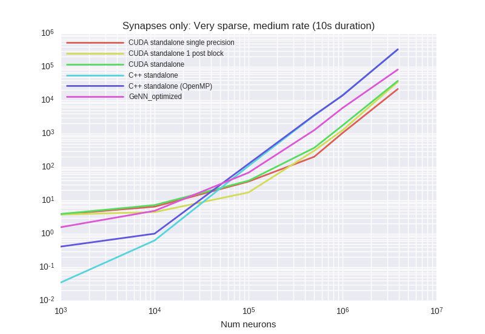
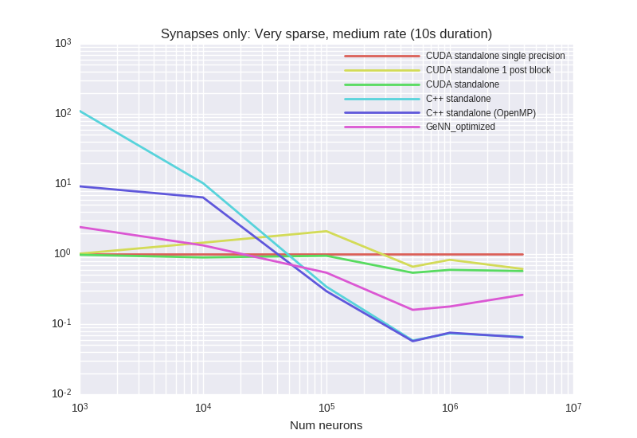

<details><summary>Examplary `nvprof` results for **CUDA-standalone-1-post-block**</summary><p>
Profile summary for `N = 1000`:

```
==28204== NVPROF is profiling process 28204, command: ./main
==28204== Profiling application: ./main
==28204== Profiling result:
            Type  Time(%)      Time     Calls       Avg       Min       Max  Name
 GPU activities:   50.98%  544.28ms    100000  5.4420us  5.2160us  7.4240us  kernel_synapses_pre_codeobject(int, int, int, int, int, int*, int, int*, int, int*, int, double*, int*)
                   19.31%  206.17ms    100000  2.0610us  2.0160us  4.2880us  [CUDA memcpy DtoH]
                   16.35%  174.57ms    100000  1.7450us  1.6320us  2.4000us  kernel_neurongroup_thresholder_codeobject(int, int, int*)
                   13.35%  142.57ms    100000  1.4250us  1.2800us  2.4000us  _GLOBAL__N__69_tmpxft_00006cf4_00000000_6_neurongroup_thresholder_codeobject_cpp1_ii_e0a5624b::_reset_neurongroup_thresholder_codeobject(int*)
      API calls:   58.09%  3.43553s    300000  11.451us  9.0360us  9.0180ms  cudaLaunch
                   34.41%  2.03498s    100000  20.349us  17.295us  22.313ms  cudaMemcpy
                    4.97%  294.07ms   1700000     172ns     115ns  418.07us  cudaSetupArgument
                    1.28%  75.550ms    300000     251ns     162ns  17.648us  cudaConfigureCall
                    1.25%  74.050ms    300000     246ns     178ns  21.209us  cudaGetLastError
                    0.00%  132.28us         1  132.28us  132.28us  132.28us  cudaMemGetInfo
                    0.00%  11.673us         3  3.8910us  3.2090us  4.6620us  cudaFuncGetAttributes
                    0.00%  8.5950us         1  8.5950us  8.5950us  8.5950us  cudaDeviceSynchronize
                    0.00%  5.4960us         3  1.8320us     730ns  3.0070us  cudaOccupancyMaxActiveBlocksPerMultiprocessorWithFlags
                    0.00%  2.0440us         4     511ns     393ns     812ns  cudaDeviceGetAttribute
                    0.00%  1.0120us         1  1.0120us  1.0120us  1.0120us  cudaGetDevice

```

</p></details>


<details><summary>Examplary `nvprof` results for **CUDA-standalone-single-precision**</summary><p>
Profile summary for `N = 1000`:

```
==27618== NVPROF is profiling process 27618, command: ./main
==27618== Profiling application: ./main
==27618== Profiling result:
            Type  Time(%)      Time     Calls       Avg       Min       Max  Name
 GPU activities:   57.88%  714.79ms    100000  7.1470us  6.4640us  7.4560us  kernel_synapses_pre_codeobject(int, int, int, int, int, int*, int, int*, int, int*, int, float*, int*)
                   16.58%  204.82ms    100000  2.0480us  2.0160us  4.3210us  [CUDA memcpy DtoH]
                   14.08%  173.88ms    100000  1.7380us  1.6000us  2.4000us  kernel_neurongroup_thresholder_codeobject(int, int, int*)
                   11.46%  141.55ms    100000  1.4150us  1.2800us  2.2400us  _GLOBAL__N__69_tmpxft_00006a8a_00000000_6_neurongroup_thresholder_codeobject_cpp1_ii_e0a5624b::_reset_neurongroup_thresholder_codeobject(int*)
      API calls:   57.82%  3.38462s    300000  11.282us  9.0370us  10.752ms  cudaLaunch
                   34.54%  2.02213s    100000  20.221us  17.457us  23.517ms  cudaMemcpy
                    4.99%  292.22ms   1700000     171ns     119ns  360.97us  cudaSetupArgument
                    1.36%  79.783ms    300000     265ns     154ns  13.628us  cudaConfigureCall
                    1.28%  74.905ms    300000     249ns     184ns  16.271us  cudaGetLastError
                    0.00%  130.85us         1  130.85us  130.85us  130.85us  cudaMemGetInfo
                    0.00%  11.306us         3  3.7680us  3.0180us  4.6350us  cudaFuncGetAttributes
                    0.00%  8.8940us         1  8.8940us  8.8940us  8.8940us  cudaDeviceSynchronize
                    0.00%  5.6120us         3  1.8700us     718ns  2.9020us  cudaOccupancyMaxActiveBlocksPerMultiprocessorWithFlags
                    0.00%  2.0610us         4     515ns     396ns     789ns  cudaDeviceGetAttribute
                    0.00%  1.0140us         1  1.0140us  1.0140us  1.0140us  cudaGetDevice

```

</p></details>


<details><summary>Examplary `nvprof` results for **CUDAStandaloneConfiguration**</summary><p>
Profile summary for `N = 1000`:

```
==28783== NVPROF is profiling process 28783, command: ./main
==28783== Profiling application: ./main
==28783== Profiling result:
            Type  Time(%)      Time     Calls       Avg       Min       Max  Name
 GPU activities:   59.32%  760.67ms    100000  7.6060us  6.7840us  8.3200us  kernel_synapses_pre_codeobject(int, int, int, int, int, int*, int, int*, int, int*, int, double*, int*)
                   15.98%  204.88ms    100000  2.0480us  2.0160us  4.3520us  [CUDA memcpy DtoH]
                   13.61%  174.46ms    100000  1.7440us  1.6320us  2.3680us  kernel_neurongroup_thresholder_codeobject(int, int, int*)
                   11.09%  142.27ms    100000  1.4220us  1.2800us  2.3680us  _GLOBAL__N__69_tmpxft_00006f32_00000000_6_neurongroup_thresholder_codeobject_cpp1_ii_e0a5624b::_reset_neurongroup_thresholder_codeobject(int*)
      API calls:   57.91%  3.42983s    300000  11.432us  9.2480us  9.1215ms  cudaLaunch
                   34.51%  2.04401s    100000  20.440us  17.369us  22.533ms  cudaMemcpy
                    5.07%  300.42ms   1700000     176ns     120ns  360.84us  cudaSetupArgument
                    1.28%  75.887ms    300000     252ns     162ns  32.149us  cudaConfigureCall
                    1.23%  72.874ms    300000     242ns     185ns  21.008us  cudaGetLastError
                    0.00%  133.39us         1  133.39us  133.39us  133.39us  cudaMemGetInfo
                    0.00%  11.650us         3  3.8830us  3.1360us  4.7260us  cudaFuncGetAttributes
                    0.00%  8.4100us         1  8.4100us  8.4100us  8.4100us  cudaDeviceSynchronize
                    0.00%  5.5360us         3  1.8450us     720ns  3.0040us  cudaOccupancyMaxActiveBlocksPerMultiprocessorWithFlags
                    0.00%  2.0230us         4     505ns     363ns     869ns  cudaDeviceGetAttribute
                    0.00%  1.0870us         1  1.0870us  1.0870us  1.0870us  cudaGetDevice

```

</p></details>


<details><summary>Examplary `nvprof` results for **GeNNConfigurationOptimized**</summary><p>
Profile summary for `N = 1000`:

```
==29269== NVPROF is profiling process 29269, command: ./main test 10.0 1
==29269== Profiling application: ./main test 10.0 1
==29269== Profiling result:
            Type  Time(%)      Time     Calls       Avg       Min       Max  Name
 GPU activities:   67.27%  625.34ms    100000  6.2530us  3.6800us  7.0400us  calcSynapses
                   32.72%  304.13ms    100000  3.0410us  2.9760us  3.5200us  calcNeurons
                    0.01%  53.888us        44  1.2240us     960ns  2.0800us  [CUDA memcpy HtoD]
                    0.00%  35.808us        14  2.5570us  2.0160us  4.7360us  [CUDA memcpy DtoH]
      API calls:   79.13%  1.95627s    200000  9.7810us  8.4890us  403.87us  cudaLaunch
                   15.91%  393.31ms        12  32.776ms  18.142us  391.48ms  cudaHostAlloc
                    2.78%  68.619ms    200000     343ns     259ns  352.92us  cudaConfigureCall
                    2.07%  51.279ms    200000     256ns     180ns  356.55us  cudaSetupArgument
                    0.05%  1.2298ms        61  20.160us     496ns  43.166us  cudaMemcpy
                    0.03%  833.44us        12  69.453us  13.756us  231.00us  cudaMalloc
                    0.02%  398.00us        94  4.2340us     158ns  154.74us  cuDeviceGetAttribute
                    0.00%  114.51us         1  114.51us  114.51us  114.51us  cuDeviceTotalMem
                    0.00%  36.363us         1  36.363us  36.363us  36.363us  cuDeviceGetName
                    0.00%  21.482us        12  1.7900us  1.0850us  5.6740us  cudaGetSymbolAddress
                    0.00%  9.4450us         1  9.4450us  9.4450us  9.4450us  cudaSetDevice
                    0.00%  3.1330us         3  1.0440us     229ns  2.3170us  cuDeviceGetCount
                    0.00%  1.7360us         1  1.7360us  1.7360us  1.7360us  cudaGetDeviceCount
                    0.00%  1.0260us         2     513ns     243ns     783ns  cuDeviceGet

```

</p></details>


***

### Vogels
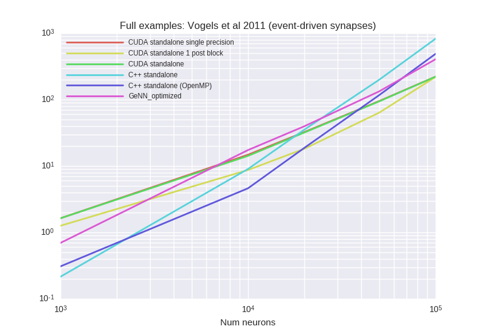


<details><summary>Examplary `nvprof` results for **CUDA-standalone-1-post-block**</summary><p>
Profile summary for `N = 1000`:

```
==26830== NVPROF is profiling process 26830, command: ./main
==26830== Profiling application: ./main
==26830== Profiling result:
            Type  Time(%)      Time     Calls       Avg       Min       Max  Name
 GPU activities:   35.98%  177.56ms     10000  17.756us  2.3360us  2.0669ms  kernel_synapses_2_post_codeobject(int, int, int, int, int, int*, int, double*, int, double*, int, double*, int, int*, int, double, double*, int, int*)
                   12.96%  63.946ms      9747  6.5600us  2.9120us  200.29us  kernel_synapses_pre_codeobject(int, int, int, int, int, int*, int, double*, int*, int, int*, int, int*)
                   12.46%  61.519ms     30000  2.0500us  2.0160us  2.6880us  [CUDA memcpy DtoH]
                    9.58%  47.277ms      9747  4.8500us  2.8480us  181.60us  kernel_synapses_2_pre_codeobject(int, int, int, int, int, int*, int, double*, int, double*, int, double*, int, int*, int, int*, int, double, double*, int, double*, int*)
                    8.14%  40.189ms      9747  4.1230us  2.8160us  173.15us  kernel_synapses_1_pre_codeobject(int, int, int, int, int, int*, int, double*, int*, int, int*, int, int*)
                    8.03%  39.626ms     10000  3.9620us  3.3920us  4.8320us  kernel_neurongroup_stateupdater_codeobject(int, int, double*, char*, double*, double, double*, double*, double*)
                    5.61%  27.709ms     10000  2.7700us  1.5360us  3.4240us  kernel_neurongroup_thresholder_codeobject(int, int, int*, double, double*, double*, char*)
                    3.86%  19.055ms     10000  1.9050us  1.6000us  2.8480us  kernel_neurongroup_resetter_codeobject(int, int, double*, int*, char*)
                    3.38%  16.668ms     10000  1.6660us  1.3440us  2.3680us  _GLOBAL__N__69_tmpxft_0000668f_00000000_6_neurongroup_thresholder_codeobject_cpp1_ii_0e9058a7::_reset_neurongroup_thresholder_codeobject(int*)
      API calls:   51.85%  904.35ms     79241  11.412us  8.5600us  9.4874ms  cudaLaunch
                   35.58%  620.50ms     30000  20.683us  14.753us  2.2130ms  cudaMemcpy
                    9.78%  170.67ms    877856     194ns     127ns  357.61us  cudaSetupArgument
                    1.50%  26.245ms     79241     331ns     189ns  358.34us  cudaConfigureCall
                    1.27%  22.208ms     80000     277ns     200ns  328.06us  cudaGetLastError
                    0.01%  130.77us         1  130.77us  130.77us  130.77us  cudaMemGetInfo
                    0.00%  37.751us        41     920ns     665ns  4.5510us  cudaOccupancyMaxActiveBlocksPerMultiprocessorWithFlags
                    0.00%  36.962us        10  3.6960us  2.9500us  5.2850us  cudaFuncGetAttributes
                    0.00%  10.797us         1  10.797us  10.797us  10.797us  cudaDeviceSynchronize
                    0.00%  5.6490us        12     470ns     327ns     853ns  cudaDeviceGetAttribute
                    0.00%  3.3210us         3  1.1070us     867ns  1.4280us  cudaGetDevice

```

</p></details>


<details><summary>Examplary `nvprof` results for **CUDA-standalone-single-precision**</summary><p>
Profile summary for `N = 1000`:

```
==26094== NVPROF is profiling process 26094, command: ./main
==26094== Profiling application: ./main
==26094== Profiling result:
            Type  Time(%)      Time     Calls       Avg       Min       Max  Name
 GPU activities:   22.59%  204.21ms      9735  20.976us  3.8400us  2.4840ms  kernel_synapses_pre_codeobject(int, int, int, int, int, int*, int, float*, int*, int, int*, int, int*)
                   22.44%  202.83ms      9735  20.834us  3.8720us  2.6569ms  kernel_synapses_2_pre_codeobject(int, int, int, int, int, int*, int, float*, int, double*, int, float*, int, int*, int, int*, int, double, float*, int, float*, int*)
                   20.56%  185.88ms      9735  19.093us  3.8080us  2.4518ms  kernel_synapses_1_pre_codeobject(int, int, int, int, int, int*, int, float*, int*, int, int*, int, int*)
                   16.41%  148.32ms     10000  14.832us  3.7760us  1.2624ms  kernel_synapses_2_post_codeobject(int, int, int, int, int, int*, int, float*, int, double*, int, float*, int, int*, int, double, float*, int, int*)
                    6.80%  61.446ms     30000  2.0480us  2.0160us  4.1920us  [CUDA memcpy DtoH]
                    4.04%  36.496ms     10000  3.6490us  3.1040us  4.8320us  kernel_neurongroup_stateupdater_codeobject(int, int, float*, char*, float*, double, float*, double*, double*)
                    3.03%  27.389ms     10000  2.7380us  1.6000us  3.3280us  kernel_neurongroup_thresholder_codeobject(int, int, int*, double, float*, double*, char*)
                    2.29%  20.696ms     10000  2.0690us  1.6000us  2.6560us  kernel_neurongroup_resetter_codeobject(int, int, float*, int*, char*)
                    1.84%  16.634ms     10000  1.6630us  1.3440us  2.1760us  _GLOBAL__N__69_tmpxft_0000639d_00000000_6_neurongroup_thresholder_codeobject_cpp1_ii_7f32e276::_reset_neurongroup_thresholder_codeobject(int*)
      API calls:   45.41%  933.90ms     30000  31.130us  14.507us  3.6862ms  cudaMemcpy
                   45.29%  931.35ms     79205  11.758us  9.0100us  16.345ms  cudaLaunch
                    7.18%  147.66ms    877280     168ns     123ns  366.59us  cudaSetupArgument
                    1.10%  22.647ms     79205     285ns     173ns  380.18us  cudaConfigureCall
                    1.00%  20.608ms     80000     257ns     193ns  331.93us  cudaGetLastError
                    0.01%  131.56us         1  131.56us  131.56us  131.56us  cudaMemGetInfo
                    0.00%  37.712us        10  3.7710us  2.9460us  5.5370us  cudaFuncGetAttributes
                    0.00%  34.153us        41     833ns     608ns  3.2490us  cudaOccupancyMaxActiveBlocksPerMultiprocessorWithFlags
                    0.00%  12.084us         1  12.084us  12.084us  12.084us  cudaDeviceSynchronize
                    0.00%  6.0170us        12     501ns     365ns     907ns  cudaDeviceGetAttribute
                    0.00%  3.4800us         3  1.1600us     975ns  1.4640us  cudaGetDevice

```

</p></details>


<details><summary>Examplary `nvprof` results for **CUDAStandaloneConfiguration**</summary><p>
Profile summary for `N = 1000`:

```
==27568== NVPROF is profiling process 27568, command: ./main
==27568== Profiling application: ./main
==27568== Profiling result:
            Type  Time(%)      Time     Calls       Avg       Min       Max  Name
 GPU activities:   25.87%  245.60ms      9759  25.166us  4.6400us  2.4809ms  kernel_synapses_1_pre_codeobject(int, int, int, int, int, int*, int, double*, int*, int, int*, int, int*)
                   22.00%  208.83ms      9759  21.398us  3.8400us  2.5367ms  kernel_synapses_pre_codeobject(int, int, int, int, int, int*, int, double*, int*, int, int*, int, int*)
                   19.89%  188.79ms      9759  19.345us  3.7760us  2.4592ms  kernel_synapses_2_pre_codeobject(int, int, int, int, int, int*, int, double*, int, double*, int, double*, int, int*, int, int*, int, double, double*, int, double*, int*)
                   14.82%  140.65ms     10000  14.064us  3.4240us  1.2043ms  kernel_synapses_2_post_codeobject(int, int, int, int, int, int*, int, double*, int, double*, int, double*, int, int*, int, double, double*, int, int*)
                    6.48%  61.487ms     30000  2.0490us  2.0160us  4.3200us  [CUDA memcpy DtoH]
                    4.21%  39.976ms     10000  3.9970us  3.4240us  4.8640us  kernel_neurongroup_stateupdater_codeobject(int, int, double*, char*, double*, double, double*, double*, double*)
                    2.93%  27.844ms     10000  2.7840us  1.5360us  3.4880us  kernel_neurongroup_thresholder_codeobject(int, int, int*, double, double*, double*, char*)
                    2.04%  19.360ms     10000  1.9360us  1.6320us  3.2640us  kernel_neurongroup_resetter_codeobject(int, int, double*, int*, char*)
                    1.76%  16.738ms     10000  1.6730us  1.3760us  2.4000us  _GLOBAL__N__69_tmpxft_0000696e_00000000_6_neurongroup_thresholder_codeobject_cpp1_ii_0e9058a7::_reset_neurongroup_thresholder_codeobject(int*)
      API calls:   46.05%  990.24ms     30000  33.008us  14.988us  3.6874ms  cudaMemcpy
                   44.29%  952.54ms     79277  12.015us  8.5340us  9.4751ms  cudaLaunch
                    7.54%  162.09ms    878432     184ns     116ns  380.29us  cudaSetupArgument
                    1.06%  22.785ms     79277     287ns     169ns  337.74us  cudaConfigureCall
                    1.05%  22.530ms     80000     281ns     200ns  323.17us  cudaGetLastError
                    0.01%  131.68us         1  131.68us  131.68us  131.68us  cudaMemGetInfo
                    0.00%  45.179us         1  45.179us  45.179us  45.179us  cudaDeviceSynchronize
                    0.00%  37.788us        10  3.7780us  2.9810us  5.2000us  cudaFuncGetAttributes
                    0.00%  37.426us        41     912ns     660ns  4.7530us  cudaOccupancyMaxActiveBlocksPerMultiprocessorWithFlags
                    0.00%  5.5140us        12     459ns     323ns     850ns  cudaDeviceGetAttribute
                    0.00%  3.2130us         3  1.0710us     868ns  1.3070us  cudaGetDevice

```

</p></details>


<details><summary>Examplary `nvprof` results for **GeNNConfigurationOptimized**</summary><p>
Profile summary for `N = 1000`:

```
==28014== NVPROF is profiling process 28014, command: ./main test 1.0 1
==28014== Profiling application: ./main test 1.0 1
==28014== Profiling result:
            Type  Time(%)      Time     Calls       Avg       Min       Max  Name
 GPU activities:   53.53%  323.54ms     10000  32.353us  2.0800us  4.3572ms  learnSynapsesPost
                   34.18%  206.56ms     10000  20.656us  1.5680us  2.5629ms  calcSynapses
                   12.20%  73.741ms     10000  7.3740us  6.2080us  9.7600us  calcNeurons
                    0.06%  385.28us        86  4.4800us     960ns  43.104us  [CUDA memcpy HtoD]
                    0.02%  128.80us        20  6.4400us  1.9520us  40.288us  [CUDA memcpy DtoH]
      API calls:   57.81%  625.39ms     30000  20.846us  9.6460us  377.35us  cudaLaunch
                   37.85%  409.44ms        26  15.748ms  9.1120us  406.34ms  cudaHostAlloc
                    2.37%  25.647ms       112  228.99us     502ns  23.517ms  cudaMemcpy
                    1.03%  11.117ms     30000     370ns     261ns  342.33us  cudaConfigureCall
                    0.77%  8.3262ms     30000     277ns     207ns  351.74us  cudaSetupArgument
                    0.12%  1.2736ms        26  48.984us  7.6980us  234.88us  cudaMalloc
                    0.04%  399.14us        94  4.2460us     154ns  155.55us  cuDeviceGetAttribute
                    0.01%  119.18us         1  119.18us  119.18us  119.18us  cuDeviceTotalMem
                    0.01%  62.562us         1  62.562us  62.562us  62.562us  cuDeviceGetName
                    0.00%  32.218us        26  1.2390us     541ns  6.1210us  cudaGetSymbolAddress
                    0.00%  9.1720us         1  9.1720us  9.1720us  9.1720us  cudaSetDevice
                    0.00%  4.0390us         3  1.3460us     226ns  2.2890us  cuDeviceGetCount
                    0.00%  1.8180us         1  1.8180us  1.8180us  1.8180us  cudaGetDeviceCount
                    0.00%  1.2370us         2     618ns     546ns     691ns  cuDeviceGet

```

</p></details>


***

### VogelsWithSynapticDynamic
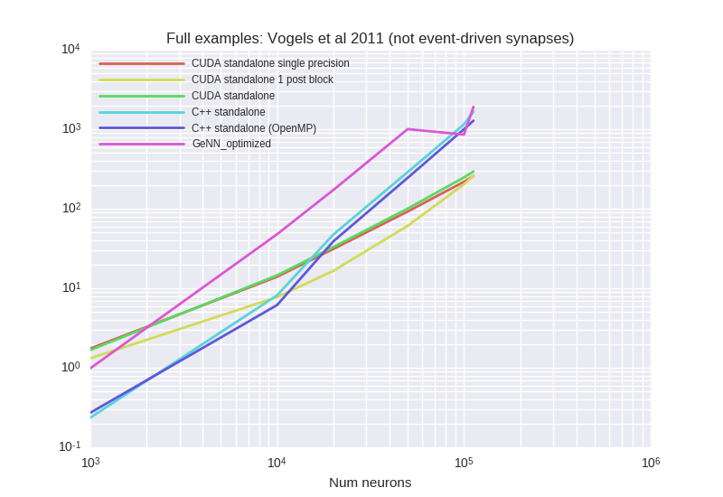


<details><summary>Examplary `nvprof` results for **CUDA-standalone-1-post-block**</summary><p>
Profile summary for `N = 1000`:

```
==28444== NVPROF is profiling process 28444, command: ./main
==28444== Profiling application: ./main
==28444== Profiling result:
            Type  Time(%)      Time     Calls       Avg       Min       Max  Name
 GPU activities:   31.96%  160.99ms     10000  16.099us  2.4320us  1.8661ms  kernel_synapses_2_post_codeobject(int, int, int, int, int, int*, int, double*, int, double*, int, int*, double*, int, int*, int)
                   12.47%  62.791ms      9733  6.4510us  2.9120us  196.93us  kernel_synapses_pre_codeobject(int, int, int, int, int, int*, int, double*, int*, int, int*, int, int*)
                   12.21%  61.513ms     30000  2.0500us  2.0160us  4.3200us  [CUDA memcpy DtoH]
                    8.83%  44.476ms      9733  4.5690us  2.9120us  177.76us  kernel_synapses_2_pre_codeobject(int, int, int, int, int, int*, int, double*, int, double*, int, int*, int, int*, double*, int, double*, int*, int)
                    8.05%  40.567ms     10000  4.0560us  3.5520us  5.0560us  kernel_neurongroup_stateupdater_codeobject(int, int, double*, char*, double*, double, double*, double*, double*)
                    7.76%  39.086ms      9733  4.0150us  2.8800us  172.83us  kernel_synapses_1_pre_codeobject(int, int, int, int, int, int*, int, double*, int*, int, int*, int, int*)
                    6.08%  30.638ms     10000  3.0630us  2.9760us  4.4800us  kernel_synapses_2_stateupdater_codeobject(int, int, double*, int, double*, int, int*, double*)
                    5.44%  27.394ms     10000  2.7390us  1.5360us  3.2640us  kernel_neurongroup_thresholder_codeobject(int, int, int*, double, double*, double*, char*)
                    3.88%  19.553ms     10000  1.9550us  1.6320us  2.4960us  kernel_neurongroup_resetter_codeobject(int, int, double*, int*, char*)
                    3.32%  16.726ms     10000  1.6720us  1.4400us  2.0800us  _GLOBAL__N__69_tmpxft_00006c29_00000000_6_neurongroup_thresholder_codeobject_cpp1_ii_0e9058a7::_reset_neurongroup_thresholder_codeobject(int*)
      API calls:   56.63%  1.07568s     89199  12.059us  8.9630us  10.147ms  cudaLaunch
                   33.24%  631.38ms     30000  21.045us  15.101us  1.9773ms  cudaMemcpy
                    7.55%  143.40ms    897985     159ns     120ns  338.49us  cudaSetupArgument
                    1.37%  25.953ms     89199     290ns     158ns  320.39us  cudaConfigureCall
                    1.20%  22.882ms     90000     254ns     183ns  345.54us  cudaGetLastError
                    0.01%  132.45us         1  132.45us  132.45us  132.45us  cudaMemGetInfo
                    0.00%  57.161us        74     772ns     615ns  3.5600us  cudaOccupancyMaxActiveBlocksPerMultiprocessorWithFlags
                    0.00%  43.352us        12  3.6120us  2.8440us  5.7030us  cudaFuncGetAttributes
                    0.00%  12.769us         1  12.769us  12.769us  12.769us  cudaDeviceSynchronize
                    0.00%  7.3720us        16     460ns     321ns     931ns  cudaDeviceGetAttribute
                    0.00%  4.2670us         4  1.0660us     787ns  1.5040us  cudaGetDevice

```

</p></details>


<details><summary>Examplary `nvprof` results for **CUDA-standalone-single-precision**</summary><p>
Profile summary for `N = 1000`:

```
==27284== NVPROF is profiling process 27284, command: ./main
==27284== Profiling application: ./main
==27284== Profiling result:
            Type  Time(%)      Time     Calls       Avg       Min       Max  Name
 GPU activities:   22.41%  203.79ms      9743  20.916us  3.8400us  2.5159ms  kernel_synapses_pre_codeobject(int, int, int, int, int, int*, int, float*, int*, int, int*, int, int*)
                   20.83%  189.44ms      9743  19.443us  3.8720us  2.4904ms  kernel_synapses_2_pre_codeobject(int, int, int, int, int, int*, int, float*, int, float*, int, int*, int, int*, float*, int, float*, int*, int)
                   20.39%  185.46ms      9743  19.035us  3.8400us  2.4531ms  kernel_synapses_1_pre_codeobject(int, int, int, int, int, int*, int, float*, int*, int, int*, int, int*)
                   15.04%  136.83ms     10000  13.682us  3.9360us  1.1989ms  kernel_synapses_2_post_codeobject(int, int, int, int, int, int*, int, float*, int, float*, int, int*, float*, int, int*, int)
                    6.75%  61.372ms     30000  2.0450us  2.0160us  4.3840us  [CUDA memcpy DtoH]
                    4.05%  36.873ms     10000  3.6870us  3.2960us  4.9600us  kernel_neurongroup_stateupdater_codeobject(int, int, float*, char*, float*, double, float*, double*, double*)
                    3.30%  30.040ms     10000  3.0030us  2.6560us  4.1920us  kernel_synapses_2_stateupdater_codeobject(int, int, float*, int, float*, int, int*, double*)
                    3.04%  27.631ms     10000  2.7630us  1.6320us  3.4880us  kernel_neurongroup_thresholder_codeobject(int, int, int*, double, float*, double*, char*)
                    2.34%  21.271ms     10000  2.1270us  1.8240us  2.4640us  kernel_neurongroup_resetter_codeobject(int, int, float*, int*, char*)
                    1.84%  16.757ms     10000  1.6750us  1.6000us  2.1440us  _GLOBAL__N__69_tmpxft_0000668e_00000000_6_neurongroup_thresholder_codeobject_cpp1_ii_7f32e276::_reset_neurongroup_thresholder_codeobject(int*)
      API calls:   48.57%  1.03858s     89229  11.639us  8.8040us  11.740ms  cudaLaunch
                   42.60%  911.07ms     30000  30.369us  14.911us  3.6495ms  cudaMemcpy
                    6.59%  140.93ms    898435     156ns     115ns  338.81us  cudaSetupArgument
                    1.15%  24.588ms     89229     275ns     182ns  313.45us  cudaConfigureCall
                    1.08%  23.045ms     90000     256ns     197ns  13.862us  cudaGetLastError
                    0.01%  140.06us         1  140.06us  140.06us  140.06us  cudaMemGetInfo
                    0.00%  53.429us        74     722ns     545ns  3.6580us  cudaOccupancyMaxActiveBlocksPerMultiprocessorWithFlags
                    0.00%  47.167us        12  3.9300us  2.8640us  7.7350us  cudaFuncGetAttributes
                    0.00%  39.514us         1  39.514us  39.514us  39.514us  cudaDeviceSynchronize
                    0.00%  9.0750us        16     567ns     348ns  1.2860us  cudaDeviceGetAttribute
                    0.00%  6.2270us         4  1.5560us     766ns  2.9460us  cudaGetDevice

```

</p></details>


<details><summary>Examplary `nvprof` results for **CUDAStandaloneConfiguration**</summary><p>
Profile summary for `N = 1000`:

```
==29487== NVPROF is profiling process 29487, command: ./main
==29487== Profiling application: ./main
==29487== Profiling result:
            Type  Time(%)      Time     Calls       Avg       Min       Max  Name
 GPU activities:   22.74%  209.17ms      9747  21.460us  3.7760us  2.4881ms  kernel_synapses_pre_codeobject(int, int, int, int, int, int*, int, double*, int*, int, int*, int, int*)
                   20.93%  192.48ms      9747  19.747us  3.9040us  2.4551ms  kernel_synapses_2_pre_codeobject(int, int, int, int, int, int*, int, double*, int, double*, int, int*, int, int*, double*, int, double*, int*, int)
                   20.31%  186.81ms      9747  19.165us  3.8080us  2.4790ms  kernel_synapses_1_pre_codeobject(int, int, int, int, int, int*, int, double*, int*, int, int*, int, int*)
                   14.66%  134.79ms     10000  13.478us  3.6160us  1.2008ms  kernel_synapses_2_post_codeobject(int, int, int, int, int, int*, int, double*, int, double*, int, int*, double*, int, int*, int)
                    6.68%  61.432ms     30000  2.0470us  1.9840us  4.0960us  [CUDA memcpy DtoH]
                    4.35%  40.047ms     10000  4.0040us  3.6480us  5.3760us  kernel_neurongroup_stateupdater_codeobject(int, int, double*, char*, double*, double, double*, double*, double*)
                    3.40%  31.227ms     10000  3.1220us  2.8160us  4.4800us  kernel_synapses_2_stateupdater_codeobject(int, int, double*, int, double*, int, int*, double*)
                    2.98%  27.431ms     10000  2.7430us  1.6000us  3.2960us  kernel_neurongroup_thresholder_codeobject(int, int, int*, double, double*, double*, char*)
                    2.07%  19.050ms     10000  1.9040us  1.6960us  2.4320us  kernel_neurongroup_resetter_codeobject(int, int, double*, int*, char*)
                    1.88%  17.256ms     10000  1.7250us  1.6320us  2.4000us  _GLOBAL__N__69_tmpxft_00007027_00000000_6_neurongroup_thresholder_codeobject_cpp1_ii_0e9058a7::_reset_neurongroup_thresholder_codeobject(int*)
      API calls:   48.94%  1.07427s     89241  12.037us  9.0500us  9.3437ms  cudaLaunch
                   42.07%  923.33ms     30000  30.777us  14.994us  3.6242ms  cudaMemcpy
                    6.71%  147.36ms    898615     163ns     116ns  346.24us  cudaSetupArgument
                    1.17%  25.627ms     89241     287ns     185ns  325.85us  cudaConfigureCall
                    1.10%  24.057ms     90000     267ns     204ns  17.423us  cudaGetLastError
                    0.01%  137.61us         1  137.61us  137.61us  137.61us  cudaMemGetInfo
                    0.00%  57.164us        74     772ns     621ns  3.7030us  cudaOccupancyMaxActiveBlocksPerMultiprocessorWithFlags
                    0.00%  44.409us        12  3.7000us  3.0100us  5.1140us  cudaFuncGetAttributes
                    0.00%  7.8030us        16     487ns     346ns  1.0400us  cudaDeviceGetAttribute
                    0.00%  7.7210us         1  7.7210us  7.7210us  7.7210us  cudaDeviceSynchronize
                    0.00%  4.2460us         4  1.0610us     812ns  1.2860us  cudaGetDevice

```

</p></details>


<details><summary>Examplary `nvprof` results for **GeNNConfigurationOptimized**</summary><p>
Profile summary for `N = 1000`:

```
==30153== NVPROF is profiling process 30153, command: ./main test 1.0 1
==30153== Profiling application: ./main test 1.0 1
==30153== Profiling result:
            Type  Time(%)      Time     Calls       Avg       Min       Max  Name
 GPU activities:   65.08%  857.70ms     10000  85.769us  82.657us  94.817us  calcSynapseDynamics
                   15.12%  199.35ms     10000  19.934us  2.0480us  2.5365ms  calcSynapses
                   14.24%  187.62ms     10000  18.761us  2.2720us  2.3097ms  learnSynapsesPost
                    5.53%  72.820ms     10000  7.2820us  6.3680us  8.9600us  calcNeurons
                    0.03%  387.84us        88  4.4070us     960ns  42.464us  [CUDA memcpy HtoD]
                    0.01%  128.70us        20  6.4350us  1.9520us  40.384us  [CUDA memcpy DtoH]
      API calls:   70.85%  1.33726s     40000  33.431us  9.9210us  419.19us  cudaLaunch
                   25.49%  481.07ms        27  17.817ms  9.0990us  478.15ms  cudaHostAlloc
                    2.07%  39.119ms       114  343.15us     464ns  37.027ms  cudaMemcpy
                    0.89%  16.831ms     40000     420ns     303ns  363.64us  cudaConfigureCall
                    0.61%  11.450ms     40000     286ns     202ns  349.46us  cudaSetupArgument
                    0.06%  1.1741ms        27  43.484us  7.7620us  212.42us  cudaMalloc
                    0.02%  404.66us        94  4.3040us     164ns  157.36us  cuDeviceGetAttribute
                    0.01%  120.52us         1  120.52us  120.52us  120.52us  cuDeviceTotalMem
                    0.00%  42.538us         1  42.538us  42.538us  42.538us  cuDeviceGetName
                    0.00%  30.458us        27  1.1280us     580ns  5.6070us  cudaGetSymbolAddress
                    0.00%  9.9640us         1  9.9640us  9.9640us  9.9640us  cudaSetDevice
                    0.00%  3.2250us         3  1.0750us     209ns  2.3880us  cuDeviceGetCount
                    0.00%  1.8310us         1  1.8310us  1.8310us  1.8310us  cudaGetDeviceCount
                    0.00%  1.1210us         2     560ns     257ns     864ns  cuDeviceGet

```

</p></details>


