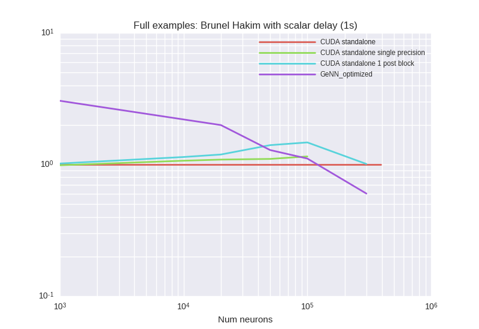

# Benchmark results from 
## Description:


## Last git log:
```
commit 35d4d9ae64d30f2d504b1e40c1c3d39d45fc4db7
Author: Denis Alevi <mail@denisalevi.de>
Date:   Mon Sep 10 20:57:38 2018 +0200

    Add script to run all brian2 examples

```
There is also a `git diff` saved in the current directory.

## Results

### BrunelHakimModelScalarDelay



<details><summary>Examplary `nvprof` results for **CUDA-standalone-1-post-block**</summary><p>
Profile summary for `N = 1000`:

```
==21751== NVPROF is profiling process 21751, command: ./main
==21751== Profiling application: ./main
==21751== Profiling result:
            Type  Time(%)      Time     Calls       Avg       Min       Max  Name
 GPU activities:   67.94%  199.42ms     10000  19.941us  18.881us  55.298us  kernel_neurongroup_stateupdater_codeobject(int, int, double, double*, double*, double*, char*, double*)
                    7.93%  23.269ms     10000  2.3260us  2.1440us  5.7930us  kernel_neurongroup_thresholder_codeobject(int, int, int*, double, double*, double*, char*)
                    7.09%  20.810ms      9981  2.0840us  1.9840us  10.464us  [CUDA memcpy DtoH]
                    5.72%  16.794ms     10000  1.6790us  1.5680us  8.2560us  kernel_neurongroup_resetter_codeobject(int, int, double*, int*)
                    4.80%  14.103ms     10000  1.4100us  1.2160us  8.2560us  _GLOBAL__N__69_tmpxft_000052ec_00000000_6_neurongroup_thresholder_codeobject_cpp1_ii_0e9058a7::_reset_neurongroup_thresholder_codeobject(int*)
                    4.20%  12.327ms      1888  6.5290us  1.9520us  21.056us  kernel_synapses_pre_codeobject(int, int, int, int, int, int*, int, double*, int*, int, int*, int, int*)
                    2.32%  6.7983ms         2  3.3991ms  3.1326ms  3.6656ms  void gen_sequenced<curandStateXORWOW, double2, normal_args_double_st, __operator_&__(double2 curand_normal_scaled2_double<curandStateXORWOW>(curandStateXORWOW*, normal_args_double_st))>(curandStateXORWOW*, double2*, unsigned long, unsigned long, normal_args_double_st)
      API calls:   66.03%  608.17ms     41890  14.518us  10.838us  15.342ms  cudaLaunch
                   24.31%  223.90ms      9981  22.432us  18.689us  3.1284ms  cudaMemcpy
                    5.80%  53.439ms    224554     237ns     152ns  576.32us  cudaSetupArgument
                    1.97%  18.185ms     50004     363ns     224ns  558.98us  cudaGetLastError
                    1.50%  13.771ms     41890     328ns     205ns  569.79us  cudaConfigureCall
                    0.24%  2.2537ms         1  2.2537ms  2.2537ms  2.2537ms  cudaMemGetInfo
                    0.13%  1.2380ms         1  1.2380ms  1.2380ms  1.2380ms  cudaMalloc
                    0.00%  42.748us        38  1.1240us     749ns  11.457us  cudaOccupancyMaxActiveBlocksPerMultiprocessorWithFlags
                    0.00%  39.962us         7  5.7080us  3.8860us  12.803us  cudaFuncGetAttributes
                    0.00%  11.090us         1  11.090us  11.090us  11.090us  cudaDeviceSynchronize
                    0.00%  8.8690us        12     739ns     455ns  2.3160us  cudaDeviceGetAttribute
                    0.00%  7.9960us         3  2.6650us  1.0310us  5.7910us  cudaGetDevice

```

</p></details>


<details><summary>Examplary `nvprof` results for **CUDA-standalone-single-precision**</summary><p>
Profile summary for `N = 1000`:

```
==20959== NVPROF is profiling process 20959, command: ./main
==20959== Profiling application: ./main
==20959== Profiling result:
            Type  Time(%)      Time     Calls       Avg       Min       Max  Name
 GPU activities:   70.12%  208.67ms     10000  20.866us  20.000us  58.689us  kernel_neurongroup_stateupdater_codeobject(int, int, double, float*, double*, double*, char*, float*)
                    7.37%  21.938ms     10000  2.1930us  2.0160us  9.2480us  kernel_neurongroup_thresholder_codeobject(int, int, int*, double, float*, double*, char*)
                    6.35%  18.900ms      9981  1.8930us  1.8240us  10.752us  [CUDA memcpy DtoH]
                    5.78%  17.188ms      1842  9.3310us  3.4880us  44.897us  kernel_synapses_pre_codeobject(int, int, int, int, int, int*, int, float*, int*, int, int*, int, int*)
                    5.66%  16.858ms     10000  1.6850us  1.5360us  8.8320us  kernel_neurongroup_resetter_codeobject(int, int, float*, int*)
                    4.57%  13.608ms     10000  1.3600us  1.2160us  8.9600us  _GLOBAL__N__69_tmpxft_00004fdd_00000000_6_neurongroup_thresholder_codeobject_cpp1_ii_7f32e276::_reset_neurongroup_thresholder_codeobject(int*)
                    0.15%  434.19us         1  434.19us  434.19us  434.19us  void gen_sequenced<curandStateXORWOW, float2, normal_args_st, __operator_&__(float2 curand_normal_scaled2<curandStateXORWOW>(curandStateXORWOW*, normal_args_st))>(curandStateXORWOW*, float2*, unsigned long, unsigned long, normal_args_st)
      API calls:   65.85%  496.02ms     41843  11.854us  9.7890us  10.656ms  cudaLaunch
                   24.56%  185.02ms      9981  18.537us  16.977us  545.34us  cudaMemcpy
                    5.88%  44.295ms    223951     197ns     145ns  520.49us  cudaSetupArgument
                    1.96%  14.801ms     50002     296ns     233ns  534.80us  cudaGetLastError
                    1.66%  12.533ms     41843     299ns     206ns  502.95us  cudaConfigureCall
                    0.03%  242.77us         1  242.77us  242.77us  242.77us  cudaMemGetInfo
                    0.03%  222.08us         1  222.08us  222.08us  222.08us  cudaMalloc
                    0.00%  33.611us        38     884ns     689ns  5.1250us  cudaOccupancyMaxActiveBlocksPerMultiprocessorWithFlags
                    0.00%  29.281us         7  4.1830us  3.2470us  7.0660us  cudaFuncGetAttributes
                    0.00%  9.6300us         1  9.6300us  9.6300us  9.6300us  cudaDeviceSynchronize
                    0.00%  8.1290us        12     677ns     373ns  2.7940us  cudaDeviceGetAttribute
                    0.00%  5.3020us         3  1.7670us     933ns  3.3900us  cudaGetDevice

```

</p></details>


<details><summary>Examplary `nvprof` results for **CUDAStandaloneConfiguration**</summary><p>
Profile summary for `N = 1000`:

```
==20147== NVPROF is profiling process 20147, command: ./main
==20147== Profiling application: ./main
==20147== Profiling result:
            Type  Time(%)      Time     Calls       Avg       Min       Max  Name
 GPU activities:   66.66%  200.14ms     10000  20.014us  18.848us  56.129us  kernel_neurongroup_stateupdater_codeobject(int, int, double, double*, double*, double*, char*, double*)
                    7.75%  23.256ms     10000  2.3250us  2.0800us  8.7040us  kernel_neurongroup_thresholder_codeobject(int, int, int*, double, double*, double*, char*)
                    6.35%  19.081ms      9981  1.9110us  1.8240us  16.577us  [CUDA memcpy DtoH]
                    6.30%  18.928ms      1789  10.580us  3.4880us  38.369us  kernel_synapses_pre_codeobject(int, int, int, int, int, int*, int, double*, int*, int, int*, int, int*)
                    5.74%  17.234ms     10000  1.7230us  1.6000us  8.6080us  kernel_neurongroup_resetter_codeobject(int, int, double*, int*)
                    4.96%  14.892ms     10000  1.4890us  1.3760us  3.3930us  _GLOBAL__N__69_tmpxft_00004c8f_00000000_6_neurongroup_thresholder_codeobject_cpp1_ii_0e9058a7::_reset_neurongroup_thresholder_codeobject(int*)
                    2.24%  6.7313ms         2  3.3656ms  3.0728ms  3.6585ms  void gen_sequenced<curandStateXORWOW, double2, normal_args_double_st, __operator_&__(double2 curand_normal_scaled2_double<curandStateXORWOW>(curandStateXORWOW*, normal_args_double_st))>(curandStateXORWOW*, double2*, unsigned long, unsigned long, normal_args_double_st)
      API calls:   67.63%  568.53ms     41791  13.604us  10.469us  11.554ms  cudaLaunch
                   23.31%  195.96ms      9981  19.633us  17.156us  3.0764ms  cudaMemcpy
                    5.36%  45.058ms    223267     201ns     143ns  586.49us  cudaSetupArgument
                    2.16%  18.148ms     50004     362ns     256ns  574.35us  cudaGetLastError
                    1.46%  12.260ms     41791     293ns     191ns  483.17us  cudaConfigureCall
                    0.03%  293.74us         1  293.74us  293.74us  293.74us  cudaMemGetInfo
                    0.03%  289.18us         1  289.18us  289.18us  289.18us  cudaMalloc
                    0.00%  37.240us        38     980ns     746ns  6.0650us  cudaOccupancyMaxActiveBlocksPerMultiprocessorWithFlags
                    0.00%  34.764us         7  4.9660us  3.9540us  7.7990us  cudaFuncGetAttributes
                    0.00%  12.489us         1  12.489us  12.489us  12.489us  cudaDeviceSynchronize
                    0.00%  10.804us         3  3.6010us  1.0400us  8.5590us  cudaGetDevice
                    0.00%  9.0360us        12     753ns     457ns  2.5770us  cudaDeviceGetAttribute

```

</p></details>


<details><summary>Examplary `nvprof` results for **GeNNConfigurationOptimized**</summary><p>
Profile summary for `N = 1000`:

```
==22524== NVPROF is profiling process 22524, command: ./main test 1.0 1
==22524== Profiling application: ./main test 1.0 1
==22524== Profiling result:
            Type  Time(%)      Time     Calls       Avg       Min       Max  Name
 GPU activities:   74.04%  128.47ms     10000  12.847us  10.624us  36.897us  calcNeurons
                   22.56%  39.145ms     10000  3.9140us  2.6240us  24.192us  calcSynapses
                    2.70%  4.6768ms        41  114.07us  1.0240us  1.3065ms  [CUDA memcpy HtoD]
                    0.70%  1.2208ms        10  122.08us  2.0800us  1.1944ms  [CUDA memcpy DtoH]
      API calls:   54.77%  360.17ms        11  32.743ms  25.346us  349.17ms  cudaHostAlloc
                   41.27%  271.38ms     20000  13.569us  12.334us  574.57us  cudaLaunch
                    1.46%  9.6063ms     20000     480ns     393ns  564.24us  cudaConfigureCall
                    1.10%  7.2539ms        53  136.87us     755ns  1.3473ms  cudaMemcpy
                    1.00%  6.5914ms     20000     329ns     256ns  549.89us  cudaSetupArgument
                    0.25%  1.6587ms        11  150.79us  17.554us  308.75us  cudaMalloc
                    0.08%  521.41us        94  5.5460us     245ns  225.01us  cuDeviceGetAttribute
                    0.04%  292.29us         1  292.29us  292.29us  292.29us  cuDeviceTotalMem
                    0.01%  63.702us         1  63.702us  63.702us  63.702us  cuDeviceGetName
                    0.00%  28.932us        11  2.6300us  1.3930us  5.3470us  cudaGetSymbolAddress
                    0.00%  28.586us         1  28.586us  28.586us  28.586us  cudaMemcpyToSymbol
                    0.00%  17.206us         1  17.206us  17.206us  17.206us  cudaSetDevice
                    0.00%  5.4810us         3  1.8270us     358ns  4.5790us  cuDeviceGetCount
                    0.00%  3.7640us         1  3.7640us  3.7640us  3.7640us  cudaGetDeviceCount
                    0.00%  1.5240us         2     762ns     316ns  1.2080us  cuDeviceGet

```

</p></details>


***

### STDPEventDriven


<details><summary>Examplary `nvprof` results for **CUDA-standalone-1-post-block**</summary><p>
Profile summary for `N = 1000`:

```
==10737== NVPROF is profiling process 10737, command: ./main
==10737== Profiling application: ./main
==10737== Profiling result:
            Type  Time(%)      Time     Calls       Avg       Min       Max  Name
 GPU activities:   27.59%  73.815ms     10000  7.3810us  7.1690us  9.3440us  kernel_neurongroup_stateupdater_codeobject(int, int, double*, double*, double*)
                   17.02%  45.544ms      7786  5.8490us  5.6000us  9.0240us  kernel_synapses_pre_codeobject(int, int, int, int, int, int*, int, double*, int, double*, int, double*, int, int*, double*, double, double*, int, int*, int, int*, int)
                   10.74%  28.725ms     10000  2.8720us  2.7520us  10.529us  kernel_synapses_post_codeobject(int, int, int, int, int, int*, int, double*, int, double*, int, double*, int, double, double*, int, int*, int*, int)
                   10.20%  27.301ms     10000  2.7300us  2.4640us  8.8970us  kernel_poissongroup_thresholder_codeobject(int, int, int*, double*, double*, double*)
                    7.66%  20.489ms     10000  2.0480us  1.9520us  11.328us  [CUDA memcpy DtoH]
                    7.61%  20.346ms     10000  2.0340us  1.7920us  9.1520us  kernel_neurongroup_thresholder_codeobject(int, int, int*, double*)
                    6.75%  18.064ms     10000  1.8060us  1.7280us  9.1840us  kernel_neurongroup_resetter_codeobject(int, int, double*, int*)
                    6.22%  16.648ms     10000  1.6640us  1.6000us  9.0250us  _GLOBAL__N__70_tmpxft_000027db_00000000_6_poissongroup_thresholder_codeobject_cpp1_ii_83740b5b::_reset_poissongroup_thresholder_codeobject(int*)
                    5.96%  15.935ms     10000  1.5930us  1.4090us  8.8640us  _GLOBAL__N__69_tmpxft_000027d0_00000000_6_neurongroup_thresholder_codeobject_cpp1_ii_018c9cf5::_reset_neurongroup_thresholder_codeobject(int*)
                    0.25%  662.70us         2  331.35us  329.54us  333.16us  void gen_sequenced<curandStateXORWOW, double, int, __operator_&__(double curand_uniform_double_noargs<curandStateXORWOW>(curandStateXORWOW*, int))>(curandStateXORWOW*, double*, unsigned long, unsigned long, int)
      API calls:   72.66%  1.11124s     77788  14.285us  10.251us  12.596ms  cudaLaunch
                   15.05%  230.12ms     10000  23.012us  18.828us  1.2370ms  cudaMemcpy
                    8.74%  133.65ms    571302     233ns     148ns  1.3270ms  cudaSetupArgument
                    1.92%  29.338ms     80004     366ns     267ns  575.53us  cudaGetLastError
                    1.59%  24.292ms     77788     312ns     185ns  603.32us  cudaConfigureCall
                    0.02%  290.84us         1  290.84us  290.84us  290.84us  cudaMalloc
                    0.02%  276.32us         1  276.32us  276.32us  276.32us  cudaMemGetInfo
                    0.00%  46.317us        10  4.6310us  3.8330us  7.1420us  cudaFuncGetAttributes
                    0.00%  37.254us        41     908ns     748ns  2.1090us  cudaOccupancyMaxActiveBlocksPerMultiprocessorWithFlags
                    0.00%  21.227us         1  21.227us  21.227us  21.227us  cudaDeviceSynchronize
                    0.00%  9.0900us        16     568ns     452ns  1.0850us  cudaDeviceGetAttribute
                    0.00%  5.8110us         4  1.4520us  1.0640us  2.5420us  cudaGetDevice

```

</p></details>


<details><summary>Examplary `nvprof` results for **CUDA-standalone-single-precision**</summary><p>
Profile summary for `N = 1000`:

```
==9968== NVPROF is profiling process 9968, command: ./main
==9968== Profiling application: ./main
==9968== Profiling result:
            Type  Time(%)      Time     Calls       Avg       Min       Max  Name
 GPU activities:   28.06%  97.417ms      7740  12.586us  7.6160us  39.937us  kernel_synapses_pre_codeobject(int, int, int, int, int, int*, int, float*, int, double*, int, float*, int, int*, float*, double, float*, int, int*, int, int*, int)
                   21.88%  75.988ms     10000  7.5980us  7.3920us  9.0250us  kernel_neurongroup_stateupdater_codeobject(int, int, float*, float*, double*)
                   13.81%  47.969ms     10000  4.7960us  4.6400us  9.1520us  kernel_synapses_post_codeobject(int, int, int, int, int, int*, int, float*, int, double*, int, float*, int, double, float*, int, int*, int*, int)
                    9.26%  32.146ms     10000  3.2140us  2.9440us  8.6400us  kernel_poissongroup_thresholder_codeobject(int, int, int*, float*, double*, float*)
                    6.26%  21.731ms     10000  2.1730us  2.0480us  10.913us  [CUDA memcpy DtoH]
                    6.22%  21.593ms     10000  2.1590us  2.0480us  7.9040us  kernel_neurongroup_thresholder_codeobject(int, int, int*, float*)
                    5.18%  17.971ms     10000  1.7970us  1.7280us  8.4160us  kernel_neurongroup_resetter_codeobject(int, int, float*, int*)
                    4.73%  16.418ms     10000  1.6410us  1.4400us  8.8330us  _GLOBAL__N__70_tmpxft_000024b1_00000000_6_poissongroup_thresholder_codeobject_cpp1_ii_7c241289::_reset_poissongroup_thresholder_codeobject(int*)
                    4.56%  15.839ms     10000  1.5830us  1.5360us  8.2890us  _GLOBAL__N__69_tmpxft_000024ab_00000000_6_neurongroup_thresholder_codeobject_cpp1_ii_ef82fdd9::_reset_neurongroup_thresholder_codeobject(int*)
                    0.05%  162.31us         1  162.31us  162.31us  162.31us  void gen_sequenced<curandStateXORWOW, float, int, __operator_&__(float curand_uniform_noargs<curandStateXORWOW>(curandStateXORWOW*, int))>(curandStateXORWOW*, float*, unsigned long, unsigned long, int)
      API calls:   71.84%  1.08953s     77741  14.014us  10.030us  12.140ms  cudaLaunch
                   15.36%  232.88ms     10000  23.288us  19.602us  1.4462ms  cudaMemcpy
                    9.35%  141.82ms    570285     248ns     146ns  622.00us  cudaSetupArgument
                    1.79%  27.160ms     80002     339ns     222ns  591.49us  cudaGetLastError
                    1.61%  24.445ms     77741     314ns     198ns  593.13us  cudaConfigureCall
                    0.02%  302.84us         1  302.84us  302.84us  302.84us  cudaMemGetInfo
                    0.02%  286.64us         1  286.64us  286.64us  286.64us  cudaMalloc
                    0.00%  48.369us        10  4.8360us  3.9090us  8.4060us  cudaFuncGetAttributes
                    0.00%  41.053us        41  1.0010us     803ns  2.8420us  cudaOccupancyMaxActiveBlocksPerMultiprocessorWithFlags
                    0.00%  22.867us         1  22.867us  22.867us  22.867us  cudaDeviceSynchronize
                    0.00%  11.367us        16     710ns     511ns  2.0640us  cudaDeviceGetAttribute
                    0.00%  6.4160us         4  1.6040us  1.0000us  3.1090us  cudaGetDevice

```

</p></details>


<details><summary>Examplary `nvprof` results for **CUDAStandaloneConfiguration**</summary><p>
Profile summary for `N = 1000`:

```
==9165== NVPROF is profiling process 9165, command: ./main
==9165== Profiling application: ./main
==9165== Profiling result:
            Type  Time(%)      Time     Calls       Avg       Min       Max  Name
 GPU activities:   28.95%  97.854ms      7744  12.636us  7.6480us  36.385us  kernel_synapses_pre_codeobject(int, int, int, int, int, int*, int, double*, int, double*, int, double*, int, int*, double*, double, double*, int, int*, int, int*, int)
                   21.87%  73.922ms     10000  7.3920us  6.9760us  17.025us  kernel_neurongroup_stateupdater_codeobject(int, int, double*, double*, double*)
                   14.12%  47.720ms     10000  4.7720us  4.5120us  8.9920us  kernel_synapses_post_codeobject(int, int, int, int, int, int*, int, double*, int, double*, int, double*, int, double, double*, int, int*, int*, int)
                    8.06%  27.248ms     10000  2.7240us  2.3690us  9.3440us  kernel_poissongroup_thresholder_codeobject(int, int, int*, double*, double*, double*)
                    6.39%  21.590ms     10000  2.1580us  2.0480us  11.297us  [CUDA memcpy DtoH]
                    5.46%  18.454ms     10000  1.8450us  1.7280us  9.0560us  kernel_neurongroup_thresholder_codeobject(int, int, int*, double*)
                    5.33%  18.016ms     10000  1.8010us  1.6960us  8.9280us  kernel_neurongroup_resetter_codeobject(int, int, double*, int*)
                    4.92%  16.623ms     10000  1.6620us  1.5680us  9.1520us  _GLOBAL__N__70_tmpxft_0000218f_00000000_6_poissongroup_thresholder_codeobject_cpp1_ii_83740b5b::_reset_poissongroup_thresholder_codeobject(int*)
                    4.71%  15.910ms     10000  1.5910us  1.5040us  9.4080us  _GLOBAL__N__69_tmpxft_00002183_00000000_6_neurongroup_thresholder_codeobject_cpp1_ii_018c9cf5::_reset_neurongroup_thresholder_codeobject(int*)
                    0.19%  656.62us         2  328.31us  327.91us  328.71us  void gen_sequenced<curandStateXORWOW, double, int, __operator_&__(double curand_uniform_double_noargs<curandStateXORWOW>(curandStateXORWOW*, int))>(curandStateXORWOW*, double*, unsigned long, unsigned long, int)
      API calls:   72.39%  987.59ms     77746  12.702us  9.4830us  12.775ms  cudaLaunch
                   15.85%  216.23ms     10000  21.622us  18.823us  837.87us  cudaMemcpy
                    8.15%  111.15ms    570378     194ns     145ns  557.11us  cudaSetupArgument
                    1.97%  26.923ms     80004     336ns     253ns  555.63us  cudaGetLastError
                    1.60%  21.778ms     77746     280ns     172ns  555.60us  cudaConfigureCall
                    0.02%  286.90us         1  286.90us  286.90us  286.90us  cudaMalloc
                    0.02%  276.31us         1  276.31us  276.31us  276.31us  cudaMemGetInfo
                    0.00%  46.321us        10  4.6320us  3.8250us  7.1450us  cudaFuncGetAttributes
                    0.00%  37.930us        41     925ns     769ns  2.1830us  cudaOccupancyMaxActiveBlocksPerMultiprocessorWithFlags
                    0.00%  12.342us         1  12.342us  12.342us  12.342us  cudaDeviceSynchronize
                    0.00%  9.2260us        16     576ns     452ns  1.1500us  cudaDeviceGetAttribute
                    0.00%  5.6460us         4  1.4110us     993ns  2.4430us  cudaGetDevice

```

</p></details>


<details><summary>Examplary `nvprof` results for **GeNNConfigurationOptimized**</summary><p>
Profile summary for `N = 1000`:

```
==11255== NVPROF is profiling process 11255, command: ./main test 1.0 1
==11255== Profiling application: ./main test 1.0 1
==11255== Profiling result:
            Type  Time(%)      Time     Calls       Avg       Min       Max  Name
 GPU activities:   57.77%  91.690ms     10000  9.1680us  2.0160us  42.529us  calcSynapses
                   25.65%  40.710ms     10000  4.0710us  3.5520us  9.6640us  calcNeurons
                   16.48%  26.161ms     10000  2.6160us  2.3360us  10.752us  learnSynapsesPost
                    0.06%  95.392us        70  1.3620us     960ns  2.0800us  [CUDA memcpy HtoD]
                    0.03%  47.265us        19  2.4870us  1.9840us  3.5200us  [CUDA memcpy DtoH]
      API calls:   55.73%  396.16ms     30000  13.205us  12.072us  584.46us  cudaLaunch
                   40.37%  286.99ms        20  14.349ms  11.251us  285.13ms  cudaHostAlloc
                    2.02%  14.345ms     30000     478ns     379ns  573.17us  cudaConfigureCall
                    1.38%  9.7887ms     30000     326ns     241ns  556.50us  cudaSetupArgument
                    0.23%  1.6109ms        95  16.957us     384ns  47.728us  cudaMemcpy
                    0.11%  756.24us        20  37.811us  8.3310us  195.58us  cudaMalloc
                    0.09%  624.96us        94  6.6480us     406ns  265.70us  cuDeviceGetAttribute
                    0.07%  465.26us         1  465.26us  465.26us  465.26us  cuDeviceTotalMem
                    0.01%  85.282us         1  85.282us  85.282us  85.282us  cuDeviceGetName
                    0.00%  25.883us         1  25.883us  25.883us  25.883us  cudaSetDevice
                    0.00%  22.796us        20  1.1390us     699ns  5.5470us  cudaGetSymbolAddress
                    0.00%  8.0490us         3  2.6830us     613ns  6.5760us  cuDeviceGetCount
                    0.00%  4.7520us         1  4.7520us  4.7520us  4.7520us  cudaGetDeviceCount
                    0.00%  2.0800us         2  1.0400us     453ns  1.6270us  cuDeviceGet

```

</p></details>


