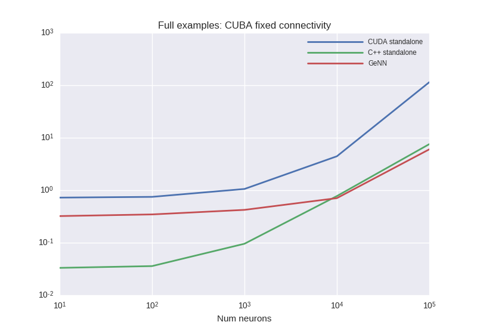
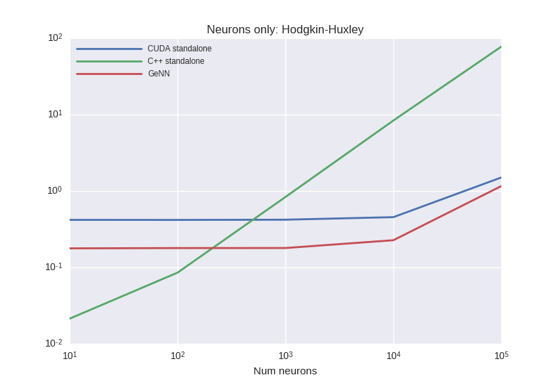
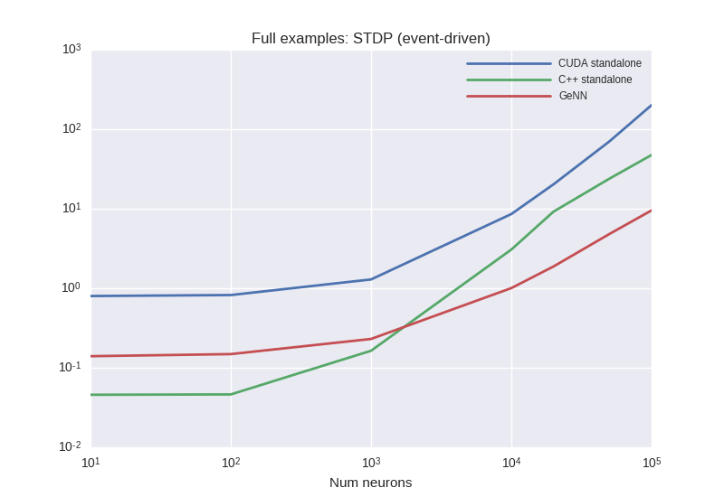
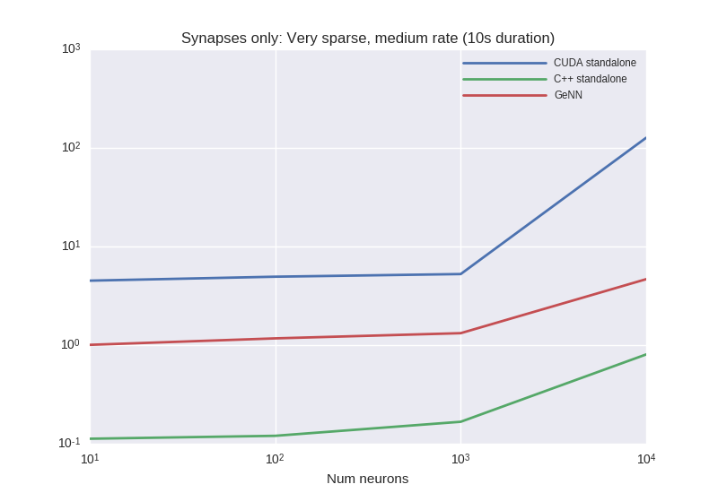
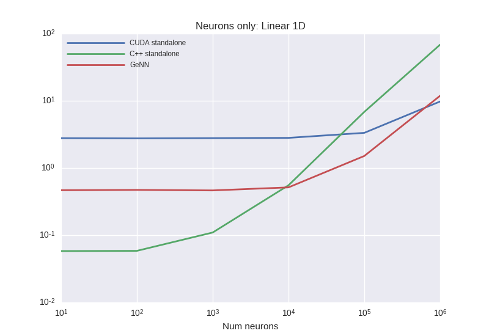

# Benchmark results from 03.02.2017
## Description:
Before implementation of `no_or_const_delay_mode`

## Results

### BrunelHakimModel

***

### BrunelHakimModelWithDelay

***

### CUBAFixedConnectivity

***

### HHNeuronsOnly

***

### LinearNeuronsOnly

***

### STDP

***

### STDPNotEventDriven

***

### STDPEventDriven

***

### VerySparseMediumRateSynapsesOnly

***

### VogelsWithSynapticDynamic

***
