# Benchmark results from 10.03.2017
## Description:
All tests with profiling informations, including new STDP versions with multiple pre-post pairs and traces in neuron variables.


## Last git log:
```
commit e5458ec69ab27edcc2271c0170e9dfcd7c1d360a
Author: Denis Alevi <mail@denisalevi.de>
Date:   Tue Mar 7 18:39:39 2017 +0100

    Implement correct profiling measurements
    
    The `profile` argument of `device.network_run()` can now be a bool or
    'blocking'. If True, GPU wall time is collected using cudaEvents. If
    'blocking', CPU wall times are recorded and `cudaDeviceSynchronize` is
    called at the end of each codeobject, to include kernel times as well.
    (#57)

```
There is also a `git diff` saved in the current directory.

## Results

### AdaptationOscillation
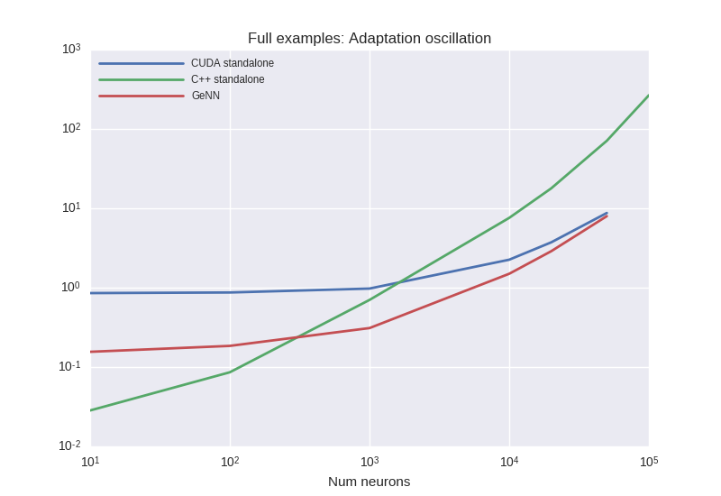

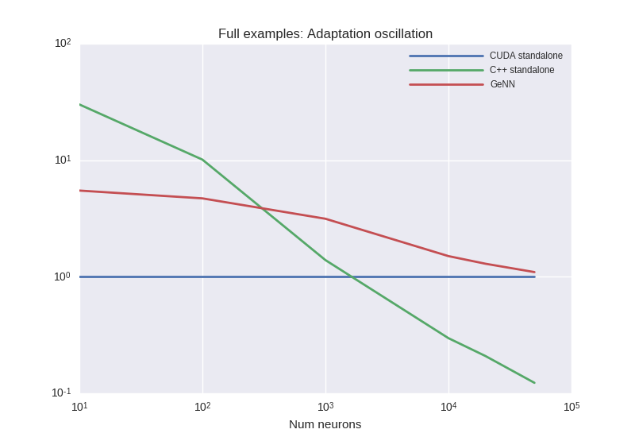

<details><summary>Examplary `nvprof` results for **CUDAStandaloneConfiguration**</summary><p>
Profile summary for `N = 1000`:

```
==16086== NVPROF is profiling process 16086, command: ./main
==16086== Profiling application: ./main
==16086== Profiling result:
Time(%)      Time     Calls       Avg       Min       Max  Name
 42.82%  167.81ms     10000  16.781us  2.9760us  74.336us  kernel_synapses_pre_codeobject(unsigned int, unsigned int, unsigned int, int*, unsigned int, double*, int, double*, int, int*, int, int*, double*, double*, int*, int, bool*)
 12.61%  49.422ms     10000  4.9420us  4.6080us  6.3040us  kernel_neurongroup_stateupdater_codeobject(unsigned int, unsigned int, double*, double*, double*, double*, double*, bool*)
 11.60%  45.467ms     10000  4.5460us  4.3520us  5.2800us  void gen_sequenced<curandStateXORWOW, float2, normal_args_st, __operator_&__(float2 curand_normal_scaled2<curandStateXORWOW>(curandStateXORWOW*, normal_args_st))>(curandStateXORWOW*, float2*, unsigned long, unsigned long, normal_args_st)
 11.20%  43.904ms     44543     985ns     928ns  65.440us  [CUDA memcpy HtoD]
  8.07%  31.627ms     10000  3.1620us  3.0400us  3.7440us  [CUDA memset]
  5.78%  22.652ms     10000  2.2650us  1.7600us  2.6880us  kernel_neurongroup_thresholder_codeobject(unsigned int, unsigned int, int*, double*, double*, double*, bool*)
  5.11%  20.029ms     10000  2.0020us  1.5360us  2.8480us  kernel_neurongroup_resetter_codeobject(unsigned int, unsigned int, int*, double*, double*, bool*)
  2.12%  8.2968ms         1  8.2968ms  8.2968ms  8.2968ms  generate_seed_pseudo(__int64, __int64, __int64, curandOrdering, curandStateXORWOW*, unsigned int*)
  0.45%  1.7693ms         1  1.7693ms  1.7693ms  1.7693ms  _run_synapses_pre_initialise_queue_kernel(unsigned int, unsigned int, unsigned int, double, unsigned int, unsigned int, bool)
  0.19%  731.65us        27  27.098us  2.2080us  120.90us  [CUDA memcpy DtoH]
  0.01%  56.512us         1  56.512us  56.512us  56.512us  synapses_pre_destroy(void)
  0.01%  49.824us         8  6.2280us  5.1200us  6.9440us  void gen_sequenced<curandStateXORWOW, float, int, __operator_&__(float curand_uniform_noargs<curandStateXORWOW>(curandStateXORWOW*, int))>(curandStateXORWOW*, float*, unsigned long, unsigned long, int)
  0.01%  20.928us         1  20.928us  20.928us  20.928us  synapses_pre_init(unsigned int, unsigned int, double*, int*, int*, double, int, int)
  0.00%  9.8560us         3  3.2850us  3.0080us  3.4880us  void thrust::system::cuda::detail::bulk_::detail::launch_by_value<unsigned int=0, thrust::system::cuda::detail::bulk_::detail::cuda_task<thrust::system::cuda::detail::bulk_::parallel_group<thrust::system::cuda::detail::bulk_::concurrent_group<thrust::system::cuda::detail::bulk_::agent<unsigned long=1>, unsigned long=0>, unsigned long=0>, thrust::system::cuda::detail::bulk_::detail::closure<thrust::system::cuda::detail::for_each_n_detail::for_each_kernel, thrust::tuple<thrust::system::cuda::detail::bulk_::detail::cursor<unsigned int=0>, thrust::device_ptr<double>, thrust::detail::wrapped_function<thrust::detail::device_generate_functor<thrust::detail::fill_functor<double>>, void>, unsigned int, thrust::null_type, thrust::null_type, thrust::null_type, thrust::null_type, thrust::null_type, thrust::null_type>>>>(unsigned long=1)
  0.00%  4.9920us         2  2.4960us  2.3360us  2.6560us  void thrust::system::cuda::detail::bulk_::detail::launch_by_value<unsigned int=0, thrust::system::cuda::detail::bulk_::detail::cuda_task<thrust::system::cuda::detail::bulk_::parallel_group<thrust::system::cuda::detail::bulk_::concurrent_group<thrust::system::cuda::detail::bulk_::agent<unsigned long=1>, unsigned long=0>, unsigned long=0>, thrust::system::cuda::detail::bulk_::detail::closure<thrust::system::cuda::detail::for_each_n_detail::for_each_kernel, thrust::tuple<thrust::system::cuda::detail::bulk_::detail::cursor<unsigned int=0>, thrust::device_ptr<int>, thrust::detail::wrapped_function<thrust::detail::device_generate_functor<thrust::detail::fill_functor<int>>, void>, unsigned int, thrust::null_type, thrust::null_type, thrust::null_type, thrust::null_type, thrust::null_type, thrust::null_type>>>>(unsigned long=1)
  0.00%  3.5840us         1  3.5840us  3.5840us  3.5840us  kernel_synapses_group_variable_set_conditional_codeobject_1(unsigned int, unsigned int, double*, int, int*)
  0.00%  3.2960us         1  3.2960us  3.2960us  3.2960us  kernel_synapses_group_variable_set_conditional_codeobject(unsigned int, unsigned int, double*, int, int*)
  0.00%  3.0080us         1  3.0080us  3.0080us  3.0080us  kernel_neurongroup_group_variable_set_conditional_codeobject(unsigned int, unsigned int, double*, float*, bool*)
  0.00%  2.8800us         1  2.8800us  2.8800us  2.8800us  kernel_neurongroup_group_variable_set_conditional_codeobject_1(unsigned int, unsigned int, double*, float*, bool*)

==16086== API calls:
Time(%)      Time     Calls       Avg       Min       Max  Name
 24.24%  515.75ms     50021  10.310us  8.5350us  533.28us  cudaLaunch
 18.48%  393.27ms     44555  8.8260us  6.4990us  1.2062ms  cudaMemcpy
 15.32%  326.07ms    140005  2.3290us     899ns  310.05us  cudaEventRecord
 14.47%  308.00ms         1  308.00ms  308.00ms  308.00ms  cudaDeviceSetLimit
  8.07%  171.79ms     14561  11.797us  8.1890us  317.77us  cudaMalloc
  4.85%  103.20ms     10000  10.319us  9.2710us  33.124us  cudaMemset
  4.18%  88.872ms     70000  1.2690us     929ns  302.89us  cudaEventElapsedTime
  3.79%  80.641ms     69993  1.1520us     707ns  383.46us  cudaEventQuery
  3.75%  79.836ms    430086     185ns     134ns  318.08us  cudaSetupArgument
  1.05%  22.332ms        20  1.1166ms  14.869us  13.100ms  cudaFree
  0.86%  18.316ms     60022     305ns     155ns  302.92us  cudaGetLastError
  0.80%  17.040ms     50021     340ns     227ns  287.33us  cudaConfigureCall
  0.07%  1.4261ms        31  46.004us     330ns  262.97us  cudaMemcpyAsync
  0.03%  736.48us         3  245.49us  218.67us  265.76us  cudaGetDeviceProperties
  0.02%  453.55us       166  2.7320us     122ns  98.348us  cuDeviceGetAttribute
  0.00%  83.142us         3  27.714us  9.5520us  48.084us  cudaMemcpyToSymbol
  0.00%  78.701us         2  39.350us  31.749us  46.952us  cuDeviceTotalMem
  0.00%  77.567us        28  2.7700us  1.9740us  6.7090us  cudaFuncGetAttributes
  0.00%  62.790us         2  31.395us  30.385us  32.405us  cuDeviceGetName
  0.00%  19.580us        14  1.3980us     614ns  5.6830us  cudaEventCreate
  0.00%  12.011us        16     750ns     311ns  3.7390us  cudaGetDevice
  0.00%  8.5000us         5  1.7000us  1.5340us  1.9150us  cudaEventCreateWithFlags
  0.00%  6.7980us         1  6.7980us  6.7980us  6.7980us  cudaDeviceSynchronize
  0.00%  6.2820us         1  6.2820us  6.2820us  6.2820us  cudaThreadSynchronize
  0.00%  5.7960us         5  1.1590us     945ns  1.6330us  cudaEventDestroy
  0.00%  4.5230us        11     411ns     299ns  1.1410us  cudaDeviceGetAttribute
  0.00%  1.9070us         3     635ns     210ns  1.1760us  cuDeviceGetCount
  0.00%     803ns         3     267ns     189ns     367ns  cuDeviceGet
  0.00%     718ns         1     718ns     718ns     718ns  cuInit
  0.00%     402ns         1     402ns     402ns     402ns  cuDriverGetVersion

```

</p></details>


<details><summary>Examplary `nvprof` results for **GeNNConfiguration**</summary><p>
Profile summary for `N = 1000`:

```
==16441== NVPROF is profiling process 16441, command: ./main test 10.0 1
==16441== Profiling application: ./main test 10.0 1
==16441== Profiling result:
Time(%)      Time     Calls       Avg       Min       Max  Name
 52.32%  1.39475s    100000  13.947us  1.8560us  1.0908ms  calcSynapses
 47.64%  1.26994s    100000  12.699us  9.8880us  20.224us  calcNeurons
  0.03%  893.51us        48  18.614us     960ns  127.91us  [CUDA memcpy HtoD]
  0.01%  276.16us        12  23.013us  1.9520us  121.50us  [CUDA memcpy DtoH]

==16441== API calls:
Time(%)      Time     Calls       Avg       Min       Max  Name
 88.73%  2.76141s    200000  13.807us  7.2520us  1.0943ms  cudaLaunch
  6.90%  214.62ms        13  16.509ms  10.112us  212.55ms  cudaHostAlloc
  2.24%  69.811ms    200000     349ns     241ns  310.54us  cudaConfigureCall
  1.53%  47.539ms    200000     237ns     198ns  10.836us  cudaSetupArgument
  0.57%  17.806ms        64  278.23us     249ns  15.880ms  cudaMemcpy
  0.02%  715.18us        13  55.013us  7.9520us  135.46us  cudaMalloc
  0.01%  225.50us        83  2.7160us     138ns  97.036us  cuDeviceGetAttribute
  0.00%  31.062us         1  31.062us  31.062us  31.062us  cuDeviceTotalMem
  0.00%  25.354us         1  25.354us  25.354us  25.354us  cuDeviceGetName
  0.00%  13.605us         1  13.605us  13.605us  13.605us  cudaSetDevice
  0.00%  11.171us        13     859ns     444ns  2.3530us  cudaGetSymbolAddress
  0.00%  1.4170us         2     708ns     389ns  1.0280us  cuDeviceGetCount
  0.00%  1.4150us         1  1.4150us  1.4150us  1.4150us  cudaGetDeviceCount
  0.00%     590ns         2     295ns     210ns     380ns  cuDeviceGet

```

</p></details>


***

### BrunelHakimModelHeterogeneousDelay


<details><summary>Examplary `nvprof` results for **CUDAStandaloneConfiguration**</summary><p>
Profile summary for `N = 1000`:

```
==2477== NVPROF is profiling process 2477, command: ./main
==2477== Profiling application: ./main
==2477== Profiling result:
Time(%)      Time     Calls       Avg       Min       Max  Name
 65.15%  287.82ms      1000  287.82us  1.8240us  3.6523ms  _run_synapses_pre_push_spikes_push_kernel(unsigned int, unsigned int, unsigned int, int*)
 17.93%  79.227ms     78038  1.0150us     928ns  1.2808ms  [CUDA memcpy HtoD]
  7.48%  33.052ms      1000  33.052us  2.4960us  69.920us  kernel_synapses_pre_codeobject(unsigned int, unsigned int, unsigned int, int*, unsigned int, double*, int, int*, int, double*, int*, int, double*, int*)
  2.50%  11.050ms       115  96.082us  2.1120us  2.4065ms  [CUDA memcpy DtoH]
  1.86%  8.2181ms         1  8.2181ms  8.2181ms  8.2181ms  generate_seed_pseudo(__int64, __int64, __int64, curandOrdering, curandStateXORWOW*, unsigned int*)
  1.06%  4.6688ms      1000  4.6680us  4.4160us  6.4000us  kernel_neurongroup_stateupdater_codeobject(unsigned int, unsigned int, double*, double*, double*, double*, bool*)
  1.00%  4.4115ms      1000  4.4110us  4.0960us  5.2480us  void gen_sequenced<curandStateXORWOW, float2, normal_args_st, __operator_&__(float2 curand_normal_scaled2<curandStateXORWOW>(curandStateXORWOW*, normal_args_st))>(curandStateXORWOW*, float2*, unsigned long, unsigned long, normal_args_st)
  0.72%  3.1932ms      1000  3.1930us  3.0720us  3.5520us  [CUDA memset]
  0.71%  3.1235ms         1  3.1235ms  3.1235ms  3.1235ms  _run_synapses_pre_initialise_queue_kernel(unsigned int, unsigned int, unsigned int, double, unsigned int, unsigned int, bool)
  0.62%  2.7383ms      1000  2.7380us  2.5280us  3.1360us  _run_synapses_pre_push_spikes_advance_kernel(void)
  0.41%  1.8112ms      1000  1.8110us  1.6320us  2.3360us  kernel_neurongroup_thresholder_codeobject(unsigned int, unsigned int, int*, double*, double*, double*, bool*)
  0.32%  1.4302ms      1000  1.4300us  1.2800us  1.7600us  kernel_neurongroup_resetter_codeobject(unsigned int, unsigned int, double*, int*)
  0.16%  696.70us       101  6.8980us  6.2720us  51.232us  void gen_sequenced<curandStateXORWOW, float, int, __operator_&__(float curand_uniform_noargs<curandStateXORWOW>(curandStateXORWOW*, int))>(curandStateXORWOW*, float*, unsigned long, unsigned long, int)
  0.03%  147.78us         1  147.78us  147.78us  147.78us  synapses_pre_destroy(void)
  0.01%  61.696us         2  30.848us  30.720us  30.976us  void thrust::system::cuda::detail::bulk_::detail::launch_by_value<unsigned int=0, thrust::system::cuda::detail::bulk_::detail::cuda_task<thrust::system::cuda::detail::bulk_::parallel_group<thrust::system::cuda::detail::bulk_::concurrent_group<thrust::system::cuda::detail::bulk_::agent<unsigned long=1>, unsigned long=0>, unsigned long=0>, thrust::system::cuda::detail::bulk_::detail::closure<thrust::system::cuda::detail::for_each_n_detail::for_each_kernel, thrust::tuple<thrust::system::cuda::detail::bulk_::detail::cursor<unsigned int=0>, thrust::device_ptr<double>, thrust::detail::wrapped_function<thrust::detail::device_generate_functor<thrust::detail::fill_functor<double>>, void>, unsigned int, thrust::null_type, thrust::null_type, thrust::null_type, thrust::null_type, thrust::null_type, thrust::null_type>>>>(unsigned long=1)
  0.01%  53.921us         1  53.921us  53.921us  53.921us  kernel_synapses_group_variable_set_conditional_codeobject(unsigned int, unsigned int, float*, int*, double*, int)
  0.01%  30.016us         2  15.008us  15.008us  15.008us  void thrust::system::cuda::detail::bulk_::detail::launch_by_value<unsigned int=0, thrust::system::cuda::detail::bulk_::detail::cuda_task<thrust::system::cuda::detail::bulk_::parallel_group<thrust::system::cuda::detail::bulk_::concurrent_group<thrust::system::cuda::detail::bulk_::agent<unsigned long=1>, unsigned long=0>, unsigned long=0>, thrust::system::cuda::detail::bulk_::detail::closure<thrust::system::cuda::detail::for_each_n_detail::for_each_kernel, thrust::tuple<thrust::system::cuda::detail::bulk_::detail::cursor<unsigned int=0>, thrust::device_ptr<int>, thrust::detail::wrapped_function<thrust::detail::device_generate_functor<thrust::detail::fill_functor<int>>, void>, unsigned int, thrust::null_type, thrust::null_type, thrust::null_type, thrust::null_type, thrust::null_type, thrust::null_type>>>>(unsigned long=1)
  0.00%  20.864us         1  20.864us  20.864us  20.864us  synapses_pre_init(unsigned int, unsigned int, double*, int*, int*, double, int, int)

==2477== API calls:
Time(%)      Time     Calls       Avg       Min       Max  Name
 41.14%  927.51ms     78134  11.870us  6.4380us  23.265ms  cudaMemcpy
 39.84%  898.25ms     75028  11.972us  7.1540us  2.4539ms  cudaMalloc
 10.88%  245.33ms         1  245.33ms  245.33ms  245.33ms  cudaDeviceSetLimit
  3.22%  72.635ms      7110  10.215us  8.6250us  532.39us  cudaLaunch
  1.43%  32.245ms     14004  2.3020us     994ns  17.592us  cudaEventRecord
  1.00%  22.435ms        18  1.2464ms  8.3190us  13.207ms  cudaFree
  0.58%  12.995ms        27  481.29us     172ns  2.5672ms  cudaMemcpyAsync
  0.46%  10.286ms      1000  10.285us  9.7170us  22.797us  cudaMemset
  0.41%  9.1987ms      7000  1.3140us  1.0770us  6.3330us  cudaEventElapsedTime
  0.39%  8.8484ms      6993  1.2650us     951ns  305.45us  cudaEventQuery
  0.36%  8.0926ms     41536     194ns     147ns  326.98us  cudaSetupArgument
  0.11%  2.4959ms      7110     351ns     218ns  326.40us  cudaConfigureCall
  0.11%  2.3876ms      8205     290ns     152ns  1.3160us  cudaGetLastError
  0.03%  753.09us         3  251.03us  218.63us  300.61us  cudaGetDeviceProperties
  0.03%  565.07us       166  3.4040us     124ns  153.60us  cuDeviceGetAttribute
  0.01%  302.48us         8  37.810us  10.508us  48.453us  cudaMemcpyToSymbol
  0.00%  74.730us         2  37.365us  31.742us  42.988us  cuDeviceTotalMem
  0.00%  73.805us         2  36.902us  28.744us  45.061us  cuDeviceGetName
  0.00%  60.789us        21  2.8940us  1.9870us  7.6630us  cudaFuncGetAttributes
  0.00%  14.811us        14  1.0570us     579ns  5.2770us  cudaEventCreate
  0.00%  11.787us        13     906ns     311ns  3.6980us  cudaGetDevice
  0.00%  7.0190us         4  1.7540us  1.5440us  2.0200us  cudaEventCreateWithFlags
  0.00%  6.1140us         1  6.1140us  6.1140us  6.1140us  cudaThreadSynchronize
  0.00%  5.9080us         1  5.9080us  5.9080us  5.9080us  cudaDeviceSynchronize
  0.00%  5.3950us        11     490ns     290ns  1.9760us  cudaDeviceGetAttribute
  0.00%  5.3370us         4  1.3340us  1.0090us  1.8480us  cudaEventDestroy
  0.00%  2.9090us         3     969ns     215ns  1.4170us  cuDeviceGetCount
  0.00%  1.2190us         3     406ns     236ns     494ns  cuDeviceGet
  0.00%     622ns         1     622ns     622ns     622ns  cuInit
  0.00%     346ns         1     346ns     346ns     346ns  cuDriverGetVersion

```

</p></details>


<details><summary>Examplary `nvprof` results for **GeNNConfiguration**</summary><p>
Profile summary for `N = 1000`:

```
==2807== NVPROF is profiling process 2807, command: ./main test 10.0 1
==2807== Profiling application: ./main test 10.0 1
==2807== Profiling result:
Time(%)      Time     Calls       Avg       Min       Max  Name
 79.50%  1.14421s    100000  11.442us  9.3120us  18.624us  calcNeurons
 19.72%  283.77ms    100000  2.8370us  1.8880us  19.808us  calcSynapses
  0.62%  8.8557ms        40  221.39us     960ns  2.5146ms  [CUDA memcpy HtoD]
  0.17%  2.4222ms        12  201.85us  1.9840us  2.3870ms  [CUDA memcpy DtoH]

==2807== API calls:
Time(%)      Time     Calls       Avg       Min       Max  Name
 82.54%  1.65440s    200000  8.2710us  7.0520us  366.40us  cudaLaunch
 11.14%  223.38ms        11  20.307ms  12.982us  217.99ms  cudaHostAlloc
  3.30%  66.206ms    200000     331ns     234ns  340.62us  cudaConfigureCall
  2.35%  47.195ms    200000     235ns     188ns  15.711us  cudaSetupArgument
  0.60%  12.069ms        53  227.71us     686ns  2.5283ms  cudaMemcpy
  0.04%  735.71us        11  66.882us  6.9950us  163.34us  cudaMalloc
  0.02%  339.26us        83  4.0870us     236ns  161.30us  cuDeviceGetAttribute
  0.00%  44.012us         1  44.012us  44.012us  44.012us  cuDeviceTotalMem
  0.00%  40.311us         1  40.311us  40.311us  40.311us  cuDeviceGetName
  0.00%  11.614us         1  11.614us  11.614us  11.614us  cudaSetDevice
  0.00%  11.139us        11  1.0120us     468ns  1.9990us  cudaGetSymbolAddress
  0.00%  2.5040us         1  2.5040us  2.5040us  2.5040us  cudaGetDeviceCount
  0.00%  2.4000us         2  1.2000us     888ns  1.5120us  cuDeviceGetCount
  0.00%     981ns         2     490ns     464ns     517ns  cuDeviceGet

```

</p></details>


***

### BrunelHakimModelScalarDelay
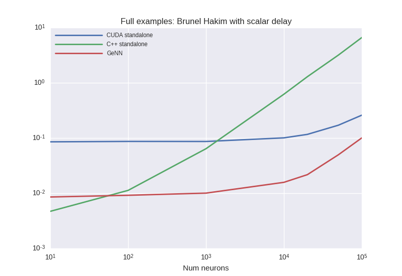

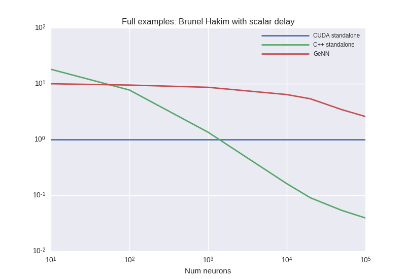

<details><summary>Examplary `nvprof` results for **CUDAStandaloneConfiguration**</summary><p>
Profile summary for `N = 1000`:

```
==21144== NVPROF is profiling process 21144, command: ./main
==21144== Profiling application: ./main
==21144== Profiling result:
Time(%)      Time     Calls       Avg       Min       Max  Name
 35.41%  20.326ms     18031  1.1270us     928ns  1.2755ms  [CUDA memcpy HtoD]
 14.44%  8.2888ms         1  8.2888ms  8.2888ms  8.2888ms  generate_seed_pseudo(__int64, __int64, __int64, curandOrdering, curandStateXORWOW*, unsigned int*)
 10.78%  6.1880ms       114  54.280us  2.1440us  2.3850ms  [CUDA memcpy DtoH]
  8.21%  4.7133ms      1000  4.7130us  4.4800us  6.4320us  kernel_neurongroup_stateupdater_codeobject(unsigned int, unsigned int, double*, double*, double*, double*, bool*)
  7.99%  4.5857ms      1000  4.5850us  2.8800us  30.656us  kernel_synapses_pre_codeobject(unsigned int, unsigned int, unsigned int, int*, unsigned int, double*, int, int*, int, double*, int*, int, double*, int*)
  7.62%  4.3747ms      1000  4.3740us  4.1600us  5.1520us  void gen_sequenced<curandStateXORWOW, float2, normal_args_st, __operator_&__(float2 curand_normal_scaled2<curandStateXORWOW>(curandStateXORWOW*, normal_args_st))>(curandStateXORWOW*, float2*, unsigned long, unsigned long, normal_args_st)
  5.40%  3.1002ms      1000  3.1000us  3.0400us  3.5200us  [CUDA memset]
  3.15%  1.8070ms      1000  1.8060us  1.6960us  2.4320us  kernel_neurongroup_thresholder_codeobject(unsigned int, unsigned int, int*, double*, double*, double*, bool*)
  3.08%  1.7680ms         1  1.7680ms  1.7680ms  1.7680ms  _run_synapses_pre_initialise_queue_kernel(unsigned int, unsigned int, unsigned int, double, unsigned int, unsigned int, bool)
  2.52%  1.4436ms      1000  1.4430us  1.3760us  1.7280us  kernel_neurongroup_resetter_codeobject(unsigned int, unsigned int, double*, int*)
  1.15%  658.27us       100  6.5820us  6.3680us  6.9440us  void gen_sequenced<curandStateXORWOW, float, int, __operator_&__(float curand_uniform_noargs<curandStateXORWOW>(curandStateXORWOW*, int))>(curandStateXORWOW*, float*, unsigned long, unsigned long, int)
  0.10%  56.576us         1  56.576us  56.576us  56.576us  synapses_pre_destroy(void)
  0.06%  33.216us         2  16.608us  2.3040us  30.912us  void thrust::system::cuda::detail::bulk_::detail::launch_by_value<unsigned int=0, thrust::system::cuda::detail::bulk_::detail::cuda_task<thrust::system::cuda::detail::bulk_::parallel_group<thrust::system::cuda::detail::bulk_::concurrent_group<thrust::system::cuda::detail::bulk_::agent<unsigned long=1>, unsigned long=0>, unsigned long=0>, thrust::system::cuda::detail::bulk_::detail::closure<thrust::system::cuda::detail::for_each_n_detail::for_each_kernel, thrust::tuple<thrust::system::cuda::detail::bulk_::detail::cursor<unsigned int=0>, thrust::device_ptr<double>, thrust::detail::wrapped_function<thrust::detail::device_generate_functor<thrust::detail::fill_functor<double>>, void>, unsigned int, thrust::null_type, thrust::null_type, thrust::null_type, thrust::null_type, thrust::null_type, thrust::null_type>>>>(unsigned long=1)
  0.05%  30.497us         2  15.248us  15.232us  15.265us  void thrust::system::cuda::detail::bulk_::detail::launch_by_value<unsigned int=0, thrust::system::cuda::detail::bulk_::detail::cuda_task<thrust::system::cuda::detail::bulk_::parallel_group<thrust::system::cuda::detail::bulk_::concurrent_group<thrust::system::cuda::detail::bulk_::agent<unsigned long=1>, unsigned long=0>, unsigned long=0>, thrust::system::cuda::detail::bulk_::detail::closure<thrust::system::cuda::detail::for_each_n_detail::for_each_kernel, thrust::tuple<thrust::system::cuda::detail::bulk_::detail::cursor<unsigned int=0>, thrust::device_ptr<int>, thrust::detail::wrapped_function<thrust::detail::device_generate_functor<thrust::detail::fill_functor<int>>, void>, unsigned int, thrust::null_type, thrust::null_type, thrust::null_type, thrust::null_type, thrust::null_type, thrust::null_type>>>>(unsigned long=1)
  0.04%  21.312us         1  21.312us  21.312us  21.312us  synapses_pre_init(unsigned int, unsigned int, double*, int*, int*, double, int, int)

==21144== API calls:
Time(%)      Time     Calls       Avg       Min       Max  Name
 40.14%  295.42ms         1  295.42ms  295.42ms  295.42ms  cudaDeviceSetLimit
 21.24%  156.32ms     15042  10.392us  8.1800us  1.5871ms  cudaMalloc
 17.70%  130.24ms     18130  7.1830us  6.0520us  880.72us  cudaMemcpy
  7.15%  52.652ms      5108  10.307us  8.6930us  549.80us  cudaLaunch
  4.39%  32.310ms     14004  2.3070us  1.0450us  315.51us  cudaEventRecord
  3.09%  22.708ms        18  1.2616ms  12.028us  13.454ms  cudaFree
  1.39%  10.252ms      1000  10.252us  9.6540us  68.589us  cudaMemset
  1.10%  8.0999ms      7000  1.1570us     935ns  12.482us  cudaEventElapsedTime
  1.07%  7.8983ms        28  282.08us     252ns  2.5556ms  cudaMemcpyAsync
  1.03%  7.5699ms      6993  1.0820us     687ns  6.8030us  cudaEventQuery
  0.97%  7.1697ms     37525     191ns     149ns  313.37us  cudaSetupArgument
  0.26%  1.8924ms      6202     305ns     165ns  5.7280us  cudaGetLastError
  0.25%  1.8577ms      5108     363ns     275ns  11.036us  cudaConfigureCall
  0.09%  691.77us         3  230.59us  217.31us  240.11us  cudaGetDeviceProperties
  0.06%  472.31us       166  2.8450us     121ns  106.34us  cuDeviceGetAttribute
  0.01%  83.051us         3  27.683us  9.1910us  47.970us  cudaMemcpyToSymbol
  0.01%  65.673us         2  32.836us  31.582us  34.091us  cuDeviceTotalMem
  0.01%  61.955us         2  30.977us  29.719us  32.236us  cuDeviceGetName
  0.01%  54.534us        20  2.7260us  1.9980us  6.2720us  cudaFuncGetAttributes
  0.00%  16.247us        14  1.1600us     592ns  5.8860us  cudaEventCreate
  0.00%  11.293us        13     868ns     288ns  3.5550us  cudaGetDevice
  0.00%  9.7170us         1  9.7170us  9.7170us  9.7170us  cudaThreadSynchronize
  0.00%  7.5800us         4  1.8950us  1.6170us  2.5190us  cudaEventCreateWithFlags
  0.00%  6.2980us         1  6.2980us  6.2980us  6.2980us  cudaDeviceSynchronize
  0.00%  5.3170us         4  1.3290us  1.0650us  1.7670us  cudaEventDestroy
  0.00%  4.2470us        11     386ns     279ns  1.1190us  cudaDeviceGetAttribute
  0.00%  1.7590us         3     586ns     197ns     907ns  cuDeviceGetCount
  0.00%     885ns         3     295ns     225ns     364ns  cuDeviceGet
  0.00%     646ns         1     646ns     646ns     646ns  cuInit
  0.00%     369ns         1     369ns     369ns     369ns  cuDriverGetVersion

```

</p></details>


<details><summary>Examplary `nvprof` results for **GeNNConfiguration**</summary><p>
Profile summary for `N = 1000`:

```
==21451== NVPROF is profiling process 21451, command: ./main test 10.0 1
==21451== Profiling application: ./main test 10.0 1
==21451== Profiling result:
Time(%)      Time     Calls       Avg       Min       Max  Name
 76.08%  1.14861s    100000  11.486us  9.3440us  17.696us  calcNeurons
 23.17%  349.76ms    100000  3.4970us  2.4960us  29.248us  calcSynapses
  0.59%  8.9396ms        41  218.04us     960ns  2.5144ms  [CUDA memcpy HtoD]
  0.16%  2.4181ms        10  241.81us  2.0160us  2.3870ms  [CUDA memcpy DtoH]

==21451== API calls:
Time(%)      Time     Calls       Avg       Min       Max  Name
 83.01%  1.66501s    200000  8.3250us  7.0940us  363.23us  cudaLaunch
 10.41%  208.75ms        11  18.977ms  8.8570us  202.83ms  cudaHostAlloc
  3.40%  68.253ms    200000     341ns     230ns  375.56us  cudaConfigureCall
  2.46%  49.264ms    200000     246ns     208ns  10.388us  cudaSetupArgument
  0.67%  13.369ms        53  252.25us     321ns  2.5289ms  cudaMemcpy
  0.04%  771.80us        11  70.163us  5.9580us  136.71us  cudaMalloc
  0.01%  228.41us        83  2.7510us     137ns  98.371us  cuDeviceGetAttribute
  0.00%  31.536us         1  31.536us  31.536us  31.536us  cuDeviceTotalMem
  0.00%  29.901us         1  29.901us  29.901us  29.901us  cuDeviceGetName
  0.00%  11.238us         1  11.238us  11.238us  11.238us  cudaSetDevice
  0.00%  10.429us        11     948ns     391ns  2.3340us  cudaGetSymbolAddress
  0.00%  8.1240us         1  8.1240us  8.1240us  8.1240us  cudaMemcpyToSymbol
  0.00%  1.8200us         2     910ns     591ns  1.2290us  cuDeviceGetCount
  0.00%  1.4340us         1  1.4340us  1.4340us  1.4340us  cudaGetDeviceCount
  0.00%     639ns         2     319ns     257ns     382ns  cuDeviceGet

```

</p></details>


***

### COBAHH
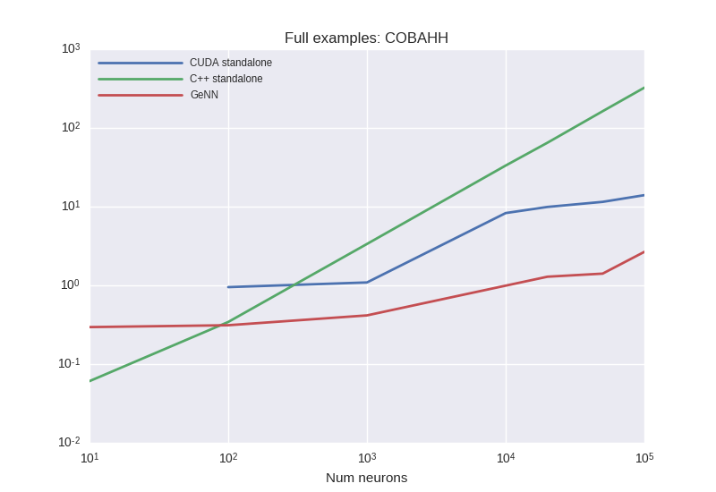
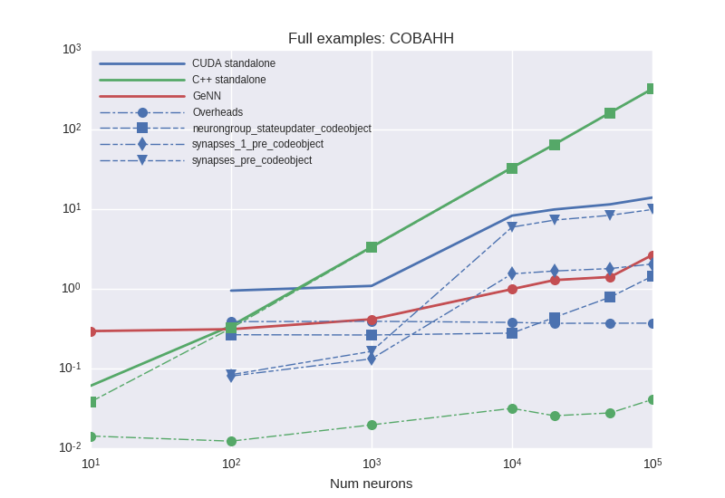


<details><summary>Examplary `nvprof` results for **CUDAStandaloneConfiguration**</summary><p>
Profile summary for `N = 1000`:

```
==724== NVPROF is profiling process 724, command: ./main
==724== Profiling application: ./main
==724== Profiling result:
Time(%)      Time     Calls       Avg       Min       Max  Name
 34.60%  180.81ms     10000  18.080us  17.952us  20.448us  kernel_neurongroup_stateupdater_codeobject(unsigned int, unsigned int, double*, double*, double*, bool*, double*, double*, double*, double*, double*, double*)
 26.03%  136.02ms     10000  13.602us  3.7440us  41.504us  kernel_synapses_pre_codeobject(unsigned int, unsigned int, unsigned int, int*, unsigned int, double*, int, int*, int, double*, double*, int*, int, int*)
 18.79%  98.190ms     10000  9.8190us  4.0640us  26.304us  kernel_synapses_1_pre_codeobject(unsigned int, unsigned int, unsigned int, int*, unsigned int, double*, int, int*, int, double*, int*, int, int*, double*)
  7.74%  40.468ms     41198     982ns     928ns  32.960us  [CUDA memcpy HtoD]
  6.28%  32.824ms     10000  3.2820us  3.2320us  3.8080us  [CUDA memset]
  4.38%  22.905ms     10000  2.2900us  1.7600us  2.4320us  kernel_neurongroup_thresholder_codeobject(unsigned int, unsigned int, int*, double*, double*, double*, bool*)
  1.59%  8.3298ms         1  8.3298ms  8.3298ms  8.3298ms  generate_seed_pseudo(__int64, __int64, __int64, curandOrdering, curandStateXORWOW*, unsigned int*)
  0.32%  1.6937ms       133  12.734us  2.1760us  40.960us  [CUDA memcpy DtoH]
  0.13%  658.43us       100  6.5840us  6.3680us  7.1040us  void gen_sequenced<curandStateXORWOW, float, int, __operator_&__(float curand_uniform_noargs<curandStateXORWOW>(curandStateXORWOW*, int))>(curandStateXORWOW*, float*, unsigned long, unsigned long, int)
  0.05%  260.74us         1  260.74us  260.74us  260.74us  _run_synapses_pre_initialise_queue_kernel(unsigned int, unsigned int, unsigned int, double, unsigned int, unsigned int, bool)
  0.05%  250.82us         1  250.82us  250.82us  250.82us  _run_synapses_1_pre_initialise_queue_kernel(unsigned int, unsigned int, unsigned int, double, unsigned int, unsigned int, bool)
  0.01%  26.912us         1  26.912us  26.912us  26.912us  synapses_pre_destroy(void)
  0.00%  24.096us         1  24.096us  24.096us  24.096us  synapses_1_pre_destroy(void)
  0.00%  20.544us         1  20.544us  20.544us  20.544us  synapses_pre_init(unsigned int, unsigned int, double*, int*, int*, double, int, int)
  0.00%  16.960us         1  16.960us  16.960us  16.960us  synapses_1_pre_init(unsigned int, unsigned int, double*, int*, int*, double, int, int)
  0.00%  13.952us         3  4.6500us  4.4800us  4.9280us  void gen_sequenced<curandStateXORWOW, float2, normal_args_st, __operator_&__(float2 curand_normal_scaled2<curandStateXORWOW>(curandStateXORWOW*, normal_args_st))>(curandStateXORWOW*, float2*, unsigned long, unsigned long, normal_args_st)
  0.00%  8.9600us         4  2.2400us  1.9200us  2.6880us  void thrust::system::cuda::detail::bulk_::detail::launch_by_value<unsigned int=0, thrust::system::cuda::detail::bulk_::detail::cuda_task<thrust::system::cuda::detail::bulk_::parallel_group<thrust::system::cuda::detail::bulk_::concurrent_group<thrust::system::cuda::detail::bulk_::agent<unsigned long=1>, unsigned long=0>, unsigned long=0>, thrust::system::cuda::detail::bulk_::detail::closure<thrust::system::cuda::detail::for_each_n_detail::for_each_kernel, thrust::tuple<thrust::system::cuda::detail::bulk_::detail::cursor<unsigned int=0>, thrust::device_ptr<double>, thrust::detail::wrapped_function<thrust::detail::device_generate_functor<thrust::detail::fill_functor<double>>, void>, unsigned int, thrust::null_type, thrust::null_type, thrust::null_type, thrust::null_type, thrust::null_type, thrust::null_type>>>>(unsigned long=1)
  0.00%  7.9360us         4  1.9840us  1.8240us  2.0800us  void thrust::system::cuda::detail::bulk_::detail::launch_by_value<unsigned int=0, thrust::system::cuda::detail::bulk_::detail::cuda_task<thrust::system::cuda::detail::bulk_::parallel_group<thrust::system::cuda::detail::bulk_::concurrent_group<thrust::system::cuda::detail::bulk_::agent<unsigned long=1>, unsigned long=0>, unsigned long=0>, thrust::system::cuda::detail::bulk_::detail::closure<thrust::system::cuda::detail::for_each_n_detail::for_each_kernel, thrust::tuple<thrust::system::cuda::detail::bulk_::detail::cursor<unsigned int=0>, thrust::device_ptr<int>, thrust::detail::wrapped_function<thrust::detail::device_generate_functor<thrust::detail::fill_functor<int>>, void>, unsigned int, thrust::null_type, thrust::null_type, thrust::null_type, thrust::null_type, thrust::null_type, thrust::null_type>>>>(unsigned long=1)
  0.00%  2.4640us         1  2.4640us  2.4640us  2.4640us  kernel_neurongroup_group_variable_set_conditional_codeobject_1(unsigned int, unsigned int, float*, double*)
  0.00%  2.4000us         1  2.4000us  2.4000us  2.4000us  kernel_neurongroup_group_variable_set_conditional_codeobject_2(unsigned int, unsigned int, float*, double*)
  0.00%  2.4000us         1  2.4000us  2.4000us  2.4000us  kernel_neurongroup_group_variable_set_conditional_codeobject(unsigned int, unsigned int, float*, double*)

==724== API calls:
Time(%)      Time     Calls       Avg       Min       Max  Name
 20.24%  416.86ms     40121  10.390us  8.4170us  531.15us  cudaLaunch
 19.50%  401.49ms     41305  9.7200us  6.2770us  324.03us  cudaMemcpy
 17.64%  363.22ms    160008  2.2690us     860ns  1.2000ms  cudaEventRecord
 13.90%  286.21ms         1  286.21ms  286.21ms  286.21ms  cudaDeviceSetLimit
  6.16%  126.84ms     11196  11.328us  7.0220us  155.52us  cudaMalloc
  5.30%  109.22ms    470571     232ns     187ns  318.49us  cudaSetupArgument
  5.13%  105.65ms     80000  1.3200us     984ns  429.09us  cudaEventElapsedTime
  5.09%  104.79ms     10000  10.478us  9.1590us  337.93us  cudaMemset
  4.40%  90.643ms     79992  1.1330us     762ns  324.50us  cudaEventQuery
  1.08%  22.207ms        32  693.95us  12.225us  13.288ms  cudaFree
  0.81%  16.675ms     40121     415ns     272ns  316.37us  cudaConfigureCall
  0.63%  12.939ms     40211     321ns     202ns     948ns  cudaGetLastError
  0.05%  1.0686ms        54  19.788us     354ns  185.01us  cudaMemcpyAsync
  0.03%  695.78us         3  231.93us  218.49us  242.10us  cudaGetDeviceProperties
  0.02%  456.61us       166  2.7500us     160ns  97.841us  cuDeviceGetAttribute
  0.00%  98.428us        39  2.5230us  2.0130us  6.7340us  cudaFuncGetAttributes
  0.00%  89.767us         4  22.441us  12.188us  40.684us  cudaMemcpyToSymbol
  0.00%  62.981us         2  31.490us  31.214us  31.767us  cuDeviceTotalMem
  0.00%  57.460us         2  28.730us  27.828us  29.632us  cuDeviceGetName
  0.00%  18.699us        16  1.1680us     619ns  5.2220us  cudaEventCreate
  0.00%  16.531us        25     661ns     349ns  3.7730us  cudaGetDevice
  0.00%  12.624us         8  1.5780us  1.3830us  2.0840us  cudaEventCreateWithFlags
  0.00%  12.170us         1  12.170us  12.170us  12.170us  cudaThreadSynchronize
  0.00%  7.5390us         8     942ns     759ns  1.6320us  cudaEventDestroy
  0.00%  6.4920us         1  6.4920us  6.4920us  6.4920us  cudaDeviceSynchronize
  0.00%  5.4000us        11     490ns     352ns  1.2290us  cudaDeviceGetAttribute
  0.00%  1.7540us         3     584ns     249ns     964ns  cuDeviceGetCount
  0.00%     890ns         3     296ns     273ns     336ns  cuDeviceGet
  0.00%     807ns         1     807ns     807ns     807ns  cuInit
  0.00%     392ns         1     392ns     392ns     392ns  cuDriverGetVersion

```

</p></details>


<details><summary>Examplary `nvprof` results for **GeNNConfiguration**</summary><p>
Profile summary for `N = 1000`:

```
==1123== NVPROF is profiling process 1123, command: ./main test 10.0 1
==1123== Profiling application: ./main test 10.0 1
==1123== Profiling result:
Time(%)      Time     Calls       Avg       Min       Max  Name
 64.06%  2.55957s    100000  25.595us  23.776us  28.352us  calcNeurons
 35.93%  1.43573s    100000  14.357us  2.4320us  42.144us  calcSynapses
  0.01%  286.24us        68  4.2090us     960ns  42.880us  [CUDA memcpy HtoD]
  0.00%  108.29us        18  6.0160us  1.9840us  40.704us  [CUDA memcpy DtoH]

==1123== API calls:
Time(%)      Time     Calls       Avg       Min       Max  Name
 91.66%  4.05839s    200000  20.291us  7.3500us  358.49us  cudaLaunch
  4.81%  212.91ms        19  11.206ms  9.3750us  210.52ms  cudaHostAlloc
  1.80%  79.818ms    200000     399ns     253ns  358.09us  cudaConfigureCall
  1.14%  50.289ms    200000     251ns     203ns  331.79us  cudaSetupArgument
  0.56%  24.831ms        88  282.17us     654ns  23.265ms  cudaMemcpy
  0.02%  864.52us        19  45.501us  8.1920us  165.21us  cudaMalloc
  0.01%  332.65us        83  4.0070us     136ns  140.22us  cuDeviceGetAttribute
  0.00%  75.071us         1  75.071us  75.071us  75.071us  cuDeviceGetName
  0.00%  57.356us         1  57.356us  57.356us  57.356us  cuDeviceTotalMem
  0.00%  17.842us        19     939ns     393ns  2.2080us  cudaGetSymbolAddress
  0.00%  17.252us         1  17.252us  17.252us  17.252us  cudaSetDevice
  0.00%  2.8880us         2  1.4440us  1.1820us  1.7060us  cuDeviceGetCount
  0.00%  2.3330us         1  2.3330us  2.3330us  2.3330us  cudaGetDeviceCount
  0.00%  2.0760us         2  1.0380us  1.0060us  1.0700us  cuDeviceGet

```

</p></details>


***

### COBAHHFixedConnectivity
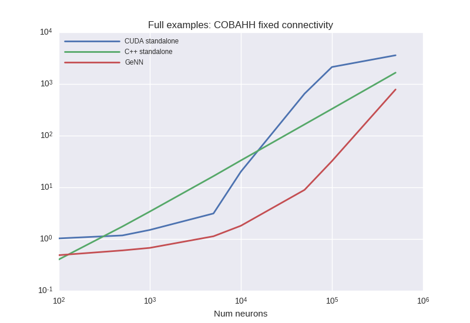


<details><summary>Examplary `nvprof` results for **CUDAStandaloneConfiguration**</summary><p>
Profile summary for `N = 1000`:

```
==22517== NVPROF is profiling process 22517, command: ./main
==22517== Profiling application: ./main
==22517== Profiling result:
Time(%)      Time     Calls       Avg       Min       Max  Name
 39.65%  351.93ms     10000  35.192us  1.5360us  114.18ms  kernel_spikemonitor_codeobject(unsigned int, int*, double*, int*, int*, int*, int, int*, double*, int, int*, int*)
 18.88%  167.59ms     10000  16.759us  16.480us  20.672us  kernel_neurongroup_stateupdater_codeobject(unsigned int, unsigned int, double*, double*, double*, bool*, double*, double*, double*, double*, double*, double*)
 13.13%  116.56ms     10000  11.656us  3.4880us  36.896us  kernel_synapses_pre_codeobject(unsigned int, unsigned int, unsigned int, int*, unsigned int, double*, int, int*, int, double*, double*, int*, int, int*)
  8.94%  79.329ms     10000  7.9320us  3.4240us  22.176us  kernel_synapses_1_pre_codeobject(unsigned int, unsigned int, unsigned int, int*, unsigned int, double*, int, int*, int, double*, int*, int, int*, double*)
  7.39%  65.590ms         1  65.590ms  65.590ms  65.590ms  _copy_spikemonitor_codeobject_kernel(int*, double*, unsigned int)
  4.94%  43.880ms     44982     975ns     928ns  83.392us  [CUDA memcpy HtoD]
  3.51%  31.198ms     10000  3.1190us  3.0400us  3.6160us  [CUDA memset]
  2.40%  21.334ms     10000  2.1330us  1.6320us  2.4000us  kernel_neurongroup_thresholder_codeobject(unsigned int, unsigned int, int*, double*, double*, double*, bool*)
  0.93%  8.2825ms         1  8.2825ms  8.2825ms  8.2825ms  generate_seed_pseudo(__int64, __int64, __int64, curandOrdering, curandStateXORWOW*, unsigned int*)
  0.13%  1.1389ms        48  23.727us  1.9520us  156.87us  [CUDA memcpy DtoH]
  0.03%  260.51us         1  260.51us  260.51us  260.51us  _run_synapses_pre_initialise_queue_kernel(unsigned int, unsigned int, unsigned int, double, unsigned int, unsigned int, bool)
  0.03%  253.12us         1  253.12us  253.12us  253.12us  _run_synapses_1_pre_initialise_queue_kernel(unsigned int, unsigned int, unsigned int, double, unsigned int, unsigned int, bool)
  0.01%  77.825us         1  77.825us  77.825us  77.825us  _run_debugmsg_spikemonitor_codeobject_kernel(double*, int*, int*, int*, int, int*, double*, int, int*, int*)
  0.01%  66.752us         1  66.752us  66.752us  66.752us  _run_spikemonitor_codeobject_init(void)
  0.01%  59.936us         9  6.6590us  6.4960us  7.2640us  void gen_sequenced<curandStateXORWOW, float, int, __operator_&__(float curand_uniform_noargs<curandStateXORWOW>(curandStateXORWOW*, int))>(curandStateXORWOW*, float*, unsigned long, unsigned long, int)
  0.00%  27.360us         1  27.360us  27.360us  27.360us  synapses_pre_destroy(void)
  0.00%  23.968us         1  23.968us  23.968us  23.968us  synapses_1_pre_destroy(void)
  0.00%  20.768us         1  20.768us  20.768us  20.768us  synapses_pre_init(unsigned int, unsigned int, double*, int*, int*, double, int, int)
  0.00%  17.088us         1  17.088us  17.088us  17.088us  synapses_1_pre_init(unsigned int, unsigned int, double*, int*, int*, double, int, int)
  0.00%  14.976us         3  4.9920us  4.6720us  5.5360us  void gen_sequenced<curandStateXORWOW, float2, normal_args_st, __operator_&__(float2 curand_normal_scaled2<curandStateXORWOW>(curandStateXORWOW*, normal_args_st))>(curandStateXORWOW*, float2*, unsigned long, unsigned long, normal_args_st)
  0.00%  14.816us         5  2.9630us  2.1120us  3.8080us  void thrust::system::cuda::detail::bulk_::detail::launch_by_value<unsigned int=0, thrust::system::cuda::detail::bulk_::detail::cuda_task<thrust::system::cuda::detail::bulk_::parallel_group<thrust::system::cuda::detail::bulk_::concurrent_group<thrust::system::cuda::detail::bulk_::agent<unsigned long=1>, unsigned long=0>, unsigned long=0>, thrust::system::cuda::detail::bulk_::detail::closure<thrust::system::cuda::detail::for_each_n_detail::for_each_kernel, thrust::tuple<thrust::system::cuda::detail::bulk_::detail::cursor<unsigned int=0>, thrust::device_ptr<double>, thrust::detail::wrapped_function<thrust::detail::device_generate_functor<thrust::detail::fill_functor<double>>, void>, unsigned int, thrust::null_type, thrust::null_type, thrust::null_type, thrust::null_type, thrust::null_type, thrust::null_type>>>>(unsigned long=1)
  0.00%  11.873us         5  2.3740us  1.9520us  2.7840us  void thrust::system::cuda::detail::bulk_::detail::launch_by_value<unsigned int=0, thrust::system::cuda::detail::bulk_::detail::cuda_task<thrust::system::cuda::detail::bulk_::parallel_group<thrust::system::cuda::detail::bulk_::concurrent_group<thrust::system::cuda::detail::bulk_::agent<unsigned long=1>, unsigned long=0>, unsigned long=0>, thrust::system::cuda::detail::bulk_::detail::closure<thrust::system::cuda::detail::for_each_n_detail::for_each_kernel, thrust::tuple<thrust::system::cuda::detail::bulk_::detail::cursor<unsigned int=0>, thrust::device_ptr<int>, thrust::detail::wrapped_function<thrust::detail::device_generate_functor<thrust::detail::fill_functor<int>>, void>, unsigned int, thrust::null_type, thrust::null_type, thrust::null_type, thrust::null_type, thrust::null_type, thrust::null_type>>>>(unsigned long=1)
  0.00%  2.5920us         1  2.5920us  2.5920us  2.5920us  kernel_neurongroup_group_variable_set_conditional_codeobject_2(unsigned int, unsigned int, float*, double*)
  0.00%  2.4640us         1  2.4640us  2.4640us  2.4640us  kernel_neurongroup_group_variable_set_conditional_codeobject_1(unsigned int, unsigned int, float*, double*)
  0.00%  2.4320us         1  2.4320us  2.4320us  2.4320us  kernel_neurongroup_group_variable_set_conditional_codeobject(unsigned int, unsigned int, float*, double*)
  0.00%  2.1120us         1  2.1120us  2.1120us  2.1120us  _count_spikemonitor_codeobject_kernel(unsigned int*, double*, int*, int*, int*, int, int*, double*, int, int*, int*)

==22517== API calls:
Time(%)      Time     Calls       Avg       Min       Max  Name
 26.99%  703.84ms     45002  15.640us  6.3310us  114.18ms  cudaMemcpy
 19.44%  506.99ms     50036  10.132us  8.6630us  534.31us  cudaLaunch
 15.39%  401.37ms    180010  2.2290us     852ns  324.17us  cudaEventRecord
 11.55%  301.30ms         1  301.30ms  301.30ms  301.30ms  cudaDeviceSetLimit
  6.87%  179.19ms     14983  11.959us  8.2860us  328.81us  cudaMalloc
  5.47%  142.69ms    590142     241ns     157ns  338.24us  cudaSetupArgument
  4.44%  115.85ms     90000  1.2870us     952ns  336.87us  cudaEventElapsedTime
  3.79%  98.830ms     10000  9.8820us  8.7850us  28.864us  cudaMemset
  3.66%  95.459ms     89991  1.0600us     681ns  313.87us  cudaEventQuery
  0.87%  22.663ms        37  612.51us  12.362us  13.384ms  cudaFree
  0.76%  19.924ms     50036     398ns     284ns  313.86us  cudaConfigureCall
  0.60%  15.660ms     50033     312ns     174ns  322.27us  cudaGetLastError
  0.10%  2.5532ms        62  41.180us     328ns  336.58us  cudaMemcpyAsync
  0.03%  706.04us         3  235.35us  229.16us  246.02us  cudaGetDeviceProperties
  0.02%  492.56us       166  2.9670us     125ns  119.56us  cuDeviceGetAttribute
  0.00%  122.47us        48  2.5510us  1.8490us  8.7230us  cudaFuncGetAttributes
  0.00%  89.225us         4  22.306us  11.736us  40.697us  cudaMemcpyToSymbol
  0.00%  67.493us         2  33.746us  32.336us  35.157us  cuDeviceGetName
  0.00%  65.645us         2  32.822us  32.324us  33.321us  cuDeviceTotalMem
  0.00%  19.396us        18  1.0770us     574ns  5.2100us  cudaEventCreate
  0.00%  18.632us        31     601ns     278ns  4.2380us  cudaGetDevice
  0.00%  16.773us        10  1.6770us  1.3500us  2.0960us  cudaEventCreateWithFlags
  0.00%  10.492us        10  1.0490us     712ns  1.6440us  cudaEventDestroy
  0.00%  7.0130us         1  7.0130us  7.0130us  7.0130us  cudaDeviceSynchronize
  0.00%  5.9410us         1  5.9410us  5.9410us  5.9410us  cudaThreadSynchronize
  0.00%  5.2030us        11     473ns     285ns  2.0910us  cudaDeviceGetAttribute
  0.00%  2.2330us         3     744ns     333ns  1.0320us  cuDeviceGetCount
  0.00%     804ns         3     268ns     260ns     273ns  cuDeviceGet
  0.00%     726ns         1     726ns     726ns     726ns  cuInit
  0.00%     436ns         1     436ns     436ns     436ns  cuDriverGetVersion

```

</p></details>


<details><summary>Examplary `nvprof` results for **GeNNConfiguration**</summary><p>
Profile summary for `N = 1000`:

```
==22933== NVPROF is profiling process 22933, command: ./main test 10.0 1
==22933== Profiling application: ./main test 10.0 1
==22933== Profiling result:
Time(%)      Time     Calls       Avg       Min       Max  Name
 60.00%  2.45259s    100000  24.525us  23.520us  28.000us  calcNeurons
 30.47%  1.24548s    100000  12.454us  2.4000us  47.328us  calcSynapses
  9.51%  388.69ms    196146  1.9810us  1.9200us  155.07us  [CUDA memcpy DtoH]
  0.02%  816.61us        68  12.008us     960ns  163.30us  [CUDA memcpy HtoD]

==22933== API calls:
Time(%)      Time     Calls       Avg       Min       Max  Name
 71.19%  5.51177s    200088  27.546us     290ns  22.984ms  cudaMemcpy
 24.28%  1.87974s    200000  9.3980us  7.3260us  347.80us  cudaLaunch
  2.83%  219.46ms        19  11.550ms  10.721us  216.60ms  cudaHostAlloc
  0.95%  73.839ms    200000     369ns     244ns  330.39us  cudaConfigureCall
  0.73%  56.224ms    200000     281ns     214ns  319.21us  cudaSetupArgument
  0.01%  922.17us        19  48.535us  7.9480us  177.01us  cudaMalloc
  0.00%  228.91us        83  2.7570us     140ns  98.320us  cuDeviceGetAttribute
  0.00%  32.920us         1  32.920us  32.920us  32.920us  cuDeviceTotalMem
  0.00%  30.900us         1  30.900us  30.900us  30.900us  cuDeviceGetName
  0.00%  15.756us        19     829ns     430ns  3.2380us  cudaGetSymbolAddress
  0.00%  11.897us         1  11.897us  11.897us  11.897us  cudaSetDevice
  0.00%  1.7880us         2     894ns     671ns  1.1170us  cuDeviceGetCount
  0.00%  1.3920us         1  1.3920us  1.3920us  1.3920us  cudaGetDeviceCount
  0.00%     729ns         2     364ns     345ns     384ns  cuDeviceGet

```

</p></details>


***

### CUBAFixedConnectivity
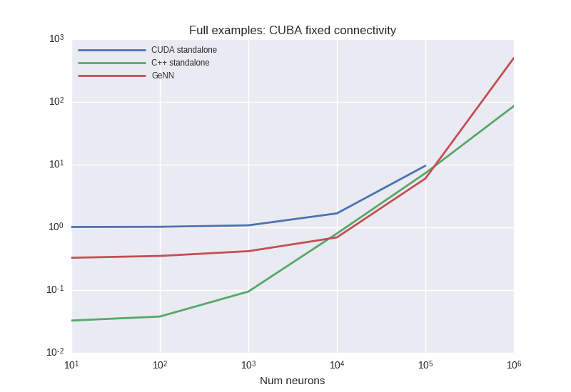


<details><summary>Examplary `nvprof` results for **CUDAStandaloneConfiguration**</summary><p>
Profile summary for `N = 1000`:

```
==30393== NVPROF is profiling process 30393, command: ./main
==30393== Profiling application: ./main
==30393== Profiling result:
Time(%)      Time     Calls       Avg       Min       Max  Name
 18.04%  66.213ms     10000  6.6210us  6.3040us  8.6720us  kernel_neurongroup_stateupdater_codeobject(unsigned int, unsigned int, double*, double*, double*, double*, double*, double*, bool*)
 17.99%  66.031ms     10000  6.6030us  1.6320us  15.396ms  kernel_spikemonitor_codeobject(unsigned int, int*, double*, int*, int*, int*, int, int*, double*, int, int*, int*)
 14.12%  51.814ms     10000  5.1810us  3.5520us  21.024us  kernel_synapses_pre_codeobject(unsigned int, unsigned int, unsigned int, int*, unsigned int, double*, int, int*, int, double*, double*, int*, int, int*, bool*)
 13.82%  50.736ms     10000  5.0730us  3.5840us  19.617us  kernel_synapses_1_pre_codeobject(unsigned int, unsigned int, unsigned int, int*, unsigned int, double*, int, int*, int, double*, int*, int, int*, double*, bool*)
 12.09%  44.371ms     44969     986ns     928ns  84.608us  [CUDA memcpy HtoD]
  8.92%  32.757ms     10000  3.2750us  3.2000us  3.6800us  [CUDA memset]
  5.31%  19.472ms     10000  1.9470us  1.5680us  2.3680us  kernel_neurongroup_thresholder_codeobject(unsigned int, unsigned int, int*, double*, double*, double*, bool*)
  4.04%  14.822ms     10000  1.4820us  1.4080us  2.1760us  kernel_neurongroup_resetter_codeobject(unsigned int, unsigned int, double*, int*, bool*)
  2.90%  10.646ms         1  10.646ms  10.646ms  10.646ms  _copy_spikemonitor_codeobject_kernel(int*, double*, unsigned int)
  2.27%  8.3215ms         1  8.3215ms  8.3215ms  8.3215ms  generate_seed_pseudo(__int64, __int64, __int64, curandOrdering, curandStateXORWOW*, unsigned int*)
  0.27%  1.0091ms        42  24.026us  2.0800us  156.03us  [CUDA memcpy DtoH]
  0.07%  262.37us         1  262.37us  262.37us  262.37us  _run_synapses_pre_initialise_queue_kernel(unsigned int, unsigned int, unsigned int, double, unsigned int, unsigned int, bool)
  0.07%  253.38us         1  253.38us  253.38us  253.38us  _run_synapses_1_pre_initialise_queue_kernel(unsigned int, unsigned int, unsigned int, double, unsigned int, unsigned int, bool)
  0.02%  83.168us         1  83.168us  83.168us  83.168us  _run_debugmsg_spikemonitor_codeobject_kernel(double*, int*, int*, int*, int, int*, double*, int, int*, int*)
  0.02%  66.432us         1  66.432us  66.432us  66.432us  _run_spikemonitor_codeobject_init(void)
  0.02%  65.506us        10  6.5500us  5.7280us  7.4250us  void gen_sequenced<curandStateXORWOW, float, int, __operator_&__(float curand_uniform_noargs<curandStateXORWOW>(curandStateXORWOW*, int))>(curandStateXORWOW*, float*, unsigned long, unsigned long, int)
  0.01%  29.888us         1  29.888us  29.888us  29.888us  synapses_pre_destroy(void)
  0.01%  26.176us         1  26.176us  26.176us  26.176us  synapses_1_pre_destroy(void)
  0.01%  20.960us         1  20.960us  20.960us  20.960us  synapses_pre_init(unsigned int, unsigned int, double*, int*, int*, double, int, int)
  0.00%  17.056us         1  17.056us  17.056us  17.056us  synapses_1_pre_init(unsigned int, unsigned int, double*, int*, int*, double, int, int)
  0.00%  14.176us         5  2.8350us  2.1120us  3.8720us  void thrust::system::cuda::detail::bulk_::detail::launch_by_value<unsigned int=0, thrust::system::cuda::detail::bulk_::detail::cuda_task<thrust::system::cuda::detail::bulk_::parallel_group<thrust::system::cuda::detail::bulk_::concurrent_group<thrust::system::cuda::detail::bulk_::agent<unsigned long=1>, unsigned long=0>, unsigned long=0>, thrust::system::cuda::detail::bulk_::detail::closure<thrust::system::cuda::detail::for_each_n_detail::for_each_kernel, thrust::tuple<thrust::system::cuda::detail::bulk_::detail::cursor<unsigned int=0>, thrust::device_ptr<double>, thrust::detail::wrapped_function<thrust::detail::device_generate_functor<thrust::detail::fill_functor<double>>, void>, unsigned int, thrust::null_type, thrust::null_type, thrust::null_type, thrust::null_type, thrust::null_type, thrust::null_type>>>>(unsigned long=1)
  0.00%  11.776us         5  2.3550us  1.9840us  2.8480us  void thrust::system::cuda::detail::bulk_::detail::launch_by_value<unsigned int=0, thrust::system::cuda::detail::bulk_::detail::cuda_task<thrust::system::cuda::detail::bulk_::parallel_group<thrust::system::cuda::detail::bulk_::concurrent_group<thrust::system::cuda::detail::bulk_::agent<unsigned long=1>, unsigned long=0>, unsigned long=0>, thrust::system::cuda::detail::bulk_::detail::closure<thrust::system::cuda::detail::for_each_n_detail::for_each_kernel, thrust::tuple<thrust::system::cuda::detail::bulk_::detail::cursor<unsigned int=0>, thrust::device_ptr<int>, thrust::detail::wrapped_function<thrust::detail::device_generate_functor<thrust::detail::fill_functor<int>>, void>, unsigned int, thrust::null_type, thrust::null_type, thrust::null_type, thrust::null_type, thrust::null_type, thrust::null_type>>>>(unsigned long=1)
  0.00%  2.9760us         1  2.9760us  2.9760us  2.9760us  kernel_neurongroup_group_variable_set_conditional_codeobject(unsigned int, unsigned int, float*, double*, bool*)
  0.00%  1.8560us         1  1.8560us  1.8560us  1.8560us  _count_spikemonitor_codeobject_kernel(unsigned int*, double*, int*, int*, int*, int, int*, double*, int, int*, int*)

==30393== API calls:
Time(%)      Time     Calls       Avg       Min       Max  Name
 24.80%  611.04ms     60032  10.178us  8.7600us  1.0721ms  cudaLaunch
 18.02%  443.99ms    200010  2.2190us     878ns  334.28us  cudaEventRecord
 16.50%  406.52ms     44983  9.0370us  6.6090us  15.371ms  cudaMemcpy
 13.35%  328.97ms         1  328.97ms  328.97ms  328.97ms  cudaDeviceSetLimit
  7.03%  173.34ms     14966  11.581us  8.2670us  327.00us  cudaMalloc
  4.95%  121.96ms    100000  1.2190us     936ns  17.780us  cudaEventElapsedTime
  4.43%  109.11ms     99990  1.0910us     708ns  315.36us  cudaEventQuery
  4.38%  107.86ms    630125     171ns     144ns  334.24us  cudaSetupArgument
  4.09%  100.74ms     10000  10.073us  9.2900us  973.98us  cudaMemset
  0.92%  22.735ms        32  710.46us  12.585us  13.498ms  cudaFree
  0.78%  19.120ms     60032     318ns     221ns  15.075us  cudaConfigureCall
  0.60%  14.844ms     60027     247ns     173ns  21.483us  cudaGetLastError
  0.09%  2.1570ms        62  34.789us     311ns  295.68us  cudaMemcpyAsync
  0.03%  794.86us         3  264.95us  218.74us  340.73us  cudaGetDeviceProperties
  0.02%  450.73us       166  2.7150us     121ns  97.702us  cuDeviceGetAttribute
  0.01%  145.70us         4  36.425us  25.549us  48.128us  cudaMemcpyToSymbol
  0.00%  117.00us        47  2.4890us  1.9600us  8.0130us  cudaFuncGetAttributes
  0.00%  62.721us         2  31.360us  31.215us  31.506us  cuDeviceTotalMem
  0.00%  56.028us         2  28.014us  26.806us  29.222us  cuDeviceGetName
  0.00%  18.681us        20     934ns     568ns  5.2600us  cudaEventCreate
  0.00%  18.370us        31     592ns     298ns  3.6740us  cudaGetDevice
  0.00%  16.322us        10  1.6320us  1.2680us  2.2440us  cudaEventCreateWithFlags
  0.00%  10.549us        10  1.0540us     789ns  1.5850us  cudaEventDestroy
  0.00%  6.5300us         1  6.5300us  6.5300us  6.5300us  cudaDeviceSynchronize
  0.00%  6.1270us         1  6.1270us  6.1270us  6.1270us  cudaThreadSynchronize
  0.00%  4.5840us        11     416ns     290ns  1.2450us  cudaDeviceGetAttribute
  0.00%  1.6480us         3     549ns     187ns     988ns  cuDeviceGetCount
  0.00%     703ns         3     234ns     203ns     262ns  cuDeviceGet
  0.00%     684ns         1     684ns     684ns     684ns  cuInit
  0.00%     386ns         1     386ns     386ns     386ns  cuDriverGetVersion

```

</p></details>


<details><summary>Examplary `nvprof` results for **GeNNConfiguration**</summary><p>
Profile summary for `N = 1000`:

```
==30786== NVPROF is profiling process 30786, command: ./main test 10.0 1
==30786== Profiling application: ./main test 10.0 1
==30786== Profiling result:
Time(%)      Time     Calls       Avg       Min       Max  Name
 63.24%  1.33992s    100000  13.399us  9.6000us  14.496us  calcNeurons
 22.98%  486.90ms    100000  4.8680us  2.7200us  29.088us  calcSynapses
 13.74%  291.19ms    141767  2.0530us  2.0160us  154.85us  [CUDA memcpy DtoH]
  0.04%  794.43us        56  14.186us     960ns  162.98us  [CUDA memcpy HtoD]

==30786== API calls:
Time(%)      Time     Calls       Avg       Min       Max  Name
 58.47%  3.16572s    200073  15.822us     307ns  23.034ms  cudaMemcpy
 35.19%  1.90525s    200000  9.5260us  7.5460us  353.94us  cudaLaunch
  3.93%  212.57ms        16  13.285ms  8.7600us  210.00ms  cudaHostAlloc
  1.33%  71.740ms    200000     358ns     246ns  337.80us  cudaConfigureCall
  1.07%  57.882ms    200000     289ns     216ns  324.74us  cudaSetupArgument
  0.01%  791.14us        16  49.446us  6.1230us  124.38us  cudaMalloc
  0.00%  228.00us        83  2.7460us     142ns  98.109us  cuDeviceGetAttribute
  0.00%  65.150us         1  65.150us  65.150us  65.150us  cuDeviceGetName
  0.00%  33.737us         1  33.737us  33.737us  33.737us  cuDeviceTotalMem
  0.00%  12.090us        16     755ns     374ns  1.9700us  cudaGetSymbolAddress
  0.00%  11.265us         1  11.265us  11.265us  11.265us  cudaSetDevice
  0.00%  1.7650us         2     882ns     726ns  1.0390us  cuDeviceGetCount
  0.00%  1.4040us         1  1.4040us  1.4040us  1.4040us  cudaGetDeviceCount
  0.00%     632ns         2     316ns     292ns     340ns  cuDeviceGet

```

</p></details>


***

### DenseMediumRateSynapsesOnly
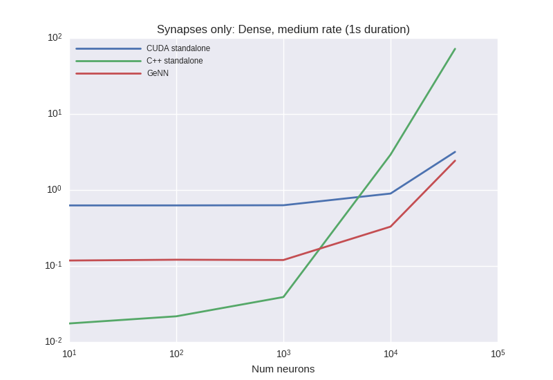


<details><summary>Examplary `nvprof` results for **CUDAStandaloneConfiguration**</summary><p>
Profile summary for `N = 1000`:

```
==6498== NVPROF is profiling process 6498, command: ./main
==6498== Profiling application: ./main
==6498== Profiling result:
Time(%)      Time     Calls       Avg       Min       Max  Name
 45.45%  62.462ms     10000  6.2460us  6.0160us  6.5920us  kernel_synapses_pre_codeobject(unsigned int, unsigned int, unsigned int, int*, unsigned int, double*, int, int*, int, double*, double*, int*, int, int*)
 22.49%  30.900ms     10000  3.0900us  3.0400us  3.6480us  [CUDA memset]
 21.44%  29.464ms     30040     980ns     928ns  3.2640us  [CUDA memcpy HtoD]
 10.36%  14.240ms     10000  1.4240us  1.3760us  2.2080us  kernel_neurongroup_thresholder_codeobject(unsigned int, unsigned int, int*)
  0.18%  250.34us         1  250.34us  250.34us  250.34us  _run_synapses_pre_initialise_queue_kernel(unsigned int, unsigned int, unsigned int, double, unsigned int, unsigned int, bool)
  0.03%  48.096us        15  3.2060us  2.1760us  4.7360us  [CUDA memcpy DtoH]
  0.02%  24.736us         1  24.736us  24.736us  24.736us  synapses_pre_destroy(void)
  0.02%  20.896us         1  20.896us  20.896us  20.896us  synapses_pre_init(unsigned int, unsigned int, double*, int*, int*, double, int, int)
  0.00%  4.2240us         2  2.1120us  1.9200us  2.3040us  void thrust::system::cuda::detail::bulk_::detail::launch_by_value<unsigned int=0, thrust::system::cuda::detail::bulk_::detail::cuda_task<thrust::system::cuda::detail::bulk_::parallel_group<thrust::system::cuda::detail::bulk_::concurrent_group<thrust::system::cuda::detail::bulk_::agent<unsigned long=1>, unsigned long=0>, unsigned long=0>, thrust::system::cuda::detail::bulk_::detail::closure<thrust::system::cuda::detail::for_each_n_detail::for_each_kernel, thrust::tuple<thrust::system::cuda::detail::bulk_::detail::cursor<unsigned int=0>, thrust::device_ptr<double>, thrust::detail::wrapped_function<thrust::detail::device_generate_functor<thrust::detail::fill_functor<double>>, void>, unsigned int, thrust::null_type, thrust::null_type, thrust::null_type, thrust::null_type, thrust::null_type, thrust::null_type>>>>(unsigned long=1)
  0.00%  3.8720us         2  1.9360us  1.6960us  2.1760us  void thrust::system::cuda::detail::bulk_::detail::launch_by_value<unsigned int=0, thrust::system::cuda::detail::bulk_::detail::cuda_task<thrust::system::cuda::detail::bulk_::parallel_group<thrust::system::cuda::detail::bulk_::concurrent_group<thrust::system::cuda::detail::bulk_::agent<unsigned long=1>, unsigned long=0>, unsigned long=0>, thrust::system::cuda::detail::bulk_::detail::closure<thrust::system::cuda::detail::for_each_n_detail::for_each_kernel, thrust::tuple<thrust::system::cuda::detail::bulk_::detail::cursor<unsigned int=0>, thrust::device_ptr<int>, thrust::detail::wrapped_function<thrust::detail::device_generate_functor<thrust::detail::fill_functor<int>>, void>, unsigned int, thrust::null_type, thrust::null_type, thrust::null_type, thrust::null_type, thrust::null_type, thrust::null_type>>>>(unsigned long=1)

==6498== API calls:
Time(%)      Time     Calls       Avg       Min       Max  Name
 19.95%  241.70ms     30042  8.0450us  6.5600us  343.75us  cudaMemcpy
 19.76%  239.38ms         1  239.38ms  239.38ms  239.38ms  cudaDeviceSetLimit
 18.64%  225.85ms    100004  2.2580us     850ns  339.20us  cudaEventRecord
 17.93%  217.27ms     20007  10.859us  10.018us  552.00us  cudaLaunch
  9.05%  109.66ms     10000  10.965us  10.278us  31.417us  cudaMemset
  4.98%  60.351ms     50000  1.2070us  1.0520us  12.332us  cudaEventElapsedTime
  4.41%  53.468ms     49995  1.0690us     714ns  344.70us  cudaEventQuery
  2.69%  32.607ms    170019     191ns     153ns  335.62us  cudaSetupArgument
  1.14%  13.833ms        15  922.21us  11.821us  13.464ms  cudaFree
  0.68%  8.2465ms     20007     412ns     240ns  332.58us  cudaConfigureCall
  0.54%  6.5998ms     20000     329ns     251ns  335.19us  cudaGetLastError
  0.06%  746.45us         3  248.82us  217.29us  311.69us  cudaGetDeviceProperties
  0.06%  671.90us        34  19.761us  7.9460us  129.30us  cudaMalloc
  0.05%  555.35us       166  3.3450us     126ns  156.45us  cuDeviceGetAttribute
  0.03%  309.61us        27  11.466us     323ns  43.146us  cudaMemcpyAsync
  0.01%  74.366us         2  37.183us  31.782us  42.584us  cuDeviceTotalMem
  0.01%  70.989us         2  35.494us  30.580us  40.409us  cuDeviceGetName
  0.00%  45.838us        18  2.5460us  2.0610us  6.2010us  cudaFuncGetAttributes
  0.00%  15.521us         2  7.7600us  7.5390us  7.9820us  cudaMemcpyToSymbol
  0.00%  13.587us        10  1.3580us     662ns  4.8380us  cudaEventCreate
  0.00%  10.152us         1  10.152us  10.152us  10.152us  cudaDeviceSynchronize
  0.00%  10.124us        13     778ns     310ns  3.9700us  cudaGetDevice
  0.00%  6.4040us         4  1.6010us  1.4270us  1.8710us  cudaEventCreateWithFlags
  0.00%  4.3120us        11     392ns     287ns  1.1550us  cudaDeviceGetAttribute
  0.00%  4.2070us         4  1.0510us     920ns  1.3730us  cudaEventDestroy
  0.00%  2.0990us         3     699ns     411ns     941ns  cuDeviceGetCount
  0.00%     998ns         1     998ns     998ns     998ns  cuInit
  0.00%     892ns         3     297ns     226ns     400ns  cuDeviceGet
  0.00%     656ns         1     656ns     656ns     656ns  cuDriverGetVersion

```

</p></details>


<details><summary>Examplary `nvprof` results for **GeNNConfiguration**</summary><p>
Profile summary for `N = 1000`:

```
==6796== NVPROF is profiling process 6796, command: ./main test 10.0 1
==6796== Profiling application: ./main test 10.0 1
==6796== Profiling result:
Time(%)      Time     Calls       Avg       Min       Max  Name
 64.11%  496.31ms    100000  4.9630us  3.3920us  5.9840us  calcSynapses
 35.88%  277.80ms    100000  2.7780us  2.6560us  3.7440us  calcNeurons
  0.01%  57.056us        44  1.2960us     960ns  2.0480us  [CUDA memcpy HtoD]
  0.00%  36.608us        14  2.6140us  1.9520us  4.6080us  [CUDA memcpy DtoH]

==6796== API calls:
Time(%)      Time     Calls       Avg       Min       Max  Name
 83.90%  1.70351s    200000  8.5170us  7.0730us  447.05us  cudaLaunch
 10.29%  209.01ms        12  17.418ms  7.7190us  207.89ms  cudaHostAlloc
  3.13%  63.554ms    200000     317ns     226ns  343.87us  cudaConfigureCall
  2.59%  52.639ms    200000     263ns     217ns  360.96us  cudaSetupArgument
  0.04%  776.50us        61  12.729us     328ns  32.935us  cudaMemcpy
  0.02%  421.29us        12  35.107us  6.2700us  119.75us  cudaMalloc
  0.02%  317.37us        83  3.8230us     241ns  138.57us  cuDeviceGetAttribute
  0.00%  44.939us         1  44.939us  44.939us  44.939us  cuDeviceTotalMem
  0.00%  43.480us         1  43.480us  43.480us  43.480us  cuDeviceGetName
  0.00%  17.867us         1  17.867us  17.867us  17.867us  cudaSetDevice
  0.00%  8.2050us        12     683ns     377ns  2.1270us  cudaGetSymbolAddress
  0.00%  2.3270us         1  2.3270us  2.3270us  2.3270us  cudaGetDeviceCount
  0.00%  2.3190us         2  1.1590us     818ns  1.5010us  cuDeviceGetCount
  0.00%     951ns         2     475ns     257ns     694ns  cuDeviceGet

```

</p></details>


***

### HHNeuronsOnly


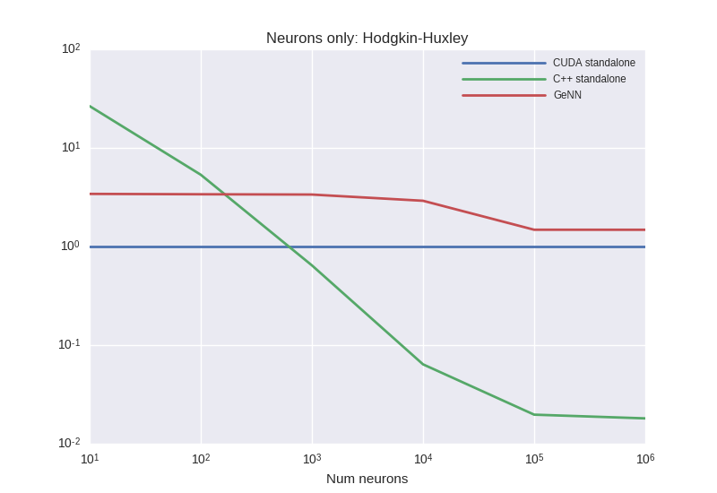

<details><summary>Examplary `nvprof` results for **CUDAStandaloneConfiguration**</summary><p>
Profile summary for `N = 1000`:

```
==19517== NVPROF is profiling process 19517, command: ./main
==19517== Profiling application: ./main
==19517== Profiling result:
Time(%)      Time     Calls       Avg       Min       Max  Name
 60.56%  121.96ms     10000  12.195us  10.848us  14.561us  kernel_neurongroup_stateupdater_codeobject(unsigned int, unsigned int, double*, double*, bool*, double*, double*, double*, double*)
 16.25%  32.721ms     10000  3.2720us  3.0400us  3.8720us  [CUDA memset]
 14.61%  29.433ms     30021     980ns     928ns  3.1360us  [CUDA memcpy HtoD]
  8.55%  17.228ms     10000  1.7220us  1.5360us  2.9760us  kernel_neurongroup_thresholder_codeobject(unsigned int, unsigned int, int*, double*, double*, double*, bool*)
  0.02%  45.280us        12  3.7730us  2.3360us  4.7360us  [CUDA memcpy DtoH]
  0.00%  2.7520us         1  2.7520us  2.7520us  2.7520us  kernel_neurongroup_group_variable_set_conditional_codeobject(unsigned int, unsigned int, double*, int*)

==19517== API calls:
Time(%)      Time     Calls       Avg       Min       Max  Name
 30.20%  376.07ms         1  376.07ms  376.07ms  376.07ms  cudaDeviceSetLimit
 18.56%  231.08ms     30033  7.6940us  6.1240us  320.08us  cudaMemcpy
 16.15%  201.12ms     20001  10.055us  8.6650us  336.66us  cudaLaunch
 14.51%  180.70ms     80000  2.2580us  1.7650us  324.20us  cudaEventRecord
  7.74%  96.355ms     10000  9.6350us  8.9080us  29.084us  cudaMemset
  4.27%  53.194ms     40000  1.3290us  1.0760us  7.5120us  cudaEventElapsedTime
  3.66%  45.610ms     39996  1.1400us     714ns  312.86us  cudaEventQuery
  2.40%  29.924ms    160004     187ns     152ns  328.32us  cudaSetupArgument
  1.27%  15.839ms        12  1.3199ms  10.554us  15.462ms  cudaFree
  0.60%  7.5217ms     20001     376ns     293ns  319.50us  cudaConfigureCall
  0.43%  5.2992ms     20001     264ns     236ns  1.4190us  cudaGetLastError
  0.08%  1.0319ms         3  343.97us  296.85us  413.03us  cudaGetDeviceProperties
  0.05%  644.93us       166  3.8850us     244ns  139.09us  cuDeviceGetAttribute
  0.04%  483.98us        13  37.229us  7.7290us  153.12us  cudaMalloc
  0.01%  123.93us         2  61.965us  42.798us  81.133us  cuDeviceTotalMem
  0.01%  84.114us         2  42.057us  41.360us  42.754us  cuDeviceGetName
  0.00%  14.629us         3  4.8760us  2.9770us  8.5760us  cudaFuncGetAttributes
  0.00%  13.779us         8  1.7220us     599ns  7.3620us  cudaEventCreate
  0.00%  9.6890us         1  9.6890us  9.6890us  9.6890us  cudaDeviceSynchronize
  0.00%  5.7770us         1  5.7770us  5.7770us  5.7770us  cudaGetDevice
  0.00%  2.8640us         3     954ns     394ns  1.8660us  cuDeviceGetCount
  0.00%  1.3460us         3     448ns     224ns     651ns  cuDeviceGet
  0.00%     983ns         1     983ns     983ns     983ns  cuInit
  0.00%     586ns         1     586ns     586ns     586ns  cuDriverGetVersion

```

</p></details>


<details><summary>Examplary `nvprof` results for **GeNNConfiguration**</summary><p>
Profile summary for `N = 1000`:

```
==19847== NVPROF is profiling process 19847, command: ./main test 10.0 1
==19847== Profiling application: ./main test 10.0 1
==19847== Profiling result:
Time(%)      Time     Calls       Avg       Min       Max  Name
 99.99%  1.66001s    100000  16.600us  14.912us  26.400us  calcNeurons
  0.00%  62.816us        40  1.5700us     960ns  2.1760us  [CUDA memcpy HtoD]
  0.00%  37.888us        11  3.4440us  1.9840us  4.6080us  [CUDA memcpy DtoH]

==19847== API calls:
Time(%)      Time     Calls       Avg       Min       Max  Name
 84.39%  1.62793s    100000  16.279us  7.9710us  340.70us  cudaLaunch
 11.18%  215.74ms        10  21.574ms  15.537us  214.24ms  cudaHostAlloc
  1.92%  37.109ms    100000     371ns     263ns  368.42us  cudaConfigureCall
  1.41%  27.228ms    100000     272ns     235ns  324.86us  cudaSetupArgument
  1.03%  19.831ms        53  374.17us     373ns  18.914ms  cudaMemcpy
  0.03%  615.28us        10  61.528us  11.285us  192.48us  cudaMalloc
  0.01%  268.09us        83  3.2290us     138ns  121.41us  cuDeviceGetAttribute
  0.01%  147.80us         1  147.80us  147.80us  147.80us  cuDeviceTotalMem
  0.01%  122.82us         1  122.82us  122.82us  122.82us  cuDeviceGetName
  0.00%  12.687us         1  12.687us  12.687us  12.687us  cudaSetDevice
  0.00%  12.105us        10  1.2100us     710ns  3.3610us  cudaGetSymbolAddress
  0.00%  1.5850us         2     792ns     470ns  1.1150us  cuDeviceGetCount
  0.00%  1.3510us         1  1.3510us  1.3510us  1.3510us  cudaGetDeviceCount
  0.00%     572ns         2     286ns     219ns     353ns  cuDeviceGet

```

</p></details>


***

### LinearNeuronsOnly

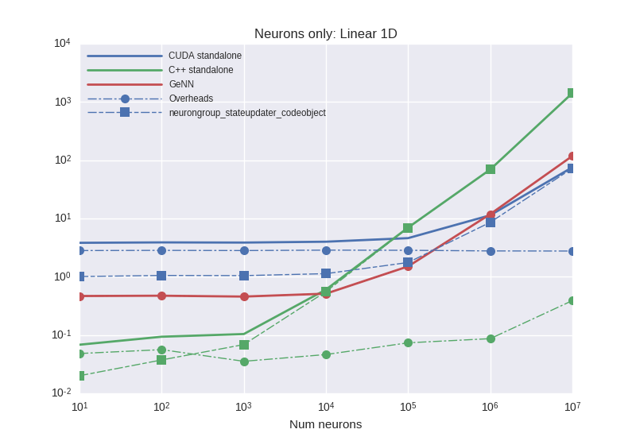
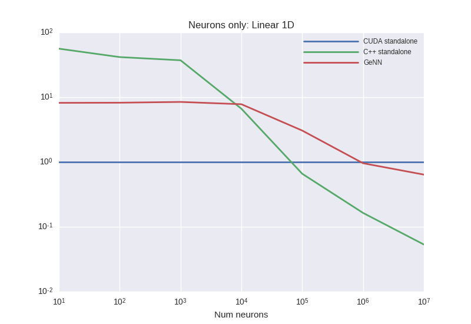

<details><summary>Examplary `nvprof` results for **CUDAStandaloneConfiguration**</summary><p>
Profile summary for `N = 1000`:

```
==1825== NVPROF is profiling process 1825, command: ./main
==1825== Profiling application: ./main
==1825== Profiling result:
Time(%)      Time     Calls       Avg       Min       Max  Name
 66.29%  394.86ms    300014  1.3160us     928ns  337.87us  [CUDA memcpy HtoD]
 33.69%  200.69ms    100000  2.0060us  1.9520us  2.6560us  kernel_neurongroup_stateupdater_codeobject(unsigned int, unsigned int, double*, double*)
  0.02%  108.22us         5  21.643us  16.427us  30.563us  [CUDA memcpy DtoH]

==1825== API calls:
Time(%)      Time     Calls       Avg       Min       Max  Name
 39.10%  2.32208s    300018  7.7390us  4.9810us  26.802ms  cudaMemcpy
 22.78%  1.35260s    600000  2.2540us  1.6920us  1.6473ms  cudaEventRecord
 17.83%  1.05861s    100000  10.586us  9.1920us  365.25us  cudaLaunch
  6.61%  392.79ms    300000  1.3090us  1.0630us  313.99us  cudaEventElapsedTime
  5.68%  337.03ms         1  337.03ms  337.03ms  337.03ms  cudaDeviceSetLimit
  5.17%  307.00ms    299997  1.0230us     637ns  341.90us  cudaEventQuery
  1.45%  86.181ms    400000     215ns     140ns  336.91us  cudaSetupArgument
  0.65%  38.309ms    100000     383ns     284ns  12.869us  cudaConfigureCall
  0.49%  29.089ms    100000     290ns     231ns  331.68us  cudaGetLastError
  0.21%  12.536ms         6  2.0894ms  7.5530us  12.355ms  cudaFree
  0.01%  751.87us         3  250.62us  217.74us  298.17us  cudaGetDeviceProperties
  0.01%  539.08us       166  3.2470us     122ns  133.80us  cuDeviceGetAttribute
  0.01%  430.90us         7  61.556us  7.8380us  150.39us  cudaMalloc
  0.00%  75.096us         2  37.548us  28.980us  46.116us  cuDeviceGetName
  0.00%  74.337us         2  37.168us  31.549us  42.788us  cuDeviceTotalMem
  0.00%  10.671us         6  1.7780us     751ns  6.5770us  cudaEventCreate
  0.00%  9.9980us         1  9.9980us  9.9980us  9.9980us  cudaMemcpyToSymbol
  0.00%  6.3060us         1  6.3060us  6.3060us  6.3060us  cudaFuncGetAttributes
  0.00%  5.8820us         1  5.8820us  5.8820us  5.8820us  cudaDeviceSynchronize
  0.00%  3.4510us         1  3.4510us  3.4510us  3.4510us  cudaGetDevice
  0.00%  2.4960us         3     832ns     239ns  1.3140us  cuDeviceGetCount
  0.00%  1.0040us         3     334ns     238ns     496ns  cuDeviceGet
  0.00%     577ns         1     577ns     577ns     577ns  cuInit
  0.00%     359ns         1     359ns     359ns     359ns  cuDriverGetVersion

```

</p></details>


<details><summary>Examplary `nvprof` results for **GeNNConfiguration**</summary><p>
Profile summary for `N = 1000`:

```
==2256== NVPROF is profiling process 2256, command: ./main test 10.0 1
==2256== Profiling application: ./main test 10.0 1
==2256== Profiling result:
Time(%)      Time     Calls       Avg       Min       Max  Name
 99.99%  264.77ms    100000  2.6470us  2.5920us  3.1680us  calcNeurons
  0.01%  22.496us        16  1.4060us     960ns  2.0480us  [CUDA memcpy HtoD]
  0.01%  14.592us         5  2.9180us  2.0480us  4.6720us  [CUDA memcpy DtoH]

==2256== API calls:
Time(%)      Time     Calls       Avg       Min       Max  Name
 75.60%  829.39ms    100000  8.2930us  7.7730us  326.59us  cudaLaunch
 19.00%  208.47ms         4  52.117ms  13.060us  207.50ms  cudaHostAlloc
  3.00%  32.930ms    100000     329ns     252ns  312.21us  cudaConfigureCall
  2.30%  25.248ms    100000     252ns     210ns  14.261us  cudaSetupArgument
  0.03%  364.57us         4  91.142us  6.6360us  122.38us  cudaMalloc
  0.03%  349.15us        23  15.180us     345ns  39.173us  cudaMemcpy
  0.02%  244.13us        83  2.9410us     137ns  112.55us  cuDeviceGetAttribute
  0.00%  31.579us         1  31.579us  31.579us  31.579us  cuDeviceTotalMem
  0.00%  26.165us         1  26.165us  26.165us  26.165us  cuDeviceGetName
  0.00%  18.721us         1  18.721us  18.721us  18.721us  cudaSetDevice
  0.00%  4.5860us         4  1.1460us     434ns  2.0860us  cudaGetSymbolAddress
  0.00%  2.3640us         1  2.3640us  2.3640us  2.3640us  cudaGetDeviceCount
  0.00%  1.8560us         2     928ns     392ns  1.4640us  cuDeviceGetCount
  0.00%     683ns         2     341ns     182ns     501ns  cuDeviceGet

```

</p></details>


***

### STDP

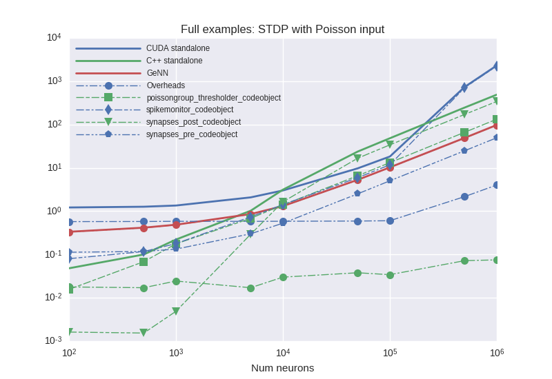


<details><summary>Examplary `nvprof` results for **CUDAStandaloneConfiguration**</summary><p>
Profile summary for `N = 1000`:

```
==7650== NVPROF is profiling process 7650, command: ./main
==7650== Profiling application: ./main
==7650== Profiling result:
Time(%)      Time     Calls       Avg       Min       Max  Name
 23.82%  126.62ms     10000  12.661us  1.6320us  30.611ms  kernel_spikemonitor_codeobject(unsigned int, int*, double*, int*, int*, int*, int, int*, double*, int, int*, int*)
 15.57%  82.785ms     10000  8.2780us  3.4240us  28.448us  kernel_synapses_pre_codeobject(unsigned int, unsigned int, unsigned int, int*, unsigned int, double*, int, double*, int, double*, int, int*, double*, double*, double*, int, int*, int, int*, int)
 11.80%  62.727ms     20000  3.1360us  3.0400us  3.7440us  [CUDA memset]
  9.84%  52.334ms     10000  5.2330us  4.9600us  7.2640us  kernel_neurongroup_stateupdater_codeobject(unsigned int, unsigned int, double*, double*, double*)
  9.38%  49.865ms     10001  4.9860us  4.4480us  5.8880us  void gen_sequenced<curandStateXORWOW, float, int, __operator_&__(float curand_uniform_noargs<curandStateXORWOW>(curandStateXORWOW*, int))>(curandStateXORWOW*, float*, unsigned long, unsigned long, int)
  7.20%  38.283ms     10000  3.8280us  3.5200us  6.9120us  kernel_synapses_post_codeobject(unsigned int, unsigned int, unsigned int, int*, unsigned int, double*, int, double*, int, double*, int, double*, double*, int, int*, int*, int)
  5.73%  30.435ms     31052     980ns     928ns  40.512us  [CUDA memcpy HtoD]
  5.53%  29.381ms         1  29.381ms  29.381ms  29.381ms  _copy_spikemonitor_codeobject_kernel(int*, double*, unsigned int)
  4.18%  22.223ms     10000  2.2220us  1.8560us  2.7200us  kernel_poissongroup_thresholder_codeobject(unsigned int, unsigned int, int*, double*, double*)
  2.64%  14.058ms     10000  1.4050us  1.3120us  2.2720us  kernel_neurongroup_thresholder_codeobject(unsigned int, unsigned int, int*, double*)
  2.57%  13.653ms     10000  1.3650us  1.2480us  1.7600us  kernel_neurongroup_resetter_codeobject(unsigned int, unsigned int, double*, int*)
  1.56%  8.3122ms         1  8.3122ms  8.3122ms  8.3122ms  generate_seed_pseudo(__int64, __int64, __int64, curandOrdering, curandStateXORWOW*, unsigned int*)
  0.05%  259.11us         1  259.11us  259.11us  259.11us  _run_synapses_post_initialise_queue_kernel(unsigned int, unsigned int, unsigned int, double, unsigned int, unsigned int, bool)
  0.05%  249.70us         1  249.70us  249.70us  249.70us  _run_synapses_pre_initialise_queue_kernel(unsigned int, unsigned int, unsigned int, double, unsigned int, unsigned int, bool)
  0.03%  141.70us        27  5.2480us  2.0480us  37.440us  [CUDA memcpy DtoH]
  0.02%  82.880us         1  82.880us  82.880us  82.880us  _run_debugmsg_spikemonitor_codeobject_kernel(double*, int*, int*, int*, int, int*, double*, int, int*, int*)
  0.01%  64.448us         1  64.448us  64.448us  64.448us  _run_spikemonitor_codeobject_init(void)
  0.01%  27.200us         1  27.200us  27.200us  27.200us  synapses_post_destroy(void)
  0.00%  24.001us         1  24.001us  24.001us  24.001us  synapses_pre_destroy(void)
  0.00%  21.440us         1  21.440us  21.440us  21.440us  synapses_post_init(unsigned int, unsigned int, double*, int*, int*, double, int, int)
  0.00%  17.024us         1  17.024us  17.024us  17.024us  synapses_pre_init(unsigned int, unsigned int, double*, int*, int*, double, int, int)
  0.00%  14.368us         7  2.0520us  1.8560us  2.4960us  void thrust::system::cuda::detail::bulk_::detail::launch_by_value<unsigned int=0, thrust::system::cuda::detail::bulk_::detail::cuda_task<thrust::system::cuda::detail::bulk_::parallel_group<thrust::system::cuda::detail::bulk_::concurrent_group<thrust::system::cuda::detail::bulk_::agent<unsigned long=1>, unsigned long=0>, unsigned long=0>, thrust::system::cuda::detail::bulk_::detail::closure<thrust::system::cuda::detail::for_each_n_detail::for_each_kernel, thrust::tuple<thrust::system::cuda::detail::bulk_::detail::cursor<unsigned int=0>, thrust::device_ptr<double>, thrust::detail::wrapped_function<thrust::detail::device_generate_functor<thrust::detail::fill_functor<double>>, void>, unsigned int, thrust::null_type, thrust::null_type, thrust::null_type, thrust::null_type, thrust::null_type, thrust::null_type>>>>(unsigned long=1)
  0.00%  6.1120us         3  2.0370us  1.7920us  2.1760us  void thrust::system::cuda::detail::bulk_::detail::launch_by_value<unsigned int=0, thrust::system::cuda::detail::bulk_::detail::cuda_task<thrust::system::cuda::detail::bulk_::parallel_group<thrust::system::cuda::detail::bulk_::concurrent_group<thrust::system::cuda::detail::bulk_::agent<unsigned long=1>, unsigned long=0>, unsigned long=0>, thrust::system::cuda::detail::bulk_::detail::closure<thrust::system::cuda::detail::for_each_n_detail::for_each_kernel, thrust::tuple<thrust::system::cuda::detail::bulk_::detail::cursor<unsigned int=0>, thrust::device_ptr<int>, thrust::detail::wrapped_function<thrust::detail::device_generate_functor<thrust::detail::fill_functor<int>>, void>, unsigned int, thrust::null_type, thrust::null_type, thrust::null_type, thrust::null_type, thrust::null_type, thrust::null_type>>>>(unsigned long=1)
  0.00%  2.4960us         1  2.4960us  2.4960us  2.4960us  kernel_synapses_group_variable_set_conditional_codeobject(unsigned int, unsigned int, float*, int*, double*, int)
  0.00%  1.8240us         1  1.8240us  1.8240us  1.8240us  _count_spikemonitor_codeobject_kernel(unsigned int*, double*, int*, int*, int*, int, int*, double*, int, int*, int*)

==7650== API calls:
Time(%)      Time     Calls       Avg       Min       Max  Name
 31.07%  819.96ms     80023  10.246us  8.3870us  558.37us  cudaLaunch
 18.74%  494.65ms    220010  2.2480us     745ns  17.598us  cudaEventRecord
 13.04%  344.21ms     31056  11.083us  6.2140us  30.576ms  cudaMemcpy
 10.52%  277.59ms         1  277.59ms  277.59ms  277.59ms  cudaDeviceSetLimit
  7.26%  191.63ms     20000  9.5810us  8.2000us  59.774us  cudaMemset
  5.42%  143.06ms    720081     198ns     141ns  342.04us  cudaSetupArgument
  5.28%  139.44ms    110000  1.2670us     937ns  336.26us  cudaEventElapsedTime
  5.01%  132.24ms    109989  1.2020us     684ns  333.47us  cudaEventQuery
  1.20%  31.588ms     80023     394ns     208ns  361.51us  cudaConfigureCall
  1.10%  29.034ms     90009     322ns     163ns  11.107us  cudaGetLastError
  0.84%  22.168ms        27  821.05us  10.432us  13.282ms  cudaFree
  0.42%  11.155ms      1053  10.593us  7.5100us  131.86us  cudaMalloc
  0.03%  921.70us        52  17.724us     325ns  182.72us  cudaMemcpyAsync
  0.03%  752.53us         3  250.84us  218.42us  299.88us  cudaGetDeviceProperties
  0.02%  541.96us       166  3.2640us     122ns  134.73us  cuDeviceGetAttribute
  0.00%  114.68us        48  2.3890us  1.8290us  6.2100us  cudaFuncGetAttributes
  0.00%  96.398us         5  19.279us  7.6470us  48.251us  cudaMemcpyToSymbol
  0.00%  74.069us         2  37.034us  31.642us  42.427us  cuDeviceTotalMem
  0.00%  73.232us         2  36.616us  29.558us  43.674us  cuDeviceGetName
  0.00%  23.533us        22  1.0690us     584ns  5.0990us  cudaEventCreate
  0.00%  18.187us        31     586ns     287ns  3.8540us  cudaGetDevice
  0.00%  15.386us        10  1.5380us  1.3330us  2.2430us  cudaEventCreateWithFlags
  0.00%  9.8280us        10     982ns     791ns  1.5250us  cudaEventDestroy
  0.00%  6.4420us         1  6.4420us  6.4420us  6.4420us  cudaDeviceSynchronize
  0.00%  6.2660us         1  6.2660us  6.2660us  6.2660us  cudaThreadSynchronize
  0.00%  4.3320us        11     393ns     280ns  1.0810us  cudaDeviceGetAttribute
  0.00%  2.8120us         3     937ns     292ns  1.4270us  cuDeviceGetCount
  0.00%  1.2190us         3     406ns     226ns     544ns  cuDeviceGet
  0.00%     628ns         1     628ns     628ns     628ns  cuInit
  0.00%     422ns         1     422ns     422ns     422ns  cuDriverGetVersion

```

</p></details>


<details><summary>Examplary `nvprof` results for **GeNNConfiguration**</summary><p>
Profile summary for `N = 1000`:

```
==8040== NVPROF is profiling process 8040, command: ./main test 10.0 1
==8040== Profiling application: ./main test 10.0 1
==8040== Profiling result:
Time(%)      Time     Calls       Avg       Min       Max  Name
 49.92%  1.13699s    100000  11.369us  1.5680us  56.193us  calcSynapses
 21.50%  489.63ms    100000  4.8960us  4.0320us  6.4010us  calcNeurons
 16.07%  365.92ms    177506  2.0610us  1.9840us  8.3520us  [CUDA memcpy DtoH]
 12.51%  285.00ms    100000  2.8490us  2.7520us  12.512us  learnSynapsesPost
  0.00%  94.048us        70  1.3430us     960ns  2.0800us  [CUDA memcpy HtoD]

==8040== API calls:
Time(%)      Time     Calls       Avg       Min       Max  Name
 50.17%  3.14663s    200095  15.725us     286ns  34.637ms  cudaMemcpy
 43.36%  2.71954s    300000  9.0650us  7.0910us  3.0578ms  cudaLaunch
  3.59%  224.94ms        20  11.247ms  14.777us  223.12ms  cudaHostAlloc
  1.55%  97.368ms    300000     324ns     219ns  357.63us  cudaConfigureCall
  1.31%  81.925ms    300000     273ns     204ns  336.76us  cudaSetupArgument
  0.01%  766.51us        20  38.325us  11.916us  172.11us  cudaMalloc
  0.00%  227.06us        83  2.7350us     146ns  97.579us  cuDeviceGetAttribute
  0.00%  31.263us         1  31.263us  31.263us  31.263us  cuDeviceTotalMem
  0.00%  27.704us         1  27.704us  27.704us  27.704us  cuDeviceGetName
  0.00%  20.699us        20  1.0340us     738ns  3.5760us  cudaGetSymbolAddress
  0.00%  11.277us         1  11.277us  11.277us  11.277us  cudaSetDevice
  0.00%  1.3520us         1  1.3520us  1.3520us  1.3520us  cudaGetDeviceCount
  0.00%  1.3160us         2     658ns     399ns     917ns  cuDeviceGetCount
  0.00%     607ns         2     303ns     242ns     365ns  cuDeviceGet

```

</p></details>


***

### STDPEventDriven
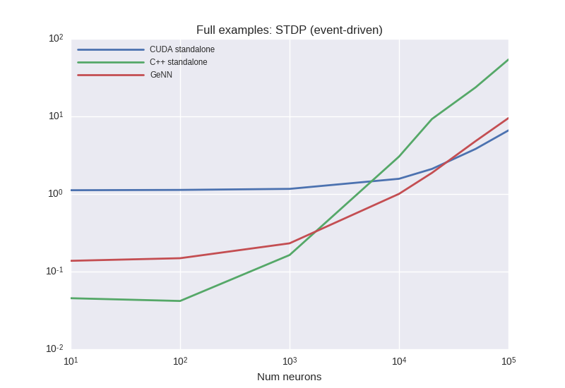


<details><summary>Examplary `nvprof` results for **CUDAStandaloneConfiguration**</summary><p>
Profile summary for `N = 1000`:

```
==25626== NVPROF is profiling process 25626, command: ./main
==25626== Profiling application: ./main
==25626== Profiling result:
Time(%)      Time     Calls       Avg       Min       Max  Name
 21.03%  80.621ms     10000  8.0620us  3.3600us  26.240us  kernel_synapses_pre_codeobject(unsigned int, unsigned int, unsigned int, int*, unsigned int, double*, int, double*, int, double*, int, int*, double*, double*, double*, int, int*, int, int*, int)
 16.60%  63.666ms     20000  3.1830us  3.0400us  3.7440us  [CUDA memset]
 13.53%  51.879ms     10000  5.1870us  4.9600us  6.8160us  kernel_neurongroup_stateupdater_codeobject(unsigned int, unsigned int, double*, double*, double*)
 12.89%  49.437ms     10001  4.9430us  4.2240us  6.0160us  void gen_sequenced<curandStateXORWOW, float, int, __operator_&__(float curand_uniform_noargs<curandStateXORWOW>(curandStateXORWOW*, int))>(curandStateXORWOW*, float*, unsigned long, unsigned long, int)
 12.63%  48.416ms     10000  4.8410us  4.6720us  7.7440us  kernel_synapses_post_codeobject(unsigned int, unsigned int, unsigned int, int*, unsigned int, double*, int, double*, int, double*, int, double*, double*, int, int*, int*, int)
  7.93%  30.411ms     31048     979ns     928ns  40.513us  [CUDA memcpy HtoD]
  5.38%  20.637ms     10000  2.0630us  1.7280us  3.0400us  kernel_poissongroup_thresholder_codeobject(unsigned int, unsigned int, int*, double*, double*)
  4.00%  15.342ms     10000  1.5340us  1.2800us  2.0800us  kernel_neurongroup_resetter_codeobject(unsigned int, unsigned int, double*, int*)
  3.68%  14.126ms     10000  1.4120us  1.3440us  2.2720us  kernel_neurongroup_thresholder_codeobject(unsigned int, unsigned int, int*, double*)
  2.14%  8.2210ms         1  8.2210ms  8.2210ms  8.2210ms  generate_seed_pseudo(__int64, __int64, __int64, curandOrdering, curandStateXORWOW*, unsigned int*)
  0.07%  259.52us         1  259.52us  259.52us  259.52us  _run_synapses_post_initialise_queue_kernel(unsigned int, unsigned int, unsigned int, double, unsigned int, unsigned int, bool)
  0.07%  250.37us         1  250.37us  250.37us  250.37us  _run_synapses_pre_initialise_queue_kernel(unsigned int, unsigned int, unsigned int, double, unsigned int, unsigned int, bool)
  0.02%  72.704us        21  3.4620us  2.0160us  5.2480us  [CUDA memcpy DtoH]
  0.01%  27.200us         1  27.200us  27.200us  27.200us  synapses_post_destroy(void)
  0.01%  23.872us         1  23.872us  23.872us  23.872us  synapses_pre_destroy(void)
  0.01%  21.312us         1  21.312us  21.312us  21.312us  synapses_post_init(unsigned int, unsigned int, double*, int*, int*, double, int, int)
  0.00%  16.736us         1  16.736us  16.736us  16.736us  synapses_pre_init(unsigned int, unsigned int, double*, int*, int*, double, int, int)
  0.00%  11.872us         6  1.9780us  1.8880us  2.2720us  void thrust::system::cuda::detail::bulk_::detail::launch_by_value<unsigned int=0, thrust::system::cuda::detail::bulk_::detail::cuda_task<thrust::system::cuda::detail::bulk_::parallel_group<thrust::system::cuda::detail::bulk_::concurrent_group<thrust::system::cuda::detail::bulk_::agent<unsigned long=1>, unsigned long=0>, unsigned long=0>, thrust::system::cuda::detail::bulk_::detail::closure<thrust::system::cuda::detail::for_each_n_detail::for_each_kernel, thrust::tuple<thrust::system::cuda::detail::bulk_::detail::cursor<unsigned int=0>, thrust::device_ptr<double>, thrust::detail::wrapped_function<thrust::detail::device_generate_functor<thrust::detail::fill_functor<double>>, void>, unsigned int, thrust::null_type, thrust::null_type, thrust::null_type, thrust::null_type, thrust::null_type, thrust::null_type>>>>(unsigned long=1)
  0.00%  4.0640us         2  2.0320us  1.7920us  2.2720us  void thrust::system::cuda::detail::bulk_::detail::launch_by_value<unsigned int=0, thrust::system::cuda::detail::bulk_::detail::cuda_task<thrust::system::cuda::detail::bulk_::parallel_group<thrust::system::cuda::detail::bulk_::concurrent_group<thrust::system::cuda::detail::bulk_::agent<unsigned long=1>, unsigned long=0>, unsigned long=0>, thrust::system::cuda::detail::bulk_::detail::closure<thrust::system::cuda::detail::for_each_n_detail::for_each_kernel, thrust::tuple<thrust::system::cuda::detail::bulk_::detail::cursor<unsigned int=0>, thrust::device_ptr<int>, thrust::detail::wrapped_function<thrust::detail::device_generate_functor<thrust::detail::fill_functor<int>>, void>, unsigned int, thrust::null_type, thrust::null_type, thrust::null_type, thrust::null_type, thrust::null_type, thrust::null_type>>>>(unsigned long=1)
  0.00%  2.7840us         1  2.7840us  2.7840us  2.7840us  kernel_synapses_group_variable_set_conditional_codeobject(unsigned int, unsigned int, float*, int*, double*, int)

==25626== API calls:
Time(%)      Time     Calls       Avg       Min       Max  Name
 31.58%  727.68ms     70017  10.392us  8.4250us  544.71us  cudaLaunch
 19.47%  448.77ms    200008  2.2430us     850ns  19.177us  cudaEventRecord
 10.89%  251.05ms     31048  8.0850us  6.2150us  256.39us  cudaMemcpy
 10.63%  244.87ms         1  244.87ms  244.87ms  244.87ms  cudaDeviceSetLimit
  8.52%  196.24ms     20000  9.8120us  8.3610us  27.725us  cudaMemset
  5.33%  122.90ms    100000  1.2280us     912ns  333.20us  cudaEventElapsedTime
  5.20%  119.92ms     99990  1.1990us     668ns  339.43us  cudaEventQuery
  4.75%  109.45ms    600055     182ns     134ns  347.44us  cudaSetupArgument
  1.07%  24.587ms     70017     351ns     219ns  334.49us  cudaConfigureCall
  1.02%  23.584ms     80005     294ns     163ns  12.897us  cudaGetLastError
  0.96%  22.105ms        22  1.0048ms  12.622us  13.307ms  cudaFree
  0.47%  10.943ms      1046  10.462us  7.8210us  142.65us  cudaMalloc
  0.03%  690.30us         3  230.10us  219.10us  236.40us  cudaGetDeviceProperties
  0.03%  670.23us        44  15.232us     336ns  181.46us  cudaMemcpyAsync
  0.02%  504.99us       166  3.0420us     123ns  123.75us  cuDeviceGetAttribute
  0.00%  98.470us         5  19.694us  7.5550us  47.801us  cudaMemcpyToSymbol
  0.00%  94.826us        39  2.4310us  1.9880us  6.2510us  cudaFuncGetAttributes
  0.00%  76.229us         2  38.114us  29.333us  46.896us  cuDeviceGetName
  0.00%  72.504us         2  36.252us  32.004us  40.500us  cuDeviceTotalMem
  0.00%  21.584us        20  1.0790us     608ns  5.1070us  cudaEventCreate
  0.00%  15.071us         1  15.071us  15.071us  15.071us  cudaDeviceSynchronize
  0.00%  14.325us        25     573ns     302ns  3.5620us  cudaGetDevice
  0.00%  11.977us         8  1.4970us  1.3340us  1.8420us  cudaEventCreateWithFlags
  0.00%  7.9560us         8     994ns     841ns  1.4420us  cudaEventDestroy
  0.00%  6.2400us         1  6.2400us  6.2400us  6.2400us  cudaThreadSynchronize
  0.00%  4.5230us        11     411ns     283ns  1.2780us  cudaDeviceGetAttribute
  0.00%  2.8190us         3     939ns     185ns  1.6940us  cuDeviceGetCount
  0.00%  1.1900us         3     396ns     230ns     544ns  cuDeviceGet
  0.00%     680ns         1     680ns     680ns     680ns  cuInit
  0.00%     406ns         1     406ns     406ns     406ns  cuDriverGetVersion

```

</p></details>


<details><summary>Examplary `nvprof` results for **GeNNConfiguration**</summary><p>
Profile summary for `N = 1000`:

```
==26009== NVPROF is profiling process 26009, command: ./main test 10.0 1
==26009== Profiling application: ./main test 10.0 1
==26009== Profiling result:
Time(%)      Time     Calls       Avg       Min       Max  Name
 62.34%  1.05421s    100000  10.542us  1.4400us  57.408us  calcSynapses
 23.93%  404.64ms    100000  4.0460us  3.3280us  6.0800us  calcNeurons
 13.72%  232.02ms    100000  2.3200us  2.0800us  11.168us  learnSynapsesPost
  0.01%  93.184us        70  1.3310us     960ns  2.0800us  [CUDA memcpy HtoD]
  0.00%  50.368us        17  2.9620us  1.9520us  4.7680us  [CUDA memcpy DtoH]

==26009== API calls:
Time(%)      Time     Calls       Avg       Min       Max  Name
 86.96%  2.44941s    300000  8.1640us  7.1250us  3.0958ms  cudaLaunch
  7.17%  202.01ms        20  10.101ms  7.2090us  200.87ms  cudaHostAlloc
  3.30%  92.809ms    300000     309ns     219ns  348.91us  cudaConfigureCall
  2.49%  70.189ms    300000     233ns     199ns  12.526us  cudaSetupArgument
  0.04%  1.1341ms        95  11.937us     193ns  33.124us  cudaMemcpy
  0.02%  480.13us        20  24.006us  6.1350us  121.54us  cudaMalloc
  0.01%  410.61us        83  4.9470us     274ns  133.46us  cuDeviceGetAttribute
  0.00%  69.309us         1  69.309us  69.309us  69.309us  cuDeviceTotalMem
  0.00%  66.907us         1  66.907us  66.907us  66.907us  cuDeviceGetName
  0.00%  18.241us         1  18.241us  18.241us  18.241us  cudaSetDevice
  0.00%  11.521us        20     576ns     391ns  2.0940us  cudaGetSymbolAddress
  0.00%  2.4350us         1  2.4350us  2.4350us  2.4350us  cudaGetDeviceCount
  0.00%  2.2390us         2  1.1190us     840ns  1.3990us  cuDeviceGetCount
  0.00%     913ns         2     456ns     447ns     466ns  cuDeviceGet

```

</p></details>


***

### STDPMultiPost

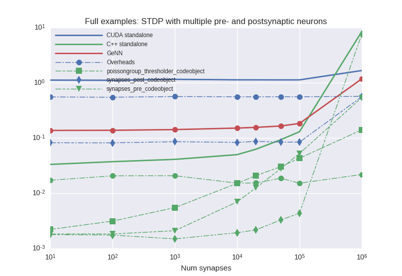


<details><summary>Examplary `nvprof` results for **CUDAStandaloneConfiguration**</summary><p>
Profile summary for `N = 1000`:

```
==30229== NVPROF is profiling process 30229, command: ./main
==30229== Profiling application: ./main
==30229== Profiling result:
Time(%)      Time     Calls       Avg       Min       Max  Name
 19.43%  63.601ms     20000  3.1800us  3.0400us  3.6160us  [CUDA memset]
 15.62%  51.141ms     10000  5.1140us  4.9600us  6.5920us  kernel_neurongroup_stateupdater_codeobject(unsigned int, unsigned int, double*, double*, double*)
 13.33%  43.633ms     10001  4.3620us  3.7440us  5.5360us  void gen_sequenced<curandStateXORWOW, float, int, __operator_&__(float curand_uniform_noargs<curandStateXORWOW>(curandStateXORWOW*, int))>(curandStateXORWOW*, float*, unsigned long, unsigned long, int)
 12.63%  41.361ms     10000  4.1360us  3.9040us  102.91us  kernel_synapses_post_codeobject(unsigned int, unsigned int, unsigned int, int*, unsigned int, double*, int, double*, int, double*, int, double*, double*, int, int*, int*, int)
 12.36%  40.470ms     10000  4.0460us  3.8080us  10.688us  kernel_synapses_pre_codeobject(unsigned int, unsigned int, unsigned int, int*, unsigned int, double*, int, double*, int, double*, int, int*, double*, double*, double*, int, int*, int, int*, int)
  9.26%  30.304ms     30963     978ns     928ns  1.5040us  [CUDA memcpy HtoD]
  5.30%  17.355ms     10000  1.7350us  1.6000us  2.4000us  kernel_poissongroup_thresholder_codeobject(unsigned int, unsigned int, int*, double*, double*)
  4.79%  15.695ms     10000  1.5690us  1.4720us  1.8880us  kernel_neurongroup_resetter_codeobject(unsigned int, unsigned int, double*, int*)
  4.54%  14.866ms     10000  1.4860us  1.3440us  2.2400us  kernel_neurongroup_thresholder_codeobject(unsigned int, unsigned int, int*, double*)
  2.52%  8.2624ms         1  8.2624ms  8.2624ms  8.2624ms  generate_seed_pseudo(__int64, __int64, __int64, curandOrdering, curandStateXORWOW*, unsigned int*)
  0.08%  260.80us         1  260.80us  260.80us  260.80us  _run_synapses_post_initialise_queue_kernel(unsigned int, unsigned int, unsigned int, double, unsigned int, unsigned int, bool)
  0.08%  250.72us         1  250.72us  250.72us  250.72us  _run_synapses_pre_initialise_queue_kernel(unsigned int, unsigned int, unsigned int, double, unsigned int, unsigned int, bool)
  0.02%  68.096us        21  3.2420us  2.1440us  4.9600us  [CUDA memcpy DtoH]
  0.01%  27.008us         1  27.008us  27.008us  27.008us  synapses_post_destroy(void)
  0.01%  23.680us         1  23.680us  23.680us  23.680us  synapses_pre_destroy(void)
  0.01%  21.024us         1  21.024us  21.024us  21.024us  synapses_post_init(unsigned int, unsigned int, double*, int*, int*, double, int, int)
  0.01%  16.864us         1  16.864us  16.864us  16.864us  synapses_pre_init(unsigned int, unsigned int, double*, int*, int*, double, int, int)
  0.00%  12.224us         6  2.0370us  1.8880us  2.6560us  void thrust::system::cuda::detail::bulk_::detail::launch_by_value<unsigned int=0, thrust::system::cuda::detail::bulk_::detail::cuda_task<thrust::system::cuda::detail::bulk_::parallel_group<thrust::system::cuda::detail::bulk_::concurrent_group<thrust::system::cuda::detail::bulk_::agent<unsigned long=1>, unsigned long=0>, unsigned long=0>, thrust::system::cuda::detail::bulk_::detail::closure<thrust::system::cuda::detail::for_each_n_detail::for_each_kernel, thrust::tuple<thrust::system::cuda::detail::bulk_::detail::cursor<unsigned int=0>, thrust::device_ptr<double>, thrust::detail::wrapped_function<thrust::detail::device_generate_functor<thrust::detail::fill_functor<double>>, void>, unsigned int, thrust::null_type, thrust::null_type, thrust::null_type, thrust::null_type, thrust::null_type, thrust::null_type>>>>(unsigned long=1)
  0.00%  4.1600us         2  2.0800us  1.7920us  2.3680us  void thrust::system::cuda::detail::bulk_::detail::launch_by_value<unsigned int=0, thrust::system::cuda::detail::bulk_::detail::cuda_task<thrust::system::cuda::detail::bulk_::parallel_group<thrust::system::cuda::detail::bulk_::concurrent_group<thrust::system::cuda::detail::bulk_::agent<unsigned long=1>, unsigned long=0>, unsigned long=0>, thrust::system::cuda::detail::bulk_::detail::closure<thrust::system::cuda::detail::for_each_n_detail::for_each_kernel, thrust::tuple<thrust::system::cuda::detail::bulk_::detail::cursor<unsigned int=0>, thrust::device_ptr<int>, thrust::detail::wrapped_function<thrust::detail::device_generate_functor<thrust::detail::fill_functor<int>>, void>, unsigned int, thrust::null_type, thrust::null_type, thrust::null_type, thrust::null_type, thrust::null_type, thrust::null_type>>>>(unsigned long=1)
  0.00%  2.4960us         1  2.4960us  2.4960us  2.4960us  kernel_synapses_group_variable_set_conditional_codeobject(unsigned int, unsigned int, float*, int*, double*, int)

==30229== API calls:
Time(%)      Time     Calls       Avg       Min       Max  Name
 31.99%  726.33ms     70017  10.373us  8.5340us  540.08us  cudaLaunch
 19.75%  448.44ms    200008  2.2420us     892ns  340.88us  cudaEventRecord
 11.04%  250.55ms     30963  8.0920us  6.1580us  235.90us  cudaMemcpy
 10.21%  231.90ms         1  231.90ms  231.90ms  231.90ms  cudaDeviceSetLimit
  8.43%  191.34ms     20000  9.5670us  8.1990us  348.05us  cudaMemset
  5.29%  120.12ms    100000  1.2010us     865ns  335.61us  cudaEventElapsedTime
  5.07%  115.04ms     99990  1.1500us     635ns  339.48us  cudaEventQuery
  4.79%  108.68ms    600055     181ns     135ns  340.98us  cudaSetupArgument
  0.99%  22.497ms     70017     321ns     226ns  333.25us  cudaConfigureCall
  0.98%  22.208ms        22  1.0095ms  12.424us  13.324ms  cudaFree
  0.93%  21.167ms     80005     264ns     155ns  10.933us  cudaGetLastError
  0.44%  9.9674ms       961  10.371us  7.3330us  131.73us  cudaMalloc
  0.03%  727.69us        44  16.538us     312ns  241.28us  cudaMemcpyAsync
  0.03%  671.17us         3  223.72us  217.19us  234.30us  cudaGetDeviceProperties
  0.02%  449.87us       166  2.7100us     122ns  97.303us  cuDeviceGetAttribute
  0.00%  95.606us        39  2.4510us  2.0040us  6.3690us  cudaFuncGetAttributes
  0.00%  63.326us         2  31.663us  31.629us  31.697us  cuDeviceTotalMem
  0.00%  54.785us         2  27.392us  25.135us  29.650us  cuDeviceGetName
  0.00%  42.513us         5  8.5020us  8.0380us  8.8830us  cudaMemcpyToSymbol
  0.00%  20.097us        20  1.0040us     580ns  4.8940us  cudaEventCreate
  0.00%  14.699us        25     587ns     280ns  3.7430us  cudaGetDevice
  0.00%  12.665us         8  1.5830us  1.4460us  1.9570us  cudaEventCreateWithFlags
  0.00%  7.9260us         8     990ns     832ns  1.4180us  cudaEventDestroy
  0.00%  6.9090us         1  6.9090us  6.9090us  6.9090us  cudaDeviceSynchronize
  0.00%  6.0850us         1  6.0850us  6.0850us  6.0850us  cudaThreadSynchronize
  0.00%  4.1670us        11     378ns     280ns     925ns  cudaDeviceGetAttribute
  0.00%  1.6670us         3     555ns     204ns  1.0860us  cuDeviceGetCount
  0.00%     746ns         3     248ns     173ns     321ns  cuDeviceGet
  0.00%     658ns         1     658ns     658ns     658ns  cuInit
  0.00%     353ns         1     353ns     353ns     353ns  cuDriverGetVersion

```

</p></details>


<details><summary>Examplary `nvprof` results for **GeNNConfiguration**</summary><p>
Profile summary for `N = 1000`:

```
==30610== NVPROF is profiling process 30610, command: ./main test 10.0 1
==30610== Profiling application: ./main test 10.0 1
==30610== Profiling result:
Time(%)      Time     Calls       Avg       Min       Max  Name
 47.84%  405.50ms    100000  4.0540us  3.9680us  12.000us  calcNeurons
 29.09%  246.60ms    100000  2.4650us  2.4000us  386.40us  learnSynapsesPost
 23.05%  195.42ms    100000  1.9540us  1.5680us  16.064us  calcSynapses
  0.01%  83.808us        70  1.1970us     960ns  2.0480us  [CUDA memcpy HtoD]
  0.01%  45.856us        17  2.6970us  2.0480us  4.8000us  [CUDA memcpy DtoH]

==30610== API calls:
Time(%)      Time     Calls       Avg       Min       Max  Name
 86.91%  2.49559s    300000  8.3180us  7.0300us  3.0968ms  cudaLaunch
  7.26%  208.55ms        20  10.428ms  14.223us  206.72ms  cudaHostAlloc
  3.29%  94.544ms    300000     315ns     226ns  348.56us  cudaConfigureCall
  2.44%  69.959ms    300000     233ns     201ns  13.355us  cudaSetupArgument
  0.05%  1.5351ms        95  16.158us     311ns  36.972us  cudaMemcpy
  0.03%  787.20us        20  39.359us  12.190us  180.43us  cudaMalloc
  0.01%  294.91us        83  3.5530us     145ns  133.54us  cuDeviceGetAttribute
  0.01%  179.66us         1  179.66us  179.66us  179.66us  cuDeviceGetName
  0.00%  60.535us         1  60.535us  60.535us  60.535us  cuDeviceTotalMem
  0.00%  20.652us        20  1.0320us     690ns  3.6770us  cudaGetSymbolAddress
  0.00%  11.241us         1  11.241us  11.241us  11.241us  cudaSetDevice
  0.00%  2.5690us         2  1.2840us  1.0330us  1.5360us  cuDeviceGetCount
  0.00%  1.4610us         1  1.4610us  1.4610us  1.4610us  cudaGetDeviceCount
  0.00%     920ns         2     460ns     444ns     476ns  cuDeviceGet

```

</p></details>


***

### STDPMultiPostNeuronalTraces
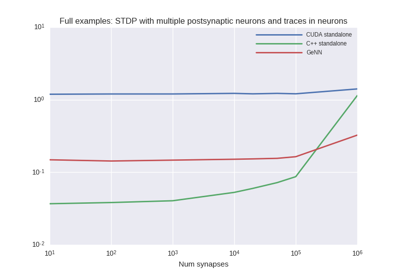


<details><summary>Examplary `nvprof` results for **CUDAStandaloneConfiguration**</summary><p>
Profile summary for `N = 1000`:

```
==7675== NVPROF is profiling process 7675, command: ./main
==7675== Profiling application: ./main
==7675== Profiling result:
Time(%)      Time     Calls       Avg       Min       Max  Name
 17.97%  63.707ms     20000  3.1850us  3.0400us  3.7760us  [CUDA memset]
 16.36%  57.989ms     10000  5.7980us  5.5040us  7.3600us  kernel_neurongroup_1_stateupdater_codeobject(unsigned int, unsigned int, double*, double*, double*, double*)
 12.34%  43.742ms     10001  4.3730us  3.7440us  5.7600us  void gen_sequenced<curandStateXORWOW, float, int, __operator_&__(float curand_uniform_noargs<curandStateXORWOW>(curandStateXORWOW*, int))>(curandStateXORWOW*, float*, unsigned long, unsigned long, int)
 10.67%  37.828ms     10000  3.7820us  3.4880us  9.6320us  kernel_synapses_pre_codeobject(unsigned int, unsigned int, unsigned int, int*, unsigned int, double*, int, int*, double*, double*, double*, int, int*, int, int*, int, double*)
 10.37%  36.749ms     10000  3.6740us  3.4240us  95.425us  kernel_synapses_post_codeobject(unsigned int, unsigned int, unsigned int, int*, unsigned int, double*, int, int*, double*, double*, int, double*, int*, int, int)
  8.58%  30.409ms     30965     982ns     928ns  1.6000us  [CUDA memcpy HtoD]
  7.05%  24.997ms     10000  2.4990us  2.4000us  2.9120us  kernel_neurongroup_stateupdater_codeobject(unsigned int, unsigned int, double*, double*)
  4.93%  17.461ms     10000  1.7460us  1.4080us  2.5280us  kernel_neurongroup_1_thresholder_codeobject(unsigned int, unsigned int, int*, double*)
  4.87%  17.255ms     10000  1.7250us  1.6640us  2.3360us  kernel_neurongroup_thresholder_codeobject(unsigned int, unsigned int, int*, double*, double*)
  4.35%  15.436ms     10000  1.5430us  1.5040us  2.2080us  kernel_neurongroup_1_resetter_codeobject(unsigned int, unsigned int, double*, int*, double*)
  2.32%  8.2353ms         1  8.2353ms  8.2353ms  8.2353ms  generate_seed_pseudo(__int64, __int64, __int64, curandOrdering, curandStateXORWOW*, unsigned int*)
  0.07%  259.87us         1  259.87us  259.87us  259.87us  _run_synapses_post_initialise_queue_kernel(unsigned int, unsigned int, unsigned int, double, unsigned int, unsigned int, bool)
  0.07%  249.38us         1  249.38us  249.38us  249.38us  _run_synapses_pre_initialise_queue_kernel(unsigned int, unsigned int, unsigned int, double, unsigned int, unsigned int, bool)
  0.02%  63.584us        21  3.0270us  2.1440us  4.8960us  [CUDA memcpy DtoH]
  0.01%  27.296us         1  27.296us  27.296us  27.296us  synapses_post_destroy(void)
  0.01%  23.648us         1  23.648us  23.648us  23.648us  synapses_pre_destroy(void)
  0.01%  20.960us         1  20.960us  20.960us  20.960us  synapses_post_init(unsigned int, unsigned int, double*, int*, int*, double, int, int)
  0.00%  17.248us         1  17.248us  17.248us  17.248us  synapses_pre_init(unsigned int, unsigned int, double*, int*, int*, double, int, int)
  0.00%  8.3520us         4  2.0880us  1.9200us  2.5600us  void thrust::system::cuda::detail::bulk_::detail::launch_by_value<unsigned int=0, thrust::system::cuda::detail::bulk_::detail::cuda_task<thrust::system::cuda::detail::bulk_::parallel_group<thrust::system::cuda::detail::bulk_::concurrent_group<thrust::system::cuda::detail::bulk_::agent<unsigned long=1>, unsigned long=0>, unsigned long=0>, thrust::system::cuda::detail::bulk_::detail::closure<thrust::system::cuda::detail::for_each_n_detail::for_each_kernel, thrust::tuple<thrust::system::cuda::detail::bulk_::detail::cursor<unsigned int=0>, thrust::device_ptr<double>, thrust::detail::wrapped_function<thrust::detail::device_generate_functor<thrust::detail::fill_functor<double>>, void>, unsigned int, thrust::null_type, thrust::null_type, thrust::null_type, thrust::null_type, thrust::null_type, thrust::null_type>>>>(unsigned long=1)
  0.00%  3.9680us         2  1.9840us  1.7600us  2.2080us  void thrust::system::cuda::detail::bulk_::detail::launch_by_value<unsigned int=0, thrust::system::cuda::detail::bulk_::detail::cuda_task<thrust::system::cuda::detail::bulk_::parallel_group<thrust::system::cuda::detail::bulk_::concurrent_group<thrust::system::cuda::detail::bulk_::agent<unsigned long=1>, unsigned long=0>, unsigned long=0>, thrust::system::cuda::detail::bulk_::detail::closure<thrust::system::cuda::detail::for_each_n_detail::for_each_kernel, thrust::tuple<thrust::system::cuda::detail::bulk_::detail::cursor<unsigned int=0>, thrust::device_ptr<int>, thrust::detail::wrapped_function<thrust::detail::device_generate_functor<thrust::detail::fill_functor<int>>, void>, unsigned int, thrust::null_type, thrust::null_type, thrust::null_type, thrust::null_type, thrust::null_type, thrust::null_type>>>>(unsigned long=1)
  0.00%  2.4960us         1  2.4960us  2.4960us  2.4960us  kernel_synapses_group_variable_set_conditional_codeobject(unsigned int, unsigned int, float*, int*, double*, int)

==7675== API calls:
Time(%)      Time     Calls       Avg       Min       Max  Name
 33.05%  829.09ms     80015  10.361us  8.3180us  544.14us  cudaLaunch
 20.01%  501.94ms    220006  2.2810us     878ns  336.93us  cudaEventRecord
 10.10%  253.47ms     30967  8.1850us  6.1430us  344.26us  cudaMemcpy
  9.49%  237.94ms         1  237.94ms  237.94ms  237.94ms  cudaDeviceSetLimit
  8.00%  200.73ms     20000  10.036us  8.6830us  352.57us  cudaMemset
  5.73%  143.77ms    110000  1.3070us     984ns  348.53us  cudaEventElapsedTime
  5.28%  132.53ms    109989  1.2040us     668ns  338.71us  cudaEventQuery
  4.66%  117.00ms    610053     191ns     141ns  340.44us  cudaSetupArgument
  1.16%  28.990ms     90005     322ns     156ns  339.07us  cudaGetLastError
  1.14%  28.526ms     80015     356ns     250ns  338.77us  cudaConfigureCall
  0.88%  22.185ms        22  1.0084ms  12.871us  13.362ms  cudaFree
  0.40%  10.041ms       961  10.448us  7.2310us  132.96us  cudaMalloc
  0.03%  752.06us         3  250.69us  218.03us  298.84us  cudaGetDeviceProperties
  0.02%  608.54us        36  16.903us     299ns  240.32us  cudaMemcpyAsync
  0.02%  486.33us       166  2.9290us     122ns  128.47us  cuDeviceGetAttribute
  0.00%  81.579us        32  2.5490us  2.0040us  6.6060us  cudaFuncGetAttributes
  0.00%  63.324us         2  31.662us  31.564us  31.760us  cuDeviceTotalMem
  0.00%  60.983us         2  30.491us  29.046us  31.937us  cuDeviceGetName
  0.00%  41.791us         5  8.3580us  7.7770us  9.1680us  cudaMemcpyToSymbol
  0.00%  22.417us        22  1.0180us     624ns  5.1830us  cudaEventCreate
  0.00%  12.785us         6  2.1300us  1.5000us  4.5630us  cudaEventCreateWithFlags
  0.00%  12.013us        19     632ns     297ns  3.3840us  cudaGetDevice
  0.00%  6.3870us         1  6.3870us  6.3870us  6.3870us  cudaDeviceSynchronize
  0.00%  6.2930us         6  1.0480us     899ns  1.5320us  cudaEventDestroy
  0.00%  6.2560us         1  6.2560us  6.2560us  6.2560us  cudaThreadSynchronize
  0.00%  4.8070us        11     437ns     295ns  1.2590us  cudaDeviceGetAttribute
  0.00%  3.1880us         3  1.0620us     204ns  1.7810us  cuDeviceGetCount
  0.00%  1.2490us         3     416ns     223ns     709ns  cuDeviceGet
  0.00%     679ns         1     679ns     679ns     679ns  cuInit
  0.00%     380ns         1     380ns     380ns     380ns  cuDriverGetVersion

```

</p></details>


<details><summary>Examplary `nvprof` results for **GeNNConfiguration**</summary><p>
Profile summary for `N = 1000`:

```
==8080== NVPROF is profiling process 8080, command: ./main test 10.0 1
==8080== Profiling application: ./main test 10.0 1
==8080== Profiling result:
Time(%)      Time     Calls       Avg       Min       Max  Name
 51.62%  449.39ms    100000  4.4930us  4.4160us  12.896us  calcNeurons
 27.96%  243.43ms    100000  2.4340us  2.4000us  108.45us  learnSynapsesPost
 20.40%  177.57ms    100000  1.7750us  1.5680us  10.816us  calcSynapses
  0.01%  77.440us        70  1.1060us     960ns  2.0160us  [CUDA memcpy HtoD]
  0.00%  41.312us        17  2.4300us  2.0160us  4.7680us  [CUDA memcpy DtoH]

==8080== API calls:
Time(%)      Time     Calls       Avg       Min       Max  Name
 86.26%  2.42517s    300000  8.0830us  7.0240us  3.0666ms  cudaLaunch
  7.54%  212.09ms        20  10.605ms  11.455us  210.63ms  cudaHostAlloc
  3.49%  98.203ms    300000     327ns     229ns  351.28us  cudaConfigureCall
  2.61%  73.487ms    300000     244ns     211ns  10.729us  cudaSetupArgument
  0.05%  1.3293ms        93  14.293us     300ns  36.823us  cudaMemcpy
  0.02%  637.20us        20  31.859us  9.2850us  152.54us  cudaMalloc
  0.01%  340.37us        83  4.1000us     145ns  158.51us  cuDeviceGetAttribute
  0.00%  31.216us         1  31.216us  31.216us  31.216us  cuDeviceTotalMem
  0.00%  25.116us         1  25.116us  25.116us  25.116us  cuDeviceGetName
  0.00%  17.977us         1  17.977us  17.977us  17.977us  cudaSetDevice
  0.00%  16.311us        20     815ns     557ns  2.9170us  cudaGetSymbolAddress
  0.00%  2.5090us         1  2.5090us  2.5090us  2.5090us  cudaGetDeviceCount
  0.00%  1.3610us         2     680ns     425ns     936ns  cuDeviceGetCount
  0.00%     490ns         2     245ns     187ns     303ns  cuDeviceGet

```

</p></details>


***

### STDPNeuronalTraces

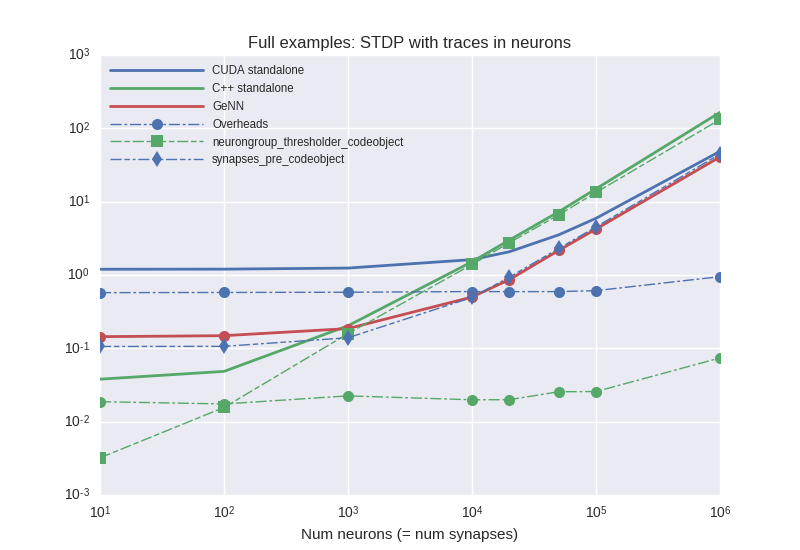
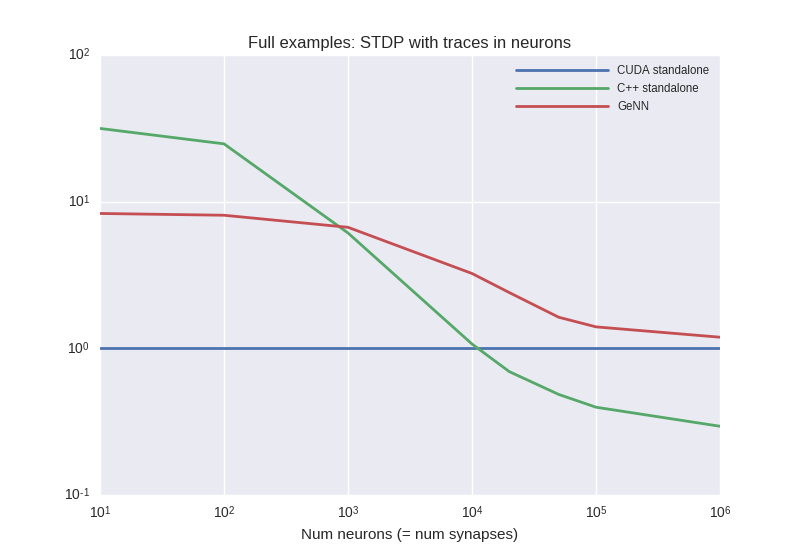

<details><summary>Examplary `nvprof` results for **CUDAStandaloneConfiguration**</summary><p>
Profile summary for `N = 1000`:

```
==20490== NVPROF is profiling process 20490, command: ./main
==20490== Profiling application: ./main
==20490== Profiling result:
Time(%)      Time     Calls       Avg       Min       Max  Name
 19.15%  77.330ms     10000  7.7330us  3.5840us  25.792us  kernel_synapses_pre_codeobject(unsigned int, unsigned int, unsigned int, int*, unsigned int, double*, int, int*, double*, double*, double*, int, int*, int, int*, int, double*)
 15.74%  63.558ms     20000  3.1770us  3.0400us  3.7440us  [CUDA memset]
 14.33%  57.872ms     10000  5.7870us  5.3760us  7.0720us  kernel_neurongroup_1_stateupdater_codeobject(unsigned int, unsigned int, double*, double*, double*, double*)
 12.81%  51.726ms     10001  5.1720us  4.6080us  5.8560us  void gen_sequenced<curandStateXORWOW, float, int, __operator_&__(float curand_uniform_noargs<curandStateXORWOW>(curandStateXORWOW*, int))>(curandStateXORWOW*, float*, unsigned long, unsigned long, int)
  9.59%  38.728ms     10000  3.8720us  3.7760us  6.3680us  kernel_synapses_post_codeobject(unsigned int, unsigned int, unsigned int, int*, unsigned int, double*, int, int*, double*, double*, int, double*, int*, int, int)
  7.55%  30.485ms     31050     981ns     928ns  40.512us  [CUDA memcpy HtoD]
  6.02%  24.313ms     10000  2.4310us  2.4000us  3.2000us  kernel_neurongroup_stateupdater_codeobject(unsigned int, unsigned int, double*, double*)
  5.06%  20.424ms     10000  2.0420us  1.8240us  2.5920us  kernel_neurongroup_thresholder_codeobject(unsigned int, unsigned int, int*, double*, double*)
  3.96%  15.974ms     10000  1.5970us  1.3760us  2.5600us  kernel_neurongroup_1_thresholder_codeobject(unsigned int, unsigned int, int*, double*)
  3.57%  14.426ms     10000  1.4420us  1.3120us  2.4320us  kernel_neurongroup_1_resetter_codeobject(unsigned int, unsigned int, double*, int*, double*)
  2.07%  8.3788ms         1  8.3788ms  8.3788ms  8.3788ms  generate_seed_pseudo(__int64, __int64, __int64, curandOrdering, curandStateXORWOW*, unsigned int*)
  0.06%  258.88us         1  258.88us  258.88us  258.88us  _run_synapses_post_initialise_queue_kernel(unsigned int, unsigned int, unsigned int, double, unsigned int, unsigned int, bool)
  0.06%  249.63us         1  249.63us  249.63us  249.63us  _run_synapses_pre_initialise_queue_kernel(unsigned int, unsigned int, unsigned int, double, unsigned int, unsigned int, bool)
  0.02%  70.432us        21  3.3530us  2.0480us  5.0560us  [CUDA memcpy DtoH]
  0.01%  27.296us         1  27.296us  27.296us  27.296us  synapses_post_destroy(void)
  0.01%  23.648us         1  23.648us  23.648us  23.648us  synapses_pre_destroy(void)
  0.01%  20.640us         1  20.640us  20.640us  20.640us  synapses_post_init(unsigned int, unsigned int, double*, int*, int*, double, int, int)
  0.00%  17.057us         1  17.057us  17.057us  17.057us  synapses_pre_init(unsigned int, unsigned int, double*, int*, int*, double, int, int)
  0.00%  8.0320us         4  2.0080us  1.9200us  2.2720us  void thrust::system::cuda::detail::bulk_::detail::launch_by_value<unsigned int=0, thrust::system::cuda::detail::bulk_::detail::cuda_task<thrust::system::cuda::detail::bulk_::parallel_group<thrust::system::cuda::detail::bulk_::concurrent_group<thrust::system::cuda::detail::bulk_::agent<unsigned long=1>, unsigned long=0>, unsigned long=0>, thrust::system::cuda::detail::bulk_::detail::closure<thrust::system::cuda::detail::for_each_n_detail::for_each_kernel, thrust::tuple<thrust::system::cuda::detail::bulk_::detail::cursor<unsigned int=0>, thrust::device_ptr<double>, thrust::detail::wrapped_function<thrust::detail::device_generate_functor<thrust::detail::fill_functor<double>>, void>, unsigned int, thrust::null_type, thrust::null_type, thrust::null_type, thrust::null_type, thrust::null_type, thrust::null_type>>>>(unsigned long=1)
  0.00%  3.9040us         2  1.9520us  1.7600us  2.1440us  void thrust::system::cuda::detail::bulk_::detail::launch_by_value<unsigned int=0, thrust::system::cuda::detail::bulk_::detail::cuda_task<thrust::system::cuda::detail::bulk_::parallel_group<thrust::system::cuda::detail::bulk_::concurrent_group<thrust::system::cuda::detail::bulk_::agent<unsigned long=1>, unsigned long=0>, unsigned long=0>, thrust::system::cuda::detail::bulk_::detail::closure<thrust::system::cuda::detail::for_each_n_detail::for_each_kernel, thrust::tuple<thrust::system::cuda::detail::bulk_::detail::cursor<unsigned int=0>, thrust::device_ptr<int>, thrust::detail::wrapped_function<thrust::detail::device_generate_functor<thrust::detail::fill_functor<int>>, void>, unsigned int, thrust::null_type, thrust::null_type, thrust::null_type, thrust::null_type, thrust::null_type, thrust::null_type>>>>(unsigned long=1)
  0.00%  2.6880us         1  2.6880us  2.6880us  2.6880us  kernel_synapses_group_variable_set_conditional_codeobject(unsigned int, unsigned int, float*, int*, double*, int)

==20490== API calls:
Time(%)      Time     Calls       Avg       Min       Max  Name
 32.71%  801.65ms     80015  10.018us  8.0520us  539.46us  cudaLaunch
 19.98%  489.57ms    220006  2.2250us     870ns  343.82us  cudaEventRecord
 10.35%  253.59ms     31052  8.1660us  6.0890us  341.44us  cudaMemcpy
  9.66%  236.69ms         1  236.69ms  236.69ms  236.69ms  cudaDeviceSetLimit
  7.99%  195.90ms     20000  9.7940us  8.3070us  340.56us  cudaMemset
  5.63%  138.04ms    110000  1.2540us     883ns  336.45us  cudaEventElapsedTime
  5.22%  127.97ms    109989  1.1630us     647ns  346.15us  cudaEventQuery
  4.77%  116.85ms    610053     191ns     141ns  346.15us  cudaSetupArgument
  1.16%  28.531ms     90005     316ns     156ns  337.05us  cudaGetLastError
  1.10%  26.983ms     80015     337ns     232ns  330.71us  cudaConfigureCall
  0.90%  22.096ms        22  1.0044ms  6.1640us  13.292ms  cudaFree
  0.44%  10.875ms      1046  10.397us  7.2520us  138.19us  cudaMalloc
  0.03%  671.42us         3  223.81us  217.53us  234.61us  cudaGetDeviceProperties
  0.02%  575.93us        36  15.998us     172ns  181.34us  cudaMemcpyAsync
  0.02%  451.37us       166  2.7190us     121ns  98.255us  cuDeviceGetAttribute
  0.00%  97.362us         5  19.472us  7.4290us  48.098us  cudaMemcpyToSymbol
  0.00%  78.965us        32  2.4670us  1.9700us  6.4630us  cudaFuncGetAttributes
  0.00%  62.809us         2  31.404us  31.179us  31.630us  cuDeviceTotalMem
  0.00%  57.822us         2  28.911us  28.691us  29.131us  cuDeviceGetName
  0.00%  21.252us        22     966ns     553ns  5.0430us  cudaEventCreate
  0.00%  12.092us        19     636ns     286ns  3.5870us  cudaGetDevice
  0.00%  11.287us         6  1.8810us  1.3850us  3.8170us  cudaEventCreateWithFlags
  0.00%  6.4280us         1  6.4280us  6.4280us  6.4280us  cudaDeviceSynchronize
  0.00%  5.8830us         1  5.8830us  5.8830us  5.8830us  cudaThreadSynchronize
  0.00%  5.5770us         6     929ns     773ns  1.4270us  cudaEventDestroy
  0.00%  4.3960us        11     399ns     277ns  1.1360us  cudaDeviceGetAttribute
  0.00%  1.6330us         3     544ns     194ns     995ns  cuDeviceGetCount
  0.00%     713ns         3     237ns     215ns     277ns  cuDeviceGet
  0.00%     646ns         1     646ns     646ns     646ns  cuInit
  0.00%     375ns         1     375ns     375ns     375ns  cuDriverGetVersion

```

</p></details>


<details><summary>Examplary `nvprof` results for **GeNNConfiguration**</summary><p>
Profile summary for `N = 1000`:

```
==20856== NVPROF is profiling process 20856, command: ./main test 10.0 1
==20856== Profiling application: ./main test 10.0 1
==20856== Profiling result:
Time(%)      Time     Calls       Avg       Min       Max  Name
 45.87%  557.32ms    100000  5.5730us  1.4400us  24.800us  calcSynapses
 36.59%  444.58ms    100000  4.4450us  3.7120us  6.8800us  calcNeurons
 17.52%  212.90ms    100000  2.1280us  2.0480us  6.0800us  learnSynapsesPost
  0.01%  90.336us        70  1.2900us     960ns  2.2080us  [CUDA memcpy HtoD]
  0.00%  47.840us        17  2.8140us  1.9520us  4.7360us  [CUDA memcpy DtoH]

==20856== API calls:
Time(%)      Time     Calls       Avg       Min       Max  Name
 86.40%  2.43453s    300000  8.1150us  7.0250us  3.0816ms  cudaLaunch
  7.53%  212.30ms        20  10.615ms  7.3720us  211.14ms  cudaHostAlloc
  3.28%  92.387ms    300000     307ns     226ns  348.95us  cudaConfigureCall
  2.71%  76.439ms    300000     254ns     220ns  10.850us  cudaSetupArgument
  0.04%  1.1218ms        93  12.062us     202ns  34.560us  cudaMemcpy
  0.02%  494.05us        20  24.702us  6.3610us  122.86us  cudaMalloc
  0.01%  233.98us        83  2.8190us     145ns  102.96us  cuDeviceGetAttribute
  0.00%  42.310us         1  42.310us  42.310us  42.310us  cuDeviceTotalMem
  0.00%  35.143us         1  35.143us  35.143us  35.143us  cuDeviceGetName
  0.00%  18.014us         1  18.014us  18.014us  18.014us  cudaSetDevice
  0.00%  12.312us        20     615ns     435ns  2.1740us  cudaGetSymbolAddress
  0.00%  2.2180us         2  1.1090us     716ns  1.5020us  cuDeviceGetCount
  0.00%  1.4700us         1  1.4700us  1.4700us  1.4700us  cudaGetDeviceCount
  0.00%     876ns         2     438ns     352ns     524ns  cuDeviceGet

```

</p></details>


***

### STDPNotEventDriven
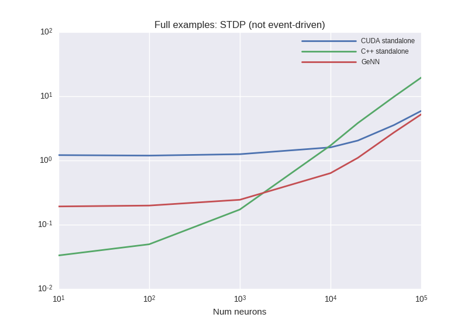


<details><summary>Examplary `nvprof` results for **CUDAStandaloneConfiguration**</summary><p>
Profile summary for `N = 1000`:

```
==10829== NVPROF is profiling process 10829, command: ./main
==10829== Profiling application: ./main
==10829== Profiling result:
Time(%)      Time     Calls       Avg       Min       Max  Name
 18.93%  75.329ms     10000  7.5320us  3.5840us  24.640us  kernel_synapses_pre_codeobject(unsigned int, unsigned int, unsigned int, int*, unsigned int, double*, int, double*, int, double*, int, int*, int, double*, double*, double*, int, int*, int, int*)
 16.03%  63.756ms     20000  3.1870us  3.0400us  3.7440us  [CUDA memset]
 12.95%  51.515ms     10000  5.1510us  4.7680us  7.1360us  kernel_neurongroup_stateupdater_codeobject(unsigned int, unsigned int, double*, double*, double*)
 12.23%  48.670ms     10001  4.8660us  4.2560us  6.0160us  void gen_sequenced<curandStateXORWOW, float, int, __operator_&__(float curand_uniform_noargs<curandStateXORWOW>(curandStateXORWOW*, int))>(curandStateXORWOW*, float*, unsigned long, unsigned long, int)
 10.29%  40.953ms     10000  4.0950us  3.7760us  6.3040us  kernel_synapses_post_codeobject(unsigned int, unsigned int, unsigned int, int*, unsigned int, double*, int, double*, int, double*, int, int*, int, double*, double*, int, int*)
  7.67%  30.497ms     31048     982ns     928ns  40.384us  [CUDA memcpy HtoD]
  6.85%  27.258ms     10000  2.7250us  2.4000us  3.2320us  kernel_synapses_stateupdater_codeobject(unsigned int, unsigned int, double*, int, double*, int, double*, int*)
  5.20%  20.694ms     10000  2.0690us  1.7920us  2.8480us  kernel_poissongroup_thresholder_codeobject(unsigned int, unsigned int, int*, double*, double*)
  3.86%  15.374ms     10000  1.5370us  1.5040us  1.7600us  kernel_neurongroup_resetter_codeobject(unsigned int, unsigned int, double*, int*)
  3.72%  14.803ms     10000  1.4800us  1.3440us  2.3040us  kernel_neurongroup_thresholder_codeobject(unsigned int, unsigned int, int*, double*)
  2.09%  8.3131ms         1  8.3131ms  8.3131ms  8.3131ms  generate_seed_pseudo(__int64, __int64, __int64, curandOrdering, curandStateXORWOW*, unsigned int*)
  0.06%  258.31us         1  258.31us  258.31us  258.31us  _run_synapses_post_initialise_queue_kernel(unsigned int, unsigned int, unsigned int, double, unsigned int, unsigned int, bool)
  0.06%  249.15us         1  249.15us  249.15us  249.15us  _run_synapses_pre_initialise_queue_kernel(unsigned int, unsigned int, unsigned int, double, unsigned int, unsigned int, bool)
  0.02%  73.536us        21  3.5010us  2.0800us  5.1520us  [CUDA memcpy DtoH]
  0.01%  27.360us         1  27.360us  27.360us  27.360us  synapses_post_destroy(void)
  0.01%  23.648us         1  23.648us  23.648us  23.648us  synapses_pre_destroy(void)
  0.01%  20.960us         1  20.960us  20.960us  20.960us  synapses_post_init(unsigned int, unsigned int, double*, int*, int*, double, int, int)
  0.00%  16.960us         1  16.960us  16.960us  16.960us  synapses_pre_init(unsigned int, unsigned int, double*, int*, int*, double, int, int)
  0.00%  11.872us         6  1.9780us  1.8560us  2.2720us  void thrust::system::cuda::detail::bulk_::detail::launch_by_value<unsigned int=0, thrust::system::cuda::detail::bulk_::detail::cuda_task<thrust::system::cuda::detail::bulk_::parallel_group<thrust::system::cuda::detail::bulk_::concurrent_group<thrust::system::cuda::detail::bulk_::agent<unsigned long=1>, unsigned long=0>, unsigned long=0>, thrust::system::cuda::detail::bulk_::detail::closure<thrust::system::cuda::detail::for_each_n_detail::for_each_kernel, thrust::tuple<thrust::system::cuda::detail::bulk_::detail::cursor<unsigned int=0>, thrust::device_ptr<double>, thrust::detail::wrapped_function<thrust::detail::device_generate_functor<thrust::detail::fill_functor<double>>, void>, unsigned int, thrust::null_type, thrust::null_type, thrust::null_type, thrust::null_type, thrust::null_type, thrust::null_type>>>>(unsigned long=1)
  0.00%  3.9040us         2  1.9520us  1.7920us  2.1120us  void thrust::system::cuda::detail::bulk_::detail::launch_by_value<unsigned int=0, thrust::system::cuda::detail::bulk_::detail::cuda_task<thrust::system::cuda::detail::bulk_::parallel_group<thrust::system::cuda::detail::bulk_::concurrent_group<thrust::system::cuda::detail::bulk_::agent<unsigned long=1>, unsigned long=0>, unsigned long=0>, thrust::system::cuda::detail::bulk_::detail::closure<thrust::system::cuda::detail::for_each_n_detail::for_each_kernel, thrust::tuple<thrust::system::cuda::detail::bulk_::detail::cursor<unsigned int=0>, thrust::device_ptr<int>, thrust::detail::wrapped_function<thrust::detail::device_generate_functor<thrust::detail::fill_functor<int>>, void>, unsigned int, thrust::null_type, thrust::null_type, thrust::null_type, thrust::null_type, thrust::null_type, thrust::null_type>>>>(unsigned long=1)
  0.00%  2.5280us         1  2.5280us  2.5280us  2.5280us  kernel_synapses_group_variable_set_conditional_codeobject(unsigned int, unsigned int, float*, int*, double*, int)

==10829== API calls:
Time(%)      Time     Calls       Avg       Min       Max  Name
 32.56%  822.38ms     80017  10.277us  8.3320us  537.85us  cudaLaunch
 20.17%  509.56ms    220008  2.3160us     877ns  340.43us  cudaEventRecord
 10.11%  255.48ms     31048  8.2280us  6.1940us  352.94us  cudaMemcpy
  9.63%  243.38ms         1  243.38ms  243.38ms  243.38ms  cudaDeviceSetLimit
  8.09%  204.30ms     20000  10.214us  8.5940us  339.98us  cudaMemset
  5.53%  139.62ms    110000  1.2690us     903ns  336.16us  cudaEventElapsedTime
  5.25%  132.52ms    680055     194ns     143ns  344.36us  cudaSetupArgument
  5.08%  128.29ms    109989  1.1660us     663ns  333.66us  cudaEventQuery
  1.11%  28.107ms     90005     312ns     156ns  334.97us  cudaGetLastError
  1.06%  26.730ms     80017     334ns     210ns  337.71us  cudaConfigureCall
  0.88%  22.138ms        22  1.0063ms  12.779us  13.235ms  cudaFree
  0.44%  11.211ms      1046  10.717us  7.7120us  130.17us  cudaMalloc
  0.03%  747.67us         3  249.22us  217.29us  296.41us  cudaGetDeviceProperties
  0.03%  671.37us        44  15.258us     352ns  180.84us  cudaMemcpyAsync
  0.02%  508.96us       166  3.0660us     125ns  131.73us  cuDeviceGetAttribute
  0.00%  104.72us         2  52.360us  28.779us  75.942us  cuDeviceGetName
  0.00%  98.114us         5  19.622us  7.5360us  47.787us  cudaMemcpyToSymbol
  0.00%  97.015us        40  2.4250us  2.0220us  6.0000us  cudaFuncGetAttributes
  0.00%  77.472us         2  38.736us  31.555us  45.917us  cuDeviceTotalMem
  0.00%  22.802us        22  1.0360us     603ns  5.4710us  cudaEventCreate
  0.00%  13.843us        25     553ns     293ns  3.7280us  cudaGetDevice
  0.00%  11.958us         8  1.4940us  1.4260us  1.7880us  cudaEventCreateWithFlags
  0.00%  7.5290us         8     941ns     819ns  1.5620us  cudaEventDestroy
  0.00%  6.6440us         1  6.6440us  6.6440us  6.6440us  cudaDeviceSynchronize
  0.00%  6.3560us         1  6.3560us  6.3560us  6.3560us  cudaThreadSynchronize
  0.00%  4.4030us        11     400ns     284ns  1.2150us  cudaDeviceGetAttribute
  0.00%  2.5360us         3     845ns     204ns  1.4820us  cuDeviceGetCount
  0.00%  1.0740us         3     358ns     229ns     439ns  cuDeviceGet
  0.00%     856ns         1     856ns     856ns     856ns  cuInit
  0.00%     380ns         1     380ns     380ns     380ns  cuDriverGetVersion

```

</p></details>


<details><summary>Examplary `nvprof` results for **GeNNConfiguration**</summary><p>
Profile summary for `N = 1000`:

```
==11222== NVPROF is profiling process 11222, command: ./main test 10.0 1
==11222== Profiling application: ./main test 10.0 1
==11222== Profiling result:
Time(%)      Time     Calls       Avg       Min       Max  Name
 38.63%  611.91ms    100000  6.1190us  1.4400us  26.656us  calcSynapses
 25.38%  402.12ms    100000  4.0210us  3.3280us  5.8560us  calcNeurons
 21.95%  347.81ms    100000  3.4780us  3.1360us  5.5370us  calcSynapseDynamics
 14.03%  222.22ms    100000  2.2220us  2.0800us  6.3040us  learnSynapsesPost
  0.01%  95.808us        72  1.3300us     960ns  2.0800us  [CUDA memcpy HtoD]
  0.00%  54.272us        19  2.8560us  1.9520us  4.7360us  [CUDA memcpy DtoH]

==11222== API calls:
Time(%)      Time     Calls       Avg       Min       Max  Name
 88.42%  3.28941s    400000  8.2230us  6.9860us  4.7354ms  cudaLaunch
  5.51%  205.09ms        21  9.7663ms  7.3280us  203.93ms  cudaHostAlloc
  3.37%  125.52ms    400000     313ns     218ns  363.75us  cudaConfigureCall
  2.63%  97.869ms    400000     244ns     213ns  13.995us  cudaSetupArgument
  0.03%  1.2143ms        97  12.518us     188ns  35.559us  cudaMemcpy
  0.01%  495.10us        21  23.576us  6.2060us  127.41us  cudaMalloc
  0.01%  319.10us        83  3.8440us     180ns  136.84us  cuDeviceGetAttribute
  0.00%  54.629us         1  54.629us  54.629us  54.629us  cuDeviceTotalMem
  0.00%  52.043us         1  52.043us  52.043us  52.043us  cuDeviceGetName
  0.00%  17.581us         1  17.581us  17.581us  17.581us  cudaSetDevice
  0.00%  12.015us        21     572ns     384ns  2.3100us  cudaGetSymbolAddress
  0.00%  3.0100us         2  1.5050us  1.2970us  1.7130us  cuDeviceGetCount
  0.00%  2.4080us         1  2.4080us  2.4080us  2.4080us  cudaGetDeviceCount
  0.00%  1.1650us         2     582ns     524ns     641ns  cuDeviceGet

```

</p></details>


***

### SparseHighRateSynapsesOnly

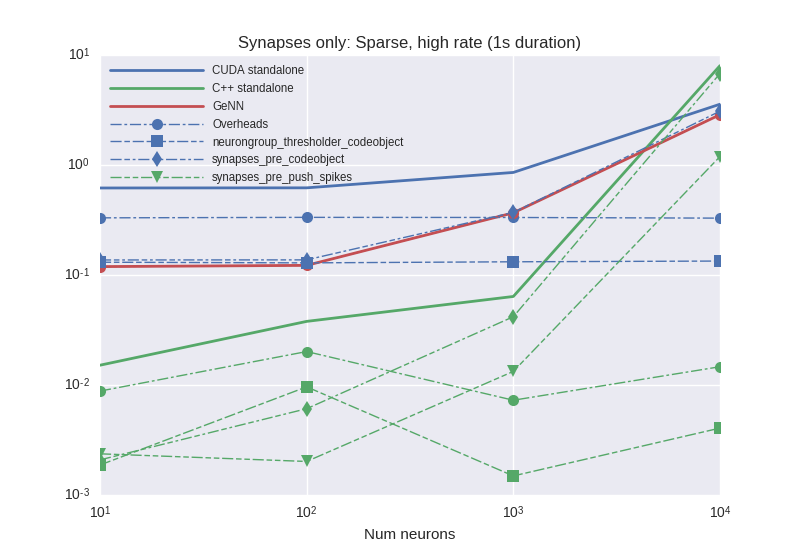


<details><summary>Examplary `nvprof` results for **CUDAStandaloneConfiguration**</summary><p>
Profile summary for `N = 1000`:

```
==24316== NVPROF is profiling process 24316, command: ./main
==24316== Profiling application: ./main
==24316== Profiling result:
Time(%)      Time     Calls       Avg       Min       Max  Name
 78.36%  303.86ms     10000  30.386us  29.568us  32.320us  kernel_synapses_pre_codeobject(unsigned int, unsigned int, unsigned int, int*, unsigned int, double*, int, int*, int, double*, double*, int*, int, int*)
  7.97%  30.904ms     10000  3.0900us  3.0400us  3.5840us  [CUDA memset]
  7.62%  29.566ms     30175     979ns     928ns  3.1680us  [CUDA memcpy HtoD]
  3.83%  14.844ms     10000  1.4840us  1.4400us  2.2080us  kernel_neurongroup_thresholder_codeobject(unsigned int, unsigned int, int*)
  2.12%  8.2218ms         1  8.2218ms  8.2218ms  8.2218ms  generate_seed_pseudo(__int64, __int64, __int64, curandOrdering, curandStateXORWOW*, unsigned int*)
  0.06%  250.56us         1  250.56us  250.56us  250.56us  _run_synapses_pre_initialise_queue_kernel(unsigned int, unsigned int, unsigned int, double, unsigned int, unsigned int, bool)
  0.02%  72.896us        16  4.5560us  2.1760us  14.368us  [CUDA memcpy DtoH]
  0.01%  25.664us         1  25.664us  25.664us  25.664us  synapses_pre_destroy(void)
  0.01%  20.544us         1  20.544us  20.544us  20.544us  synapses_pre_init(unsigned int, unsigned int, double*, int*, int*, double, int, int)
  0.00%  6.8480us         1  6.8480us  6.8480us  6.8480us  void gen_sequenced<curandStateXORWOW, float, int, __operator_&__(float curand_uniform_noargs<curandStateXORWOW>(curandStateXORWOW*, int))>(curandStateXORWOW*, float*, unsigned long, unsigned long, int)
  0.00%  4.2240us         2  2.1120us  1.9520us  2.2720us  void thrust::system::cuda::detail::bulk_::detail::launch_by_value<unsigned int=0, thrust::system::cuda::detail::bulk_::detail::cuda_task<thrust::system::cuda::detail::bulk_::parallel_group<thrust::system::cuda::detail::bulk_::concurrent_group<thrust::system::cuda::detail::bulk_::agent<unsigned long=1>, unsigned long=0>, unsigned long=0>, thrust::system::cuda::detail::bulk_::detail::closure<thrust::system::cuda::detail::for_each_n_detail::for_each_kernel, thrust::tuple<thrust::system::cuda::detail::bulk_::detail::cursor<unsigned int=0>, thrust::device_ptr<double>, thrust::detail::wrapped_function<thrust::detail::device_generate_functor<thrust::detail::fill_functor<double>>, void>, unsigned int, thrust::null_type, thrust::null_type, thrust::null_type, thrust::null_type, thrust::null_type, thrust::null_type>>>>(unsigned long=1)
  0.00%  4.0640us         2  2.0320us  1.7920us  2.2720us  void thrust::system::cuda::detail::bulk_::detail::launch_by_value<unsigned int=0, thrust::system::cuda::detail::bulk_::detail::cuda_task<thrust::system::cuda::detail::bulk_::parallel_group<thrust::system::cuda::detail::bulk_::concurrent_group<thrust::system::cuda::detail::bulk_::agent<unsigned long=1>, unsigned long=0>, unsigned long=0>, thrust::system::cuda::detail::bulk_::detail::closure<thrust::system::cuda::detail::for_each_n_detail::for_each_kernel, thrust::tuple<thrust::system::cuda::detail::bulk_::detail::cursor<unsigned int=0>, thrust::device_ptr<int>, thrust::detail::wrapped_function<thrust::detail::device_generate_functor<thrust::detail::fill_functor<int>>, void>, unsigned int, thrust::null_type, thrust::null_type, thrust::null_type, thrust::null_type, thrust::null_type, thrust::null_type>>>>(unsigned long=1)

==24316== API calls:
Time(%)      Time     Calls       Avg       Min       Max  Name
 32.63%  472.86ms     30178  15.668us  6.3010us  338.46us  cudaMemcpy
 16.03%  232.22ms         1  232.22ms  232.22ms  232.22ms  cudaDeviceSetLimit
 15.66%  226.96ms    100004  2.2690us     912ns  338.04us  cudaEventRecord
 14.82%  214.77ms     20009  10.733us  10.012us  534.75us  cudaLaunch
  7.71%  111.69ms     10000  11.168us  10.502us  23.780us  cudaMemset
  4.43%  64.189ms     50000  1.2830us     965ns  18.327us  cudaEventElapsedTime
  3.88%  56.217ms     49995  1.1240us     739ns  15.633us  cudaEventQuery
  2.12%  30.674ms    170030     180ns     145ns  342.67us  cudaSetupArgument
  1.53%  22.195ms        17  1.3056ms  12.125us  13.420ms  cudaFree
  0.49%  7.0538ms     20009     352ns     237ns  335.44us  cudaConfigureCall
  0.42%  6.0297ms     20004     301ns     158ns  329.19us  cudaGetLastError
  0.16%  2.2568ms       172  13.120us  7.8700us  131.02us  cudaMalloc
  0.05%  674.40us         3  224.80us  219.12us  235.25us  cudaGetDeviceProperties
  0.03%  491.14us       166  2.9580us     121ns  120.98us  cuDeviceGetAttribute
  0.02%  289.91us        27  10.737us     347ns  40.901us  cudaMemcpyAsync
  0.02%  226.47us         2  113.23us  31.683us  194.79us  cuDeviceTotalMem
  0.01%  187.68us         2  93.840us  29.840us  157.84us  cuDeviceGetName
  0.00%  45.064us        18  2.5030us  2.0230us  6.1080us  cudaFuncGetAttributes
  0.00%  15.991us         2  7.9950us  7.6720us  8.3190us  cudaMemcpyToSymbol
  0.00%  14.111us        10  1.4110us     616ns  5.3870us  cudaEventCreate
  0.00%  10.072us        13     774ns     284ns  3.6440us  cudaGetDevice
  0.00%  6.8520us         4  1.7130us  1.4110us  2.2900us  cudaEventCreateWithFlags
  0.00%  6.6570us         1  6.6570us  6.6570us  6.6570us  cudaDeviceSynchronize
  0.00%  6.3060us         1  6.3060us  6.3060us  6.3060us  cudaThreadSynchronize
  0.00%  4.3030us        11     391ns     279ns  1.1380us  cudaDeviceGetAttribute
  0.00%  3.8640us         4     966ns     768ns  1.4830us  cudaEventDestroy
  0.00%  1.9810us         3     660ns     207ns  1.1450us  cuDeviceGetCount
  0.00%     730ns         3     243ns     232ns     266ns  cuDeviceGet
  0.00%     683ns         1     683ns     683ns     683ns  cuInit
  0.00%     391ns         1     391ns     391ns     391ns  cuDriverGetVersion

```

</p></details>


<details><summary>Examplary `nvprof` results for **GeNNConfiguration**</summary><p>
Profile summary for `N = 1000`:

```
==24628== NVPROF is profiling process 24628, command: ./main test 10.0 1
==24628== Profiling application: ./main test 10.0 1
==24628== Profiling result:
Time(%)      Time     Calls       Avg       Min       Max  Name
 88.38%  2.92405s    100000  29.240us  3.3920us  33.216us  calcSynapses
 11.62%  384.53ms    100000  3.8450us  3.7440us  4.7680us  calcNeurons
  0.00%  61.216us        44  1.3910us     960ns  3.1360us  [CUDA memcpy HtoD]
  0.00%  38.976us        14  2.7840us  1.9520us  6.6240us  [CUDA memcpy DtoH]

==24628== API calls:
Time(%)      Time     Calls       Avg       Min       Max  Name
 90.37%  3.36225s    200000  16.811us  7.0770us  382.92us  cudaLaunch
  5.87%  218.27ms        12  18.189ms  14.011us  216.59ms  cudaHostAlloc
  1.86%  69.388ms    200000     346ns     232ns  351.36us  cudaConfigureCall
  1.34%  49.772ms    200000     248ns     200ns  343.67us  cudaSetupArgument
  0.53%  19.898ms        61  326.20us     319ns  18.853ms  cudaMemcpy
  0.02%  637.63us        12  53.135us  12.105us  171.66us  cudaMalloc
  0.01%  316.91us        83  3.8180us     275ns  133.18us  cuDeviceGetAttribute
  0.00%  55.021us         1  55.021us  55.021us  55.021us  cuDeviceGetName
  0.00%  50.067us         1  50.067us  50.067us  50.067us  cuDeviceTotalMem
  0.00%  18.164us         1  18.164us  18.164us  18.164us  cudaSetDevice
  0.00%  14.280us        12  1.1900us     763ns  3.3800us  cudaGetSymbolAddress
  0.00%  2.8270us         2  1.4130us  1.2100us  1.6170us  cuDeviceGetCount
  0.00%  2.4100us         1  2.4100us  2.4100us  2.4100us  cudaGetDeviceCount
  0.00%  1.2640us         2     632ns     499ns     765ns  cuDeviceGet

```

</p></details>


***

### SparseLowRateSynapsesOnly


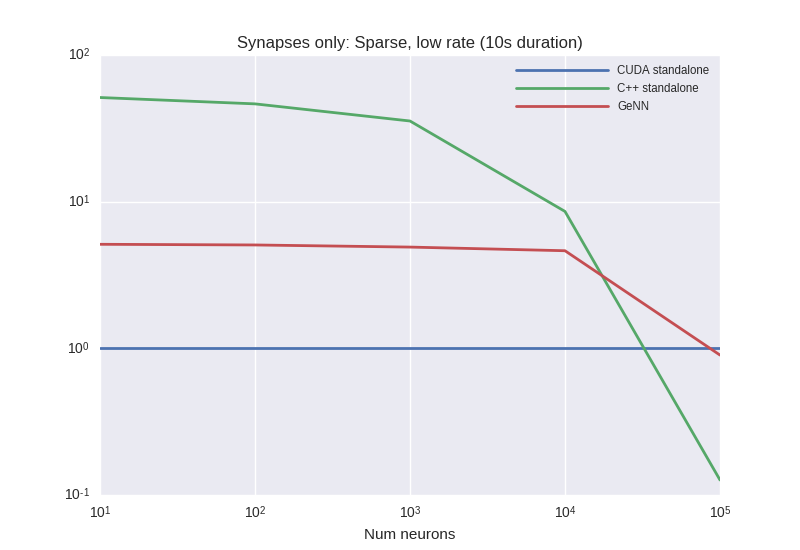

<details><summary>Examplary `nvprof` results for **CUDAStandaloneConfiguration**</summary><p>
Profile summary for `N = 1000`:

```
==16717== NVPROF is profiling process 16717, command: ./main
==16717== Profiling application: ./main
==16717== Profiling result:
Time(%)      Time     Calls       Avg       Min       Max  Name
 37.67%  598.61ms    100000  5.9860us  5.5360us  6.6240us  kernel_synapses_pre_codeobject(unsigned int, unsigned int, unsigned int, int*, unsigned int, double*, int, int*, int, double*, double*, int*, int, int*)
 28.30%  449.67ms    300040  1.4980us     928ns  334.27us  [CUDA memcpy HtoD]
 24.46%  388.65ms    100000  3.8860us  3.0400us  22.630us  [CUDA memset]
  9.03%  143.55ms    100000  1.4350us  1.3760us  2.1440us  kernel_neurongroup_thresholder_codeobject(unsigned int, unsigned int, int*)
  0.51%  8.1332ms         1  8.1332ms  8.1332ms  8.1332ms  generate_seed_pseudo(__int64, __int64, __int64, curandOrdering, curandStateXORWOW*, unsigned int*)
  0.02%  273.21us        16  17.075us  2.7840us  23.156us  [CUDA memcpy DtoH]
  0.02%  251.91us         1  251.91us  251.91us  251.91us  _run_synapses_pre_initialise_queue_kernel(unsigned int, unsigned int, unsigned int, double, unsigned int, unsigned int, bool)
  0.00%  27.488us         1  27.488us  27.488us  27.488us  synapses_pre_destroy(void)
  0.00%  20.736us         1  20.736us  20.736us  20.736us  synapses_pre_init(unsigned int, unsigned int, double*, int*, int*, double, int, int)
  0.00%  6.8800us         1  6.8800us  6.8800us  6.8800us  void gen_sequenced<curandStateXORWOW, float, int, __operator_&__(float curand_uniform_noargs<curandStateXORWOW>(curandStateXORWOW*, int))>(curandStateXORWOW*, float*, unsigned long, unsigned long, int)
  0.00%  3.8720us         2  1.9360us  1.7280us  2.1440us  void thrust::system::cuda::detail::bulk_::detail::launch_by_value<unsigned int=0, thrust::system::cuda::detail::bulk_::detail::cuda_task<thrust::system::cuda::detail::bulk_::parallel_group<thrust::system::cuda::detail::bulk_::concurrent_group<thrust::system::cuda::detail::bulk_::agent<unsigned long=1>, unsigned long=0>, unsigned long=0>, thrust::system::cuda::detail::bulk_::detail::closure<thrust::system::cuda::detail::for_each_n_detail::for_each_kernel, thrust::tuple<thrust::system::cuda::detail::bulk_::detail::cursor<unsigned int=0>, thrust::device_ptr<int>, thrust::detail::wrapped_function<thrust::detail::device_generate_functor<thrust::detail::fill_functor<int>>, void>, unsigned int, thrust::null_type, thrust::null_type, thrust::null_type, thrust::null_type, thrust::null_type, thrust::null_type>>>>(unsigned long=1)
  0.00%  3.8080us         2  1.9040us  1.7280us  2.0800us  void thrust::system::cuda::detail::bulk_::detail::launch_by_value<unsigned int=0, thrust::system::cuda::detail::bulk_::detail::cuda_task<thrust::system::cuda::detail::bulk_::parallel_group<thrust::system::cuda::detail::bulk_::concurrent_group<thrust::system::cuda::detail::bulk_::agent<unsigned long=1>, unsigned long=0>, unsigned long=0>, thrust::system::cuda::detail::bulk_::detail::closure<thrust::system::cuda::detail::for_each_n_detail::for_each_kernel, thrust::tuple<thrust::system::cuda::detail::bulk_::detail::cursor<unsigned int=0>, thrust::device_ptr<double>, thrust::detail::wrapped_function<thrust::detail::device_generate_functor<thrust::detail::fill_functor<double>>, void>, unsigned int, thrust::null_type, thrust::null_type, thrust::null_type, thrust::null_type, thrust::null_type, thrust::null_type>>>>(unsigned long=1)

==16717== API calls:
Time(%)      Time     Calls       Avg       Min       Max  Name
 25.30%  2.43876s    300043  8.1280us  5.1180us  24.216ms  cudaMemcpy
 22.58%  2.17641s   1000004  2.1760us     885ns  1.1082ms  cudaEventRecord
 21.15%  2.03884s    200009  10.193us  9.0150us  1.5991ms  cudaLaunch
 11.04%  1.06451s    100000  10.645us  9.1360us  31.087us  cudaMemset
  6.05%  582.96ms    500000  1.1650us     912ns  325.94us  cudaEventElapsedTime
  5.61%  540.96ms    499995  1.0810us     624ns  347.85us  cudaEventQuery
  3.84%  370.12ms   1700030     217ns     158ns  357.23us  cudaSetupArgument
  2.80%  269.85ms         1  269.85ms  269.85ms  269.85ms  cudaDeviceSetLimit
  0.73%  70.658ms    200009     353ns     212ns  343.03us  cudaConfigureCall
  0.63%  60.885ms    200004     304ns     152ns  345.90us  cudaGetLastError
  0.23%  22.129ms        17  1.3017ms  6.1370us  13.568ms  cudaFree
  0.01%  1.0329ms        37  27.915us  7.5780us  128.98us  cudaMalloc
  0.01%  834.43us         3  278.14us  218.68us  318.20us  cudaGetDeviceProperties
  0.01%  552.75us       166  3.3290us     123ns  132.14us  cuDeviceGetAttribute
  0.00%  217.64us        27  8.0600us     175ns  35.021us  cudaMemcpyAsync
  0.00%  74.244us         2  37.122us  31.695us  42.549us  cuDeviceTotalMem
  0.00%  70.324us         2  35.162us  29.837us  40.487us  cuDeviceGetName
  0.00%  44.692us        18  2.4820us  1.9630us  5.7860us  cudaFuncGetAttributes
  0.00%  15.687us         2  7.8430us  7.4490us  8.2380us  cudaMemcpyToSymbol
  0.00%  13.630us        10  1.3630us     590ns  5.5870us  cudaEventCreate
  0.00%  12.494us        13     961ns     290ns  6.2210us  cudaGetDevice
  0.00%  10.419us         1  10.419us  10.419us  10.419us  cudaDeviceSynchronize
  0.00%  6.4250us         1  6.4250us  6.4250us  6.4250us  cudaThreadSynchronize
  0.00%  6.3180us         4  1.5790us  1.3310us  2.0100us  cudaEventCreateWithFlags
  0.00%  4.2680us        11     388ns     280ns  1.1220us  cudaDeviceGetAttribute
  0.00%  3.8570us         4     964ns     853ns  1.2020us  cudaEventDestroy
  0.00%  2.0800us         3     693ns     384ns  1.1120us  cuDeviceGetCount
  0.00%  1.0550us         1  1.0550us  1.0550us  1.0550us  cuInit
  0.00%     989ns         3     329ns     230ns     394ns  cuDeviceGet
  0.00%     656ns         1     656ns     656ns     656ns  cuDriverGetVersion

```

</p></details>


<details><summary>Examplary `nvprof` results for **GeNNConfiguration**</summary><p>
Profile summary for `N = 1000`:

```
==17305== NVPROF is profiling process 17305, command: ./main test 10.0 1
==17305== Profiling application: ./main test 10.0 1
==17305== Profiling result:
Time(%)      Time     Calls       Avg       Min       Max  Name
 67.59%  569.78ms    100000  5.6970us  3.4240us  6.5920us  calcSynapses
 32.40%  273.09ms    100000  2.7300us  2.6560us  3.7760us  calcNeurons
  0.01%  53.633us        44  1.2180us     960ns  2.0480us  [CUDA memcpy HtoD]
  0.00%  34.912us        14  2.4930us  1.9520us  4.6400us  [CUDA memcpy DtoH]

==17305== API calls:
Time(%)      Time     Calls       Avg       Min       Max  Name
 83.35%  1.65377s    200000  8.2680us  7.0700us  349.09us  cudaLaunch
 10.71%  212.44ms        12  17.703ms  7.8910us  211.33ms  cudaHostAlloc
  3.39%  67.227ms    200000     336ns     241ns  344.12us  cudaConfigureCall
  2.47%  49.012ms    200000     245ns     204ns  338.65us  cudaSetupArgument
  0.04%  750.38us        61  12.301us     321ns  32.577us  cudaMemcpy
  0.02%  428.20us        12  35.683us  6.1760us  120.05us  cudaMalloc
  0.02%  317.76us        83  3.8280us     277ns  134.04us  cuDeviceGetAttribute
  0.00%  45.919us         1  45.919us  45.919us  45.919us  cuDeviceGetName
  0.00%  42.891us         1  42.891us  42.891us  42.891us  cuDeviceTotalMem
  0.00%  18.388us         1  18.388us  18.388us  18.388us  cudaSetDevice
  0.00%  8.3270us        12     693ns     408ns  2.2020us  cudaGetSymbolAddress
  0.00%  2.2780us         1  2.2780us  2.2780us  2.2780us  cudaGetDeviceCount
  0.00%  2.1370us         2  1.0680us     972ns  1.1650us  cuDeviceGetCount
  0.00%     876ns         2     438ns     357ns     519ns  cuDeviceGet

```

</p></details>


***

### SparseMediumRateSynapsesOnly
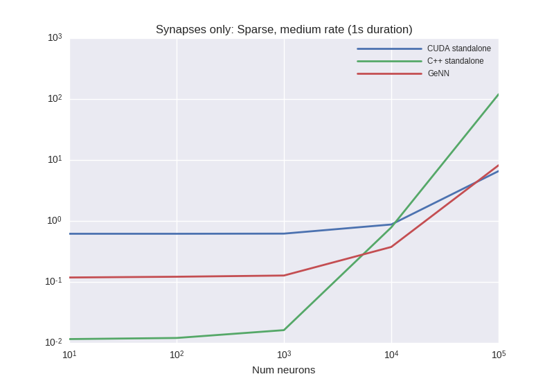
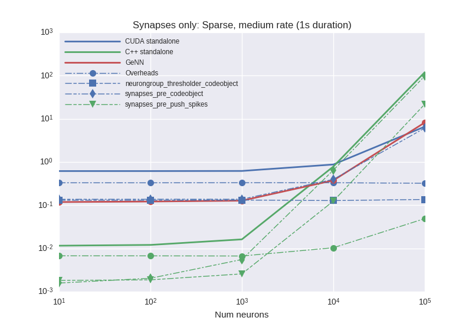
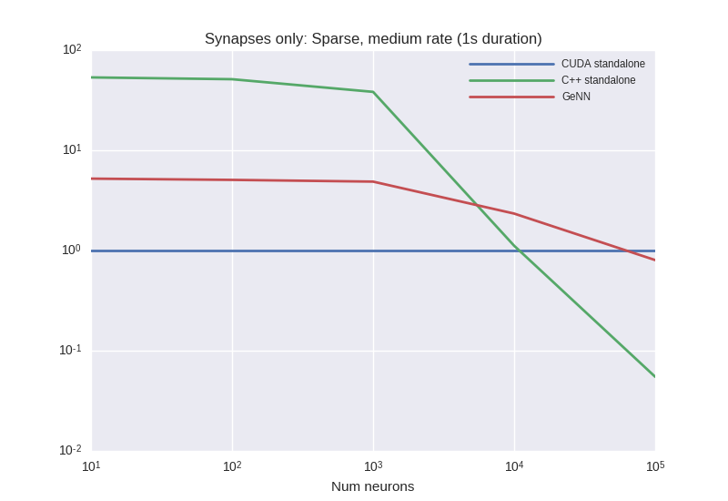

<details><summary>Examplary `nvprof` results for **CUDAStandaloneConfiguration**</summary><p>
Profile summary for `N = 1000`:

```
==29306== NVPROF is profiling process 29306, command: ./main
==29306== Profiling application: ./main
==29306== Profiling result:
Time(%)      Time     Calls       Avg       Min       Max  Name
 41.72%  59.572ms     10000  5.9570us  5.6320us  6.3680us  kernel_synapses_pre_codeobject(unsigned int, unsigned int, unsigned int, int*, unsigned int, double*, int, int*, int, double*, double*, int*, int, int*)
 21.66%  30.926ms     10000  3.0920us  2.9440us  3.7440us  [CUDA memset]
 20.61%  29.429ms     30040     979ns     928ns  3.1360us  [CUDA memcpy HtoD]
  9.98%  14.248ms     10000  1.4240us  1.3760us  1.8560us  kernel_neurongroup_thresholder_codeobject(unsigned int, unsigned int, int*)
  5.77%  8.2407ms         1  8.2407ms  8.2407ms  8.2407ms  generate_seed_pseudo(__int64, __int64, __int64, curandOrdering, curandStateXORWOW*, unsigned int*)
  0.18%  250.08us         1  250.08us  250.08us  250.08us  _run_synapses_pre_initialise_queue_kernel(unsigned int, unsigned int, unsigned int, double, unsigned int, unsigned int, bool)
  0.04%  54.944us        16  3.4340us  2.1760us  14.336us  [CUDA memcpy DtoH]
  0.02%  25.344us         1  25.344us  25.344us  25.344us  synapses_pre_destroy(void)
  0.01%  20.320us         1  20.320us  20.320us  20.320us  synapses_pre_init(unsigned int, unsigned int, double*, int*, int*, double, int, int)
  0.00%  6.9440us         1  6.9440us  6.9440us  6.9440us  void gen_sequenced<curandStateXORWOW, float, int, __operator_&__(float curand_uniform_noargs<curandStateXORWOW>(curandStateXORWOW*, int))>(curandStateXORWOW*, float*, unsigned long, unsigned long, int)
  0.00%  4.0640us         2  2.0320us  1.7920us  2.2720us  void thrust::system::cuda::detail::bulk_::detail::launch_by_value<unsigned int=0, thrust::system::cuda::detail::bulk_::detail::cuda_task<thrust::system::cuda::detail::bulk_::parallel_group<thrust::system::cuda::detail::bulk_::concurrent_group<thrust::system::cuda::detail::bulk_::agent<unsigned long=1>, unsigned long=0>, unsigned long=0>, thrust::system::cuda::detail::bulk_::detail::closure<thrust::system::cuda::detail::for_each_n_detail::for_each_kernel, thrust::tuple<thrust::system::cuda::detail::bulk_::detail::cursor<unsigned int=0>, thrust::device_ptr<double>, thrust::detail::wrapped_function<thrust::detail::device_generate_functor<thrust::detail::fill_functor<double>>, void>, unsigned int, thrust::null_type, thrust::null_type, thrust::null_type, thrust::null_type, thrust::null_type, thrust::null_type>>>>(unsigned long=1)
  0.00%  3.8080us         2  1.9040us  1.6960us  2.1120us  void thrust::system::cuda::detail::bulk_::detail::launch_by_value<unsigned int=0, thrust::system::cuda::detail::bulk_::detail::cuda_task<thrust::system::cuda::detail::bulk_::parallel_group<thrust::system::cuda::detail::bulk_::concurrent_group<thrust::system::cuda::detail::bulk_::agent<unsigned long=1>, unsigned long=0>, unsigned long=0>, thrust::system::cuda::detail::bulk_::detail::closure<thrust::system::cuda::detail::for_each_n_detail::for_each_kernel, thrust::tuple<thrust::system::cuda::detail::bulk_::detail::cursor<unsigned int=0>, thrust::device_ptr<int>, thrust::detail::wrapped_function<thrust::detail::device_generate_functor<thrust::detail::fill_functor<int>>, void>, unsigned int, thrust::null_type, thrust::null_type, thrust::null_type, thrust::null_type, thrust::null_type, thrust::null_type>>>>(unsigned long=1)

==29306== API calls:
Time(%)      Time     Calls       Avg       Min       Max  Name
 28.23%  386.39ms         1  386.39ms  386.39ms  386.39ms  cudaDeviceSetLimit
 17.86%  244.37ms     30043  8.1330us  6.5370us  350.16us  cudaMemcpy
 16.28%  222.87ms    100004  2.2280us     941ns  344.33us  cudaEventRecord
 15.89%  217.47ms     20009  10.868us  10.016us  527.94us  cudaLaunch
  8.14%  111.43ms     10000  11.142us  10.487us  27.375us  cudaMemset
  4.27%  58.479ms     50000  1.1690us     970ns  12.762us  cudaEventElapsedTime
  4.04%  55.294ms     49995  1.1050us     702ns  12.301us  cudaEventQuery
  2.29%  31.305ms    170030     184ns     145ns  334.03us  cudaSetupArgument
  1.73%  23.644ms        17  1.3909ms  11.933us  14.862ms  cudaFree
  0.53%  7.2785ms     20009     363ns     234ns  336.17us  cudaConfigureCall
  0.47%  6.4394ms     20004     321ns     162ns  337.44us  cudaGetLastError
  0.08%  1.0444ms        37  28.227us  8.0250us  129.87us  cudaMalloc
  0.06%  838.94us       166  5.0530us     124ns  208.04us  cuDeviceGetAttribute
  0.06%  803.88us         3  267.96us  225.90us  297.97us  cudaGetDeviceProperties
  0.02%  294.51us        27  10.907us     354ns  40.968us  cudaMemcpyAsync
  0.02%  282.46us         2  141.23us  42.839us  239.62us  cuDeviceTotalMem
  0.02%  268.39us         2  134.19us  40.604us  227.78us  cuDeviceGetName
  0.00%  45.459us        18  2.5250us  1.9980us  6.1410us  cudaFuncGetAttributes
  0.00%  15.362us         2  7.6810us  7.3410us  8.0210us  cudaMemcpyToSymbol
  0.00%  13.437us        10  1.3430us     563ns  5.5550us  cudaEventCreate
  0.00%  12.646us        13     972ns     288ns  6.3660us  cudaGetDevice
  0.00%  6.6230us         1  6.6230us  6.6230us  6.6230us  cudaDeviceSynchronize
  0.00%  6.5240us         1  6.5240us  6.5240us  6.5240us  cudaThreadSynchronize
  0.00%  6.3720us         4  1.5930us  1.3760us  2.0670us  cudaEventCreateWithFlags
  0.00%  4.2150us         4  1.0530us     866ns  1.5450us  cudaEventDestroy
  0.00%  4.1610us        11     378ns     280ns  1.0550us  cudaDeviceGetAttribute
  0.00%  2.0030us         3     667ns     424ns  1.0330us  cuDeviceGetCount
  0.00%  1.2220us         1  1.2220us  1.2220us  1.2220us  cuInit
  0.00%     874ns         3     291ns     223ns     379ns  cuDeviceGet
  0.00%     644ns         1     644ns     644ns     644ns  cuDriverGetVersion

```

</p></details>


<details><summary>Examplary `nvprof` results for **GeNNConfiguration**</summary><p>
Profile summary for `N = 1000`:

```
==29618== NVPROF is profiling process 29618, command: ./main test 10.0 1
==29618== Profiling application: ./main test 10.0 1
==29618== Profiling result:
Time(%)      Time     Calls       Avg       Min       Max  Name
 67.04%  556.81ms    100000  5.5680us  3.3920us  6.5280us  calcSynapses
 32.95%  273.63ms    100000  2.7360us  2.6560us  3.7120us  calcNeurons
  0.01%  53.728us        44  1.2210us     960ns  2.0480us  [CUDA memcpy HtoD]
  0.00%  34.912us        14  2.4930us  1.9520us  4.6080us  [CUDA memcpy DtoH]

==29618== API calls:
Time(%)      Time     Calls       Avg       Min       Max  Name
 84.14%  1.71391s    200000  8.5690us  7.1890us  372.93us  cudaLaunch
 10.08%  205.27ms        12  17.106ms  7.9400us  204.17ms  cudaHostAlloc
  3.31%  67.324ms    200000     336ns     230ns  429.42us  cudaConfigureCall
  2.40%  48.924ms    200000     244ns     203ns  342.29us  cudaSetupArgument
  0.04%  746.88us        61  12.243us     340ns  32.561us  cudaMemcpy
  0.02%  422.16us        12  35.179us  6.1470us  122.81us  cudaMalloc
  0.01%  262.48us        83  3.1620us     145ns  129.26us  cuDeviceGetAttribute
  0.00%  31.534us         1  31.534us  31.534us  31.534us  cuDeviceTotalMem
  0.00%  26.828us         1  26.828us  26.828us  26.828us  cuDeviceGetName
  0.00%  17.880us         1  17.880us  17.880us  17.880us  cudaSetDevice
  0.00%  8.1880us        12     682ns     434ns  2.1480us  cudaGetSymbolAddress
  0.00%  2.4130us         1  2.4130us  2.4130us  2.4130us  cudaGetDeviceCount
  0.00%  1.9190us         2     959ns     490ns  1.4290us  cuDeviceGetCount
  0.00%     715ns         2     357ns     221ns     494ns  cuDeviceGet

```

</p></details>


***

### VerySparseMediumRateSynapsesOnly


<details><summary>Examplary `nvprof` results for **CUDAStandaloneConfiguration**</summary><p>
Profile summary for `N = 1000`:

```
==19018== NVPROF is profiling process 19018, command: ./main
==19018== Profiling application: ./main
==19018== Profiling result:
Time(%)      Time     Calls       Avg       Min       Max  Name
 37.99%  607.87ms    100000  6.0780us  5.6320us  6.5600us  kernel_synapses_pre_codeobject(unsigned int, unsigned int, unsigned int, int*, unsigned int, double*, int, int*, int, double*, double*, int*, int, int*)
 28.25%  452.04ms    300036  1.5060us     928ns  324.91us  [CUDA memcpy HtoD]
 24.24%  387.91ms    100000  3.8790us  3.0400us  59.898us  [CUDA memset]
  8.96%  143.33ms    100000  1.4330us  1.3760us  1.8880us  kernel_neurongroup_thresholder_codeobject(unsigned int, unsigned int, int*)
  0.51%  8.2189ms         1  8.2189ms  8.2189ms  8.2189ms  generate_seed_pseudo(__int64, __int64, __int64, curandOrdering, curandStateXORWOW*, unsigned int*)
  0.02%  274.71us        16  17.169us  2.4000us  36.385us  [CUDA memcpy DtoH]
  0.02%  251.43us         1  251.43us  251.43us  251.43us  _run_synapses_pre_initialise_queue_kernel(unsigned int, unsigned int, unsigned int, double, unsigned int, unsigned int, bool)
  0.00%  26.784us         1  26.784us  26.784us  26.784us  synapses_pre_destroy(void)
  0.00%  20.800us         1  20.800us  20.800us  20.800us  synapses_pre_init(unsigned int, unsigned int, double*, int*, int*, double, int, int)
  0.00%  6.8480us         1  6.8480us  6.8480us  6.8480us  void gen_sequenced<curandStateXORWOW, float, int, __operator_&__(float curand_uniform_noargs<curandStateXORWOW>(curandStateXORWOW*, int))>(curandStateXORWOW*, float*, unsigned long, unsigned long, int)
  0.00%  3.8400us         2  1.9200us  1.6960us  2.1440us  void thrust::system::cuda::detail::bulk_::detail::launch_by_value<unsigned int=0, thrust::system::cuda::detail::bulk_::detail::cuda_task<thrust::system::cuda::detail::bulk_::parallel_group<thrust::system::cuda::detail::bulk_::concurrent_group<thrust::system::cuda::detail::bulk_::agent<unsigned long=1>, unsigned long=0>, unsigned long=0>, thrust::system::cuda::detail::bulk_::detail::closure<thrust::system::cuda::detail::for_each_n_detail::for_each_kernel, thrust::tuple<thrust::system::cuda::detail::bulk_::detail::cursor<unsigned int=0>, thrust::device_ptr<double>, thrust::detail::wrapped_function<thrust::detail::device_generate_functor<thrust::detail::fill_functor<double>>, void>, unsigned int, thrust::null_type, thrust::null_type, thrust::null_type, thrust::null_type, thrust::null_type, thrust::null_type>>>>(unsigned long=1)
  0.00%  3.7760us         2  1.8880us  1.6320us  2.1440us  void thrust::system::cuda::detail::bulk_::detail::launch_by_value<unsigned int=0, thrust::system::cuda::detail::bulk_::detail::cuda_task<thrust::system::cuda::detail::bulk_::parallel_group<thrust::system::cuda::detail::bulk_::concurrent_group<thrust::system::cuda::detail::bulk_::agent<unsigned long=1>, unsigned long=0>, unsigned long=0>, thrust::system::cuda::detail::bulk_::detail::closure<thrust::system::cuda::detail::for_each_n_detail::for_each_kernel, thrust::tuple<thrust::system::cuda::detail::bulk_::detail::cursor<unsigned int=0>, thrust::device_ptr<int>, thrust::detail::wrapped_function<thrust::detail::device_generate_functor<thrust::detail::fill_functor<int>>, void>, unsigned int, thrust::null_type, thrust::null_type, thrust::null_type, thrust::null_type, thrust::null_type, thrust::null_type>>>>(unsigned long=1)

==19018== API calls:
Time(%)      Time     Calls       Avg       Min       Max  Name
 24.52%  2.51009s    300039  8.3650us  5.3180us  43.961ms  cudaMemcpy
 23.25%  2.38064s   1000004  2.3800us     866ns  1.8245ms  cudaEventRecord
 21.63%  2.21504s    200009  11.074us  9.4920us  532.49us  cudaLaunch
 10.85%  1.11137s    100000  11.113us  9.1420us  22.345ms  cudaMemset
  6.87%  702.98ms    500000  1.4050us  1.0330us  334.18us  cudaEventElapsedTime
  5.64%  577.16ms    499995  1.1540us     673ns  330.15us  cudaEventQuery
  3.07%  313.95ms   1700030     184ns     135ns  536.58us  cudaSetupArgument
  2.43%  248.62ms         1  248.62ms  248.62ms  248.62ms  cudaDeviceSetLimit
  0.77%  78.605ms    200009     393ns     217ns  414.36us  cudaConfigureCall
  0.71%  72.654ms    200004     363ns     146ns  555.13us  cudaGetLastError
  0.24%  24.809ms        17  1.4593ms  6.0880us  16.165ms  cudaFree
  0.01%  999.14us        33  30.277us  7.9070us  127.04us  cudaMalloc
  0.01%  835.15us         3  278.38us  219.71us  318.42us  cudaGetDeviceProperties
  0.01%  575.68us       166  3.4670us     127ns  156.94us  cuDeviceGetAttribute
  0.00%  202.45us        27  7.4980us     183ns  26.680us  cudaMemcpyAsync
  0.00%  79.907us         2  39.953us  37.315us  42.592us  cuDeviceTotalMem
  0.00%  74.158us         2  37.079us  34.607us  39.551us  cuDeviceGetName
  0.00%  45.128us        18  2.5070us  1.9980us  5.9950us  cudaFuncGetAttributes
  0.00%  15.509us         2  7.7540us  7.4060us  8.1030us  cudaMemcpyToSymbol
  0.00%  14.038us        10  1.4030us     659ns  5.6110us  cudaEventCreate
  0.00%  12.614us        13     970ns     295ns  6.3900us  cudaGetDevice
  0.00%  10.764us         1  10.764us  10.764us  10.764us  cudaDeviceSynchronize
  0.00%  8.9360us         4  2.2340us  1.3890us  4.2350us  cudaEventCreateWithFlags
  0.00%  6.0500us         1  6.0500us  6.0500us  6.0500us  cudaThreadSynchronize
  0.00%  4.6030us        11     418ns     291ns  1.1870us  cudaDeviceGetAttribute
  0.00%  3.7260us         4     931ns     750ns  1.3170us  cudaEventDestroy
  0.00%  3.0780us         3  1.0260us     374ns  1.5190us  cuDeviceGetCount
  0.00%  1.4080us         3     469ns     395ns     514ns  cuDeviceGet
  0.00%  1.0230us         1  1.0230us  1.0230us  1.0230us  cuInit
  0.00%     626ns         1     626ns     626ns     626ns  cuDriverGetVersion

```

</p></details>


<details><summary>Examplary `nvprof` results for **GeNNConfiguration**</summary><p>
Profile summary for `N = 1000`:

```
==19604== NVPROF is profiling process 19604, command: ./main test 10.0 1
==19604== Profiling application: ./main test 10.0 1
==19604== Profiling result:
Time(%)      Time     Calls       Avg       Min       Max  Name
 68.45%  593.41ms    100000  5.9340us  3.4240us  7.1360us  calcSynapses
 31.54%  273.40ms    100000  2.7330us  2.6560us  3.7440us  calcNeurons
  0.01%  53.216us        44  1.2090us     960ns  2.0480us  [CUDA memcpy HtoD]
  0.00%  34.624us        14  2.4730us  1.9520us  4.6400us  [CUDA memcpy DtoH]

==19604== API calls:
Time(%)      Time     Calls       Avg       Min       Max  Name
 83.49%  1.66042s    200000  8.3020us  6.9720us  354.76us  cudaLaunch
 10.69%  212.53ms        12  17.711ms  7.7260us  211.46ms  cudaHostAlloc
  3.26%  64.789ms    200000     323ns     233ns  354.14us  cudaConfigureCall
  2.49%  49.526ms    200000     247ns     210ns  338.44us  cudaSetupArgument
  0.04%  742.95us        61  12.179us     307ns  32.643us  cudaMemcpy
  0.02%  419.92us        12  34.993us  6.2400us  119.23us  cudaMalloc
  0.01%  226.18us        83  2.7250us     145ns  97.067us  cuDeviceGetAttribute
  0.00%  31.725us         1  31.725us  31.725us  31.725us  cuDeviceTotalMem
  0.00%  26.645us         1  26.645us  26.645us  26.645us  cuDeviceGetName
  0.00%  11.653us         1  11.653us  11.653us  11.653us  cudaSetDevice
  0.00%  8.0200us        12     668ns     384ns  2.0710us  cudaGetSymbolAddress
  0.00%  1.5340us         2     767ns     504ns  1.0300us  cuDeviceGetCount
  0.00%  1.4290us         1  1.4290us  1.4290us  1.4290us  cudaGetDeviceCount
  0.00%     574ns         2     287ns     238ns     336ns  cuDeviceGet

```

</p></details>


***

### Vogels
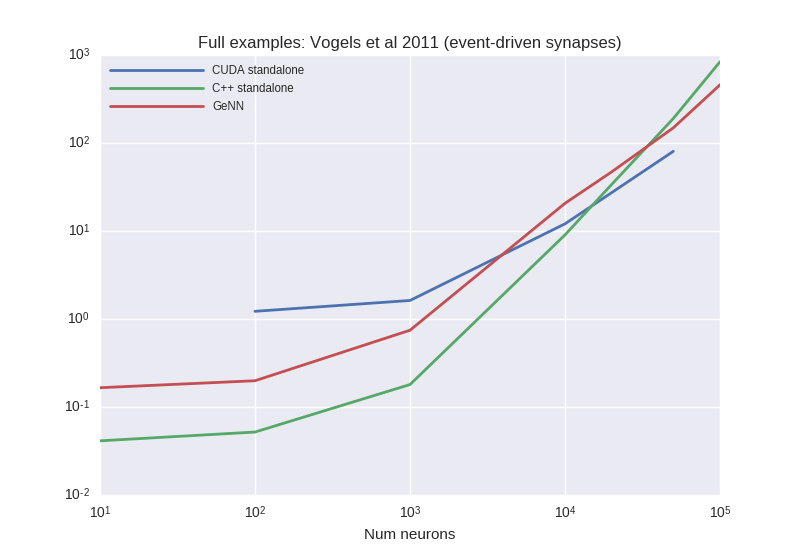


<details><summary>Examplary `nvprof` results for **CUDAStandaloneConfiguration**</summary><p>
Profile summary for `N = 1000`:

```
==4568== NVPROF is profiling process 4568, command: ./main
==4568== Profiling application: ./main
==4568== Profiling result:
Time(%)      Time     Calls       Avg       Min       Max  Name
 28.07%  212.63ms     10000  21.263us  3.5200us  2.0831ms  kernel_synapses_pre_codeobject(unsigned int, unsigned int, unsigned int, int*, unsigned int, double*, int, double*, int*, int, int*, double*, int*, int)
 23.40%  177.21ms     10000  17.720us  3.3600us  1.7408ms  kernel_synapses_2_post_codeobject(unsigned int, unsigned int, unsigned int, int*, unsigned int, double*, int, int*, int, double*, double*, int, double*, int, int*, double*, int)
 14.48%  109.65ms     10000  10.965us  3.3280us  1.2035ms  kernel_synapses_2_pre_codeobject(unsigned int, unsigned int, unsigned int, int*, unsigned int, double*, int, int*, int, int*, int, double*, double*, int, double*, double*, int, int*, double*, int)
 13.29%  100.63ms     10000  10.062us  3.3920us  1.0439ms  kernel_synapses_1_pre_codeobject(unsigned int, unsigned int, unsigned int, int*, unsigned int, double*, int, int*, int, int*, double*, double*, int*, int)
  5.71%  43.258ms     44336     975ns     928ns  33.120us  [CUDA memcpy HtoD]
  4.34%  32.899ms     10000  3.2890us  2.8480us  4.5440us  kernel_neurongroup_stateupdater_codeobject(unsigned int, unsigned int, double*, double*, double*, double*, double*, double*, bool*)
  4.11%  31.125ms     10000  3.1120us  2.8800us  3.8720us  [CUDA memset]
  2.84%  21.506ms     10000  2.1500us  1.6320us  4.5120us  kernel_neurongroup_thresholder_codeobject(unsigned int, unsigned int, int*, double*, double*, double*, bool*)
  2.19%  16.569ms     10000  1.6560us  1.3440us  2.3680us  kernel_neurongroup_resetter_codeobject(unsigned int, unsigned int, double*, int*, bool*)
  1.09%  8.2320ms         1  8.2320ms  8.2320ms  8.2320ms  generate_seed_pseudo(__int64, __int64, __int64, curandOrdering, curandStateXORWOW*, unsigned int*)
  0.23%  1.7316ms       140  12.368us  2.1120us  40.800us  [CUDA memcpy DtoH]
  0.09%  658.50us       100  6.5840us  6.3680us  6.9440us  void gen_sequenced<curandStateXORWOW, float, int, __operator_&__(float curand_uniform_noargs<curandStateXORWOW>(curandStateXORWOW*, int))>(curandStateXORWOW*, float*, unsigned long, unsigned long, int)
  0.04%  293.25us         1  293.25us  293.25us  293.25us  _run_synapses_2_post_initialise_queue_kernel(unsigned int, unsigned int, unsigned int, double, unsigned int, unsigned int, bool)
  0.04%  279.46us         1  279.46us  279.46us  279.46us  _run_synapses_pre_initialise_queue_kernel(unsigned int, unsigned int, unsigned int, double, unsigned int, unsigned int, bool)
  0.04%  266.94us         1  266.94us  266.94us  266.94us  _run_synapses_2_pre_initialise_queue_kernel(unsigned int, unsigned int, unsigned int, double, unsigned int, unsigned int, bool)
  0.03%  244.80us         1  244.80us  244.80us  244.80us  _run_synapses_1_pre_initialise_queue_kernel(unsigned int, unsigned int, unsigned int, double, unsigned int, unsigned int, bool)
  0.00%  29.056us         1  29.056us  29.056us  29.056us  synapses_pre_destroy(void)
  0.00%  28.064us         1  28.064us  28.064us  28.064us  synapses_2_pre_init(unsigned int, unsigned int, double*, int*, int*, double, int, int)
  0.00%  26.048us         1  26.048us  26.048us  26.048us  synapses_2_post_destroy(void)
  0.00%  25.472us         1  25.472us  25.472us  25.472us  synapses_2_pre_destroy(void)
  0.00%  25.440us         1  25.440us  25.440us  25.440us  synapses_1_pre_destroy(void)
  0.00%  20.736us         1  20.736us  20.736us  20.736us  synapses_pre_init(unsigned int, unsigned int, double*, int*, int*, double, int, int)
  0.00%  20.448us        10  2.0440us  1.8240us  2.5600us  void thrust::system::cuda::detail::bulk_::detail::launch_by_value<unsigned int=0, thrust::system::cuda::detail::bulk_::detail::cuda_task<thrust::system::cuda::detail::bulk_::parallel_group<thrust::system::cuda::detail::bulk_::concurrent_group<thrust::system::cuda::detail::bulk_::agent<unsigned long=1>, unsigned long=0>, unsigned long=0>, thrust::system::cuda::detail::bulk_::detail::closure<thrust::system::cuda::detail::for_each_n_detail::for_each_kernel, thrust::tuple<thrust::system::cuda::detail::bulk_::detail::cursor<unsigned int=0>, thrust::device_ptr<double>, thrust::detail::wrapped_function<thrust::detail::device_generate_functor<thrust::detail::fill_functor<double>>, void>, unsigned int, thrust::null_type, thrust::null_type, thrust::null_type, thrust::null_type, thrust::null_type, thrust::null_type>>>>(unsigned long=1)
  0.00%  17.376us         1  17.376us  17.376us  17.376us  synapses_2_post_init(unsigned int, unsigned int, double*, int*, int*, double, int, int)
  0.00%  16.640us         1  16.640us  16.640us  16.640us  synapses_1_pre_init(unsigned int, unsigned int, double*, int*, int*, double, int, int)
  0.00%  11.680us         6  1.9460us  1.7280us  2.3360us  void thrust::system::cuda::detail::bulk_::detail::launch_by_value<unsigned int=0, thrust::system::cuda::detail::bulk_::detail::cuda_task<thrust::system::cuda::detail::bulk_::parallel_group<thrust::system::cuda::detail::bulk_::concurrent_group<thrust::system::cuda::detail::bulk_::agent<unsigned long=1>, unsigned long=0>, unsigned long=0>, thrust::system::cuda::detail::bulk_::detail::closure<thrust::system::cuda::detail::for_each_n_detail::for_each_kernel, thrust::tuple<thrust::system::cuda::detail::bulk_::detail::cursor<unsigned int=0>, thrust::device_ptr<int>, thrust::detail::wrapped_function<thrust::detail::device_generate_functor<thrust::detail::fill_functor<int>>, void>, unsigned int, thrust::null_type, thrust::null_type, thrust::null_type, thrust::null_type, thrust::null_type, thrust::null_type>>>>(unsigned long=1)

==4568== API calls:
Time(%)      Time     Calls       Avg       Min       Max  Name
 25.52%  681.43ms     70129  9.7160us  8.2500us  522.93us  cudaLaunch
 21.02%  561.25ms    260016  2.1580us     843ns  309.95us  cudaEventRecord
 15.79%  421.56ms     44430  9.4880us  6.1710us  5.9932ms  cudaMemcpy
  9.83%  262.42ms         1  262.42ms  262.42ms  262.42ms  cudaDeviceSetLimit
  6.00%  160.23ms     14332  11.180us  7.3540us  146.83us  cudaMalloc
  5.74%  153.22ms    860582     178ns     137ns  310.83us  cudaSetupArgument
  5.57%  148.59ms    130000  1.1420us     945ns  306.57us  cudaEventElapsedTime
  4.55%  121.39ms    129987     933ns     634ns  16.144us  cudaEventQuery
  3.58%  95.563ms     10000  9.5560us  8.8640us  26.213us  cudaMemset
  0.83%  22.231ms        41  542.22us  9.4500us  13.251ms  cudaFree
  0.73%  19.605ms     70129     279ns     215ns  10.117us  cudaConfigureCall
  0.71%  18.983ms     70202     270ns     182ns  10.420us  cudaGetLastError
  0.07%  1.7933ms        98  18.298us     291ns  214.30us  cudaMemcpyAsync
  0.03%  715.12us         3  238.37us  218.65us  258.25us  cudaGetDeviceProperties
  0.02%  469.05us       166  2.8250us     123ns  106.39us  cuDeviceGetAttribute
  0.01%  177.97us         8  22.246us  11.777us  40.812us  cudaMemcpyToSymbol
  0.01%  164.50us        71  2.3160us  2.0140us  6.3700us  cudaFuncGetAttributes
  0.00%  67.846us         2  33.923us  33.068us  34.778us  cuDeviceTotalMem
  0.00%  64.617us         2  32.308us  31.394us  33.223us  cuDeviceGetName
  0.00%  27.842us        26  1.0700us     636ns  8.3620us  cudaEventCreate
  0.00%  25.532us        16  1.5950us  1.3880us  2.2110us  cudaEventCreateWithFlags
  0.00%  23.525us        49     480ns     300ns  3.6240us  cudaGetDevice
  0.00%  15.030us        16     939ns     847ns  1.5570us  cudaEventDestroy
  0.00%  10.799us         1  10.799us  10.799us  10.799us  cudaThreadSynchronize
  0.00%  7.2200us         1  7.2200us  7.2200us  7.2200us  cudaDeviceSynchronize
  0.00%  4.6280us        11     420ns     278ns  1.1910us  cudaDeviceGetAttribute
  0.00%  2.4410us         3     813ns     282ns  1.2970us  cuDeviceGetCount
  0.00%     858ns         3     286ns     236ns     368ns  cuDeviceGet
  0.00%     722ns         1     722ns     722ns     722ns  cuInit
  0.00%     383ns         1     383ns     383ns     383ns  cuDriverGetVersion

```

</p></details>


<details><summary>Examplary `nvprof` results for **GeNNConfiguration**</summary><p>
Profile summary for `N = 1000`:

```
==5016== NVPROF is profiling process 5016, command: ./main test 10.0 1
==5016== Profiling application: ./main test 10.0 1
==5016== Profiling result:
Time(%)      Time     Calls       Avg       Min       Max  Name
 59.67%  4.03792s    100000  40.379us  2.0160us  5.9814ms  learnSynapsesPost
 29.26%  1.98024s    100000  19.802us  1.4720us  2.4916ms  calcSynapses
 11.06%  748.25ms    100000  7.4820us  6.5280us  14.496us  calcNeurons
  0.01%  382.02us        86  4.4420us     960ns  42.752us  [CUDA memcpy HtoD]
  0.00%  130.24us        20  6.5120us  1.9520us  40.384us  [CUDA memcpy DtoH]

==5016== API calls:
Time(%)      Time     Calls       Avg       Min       Max  Name
 93.96%  6.87878s    300000  22.929us  7.3290us  3.1002ms  cudaLaunch
  2.92%  213.58ms        26  8.2147ms  7.7590us  211.42ms  cudaHostAlloc
  1.68%  122.86ms    300000     409ns     265ns  377.02us  cudaConfigureCall
  1.06%  77.945ms    300000     259ns     208ns  329.76us  cudaSetupArgument
  0.37%  27.051ms       112  241.53us     202ns  25.294ms  cudaMemcpy
  0.01%  768.45us        26  29.555us  6.4870us  122.71us  cudaMalloc
  0.00%  229.06us        83  2.7590us     144ns  98.677us  cuDeviceGetAttribute
  0.00%  31.678us         1  31.678us  31.678us  31.678us  cuDeviceTotalMem
  0.00%  29.535us         1  29.535us  29.535us  29.535us  cuDeviceGetName
  0.00%  16.242us        26     624ns     407ns  2.1630us  cudaGetSymbolAddress
  0.00%  11.684us         1  11.684us  11.684us  11.684us  cudaSetDevice
  0.00%  1.4080us         1  1.4080us  1.4080us  1.4080us  cudaGetDeviceCount
  0.00%  1.3650us         2     682ns     459ns     906ns  cuDeviceGetCount
  0.00%     569ns         2     284ns     223ns     346ns  cuDeviceGet

```

</p></details>


***

### VogelsWithSynapticDynamic
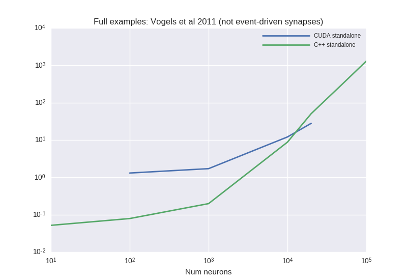
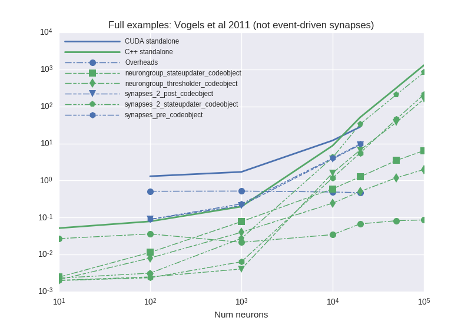
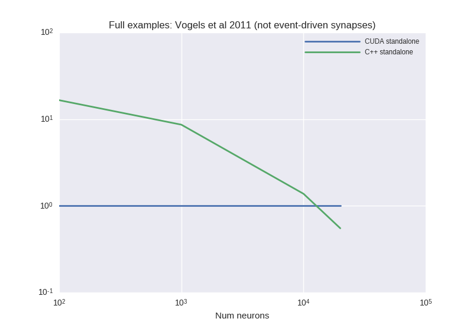

<details><summary>Examplary `nvprof` results for **CUDAStandaloneConfiguration**</summary><p>
Profile summary for `N = 1000`:

```
==19089== NVPROF is profiling process 19089, command: ./main
==19089== Profiling application: ./main
==19089== Profiling result:
Time(%)      Time     Calls       Avg       Min       Max  Name
 27.83%  217.01ms     10000  21.700us  3.5840us  2.1022ms  kernel_synapses_pre_codeobject(unsigned int, unsigned int, unsigned int, int*, unsigned int, double*, int, double*, int*, int, int*, double*, int*, int)
 21.33%  166.32ms     10000  16.631us  3.1680us  1.6865ms  kernel_synapses_2_post_codeobject(unsigned int, unsigned int, unsigned int, int*, unsigned int, double*, int, int*, int, double*, double*, int, double*, int, int*, double*, int)
 13.71%  106.90ms     10000  10.689us  3.4880us  1.1283ms  kernel_synapses_2_pre_codeobject(unsigned int, unsigned int, unsigned int, int*, unsigned int, double*, int, int*, int, int*, double*, double*, int, double*, double*, int, int*, int, double*, int)
 13.08%  101.98ms     10000  10.197us  3.3280us  1.0309ms  kernel_synapses_1_pre_codeobject(unsigned int, unsigned int, unsigned int, int*, unsigned int, double*, int, int*, int, int*, double*, double*, int*, int)
  5.55%  43.311ms     44447     974ns     928ns  32.992us  [CUDA memcpy HtoD]
  4.26%  33.250ms     10000  3.3240us  2.9120us  4.4160us  kernel_neurongroup_stateupdater_codeobject(unsigned int, unsigned int, double*, double*, double*, double*, double*, double*, bool*)
  4.00%  31.181ms     10000  3.1180us  3.0080us  3.6480us  [CUDA memset]
  3.68%  28.680ms     10000  2.8680us  2.7520us  3.4880us  kernel_synapses_2_stateupdater_codeobject(unsigned int, unsigned int, int*, double*, int, double*, int, double*)
  2.94%  22.896ms     10000  2.2890us  1.7600us  4.7360us  kernel_neurongroup_thresholder_codeobject(unsigned int, unsigned int, int*, double*, double*, double*, bool*)
  2.10%  16.346ms     10000  1.6340us  1.5040us  2.3680us  kernel_neurongroup_resetter_codeobject(unsigned int, unsigned int, double*, int*, bool*)
  1.06%  8.2493ms         1  8.2493ms  8.2493ms  8.2493ms  generate_seed_pseudo(__int64, __int64, __int64, curandOrdering, curandStateXORWOW*, unsigned int*)
  0.22%  1.7189ms       140  12.277us  2.1120us  40.320us  [CUDA memcpy DtoH]
  0.08%  643.84us       100  6.4380us  6.2080us  6.7200us  void gen_sequenced<curandStateXORWOW, float, int, __operator_&__(float curand_uniform_noargs<curandStateXORWOW>(curandStateXORWOW*, int))>(curandStateXORWOW*, float*, unsigned long, unsigned long, int)
  0.04%  292.51us         1  292.51us  292.51us  292.51us  _run_synapses_2_post_initialise_queue_kernel(unsigned int, unsigned int, unsigned int, double, unsigned int, unsigned int, bool)
  0.04%  279.23us         1  279.23us  279.23us  279.23us  _run_synapses_pre_initialise_queue_kernel(unsigned int, unsigned int, unsigned int, double, unsigned int, unsigned int, bool)
  0.03%  266.88us         1  266.88us  266.88us  266.88us  _run_synapses_2_pre_initialise_queue_kernel(unsigned int, unsigned int, unsigned int, double, unsigned int, unsigned int, bool)
  0.03%  246.02us         1  246.02us  246.02us  246.02us  _run_synapses_1_pre_initialise_queue_kernel(unsigned int, unsigned int, unsigned int, double, unsigned int, unsigned int, bool)
  0.00%  28.608us         1  28.608us  28.608us  28.608us  synapses_pre_destroy(void)
  0.00%  27.488us         1  27.488us  27.488us  27.488us  synapses_2_pre_init(unsigned int, unsigned int, double*, int*, int*, double, int, int)
  0.00%  25.248us         1  25.248us  25.248us  25.248us  synapses_2_post_destroy(void)
  0.00%  25.216us         1  25.216us  25.216us  25.216us  synapses_1_pre_destroy(void)
  0.00%  25.024us         1  25.024us  25.024us  25.024us  synapses_2_pre_destroy(void)
  0.00%  20.608us        10  2.0600us  1.8560us  2.6240us  void thrust::system::cuda::detail::bulk_::detail::launch_by_value<unsigned int=0, thrust::system::cuda::detail::bulk_::detail::cuda_task<thrust::system::cuda::detail::bulk_::parallel_group<thrust::system::cuda::detail::bulk_::concurrent_group<thrust::system::cuda::detail::bulk_::agent<unsigned long=1>, unsigned long=0>, unsigned long=0>, thrust::system::cuda::detail::bulk_::detail::closure<thrust::system::cuda::detail::for_each_n_detail::for_each_kernel, thrust::tuple<thrust::system::cuda::detail::bulk_::detail::cursor<unsigned int=0>, thrust::device_ptr<double>, thrust::detail::wrapped_function<thrust::detail::device_generate_functor<thrust::detail::fill_functor<double>>, void>, unsigned int, thrust::null_type, thrust::null_type, thrust::null_type, thrust::null_type, thrust::null_type, thrust::null_type>>>>(unsigned long=1)
  0.00%  20.320us         1  20.320us  20.320us  20.320us  synapses_pre_init(unsigned int, unsigned int, double*, int*, int*, double, int, int)
  0.00%  17.536us         1  17.536us  17.536us  17.536us  synapses_2_post_init(unsigned int, unsigned int, double*, int*, int*, double, int, int)
  0.00%  17.088us         1  17.088us  17.088us  17.088us  synapses_1_pre_init(unsigned int, unsigned int, double*, int*, int*, double, int, int)
  0.00%  11.872us         6  1.9780us  1.7600us  2.3680us  void thrust::system::cuda::detail::bulk_::detail::launch_by_value<unsigned int=0, thrust::system::cuda::detail::bulk_::detail::cuda_task<thrust::system::cuda::detail::bulk_::parallel_group<thrust::system::cuda::detail::bulk_::concurrent_group<thrust::system::cuda::detail::bulk_::agent<unsigned long=1>, unsigned long=0>, unsigned long=0>, thrust::system::cuda::detail::bulk_::detail::closure<thrust::system::cuda::detail::for_each_n_detail::for_each_kernel, thrust::tuple<thrust::system::cuda::detail::bulk_::detail::cursor<unsigned int=0>, thrust::device_ptr<int>, thrust::detail::wrapped_function<thrust::detail::device_generate_functor<thrust::detail::fill_functor<int>>, void>, unsigned int, thrust::null_type, thrust::null_type, thrust::null_type, thrust::null_type, thrust::null_type, thrust::null_type>>>>(unsigned long=1)

==19089== API calls:
Time(%)      Time     Calls       Avg       Min       Max  Name
 26.95%  778.04ms     80129  9.7090us  7.9960us  544.63us  cudaLaunch
 20.89%  602.87ms    280016  2.1520us     789ns  315.90us  cudaEventRecord
 14.68%  423.83ms     44541  9.5150us  6.2670us  5.8807ms  cudaMemcpy
  9.32%  268.89ms         1  268.89ms  268.89ms  268.89ms  cudaDeviceSetLimit
  5.89%  169.96ms    140000  1.2130us     859ns  316.17us  cudaEventElapsedTime
  5.78%  166.81ms     14443  11.549us  7.1620us  345.78us  cudaMalloc
  5.53%  159.72ms    940582     169ns     135ns  323.63us  cudaSetupArgument
  4.95%  142.84ms    139986  1.0200us     644ns  343.50us  cudaEventQuery
  3.39%  97.774ms     10000  9.7770us  8.8320us  24.291us  cudaMemset
  0.90%  25.857ms     80129     322ns     239ns  314.87us  cudaConfigureCall
  0.82%  23.614ms     80202     294ns     152ns  317.16us  cudaGetLastError
  0.79%  22.801ms        41  556.13us  9.8780us  13.759ms  cudaFree
  0.06%  1.8253ms        98  18.625us     262ns  216.61us  cudaMemcpyAsync
  0.02%  671.63us         3  223.88us  217.81us  234.83us  cudaGetDeviceProperties
  0.02%  450.55us       166  2.7140us     122ns  97.649us  cuDeviceGetAttribute
  0.01%  179.24us         8  22.404us  11.909us  40.831us  cudaMemcpyToSymbol
  0.01%  166.25us        72  2.3090us  1.9700us  6.5820us  cudaFuncGetAttributes
  0.00%  68.201us         2  34.100us  30.106us  38.095us  cuDeviceGetName
  0.00%  63.465us         2  31.732us  31.648us  31.817us  cuDeviceTotalMem
  0.00%  26.954us        28     962ns     606ns  5.0470us  cudaEventCreate
  0.00%  24.221us        16  1.5130us  1.3450us  1.8770us  cudaEventCreateWithFlags
  0.00%  22.209us        49     453ns     287ns  3.5340us  cudaGetDevice
  0.00%  14.252us        16     890ns     784ns  1.4410us  cudaEventDestroy
  0.00%  6.4500us         1  6.4500us  6.4500us  6.4500us  cudaThreadSynchronize
  0.00%  6.2790us         1  6.2790us  6.2790us  6.2790us  cudaDeviceSynchronize
  0.00%  4.6990us        11     427ns     290ns  1.2090us  cudaDeviceGetAttribute
  0.00%  2.3130us         3     771ns     277ns  1.0370us  cuDeviceGetCount
  0.00%     873ns         3     291ns     224ns     421ns  cuDeviceGet
  0.00%     761ns         1     761ns     761ns     761ns  cuInit
  0.00%     370ns         1     370ns     370ns     370ns  cuDriverGetVersion

```

</p></details>


