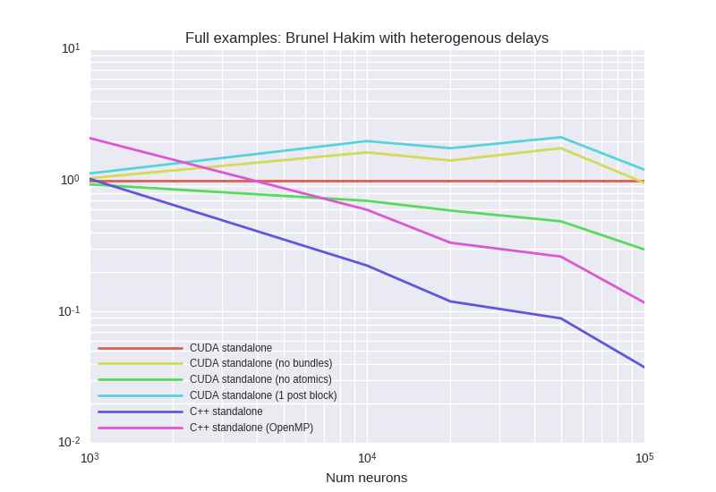

# Benchmark results from 03.09.2018
## Description:


## Last git log:
```
commit 5da204a9c8758374970712efcdd3202509e661ba
Author: Denis Alevi <mail@denisalevi.de>
Date:   Mon Sep 3 22:41:48 2018 +0200

    Except error in speed test script

```
There is also a `git diff` saved in the current directory.

## Results

### BrunelHakimModelHeterogeneousDelay


<details><summary>Examplary `nvprof` results for **CUDA-standalone--1-post-block-**</summary><p>
Profile summary for `N = 1000`:

```
==27905== NVPROF is profiling process 27905, command: ./main
==27905== Profiling application: ./main
==27905== Profiling result:
            Type  Time(%)      Time     Calls       Avg       Min       Max  Name
 GPU activities:   33.43%  94.400ms     10000  9.4390us  2.4320us  16.896us  kernel_synapses_pre_codeobject(int, int, int, int, int, int*, int, double*, int*, int, int*, int, int*)
                   18.23%  51.494ms     10000  5.1490us  4.7360us  6.2400us  kernel_neurongroup_stateupdater_codeobject(int, int, double, double*, double*, double*, char*, double*)
                    9.83%  27.768ms      2444  11.361us  8.8640us  258.02us  _run_synapses_pre_push_spikes_push_kernel(int, int, int, int*)
                    9.62%  27.177ms     10000  2.7170us  2.6560us  3.7120us  _run_synapses_pre_push_spikes_advance_kernel(void)
                    7.93%  22.382ms     10000  2.2380us  2.0800us  2.7840us  kernel_neurongroup_thresholder_codeobject(int, int, int*, double, double*, double*, char*)
                    7.27%  20.521ms     10000  2.0520us  2.0160us  2.5600us  [CUDA memcpy DtoH]
                    6.89%  19.447ms     10000  1.9440us  1.7920us  2.5600us  kernel_neurongroup_resetter_codeobject(int, int, double*, int*)
                    6.08%  17.167ms     10000  1.7160us  1.6320us  2.1440us  _GLOBAL__N__69_tmpxft_00006b9b_00000000_6_neurongroup_thresholder_codeobject_cpp1_ii_0e9058a7::_reset_neurongroup_thresholder_codeobject(int*)
                    0.73%  2.0519ms         2  1.0260ms  1.0216ms  1.0303ms  void gen_sequenced<curandStateXORWOW, double2, normal_args_double_st, __operator_&__(double2 curand_normal_scaled2_double<curandStateXORWOW>(curandStateXORWOW*, normal_args_double_st))>(curandStateXORWOW*, double2*, unsigned long, unsigned long, normal_args_double_st)
      API calls:   69.60%  675.09ms     62446  10.810us  8.5470us  9.1608ms  cudaLaunch
                   21.26%  206.22ms     10000  20.622us  17.717us  1.0315ms  cudaMemcpy
                    5.90%  57.223ms    339786     168ns     119ns  388.15us  cudaSetupArgument
                    1.62%  15.722ms     62448     251ns     173ns  325.42us  cudaGetLastError
                    1.57%  15.226ms     62446     243ns     168ns  352.73us  cudaConfigureCall
                    0.02%  237.26us         1  237.26us  237.26us  237.26us  cudaMalloc
                    0.01%  145.30us         1  145.30us  145.30us  145.30us  cudaMemGetInfo
                    0.00%  29.958us         8  3.7440us  2.8810us  6.4720us  cudaFuncGetAttributes
                    0.00%  25.941us        39     665ns     565ns  1.6700us  cudaOccupancyMaxActiveBlocksPerMultiprocessorWithFlags
                    0.00%  7.5120us         1  7.5120us  7.5120us  7.5120us  cudaDeviceSynchronize
                    0.00%  6.0160us        12     501ns     323ns  1.4120us  cudaDeviceGetAttribute
                    0.00%  3.7520us         3  1.2500us     803ns  2.0100us  cudaGetDevice

```

</p></details>


<details><summary>Examplary `nvprof` results for **CUDA-standalone--no-atomics-**</summary><p>
Profile summary for `N = 1000`:

```
==27408== NVPROF is profiling process 27408, command: ./main
==27408== Profiling application: ./main
==27408== Profiling result:
            Type  Time(%)      Time     Calls       Avg       Min       Max  Name
 GPU activities:   59.02%  297.09ms     10000  29.709us  2.2080us  61.441us  kernel_synapses_pre_codeobject(int, int, int, int, int, int*, int, double*, int*, int, int*, int, int*)
                   10.28%  51.759ms     10000  5.1750us  4.7680us  6.7520us  kernel_neurongroup_stateupdater_codeobject(int, int, double, double*, double*, double*, char*, double*)
                    8.96%  45.096ms      2545  17.719us  8.9920us  1.1086ms  _run_synapses_pre_push_spikes_push_kernel(int, int, int, int*)
                    5.48%  27.561ms     10000  2.7560us  2.7200us  3.9360us  _run_synapses_pre_push_spikes_advance_kernel(void)
                    4.46%  22.447ms     10000  2.2440us  2.0800us  2.7520us  kernel_neurongroup_thresholder_codeobject(int, int, int*, double, double*, double*, char*)
                    4.07%  20.489ms     10000  2.0480us  2.0160us  4.0000us  [CUDA memcpy DtoH]
                    3.88%  19.547ms     10000  1.9540us  1.8560us  3.1040us  kernel_neurongroup_resetter_codeobject(int, int, double*, int*)
                    3.44%  17.306ms     10000  1.7300us  1.4080us  3.0080us  _GLOBAL__N__69_tmpxft_0000699d_00000000_6_neurongroup_thresholder_codeobject_cpp1_ii_0e9058a7::_reset_neurongroup_thresholder_codeobject(int*)
                    0.41%  2.0499ms         2  1.0250ms  1.0201ms  1.0299ms  void gen_sequenced<curandStateXORWOW, double2, normal_args_double_st, __operator_&__(double2 curand_normal_scaled2_double<curandStateXORWOW>(curandStateXORWOW*, normal_args_double_st))>(curandStateXORWOW*, double2*, unsigned long, unsigned long, normal_args_double_st)
      API calls:   61.65%  616.18ms     62547  9.8510us  8.1910us  7.9170ms  cudaLaunch
                   30.30%  302.83ms     10000  30.283us  17.916us  1.1085ms  cudaMemcpy
                    5.16%  51.549ms    340190     151ns     120ns  375.30us  cudaSetupArgument
                    1.44%  14.373ms     62549     229ns     178ns  326.92us  cudaGetLastError
                    1.41%  14.063ms     62547     224ns     160ns  319.64us  cudaConfigureCall
                    0.02%  229.07us         1  229.07us  229.07us  229.07us  cudaMalloc
                    0.01%  133.06us         1  133.06us  133.06us  133.06us  cudaMemGetInfo
                    0.00%  27.199us         8  3.3990us  2.6940us  5.7730us  cudaFuncGetAttributes
                    0.00%  26.530us        39     680ns     570ns  1.6810us  cudaOccupancyMaxActiveBlocksPerMultiprocessorWithFlags
                    0.00%  17.559us         1  17.559us  17.559us  17.559us  cudaDeviceSynchronize
                    0.00%  5.8940us        12     491ns     327ns  1.3910us  cudaDeviceGetAttribute
                    0.00%  3.3160us         3  1.1050us     781ns  1.7500us  cudaGetDevice

```

</p></details>


<details><summary>Examplary `nvprof` results for **CUDA-standalone--no-bundles-**</summary><p>
Profile summary for `N = 1000`:

```
==26913== NVPROF is profiling process 26913, command: ./main
==26913== Profiling application: ./main
==26913== Profiling result:
            Type  Time(%)      Time     Calls       Avg       Min       Max  Name
 GPU activities:   35.16%  120.48ms      2524  47.735us  13.856us  999.37us  _run_synapses_pre_push_spikes_push_kernel(int, int, int, int*)
                   18.19%  62.326ms     10000  6.2320us  3.2320us  8.1600us  kernel_synapses_pre_codeobject(int, int, int, int, int*, int, double*, int*, int, int*, int, int*)
                   14.85%  50.893ms     10000  5.0890us  4.7040us  5.9840us  kernel_neurongroup_stateupdater_codeobject(int, int, double, double*, double*, double*, char*, double*)
                    8.47%  29.022ms     10000  2.9020us  2.7200us  3.8720us  _run_synapses_pre_push_spikes_advance_kernel(void)
                    6.49%  22.248ms     10000  2.2240us  2.0160us  2.8800us  kernel_neurongroup_thresholder_codeobject(int, int, int*, double, double*, double*, char*)
                    6.00%  20.555ms     10000  2.0550us  2.0160us  2.6560us  [CUDA memcpy DtoH]
                    5.77%  19.763ms     10000  1.9760us  1.8560us  2.4000us  kernel_neurongroup_resetter_codeobject(int, int, double*, int*)
                    4.47%  15.324ms     10000  1.5320us  1.4080us  2.1440us  _GLOBAL__N__69_tmpxft_000067bf_00000000_6_neurongroup_thresholder_codeobject_cpp1_ii_0e9058a7::_reset_neurongroup_thresholder_codeobject(int*)
                    0.60%  2.0485ms         2  1.0242ms  1.0203ms  1.0282ms  void gen_sequenced<curandStateXORWOW, double2, normal_args_double_st, __operator_&__(double2 curand_normal_scaled2_double<curandStateXORWOW>(curandStateXORWOW*, normal_args_double_st))>(curandStateXORWOW*, double2*, unsigned long, unsigned long, normal_args_double_st)
      API calls:   64.11%  674.56ms     62526  10.788us  9.2700us  8.2715ms  cudaLaunch
                   26.82%  282.22ms     10000  28.221us  18.203us  1.0135ms  cudaMemcpy
                    5.92%  62.279ms    330106     188ns     132ns  344.10us  cudaSetupArgument
                    1.56%  16.376ms     62528     261ns     201ns  349.73us  cudaGetLastError
                    1.55%  16.285ms     62526     260ns     180ns  315.57us  cudaConfigureCall
                    0.02%  249.85us         1  249.85us  249.85us  249.85us  cudaMalloc
                    0.01%  134.95us         1  134.95us  134.95us  134.95us  cudaMemGetInfo
                    0.00%  30.870us        39     791ns     652ns  1.8330us  cudaOccupancyMaxActiveBlocksPerMultiprocessorWithFlags
                    0.00%  29.688us         8  3.7110us  2.9340us  6.3730us  cudaFuncGetAttributes
                    0.00%  9.0140us         1  9.0140us  9.0140us  9.0140us  cudaDeviceSynchronize
                    0.00%  6.1260us        12     510ns     338ns  1.3300us  cudaDeviceGetAttribute
                    0.00%  4.0060us         3  1.3350us     769ns  2.4360us  cudaGetDevice

```

</p></details>


<details><summary>Examplary `nvprof` results for **CUDAStandaloneConfiguration**</summary><p>
Profile summary for `N = 1000`:

```
==26421== NVPROF is profiling process 26421, command: ./main
==26421== Profiling application: ./main
==26421== Profiling result:
            Type  Time(%)      Time     Calls       Avg       Min       Max  Name
 GPU activities:   25.16%  69.164ms     10000  6.9160us  3.3920us  8.2880us  kernel_synapses_pre_codeobject(int, int, int, int, int, int*, int, double*, int*, int, int*, int, int*)
                   18.14%  49.851ms     10000  4.9850us  4.5760us  5.9210us  kernel_neurongroup_stateupdater_codeobject(int, int, double, double*, double*, double*, char*, double*)
                   16.31%  44.827ms      2562  17.496us  9.1840us  798.37us  _run_synapses_pre_push_spikes_push_kernel(int, int, int, int*)
                   10.66%  29.289ms     10000  2.9280us  2.8800us  4.0320us  _run_synapses_pre_push_spikes_advance_kernel(void)
                    8.16%  22.431ms     10000  2.2430us  2.0800us  2.7840us  kernel_neurongroup_thresholder_codeobject(int, int, int*, double, double*, double*, char*)
                    7.50%  20.619ms     10000  2.0610us  2.0160us  4.3520us  [CUDA memcpy DtoH]
                    7.22%  19.831ms     10000  1.9830us  1.8560us  2.5600us  kernel_neurongroup_resetter_codeobject(int, int, double*, int*)
                    6.11%  16.795ms     10000  1.6790us  1.6000us  2.4960us  _GLOBAL__N__69_tmpxft_000065bf_00000000_6_neurongroup_thresholder_codeobject_cpp1_ii_0e9058a7::_reset_neurongroup_thresholder_codeobject(int*)
                    0.75%  2.0491ms         2  1.0246ms  1.0198ms  1.0293ms  void gen_sequenced<curandStateXORWOW, double2, normal_args_double_st, __operator_&__(double2 curand_normal_scaled2_double<curandStateXORWOW>(curandStateXORWOW*, normal_args_double_st))>(curandStateXORWOW*, double2*, unsigned long, unsigned long, normal_args_double_st)
      API calls:   67.32%  611.82ms     62564  9.7790us  8.2630us  7.8832ms  cudaLaunch
                   23.90%  217.17ms     10000  21.717us  17.839us  1.0338ms  cudaMemcpy
                    5.62%  51.097ms    340258     150ns     120ns  339.73us  cudaSetupArgument
                    1.56%  14.219ms     62566     227ns     178ns  316.92us  cudaGetLastError
                    1.55%  14.049ms     62564     224ns     159ns  337.85us  cudaConfigureCall
                    0.02%  216.81us         1  216.81us  216.81us  216.81us  cudaMalloc
                    0.01%  125.94us         1  125.94us  125.94us  125.94us  cudaMemGetInfo
                    0.00%  27.220us         8  3.4020us  2.7600us  5.7410us  cudaFuncGetAttributes
                    0.00%  26.716us        39     685ns     530ns  1.6200us  cudaOccupancyMaxActiveBlocksPerMultiprocessorWithFlags
                    0.00%  7.7760us         1  7.7760us  7.7760us  7.7760us  cudaDeviceSynchronize
                    0.00%  5.8030us        12     483ns     304ns  1.3740us  cudaDeviceGetAttribute
                    0.00%  3.2240us         3  1.0740us     716ns  1.7340us  cudaGetDevice

```

</p></details>


***

### BrunelHakimModelHeterogeneousDelayBundleSize1




<details><summary>Examplary `nvprof` results for **CUDA-standalone--1-post-block-**</summary><p>
Profile summary for `N = 1000`:

```
==12241== NVPROF is profiling process 12241, command: ./main
==12241== Profiling application: ./main
==12241== Profiling result:
            Type  Time(%)      Time     Calls       Avg       Min       Max  Name
 GPU activities:   26.62%  603.12ms    100000  6.0310us  2.4640us  8.5450us  kernel_synapses_pre_codeobject(int, int, int, int, int, int*, int, double*, int*, int, int*, int, int*)
                   22.89%  518.64ms    100000  5.1860us  4.8640us  6.1120us  kernel_neurongroup_stateupdater_codeobject(int, int, double, double*, double*, double*, char*, double*)
                   12.82%  290.44ms    100000  2.9040us  2.8160us  4.6400us  _run_synapses_pre_push_spikes_advance_kernel(void)
                    9.68%  219.34ms    100000  2.1930us  2.0160us  3.2320us  kernel_neurongroup_thresholder_codeobject(int, int, int*, double, double*, double*, char*)
                    9.11%  206.31ms    100000  2.0630us  2.0160us  4.3840us  [CUDA memcpy DtoH]
                    8.72%  197.46ms    100000  1.9740us  1.8560us  2.4000us  kernel_neurongroup_resetter_codeobject(int, int, double*, int*)
                    7.39%  167.30ms    100000  1.6730us  1.6000us  2.2720us  _GLOBAL__N__69_tmpxft_00002e3f_00000000_6_neurongroup_thresholder_codeobject_cpp1_ii_0e9058a7::_reset_neurongroup_thresholder_codeobject(int*)
                    2.05%  46.363ms      3190  14.533us  10.688us  671.56us  _run_synapses_pre_push_spikes_push_kernel(int, int, int, int*)
                    0.72%  16.361ms        16  1.0225ms  1.0170ms  1.0285ms  void gen_sequenced<curandStateXORWOW, double2, normal_args_double_st, __operator_&__(double2 curand_normal_scaled2_double<curandStateXORWOW>(curandStateXORWOW*, normal_args_double_st))>(curandStateXORWOW*, double2*, unsigned long, unsigned long, normal_args_double_st)
      API calls:   66.21%  6.30560s    603206  10.453us  8.5090us  8.0458ms  cudaLaunch
                   22.24%  2.11763s    100000  21.176us  17.870us  24.013ms  cudaMemcpy
                    7.77%  739.76ms   3312840     223ns     158ns  444.15us  cudaSetupArgument
                    1.90%  181.25ms    603206     300ns     206ns  368.58us  cudaConfigureCall
                    1.88%  178.90ms    603222     296ns     232ns  430.77us  cudaGetLastError
                    0.00%  204.95us         1  204.95us  204.95us  204.95us  cudaMalloc
                    0.00%  127.87us         1  127.87us  127.87us  127.87us  cudaMemGetInfo
                    0.00%  31.255us        39     801ns     696ns  1.8730us  cudaOccupancyMaxActiveBlocksPerMultiprocessorWithFlags
                    0.00%  28.016us         8  3.5020us  2.8080us  5.3960us  cudaFuncGetAttributes
                    0.00%  7.4840us         1  7.4840us  7.4840us  7.4840us  cudaDeviceSynchronize
                    0.00%  6.6540us        12     554ns     374ns  1.4260us  cudaDeviceGetAttribute
                    0.00%  3.4070us         3  1.1350us     741ns  1.7640us  cudaGetDevice

```

</p></details>


<details><summary>Examplary `nvprof` results for **CUDA-standalone--no-atomics-**</summary><p>
Profile summary for `N = 1000`:

```
==11355== NVPROF is profiling process 11355, command: ./main
==11355== Profiling application: ./main
==11355== Profiling result:
            Type  Time(%)      Time     Calls       Avg       Min       Max  Name
 GPU activities:   29.89%  1.13368s    100000  11.336us  2.2400us  29.472us  kernel_synapses_pre_codeobject(int, int, int, int, int, int*, int, double*, int*, int, int*, int, int*)
                   28.28%  1.07257s      3191  336.12us  9.2480us  2.2355ms  _run_synapses_pre_push_spikes_push_kernel(int, int, int, int*)
                   13.99%  530.84ms    100000  5.3080us  4.8320us  6.7840us  kernel_neurongroup_stateupdater_codeobject(int, int, double, double*, double*, double*, char*, double*)
                    7.29%  276.70ms    100000  2.7660us  2.6880us  4.2240us  _run_synapses_pre_push_spikes_advance_kernel(void)
                    5.68%  215.60ms    100000  2.1550us  2.0480us  3.5840us  kernel_neurongroup_thresholder_codeobject(int, int, int*, double, double*, double*, char*)
                    5.43%  205.94ms    100000  2.0590us  2.0160us  4.3840us  [CUDA memcpy DtoH]
                    5.07%  192.29ms    100000  1.9220us  1.6640us  2.6880us  kernel_neurongroup_resetter_codeobject(int, int, double*, int*)
                    3.94%  149.29ms    100000  1.4920us  1.4080us  2.4960us  _GLOBAL__N__69_tmpxft_00002ab3_00000000_6_neurongroup_thresholder_codeobject_cpp1_ii_0e9058a7::_reset_neurongroup_thresholder_codeobject(int*)
                    0.43%  16.389ms        16  1.0243ms  1.0187ms  1.0299ms  void gen_sequenced<curandStateXORWOW, double2, normal_args_double_st, __operator_&__(double2 curand_normal_scaled2_double<curandStateXORWOW>(curandStateXORWOW*, normal_args_double_st))>(curandStateXORWOW*, double2*, unsigned long, unsigned long, normal_args_double_st)
      API calls:   61.58%  6.19925s    603207  10.277us  8.4830us  8.1319ms  cudaLaunch
                   30.45%  3.06483s    100000  30.648us  17.765us  25.511ms  cudaMemcpy
                    5.25%  528.83ms   3312844     159ns     120ns  409.30us  cudaSetupArgument
                    1.39%  140.09ms    603207     232ns     166ns  399.92us  cudaConfigureCall
                    1.32%  132.78ms    603223     220ns     163ns  385.22us  cudaGetLastError
                    0.00%  233.77us         1  233.77us  233.77us  233.77us  cudaMalloc
                    0.00%  134.70us         1  134.70us  134.70us  134.70us  cudaMemGetInfo
                    0.00%  27.645us         8  3.4550us  2.6690us  6.1790us  cudaFuncGetAttributes
                    0.00%  24.549us        39     629ns     531ns  1.7500us  cudaOccupancyMaxActiveBlocksPerMultiprocessorWithFlags
                    0.00%  7.8460us         1  7.8460us  7.8460us  7.8460us  cudaDeviceSynchronize
                    0.00%  5.8390us        12     486ns     318ns  1.3830us  cudaDeviceGetAttribute
                    0.00%  3.4210us         3  1.1400us     754ns  1.9100us  cudaGetDevice

```

</p></details>


<details><summary>Examplary `nvprof` results for **CUDA-standalone--no-bundles-**</summary><p>
Profile summary for `N = 1000`:

```
==10479== NVPROF is profiling process 10479, command: ./main
==10479== Profiling application: ./main
==10479== Profiling result:
            Type  Time(%)      Time     Calls       Avg       Min       Max  Name
 GPU activities:   28.53%  846.97ms      3191  265.42us  19.232us  2.0918ms  _run_synapses_pre_push_spikes_push_kernel(int, int, int, int*)
                   17.86%  530.21ms    100000  5.3020us  3.2960us  6.8160us  kernel_synapses_pre_codeobject(int, int, int, int, int*, int, double*, int*, int, int*, int, int*)
                   17.58%  521.72ms    100000  5.2170us  4.8960us  5.9200us  kernel_neurongroup_stateupdater_codeobject(int, int, double, double*, double*, double*, char*, double*)
                    9.35%  277.54ms    100000  2.7750us  2.7200us  4.6080us  _run_synapses_pre_push_spikes_advance_kernel(void)
                    7.21%  213.93ms    100000  2.1390us  2.0160us  2.8160us  kernel_neurongroup_thresholder_codeobject(int, int, int*, double, double*, double*, char*)
                    6.95%  206.28ms    100000  2.0620us  2.0160us  4.4800us  [CUDA memcpy DtoH]
                    6.35%  188.43ms    100000  1.8840us  1.6640us  2.6560us  kernel_neurongroup_resetter_codeobject(int, int, double*, int*)
                    5.63%  167.06ms    100000  1.6700us  1.6000us  2.2400us  _GLOBAL__N__69_tmpxft_00002768_00000000_6_neurongroup_thresholder_codeobject_cpp1_ii_0e9058a7::_reset_neurongroup_thresholder_codeobject(int*)
                    0.55%  16.386ms        16  1.0241ms  1.0186ms  1.0301ms  void gen_sequenced<curandStateXORWOW, double2, normal_args_double_st, __operator_&__(double2 curand_normal_scaled2_double<curandStateXORWOW>(curandStateXORWOW*, normal_args_double_st))>(curandStateXORWOW*, double2*, unsigned long, unsigned long, normal_args_double_st)
      API calls:   62.85%  6.13106s    603207  10.164us  8.4540us  8.4033ms  cudaLaunch
                   28.88%  2.81741s    100000  28.174us  17.792us  25.588ms  cudaMemcpy
                    5.25%  511.98ms   3212844     159ns     123ns  416.02us  cudaSetupArgument
                    1.56%  152.05ms    603223     252ns     194ns  398.92us  cudaGetLastError
                    1.46%  142.30ms    603207     235ns     150ns  390.77us  cudaConfigureCall
                    0.00%  243.91us         1  243.91us  243.91us  243.91us  cudaMalloc
                    0.00%  135.39us         1  135.39us  135.39us  135.39us  cudaMemGetInfo
                    0.00%  29.768us         8  3.7210us  2.7340us  6.5620us  cudaFuncGetAttributes
                    0.00%  26.349us        39     675ns     572ns  1.7440us  cudaOccupancyMaxActiveBlocksPerMultiprocessorWithFlags
                    0.00%  7.5750us         1  7.5750us  7.5750us  7.5750us  cudaDeviceSynchronize
                    0.00%  6.0160us        12     501ns     341ns  1.2930us  cudaDeviceGetAttribute
                    0.00%  3.5870us         3  1.1950us     806ns  1.9270us  cudaGetDevice

```

</p></details>


<details><summary>Examplary `nvprof` results for **CUDAStandaloneConfiguration**</summary><p>
Profile summary for `N = 1000`:

```
==9590== NVPROF is profiling process 9590, command: ./main
==9590== Profiling application: ./main
==9590== Profiling result:
            Type  Time(%)      Time     Calls       Avg       Min       Max  Name
 GPU activities:   31.65%  1.01915s      3194  319.08us  9.3440us  2.1280ms  _run_synapses_pre_push_spikes_push_kernel(int, int, int, int*)
                   19.40%  624.79ms    100000  6.2470us  3.2000us  8.1600us  kernel_synapses_pre_codeobject(int, int, int, int, int, int*, int, double*, int*, int, int*, int, int*)
                   15.65%  504.04ms    100000  5.0400us  4.5440us  6.4960us  kernel_neurongroup_stateupdater_codeobject(int, int, double, double*, double*, double*, char*, double*)
                    8.63%  277.78ms    100000  2.7770us  2.6880us  4.0320us  _run_synapses_pre_push_spikes_advance_kernel(void)
                    6.68%  215.08ms    100000  2.1500us  2.0160us  3.2960us  kernel_neurongroup_thresholder_codeobject(int, int, int*, double, double*, double*, char*)
                    6.39%  205.76ms    100000  2.0570us  2.0160us  4.3840us  [CUDA memcpy DtoH]
                    5.88%  189.19ms    100000  1.8910us  1.6000us  2.5920us  kernel_neurongroup_resetter_codeobject(int, int, double*, int*)
                    5.21%  167.78ms    100000  1.6770us  1.6000us  2.2080us  _GLOBAL__N__69_tmpxft_000023d5_00000000_6_neurongroup_thresholder_codeobject_cpp1_ii_0e9058a7::_reset_neurongroup_thresholder_codeobject(int*)
                    0.51%  16.392ms        16  1.0245ms  1.0190ms  1.0299ms  void gen_sequenced<curandStateXORWOW, double2, normal_args_double_st, __operator_&__(double2 curand_normal_scaled2_double<curandStateXORWOW>(curandStateXORWOW*, normal_args_double_st))>(curandStateXORWOW*, double2*, unsigned long, unsigned long, normal_args_double_st)
      API calls:   61.51%  6.09160s    603210  10.098us  8.4450us  7.9419ms  cudaLaunch
                   30.39%  3.00981s    100000  30.098us  17.856us  25.017ms  cudaMemcpy
                    5.20%  514.95ms   3312856     155ns     120ns  418.77us  cudaSetupArgument
                    1.49%  147.32ms    603226     244ns     181ns  405.95us  cudaGetLastError
                    1.41%  139.98ms    603210     232ns     162ns  405.85us  cudaConfigureCall
                    0.00%  227.62us         1  227.62us  227.62us  227.62us  cudaMalloc
                    0.00%  126.14us         1  126.14us  126.14us  126.14us  cudaMemGetInfo
                    0.00%  27.275us         8  3.4090us  2.6980us  5.7110us  cudaFuncGetAttributes
                    0.00%  24.747us        39     634ns     539ns  1.6560us  cudaOccupancyMaxActiveBlocksPerMultiprocessorWithFlags
                    0.00%  7.1910us         1  7.1910us  7.1910us  7.1910us  cudaDeviceSynchronize
                    0.00%  5.7840us        12     482ns     300ns  1.3800us  cudaDeviceGetAttribute
                    0.00%  3.4550us         3  1.1510us     780ns  1.8250us  cudaGetDevice

```

</p></details>


***

### DenseMediumRateSynapsesOnlyHeterogeneousDelays


<details><summary>Examplary `nvprof` results for **CUDA-standalone--1-post-block-**</summary><p>
Profile summary for `N = 1000`:

```
==10624== NVPROF is profiling process 10624, command: ./main
==10624== Profiling application: ./main
==10624== Profiling result:
            Type  Time(%)      Time     Calls       Avg       Min       Max  Name
 GPU activities:   47.33%  156.12ms     10000  15.611us  7.0400us  16.992us  kernel_synapses_pre_codeobject(int, int, int, int, int, int*, int, int*, int, int*, int, double*, int*)
                   28.06%  92.570ms     10000  9.2560us  8.5120us  223.23us  _run_synapses_pre_push_spikes_push_kernel(int, int, int, int*)
                    8.18%  26.970ms     10000  2.6970us  2.6560us  3.0080us  _run_synapses_pre_push_spikes_advance_kernel(void)
                    6.22%  20.528ms     10000  2.0520us  2.0160us  2.6880us  [CUDA memcpy DtoH]
                    5.29%  17.446ms     10000  1.7440us  1.6320us  2.0480us  kernel_neurongroup_thresholder_codeobject(int, int, int*)
                    4.92%  16.232ms     10000  1.6230us  1.5360us  2.1440us  _GLOBAL__N__69_tmpxft_00002843_00000000_6_neurongroup_thresholder_codeobject_cpp1_ii_e0a5624b::_reset_neurongroup_thresholder_codeobject(int*)
      API calls:   68.91%  697.92ms     50000  13.958us  9.5970us  9.2417ms  cudaLaunch
                   23.45%  237.46ms     10000  23.745us  18.620us  228.13us  cudaMemcpy
                    4.51%  45.711ms    210000     217ns     138ns  349.20us  cudaSetupArgument
                    1.60%  16.207ms     50000     324ns     172ns  17.140us  cudaConfigureCall
                    1.51%  15.344ms     50000     306ns     198ns  15.415us  cudaGetLastError
                    0.01%  131.76us         1  131.76us  131.76us  131.76us  cudaMemGetInfo
                    0.00%  16.428us         1  16.428us  16.428us  16.428us  cudaDeviceSynchronize
                    0.00%  14.624us         4  3.6560us  2.8630us  4.8100us  cudaFuncGetAttributes
                    0.00%  5.4010us         4  1.3500us     684ns  1.8600us  cudaOccupancyMaxActiveBlocksPerMultiprocessorWithFlags
                    0.00%  1.9330us         4     483ns     350ns     825ns  cudaDeviceGetAttribute
                    0.00%  1.0350us         1  1.0350us  1.0350us  1.0350us  cudaGetDevice

```

</p></details>


<details><summary>Examplary `nvprof` results for **CUDA-standalone--no-atomics-**</summary><p>
Profile summary for `N = 1000`:

```
==10207== NVPROF is profiling process 10207, command: ./main
==10207== Profiling application: ./main
==10207== Profiling result:
            Type  Time(%)      Time     Calls       Avg       Min       Max  Name
 GPU activities:   79.67%  749.79ms     10000  74.979us  5.7280us  88.577us  kernel_synapses_pre_codeobject(int, int, int, int, int, int*, int, int*, int, int*, int, double*, int*)
                   12.24%  115.16ms     10000  11.515us  8.0640us  873.96us  _run_synapses_pre_push_spikes_push_kernel(int, int, int, int*)
                    2.69%  25.348ms     10000  2.5340us  2.4640us  3.2640us  _run_synapses_pre_push_spikes_advance_kernel(void)
                    2.11%  19.836ms     10000  1.9830us  1.9200us  2.5280us  [CUDA memcpy DtoH]
                    1.71%  16.062ms     10000  1.6060us  1.5040us  2.2080us  kernel_neurongroup_thresholder_codeobject(int, int, int*)
                    1.59%  14.945ms     10000  1.4940us  1.4400us  2.3040us  _GLOBAL__N__69_tmpxft_000026a0_00000000_6_neurongroup_thresholder_codeobject_cpp1_ii_e0a5624b::_reset_neurongroup_thresholder_codeobject(int*)
      API calls:   55.74%  787.65ms     10000  78.765us  22.023us  873.94us  cudaMemcpy
                   39.62%  559.86ms     50000  11.197us  9.4920us  9.1236ms  cudaLaunch
                    2.55%  36.009ms    210000     171ns     130ns  339.38us  cudaSetupArgument
                    1.07%  15.187ms     50000     303ns     226ns  18.087us  cudaConfigureCall
                    1.00%  14.140ms     50000     282ns     243ns  27.809us  cudaGetLastError
                    0.01%  129.51us         1  129.51us  129.51us  129.51us  cudaMemGetInfo
                    0.01%  77.829us         1  77.829us  77.829us  77.829us  cudaDeviceSynchronize
                    0.00%  14.217us         4  3.5540us  2.9210us  4.3100us  cudaFuncGetAttributes
                    0.00%  5.4900us         4  1.3720us     670ns  1.8510us  cudaOccupancyMaxActiveBlocksPerMultiprocessorWithFlags
                    0.00%  1.9180us         4     479ns     374ns     773ns  cudaDeviceGetAttribute
                    0.00%  1.0670us         1  1.0670us  1.0670us  1.0670us  cudaGetDevice

```

</p></details>


<details><summary>Examplary `nvprof` results for **CUDA-standalone--no-bundles-**</summary><p>
Profile summary for `N = 1000`:

```
==9780== NVPROF is profiling process 9780, command: ./main
==9780== Profiling application: ./main
==9780== Profiling result:
            Type  Time(%)      Time     Calls       Avg       Min       Max  Name
 GPU activities:   58.61%  191.46ms     10000  19.145us  13.952us  919.97us  _run_synapses_pre_push_spikes_push_kernel(int, int, int, int*)
                   16.30%  53.257ms     10000  5.3250us  5.0560us  6.9120us  kernel_synapses_pre_codeobject(int, int, int, int, int*, int, int*, int, int*, int, double*, int*)
                    8.44%  27.565ms     10000  2.7560us  2.7200us  3.0400us  _run_synapses_pre_push_spikes_advance_kernel(void)
                    6.28%  20.498ms     10000  2.0490us  2.0160us  2.5600us  [CUDA memcpy DtoH]
                    5.98%  19.547ms     10000  1.9540us  1.7280us  2.0170us  kernel_neurongroup_thresholder_codeobject(int, int, int*)
                    4.39%  14.326ms     10000  1.4320us  1.3760us  1.8880us  _GLOBAL__N__69_tmpxft_00002500_00000000_6_neurongroup_thresholder_codeobject_cpp1_ii_e0a5624b::_reset_neurongroup_thresholder_codeobject(int*)
      API calls:   63.56%  554.69ms     50000  11.093us  9.6520us  9.2464ms  cudaLaunch
                   29.29%  255.61ms     10000  25.561us  18.523us  921.53us  cudaMemcpy
                    3.92%  34.237ms    200000     171ns     132ns  347.98us  cudaSetupArgument
                    1.64%  14.342ms     50000     286ns     194ns  353.28us  cudaConfigureCall
                    1.56%  13.658ms     50000     273ns     236ns  340.41us  cudaGetLastError
                    0.01%  129.99us         1  129.99us  129.99us  129.99us  cudaMemGetInfo
                    0.00%  14.384us         4  3.5960us  2.8460us  4.5320us  cudaFuncGetAttributes
                    0.00%  10.589us         1  10.589us  10.589us  10.589us  cudaDeviceSynchronize
                    0.00%  5.5680us         4  1.3920us     686ns  1.8560us  cudaOccupancyMaxActiveBlocksPerMultiprocessorWithFlags
                    0.00%  1.9340us         4     483ns     379ns     762ns  cudaDeviceGetAttribute
                    0.00%  1.0030us         1  1.0030us  1.0030us  1.0030us  cudaGetDevice

```

</p></details>


<details><summary>Examplary `nvprof` results for **CUDAStandaloneConfiguration**</summary><p>
Profile summary for `N = 1000`:

```
==9368== NVPROF is profiling process 9368, command: ./main
==9368== Profiling application: ./main
==9368== Profiling result:
            Type  Time(%)      Time     Calls       Avg       Min       Max  Name
 GPU activities:   45.16%  117.19ms     10000  11.719us  8.8000us  803.11us  _run_synapses_pre_push_spikes_push_kernel(int, int, int, int*)
                   23.48%  60.917ms     10000  6.0910us  5.9520us  7.0400us  kernel_synapses_pre_codeobject(int, int, int, int, int, int*, int, int*, int, int*, int, double*, int*)
                   11.16%  28.958ms     10000  2.8950us  2.7200us  3.0720us  _run_synapses_pre_push_spikes_advance_kernel(void)
                    7.92%  20.558ms     10000  2.0550us  2.0160us  2.5600us  [CUDA memcpy DtoH]
                    6.79%  17.612ms     10000  1.7610us  1.6320us  2.0480us  kernel_neurongroup_thresholder_codeobject(int, int, int*)
                    5.49%  14.255ms     10000  1.4250us  1.3760us  2.0160us  _GLOBAL__N__69_tmpxft_0000235c_00000000_6_neurongroup_thresholder_codeobject_cpp1_ii_e0a5624b::_reset_neurongroup_thresholder_codeobject(int*)
      API calls:   65.33%  549.64ms     50000  10.992us  9.3370us  9.3604ms  cudaLaunch
                   27.56%  231.91ms     10000  23.190us  18.208us  803.30us  cudaMemcpy
                    4.13%  34.715ms    210000     165ns     127ns  355.71us  cudaSetupArgument
                    1.55%  13.062ms     50000     261ns     215ns  17.189us  cudaGetLastError
                    1.41%  11.900ms     50000     237ns     173ns  13.443us  cudaConfigureCall
                    0.02%  134.07us         1  134.07us  134.07us  134.07us  cudaMemGetInfo
                    0.00%  15.131us         4  3.7820us  2.9790us  4.9950us  cudaFuncGetAttributes
                    0.00%  10.543us         1  10.543us  10.543us  10.543us  cudaDeviceSynchronize
                    0.00%  5.5210us         4  1.3800us     646ns  1.9560us  cudaOccupancyMaxActiveBlocksPerMultiprocessorWithFlags
                    0.00%  2.1330us         4     533ns     369ns     992ns  cudaDeviceGetAttribute
                    0.00%  1.1790us         1  1.1790us  1.1790us  1.1790us  cudaGetDevice

```

</p></details>


***

### SparseLowRateSynapsesOnlyHeterogeneousDelays


<details><summary>Examplary `nvprof` results for **CUDA-standalone--1-post-block-**</summary><p>
Profile summary for `N = 1000`:

```
==13238== NVPROF is profiling process 13238, command: ./main
==13238== Profiling application: ./main
==13238== Profiling result:
            Type  Time(%)      Time     Calls       Avg       Min       Max  Name
 GPU activities:   36.36%  835.87ms    100000  8.3580us  8.0640us  234.72us  _run_synapses_pre_push_spikes_push_kernel(int, int, int, int*)
                   28.36%  652.03ms    100000  6.5200us  5.8880us  9.7920us  kernel_synapses_pre_codeobject(int, int, int, int, int, int*, int, int*, int, int*, int, double*, int*)
                   11.72%  269.49ms    100000  2.6940us  2.6560us  3.5840us  _run_synapses_pre_push_spikes_advance_kernel(void)
                    8.91%  204.78ms    100000  2.0470us  2.0160us  4.3200us  [CUDA memcpy DtoH]
                    7.58%  174.30ms    100000  1.7420us  1.6320us  2.4000us  kernel_neurongroup_thresholder_codeobject(int, int, int*)
                    7.06%  162.24ms    100000  1.6220us  1.5680us  2.4000us  _GLOBAL__N__69_tmpxft_000031b1_00000000_6_neurongroup_thresholder_codeobject_cpp1_ii_e0a5624b::_reset_neurongroup_thresholder_codeobject(int*)
      API calls:   69.72%  7.04214s    500000  14.084us  8.8020us  9.2231ms  cudaLaunch
                   23.45%  2.36897s    100000  23.689us  17.472us  33.489ms  cudaMemcpy
                    3.92%  396.38ms   2100000     188ns     122ns  395.44us  cudaSetupArgument
                    1.46%  147.02ms    500000     294ns     158ns  32.386us  cudaConfigureCall
                    1.44%  145.70ms    500000     291ns     159ns  24.016us  cudaGetLastError
                    0.00%  130.57us         1  130.57us  130.57us  130.57us  cudaMemGetInfo
                    0.00%  14.493us         4  3.6230us  3.0250us  4.5620us  cudaFuncGetAttributes
                    0.00%  11.014us         1  11.014us  11.014us  11.014us  cudaDeviceSynchronize
                    0.00%  5.5660us         4  1.3910us     686ns  1.7820us  cudaOccupancyMaxActiveBlocksPerMultiprocessorWithFlags
                    0.00%  1.7860us         4     446ns     342ns     727ns  cudaDeviceGetAttribute
                    0.00%  1.0030us         1  1.0030us  1.0030us  1.0030us  cudaGetDevice

```

</p></details>


<details><summary>Examplary `nvprof` results for **CUDA-standalone--no-atomics-**</summary><p>
Profile summary for `N = 1000`:

```
==11809== NVPROF is profiling process 11809, command: ./main
==11809== Profiling application: ./main
==11809== Profiling result:
            Type  Time(%)      Time     Calls       Avg       Min       Max  Name
 GPU activities:   72.59%  4.03204s    100000  40.320us  6.0800us  46.304us  kernel_synapses_pre_codeobject(int, int, int, int, int, int*, int, int*, int, int*, int, double*, int*)
                   13.26%  736.45ms    100000  7.3640us  6.8800us  378.31us  _run_synapses_pre_push_spikes_push_kernel(int, int, int, int*)
                    4.67%  259.18ms    100000  2.5910us  2.4640us  3.5840us  _run_synapses_pre_push_spikes_advance_kernel(void)
                    3.60%  200.15ms    100000  2.0010us  1.9200us  4.3840us  [CUDA memcpy DtoH]
                    3.04%  169.09ms    100000  1.6900us  1.5360us  2.3040us  kernel_neurongroup_thresholder_codeobject(int, int, int*)
                    2.84%  157.55ms    100000  1.5750us  1.4400us  3.0720us  _GLOBAL__N__69_tmpxft_00002bf6_00000000_6_neurongroup_thresholder_codeobject_cpp1_ii_e0a5624b::_reset_neurongroup_thresholder_codeobject(int*)
      API calls:   62.87%  7.55587s    500000  15.111us  8.9270us  8.9516ms  cudaLaunch
                   30.34%  3.64599s    100000  36.459us  18.338us  39.755ms  cudaMemcpy
                    3.91%  470.17ms   2100000     223ns     124ns  354.44us  cudaSetupArgument
                    1.47%  176.55ms    500000     353ns     195ns  29.122us  cudaGetLastError
                    1.40%  168.76ms    500000     337ns     156ns  17.443us  cudaConfigureCall
                    0.00%  131.68us         1  131.68us  131.68us  131.68us  cudaMemGetInfo
                    0.00%  43.785us         1  43.785us  43.785us  43.785us  cudaDeviceSynchronize
                    0.00%  15.009us         4  3.7520us  2.9970us  4.6000us  cudaFuncGetAttributes
                    0.00%  5.3250us         4  1.3310us     670ns  1.6770us  cudaOccupancyMaxActiveBlocksPerMultiprocessorWithFlags
                    0.00%  1.8480us         4     462ns     337ns     783ns  cudaDeviceGetAttribute
                    0.00%     931ns         1     931ns     931ns     931ns  cudaGetDevice

```

</p></details>


<details><summary>Examplary `nvprof` results for **CUDA-standalone--no-bundles-**</summary><p>
Profile summary for `N = 1000`:

```
==10454== NVPROF is profiling process 10454, command: ./main
==10454== Profiling application: ./main
==10454== Profiling result:
            Type  Time(%)      Time     Calls       Avg       Min       Max  Name
 GPU activities:   45.81%  1.15922s    100000  11.592us  11.328us  374.05us  _run_synapses_pre_push_spikes_push_kernel(int, int, int, int*)
                   20.63%  522.01ms    100000  5.2200us  4.7680us  5.8240us  kernel_synapses_pre_codeobject(int, int, int, int, int*, int, int*, int, int*, int, double*, int*)
                   11.47%  290.26ms    100000  2.9020us  2.7200us  4.0640us  _run_synapses_pre_push_spikes_advance_kernel(void)
                    8.10%  205.10ms    100000  2.0510us  1.9840us  4.3520us  [CUDA memcpy DtoH]
                    7.61%  192.67ms    100000  1.9260us  1.6960us  2.2720us  kernel_neurongroup_thresholder_codeobject(int, int, int*)
                    6.38%  161.39ms    100000  1.6130us  1.4720us  2.3040us  _GLOBAL__N__69_tmpxft_000026d7_00000000_6_neurongroup_thresholder_codeobject_cpp1_ii_e0a5624b::_reset_neurongroup_thresholder_codeobject(int*)
      API calls:   66.81%  5.33633s    500000  10.672us  8.7750us  9.3679ms  cudaLaunch
                   26.00%  2.07706s    100000  20.770us  17.596us  24.333ms  cudaMemcpy
                    4.13%  329.74ms   2000000     164ns     121ns  409.13us  cudaSetupArgument
                    1.60%  127.66ms    500000     255ns     155ns  404.50us  cudaConfigureCall
                    1.46%  116.44ms    500000     232ns     187ns  347.64us  cudaGetLastError
                    0.00%  147.63us         1  147.63us  147.63us  147.63us  cudaMemGetInfo
                    0.00%  14.775us         4  3.6930us  2.9870us  4.8400us  cudaFuncGetAttributes
                    0.00%  10.725us         1  10.725us  10.725us  10.725us  cudaDeviceSynchronize
                    0.00%  5.3350us         4  1.3330us     663ns  1.7360us  cudaOccupancyMaxActiveBlocksPerMultiprocessorWithFlags
                    0.00%  1.8490us         4     462ns     333ns     740ns  cudaDeviceGetAttribute
                    0.00%  1.1820us         1  1.1820us  1.1820us  1.1820us  cudaGetDevice

```

</p></details>


<details><summary>Examplary `nvprof` results for **CUDAStandaloneConfiguration**</summary><p>
Profile summary for `N = 1000`:

```
==9110== NVPROF is profiling process 9110, command: ./main
==9110== Profiling application: ./main
==9110== Profiling result:
            Type  Time(%)      Time     Calls       Avg       Min       Max  Name
 GPU activities:   33.98%  750.69ms    100000  7.5060us  7.1360us  413.47us  _run_synapses_pre_push_spikes_push_kernel(int, int, int, int*)
                   28.27%  624.63ms    100000  6.2460us  5.7600us  7.9680us  kernel_synapses_pre_codeobject(int, int, int, int, int, int*, int, int*, int, int*, int, double*, int*)
                   13.15%  290.47ms    100000  2.9040us  2.8480us  3.5200us  _run_synapses_pre_push_spikes_advance_kernel(void)
                    9.31%  205.76ms    100000  2.0570us  2.0160us  4.3840us  [CUDA memcpy DtoH]
                    7.98%  176.38ms    100000  1.7630us  1.6640us  2.2400us  kernel_neurongroup_thresholder_codeobject(int, int, int*)
                    7.31%  161.57ms    100000  1.6150us  1.4400us  2.2080us  _GLOBAL__N__69_tmpxft_000021ab_00000000_6_neurongroup_thresholder_codeobject_cpp1_ii_e0a5624b::_reset_neurongroup_thresholder_codeobject(int*)
      API calls:   66.83%  5.40259s    500000  10.805us  8.8780us  9.6856ms  cudaLaunch
                   26.06%  2.10657s    100000  21.065us  17.827us  25.199ms  cudaMemcpy
                    4.12%  333.21ms   2100000     158ns     119ns  343.11us  cudaSetupArgument
                    1.50%  121.44ms    500000     242ns     187ns  27.042us  cudaGetLastError
                    1.49%  120.32ms    500000     240ns     163ns  29.668us  cudaConfigureCall
                    0.00%  145.90us         1  145.90us  145.90us  145.90us  cudaMemGetInfo
                    0.00%  17.589us         4  4.3970us  3.1120us  6.0940us  cudaFuncGetAttributes
                    0.00%  10.487us         1  10.487us  10.487us  10.487us  cudaDeviceSynchronize
                    0.00%  8.1620us         4  2.0400us     689ns  2.9370us  cudaOccupancyMaxActiveBlocksPerMultiprocessorWithFlags
                    0.00%  2.5220us         4     630ns     343ns  1.3260us  cudaDeviceGetAttribute
                    0.00%  1.9130us         1  1.9130us  1.9130us  1.9130us  cudaGetDevice

```

</p></details>


