# Benchmark results from 
## Description:


## Last git log:
```
commit 35d4d9ae64d30f2d504b1e40c1c3d39d45fc4db7
Author: Denis Alevi <mail@denisalevi.de>
Date:   Mon Sep 10 20:57:38 2018 +0200

    Add script to run all brian2 examples

```
There is also a `git diff` saved in the current directory.

## Results

### AdaptationOscillation


<details><summary>Examplary `nvprof` results for **CUDA-standalone--TITAN-Xp,-Pascal-**</summary><p>
Profile summary for `N = 1000`:

```
==3606== NVPROF is profiling process 3606, command: ./main
==3606== Profiling application: ./main
==3606== Profiling result:
            Type  Time(%)      Time     Calls       Avg       Min       Max  Name
 GPU activities:   45.89%  185.57ms      9363  19.819us  4.0000us  112.52us  kernel_synapses_pre_codeobject(int, int, int, int, int, int*, int, double*, int, int*, int, int*, int, double*, int*, char*)
                   38.81%  156.93ms     10000  15.693us  15.200us  17.409us  kernel_neurongroup_stateupdater_codeobject(int, int, double*, double, double*, double*, double*, char*, double*)
                    4.87%  19.672ms     10000  1.9670us  1.6640us  9.3760us  kernel_neurongroup_thresholder_codeobject(int, int, int*, double, double*, double*, char*)
                    3.96%  15.996ms     10000  1.5990us  1.2160us  9.4730us  kernel_neurongroup_resetter_codeobject(int, int, int*, double*, double*, char*)
                    2.77%  11.187ms     10000  1.1180us     960ns  9.6640us  _GLOBAL__N__69_tmpxft_00000c2f_00000000_6_neurongroup_thresholder_codeobject_cpp1_ii_0e9058a7::_reset_neurongroup_thresholder_codeobject(int*)
                    2.54%  10.286ms      9981  1.0300us     960ns  9.4400us  [CUDA memcpy DtoH]
                    1.16%  4.7026ms         2  2.3513ms  2.2181ms  2.4845ms  void gen_sequenced<curandStateXORWOW, double2, normal_args_double_st, __operator_&__(double2 curand_normal_scaled2_double<curandStateXORWOW>(curandStateXORWOW*, normal_args_double_st))>(curandStateXORWOW*, double2*, unsigned long, unsigned long, normal_args_double_st)
      API calls:   68.12%  656.62ms     49365  13.301us  10.348us  11.668ms  cudaLaunch
                   20.71%  199.61ms      9981  19.999us  16.965us  2.1987ms  cudaMemcpy
                    8.06%  77.664ms    379818     204ns     145ns  924.10us  cudaSetupArgument
                    1.59%  15.348ms     50004     306ns     213ns  621.10us  cudaGetLastError
                    1.41%  13.578ms     49365     275ns     180ns  583.56us  cudaConfigureCall
                    0.07%  691.11us         1  691.11us  691.11us  691.11us  cudaMalloc
                    0.03%  330.74us         1  330.74us  330.74us  330.74us  cudaMemGetInfo
                    0.00%  33.669us         7  4.8090us  3.8880us  7.0580us  cudaFuncGetAttributes
                    0.00%  33.039us        38     869ns     730ns  2.4990us  cudaOccupancyMaxActiveBlocksPerMultiprocessorWithFlags
                    0.00%  16.578us         1  16.578us  16.578us  16.578us  cudaDeviceSynchronize
                    0.00%  8.1410us        12     678ns     452ns  1.9980us  cudaDeviceGetAttribute
                    0.00%  4.8940us         3  1.6310us  1.0260us  2.7270us  cudaGetDevice

```

</p></details>


<details><summary>Examplary `nvprof` results for **CUDA-standalone-single-precision--TITAN-Xp,-Pascal-**</summary><p>
Profile summary for `N = 1000`:

```
==4387== NVPROF is profiling process 4387, command: ./main
==4387== Profiling application: ./main
==4387== Profiling result:
            Type  Time(%)      Time     Calls       Avg       Min       Max  Name
 GPU activities:   44.07%  183.01ms      9402  19.464us  3.8720us  122.72us  kernel_synapses_pre_codeobject(int, int, int, int, int, int*, int, float*, int, int*, int, int*, int, float*, int*, char*)
                   41.76%  173.46ms     10000  17.345us  16.896us  18.817us  kernel_neurongroup_stateupdater_codeobject(int, int, double*, double, float*, float*, double*, char*, float*)
                    4.89%  20.314ms     10000  2.0310us  1.7280us  9.3120us  kernel_neurongroup_thresholder_codeobject(int, int, int*, double, float*, double*, char*)
                    4.08%  16.961ms     10000  1.6960us  1.2480us  7.8080us  kernel_neurongroup_resetter_codeobject(int, int, int*, float*, float*, char*)
                    2.78%  11.544ms     10000  1.1540us  1.0880us  8.5120us  _GLOBAL__N__69_tmpxft_00000f36_00000000_6_neurongroup_thresholder_codeobject_cpp1_ii_7f32e276::_reset_neurongroup_thresholder_codeobject(int*)
                    2.35%  9.7401ms      9981     975ns     928ns  1.4720us  [CUDA memcpy DtoH]
                    0.07%  291.98us         1  291.98us  291.98us  291.98us  void gen_sequenced<curandStateXORWOW, float2, normal_args_st, __operator_&__(float2 curand_normal_scaled2<curandStateXORWOW>(curandStateXORWOW*, normal_args_st))>(curandStateXORWOW*, float2*, unsigned long, unsigned long, normal_args_st)
      API calls:   68.67%  722.60ms     49403  14.626us  12.053us  10.795ms  cudaLaunch
                   19.57%  205.94ms      9981  20.633us  19.118us  562.43us  cudaMemcpy
                    8.37%  88.118ms    380437     231ns     175ns  579.62us  cudaSetupArgument
                    1.69%  17.740ms     50002     354ns     279ns  561.83us  cudaGetLastError
                    1.60%  16.868ms     49403     341ns     240ns  554.91us  cudaConfigureCall
                    0.05%  553.60us         1  553.60us  553.60us  553.60us  cudaMalloc
                    0.03%  285.67us         1  285.67us  285.67us  285.67us  cudaMemGetInfo
                    0.00%  32.521us         7  4.6450us  3.8550us  6.7420us  cudaFuncGetAttributes
                    0.00%  31.947us        38     840ns     734ns  1.8350us  cudaOccupancyMaxActiveBlocksPerMultiprocessorWithFlags
                    0.00%  25.386us         1  25.386us  25.386us  25.386us  cudaDeviceSynchronize
                    0.00%  6.9410us        12     578ns     455ns  1.1150us  cudaDeviceGetAttribute
                    0.00%  3.9190us         3  1.3060us  1.0080us  1.8560us  cudaGetDevice

```

</p></details>


<details><summary>Examplary `nvprof` results for **GeNNConfigurationOptimized**</summary><p>
Profile summary for `N = 1000`:

```
==5064== NVPROF is profiling process 5064, command: ./main test 1.0 1
==5064== Profiling application: ./main test 1.0 1
==5064== Profiling result:
            Type  Time(%)      Time     Calls       Avg       Min       Max  Name
 GPU activities:   58.52%  101.80ms     10000  10.179us  7.8080us  14.848us  calcNeurons
                   41.10%  71.503ms     10000  7.1500us  1.7600us  33.889us  calcSynapses
                    0.30%  518.39us        49  10.579us     832ns  65.250us  [CUDA memcpy HtoD]
                    0.08%  134.73us        14  9.6230us     928ns  59.618us  [CUDA memcpy DtoH]
      API calls:   60.06%  441.70ms        13  33.977ms  13.774us  434.79ms  cudaHostAlloc
                   36.49%  268.34ms     20000  13.416us  12.221us  562.34us  cudaLaunch
                    1.29%  9.4863ms     20000     474ns     372ns  558.14us  cudaConfigureCall
                    0.94%  6.9010ms     20000     345ns     245ns  544.26us  cudaSetupArgument
                    0.43%  3.1649ms         1  3.1649ms  3.1649ms  3.1649ms  cuDeviceTotalMem
                    0.36%  2.6526ms        13  204.04us  8.8440us  609.93us  cudaMalloc
                    0.25%  1.8719ms        64  29.248us     436ns  82.354us  cudaMemcpy
                    0.09%  667.32us         1  667.32us  667.32us  667.32us  cuDeviceGetName
                    0.07%  541.94us        94  5.7650us     217ns  227.02us  cuDeviceGetAttribute
                    0.00%  30.151us        13  2.3190us     871ns  6.7560us  cudaGetSymbolAddress
                    0.00%  18.651us         1  18.651us  18.651us  18.651us  cudaSetDevice
                    0.00%  16.779us         1  16.779us  16.779us  16.779us  cudaMemcpyToSymbol
                    0.00%  4.1560us         3  1.3850us     257ns  3.3860us  cuDeviceGetCount
                    0.00%  3.9780us         1  3.9780us  3.9780us  3.9780us  cudaGetDeviceCount
                    0.00%  1.1960us         2     598ns     250ns     946ns  cuDeviceGet

```

</p></details>


***

### BrunelHakimModelHeterogeneousDelay
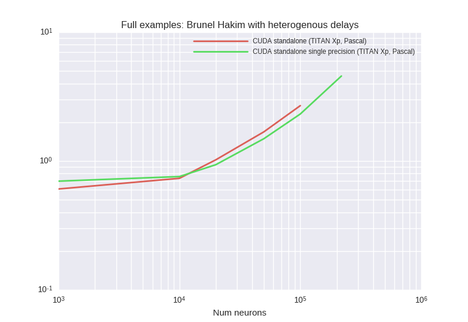
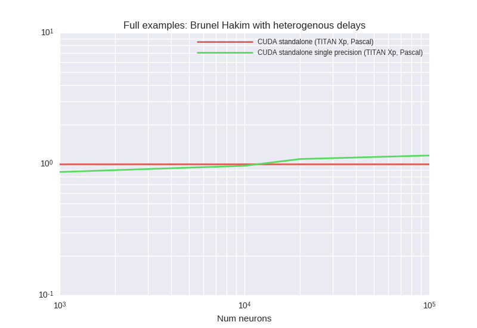

<details><summary>Examplary `nvprof` results for **CUDA-standalone--TITAN-Xp,-Pascal-**</summary><p>
Profile summary for `N = 1000`:

```
==6878== NVPROF is profiling process 6878, command: ./main
==6878== Profiling application: ./main
==6878== Profiling result:
            Type  Time(%)      Time     Calls       Avg       Min       Max  Name
 GPU activities:   40.47%  158.18ms     10000  15.818us  14.688us  16.321us  kernel_neurongroup_stateupdater_codeobject(int, int, double, double*, double*, double*, char*, double*)
                   21.37%  83.531ms      2497  33.452us  5.0560us  700.47us  _run_synapses_pre_push_spikes_push_kernel(int, int, int, int*)
                   16.42%  64.182ms     10000  6.4180us  4.0320us  9.6640us  kernel_synapses_pre_codeobject(int, int, int, int, int, int*, int, double*, int*, int, int*, int, int*)
                    6.20%  24.237ms     10000  2.4230us  2.3360us  8.6730us  _run_synapses_pre_push_spikes_advance_kernel(void)
                    5.03%  19.659ms     10000  1.9650us  1.8560us  9.6650us  kernel_neurongroup_thresholder_codeobject(int, int, int*, double, double*, double*, char*)
                    3.66%  14.308ms     10000  1.4300us  1.3120us  9.4400us  kernel_neurongroup_resetter_codeobject(int, int, double*, int*)
                    2.92%  11.432ms     10000  1.1430us  1.0880us  9.0880us  _GLOBAL__N__69_tmpxft_000018d3_00000000_6_neurongroup_thresholder_codeobject_cpp1_ii_0e9058a7::_reset_neurongroup_thresholder_codeobject(int*)
                    2.65%  10.360ms     10000  1.0360us     960ns  9.7610us  [CUDA memcpy DtoH]
                    1.27%  4.9818ms         2  2.4909ms  2.4904ms  2.4914ms  void gen_sequenced<curandStateXORWOW, double2, normal_args_double_st, __operator_&__(double2 curand_normal_scaled2_double<curandStateXORWOW>(curandStateXORWOW*, normal_args_double_st))>(curandStateXORWOW*, double2*, unsigned long, unsigned long, normal_args_double_st)
      API calls:   69.63%  922.28ms     62499  14.756us  10.516us  23.879ms  cudaLaunch
                   20.65%  273.55ms     10000  27.354us  17.911us  2.6589ms  cudaMemcpy
                    6.58%  87.092ms    339998     256ns     154ns  916.50us  cudaSetupArgument
                    1.63%  21.620ms     62499     345ns     214ns  641.84us  cudaConfigureCall
                    1.42%  18.869ms     62501     301ns     225ns  23.921us  cudaGetLastError
                    0.05%  645.44us         1  645.44us  645.44us  645.44us  cudaMalloc
                    0.02%  284.32us         1  284.32us  284.32us  284.32us  cudaMemGetInfo
                    0.00%  41.283us         8  5.1600us  3.8450us  10.688us  cudaFuncGetAttributes
                    0.00%  37.714us        39     967ns     727ns  4.2030us  cudaOccupancyMaxActiveBlocksPerMultiprocessorWithFlags
                    0.00%  11.932us         1  11.932us  11.932us  11.932us  cudaDeviceSynchronize
                    0.00%  9.9160us        12     826ns     474ns  3.0900us  cudaDeviceGetAttribute
                    0.00%  8.3240us         3  2.7740us  1.1580us  5.6900us  cudaGetDevice

```

</p></details>


<details><summary>Examplary `nvprof` results for **CUDA-standalone-single-precision--TITAN-Xp,-Pascal-**</summary><p>
Profile summary for `N = 1000`:

```
==7649== NVPROF is profiling process 7649, command: ./main
==7649== Profiling application: ./main
==7649== Profiling result:
            Type  Time(%)      Time     Calls       Avg       Min       Max  Name
 GPU activities:   41.79%  167.26ms     10000  16.726us  15.648us  16.960us  kernel_neurongroup_stateupdater_codeobject(int, int, double, float*, double*, double*, char*, float*)
                   23.30%  93.266ms      2485  37.531us  5.0880us  883.84us  _run_synapses_pre_push_spikes_push_kernel(int, int, int, int*)
                   14.02%  56.111ms     10000  5.6110us  3.9680us  9.3760us  kernel_synapses_pre_codeobject(int, int, int, int, int, int*, int, float*, int*, int, int*, int, int*)
                    6.34%  25.386ms     10000  2.5380us  2.3040us  9.4730us  _run_synapses_pre_push_spikes_advance_kernel(void)
                    5.07%  20.298ms     10000  2.0290us  1.8880us  10.049us  kernel_neurongroup_thresholder_codeobject(int, int, int*, double, float*, double*, char*)
                    3.59%  14.388ms     10000  1.4380us  1.3760us  9.9210us  kernel_neurongroup_resetter_codeobject(int, int, float*, int*)
                    3.20%  12.804ms     10000  1.2800us  1.0880us  10.112us  _GLOBAL__N__69_tmpxft_00001bd3_00000000_6_neurongroup_thresholder_codeobject_cpp1_ii_7f32e276::_reset_neurongroup_thresholder_codeobject(int*)
                    2.61%  10.457ms     10000  1.0450us     960ns  10.080us  [CUDA memcpy DtoH]
                    0.07%  293.10us         1  293.10us  293.10us  293.10us  void gen_sequenced<curandStateXORWOW, float2, normal_args_st, __operator_&__(float2 curand_normal_scaled2<curandStateXORWOW>(curandStateXORWOW*, normal_args_st))>(curandStateXORWOW*, float2*, unsigned long, unsigned long, normal_args_st)
      API calls:   68.42%  799.22ms     62486  12.790us  9.4930us  14.773ms  cudaLaunch
                   22.24%  259.77ms     10000  25.977us  16.572us  825.50us  cudaMemcpy
                    6.07%  70.862ms    339945     208ns     144ns  597.02us  cudaSetupArgument
                    1.67%  19.562ms     62487     313ns     218ns  606.25us  cudaGetLastError
                    1.51%  17.621ms     62486     281ns     184ns  537.68us  cudaConfigureCall
                    0.05%  611.05us         1  611.05us  611.05us  611.05us  cudaMalloc
                    0.02%  284.63us         1  284.63us  284.63us  284.63us  cudaMemGetInfo
                    0.00%  40.466us         8  5.0580us  3.7820us  10.708us  cudaFuncGetAttributes
                    0.00%  36.705us        39     941ns     742ns  3.7820us  cudaOccupancyMaxActiveBlocksPerMultiprocessorWithFlags
                    0.00%  11.608us         1  11.608us  11.608us  11.608us  cudaDeviceSynchronize
                    0.00%  9.6130us        12     801ns     463ns  3.0400us  cudaDeviceGetAttribute
                    0.00%  7.6830us         3  2.5610us  1.1010us  5.4740us  cudaGetDevice

```

</p></details>


***

### BrunelHakimModelScalarDelay


<details><summary>Examplary `nvprof` results for **CUDA-standalone--TITAN-Xp,-Pascal-**</summary><p>
Profile summary for `N = 1000`:

```
==18938== NVPROF is profiling process 18938, command: ./main
==18938== Profiling application: ./main
==18938== Profiling result:
            Type  Time(%)      Time     Calls       Avg       Min       Max  Name
 GPU activities:   67.85%  157.36ms     10000  15.735us  14.560us  16.288us  kernel_neurongroup_stateupdater_codeobject(int, int, double, double*, double*, double*, char*, double*)
                    7.82%  18.128ms     10000  1.8120us  1.6320us  9.7600us  kernel_neurongroup_thresholder_codeobject(int, int, int*, double, double*, double*, char*)
                    7.29%  16.896ms      1856  9.1030us  2.7840us  37.634us  kernel_synapses_pre_codeobject(int, int, int, int, int, int*, int, double*, int*, int, int*, int, int*)
                    5.72%  13.274ms     10000  1.3270us  1.2800us  8.9600us  kernel_neurongroup_resetter_codeobject(int, int, double*, int*)
                    4.87%  11.305ms     10000  1.1300us     960ns  9.0890us  _GLOBAL__N__69_tmpxft_0000480c_00000000_6_neurongroup_thresholder_codeobject_cpp1_ii_0e9058a7::_reset_neurongroup_thresholder_codeobject(int*)
                    4.49%  10.414ms      9981  1.0430us  1.0240us  9.6970us  [CUDA memcpy DtoH]
                    1.96%  4.5426ms         2  2.2713ms  2.0450ms  2.4977ms  void gen_sequenced<curandStateXORWOW, double2, normal_args_double_st, __operator_&__(double2 curand_normal_scaled2_double<curandStateXORWOW>(curandStateXORWOW*, normal_args_double_st))>(curandStateXORWOW*, double2*, unsigned long, unsigned long, normal_args_double_st)
      API calls:   66.05%  490.78ms     41858  11.724us  9.9730us  12.058ms  cudaLaunch
                   24.83%  184.50ms      9981  18.485us  16.537us  1.5358ms  cudaMemcpy
                    5.77%  42.848ms    224138     191ns     145ns  492.48us  cudaSetupArgument
                    1.81%  13.414ms     50004     268ns     206ns  459.77us  cudaGetLastError
                    1.44%  10.672ms     41858     254ns     185ns  463.47us  cudaConfigureCall
                    0.07%  515.74us         1  515.74us  515.74us  515.74us  cudaMalloc
                    0.04%  263.44us         1  263.44us  263.44us  263.44us  cudaMemGetInfo
                    0.00%  30.453us        38     801ns     608ns  4.6320us  cudaOccupancyMaxActiveBlocksPerMultiprocessorWithFlags
                    0.00%  29.161us         7  4.1650us  3.2270us  7.3730us  cudaFuncGetAttributes
                    0.00%  9.7640us         1  9.7640us  9.7640us  9.7640us  cudaDeviceSynchronize
                    0.00%  7.6550us        12     637ns     430ns  1.7780us  cudaDeviceGetAttribute
                    0.00%  5.2150us         3  1.7380us     831ns  3.4070us  cudaGetDevice

```

</p></details>


<details><summary>Examplary `nvprof` results for **CUDA-standalone-single-precision--TITAN-Xp,-Pascal-**</summary><p>
Profile summary for `N = 1000`:

```
==19600== NVPROF is profiling process 19600, command: ./main
==19600== Profiling application: ./main
==19600== Profiling result:
            Type  Time(%)      Time     Calls       Avg       Min       Max  Name
 GPU activities:   70.33%  165.82ms     10000  16.582us  15.488us  16.865us  kernel_neurongroup_stateupdater_codeobject(int, int, double, float*, double*, double*, char*, float*)
                    8.02%  18.898ms     10000  1.8890us  1.7600us  9.4400us  kernel_neurongroup_thresholder_codeobject(int, int, int*, double, float*, double*, char*)
                    6.67%  15.734ms      1773  8.8740us  2.7840us  43.682us  kernel_synapses_pre_codeobject(int, int, int, int, int, int*, int, float*, int*, int, int*, int, int*)
                    5.64%  13.293ms     10000  1.3290us  1.1840us  9.3130us  kernel_neurongroup_resetter_codeobject(int, int, float*, int*)
                    4.91%  11.569ms     10000  1.1560us     992ns  9.2160us  _GLOBAL__N__69_tmpxft_00004ad3_00000000_6_neurongroup_thresholder_codeobject_cpp1_ii_7f32e276::_reset_neurongroup_thresholder_codeobject(int*)
                    4.31%  10.166ms      9981  1.0180us     960ns  1.5040us  [CUDA memcpy DtoH]
                    0.12%  292.40us         1  292.40us  292.40us  292.40us  void gen_sequenced<curandStateXORWOW, float2, normal_args_st, __operator_&__(float2 curand_normal_scaled2<curandStateXORWOW>(curandStateXORWOW*, normal_args_st))>(curandStateXORWOW*, float2*, unsigned long, unsigned long, normal_args_st)
      API calls:   66.32%  530.79ms     41774  12.706us  9.7320us  12.866ms  cudaLaunch
                   24.29%  194.42ms      9981  19.479us  16.956us  477.49us  cudaMemcpy
                    5.75%  46.045ms    223054     206ns     145ns  603.57us  cudaSetupArgument
                    2.06%  16.470ms     50002     329ns     222ns  521.91us  cudaGetLastError
                    1.45%  11.587ms     41774     277ns     212ns  599.44us  cudaConfigureCall
                    0.08%  646.31us         1  646.31us  646.31us  646.31us  cudaMalloc
                    0.04%  322.71us         1  322.71us  322.71us  322.71us  cudaMemGetInfo
                    0.01%  40.193us        38  1.0570us     833ns  5.6520us  cudaOccupancyMaxActiveBlocksPerMultiprocessorWithFlags
                    0.00%  36.467us         7  5.2090us  3.9930us  9.0230us  cudaFuncGetAttributes
                    0.00%  14.062us        12  1.1710us     506ns  7.1110us  cudaDeviceGetAttribute
                    0.00%  12.317us         1  12.317us  12.317us  12.317us  cudaDeviceSynchronize
                    0.00%  10.865us         3  3.6210us  1.0540us  8.3360us  cudaGetDevice

```

</p></details>


<details><summary>Examplary `nvprof` results for **GeNNConfigurationOptimized**</summary><p>
Profile summary for `N = 1000`:

```
==20178== NVPROF is profiling process 20178, command: ./main test 1.0 1
==20178== Profiling application: ./main test 1.0 1
==20178== Profiling result:
            Type  Time(%)      Time     Calls       Avg       Min       Max  Name
 GPU activities:   74.02%  92.447ms     10000  9.2440us  7.9040us  13.568us  calcNeurons
                   21.32%  26.624ms     10000  2.6620us  2.0160us  16.929us  calcSynapses
                    3.69%  4.6094ms        41  112.42us     960ns  1.2912ms  [CUDA memcpy HtoD]
                    0.97%  1.2066ms        10  120.66us  1.0240us  1.1925ms  [CUDA memcpy DtoH]
      API calls:   94.51%  5.02880s        11  457.16ms  13.268us  5.01623s  cudaHostAlloc
                    5.00%  265.80ms     20000  13.289us  11.968us  556.17us  cudaLaunch
                    0.18%  9.3654ms     20000     468ns     367ns  523.92us  cudaConfigureCall
                    0.13%  6.9179ms        53  130.53us     847ns  1.3124ms  cudaMemcpy
                    0.12%  6.3673ms     20000     318ns     250ns  519.27us  cudaSetupArgument
                    0.05%  2.9207ms        11  265.52us  8.7730us  520.82us  cudaMalloc
                    0.01%  501.86us        94  5.3380us     217ns  217.83us  cuDeviceGetAttribute
                    0.00%  258.75us         1  258.75us  258.75us  258.75us  cuDeviceTotalMem
                    0.00%  57.128us         1  57.128us  57.128us  57.128us  cuDeviceGetName
                    0.00%  22.586us        11  2.0530us     793ns  5.4710us  cudaGetSymbolAddress
                    0.00%  16.546us         1  16.546us  16.546us  16.546us  cudaMemcpyToSymbol
                    0.00%  14.515us         1  14.515us  14.515us  14.515us  cudaSetDevice
                    0.00%  5.0070us         3  1.6690us     373ns  4.1890us  cuDeviceGetCount
                    0.00%  3.2470us         1  3.2470us  3.2470us  3.2470us  cudaGetDeviceCount
                    0.00%  1.2930us         2     646ns     257ns  1.0360us  cuDeviceGet

```

</p></details>


***

### COBAHHConstantConnectionProbability
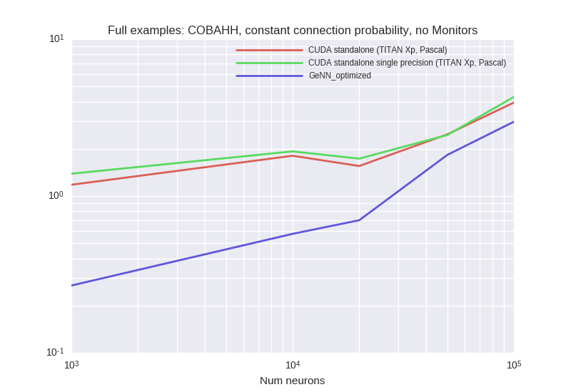
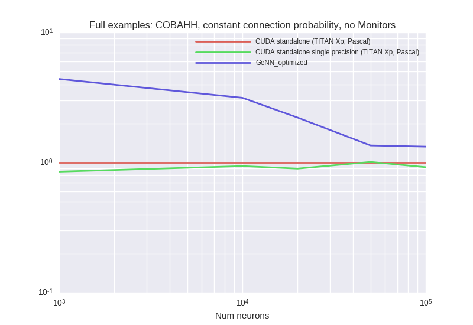

<details><summary>Examplary `nvprof` results for **CUDA-standalone--TITAN-Xp,-Pascal-**</summary><p>
Profile summary for `N = 1000`:

```
==23975== NVPROF is profiling process 23975, command: ./main
==23975== Profiling application: ./main
==23975== Profiling result:
            Type  Time(%)      Time     Calls       Avg       Min       Max  Name
 GPU activities:   62.63%  484.18ms     10000  48.417us  42.754us  56.642us  kernel_neurongroup_stateupdater_codeobject(int, int, double*, double*, double*, char*, double*, double*, double*, double*, double, double*)
                   16.03%  123.95ms      9775  12.679us  3.0720us  36.034us  kernel_synapses_pre_codeobject(int, int, int, int, int, int*, int, double*, int*, int, int*, int, int*)
                   14.94%  115.48ms      9775  11.813us  3.0720us  34.657us  kernel_synapses_1_pre_codeobject(int, int, int, int, int, int*, int, int*, int, int*, int, double*, int*)
                    2.65%  20.519ms     20000  1.0250us     928ns  9.7930us  [CUDA memcpy DtoH]
                    2.37%  18.327ms     10000  1.8320us  1.4080us  9.5040us  kernel_neurongroup_thresholder_codeobject(int, int, int*, double, double*, double*, char*)
                    1.38%  10.683ms     10000  1.0680us     864ns  9.1530us  _GLOBAL__N__69_tmpxft_00005b52_00000000_6_neurongroup_thresholder_codeobject_cpp1_ii_0e9058a7::_reset_neurongroup_thresholder_codeobject(int*)
      API calls:   48.04%  678.37ms     49550  13.690us  10.136us  11.230ms  cudaLaunch
                   41.33%  583.70ms     20000  29.184us  14.101us  769.92us  cudaMemcpy
                    8.06%  113.78ms    454150     250ns     162ns  1.1000ms  cudaSetupArgument
                    1.30%  18.301ms     49550     369ns     236ns  511.18us  cudaConfigureCall
                    1.25%  17.712ms     50000     354ns     242ns  569.89us  cudaGetLastError
                    0.02%  300.84us         1  300.84us  300.84us  300.84us  cudaMemGetInfo
                    0.00%  31.197us         6  5.1990us  4.1780us  6.8210us  cudaFuncGetAttributes
                    0.00%  24.362us        21  1.1600us     845ns  2.6780us  cudaOccupancyMaxActiveBlocksPerMultiprocessorWithFlags
                    0.00%  11.624us         1  11.624us  11.624us  11.624us  cudaDeviceSynchronize
                    0.00%  5.2990us         8     662ns     470ns  1.1930us  cudaDeviceGetAttribute
                    0.00%  3.6520us         2  1.8260us  1.7460us  1.9060us  cudaGetDevice

```

</p></details>


<details><summary>Examplary `nvprof` results for **CUDA-standalone-single-precision--TITAN-Xp,-Pascal-**</summary><p>
Profile summary for `N = 1000`:

```
==24793== NVPROF is profiling process 24793, command: ./main
==24793== Profiling application: ./main
==24793== Profiling result:
            Type  Time(%)      Time     Calls       Avg       Min       Max  Name
 GPU activities:   69.28%  583.51ms     10000  58.351us  55.042us  73.507us  kernel_neurongroup_stateupdater_codeobject(int, int, float*, float*, double*, char*, double*, float*, float*, float*, double, float*)
                   13.01%  109.59ms      9782  11.203us  3.0400us  38.625us  kernel_synapses_pre_codeobject(int, int, int, int, int, int*, int, float*, int*, int, int*, int, int*)
                   12.20%  102.73ms      9782  10.501us  3.0080us  36.066us  kernel_synapses_1_pre_codeobject(int, int, int, int, int, int*, int, int*, int, int*, int, float*, int*)
                    2.26%  19.064ms     20000     953ns     864ns  9.8890us  [CUDA memcpy DtoH]
                    2.06%  17.357ms     10000  1.7350us  1.4080us  9.6000us  kernel_neurongroup_thresholder_codeobject(int, int, int*, double, float*, double*, char*)
                    1.19%  10.056ms     10000  1.0050us     896ns  9.5370us  _GLOBAL__N__69_tmpxft_00005e76_00000000_6_neurongroup_thresholder_codeobject_cpp1_ii_7f32e276::_reset_neurongroup_thresholder_codeobject(int*)
      API calls:   49.42%  770.46ms     49564  15.544us  12.165us  11.976ms  cudaLaunch
                   41.13%  641.21ms     20000  32.060us  15.617us  1.2942ms  cudaMemcpy
                    6.74%  105.07ms    454332     231ns     177ns  624.48us  cudaSetupArgument
                    1.40%  21.777ms     49564     439ns     286ns  579.22us  cudaConfigureCall
                    1.28%  20.019ms     50000     400ns     248ns  630.14us  cudaGetLastError
                    0.02%  312.17us         1  312.17us  312.17us  312.17us  cudaMemGetInfo
                    0.00%  30.595us         6  5.0990us  3.8820us  7.3210us  cudaFuncGetAttributes
                    0.00%  26.266us        25  1.0500us     765ns  2.9720us  cudaOccupancyMaxActiveBlocksPerMultiprocessorWithFlags
                    0.00%  15.401us         1  15.401us  15.401us  15.401us  cudaDeviceSynchronize
                    0.00%  6.4010us         8     800ns     478ns  1.8010us  cudaDeviceGetAttribute
                    0.00%  4.3910us         2  2.1950us  2.0400us  2.3510us  cudaGetDevice

```

</p></details>


<details><summary>Examplary `nvprof` results for **GeNNConfigurationOptimized**</summary><p>
Profile summary for `N = 1000`:

```
==25466== NVPROF is profiling process 25466, command: ./main test 1.0 1
==25466== Profiling application: ./main test 1.0 1
==25466== Profiling result:
            Type  Time(%)      Time     Calls       Avg       Min       Max  Name
 GPU activities:   76.13%  240.87ms     10000  24.087us  20.320us  26.817us  calcNeurons
                   23.80%  75.286ms     10000  7.5280us  1.7920us  18.945us  calcSynapses
                    0.06%  183.78us        68  2.7020us     896ns  22.241us  [CUDA memcpy HtoD]
                    0.02%  48.897us        18  2.7160us     992ns  19.680us  [CUDA memcpy DtoH]
      API calls:   55.32%  382.25ms        19  20.119ms  13.960us  375.46ms  cudaHostAlloc
                   41.45%  286.43ms     20000  14.321us  12.258us  630.20us  cudaLaunch
                    1.35%  9.3576ms     20000     467ns     367ns  539.03us  cudaConfigureCall
                    0.98%  6.7957ms     20000     339ns     259ns  531.57us  cudaSetupArgument
                    0.41%  2.8140ms        19  148.10us  9.1710us  771.60us  cudaMalloc
                    0.31%  2.1202ms        88  24.093us  1.6530us  60.112us  cudaMemcpy
                    0.09%  639.38us        94  6.8010us     217ns  325.07us  cuDeviceGetAttribute
                    0.07%  475.16us         1  475.16us  475.16us  475.16us  cuDeviceTotalMem
                    0.01%  87.465us         1  87.465us  87.465us  87.465us  cuDeviceGetName
                    0.01%  38.445us        19  2.0230us     984ns  6.3020us  cudaGetSymbolAddress
                    0.00%  14.288us         1  14.288us  14.288us  14.288us  cudaSetDevice
                    0.00%  7.6360us         3  2.5450us     823ns  5.9030us  cuDeviceGetCount
                    0.00%  2.6640us         1  2.6640us  2.6640us  2.6640us  cudaGetDeviceCount
                    0.00%  2.3900us         2  1.1950us     540ns  1.8500us  cuDeviceGet

```

</p></details>


***

### COBAHHFixedConnectivityNoMonitor
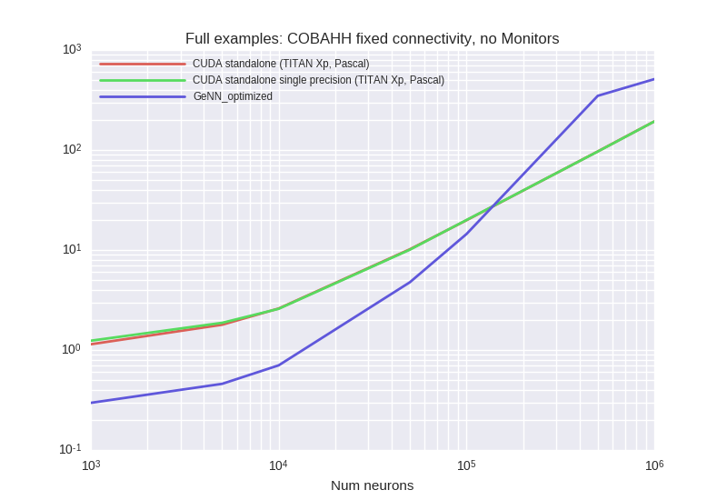


<details><summary>Examplary `nvprof` results for **CUDA-standalone--TITAN-Xp,-Pascal-**</summary><p>
Profile summary for `N = 1000`:

```
==6923== NVPROF is profiling process 6923, command: ./main
==6923== Profiling application: ./main
==6923== Profiling result:
            Type  Time(%)      Time     Calls       Avg       Min       Max  Name
 GPU activities:   62.39%  486.80ms     10000  48.679us  42.881us  57.506us  kernel_neurongroup_stateupdater_codeobject(int, int, double*, double*, double*, char*, double*, double*, double*, double*, double, double*)
                   16.51%  128.81ms      9771  13.182us  3.0720us  42.433us  kernel_synapses_pre_codeobject(int, int, int, int, int, int*, int, double*, int*, int, int*, int, int*)
                   14.89%  116.22ms      9771  11.893us  3.0720us  42.753us  kernel_synapses_1_pre_codeobject(int, int, int, int, int, int*, int, int*, int, int*, int, double*, int*)
                    2.46%  19.178ms     20000     958ns     864ns  9.2800us  [CUDA memcpy DtoH]
                    2.37%  18.496ms     10000  1.8490us  1.4080us  8.9600us  kernel_neurongroup_thresholder_codeobject(int, int, int*, double, double*, double*, char*)
                    1.38%  10.775ms     10000  1.0770us     928ns  9.6970us  _GLOBAL__N__69_tmpxft_000018c9_00000000_6_neurongroup_thresholder_codeobject_cpp1_ii_0e9058a7::_reset_neurongroup_thresholder_codeobject(int*)
      API calls:   49.83%  744.02ms     49542  15.018us  10.043us  10.626ms  cudaLaunch
                   39.99%  597.16ms     20000  29.858us  13.818us  3.2551ms  cudaMemcpy
                    7.70%  115.00ms    454046     253ns     163ns  1.0043ms  cudaSetupArgument
                    1.26%  18.751ms     49542     378ns     207ns  482.12us  cudaConfigureCall
                    1.20%  17.882ms     50000     357ns     220ns  601.56us  cudaGetLastError
                    0.02%  323.53us         1  323.53us  323.53us  323.53us  cudaMemGetInfo
                    0.00%  30.750us         6  5.1250us  3.8840us  7.2180us  cudaFuncGetAttributes
                    0.00%  23.278us        21  1.1080us     793ns  2.6020us  cudaOccupancyMaxActiveBlocksPerMultiprocessorWithFlags
                    0.00%  13.028us         1  13.028us  13.028us  13.028us  cudaDeviceSynchronize
                    0.00%  6.5530us         8     819ns     478ns  2.0930us  cudaDeviceGetAttribute
                    0.00%  3.8760us         2  1.9380us  1.6800us  2.1960us  cudaGetDevice

```

</p></details>


<details><summary>Examplary `nvprof` results for **CUDA-standalone-single-precision--TITAN-Xp,-Pascal-**</summary><p>
Profile summary for `N = 1000`:

```
==7732== NVPROF is profiling process 7732, command: ./main
==7732== Profiling application: ./main
==7732== Profiling result:
            Type  Time(%)      Time     Calls       Avg       Min       Max  Name
 GPU activities:   70.04%  627.92ms     10000  62.791us  55.425us  73.538us  kernel_neurongroup_stateupdater_codeobject(int, int, float*, float*, double*, char*, double*, float*, float*, float*, double, float*)
                   12.75%  114.29ms      9647  11.847us  3.0400us  46.721us  kernel_synapses_pre_codeobject(int, int, int, int, int, int*, int, float*, int*, int, int*, int, int*)
                   11.70%  104.92ms      9647  10.875us  3.0400us  43.554us  kernel_synapses_1_pre_codeobject(int, int, int, int, int, int*, int, int*, int, int*, int, float*, int*)
                    2.25%  20.214ms     20000  1.0100us     896ns  10.145us  [CUDA memcpy DtoH]
                    2.08%  18.628ms     10000  1.8620us  1.4080us  9.3440us  kernel_neurongroup_thresholder_codeobject(int, int, int*, double, float*, double*, char*)
                    1.18%  10.585ms     10000  1.0580us     896ns  9.0880us  _GLOBAL__N__69_tmpxft_00001bf3_00000000_6_neurongroup_thresholder_codeobject_cpp1_ii_7f32e276::_reset_neurongroup_thresholder_codeobject(int*)
      API calls:   47.68%  735.72ms     20000  36.786us  15.274us  1.3952ms  cudaMemcpy
                   44.32%  683.84ms     49294  13.872us  10.541us  11.829ms  cudaLaunch
                    5.66%  87.364ms    450822     193ns     143ns  575.39us  cudaSetupArgument
                    1.21%  18.658ms     49294     378ns     200ns  837.54us  cudaConfigureCall
                    1.11%  17.061ms     50000     341ns     245ns  570.08us  cudaGetLastError
                    0.02%  290.95us         1  290.95us  290.95us  290.95us  cudaMemGetInfo
                    0.00%  29.825us         6  4.9700us  3.9210us  6.6370us  cudaFuncGetAttributes
                    0.00%  27.738us         1  27.738us  27.738us  27.738us  cudaDeviceSynchronize
                    0.00%  25.500us        25  1.0200us     746ns  2.7920us  cudaOccupancyMaxActiveBlocksPerMultiprocessorWithFlags
                    0.00%  5.9610us         8     745ns     492ns  1.7150us  cudaDeviceGetAttribute
                    0.00%  3.6720us         2  1.8360us  1.7040us  1.9680us  cudaGetDevice

```

</p></details>


<details><summary>Examplary `nvprof` results for **GeNNConfigurationOptimized**</summary><p>
Profile summary for `N = 1000`:

```
==8303== NVPROF is profiling process 8303, command: ./main test 1.0 1
==8303== Profiling application: ./main test 1.0 1
==8303== Profiling result:
            Type  Time(%)      Time     Calls       Avg       Min       Max  Name
 GPU activities:   82.12%  246.17ms     10000  24.616us  22.465us  26.657us  calcNeurons
                   17.69%  53.017ms     10000  5.3010us  1.9520us  15.873us  calcSynapses
                    0.15%  456.98us        68  6.7200us     960ns  84.034us  [CUDA memcpy HtoD]
                    0.04%  119.11us        16  7.4440us  1.0560us  76.995us  [CUDA memcpy DtoH]
      API calls:   56.02%  378.58ms        19  19.926ms  12.977us  370.56ms  cudaHostAlloc
                   40.14%  271.30ms     20000  13.565us  12.322us  579.70us  cudaLaunch
                    1.38%  9.3007ms     20000     465ns     377ns  560.86us  cudaConfigureCall
                    0.93%  6.3137ms     20000     315ns     234ns  551.27us  cudaSetupArgument
                    0.57%  3.8541ms        94  41.001us     407ns  2.0354ms  cuDeviceGetAttribute
                    0.40%  2.7115ms        19  142.71us  8.2300us  447.39us  cudaMalloc
                    0.31%  2.0702ms        88  23.524us     763ns  100.64us  cudaMemcpy
                    0.15%  1.0098ms         1  1.0098ms  1.0098ms  1.0098ms  cuDeviceTotalMem
                    0.09%  615.26us         1  615.26us  615.26us  615.26us  cuDeviceGetName
                    0.00%  27.977us        19  1.4720us     699ns  5.4180us  cudaGetSymbolAddress
                    0.00%  25.977us         1  25.977us  25.977us  25.977us  cudaSetDevice
                    0.00%  9.5690us         3  3.1890us     680ns  7.5390us  cuDeviceGetCount
                    0.00%  5.5050us         1  5.5050us  5.5050us  5.5050us  cudaGetDeviceCount
                    0.00%  2.1740us         2  1.0870us     570ns  1.6040us  cuDeviceGet

```

</p></details>


***

### CUBAFixedConnectivityNoMonitor
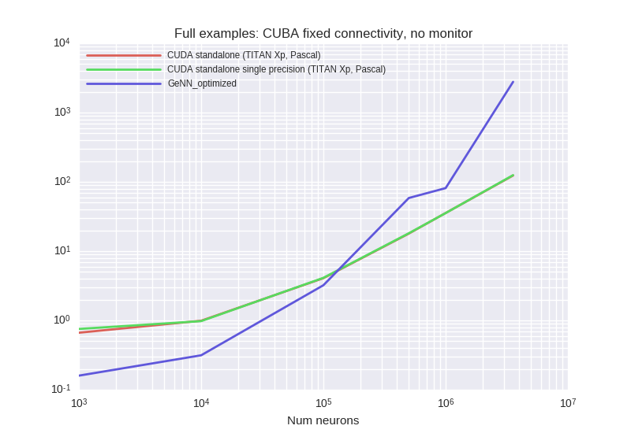


<details><summary>Examplary `nvprof` results for **CUDA-standalone--TITAN-Xp,-Pascal-**</summary><p>
Profile summary for `N = 1000`:

```
==25404== NVPROF is profiling process 25404, command: ./main
==25404== Profiling application: ./main
==25404== Profiling result:
            Type  Time(%)      Time     Calls       Avg       Min       Max  Name
 GPU activities:   61.62%  188.64ms     10000  18.864us  17.217us  19.872us  kernel_neurongroup_stateupdater_codeobject(int, int, double*, double*, double, double*, double*, double*, char*)
                    8.39%  25.691ms      3931  6.5350us  4.5120us  20.737us  kernel_synapses_pre_codeobject(int, int, int, int, int, int*, int, int*, int, double*, int*, int, int*, char*)
                    7.61%  23.284ms      3931  5.9230us  4.5440us  19.713us  kernel_synapses_1_pre_codeobject(int, int, int, int, int, int*, int, int*, int, int*, int, int*, double*, char*)
                    7.01%  21.460ms     20000  1.0730us  1.0240us  9.9520us  [CUDA memcpy DtoH]
                    6.63%  20.290ms     10000  2.0280us  1.8560us  9.8570us  kernel_neurongroup_thresholder_codeobject(int, int, int*, double, double*, double*, char*)
                    4.67%  14.310ms     10000  1.4310us  1.3760us  9.2480us  kernel_neurongroup_resetter_codeobject(int, int, double*, int*, char*)
                    4.08%  12.479ms     10000  1.2470us  1.1840us  9.5690us  _GLOBAL__N__69_tmpxft_00006096_00000000_6_neurongroup_thresholder_codeobject_cpp1_ii_0e9058a7::_reset_neurongroup_thresholder_codeobject(int*)
      API calls:   55.83%  635.12ms     47862  13.269us  10.306us  11.250ms  cudaLaunch
                   35.03%  398.54ms     20000  19.926us  14.510us  1.8296ms  cudaMemcpy
                    6.41%  72.902ms    330068     220ns     143ns  1.4189ms  cudaSetupArgument
                    1.58%  17.972ms     60000     299ns     211ns  515.00us  cudaGetLastError
                    1.11%  12.604ms     47862     263ns     189ns  482.25us  cudaConfigureCall
                    0.03%  303.34us         1  303.34us  303.34us  303.34us  cudaMemGetInfo
                    0.00%  39.612us        39  1.0150us     798ns  3.2690us  cudaOccupancyMaxActiveBlocksPerMultiprocessorWithFlags
                    0.00%  39.180us         8  4.8970us  3.8870us  6.6570us  cudaFuncGetAttributes
                    0.00%  12.497us         1  12.497us  12.497us  12.497us  cudaDeviceSynchronize
                    0.00%  8.6730us        12     722ns     473ns  2.1130us  cudaDeviceGetAttribute
                    0.00%  5.6400us         3  1.8800us  1.1780us  2.7040us  cudaGetDevice

```

</p></details>


<details><summary>Examplary `nvprof` results for **CUDA-standalone-single-precision--TITAN-Xp,-Pascal-**</summary><p>
Profile summary for `N = 1000`:

```
==26415== NVPROF is profiling process 26415, command: ./main
==26415== Profiling application: ./main
==26415== Profiling result:
            Type  Time(%)      Time     Calls       Avg       Min       Max  Name
 GPU activities:   64.17%  209.65ms     10000  20.965us  20.001us  21.185us  kernel_neurongroup_stateupdater_codeobject(int, int, double*, float*, double, float*, double*, float*, char*)
                    7.78%  25.402ms      4069  6.2420us  4.5440us  20.832us  kernel_synapses_pre_codeobject(int, int, int, int, int, int*, int, int*, int, float*, int*, int, int*, char*)
                    7.37%  24.077ms      4069  5.9170us  4.5120us  19.808us  kernel_synapses_1_pre_codeobject(int, int, int, int, int, int*, int, int*, int, int*, int, int*, float*, char*)
                    6.36%  20.777ms     20000  1.0380us     960ns  10.081us  [CUDA memcpy DtoH]
                    6.04%  19.718ms     10000  1.9710us  1.7600us  9.5040us  kernel_neurongroup_thresholder_codeobject(int, int, int*, double, float*, double*, char*)
                    4.42%  14.425ms     10000  1.4420us  1.3440us  9.6000us  kernel_neurongroup_resetter_codeobject(int, int, float*, int*, char*)
                    3.87%  12.642ms     10000  1.2640us  1.0880us  9.5370us  _GLOBAL__N__69_tmpxft_0000647e_00000000_6_neurongroup_thresholder_codeobject_cpp1_ii_7f32e276::_reset_neurongroup_thresholder_codeobject(int*)
      API calls:   56.80%  628.85ms     48138  13.063us  10.198us  12.156ms  cudaLaunch
                   34.13%  377.83ms     20000  18.891us  14.540us  1.2520ms  cudaMemcpy
                    6.00%  66.447ms    333932     198ns     144ns  586.66us  cudaSetupArgument
                    1.62%  17.949ms     60000     299ns     225ns  571.01us  cudaGetLastError
                    1.41%  15.559ms     48138     323ns     224ns  487.42us  cudaConfigureCall
                    0.03%  304.99us         1  304.99us  304.99us  304.99us  cudaMemGetInfo
                    0.00%  39.515us         8  4.9390us  3.8850us  7.1870us  cudaFuncGetAttributes
                    0.00%  37.265us        39     955ns     740ns  3.3560us  cudaOccupancyMaxActiveBlocksPerMultiprocessorWithFlags
                    0.00%  19.202us         1  19.202us  19.202us  19.202us  cudaDeviceSynchronize
                    0.00%  8.4330us        12     702ns     454ns  1.8540us  cudaDeviceGetAttribute
                    0.00%  5.7250us         3  1.9080us  1.2430us  2.6910us  cudaGetDevice

```

</p></details>


<details><summary>Examplary `nvprof` results for **GeNNConfigurationOptimized**</summary><p>
Profile summary for `N = 1000`:

```
==27351== NVPROF is profiling process 27351, command: ./main test 1.0 1
==27351== Profiling application: ./main test 1.0 1
==27351== Profiling result:
            Type  Time(%)      Time     Calls       Avg       Min       Max  Name
 GPU activities:   80.34%  132.24ms     10000  13.224us  11.840us  14.433us  calcNeurons
                   19.33%  31.810ms     10000  3.1810us  1.8880us  11.681us  calcSynapses
                    0.27%  436.30us        56  7.7910us     928ns  83.779us  [CUDA memcpy HtoD]
                    0.07%  115.37us        15  7.6910us     992ns  76.931us  [CUDA memcpy DtoH]
      API calls:   57.52%  391.06ms        16  24.441ms  13.244us  382.75ms  cudaHostAlloc
                   39.28%  267.07ms     20000  13.353us  11.955us  577.50us  cudaLaunch
                    1.46%  9.9488ms     20000     497ns     372ns  577.80us  cudaConfigureCall
                    0.94%  6.3754ms     20000     318ns     238ns  548.31us  cudaSetupArgument
                    0.40%  2.6900ms        16  168.12us  9.1410us  458.82us  cudaMalloc
                    0.28%  1.9309ms        73  26.450us     816ns  99.825us  cudaMemcpy
                    0.06%  426.61us        94  4.5380us     218ns  182.89us  cuDeviceGetAttribute
                    0.04%  251.99us         1  251.99us  251.99us  251.99us  cuDeviceTotalMem
                    0.01%  51.511us         1  51.511us  51.511us  51.511us  cuDeviceGetName
                    0.00%  31.597us        16  1.9740us     868ns  9.9150us  cudaGetSymbolAddress
                    0.00%  15.447us         1  15.447us  15.447us  15.447us  cudaSetDevice
                    0.00%  5.0040us         3  1.6680us     274ns  4.3020us  cuDeviceGetCount
                    0.00%  3.3560us         1  3.3560us  3.3560us  3.3560us  cudaGetDeviceCount
                    0.00%  1.1740us         2     587ns     240ns     934ns  cuDeviceGet

```

</p></details>


***

### DenseMediumRateSynapsesOnly


<details><summary>Examplary `nvprof` results for **CUDA-standalone--TITAN-Xp,-Pascal-**</summary><p>
Profile summary for `N = 1000`:

```
==16651== NVPROF is profiling process 16651, command: ./main
==16651== Profiling application: ./main
==16651== Profiling result:
            Type  Time(%)      Time     Calls       Avg       Min       Max  Name
 GPU activities:   61.52%  54.694ms     10000  5.4690us  5.3760us  9.5690us  kernel_synapses_pre_codeobject(int, int, int, int, int, int*, int, int*, int, int*, int, double*, int*)
                   14.57%  12.952ms     10000  1.2950us  1.2160us  9.3760us  kernel_neurongroup_thresholder_codeobject(int, int, int*)
                   12.24%  10.882ms     10000  1.0880us  1.0240us  9.8890us  [CUDA memcpy DtoH]
                   11.67%  10.375ms     10000  1.0370us     992ns  9.5370us  _GLOBAL__N__69_tmpxft_00003f81_00000000_6_neurongroup_thresholder_codeobject_cpp1_ii_e0a5624b::_reset_neurongroup_thresholder_codeobject(int*)
      API calls:   62.52%  432.77ms     30000  14.425us  11.992us  11.779ms  cudaLaunch
                   28.68%  198.53ms     10000  19.853us  18.628us  116.40us  cudaMemcpy
                    5.76%  39.876ms    170000     234ns     177ns  596.02us  cudaSetupArgument
                    1.59%  10.986ms     30000     366ns     267ns  630.91us  cudaConfigureCall
                    1.41%  9.7480ms     30000     324ns     266ns  34.028us  cudaGetLastError
                    0.04%  273.01us         1  273.01us  273.01us  273.01us  cudaMemGetInfo
                    0.00%  15.321us         3  5.1070us  4.0130us  6.2600us  cudaFuncGetAttributes
                    0.00%  15.264us         1  15.264us  15.264us  15.264us  cudaDeviceSynchronize
                    0.00%  9.5780us         3  3.1920us     975ns  5.8510us  cudaOccupancyMaxActiveBlocksPerMultiprocessorWithFlags
                    0.00%  2.7340us         4     683ns     490ns  1.1300us  cudaDeviceGetAttribute
                    0.00%  1.4950us         1  1.4950us  1.4950us  1.4950us  cudaGetDevice

```

</p></details>


<details><summary>Examplary `nvprof` results for **CUDA-standalone-single-precision--TITAN-Xp,-Pascal-**</summary><p>
Profile summary for `N = 1000`:

```
==17175== NVPROF is profiling process 17175, command: ./main
==17175== Profiling application: ./main
==17175== Profiling result:
            Type  Time(%)      Time     Calls       Avg       Min       Max  Name
 GPU activities:   60.21%  51.192ms     10000  5.1190us  4.9920us  9.7280us  kernel_synapses_pre_codeobject(int, int, int, int, int, int*, int, int*, int, int*, int, float*, int*)
                   15.28%  12.989ms     10000  1.2980us  1.2480us  10.144us  kernel_neurongroup_thresholder_codeobject(int, int, int*)
                   12.33%  10.481ms     10000  1.0480us     992ns  9.7930us  _GLOBAL__N__69_tmpxft_00004192_00000000_6_neurongroup_thresholder_codeobject_cpp1_ii_e0a5624b::_reset_neurongroup_thresholder_codeobject(int*)
                   12.19%  10.365ms     10000  1.0360us     960ns  10.081us  [CUDA memcpy DtoH]
      API calls:   61.48%  385.97ms     30000  12.865us  10.208us  12.255ms  cudaLaunch
                   29.74%  186.72ms     10000  18.672us  16.616us  573.67us  cudaMemcpy
                    5.65%  35.493ms    170000     208ns     145ns  581.22us  cudaSetupArgument
                    1.55%  9.7204ms     30000     324ns     201ns  54.587us  cudaConfigureCall
                    1.53%  9.5894ms     30000     319ns     253ns  53.697us  cudaGetLastError
                    0.04%  276.56us         1  276.56us  276.56us  276.56us  cudaMemGetInfo
                    0.00%  15.482us         3  5.1600us  4.0480us  6.2670us  cudaFuncGetAttributes
                    0.00%  12.710us         1  12.710us  12.710us  12.710us  cudaDeviceSynchronize
                    0.00%  9.4820us         3  3.1600us     887ns  6.2320us  cudaOccupancyMaxActiveBlocksPerMultiprocessorWithFlags
                    0.00%  3.0010us         4     750ns     529ns  1.2980us  cudaDeviceGetAttribute
                    0.00%  1.3790us         1  1.3790us  1.3790us  1.3790us  cudaGetDevice

```

</p></details>


<details><summary>Examplary `nvprof` results for **GeNNConfigurationOptimized**</summary><p>
Profile summary for `N = 1000`:

```
==17622== NVPROF is profiling process 17622, command: ./main test 1.0 1
==17622== Profiling application: ./main test 1.0 1
==17622== Profiling result:
            Type  Time(%)      Time     Calls       Avg       Min       Max  Name
 GPU activities:   60.11%  37.489ms     10000  3.7480us  3.6160us  10.305us  calcSynapses
                   39.77%  24.804ms     10000  2.4800us  2.4320us  10.144us  calcNeurons
                    0.08%  51.969us        44  1.1810us     896ns  1.7280us  [CUDA memcpy HtoD]
                    0.03%  18.048us        14  1.2890us  1.0560us  2.0160us  [CUDA memcpy DtoH]
      API calls:   54.55%  332.14ms        12  27.678ms  13.696us  327.97ms  cudaHostAlloc
                   42.47%  258.58ms     20000  12.928us  11.870us  606.25us  cudaLaunch
                    1.41%  8.5840ms     20000     429ns     346ns  539.25us  cudaConfigureCall
                    0.97%  5.9364ms     20000     296ns     229ns  563.08us  cudaSetupArgument
                    0.28%  1.7054ms        12  142.12us  9.4790us  736.41us  cudaMalloc
                    0.18%  1.0990ms        61  18.017us     800ns  68.214us  cudaMemcpy
                    0.08%  490.16us        94  5.2140us     219ns  240.96us  cuDeviceGetAttribute
                    0.04%  252.04us         1  252.04us  252.04us  252.04us  cuDeviceTotalMem
                    0.01%  51.588us         1  51.588us  51.588us  51.588us  cuDeviceGetName
                    0.01%  31.492us         1  31.492us  31.492us  31.492us  cudaSetDevice
                    0.00%  25.319us        12  2.1090us     869ns  9.9820us  cudaGetSymbolAddress
                    0.00%  5.5980us         3  1.8660us     371ns  4.7490us  cuDeviceGetCount
                    0.00%  5.4290us         1  5.4290us  5.4290us  5.4290us  cudaGetDeviceCount
                    0.00%  1.3870us         2     693ns     268ns  1.1190us  cuDeviceGet

```

</p></details>


***

### DenseMediumRateSynapsesOnlyHeterogeneousDelays
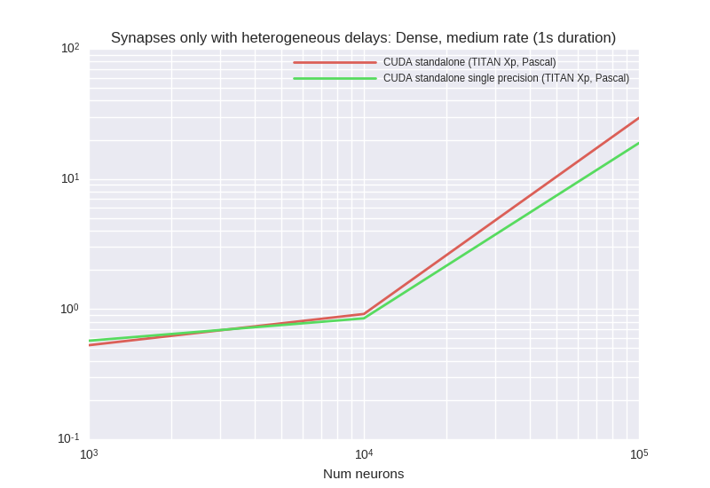


<details><summary>Examplary `nvprof` results for **CUDA-standalone--TITAN-Xp,-Pascal-**</summary><p>
Profile summary for `N = 1000`:

```
==28852== NVPROF is profiling process 28852, command: ./main
==28852== Profiling application: ./main
==28852== Profiling result:
            Type  Time(%)      Time     Calls       Avg       Min       Max  Name
 GPU activities:   37.28%  71.358ms     10000  7.1350us  4.8960us  657.78us  _run_synapses_pre_push_spikes_push_kernel(int, int, int, int*)
                   30.28%  57.945ms     10000  5.7940us  5.6640us  9.2160us  kernel_synapses_pre_codeobject(int, int, int, int, int, int*, int, int*, int, int*, int, double*, int*)
                   13.64%  26.097ms     10000  2.6090us  2.4000us  9.7600us  _run_synapses_pre_push_spikes_advance_kernel(void)
                    7.39%  14.149ms     10000  1.4140us  1.3440us  11.904us  kernel_neurongroup_thresholder_codeobject(int, int, int*)
                    6.13%  11.736ms     10000  1.1730us  1.1200us  9.2160us  _GLOBAL__N__69_tmpxft_00006e92_00000000_6_neurongroup_thresholder_codeobject_cpp1_ii_e0a5624b::_reset_neurongroup_thresholder_codeobject(int*)
                    5.28%  10.107ms     10000  1.0100us     960ns  9.8890us  [CUDA memcpy DtoH]
      API calls:   70.59%  694.46ms     50000  13.889us  10.491us  12.809ms  cudaLaunch
                   21.72%  213.68ms     10000  21.368us  16.323us  1.3529ms  cudaMemcpy
                    4.50%  44.268ms    210000     210ns     144ns  583.89us  cudaSetupArgument
                    1.75%  17.193ms     50000     343ns     236ns  23.733us  cudaConfigureCall
                    1.42%  13.926ms     50000     278ns     193ns  13.430us  cudaGetLastError
                    0.03%  269.95us         1  269.95us  269.95us  269.95us  cudaMemGetInfo
                    0.00%  20.291us         1  20.291us  20.291us  20.291us  cudaDeviceSynchronize
                    0.00%  19.536us         4  4.8840us  3.9180us  6.0060us  cudaFuncGetAttributes
                    0.00%  7.8260us         4  1.9560us     912ns  2.6010us  cudaOccupancyMaxActiveBlocksPerMultiprocessorWithFlags
                    0.00%  2.4440us         4     611ns     469ns     941ns  cudaDeviceGetAttribute
                    0.00%  1.3600us         1  1.3600us  1.3600us  1.3600us  cudaGetDevice

```

</p></details>


<details><summary>Examplary `nvprof` results for **CUDA-standalone-single-precision--TITAN-Xp,-Pascal-**</summary><p>
Profile summary for `N = 1000`:

```
==29616== NVPROF is profiling process 29616, command: ./main
==29616== Profiling application: ./main
==29616== Profiling result:
            Type  Time(%)      Time     Calls       Avg       Min       Max  Name
 GPU activities:   39.91%  73.365ms     10000  7.3360us  4.9290us  571.60us  _run_synapses_pre_push_spikes_push_kernel(int, int, int, int*)
                   28.32%  52.069ms     10000  5.2060us  5.1200us  9.3760us  kernel_synapses_pre_codeobject(int, int, int, int, int, int*, int, int*, int, int*, int, float*, int*)
                   12.87%  23.658ms     10000  2.3650us  2.3040us  9.4400us  _run_synapses_pre_push_spikes_advance_kernel(void)
                    7.61%  13.983ms     10000  1.3980us  1.3440us  9.1210us  kernel_neurongroup_thresholder_codeobject(int, int, int*)
                    5.68%  10.437ms     10000  1.0430us     992ns  9.3770us  _GLOBAL__N__69_tmpxft_000071ae_00000000_6_neurongroup_thresholder_codeobject_cpp1_ii_e0a5624b::_reset_neurongroup_thresholder_codeobject(int*)
                    5.62%  10.337ms     10000  1.0330us     960ns  9.8890us  [CUDA memcpy DtoH]
      API calls:   69.81%  723.74ms     50000  14.474us  12.134us  11.870ms  cudaLaunch
                   21.67%  224.66ms     10000  22.466us  18.951us  1.0811ms  cudaMemcpy
                    5.04%  52.279ms    210000     248ns     191ns  639.54us  cudaSetupArgument
                    1.74%  18.027ms     50000     360ns     273ns  27.518us  cudaGetLastError
                    1.71%  17.739ms     50000     354ns     257ns  657.82us  cudaConfigureCall
                    0.03%  280.95us         1  280.95us  280.95us  280.95us  cudaMemGetInfo
                    0.00%  20.408us         4  5.1020us  3.9470us  6.4180us  cudaFuncGetAttributes
                    0.00%  19.900us         1  19.900us  19.900us  19.900us  cudaDeviceSynchronize
                    0.00%  7.8110us         4  1.9520us     961ns  2.5590us  cudaOccupancyMaxActiveBlocksPerMultiprocessorWithFlags
                    0.00%  2.5040us         4     626ns     473ns     996ns  cudaDeviceGetAttribute
                    0.00%  1.4300us         1  1.4300us  1.4300us  1.4300us  cudaGetDevice

```

</p></details>


***

### HHNeuronsOnly


<details><summary>Examplary `nvprof` results for **CUDA-standalone--TITAN-Xp,-Pascal-**</summary><p>
Profile summary for `N = 1000`:

```
==6344== NVPROF is profiling process 6344, command: ./main
==6344== Profiling application: ./main
==6344== Profiling result:
            Type  Time(%)      Time     Calls       Avg       Min       Max  Name
 GPU activities:   93.74%  439.57ms     10000  43.956us  38.657us  47.874us  kernel_neurongroup_stateupdater_codeobject(int, int, double*, double*, char*, double*, double*, double*, double*)
                    3.81%  17.879ms     10000  1.7870us  1.5040us  10.817us  kernel_neurongroup_thresholder_codeobject(int, int, int*, double, double*, double*, char*)
                    2.45%  11.498ms     10000  1.1490us     992ns  9.4730us  _GLOBAL__N__69_tmpxft_000017a0_00000000_6_neurongroup_thresholder_codeobject_cpp1_ii_0e9058a7::_reset_neurongroup_thresholder_codeobject(int*)
      API calls:   87.15%  411.36ms     30000  13.712us  9.6760us  10.592ms  cudaLaunch
                    8.55%  40.337ms    170000     237ns     146ns  566.99us  cudaSetupArgument
                    2.14%  10.101ms     30000     336ns     249ns  10.968us  cudaGetLastError
                    2.08%  9.8350ms     30000     327ns     229ns  11.386us  cudaConfigureCall
                    0.06%  290.02us         1  290.02us  290.02us  290.02us  cudaMemGetInfo
                    0.01%  31.904us        35     911ns     819ns  2.0150us  cudaOccupancyMaxActiveBlocksPerMultiprocessorWithFlags
                    0.00%  22.399us         1  22.399us  22.399us  22.399us  cudaDeviceSynchronize
                    0.00%  20.647us         4  5.1610us  3.8950us  6.9440us  cudaFuncGetAttributes
                    0.00%  5.2460us         8     655ns     506ns  1.0430us  cudaDeviceGetAttribute
                    0.00%  3.9530us         2  1.9760us  1.7830us  2.1700us  cudaGetDevice

```

</p></details>


<details><summary>Examplary `nvprof` results for **CUDA-standalone-single-precision--TITAN-Xp,-Pascal-**</summary><p>
Profile summary for `N = 1000`:

```
==7083== NVPROF is profiling process 7083, command: ./main
==7083== Profiling application: ./main
==7083== Profiling result:
            Type  Time(%)      Time     Calls       Avg       Min       Max  Name
 GPU activities:   93.83%  438.93ms     10000  43.892us  36.737us  48.770us  kernel_neurongroup_stateupdater_codeobject(int, int, float*, float*, char*, float*, float*, float*, double*)
                    3.78%  17.667ms     10000  1.7660us  1.4400us  9.1200us  kernel_neurongroup_thresholder_codeobject(int, int, int*, double, float*, double*, char*)
                    2.39%  11.185ms     10000  1.1180us     896ns  9.1200us  _GLOBAL__N__69_tmpxft_00001a81_00000000_6_neurongroup_thresholder_codeobject_cpp1_ii_7f32e276::_reset_neurongroup_thresholder_codeobject(int*)
      API calls:   86.45%  411.46ms     30000  13.715us  11.836us  10.641ms  cudaLaunch
                    9.31%  44.319ms    170000     260ns     181ns  545.90us  cudaSetupArgument
                    2.21%  10.521ms     30000     350ns     294ns  6.4900us  cudaGetLastError
                    1.95%  9.2783ms     30000     309ns     251ns     700ns  cudaConfigureCall
                    0.06%  284.43us         1  284.43us  284.43us  284.43us  cudaMemGetInfo
                    0.01%  30.573us        35     873ns     771ns  1.9410us  cudaOccupancyMaxActiveBlocksPerMultiprocessorWithFlags
                    0.00%  20.908us         4  5.2270us  3.9230us  7.1210us  cudaFuncGetAttributes
                    0.00%  19.685us         1  19.685us  19.685us  19.685us  cudaDeviceSynchronize
                    0.00%  5.3450us         8     668ns     485ns  1.0680us  cudaDeviceGetAttribute
                    0.00%  3.3630us         2  1.6810us  1.4330us  1.9300us  cudaGetDevice

```

</p></details>


<details><summary>Examplary `nvprof` results for **GeNNConfigurationOptimized**</summary><p>
Profile summary for `N = 1000`:

```
==7541== NVPROF is profiling process 7541, command: ./main test 1.0 1
==7541== Profiling application: ./main test 1.0 1
==7541== Profiling result:
            Type  Time(%)      Time     Calls       Avg       Min       Max  Name
 GPU activities:   99.97%  228.51ms     10000  22.851us  16.481us  24.800us  calcNeurons
                    0.02%  54.784us        40  1.3690us     928ns  1.7280us  [CUDA memcpy HtoD]
                    0.01%  16.417us        11  1.4920us  1.0240us  1.9200us  [CUDA memcpy DtoH]
      API calls:   68.02%  466.62ms        10  46.662ms  13.438us  463.43ms  cudaHostAlloc
                   26.99%  185.18ms     10000  18.518us  12.297us  930.91us  cudaLaunch
                    3.45%  23.653ms        53  446.28us     767ns  22.650ms  cudaMemcpy
                    0.68%  4.6665ms     10000     466ns     379ns  5.7230us  cudaConfigureCall
                    0.54%  3.7188ms     10000     371ns     254ns  585.81us  cudaSetupArgument
                    0.20%  1.3699ms        10  136.99us  8.5640us  446.41us  cudaMalloc
                    0.07%  478.21us        94  5.0870us     210ns  206.88us  cuDeviceGetAttribute
                    0.04%  257.03us         1  257.03us  257.03us  257.03us  cuDeviceTotalMem
                    0.01%  54.588us         1  54.588us  54.588us  54.588us  cuDeviceGetName
                    0.00%  15.763us        10  1.5760us     752ns  5.5170us  cudaGetSymbolAddress
                    0.00%  13.511us         1  13.511us  13.511us  13.511us  cudaSetDevice
                    0.00%  4.9670us         3  1.6550us     382ns  4.1410us  cuDeviceGetCount
                    0.00%  2.7840us         1  2.7840us  2.7840us  2.7840us  cudaGetDeviceCount
                    0.00%  1.1640us         2     582ns     268ns     896ns  cuDeviceGet

```

</p></details>


***

### LinearNeuronsOnly


<details><summary>Examplary `nvprof` results for **CUDA-standalone--TITAN-Xp,-Pascal-**</summary><p>
Profile summary for `N = 1000`:

```
==2172== NVPROF is profiling process 2172, command: ./main
==2172== Profiling application: ./main
==2172== Profiling result:
            Type  Time(%)      Time     Calls       Avg       Min       Max  Name
 GPU activities:  100.00%  463.66ms    100000  4.6360us  4.5130us  9.7280us  kernel_neurongroup_stateupdater_codeobject(int, int, double*, double*)
      API calls:   88.76%  1.30477s    100000  13.047us  10.417us  10.504ms  cudaLaunch
                    6.35%  93.358ms    400000     233ns     153ns  591.33us  cudaSetupArgument
                    2.57%  37.755ms    100000     377ns     261ns  584.07us  cudaGetLastError
                    2.30%  33.765ms    100000     337ns     249ns  575.81us  cudaConfigureCall
                    0.02%  283.70us         1  283.70us  283.70us  283.70us  cudaMemGetInfo
                    0.00%  45.332us         1  45.332us  45.332us  45.332us  cudaDeviceSynchronize
                    0.00%  17.374us         2  8.6870us  4.0680us  13.306us  cudaFuncGetAttributes
                    0.00%  8.0230us         2  4.0110us  1.0850us  6.9380us  cudaOccupancyMaxActiveBlocksPerMultiprocessorWithFlags
                    0.00%  5.0770us         4  1.2690us     543ns  3.2920us  cudaDeviceGetAttribute
                    0.00%  2.3280us         1  2.3280us  2.3280us  2.3280us  cudaGetDevice

```

</p></details>


<details><summary>Examplary `nvprof` results for **CUDA-standalone-single-precision--TITAN-Xp,-Pascal-**</summary><p>
Profile summary for `N = 1000`:

```
==2635== NVPROF is profiling process 2635, command: ./main
==2635== Profiling application: ./main
==2635== Profiling result:
            Type  Time(%)      Time     Calls       Avg       Min       Max  Name
 GPU activities:  100.00%  502.13ms    100000  5.0210us  4.9920us  9.9200us  kernel_neurongroup_stateupdater_codeobject(int, int, float*, double*)
      API calls:   88.35%  1.38561s    100000  13.856us  10.827us  10.136ms  cudaLaunch
                    6.92%  108.59ms    400000     271ns     152ns  646.78us  cudaSetupArgument
                    2.51%  39.335ms    100000     393ns     244ns  586.18us  cudaGetLastError
                    2.19%  34.387ms    100000     343ns     239ns  572.04us  cudaConfigureCall
                    0.02%  274.37us         1  274.37us  274.37us  274.37us  cudaMemGetInfo
                    0.01%  151.01us         1  151.01us  151.01us  151.01us  cudaDeviceSynchronize
                    0.00%  18.158us         2  9.0790us  4.0470us  14.111us  cudaFuncGetAttributes
                    0.00%  8.1500us         2  4.0750us  1.0170us  7.1330us  cudaOccupancyMaxActiveBlocksPerMultiprocessorWithFlags
                    0.00%  5.4470us         4  1.3610us     473ns  3.6790us  cudaDeviceGetAttribute
                    0.00%  2.3090us         1  2.3090us  2.3090us  2.3090us  cudaGetDevice

```

</p></details>


<details><summary>Examplary `nvprof` results for **GeNNConfigurationOptimized**</summary><p>
Profile summary for `N = 1000`:

```
==3074== NVPROF is profiling process 3074, command: ./main test 10.0 1
==3074== Profiling application: ./main test 10.0 1
==3074== Profiling result:
            Type  Time(%)      Time     Calls       Avg       Min       Max  Name
 GPU activities:   99.99%  208.88ms    100000  2.0880us  2.0480us  10.272us  calcNeurons
                    0.01%  19.584us        16  1.2240us     864ns  1.6960us  [CUDA memcpy HtoD]
                    0.00%  6.6250us         5  1.3250us     992ns  1.9530us  [CUDA memcpy DtoH]
      API calls:   68.81%  1.16770s    100000  11.677us  9.7890us  2.5674ms  cudaLaunch
                   26.76%  454.15ms         4  113.54ms  27.956us  450.32ms  cudaHostAlloc
                    2.49%  42.250ms    100000     422ns     291ns  564.64us  cudaConfigureCall
                    1.71%  28.953ms    100000     289ns     199ns  572.41us  cudaSetupArgument
                    0.09%  1.6115ms         4  402.88us  12.967us  549.45us  cudaMalloc
                    0.07%  1.1313ms        94  12.034us     212ns  647.72us  cuDeviceGetAttribute
                    0.04%  641.86us        23  27.906us     678ns  112.43us  cudaMemcpy
                    0.02%  336.85us         1  336.85us  336.85us  336.85us  cuDeviceTotalMem
                    0.00%  64.885us         1  64.885us  64.885us  64.885us  cuDeviceGetName
                    0.00%  15.453us         1  15.453us  15.453us  15.453us  cudaSetDevice
                    0.00%  14.914us         1  14.914us  14.914us  14.914us  cudaGetDeviceCount
                    0.00%  14.417us         4  3.6040us  1.1750us  7.3370us  cudaGetSymbolAddress
                    0.00%  6.5310us         3  2.1770us     413ns  5.3410us  cuDeviceGetCount
                    0.00%  1.6680us         2     834ns     324ns  1.3440us  cuDeviceGet

```

</p></details>


***

### MushroomBody


<details><summary>Examplary `nvprof` results for **CUDA-standalone--TITAN-Xp,-Pascal-**</summary><p>
Profile summary for `N = 625`:

```
==32694== NVPROF is profiling process 32694, command: ./main
==32694== Profiling application: ./main
==32694== Profiling result:
            Type  Time(%)      Time     Calls       Avg       Min       Max  Name
 GPU activities:   60.09%  2.56731s     50500  50.837us  50.113us  66.946us  kernel_neurongroup_stateupdater_codeobject(int, int, char*, double*, double*, double*, double*, double*, double*)
                   20.52%  876.55ms     50500  17.357us  16.961us  23.329us  kernel_neurongroup_1_stateupdater_codeobject(int, int, double*, char*, double*, double*, double*, double*, double*, double*)
                    5.34%  228.23ms     50500  4.5190us  4.2240us  18.496us  kernel_spikegeneratorgroup_codeobject(int, int, double, double, int*, int, int*, int*, double*, int, double*, int*, int)
                    3.43%  146.43ms     50500  2.8990us  2.6560us  19.617us  kernel_synapses_1_post_codeobject(int, int, int, int, int, int*, int, double*, int, double*, int, double*, int, int*, int, int*, double*, int, double)
                    3.40%  145.36ms    151500     959ns     896ns  17.313us  [CUDA memcpy DtoH]
                    1.62%  69.232ms      5974  11.588us  4.5760us  51.329us  kernel_synapses_1_pre_codeobject(int, int, int, int, int, int*, int, double*, int, double*, int, double*, int, int*, int, double, int*, int, double*, int*, double*, int)
                    1.57%  67.205ms     50500  1.3300us  1.2160us  9.7600us  kernel_neurongroup_thresholder_codeobject(int, int, int*, double, double*, double*, char*)
                    1.47%  62.640ms     50500  1.2400us  1.1200us  9.8890us  kernel_neurongroup_1_thresholder_codeobject(int, int, int*, double, double*, double*, char*)
                    1.12%  47.705ms     50500     944ns     832ns  11.649us  _GLOBAL__N__69_tmpxft_00007be9_00000000_6_neurongroup_thresholder_codeobject_cpp1_ii_0e9058a7::_reset_neurongroup_thresholder_codeobject(int*)
                    1.11%  47.476ms     50500     940ns     864ns  10.049us  _GLOBAL__N__71_tmpxft_00007be4_00000000_6_neurongroup_1_thresholder_codeobject_cpp1_ii_43aef603::_reset_neurongroup_1_thresholder_codeobject(int*)
                    0.23%  9.7736ms      1444  6.7680us  4.5120us  31.553us  kernel_synapses_2_pre_codeobject(int, int, int, int, int, int*, int, double*, int*, int, int*, int, int*)
                    0.11%  4.7152ms       100  47.151us  42.977us  61.826us  kernel_synapses_pre_codeobject(int, int, int, int, int, int*, int, double*, int, int*, int, int*, int, double*, int*)
      API calls:   57.41%  5.15721s    411518  12.532us  9.4920us  16.297ms  cudaLaunch
                   31.23%  2.80475s    151500  18.513us  13.786us  67.541ms  cudaMemcpy
                    8.25%  740.79ms   3535200     209ns     144ns  776.06us  cudaSetupArgument
                    1.95%  175.04ms    555500     315ns     214ns  643.98us  cudaGetLastError
                    1.16%  104.11ms    411518     252ns     166ns  574.84us  cudaConfigureCall
                    0.00%  293.04us         1  293.04us  293.04us  293.04us  cudaMemGetInfo
                    0.00%  64.528us        13  4.9630us  3.9060us  9.6350us  cudaFuncGetAttributes
                    0.00%  58.519us        59     991ns     744ns  2.9260us  cudaOccupancyMaxActiveBlocksPerMultiprocessorWithFlags
                    0.00%  11.543us         1  11.543us  11.543us  11.543us  cudaDeviceSynchronize
                    0.00%  11.502us        16     718ns     454ns  1.9390us  cudaDeviceGetAttribute
                    0.00%  7.7880us         4  1.9470us  1.0220us  3.4660us  cudaGetDevice

```

</p></details>


<details><summary>Examplary `nvprof` results for **CUDA-standalone-single-precision--TITAN-Xp,-Pascal-**</summary><p>
Profile summary for `N = 625`:

```
==2004== NVPROF is profiling process 2004, command: ./main
==2004== Profiling application: ./main
==2004== Profiling result:
            Type  Time(%)      Time     Calls       Avg       Min       Max  Name
 GPU activities:   59.52%  2.51132s     50500  49.729us  46.593us  68.610us  kernel_neurongroup_stateupdater_codeobject(int, int, char*, float*, double*, float*, float*, float*, float*)
                   21.14%  891.85ms     50500  17.660us  17.344us  23.937us  kernel_neurongroup_1_stateupdater_codeobject(int, int, float*, char*, float*, float*, double*, float*, float*, float*)
                    5.34%  225.17ms     50500  4.4580us  4.1600us  18.689us  kernel_spikegeneratorgroup_codeobject(int, int, double, double, int*, int, int*, int*, double*, int, double*, int*, int)
                    3.45%  145.56ms    151500     960ns     896ns  9.9200us  [CUDA memcpy DtoH]
                    3.44%  145.09ms     50500  2.8730us  2.6240us  20.672us  kernel_synapses_1_post_codeobject(int, int, int, int, int, int*, int, float*, int, double*, int, float*, int, int*, int, int*, float*, int, double)
                    1.62%  68.334ms      6113  11.178us  4.4480us  61.602us  kernel_synapses_1_pre_codeobject(int, int, int, int, int, int*, int, float*, int, double*, int, float*, int, int*, int, double, int*, int, float*, int*, float*, int)
                    1.52%  63.952ms     50500  1.2660us  1.1840us  10.368us  kernel_neurongroup_thresholder_codeobject(int, int, int*, double, float*, double*, char*)
                    1.47%  61.882ms     50500  1.2250us  1.1200us  10.113us  kernel_neurongroup_1_thresholder_codeobject(int, int, int*, double, float*, double*, char*)
                    1.11%  46.725ms     50500     925ns     800ns  9.6000us  _GLOBAL__N__69_tmpxft_000003f0_00000000_6_neurongroup_thresholder_codeobject_cpp1_ii_7f32e276::_reset_neurongroup_thresholder_codeobject(int*)
                    1.11%  46.648ms     50500     923ns     832ns  9.8880us  _GLOBAL__N__71_tmpxft_000003dc_00000000_6_neurongroup_1_thresholder_codeobject_cpp1_ii_f3fd1e16::_reset_neurongroup_1_thresholder_codeobject(int*)
                    0.19%  7.9356ms      1403  5.6560us  3.6480us  24.001us  kernel_synapses_2_pre_codeobject(int, int, int, int, int, int*, int, float*, int*, int, int*, int, int*)
                    0.11%  4.6694ms       100  46.694us  41.985us  62.338us  kernel_synapses_pre_codeobject(int, int, int, int, int, int*, int, float*, int, int*, int, int*, int, float*, int*)
      API calls:   57.72%  5.28979s    411616  12.851us  9.3610us  13.111ms  cudaLaunch
                   31.31%  2.86947s    151500  18.940us  13.734us  64.438ms  cudaMemcpy
                    7.98%  731.74ms   3537725     206ns     144ns  1.9367ms  cudaSetupArgument
                    1.71%  156.71ms    555500     282ns     190ns  606.33us  cudaGetLastError
                    1.27%  116.47ms    411616     282ns     194ns  569.26us  cudaConfigureCall
                    0.00%  329.22us         1  329.22us  329.22us  329.22us  cudaMemGetInfo
                    0.00%  64.536us        13  4.9640us  3.9090us  10.150us  cudaFuncGetAttributes
                    0.00%  59.312us        63     941ns     742ns  2.9530us  cudaOccupancyMaxActiveBlocksPerMultiprocessorWithFlags
                    0.00%  12.297us         1  12.297us  12.297us  12.297us  cudaDeviceSynchronize
                    0.00%  11.729us        16     733ns     457ns  2.0700us  cudaDeviceGetAttribute
                    0.00%  7.8470us         4  1.9610us     981ns  3.2930us  cudaGetDevice

```

</p></details>


<details><summary>Examplary `nvprof` results for **GeNNConfigurationOptimized**</summary><p>
Profile summary for `N = 625`:

```
==3155== NVPROF is profiling process 3155, command: ./main test 5.05 1
==3155== Profiling application: ./main test 5.05 1
==3155== Profiling result:
            Type  Time(%)      Time     Calls       Avg       Min       Max  Name
 GPU activities:   73.89%  1.20258s     50500  23.813us  22.272us  28.704us  calcNeurons
                    9.29%  151.18ms     50500  2.9930us  1.5680us  41.345us  calcSynapses
                    8.80%  143.15ms    101150  1.4150us     896ns  82.051us  [CUDA memcpy HtoD]
                    8.00%  130.25ms     50500  2.5790us  2.2080us  40.449us  learnSynapsesPost
                    0.02%  370.48us        36  10.291us     992ns  75.426us  [CUDA memcpy DtoH]
      API calls:   50.20%  2.75748s    101199  27.248us     357ns  61.141ms  cudaMemcpy
                   37.87%  2.08013s    151500  13.730us  9.8650us  1.8964ms  cudaLaunch
                    9.45%  519.14ms        42  12.360ms  11.451us  510.38ms  cudaHostAlloc
                    1.60%  87.799ms    151500     579ns     291ns  891.98us  cudaConfigureCall
                    0.81%  44.552ms    151500     294ns     191ns  22.728us  cudaSetupArgument
                    0.06%  3.4128ms        42  81.256us  8.6390us  801.61us  cudaMalloc
                    0.01%  500.27us        94  5.3220us     212ns  217.07us  cuDeviceGetAttribute
                    0.00%  259.56us         1  259.56us  259.56us  259.56us  cuDeviceTotalMem
                    0.00%  56.074us         1  56.074us  56.074us  56.074us  cuDeviceGetName
                    0.00%  55.331us        42  1.3170us     688ns  10.208us  cudaGetSymbolAddress
                    0.00%  15.031us         1  15.031us  15.031us  15.031us  cudaSetDevice
                    0.00%  5.0750us         3  1.6910us     348ns  3.9920us  cuDeviceGetCount
                    0.00%  2.9670us         1  2.9670us  2.9670us  2.9670us  cudaGetDeviceCount
                    0.00%  1.4800us         2     740ns     247ns  1.2330us  cuDeviceGet

```

</p></details>


***

### STDPEventDriven
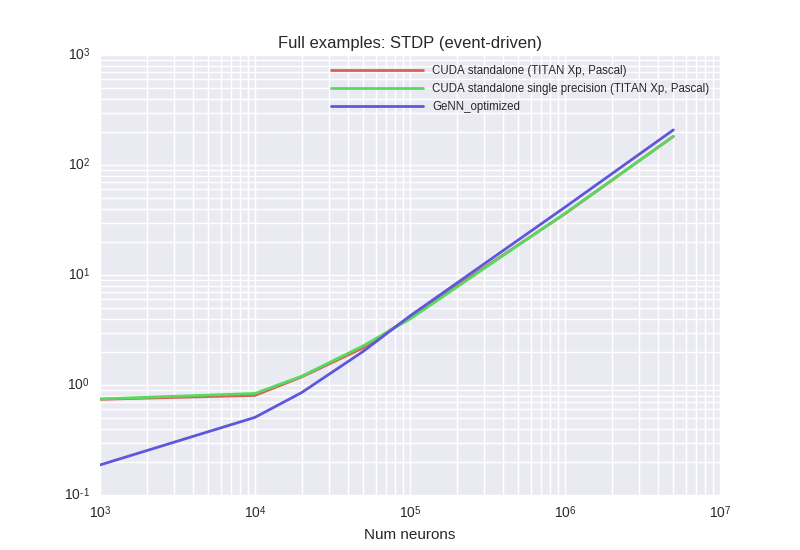
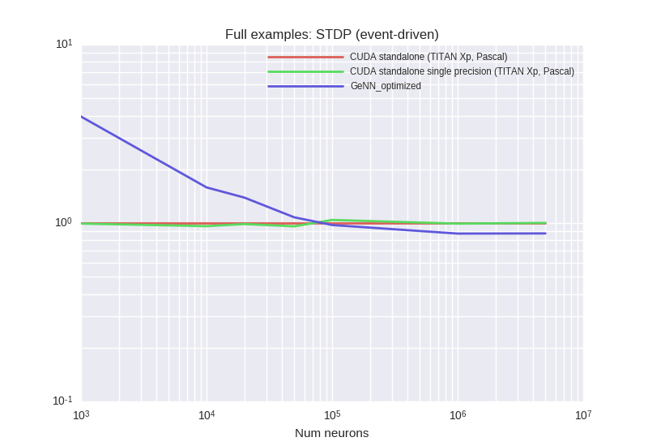

<details><summary>Examplary `nvprof` results for **CUDA-standalone--TITAN-Xp,-Pascal-**</summary><p>
Profile summary for `N = 1000`:

```
==28768== NVPROF is profiling process 28768, command: ./main
==28768== Profiling application: ./main
==28768== Profiling result:
            Type  Time(%)      Time     Calls       Avg       Min       Max  Name
 GPU activities:   28.40%  69.737ms      7764  8.9820us  5.7600us  26.177us  kernel_synapses_pre_codeobject(int, int, int, int, int, int*, int, double*, int, double*, int, double*, int, int*, double*, double, double*, int, int*, int, int*, int)
                   21.65%  53.153ms     10000  5.3150us  5.1520us  9.4400us  kernel_neurongroup_stateupdater_codeobject(int, int, double*, double*, double*)
                   15.71%  38.572ms     10000  3.8570us  3.6800us  9.7280us  kernel_synapses_post_codeobject(int, int, int, int, int, int*, int, double*, int, double*, int, double*, int, double, double*, int, int*, int*, int)
                    8.15%  20.004ms     10000  2.0000us  1.7920us  9.3440us  kernel_poissongroup_thresholder_codeobject(int, int, int*, double*, double*, double*)
                    6.18%  15.165ms     10000  1.5160us  1.4720us  9.5360us  kernel_neurongroup_thresholder_codeobject(int, int, int*, double*)
                    5.59%  13.731ms     10000  1.3730us  1.3120us  9.6010us  kernel_neurongroup_resetter_codeobject(int, int, double*, int*)
                    5.08%  12.470ms     10000  1.2460us  1.1200us  9.2160us  _GLOBAL__N__70_tmpxft_00006e1f_00000000_6_poissongroup_thresholder_codeobject_cpp1_ii_83740b5b::_reset_poissongroup_thresholder_codeobject(int*)
                    4.84%  11.884ms     10000  1.1880us  1.1520us  9.7930us  _GLOBAL__N__69_tmpxft_00006e15_00000000_6_neurongroup_thresholder_codeobject_cpp1_ii_018c9cf5::_reset_neurongroup_thresholder_codeobject(int*)
                    4.22%  10.349ms     10000  1.0340us     960ns  10.048us  [CUDA memcpy DtoH]
                    0.19%  466.80us         2  233.40us  232.10us  234.70us  void gen_sequenced<curandStateXORWOW, double, int, __operator_&__(double curand_uniform_double_noargs<curandStateXORWOW>(curandStateXORWOW*, int))>(curandStateXORWOW*, double*, unsigned long, unsigned long, int)
      API calls:   73.70%  1.05265s     77766  13.536us  9.9130us  12.199ms  cudaLaunch
                   14.58%  208.27ms     10000  20.826us  17.522us  612.05us  cudaMemcpy
                    8.37%  119.59ms    570818     209ns     144ns  870.82us  cudaSetupArgument
                    1.68%  24.057ms     80004     300ns     224ns  563.26us  cudaGetLastError
                    1.59%  22.770ms     77766     292ns     193ns  550.52us  cudaConfigureCall
                    0.04%  502.62us         1  502.62us  502.62us  502.62us  cudaMalloc
                    0.02%  276.08us         1  276.08us  276.08us  276.08us  cudaMemGetInfo
                    0.00%  46.139us        10  4.6130us  3.8590us  6.9610us  cudaFuncGetAttributes
                    0.00%  38.071us        41     928ns     772ns  2.2780us  cudaOccupancyMaxActiveBlocksPerMultiprocessorWithFlags
                    0.00%  20.929us         1  20.929us  20.929us  20.929us  cudaDeviceSynchronize
                    0.00%  9.1190us        16     569ns     451ns  1.0710us  cudaDeviceGetAttribute
                    0.00%  5.4610us         4  1.3650us  1.0630us  2.1150us  cudaGetDevice

```

</p></details>


<details><summary>Examplary `nvprof` results for **CUDA-standalone-single-precision--TITAN-Xp,-Pascal-**</summary><p>
Profile summary for `N = 1000`:

```
==29575== NVPROF is profiling process 29575, command: ./main
==29575== Profiling application: ./main
==29575== Profiling result:
            Type  Time(%)      Time     Calls       Avg       Min       Max  Name
 GPU activities:   27.15%  67.009ms      7750  8.6460us  5.6640us  25.505us  kernel_synapses_pre_codeobject(int, int, int, int, int, int*, int, float*, int, double*, int, float*, int, int*, float*, double, float*, int, int*, int, int*, int)
                   21.85%  53.927ms     10000  5.3920us  5.2480us  9.1840us  kernel_neurongroup_stateupdater_codeobject(int, int, float*, float*, double*)
                   15.65%  38.631ms     10000  3.8630us  3.6800us  9.2800us  kernel_synapses_post_codeobject(int, int, int, int, int, int*, int, float*, int, double*, int, float*, int, double, float*, int, int*, int*, int)
                    9.55%  23.584ms     10000  2.3580us  2.1440us  11.520us  kernel_poissongroup_thresholder_codeobject(int, int, int*, float*, double*, float*)
                    6.29%  15.524ms     10000  1.5520us  1.5040us  9.4090us  kernel_neurongroup_thresholder_codeobject(int, int, int*, float*)
                    5.56%  13.719ms     10000  1.3710us  1.2480us  8.9930us  kernel_neurongroup_resetter_codeobject(int, int, float*, int*)
                    5.07%  12.523ms     10000  1.2520us  1.1200us  9.1850us  _GLOBAL__N__70_tmpxft_00007156_00000000_6_poissongroup_thresholder_codeobject_cpp1_ii_7c241289::_reset_poissongroup_thresholder_codeobject(int*)
                    4.76%  11.762ms     10000  1.1760us  1.1520us  9.4400us  _GLOBAL__N__69_tmpxft_0000714f_00000000_6_neurongroup_thresholder_codeobject_cpp1_ii_ef82fdd9::_reset_neurongroup_thresholder_codeobject(int*)
                    4.06%  10.025ms     10000  1.0020us     960ns  9.9200us  [CUDA memcpy DtoH]
                    0.05%  133.64us         1  133.64us  133.64us  133.64us  void gen_sequenced<curandStateXORWOW, float, int, __operator_&__(float curand_uniform_noargs<curandStateXORWOW>(curandStateXORWOW*, int))>(curandStateXORWOW*, float*, unsigned long, unsigned long, int)
      API calls:   72.52%  933.77ms     77751  12.009us  9.4720us  11.395ms  cudaLaunch
                   14.51%  186.78ms     10000  18.678us  16.842us  558.04us  cudaMemcpy
                    9.47%  121.99ms    570505     213ns     143ns  1.1697ms  cudaSetupArgument
                    1.77%  22.737ms     77751     292ns     200ns  506.88us  cudaConfigureCall
                    1.67%  21.514ms     80002     268ns     187ns  937.72us  cudaGetLastError
                    0.04%  484.65us         1  484.65us  484.65us  484.65us  cudaMalloc
                    0.02%  272.61us         1  272.61us  272.61us  272.61us  cudaMemGetInfo
                    0.00%  45.600us        10  4.5600us  3.8690us  6.5500us  cudaFuncGetAttributes
                    0.00%  36.803us        41     897ns     729ns  2.2380us  cudaOccupancyMaxActiveBlocksPerMultiprocessorWithFlags
                    0.00%  10.682us         1  10.682us  10.682us  10.682us  cudaDeviceSynchronize
                    0.00%  9.5260us        16     595ns     463ns  1.1370us  cudaDeviceGetAttribute
                    0.00%  5.1330us         4  1.2830us  1.0650us  1.7340us  cudaGetDevice

```

</p></details>


<details><summary>Examplary `nvprof` results for **GeNNConfigurationOptimized**</summary><p>
Profile summary for `N = 1000`:

```
==30121== NVPROF is profiling process 30121, command: ./main test 1.0 1
==30121== Profiling application: ./main test 1.0 1
==30121== Profiling result:
            Type  Time(%)      Time     Calls       Avg       Min       Max  Name
 GPU activities:   55.86%  70.563ms     10000  7.0560us  1.5680us  27.425us  calcSynapses
                   25.97%  32.807ms     10000  3.2800us  3.0080us  9.4400us  calcNeurons
                   18.09%  22.850ms     10000  2.2850us  2.0160us  9.3770us  learnSynapsesPost
                    0.07%  83.426us        70  1.1910us     896ns  1.6970us  [CUDA memcpy HtoD]
                    0.02%  23.937us        19  1.2590us     960ns  1.9200us  [CUDA memcpy DtoH]
      API calls:   48.85%  395.55ms     30000  13.185us  10.082us  585.63us  cudaLaunch
                   47.85%  387.45ms        20  19.372ms  11.035us  383.98ms  cudaHostAlloc
                    1.68%  13.616ms     30000     453ns     314ns  534.02us  cudaConfigureCall
                    1.14%  9.2648ms     30000     308ns     191ns  554.61us  cudaSetupArgument
                    0.19%  1.5431ms        95  16.243us     364ns  45.380us  cudaMemcpy
                    0.18%  1.4906ms        20  74.528us  8.8250us  450.58us  cudaMalloc
                    0.05%  423.84us        94  4.5080us     213ns  181.78us  cuDeviceGetAttribute
                    0.03%  251.81us         1  251.81us  251.81us  251.81us  cuDeviceTotalMem
                    0.01%  51.702us         1  51.702us  51.702us  51.702us  cuDeviceGetName
                    0.00%  24.349us        20  1.2170us     759ns  5.9250us  cudaGetSymbolAddress
                    0.00%  16.599us         1  16.599us  16.599us  16.599us  cudaSetDevice
                    0.00%  5.3710us         3  1.7900us     302ns  4.5940us  cuDeviceGetCount
                    0.00%  3.4970us         1  3.4970us  3.4970us  3.4970us  cudaGetDeviceCount
                    0.00%  1.2900us         2     645ns     257ns  1.0330us  cuDeviceGet

```

</p></details>


***

### SparseHighRateSynapsesOnly
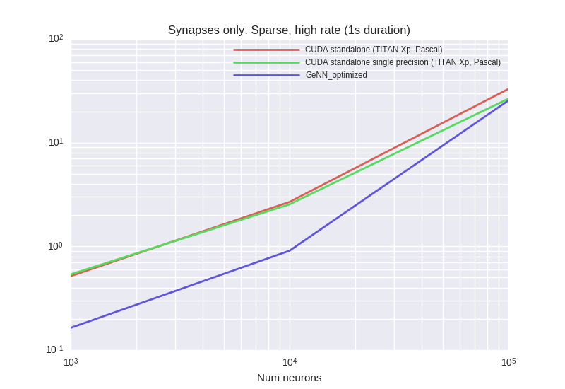


<details><summary>Examplary `nvprof` results for **CUDA-standalone--TITAN-Xp,-Pascal-**</summary><p>
Profile summary for `N = 1000`:

```
==19265== NVPROF is profiling process 19265, command: ./main
==19265== Profiling application: ./main
==19265== Profiling result:
            Type  Time(%)      Time     Calls       Avg       Min       Max  Name
 GPU activities:   90.90%  302.79ms     10000  30.278us  28.065us  35.490us  kernel_synapses_pre_codeobject(int, int, int, int, int, int*, int, int*, int, int*, int, double*, int*)
                    3.36%  11.204ms     10000  1.1200us     992ns  9.9850us  kernel_neurongroup_thresholder_codeobject(int, int, int*)
                    2.92%  9.7242ms     10000     972ns     896ns  9.9520us  [CUDA memcpy DtoH]
                    2.82%  9.3893ms     10000     938ns     800ns  9.4720us  _GLOBAL__N__69_tmpxft_0000493f_00000000_6_neurongroup_thresholder_codeobject_cpp1_ii_e0a5624b::_reset_neurongroup_thresholder_codeobject(int*)
      API calls:   63.11%  432.88ms     30000  14.429us  11.020us  12.762ms  cudaLaunch
                   28.46%  195.20ms     10000  19.520us  16.618us  1.2496ms  cudaMemcpy
                    5.62%  38.534ms    170000     226ns     145ns  569.51us  cudaSetupArgument
                    1.40%  9.5832ms     30000     319ns     214ns  14.542us  cudaConfigureCall
                    1.37%  9.4075ms     30000     313ns     206ns  1.0833ms  cudaGetLastError
                    0.04%  276.53us         1  276.53us  276.53us  276.53us  cudaMemGetInfo
                    0.00%  21.584us         1  21.584us  21.584us  21.584us  cudaDeviceSynchronize
                    0.00%  15.381us         3  5.1270us  4.1250us  6.0190us  cudaFuncGetAttributes
                    0.00%  11.063us         3  3.6870us  1.0130us  7.4900us  cudaOccupancyMaxActiveBlocksPerMultiprocessorWithFlags
                    0.00%  2.9250us         4     731ns     551ns  1.1480us  cudaDeviceGetAttribute
                    0.00%  1.3720us         1  1.3720us  1.3720us  1.3720us  cudaGetDevice

```

</p></details>


<details><summary>Examplary `nvprof` results for **CUDA-standalone-single-precision--TITAN-Xp,-Pascal-**</summary><p>
Profile summary for `N = 1000`:

```
==20002== NVPROF is profiling process 20002, command: ./main
==20002== Profiling application: ./main
==20002== Profiling result:
            Type  Time(%)      Time     Calls       Avg       Min       Max  Name
 GPU activities:   90.18%  285.40ms     10000  28.539us  26.401us  32.161us  kernel_synapses_pre_codeobject(int, int, int, int, int, int*, int, int*, int, int*, int, float*, int*)
                    3.67%  11.630ms     10000  1.1620us  1.0240us  9.4730us  kernel_neurongroup_thresholder_codeobject(int, int, int*)
                    3.08%  9.7457ms     10000     974ns     832ns  9.6640us  _GLOBAL__N__69_tmpxft_00004c34_00000000_6_neurongroup_thresholder_codeobject_cpp1_ii_e0a5624b::_reset_neurongroup_thresholder_codeobject(int*)
                    3.06%  9.6861ms     10000     968ns     896ns  9.9520us  [CUDA memcpy DtoH]
      API calls:   62.59%  411.11ms     30000  13.703us  10.273us  12.314ms  cudaLaunch
                   28.94%  190.11ms     10000  19.011us  16.107us  1.2271ms  cudaMemcpy
                    5.71%  37.525ms    170000     220ns     143ns  545.72us  cudaSetupArgument
                    1.37%  9.0124ms     30000     300ns     178ns  16.172us  cudaConfigureCall
                    1.33%  8.7500ms     30000     291ns     215ns  17.046us  cudaGetLastError
                    0.04%  270.39us         1  270.39us  270.39us  270.39us  cudaMemGetInfo
                    0.00%  15.075us         3  5.0250us  3.8930us  6.0230us  cudaFuncGetAttributes
                    0.00%  12.280us         1  12.280us  12.280us  12.280us  cudaDeviceSynchronize
                    0.00%  11.357us         3  3.7850us  1.0970us  7.6770us  cudaOccupancyMaxActiveBlocksPerMultiprocessorWithFlags
                    0.00%  2.9580us         4     739ns     494ns  1.2430us  cudaDeviceGetAttribute
                    0.00%  1.3690us         1  1.3690us  1.3690us  1.3690us  cudaGetDevice

```

</p></details>


<details><summary>Examplary `nvprof` results for **GeNNConfigurationOptimized**</summary><p>
Profile summary for `N = 1000`:

```
==20674== NVPROF is profiling process 20674, command: ./main test 1.0 1
==20674== Profiling application: ./main test 1.0 1
==20674== Profiling result:
            Type  Time(%)      Time     Calls       Avg       Min       Max  Name
 GPU activities:   84.23%  129.96ms     10000  12.995us  3.8400us  13.792us  calcSynapses
                   15.72%  24.252ms     10000  2.4250us  2.2080us  2.9760us  calcNeurons
                    0.04%  54.180us        44  1.2310us     897ns  2.4640us  [CUDA memcpy HtoD]
                    0.01%  18.177us        14  1.2980us     960ns  2.9120us  [CUDA memcpy DtoH]
      API calls:   58.93%  397.26ms        12  33.105ms  12.442us  394.01ms  cudaHostAlloc
                   38.37%  258.63ms     20000  12.931us  12.190us  580.27us  cudaLaunch
                    1.30%  8.7463ms     20000     437ns     356ns  556.36us  cudaConfigureCall
                    0.88%  5.9429ms     20000     297ns     227ns  566.86us  cudaSetupArgument
                    0.20%  1.3632ms        12  113.60us  8.1330us  429.66us  cudaMalloc
                    0.17%  1.1212ms        61  18.380us     810ns  61.721us  cudaMemcpy
                    0.09%  614.16us        94  6.5330us     273ns  285.80us  cuDeviceGetAttribute
                    0.05%  324.75us         1  324.75us  324.75us  324.75us  cuDeviceTotalMem
                    0.01%  65.423us         1  65.423us  65.423us  65.423us  cuDeviceGetName
                    0.00%  22.143us         1  22.143us  22.143us  22.143us  cudaSetDevice
                    0.00%  17.491us        12  1.4570us     711ns  5.7350us  cudaGetSymbolAddress
                    0.00%  6.3330us         3  2.1110us     429ns  5.2040us  cuDeviceGetCount
                    0.00%  3.9150us         1  3.9150us  3.9150us  3.9150us  cudaGetDeviceCount
                    0.00%  1.6710us         2     835ns     286ns  1.3850us  cuDeviceGet

```

</p></details>


***

### SparseLowRateSynapsesOnly
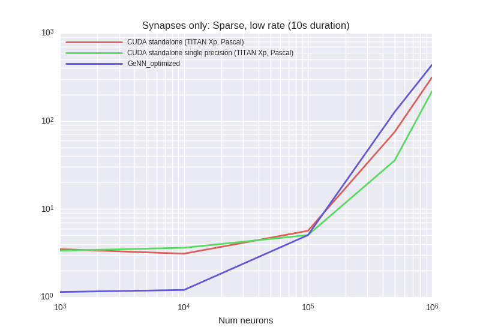
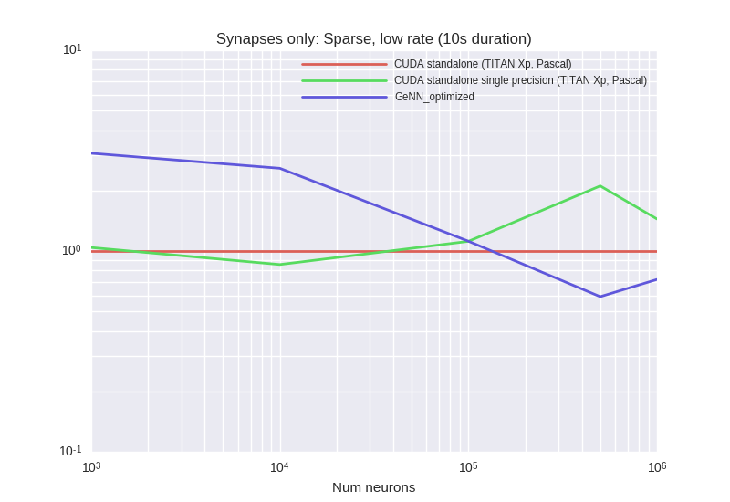

<details><summary>Examplary `nvprof` results for **CUDA-standalone--TITAN-Xp,-Pascal-**</summary><p>
Profile summary for `N = 1000`:

```
==7531== NVPROF is profiling process 7531, command: ./main
==7531== Profiling application: ./main
==7531== Profiling result:
            Type  Time(%)      Time     Calls       Avg       Min       Max  Name
 GPU activities:   61.59%  550.45ms    100000  5.5040us  5.3760us  9.7600us  kernel_synapses_pre_codeobject(int, int, int, int, int, int*, int, int*, int, int*, int, double*, int*)
                   14.57%  130.24ms    100000  1.3020us  1.2480us  10.177us  kernel_neurongroup_thresholder_codeobject(int, int, int*)
                   12.11%  108.23ms    100000  1.0820us  1.0240us  10.272us  [CUDA memcpy DtoH]
                   11.73%  104.85ms    100000  1.0480us  1.0240us  10.208us  _GLOBAL__N__69_tmpxft_00001b4b_00000000_6_neurongroup_thresholder_codeobject_cpp1_ii_e0a5624b::_reset_neurongroup_thresholder_codeobject(int*)
      API calls:   57.52%  4.46769s    300000  14.892us  10.559us  122.91ms  cudaLaunch
                   34.51%  2.68078s    100000  26.807us  17.005us  557.88ms  cudaMemcpy
                    5.33%  414.34ms   1700000     243ns     153ns  1.6919ms  cudaSetupArgument
                    1.35%  104.52ms    300000     348ns     216ns  805.64us  cudaConfigureCall
                    1.29%  99.898ms    300000     332ns     229ns  902.67us  cudaGetLastError
                    0.00%  273.35us         1  273.35us  273.35us  273.35us  cudaMemGetInfo
                    0.00%  24.241us         1  24.241us  24.241us  24.241us  cudaDeviceSynchronize
                    0.00%  15.079us         3  5.0260us  3.9620us  6.1020us  cudaFuncGetAttributes
                    0.00%  12.258us         3  4.0860us  1.0380us  8.6270us  cudaOccupancyMaxActiveBlocksPerMultiprocessorWithFlags
                    0.00%  2.8380us         4     709ns     487ns  1.2120us  cudaDeviceGetAttribute
                    0.00%  1.3440us         1  1.3440us  1.3440us  1.3440us  cudaGetDevice

```

</p></details>


<details><summary>Examplary `nvprof` results for **CUDA-standalone-single-precision--TITAN-Xp,-Pascal-**</summary><p>
Profile summary for `N = 1000`:

```
==8921== NVPROF is profiling process 8921, command: ./main
==8921== Profiling application: ./main
==8921== Profiling result:
            Type  Time(%)      Time     Calls       Avg       Min       Max  Name
 GPU activities:   63.00%  571.24ms    100000  5.7120us  5.5040us  9.8560us  kernel_synapses_pre_codeobject(int, int, int, int, int, int*, int, int*, int, int*, int, float*, int*)
                   14.30%  129.62ms    100000  1.2960us  1.2480us  9.6960us  kernel_neurongroup_thresholder_codeobject(int, int, int*)
                   11.51%  104.33ms    100000  1.0430us     992ns  10.080us  _GLOBAL__N__69_tmpxft_000020af_00000000_6_neurongroup_thresholder_codeobject_cpp1_ii_e0a5624b::_reset_neurongroup_thresholder_codeobject(int*)
                   11.19%  101.50ms    100000  1.0150us     960ns  10.081us  [CUDA memcpy DtoH]
      API calls:   56.83%  4.76262s    300000  15.875us  10.486us  173.74ms  cudaLaunch
                   35.03%  2.93550s    100000  29.354us  17.182us  758.62ms  cudaMemcpy
                    5.40%  452.37ms   1700000     266ns     163ns  1.6880ms  cudaSetupArgument
                    1.43%  120.18ms    300000     400ns     221ns  842.77us  cudaConfigureCall
                    1.31%  109.80ms    300000     365ns     225ns  1.1144ms  cudaGetLastError
                    0.00%  271.63us         1  271.63us  271.63us  271.63us  cudaMemGetInfo
                    0.00%  16.673us         1  16.673us  16.673us  16.673us  cudaDeviceSynchronize
                    0.00%  15.507us         3  5.1690us  4.0460us  6.0600us  cudaFuncGetAttributes
                    0.00%  11.234us         3  3.7440us  1.0400us  7.7350us  cudaOccupancyMaxActiveBlocksPerMultiprocessorWithFlags
                    0.00%  2.5300us         4     632ns     495ns     953ns  cudaDeviceGetAttribute
                    0.00%  1.4530us         1  1.4530us  1.4530us  1.4530us  cudaGetDevice

```

</p></details>


<details><summary>Examplary `nvprof` results for **GeNNConfigurationOptimized**</summary><p>
Profile summary for `N = 1000`:

```
==10288== NVPROF is profiling process 10288, command: ./main test 10.0 1
==10288== Profiling application: ./main test 10.0 1
==10288== Profiling result:
            Type  Time(%)      Time     Calls       Avg       Min       Max  Name
 GPU activities:   60.02%  370.49ms    100000  3.7040us  3.6160us  10.081us  calcSynapses
                   39.97%  246.71ms    100000  2.4670us  2.4320us  10.304us  calcNeurons
                    0.01%  50.403us        44  1.1450us     928ns  1.7600us  [CUDA memcpy HtoD]
                    0.00%  17.600us        14  1.2570us  1.0560us  2.1440us  [CUDA memcpy DtoH]
      API calls:   81.34%  2.28912s    200000  11.445us  9.9570us  1.2633ms  cudaLaunch
                   13.65%  384.25ms        12  32.021ms  13.551us  380.79ms  cudaHostAlloc
                    2.85%  80.241ms    200000     401ns     265ns  610.38us  cudaConfigureCall
                    1.88%  52.898ms    200000     264ns     181ns  598.62us  cudaSetupArgument
                    0.12%  3.4843ms        94  37.066us     443ns  1.7688ms  cuDeviceGetAttribute
                    0.06%  1.6709ms        12  139.24us  9.2760us  682.11us  cudaMalloc
                    0.05%  1.2922ms        61  21.183us     625ns  245.48us  cudaMemcpy
                    0.03%  708.74us         1  708.74us  708.74us  708.74us  cuDeviceTotalMem
                    0.02%  533.60us         1  533.60us  533.60us  533.60us  cuDeviceGetName
                    0.00%  30.966us         1  30.966us  30.966us  30.966us  cudaSetDevice
                    0.00%  19.446us        12  1.6200us     815ns  6.3640us  cudaGetSymbolAddress
                    0.00%  7.7360us         3  2.5780us     613ns  6.2160us  cuDeviceGetCount
                    0.00%  5.0390us         1  5.0390us  5.0390us  5.0390us  cudaGetDeviceCount
                    0.00%  1.9760us         2     988ns     486ns  1.4900us  cuDeviceGet

```

</p></details>


***

### SparseLowRateSynapsesOnlyHeterogeneousDelays
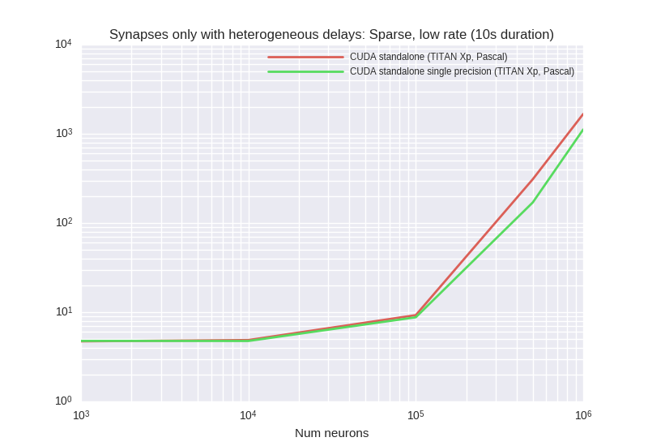
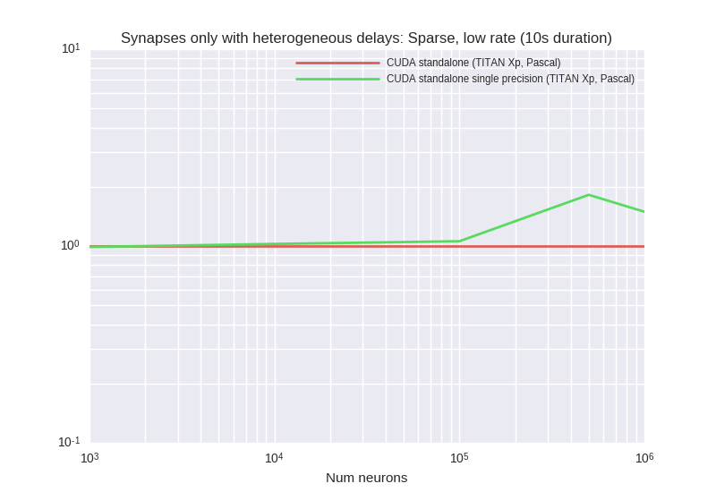

<details><summary>Examplary `nvprof` results for **CUDA-standalone--TITAN-Xp,-Pascal-**</summary><p>
Profile summary for `N = 1000`:

```
==7541== NVPROF is profiling process 7541, command: ./main
==7541== Profiling application: ./main
==7541== Profiling result:
            Type  Time(%)      Time     Calls       Avg       Min       Max  Name
 GPU activities:   33.04%  566.06ms    100000  5.6600us  5.4080us  9.7920us  kernel_synapses_pre_codeobject(int, int, int, int, int, int*, int, int*, int, int*, int, double*, int*)
                   30.27%  518.58ms    100000  5.1850us  4.8320us  328.07us  _run_synapses_pre_push_spikes_push_kernel(int, int, int, int*)
                   15.36%  263.16ms    100000  2.6310us  2.3680us  9.8240us  _run_synapses_pre_push_spikes_advance_kernel(void)
                    8.19%  140.32ms    100000  1.4030us  1.2480us  9.9210us  kernel_neurongroup_thresholder_codeobject(int, int, int*)
                    6.85%  117.29ms    100000  1.1720us  1.0240us  9.4720us  _GLOBAL__N__69_tmpxft_00001bb1_00000000_6_neurongroup_thresholder_codeobject_cpp1_ii_e0a5624b::_reset_neurongroup_thresholder_codeobject(int*)
                    6.28%  107.62ms    100000  1.0760us  1.0240us  10.177us  [CUDA memcpy DtoH]
      API calls:   71.27%  7.49968s    500000  14.999us  9.7220us  433.88ms  cudaLaunch
                   21.63%  2.27630s    100000  22.762us  16.610us  77.266ms  cudaMemcpy
                    4.10%  430.98ms   2100000     205ns     143ns  811.51us  cudaSetupArgument
                    1.56%  164.01ms    500000     328ns     240ns  581.57us  cudaGetLastError
                    1.44%  151.00ms    500000     302ns     186ns  651.56us  cudaConfigureCall
                    0.00%  272.27us         1  272.27us  272.27us  272.27us  cudaMemGetInfo
                    0.00%  19.770us         4  4.9420us  4.0170us  6.0130us  cudaFuncGetAttributes
                    0.00%  11.888us         1  11.888us  11.888us  11.888us  cudaDeviceSynchronize
                    0.00%  7.4700us         4  1.8670us     850ns  2.4090us  cudaOccupancyMaxActiveBlocksPerMultiprocessorWithFlags
                    0.00%  2.4510us         4     612ns     487ns     943ns  cudaDeviceGetAttribute
                    0.00%  1.3340us         1  1.3340us  1.3340us  1.3340us  cudaGetDevice

```

</p></details>


<details><summary>Examplary `nvprof` results for **CUDA-standalone-single-precision--TITAN-Xp,-Pascal-**</summary><p>
Profile summary for `N = 1000`:

```
==8603== NVPROF is profiling process 8603, command: ./main
==8603== Profiling application: ./main
==8603== Profiling result:
            Type  Time(%)      Time     Calls       Avg       Min       Max  Name
 GPU activities:   31.20%  512.29ms    100000  5.1220us  4.9280us  9.9840us  kernel_synapses_pre_codeobject(int, int, int, int, int, int*, int, int*, int, int*, int, float*, int*)
                   31.11%  510.83ms    100000  5.1080us  4.7680us  312.75us  _run_synapses_pre_push_spikes_push_kernel(int, int, int, int*)
                   15.28%  250.88ms    100000  2.5080us  2.4320us  10.144us  _run_synapses_pre_push_spikes_advance_kernel(void)
                    8.92%  146.52ms    100000  1.4650us  1.2160us  9.8560us  kernel_neurongroup_thresholder_codeobject(int, int, int*)
                    7.19%  118.11ms    100000  1.1810us  1.0240us  9.7610us  _GLOBAL__N__69_tmpxft_00001fd9_00000000_6_neurongroup_thresholder_codeobject_cpp1_ii_e0a5624b::_reset_neurongroup_thresholder_codeobject(int*)
                    6.30%  103.52ms    100000  1.0350us     960ns  10.112us  [CUDA memcpy DtoH]
      API calls:   68.84%  6.05892s    500000  12.117us  9.9050us  12.699ms  cudaLaunch
                   23.08%  2.03159s    100000  20.315us  17.072us  61.960ms  cudaMemcpy
                    4.85%  426.53ms   2100000     203ns     161ns  626.56us  cudaSetupArgument
                    1.69%  148.59ms    500000     297ns     245ns  499.56us  cudaGetLastError
                    1.53%  134.98ms    500000     269ns     188ns  1.1416ms  cudaConfigureCall
                    0.00%  275.74us         1  275.74us  275.74us  275.74us  cudaMemGetInfo
                    0.00%  19.729us         4  4.9320us  3.9690us  6.3070us  cudaFuncGetAttributes
                    0.00%  11.005us         1  11.005us  11.005us  11.005us  cudaDeviceSynchronize
                    0.00%  7.2910us         4  1.8220us     901ns  2.2980us  cudaOccupancyMaxActiveBlocksPerMultiprocessorWithFlags
                    0.00%  2.4430us         4     610ns     473ns  1.0030us  cudaDeviceGetAttribute
                    0.00%  1.3320us         1  1.3320us  1.3320us  1.3320us  cudaGetDevice

```

</p></details>


***

### SparseMediumRateSynapsesOnly
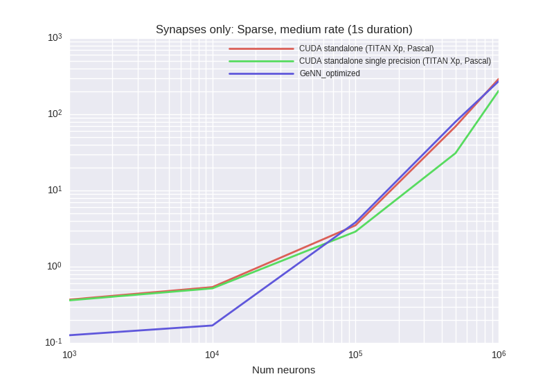
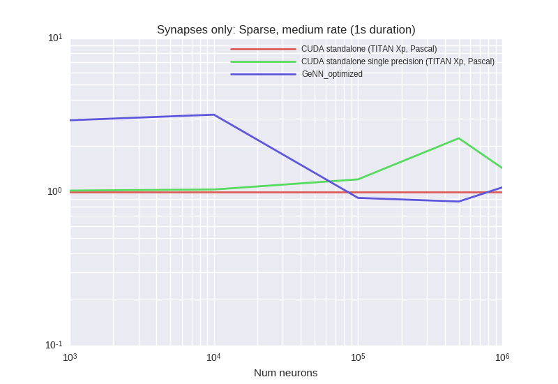

<details><summary>Examplary `nvprof` results for **CUDA-standalone--TITAN-Xp,-Pascal-**</summary><p>
Profile summary for `N = 1000`:

```
==28667== NVPROF is profiling process 28667, command: ./main
==28667== Profiling application: ./main
==28667== Profiling result:
            Type  Time(%)      Time     Calls       Avg       Min       Max  Name
 GPU activities:   61.73%  54.643ms     10000  5.4640us  5.3440us  9.5040us  kernel_synapses_pre_codeobject(int, int, int, int, int, int*, int, int*, int, int*, int, double*, int*)
                   14.68%  12.998ms     10000  1.2990us  1.2480us  9.1840us  kernel_neurongroup_thresholder_codeobject(int, int, int*)
                   11.95%  10.581ms     10000  1.0580us     992ns  9.7610us  _GLOBAL__N__69_tmpxft_00006e79_00000000_6_neurongroup_thresholder_codeobject_cpp1_ii_e0a5624b::_reset_neurongroup_thresholder_codeobject(int*)
                   11.63%  10.293ms     10000  1.0290us     960ns  9.8880us  [CUDA memcpy DtoH]
      API calls:   63.14%  468.38ms     30000  15.612us  13.019us  12.430ms  cudaLaunch
                   28.16%  208.93ms     10000  20.892us  19.232us  1.2471ms  cudaMemcpy
                    5.90%  43.752ms    170000     257ns     185ns  739.69us  cudaSetupArgument
                    1.55%  11.533ms     30000     384ns     285ns  19.107us  cudaConfigureCall
                    1.20%  8.8967ms     30000     296ns     245ns  18.255us  cudaGetLastError
                    0.04%  271.37us         1  271.37us  271.37us  271.37us  cudaMemGetInfo
                    0.00%  24.016us         1  24.016us  24.016us  24.016us  cudaDeviceSynchronize
                    0.00%  15.195us         3  5.0650us  3.9660us  5.8150us  cudaFuncGetAttributes
                    0.00%  10.874us         3  3.6240us  1.0380us  7.5120us  cudaOccupancyMaxActiveBlocksPerMultiprocessorWithFlags
                    0.00%  2.9250us         4     731ns     493ns  1.2210us  cudaDeviceGetAttribute
                    0.00%  1.3990us         1  1.3990us  1.3990us  1.3990us  cudaGetDevice

```

</p></details>


<details><summary>Examplary `nvprof` results for **CUDA-standalone-single-precision--TITAN-Xp,-Pascal-**</summary><p>
Profile summary for `N = 1000`:

```
==29199== NVPROF is profiling process 29199, command: ./main
==29199== Profiling application: ./main
==29199== Profiling result:
            Type  Time(%)      Time     Calls       Avg       Min       Max  Name
 GPU activities:   62.81%  56.936ms     10000  5.6930us  5.5040us  8.8650us  kernel_synapses_pre_codeobject(int, int, int, int, int, int*, int, int*, int, int*, int, float*, int*)
                   14.21%  12.878ms     10000  1.2870us  1.2480us  8.9920us  kernel_neurongroup_thresholder_codeobject(int, int, int*)
                   11.53%  10.448ms     10000  1.0440us     960ns  9.4080us  [CUDA memcpy DtoH]
                   11.46%  10.384ms     10000  1.0380us     992ns  9.2480us  _GLOBAL__N__69_tmpxft_0000708a_00000000_6_neurongroup_thresholder_codeobject_cpp1_ii_e0a5624b::_reset_neurongroup_thresholder_codeobject(int*)
      API calls:   62.94%  477.68ms     30000  15.922us  12.264us  17.611ms  cudaLaunch
                   28.84%  218.85ms     10000  21.885us  18.878us  1.6416ms  cudaMemcpy
                    5.47%  41.490ms    170000     244ns     177ns  586.00us  cudaSetupArgument
                    1.47%  11.181ms     30000     372ns     267ns  21.735us  cudaConfigureCall
                    1.24%  9.4256ms     30000     314ns     255ns  19.347us  cudaGetLastError
                    0.04%  269.82us         1  269.82us  269.82us  269.82us  cudaMemGetInfo
                    0.00%  27.139us         1  27.139us  27.139us  27.139us  cudaDeviceSynchronize
                    0.00%  16.931us         3  5.6430us  3.9790us  6.9890us  cudaFuncGetAttributes
                    0.00%  11.449us         3  3.8160us  1.0240us  6.6630us  cudaOccupancyMaxActiveBlocksPerMultiprocessorWithFlags
                    0.00%  3.0200us         4     755ns     556ns  1.2140us  cudaDeviceGetAttribute
                    0.00%  1.3740us         1  1.3740us  1.3740us  1.3740us  cudaGetDevice

```

</p></details>


<details><summary>Examplary `nvprof` results for **GeNNConfigurationOptimized**</summary><p>
Profile summary for `N = 1000`:

```
==29670== NVPROF is profiling process 29670, command: ./main test 1.0 1
==29670== Profiling application: ./main test 1.0 1
==29670== Profiling result:
            Type  Time(%)      Time     Calls       Avg       Min       Max  Name
 GPU activities:   60.04%  37.250ms     10000  3.7240us  3.6160us  9.5680us  calcSynapses
                   39.85%  24.723ms     10000  2.4720us  2.4320us  9.4080us  calcNeurons
                    0.08%  49.027us        44  1.1140us     864ns  1.6970us  [CUDA memcpy HtoD]
                    0.03%  16.576us        14  1.1840us     992ns  1.9840us  [CUDA memcpy DtoH]
      API calls:   53.51%  332.46ms        12  27.705ms  13.480us  328.97ms  cudaHostAlloc
                   43.46%  270.02ms     20000  13.501us  12.050us  986.68us  cudaLaunch
                    1.47%  9.1213ms     20000     456ns     337ns  583.95us  cudaConfigureCall
                    0.99%  6.1572ms     20000     307ns     228ns  582.10us  cudaSetupArgument
                    0.24%  1.4744ms        12  122.87us  9.0980us  465.28us  cudaMalloc
                    0.19%  1.1665ms        61  19.123us     809ns  50.209us  cudaMemcpy
                    0.08%  466.15us        94  4.9590us     217ns  200.04us  cuDeviceGetAttribute
                    0.04%  252.70us         1  252.70us  252.70us  252.70us  cuDeviceTotalMem
                    0.01%  54.474us         1  54.474us  54.474us  54.474us  cuDeviceGetName
                    0.01%  40.161us         1  40.161us  40.161us  40.161us  cudaSetDevice
                    0.00%  18.961us        12  1.5800us     793ns  5.8040us  cudaGetSymbolAddress
                    0.00%  5.4360us         3  1.8120us     301ns  4.6830us  cuDeviceGetCount
                    0.00%  3.6540us         1  3.6540us  3.6540us  3.6540us  cudaGetDeviceCount
                    0.00%  1.3460us         2     673ns     240ns  1.1060us  cuDeviceGet

```

</p></details>


***

### VerySparseMediumRateSynapsesOnly

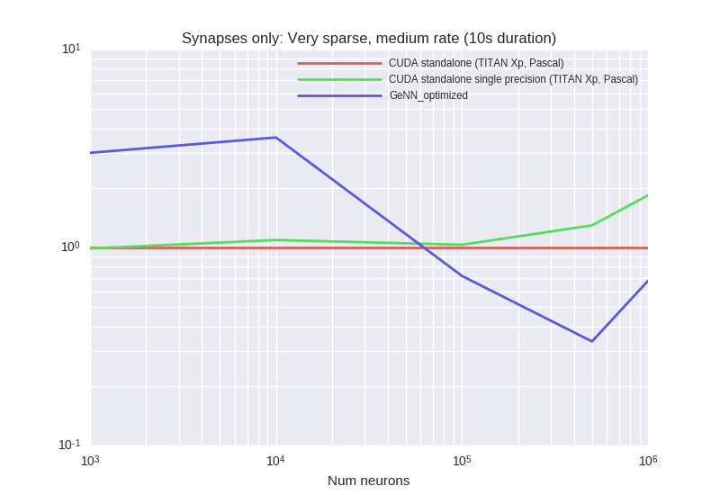

<details><summary>Examplary `nvprof` results for **CUDA-standalone--TITAN-Xp,-Pascal-**</summary><p>
Profile summary for `N = 1000`:

```
==2371== NVPROF is profiling process 2371, command: ./main
==2371== Profiling application: ./main
==2371== Profiling result:
            Type  Time(%)      Time     Calls       Avg       Min       Max  Name
 GPU activities:   61.60%  550.42ms    100000  5.5040us  5.3440us  12.064us  kernel_synapses_pre_codeobject(int, int, int, int, int, int*, int, int*, int, int*, int, double*, int*)
                   14.59%  130.41ms    100000  1.3040us  1.2480us  10.017us  kernel_neurongroup_thresholder_codeobject(int, int, int*)
                   12.07%  107.88ms    100000  1.0780us  1.0240us  10.144us  [CUDA memcpy DtoH]
                   11.74%  104.88ms    100000  1.0480us     992ns  10.945us  _GLOBAL__N__69_tmpxft_00000781_00000000_6_neurongroup_thresholder_codeobject_cpp1_ii_e0a5624b::_reset_neurongroup_thresholder_codeobject(int*)
      API calls:   60.48%  4.14218s    300000  13.807us  10.292us  14.555ms  cudaLaunch
                   30.93%  2.11868s    100000  21.186us  16.721us  63.728ms  cudaMemcpy
                    5.73%  392.78ms   1700000     231ns     153ns  1.5242ms  cudaSetupArgument
                    1.49%  102.22ms    300000     340ns     216ns  29.029us  cudaConfigureCall
                    1.36%  92.946ms    300000     309ns     229ns  579.72us  cudaGetLastError
                    0.00%  277.69us         1  277.69us  277.69us  277.69us  cudaMemGetInfo
                    0.00%  15.457us         3  5.1520us  3.9120us  5.9990us  cudaFuncGetAttributes
                    0.00%  13.218us         1  13.218us  13.218us  13.218us  cudaDeviceSynchronize
                    0.00%  11.441us         3  3.8130us  1.0000us  7.8690us  cudaOccupancyMaxActiveBlocksPerMultiprocessorWithFlags
                    0.00%  3.1900us         4     797ns     531ns  1.4260us  cudaDeviceGetAttribute
                    0.00%  1.3260us         1  1.3260us  1.3260us  1.3260us  cudaGetDevice

```

</p></details>


<details><summary>Examplary `nvprof` results for **CUDA-standalone-single-precision--TITAN-Xp,-Pascal-**</summary><p>
Profile summary for `N = 1000`:

```
==3253== NVPROF is profiling process 3253, command: ./main
==3253== Profiling application: ./main
==3253== Profiling result:
            Type  Time(%)      Time     Calls       Avg       Min       Max  Name
 GPU activities:   58.23%  504.63ms    100000  5.0460us  4.8960us  9.9200us  kernel_synapses_pre_codeobject(int, int, int, int, int, int*, int, int*, int, int*, int, float*, int*)
                   17.24%  149.37ms    100000  1.4930us  1.4080us  9.8240us  kernel_neurongroup_thresholder_codeobject(int, int, int*)
                   12.47%  108.02ms    100000  1.0800us  1.0240us  10.112us  [CUDA memcpy DtoH]
                   12.06%  104.53ms    100000  1.0450us     992ns  9.7920us  _GLOBAL__N__69_tmpxft_00000b0b_00000000_6_neurongroup_thresholder_codeobject_cpp1_ii_e0a5624b::_reset_neurongroup_thresholder_codeobject(int*)
      API calls:   55.92%  4.31266s    300000  14.375us  10.088us  188.04ms  cudaLaunch
                   36.51%  2.81582s    100000  28.158us  16.563us  809.14ms  cudaMemcpy
                    4.98%  383.76ms   1700000     225ns     144ns  1.4340ms  cudaSetupArgument
                    1.36%  105.00ms    300000     349ns     194ns  961.32us  cudaConfigureCall
                    1.23%  94.679ms    300000     315ns     222ns  588.77us  cudaGetLastError
                    0.00%  314.93us         1  314.93us  314.93us  314.93us  cudaMemGetInfo
                    0.00%  15.840us         3  5.2800us  3.9210us  6.4370us  cudaFuncGetAttributes
                    0.00%  12.813us         3  4.2710us     914ns  7.9030us  cudaOccupancyMaxActiveBlocksPerMultiprocessorWithFlags
                    0.00%  11.121us         1  11.121us  11.121us  11.121us  cudaDeviceSynchronize
                    0.00%  2.9460us         4     736ns     555ns  1.1510us  cudaDeviceGetAttribute
                    0.00%  1.6710us         1  1.6710us  1.6710us  1.6710us  cudaGetDevice

```

</p></details>


<details><summary>Examplary `nvprof` results for **GeNNConfigurationOptimized**</summary><p>
Profile summary for `N = 1000`:

```
==3975== NVPROF is profiling process 3975, command: ./main test 10.0 1
==3975== Profiling application: ./main test 10.0 1
==3975== Profiling result:
            Type  Time(%)      Time     Calls       Avg       Min       Max  Name
 GPU activities:   60.69%  380.98ms    100000  3.8090us  3.7440us  9.4720us  calcSynapses
                   39.30%  246.72ms    100000  2.4670us  2.4320us  9.5690us  calcNeurons
                    0.01%  46.017us        44  1.0450us     832ns  1.6960us  [CUDA memcpy HtoD]
                    0.00%  16.225us        14  1.1580us     960ns  1.9520us  [CUDA memcpy DtoH]
      API calls:   80.54%  2.20702s    200000  11.035us  9.4390us  1.4956ms  cudaLaunch
                   14.26%  390.88ms        12  32.573ms  16.294us  386.90ms  cudaHostAlloc
                    2.97%  81.338ms    200000     406ns     284ns  644.04us  cudaConfigureCall
                    2.08%  56.889ms    200000     284ns     193ns  626.03us  cudaSetupArgument
                    0.06%  1.6709ms        12  139.24us  9.3650us  734.03us  cudaMalloc
                    0.04%  1.2128ms        61  19.881us     743ns  201.89us  cudaMemcpy
                    0.03%  717.29us        94  7.6300us     453ns  302.41us  cuDeviceGetAttribute
                    0.02%  474.84us         1  474.84us  474.84us  474.84us  cuDeviceTotalMem
                    0.00%  88.738us         1  88.738us  88.738us  88.738us  cuDeviceGetName
                    0.00%  31.183us         1  31.183us  31.183us  31.183us  cudaSetDevice
                    0.00%  23.751us        12  1.9790us     723ns  9.6050us  cudaGetSymbolAddress
                    0.00%  8.4090us         3  2.8030us     633ns  6.8820us  cuDeviceGetCount
                    0.00%  4.9830us         1  4.9830us  4.9830us  4.9830us  cudaGetDeviceCount
                    0.00%  2.3040us         2  1.1520us     510ns  1.7940us  cuDeviceGet

```

</p></details>


***

### Vogels
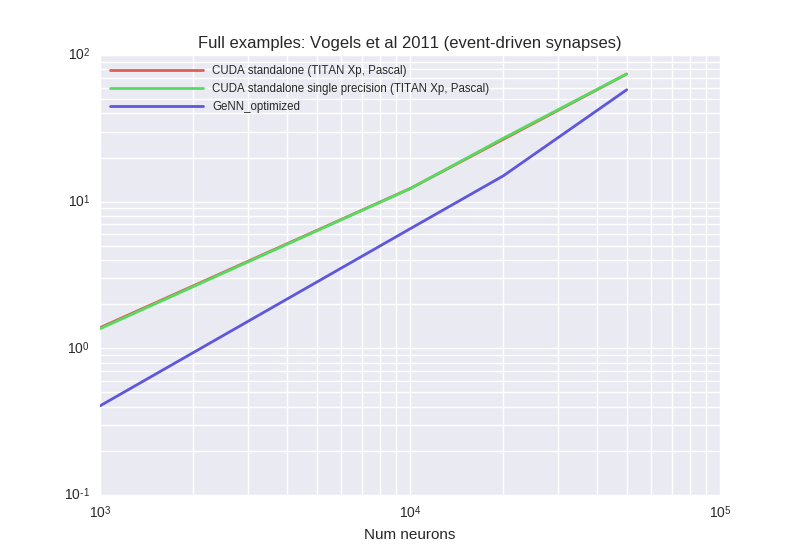


<details><summary>Examplary `nvprof` results for **CUDA-standalone--TITAN-Xp,-Pascal-**</summary><p>
Profile summary for `N = 1000`:

```
==23069== NVPROF is profiling process 23069, command: ./main
==23069== Profiling application: ./main
==23069== Profiling result:
            Type  Time(%)      Time     Calls       Avg       Min       Max  Name
 GPU activities:   23.66%  210.04ms      9752  21.538us  3.5840us  2.9744ms  kernel_synapses_pre_codeobject(int, int, int, int, int, int*, int, double*, int*, int, int*, int, int*)
                   22.74%  201.86ms      9752  20.699us  3.3280us  3.0302ms  kernel_synapses_1_pre_codeobject(int, int, int, int, int, int*, int, double*, int*, int, int*, int, int*)
                   22.25%  197.53ms      9752  20.255us  3.4880us  2.8284ms  kernel_synapses_2_pre_codeobject(int, int, int, int, int, int*, int, double*, int, double*, int, double*, int, int*, int, int*, int, double, double*, int, double*, int*)
                   15.31%  135.94ms     10000  13.594us  3.1680us  1.0005ms  kernel_synapses_2_post_codeobject(int, int, int, int, int, int*, int, double*, int, double*, int, double*, int, int*, int, double, double*, int, int*)
                    7.89%  70.004ms     10000  7.0000us  5.7600us  9.0240us  kernel_neurongroup_stateupdater_codeobject(int, int, double*, char*, double*, double, double*, double*, double*)
                    3.26%  28.982ms     30000     966ns     864ns  9.9530us  [CUDA memcpy DtoH]
                    2.18%  19.381ms     10000  1.9380us  1.2800us  9.3440us  kernel_neurongroup_thresholder_codeobject(int, int, int*, double, double*, double*, char*)
                    1.46%  12.973ms     10000  1.2970us  1.0560us  9.0890us  kernel_neurongroup_resetter_codeobject(int, int, double*, int*, char*)
                    1.25%  11.084ms     10000  1.1080us     896ns  9.3760us  _GLOBAL__N__69_tmpxft_00005703_00000000_6_neurongroup_thresholder_codeobject_cpp1_ii_0e9058a7::_reset_neurongroup_thresholder_codeobject(int*)
      API calls:   50.97%  1.11242s     79256  14.035us  9.9060us  12.483ms  cudaLaunch
                   38.35%  837.14ms     30000  27.904us  13.918us  3.8570ms  cudaMemcpy
                    8.12%  177.24ms    878096     201ns     143ns  1.1297ms  cudaSetupArgument
                    1.40%  30.641ms     79256     386ns     184ns  620.70us  cudaConfigureCall
                    1.13%  24.739ms     80000     309ns     200ns  1.1959ms  cudaGetLastError
                    0.01%  312.25us         1  312.25us  312.25us  312.25us  cudaMemGetInfo
                    0.00%  48.810us        10  4.8810us  3.8710us  6.7950us  cudaFuncGetAttributes
                    0.00%  46.572us        41  1.1350us     742ns  7.7870us  cudaOccupancyMaxActiveBlocksPerMultiprocessorWithFlags
                    0.00%  14.857us         1  14.857us  14.857us  14.857us  cudaDeviceSynchronize
                    0.00%  8.7460us        12     728ns     471ns  1.8410us  cudaDeviceGetAttribute
                    0.00%  5.4690us         3  1.8230us  1.1200us  2.5440us  cudaGetDevice

```

</p></details>


<details><summary>Examplary `nvprof` results for **CUDA-standalone-single-precision--TITAN-Xp,-Pascal-**</summary><p>
Profile summary for `N = 1000`:

```
==24137== NVPROF is profiling process 24137, command: ./main
==24137== Profiling application: ./main
==24137== Profiling result:
            Type  Time(%)      Time     Calls       Avg       Min       Max  Name
 GPU activities:   23.77%  213.67ms      9741  21.934us  4.0640us  2.8746ms  kernel_synapses_pre_codeobject(int, int, int, int, int, int*, int, float*, int*, int, int*, int, int*)
                   22.68%  203.88ms      9741  20.930us  3.5200us  2.8269ms  kernel_synapses_1_pre_codeobject(int, int, int, int, int, int*, int, float*, int*, int, int*, int, int*)
                   22.57%  202.86ms      9741  20.825us  3.6800us  2.8354ms  kernel_synapses_2_pre_codeobject(int, int, int, int, int, int*, int, float*, int, double*, int, float*, int, int*, int, int*, int, double, float*, int, float*, int*)
                   13.13%  118.04ms     10000  11.803us  2.9760us  907.42us  kernel_synapses_2_post_codeobject(int, int, int, int, int, int*, int, float*, int, double*, int, float*, int, int*, int, double, float*, int, int*)
                    9.23%  82.981ms     10000  8.2980us  6.4320us  9.0240us  kernel_neurongroup_stateupdater_codeobject(int, int, float*, char*, float*, double, float*, double*, double*)
                    3.52%  31.598ms     30000  1.0530us     960ns  9.9530us  [CUDA memcpy DtoH]
                    2.32%  20.885ms     10000  2.0880us  1.3120us  9.1530us  kernel_neurongroup_thresholder_codeobject(int, int, int*, double, float*, double*, char*)
                    1.50%  13.440ms     10000  1.3440us  1.1520us  9.4090us  kernel_neurongroup_resetter_codeobject(int, int, float*, int*, char*)
                    1.29%  11.569ms     10000  1.1560us     960ns  9.3760us  _GLOBAL__N__69_tmpxft_00005b50_00000000_6_neurongroup_thresholder_codeobject_cpp1_ii_7f32e276::_reset_neurongroup_thresholder_codeobject(int*)
      API calls:   50.77%  1.14202s     79223  14.415us  9.7710us  12.130ms  cudaLaunch
                   38.22%  859.78ms     30000  28.659us  14.094us  3.6748ms  cudaMemcpy
                    8.43%  189.51ms    877568     215ns     142ns  1.2671ms  cudaSetupArgument
                    1.36%  30.690ms     79223     387ns     182ns  574.28us  cudaConfigureCall
                    1.19%  26.826ms     80000     335ns     207ns  570.22us  cudaGetLastError
                    0.01%  314.99us         1  314.99us  314.99us  314.99us  cudaMemGetInfo
                    0.00%  48.284us        10  4.8280us  3.8810us  7.0180us  cudaFuncGetAttributes
                    0.00%  46.789us        41  1.1410us     794ns  6.0740us  cudaOccupancyMaxActiveBlocksPerMultiprocessorWithFlags
                    0.00%  13.615us         1  13.615us  13.615us  13.615us  cudaDeviceSynchronize
                    0.00%  8.8040us        12     733ns     476ns  1.8070us  cudaDeviceGetAttribute
                    0.00%  5.9000us         3  1.9660us  1.2450us  2.4640us  cudaGetDevice

```

</p></details>


<details><summary>Examplary `nvprof` results for **GeNNConfigurationOptimized**</summary><p>
Profile summary for `N = 1000`:

```
==25020== NVPROF is profiling process 25020, command: ./main test 1.0 1
==25020== Profiling application: ./main test 1.0 1
==25020== Profiling result:
            Type  Time(%)      Time     Calls       Avg       Min       Max  Name
 GPU activities:   62.69%  266.02ms     10000  26.602us  1.8560us  3.4734ms  learnSynapsesPost
                   21.88%  92.869ms     10000  9.2860us  1.5680us  1.0369ms  calcSynapses
                   15.36%  65.187ms     10000  6.5180us  5.7280us  9.3440us  calcNeurons
                    0.05%  210.98us        86  2.4530us     896ns  22.529us  [CUDA memcpy HtoD]
                    0.01%  59.553us        20  2.9770us  1.0240us  19.937us  [CUDA memcpy DtoH]
      API calls:   49.50%  399.47ms     30000  13.315us  12.045us  1.6295ms  cudaLaunch
                   46.72%  376.98ms        26  14.499ms  10.990us  369.04ms  cudaHostAlloc
                    1.86%  15.030ms     30000     500ns     358ns  624.22us  cudaConfigureCall
                    1.11%  8.9384ms     30000     297ns     236ns  565.56us  cudaSetupArgument
                    0.38%  3.0541ms        26  117.47us  9.8160us  663.09us  cudaMalloc
                    0.33%  2.6958ms       112  24.069us     510ns  203.91us  cudaMemcpy
                    0.05%  423.34us        94  4.5030us     215ns  181.77us  cuDeviceGetAttribute
                    0.03%  251.78us         1  251.78us  251.78us  251.78us  cuDeviceTotalMem
                    0.01%  59.571us         1  59.571us  59.571us  59.571us  cuDeviceGetName
                    0.01%  46.849us        26  1.8010us     764ns  8.2260us  cudaGetSymbolAddress
                    0.00%  16.137us         1  16.137us  16.137us  16.137us  cudaSetDevice
                    0.00%  5.2330us         3  1.7440us     302ns  4.4430us  cuDeviceGetCount
                    0.00%  3.6940us         1  3.6940us  3.6940us  3.6940us  cudaGetDeviceCount
                    0.00%  1.2970us         2     648ns     243ns  1.0540us  cuDeviceGet

```

</p></details>


