# Benchmark results from 19-25-02.21-07-24
## Description:

Benchmark suite before #200.
It reproduces the findings of the last benchmark run `results_2018_08_27_complete_before_september`.


## Last git log:
```
commit ab44d0981709c7198d07170ccf012fd0f8aa1bc2
Author: Denis Alevi <mail@denisalevi.de>
Date:   Wed Jul 21 21:34:36 2021 +0200

    Use 24 threads for openmp benchmarks and update bench config

```
There is also a `git diff` saved in the current directory.

## Results

### BrunelHakimHeterogDelays


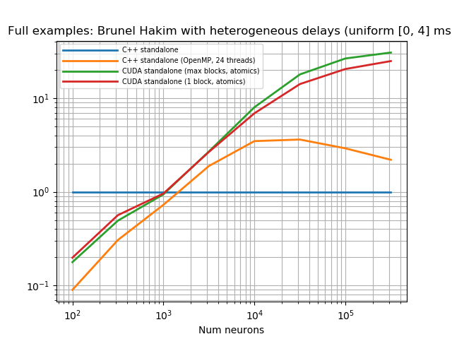


***

### BrunelHakimHeterogDelaysNarrowDistr


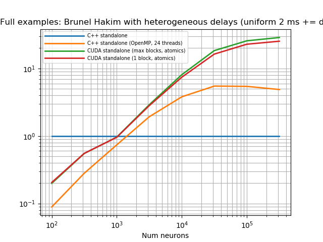


***

### BrunelHakimHomogDelays

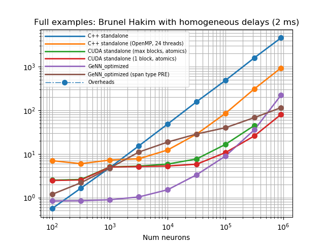
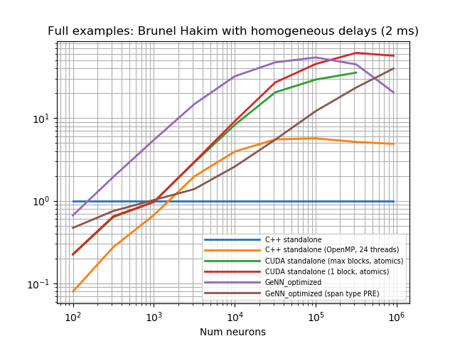


***

### COBAHHPseudocoupled1000

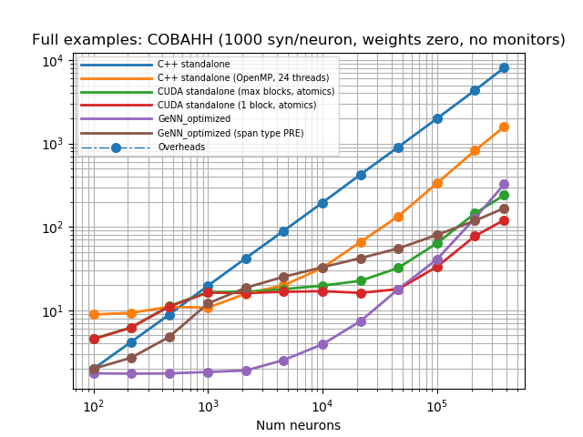
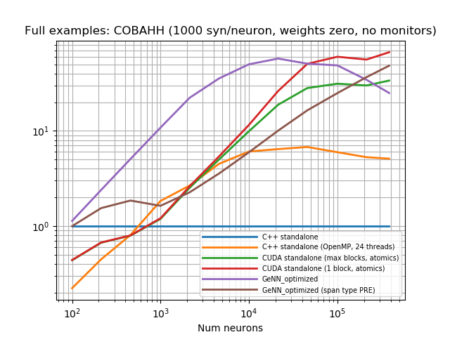


***

### COBAHHPseudocoupled80


***

### COBAHHUncoupled

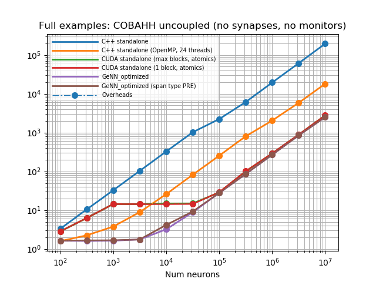


***

### MushroomBody
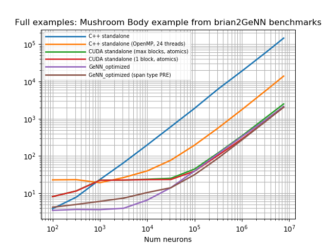

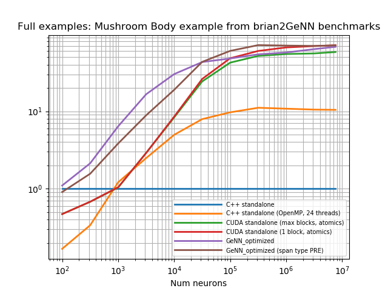


***

### STDPCUDA
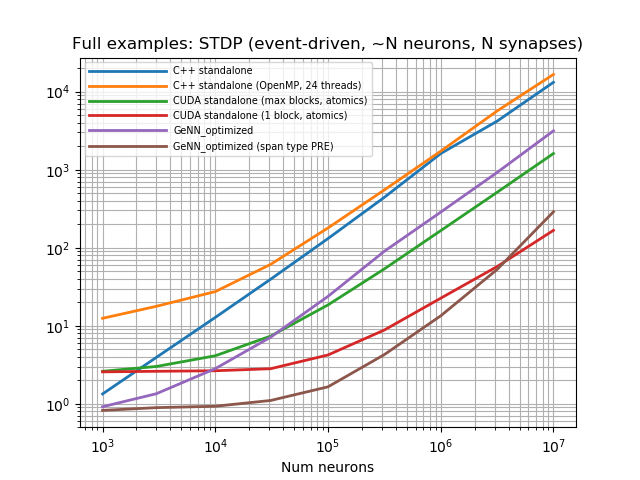


***

### STDPCUDAHeterogeneousDelays


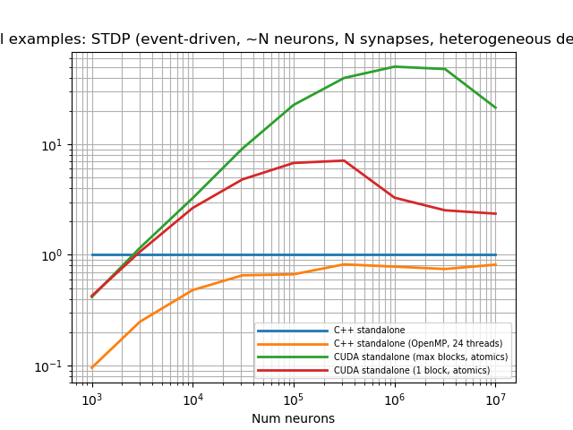


***

### STDPCUDAHomogeneousDelays

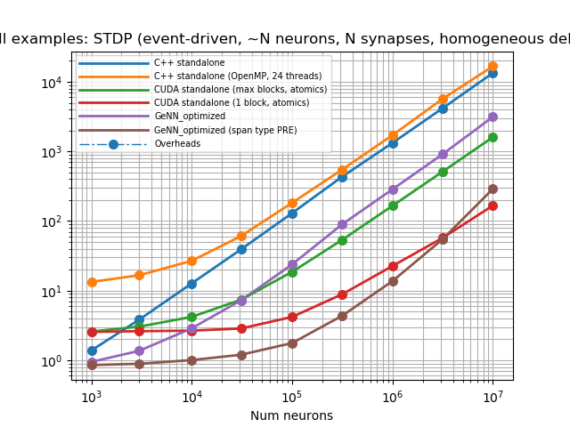


