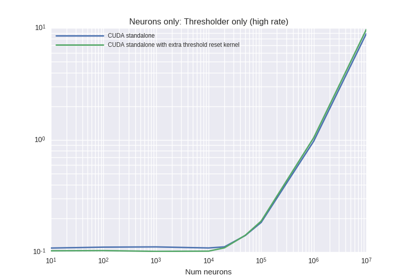

# Benchmark results from 18.05.2017
## Description:


## Last git log:
```
commit 288d89b654035a0200af5497ded8a630857fe086
Author: Denis Alevi <mail@denisalevi.de>
Date:   Thu May 18 16:46:50 2017 +0200

    Add prefs and Config for using an extra kernel for thresholder reset
    
    For checking effect on performance compared to previous usage of
    cudaMemset. Using an extra kernel would fix issue #74 by introducing a
    global synchronization.

```
There is also a `git diff` saved in the current directory.

## Results

### ThresholderOnlyPoissonHighRate


<details><summary>Examplary `nvprof` results for **CUDAStandaloneConfigurationExtraThresholdKernel**</summary><p>
Profile summary for `N = 1000`:

```
==21166== NVPROF is profiling process 21166, command: ./main
==21166== Profiling application: ./main
==21166== Profiling result:
Time(%)      Time     Calls       Avg       Min       Max  Name
 48.52%  22.334ms     10000  2.2330us  2.0480us  3.2640us  kernel_neurongroup_thresholder_codeobject(unsigned int, unsigned int, int*, double*, float*)
 32.57%  14.991ms     10000  1.4990us  1.3760us  2.2080us  _GLOBAL__N__69_tmpxft_00005187_00000000_7_neurongroup_thresholder_codeobject_cpp1_ii_70a65da3::_reset_neurongroup_thresholder_codeobject(int*)
 17.98%  8.2778ms         1  8.2778ms  8.2778ms  8.2778ms  generate_seed_pseudo(__int64, __int64, __int64, curandOrdering, curandStateXORWOW*, unsigned int*)
  0.93%  425.76us         1  425.76us  425.76us  425.76us  void gen_sequenced<curandStateXORWOW, float, int, __operator_&__(float curand_uniform_noargs<curandStateXORWOW>(curandStateXORWOW*, int))>(curandStateXORWOW*, float*, unsigned long, unsigned long, int)

==21166== API calls:
Time(%)      Time     Calls       Avg       Min       Max  Name
 86.86%  186.42ms     20002  9.3190us  8.3980us  5.6294ms  cudaLaunch
  4.97%  10.670ms     60011     177ns     144ns  316.47us  cudaSetupArgument
  3.90%  8.3784ms         1  8.3784ms  8.3784ms  8.3784ms  cudaFree
  2.66%  5.7119ms     20002     285ns     218ns  320.00us  cudaConfigureCall
  1.37%  2.9306ms     10004     292ns     163ns  322.94us  cudaGetLastError
  0.20%  419.20us         3  139.73us  122.06us  157.51us  cudaMalloc
  0.02%  46.236us         1  46.236us  46.236us  46.236us  cudaMemGetInfo
  0.01%  11.362us         1  11.362us  11.362us  11.362us  cudaDeviceSynchronize
  0.00%  9.7120us         2  4.8560us  2.2010us  7.5110us  cudaFuncGetAttributes
  0.00%  6.5280us         1  6.5280us  6.5280us  6.5280us  cudaThreadSynchronize
  0.00%  3.2590us         1  3.2590us  3.2590us  3.2590us  cudaGetDevice
  0.00%  2.7720us         2  1.3860us     534ns  2.2380us  cudaOccupancyMaxActiveBlocksPerMultiprocessorWithFlags
  0.00%  2.4080us         4     602ns     412ns  1.0020us  cudaDeviceGetAttribute

```

</p></details>


<details><summary>Examplary `nvprof` results for **CUDAStandaloneConfiguration**</summary><p>
Profile summary for `N = 1000`:

```
==20789== NVPROF is profiling process 20789, command: ./main
==20789== Profiling application: ./main
==20789== Profiling result:
Time(%)      Time     Calls       Avg       Min       Max  Name
 48.24%  30.930ms     10000  3.0920us  3.0400us  3.8720us  [CUDA memset]
 38.24%  24.519ms     10000  2.4510us  2.2720us  3.7760us  kernel_neurongroup_thresholder_codeobject(unsigned int, unsigned int, int*, double*, float*)
 12.85%  8.2417ms         1  8.2417ms  8.2417ms  8.2417ms  generate_seed_pseudo(__int64, __int64, __int64, curandOrdering, curandStateXORWOW*, unsigned int*)
  0.66%  424.74us         1  424.74us  424.74us  424.74us  void gen_sequenced<curandStateXORWOW, float, int, __operator_&__(float curand_uniform_noargs<curandStateXORWOW>(curandStateXORWOW*, int))>(curandStateXORWOW*, float*, unsigned long, unsigned long, int)

==20789== API calls:
Time(%)      Time     Calls       Avg       Min       Max  Name
 46.50%  102.26ms     10002  10.223us  8.9260us  5.7940ms  cudaLaunch
 42.55%  93.569ms     10000  9.3560us  8.4570us  980.55us  cudaMemset
  4.00%  8.7936ms     50011     175ns     147ns  319.59us  cudaSetupArgument
  3.80%  8.3497ms         1  8.3497ms  8.3497ms  8.3497ms  cudaFree
  1.70%  3.7341ms     10002     373ns     309ns  311.65us  cudaConfigureCall
  1.23%  2.7110ms     10004     270ns     183ns  1.7120us  cudaGetLastError
  0.19%  418.83us         3  139.61us  121.60us  157.57us  cudaMalloc
  0.02%  47.653us         1  47.653us  47.653us  47.653us  cudaMemGetInfo
  0.01%  11.213us         1  11.213us  11.213us  11.213us  cudaDeviceSynchronize
  0.00%  9.1830us         2  4.5910us  2.1060us  7.0770us  cudaFuncGetAttributes
  0.00%  6.6730us         1  6.6730us  6.6730us  6.6730us  cudaThreadSynchronize
  0.00%  2.6330us         2  1.3160us     525ns  2.1080us  cudaOccupancyMaxActiveBlocksPerMultiprocessorWithFlags
  0.00%  2.6220us         1  2.6220us  2.6220us  2.6220us  cudaGetDevice
  0.00%  2.3320us         4     583ns     363ns  1.0530us  cudaDeviceGetAttribute

```

</p></details>


